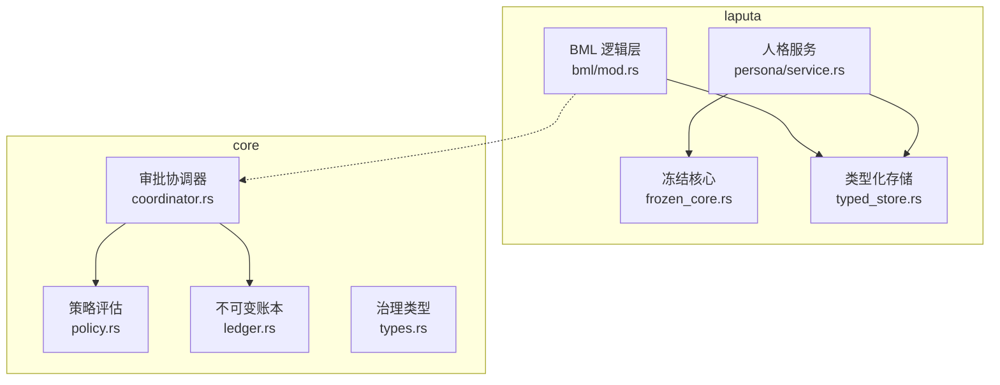
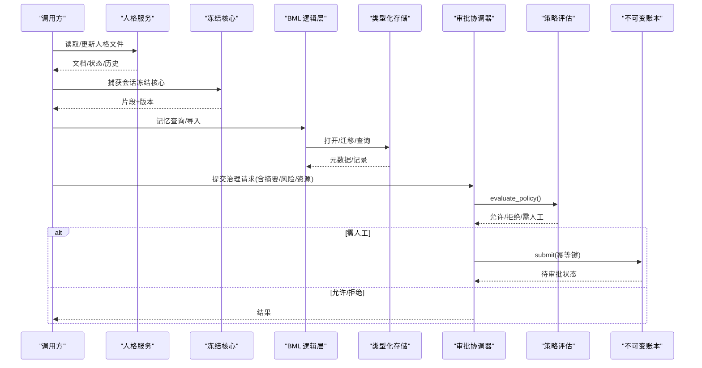
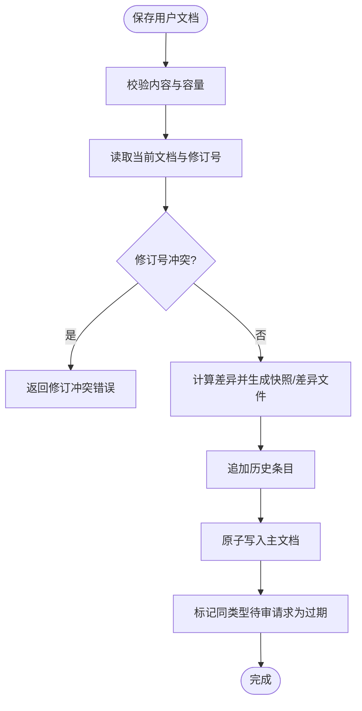
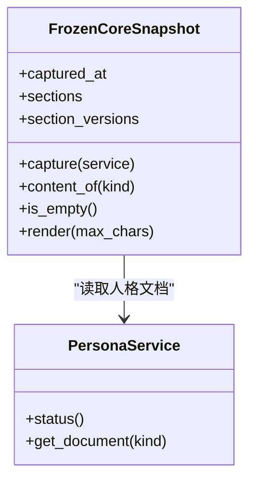
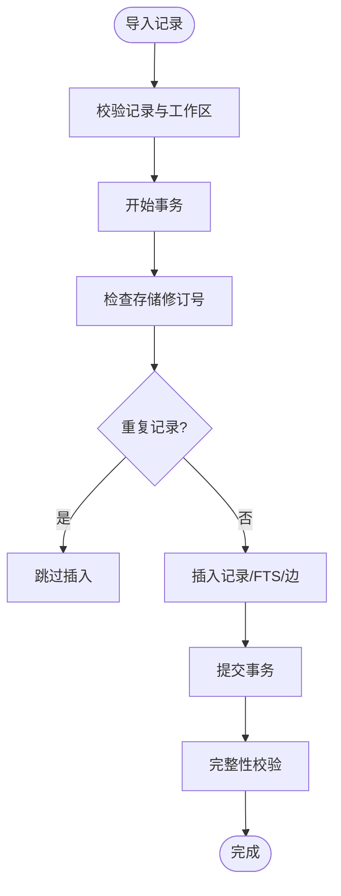
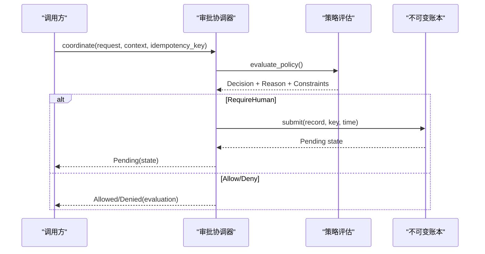
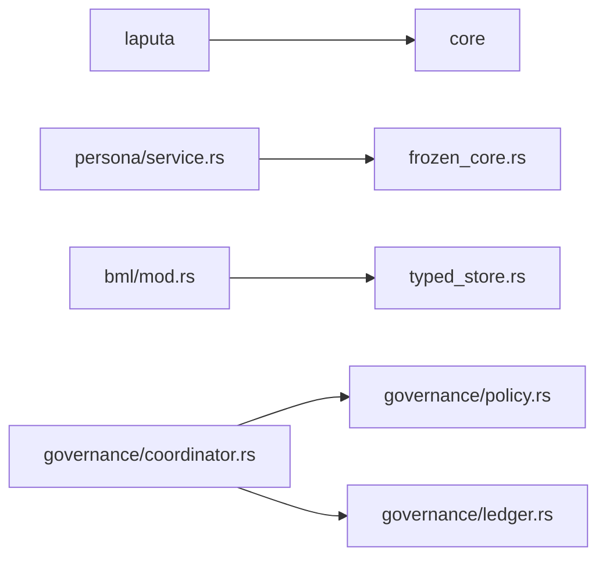

# Laputa 治理层

<cite>
**本文引用的文件**
- [agent-diva-laputa/src/lib.rs](file://agent-diva-laputa/src/lib.rs)
- [agent-diva-laputa/Cargo.toml](file://agent-diva-laputa/Cargo.toml)
- [agent-diva-core/Cargo.toml](file://agent-diva-core/Cargo.toml)
- [agent-diva-core/src/governance/mod.rs](file://agent-diva-core/src/governance/mod.rs)
- [agent-diva-core/src/governance/coordinator.rs](file://agent-diva-core/src/governance/coordinator.rs)
- [agent-diva-core/src/governance/types.rs](file://agent-diva-core/src/governance/types.rs)
- [agent-diva-core/src/governance/policy.rs](file://agent-diva-core/src/governance/policy.rs)
- [agent-diva-core/src/governance/ledger.rs](file://agent-diva-core/src/governance/ledger.rs)
- [agent-diva-laputa/src/frozen_core.rs](file://agent-diva-laputa/src/frozen_core.rs)
- [agent-diva-laputa/src/typed_store.rs](file://agent-diva-laputa/src/typed_store.rs)
- [agent-diva-laputa/src/bml/mod.rs](file://agent-diva-laputa/src/bml/mod.rs)
- [agent-diva-laputa/src/persona/service.rs](file://agent-diva-laputa/src/persona/service.rs)
</cite>

## 目录
1. [简介](#简介)
2. [项目结构](#项目结构)
3. [核心组件](#核心组件)
4. [架构总览](#架构总览)
5. [详细组件分析](#详细组件分析)
6. [依赖关系分析](#依赖关系分析)
7. [性能考虑](#性能考虑)
8. [故障排查指南](#故障排查指南)
9. [结论](#结论)
10. [附录](#附录)

## 简介
本文件面向管理员与开发者，系统化阐述 Laputa 作为“记忆治理层”的架构设计与实现要点。Laputa 以“文件即权威”的方式管理机器级人格（Persona）工作区、冻结核心快照与类型化记忆存储；通过 BML 逻辑层暴露唯一的生产型记忆权威接口，并配合 agent-diva-core 中的通用治理协议（策略评估、审批协调器、不可变账本）实现对计划、沙箱与记忆等域的可审计授权。文档同时覆盖提案生成机制、版本控制、回滚审计、蒸馏流程、监控告警与扩展接口，帮助读者在安全边界内高效配置与扩展治理功能。

## 项目结构
Laputa 由两个主要 crate 组成：
- agent-diva-laputa：文件优先的权威存储边界，包含人格服务、冻结核心、类型化 SQLite 存储与 BML 逻辑层。
- agent-diva-core：跨域的治理契约与执行骨架，包括策略评估、审批协调器与不可变审批账本。

**图表来源**
- [agent-diva-laputa/src/persona/service.rs:24-120](file://agent-diva-laputa/src/persona/service.rs#L24-L120)
- [agent-diva-laputa/src/frozen_core.rs:17-96](file://agent-diva-laputa/src/frozen_core.rs#L17-L96)
- [agent-diva-laputa/src/typed_store.rs:136-143](file://agent-diva-laputa/src/typed_store.rs#L136-L143)
- [agent-diva-laputa/src/bml/mod.rs:1-25](file://agent-diva-laputa/src/bml/mod.rs#L1-L25)
- [agent-diva-core/src/governance/policy.rs:98-205](file://agent-diva-core/src/governance/policy.rs#L98-L205)
- [agent-diva-core/src/governance/coordinator.rs:49-186](file://agent-diva-core/src/governance/coordinator.rs#L49-L186)
- [agent-diva-core/src/governance/ledger.rs:244-312](file://agent-diva-core/src/governance/ledger.rs#L244-L312)
- [agent-diva-core/src/governance/types.rs:121-161](file://agent-diva-core/src/governance/types.rs#L121-L161)

**章节来源**
- [agent-diva-laputa/src/lib.rs:1-56](file://agent-diva-laputa/src/lib.rs#L1-L56)
- [agent-diva-laputa/Cargo.toml:1-29](file://agent-diva-laputa/Cargo.toml#L1-L29)
- [agent-diva-core/Cargo.toml:1-70](file://agent-diva-core/Cargo.toml#L1-L70)

## 核心组件
- 人格系统（Persona Service）：维护机器级 Markdown 人格文件、请求审批流、历史快照与差异记录，提供初始化、修复、读写与状态查询能力。
- 冻结核心（Frozen Core）：按会话捕获人格关键段落的只读投影，支持预算裁剪与内容版本哈希，用于会话上下文稳定注入。
- 类型化存储（Typed Memory Store）：基于 SQLite + FTS5 的类型化记忆持久化，提供导入、列表、清理、完整性检查与身份迁移/回滚。
- BML 逻辑层：对外暴露唯一生产型记忆权威 MemoryHome，屏蔽底层写操作，强制非 BML 模块不得直接调用原始写入 API。
- 治理协议（Core Governance）：统一的请求/收据模型、纯函数策略评估、审批协调器与不可变事件账本，支撑跨域（计划、沙箱、记忆）可审计授权。

**章节来源**
- [agent-diva-laputa/src/persona/service.rs:24-120](file://agent-diva-laputa/src/persona/service.rs#L24-L120)
- [agent-diva-laputa/src/frozen_core.rs:17-96](file://agent-diva-laputa/src/frozen_core.rs#L17-L96)
- [agent-diva-laputa/src/typed_store.rs:136-143](file://agent-diva-laputa/src/typed_store.rs#L136-L143)
- [agent-diva-laputa/src/bml/mod.rs:1-25](file://agent-diva-laputa/src/bml/mod.rs#L1-L25)
- [agent-diva-core/src/governance/mod.rs:1-17](file://agent-diva-core/src/governance/mod.rs#L1-L17)

## 架构总览
Laputa 将“文件即权威”的人格与记忆存储与“不可变事件”的治理协议解耦。人格服务负责 Markdown 文件的原子写入与版本追踪；冻结核心为会话提供稳定的片段快照；类型化存储承载结构化记忆数据并提供迁移与回滚；BML 作为唯一入口统一访问存储。所有需要变更或高权限的操作，均通过 core 的治理协议进行策略评估与审批登记，确保可审计、幂等与可恢复。

**图表来源**
- [agent-diva-laputa/src/persona/service.rs:210-230](file://agent-diva-laputa/src/persona/service.rs#L210-L230)
- [agent-diva-laputa/src/frozen_core.rs:98-129](file://agent-diva-laputa/src/frozen_core.rs#L98-L129)
- [agent-diva-laputa/src/typed_store.rs:394-450](file://agent-diva-laputa/src/typed_store.rs#L394-L450)
- [agent-diva-core/src/governance/coordinator.rs:73-96](file://agent-diva-core/src/governance/coordinator.rs#L73-L96)
- [agent-diva-core/src/governance/policy.rs:98-205](file://agent-diva-core/src/governance/policy.rs#L98-L205)
- [agent-diva-core/src/governance/ledger.rs:486-518](file://agent-diva-core/src/governance/ledger.rs#L486-L518)

## 详细组件分析

### 人格系统（Persona Service）
- 职责：机器级人格 Markdown 的初始化、修复、读写、请求审批、历史快照与差异记录、状态视图。
- 关键点：
  - 原子写入与规范化 Markdown，避免并发冲突。
  - 基于 revision 的乐观锁，防止覆盖写入。
  - 请求生命周期：创建→待审→接受/拒绝/过期，接受后落盘并标记历史。
  - 内容容量限制与可见字符计数，保证提示词预算可控。
  - 保护规则：World 段落保护、User Preferences 保护、Agent/AutoDream 修改范围限制。

**图表来源**
- [agent-diva-laputa/src/persona/service.rs:210-230](file://agent-diva-laputa/src/persona/service.rs#L210-L230)
- [agent-diva-laputa/src/persona/service.rs:492-580](file://agent-diva-laputa/src/persona/service.rs#L492-L580)
- [agent-diva-laputa/src/persona/service.rs:612-645](file://agent-diva-laputa/src/persona/service.rs#L612-L645)

**章节来源**
- [agent-diva-laputa/src/persona/service.rs:24-120](file://agent-diva-laputa/src/persona/service.rs#L24-L120)
- [agent-diva-laputa/src/persona/service.rs:258-320](file://agent-diva-laputa/src/persona/service.rs#L258-L320)
- [agent-diva-laputa/src/persona/service.rs:346-397](file://agent-diva-laputa/src/persona/service.rs#L346-L397)
- [agent-diva-laputa/src/persona/service.rs:492-580](file://agent-diva-laputa/src/persona/service.rs#L492-L580)
- [agent-diva-laputa/src/persona/service.rs:590-645](file://agent-diva-laputa/src/persona/service.rs#L590-L645)

### 冻结核心（Frozen Core）
- 职责：按会话捕获人格关键段落的只读快照，支持预算裁剪与内容版本哈希，提供会话级投影与释放。
- 关键点：
  - 仅捕获指定 PersonaKind 的片段，并对 User 偏好做特殊处理。
  - 可见字符截断，避免超出提示词预算。
  - 会话缓存注册表，限制最大快照数量，自动淘汰最旧快照。
  - 内容版本哈希用于一致性校验。

**图表来源**
- [agent-diva-laputa/src/frozen_core.rs:17-96](file://agent-diva-laputa/src/frozen_core.rs#L17-L96)
- [agent-diva-laputa/src/frozen_core.rs:98-129](file://agent-diva-laputa/src/frozen_core.rs#L98-L129)
- [agent-diva-laputa/src/frozen_core.rs:158-180](file://agent-diva-laputa/src/frozen_core.rs#L158-L180)

**章节来源**
- [agent-diva-laputa/src/frozen_core.rs:17-96](file://agent-diva-laputa/src/frozen_core.rs#L17-L96)
- [agent-diva-laputa/src/frozen_core.rs:98-129](file://agent-diva-laputa/src/frozen_core.rs#L98-L129)
- [agent-diva-laputa/src/frozen_core.rs:158-180](file://agent-diva-laputa/src/frozen_core.rs#L158-L180)

### 类型化存储（Typed Memory Store）
- 职责：类型化的 SQLite + FTS5 记忆存储，提供打开/初始化、导入、列表、清理、完整性检查、身份迁移与回滚。
- 关键点：
  - 工作区隔离与 schema 版本校验，禁止跨工作区误用。
  - 导入事务中校验记录合法性与工作区匹配，冲突则整体回滚。
  - 会话级清理与启动时清理，保障异常退出后的数据一致性。
  - 身份迁移：备份—验证—应用—回滚，确保可逆且可审计。

**图表来源**
- [agent-diva-laputa/src/typed_store.rs:745-800](file://agent-diva-laputa/src/typed_store.rs#L745-L800)
- [agent-diva-laputa/src/typed_store.rs:673-743](file://agent-diva-laputa/src/typed_store.rs#L673-L743)
- [agent-diva-laputa/src/typed_store.rs:239-325](file://agent-diva-laputa/src/typed_store.rs#L239-L325)

**章节来源**
- [agent-diva-laputa/src/typed_store.rs:136-143](file://agent-diva-laputa/src/typed_store.rs#L136-L143)
- [agent-diva-laputa/src/typed_store.rs:394-450](file://agent-diva-laputa/src/typed_store.rs#L394-L450)
- [agent-diva-laputa/src/typed_store.rs:673-743](file://agent-diva-laputa/src/typed_store.rs#L673-L743)
- [agent-diva-laputa/src/typed_store.rs:745-800](file://agent-diva-laputa/src/typed_store.rs#L745-L800)
- [agent-diva-laputa/src/typed_store.rs:239-325](file://agent-diva-laputa/src/typed_store.rs#L239-L325)

### BML 逻辑层
- 职责：对外暴露唯一生产型记忆权威 MemoryHome，屏蔽底层写操作，强制非 BML 模块不得直接调用原始写入 API。
- 关键点：
  - 明确边界：put/import_records/gc/backup/restore 等写 API 仅限内部使用。
  - 保留 memory_apply_journal 表以维持历史兼容，但代码路径已移除。
  - 提供离线迁移词汇适配，便于从旧格式迁移到类型化存储。

**章节来源**
- [agent-diva-laputa/src/bml/mod.rs:1-25](file://agent-diva-laputa/src/bml/mod.rs#L1-L25)

### 治理协议（策略评估、审批协调器、不可变账本）
- 策略评估：纯函数，输入请求与上下文，输出允许/拒绝/需人工，附带原因码与约束。
- 审批协调器：封装提交、决策、消费、撤销、过期、分页查询等流程，保证幂等与负载剥离。
- 不可变账本：SQLite 存储不可变事件，触发器禁止更新/删除，状态由事件回放推导。

**图表来源**
- [agent-diva-core/src/governance/coordinator.rs:73-96](file://agent-diva-core/src/governance/coordinator.rs#L73-L96)
- [agent-diva-core/src/governance/policy.rs:98-205](file://agent-diva-core/src/governance/policy.rs#L98-L205)
- [agent-diva-core/src/governance/ledger.rs:486-518](file://agent-diva-core/src/governance/ledger.rs#L486-L518)

**章节来源**
- [agent-diva-core/src/governance/types.rs:121-161](file://agent-diva-core/src/governance/types.rs#L121-L161)
- [agent-diva-core/src/governance/policy.rs:98-205](file://agent-diva-core/src/governance/policy.rs#L98-L205)
- [agent-diva-core/src/governance/coordinator.rs:49-186](file://agent-diva-core/src/governance/coordinator.rs#L49-L186)
- [agent-diva-core/src/governance/ledger.rs:244-312](file://agent-diva-core/src/governance/ledger.rs#L244-L312)

## 依赖关系分析
- Laputa 依赖 core 的治理契约与执行骨架，但不耦合具体领域实现，保持跨域复用。
- 人格服务与冻结核心共享 Markdown 解析与容量限制工具。
- 类型化存储与 BML 共同构成记忆权威，BML 作为唯一入口，屏蔽底层细节。
- 审批协调器依赖策略评估与不可变账本，形成“评估—登记—决策—消费”的闭环。

**图表来源**
- [agent-diva-laputa/src/persona/service.rs:24-120](file://agent-diva-laputa/src/persona/service.rs#L24-L120)
- [agent-diva-laputa/src/frozen_core.rs:17-96](file://agent-diva-laputa/src/frozen_core.rs#L17-L96)
- [agent-diva-laputa/src/bml/mod.rs:1-25](file://agent-diva-laputa/src/bml/mod.rs#L1-L25)
- [agent-diva-core/src/governance/coordinator.rs:49-186](file://agent-diva-core/src/governance/coordinator.rs#L49-L186)
- [agent-diva-core/src/governance/policy.rs:98-205](file://agent-diva-core/src/governance/policy.rs#L98-L205)
- [agent-diva-core/src/governance/ledger.rs:244-312](file://agent-diva-core/src/governance/ledger.rs#L244-L312)

**章节来源**
- [agent-diva-laputa/Cargo.toml:11-25](file://agent-diva-laputa/Cargo.toml#L11-L25)
- [agent-diva-core/Cargo.toml:12-57](file://agent-diva-core/Cargo.toml#L12-L57)

## 性能考虑
- 冻结核心渲染预算：默认预算与按会话截取，避免过大上下文导致性能退化。
- 类型化存储：
  - WAL 模式与忙超时，提升并发写入稳定性。
  - FTS5 全文检索，注意可用性与索引维护。
  - 会话清理与启动清理，减少无用数据膨胀。
  - 导入批量事务，降低 IO 次数与锁竞争。
- 审批账本：
  - 不可变事件追加，避免复杂更新开销。
  - 幂等键与指纹，避免重复写入与冲突。
  - 分页查询限制上限，防止大结果集拖慢系统。

[本节为通用性能指导，不直接分析具体文件]

## 故障排查指南
- 人格服务：
  - 未初始化/不完整：检查必需文件是否存在与有效。
  - 修订冲突：确认 base_revision 与当前一致。
  - 内容超限：检查可见字符数与容量限制。
  - 请求过期/冲突：查看 requests 目录下的状态与时间戳。
- 类型化存储：
  - 工作区不匹配：核对 workspace_id 与数据库元数据。
  - 导入冲突：检查重复 ID 与内容不一致。
  - FTS 不可用：确认 SQLite 运行时是否启用 FTS5。
  - 身份迁移失败：检查 manifest 与备份一致性。
- 审批账本：
  - 版本冲突：确保 expected_version 与当前一致。
  - 幂等冲突：检查 idempotency_key 与操作指纹。
  - 状态非法转换：根据当前状态选择合法操作。
  - 事件回放失败：检查事件 JSON 与时间顺序。

**章节来源**
- [agent-diva-laputa/src/persona/service.rs:42-120](file://agent-diva-laputa/src/persona/service.rs#L42-L120)
- [agent-diva-laputa/src/persona/service.rs:210-230](file://agent-diva-laputa/src/persona/service.rs#L210-L230)
- [agent-diva-laputa/src/persona/service.rs:492-580](file://agent-diva-laputa/src/persona/service.rs#L492-L580)
- [agent-diva-laputa/src/typed_store.rs:146-199](file://agent-diva-laputa/src/typed_store.rs#L146-L199)
- [agent-diva-laputa/src/typed_store.rs:745-800](file://agent-diva-laputa/src/typed_store.rs#L745-L800)
- [agent-diva-core/src/governance/ledger.rs:486-518](file://agent-diva-core/src/governance/ledger.rs#L486-L518)
- [agent-diva-core/src/governance/ledger.rs:520-574](file://agent-diva-core/src/governance/ledger.rs#L520-L574)

## 结论
Laputa 通过“文件即权威”的人格与记忆存储，结合 core 的通用治理协议，实现了可审计、幂等、可回滚的记忆治理体系。人格服务提供稳健的 Markdown 工作区管理；冻结核心保障会话上下文稳定；类型化存储提供高性能、可迁移的记忆持久化；BML 作为唯一入口确保边界清晰。治理协议贯穿策略评估、审批协调与不可变账本，使跨域操作具备强一致性与可追溯性。管理员可据此配置策略与权限，开发者可基于接口扩展治理功能。

[本节为总结性内容，不直接分析具体文件]

## 附录

### 治理策略配置示例（概念性）
- 自主级别：L0/L1/L2/L3/L4，不同级别对能力与资源的允许范围不同。
- 资源与能力矩阵：例如命令执行对应命令资源，网络访问对应网络资源。
- 授权类型：一次性、会话级、规则级，影响授权有效期与适用范围。
- 安全默认：低风险的 inspect 与 plan mutate 在 L1 下可被允许。

[本节为概念性说明，不直接分析具体文件]

### 自定义策略开发指导（概念性）
- 定义请求与上下文：携带能力、资源、风险、内容摘要与证据引用。
- 实现策略评估：遵循硬拒绝、显式拒绝、限制、授权、安全默认、需人工的优先级。
- 集成审批协调器：提交请求、等待决策、消费一次性授权。
- 审计与回放：通过不可变账本事件进行审计与状态重建。

[本节为概念性说明，不直接分析具体文件]

### 监控告警与指标收集（概念性）
- 人格服务：初始化状态、文件有效性、请求积压、历史增长。
- 类型化存储：记录数、内容字节、FTS 行数、损坏记录、孤儿行。
- 审批账本：事件速率、状态分布、幂等冲突、版本冲突、过期率。
- 建议：定期导出完整性报告，设置阈值告警，结合日志与事件流进行根因分析。

[本节为概念性说明，不直接分析具体文件]