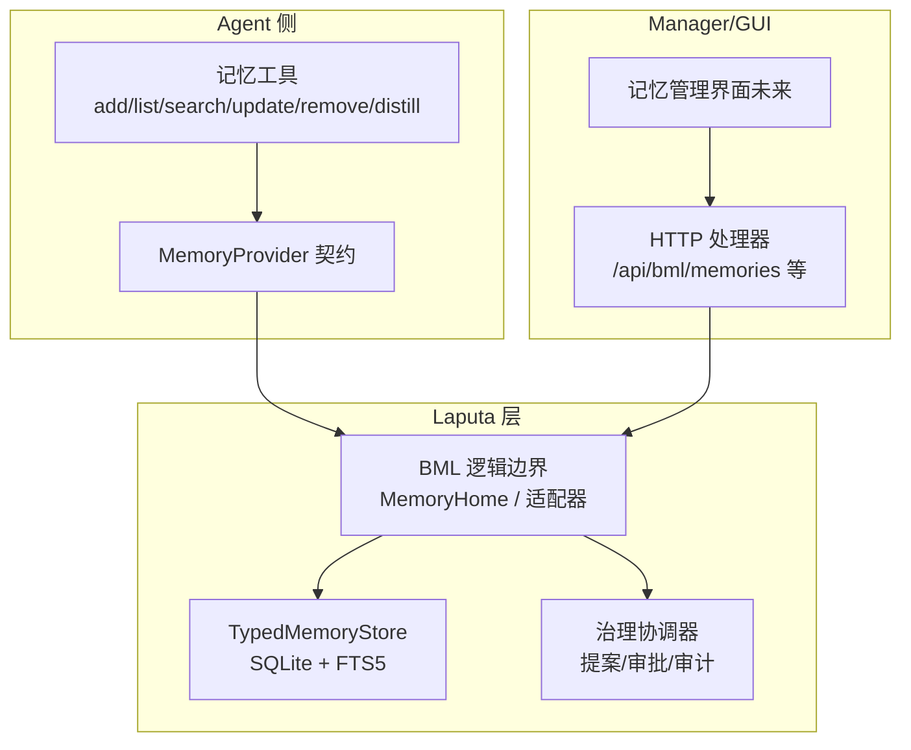
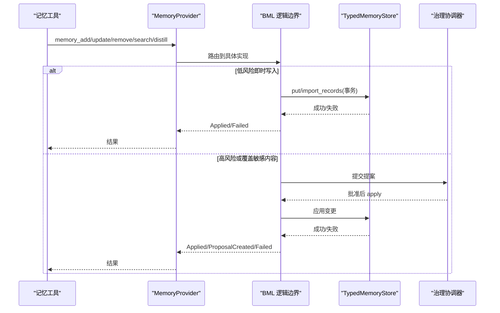
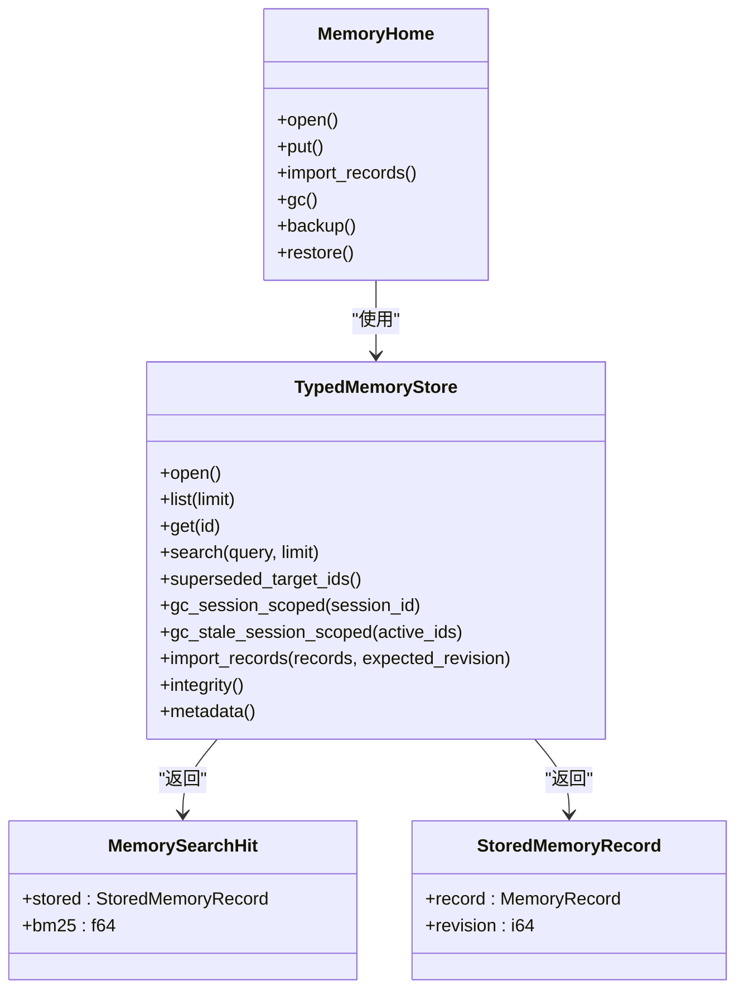
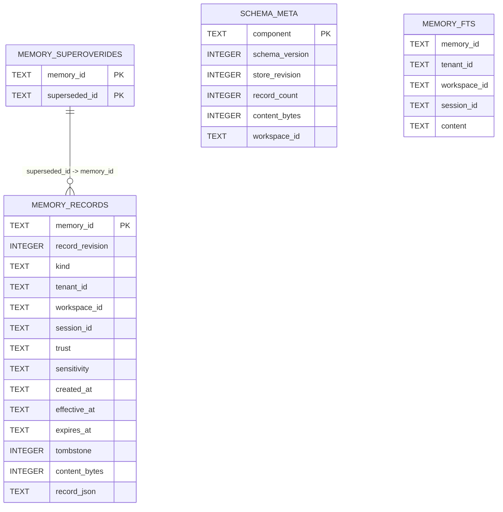
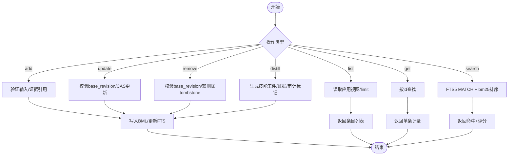
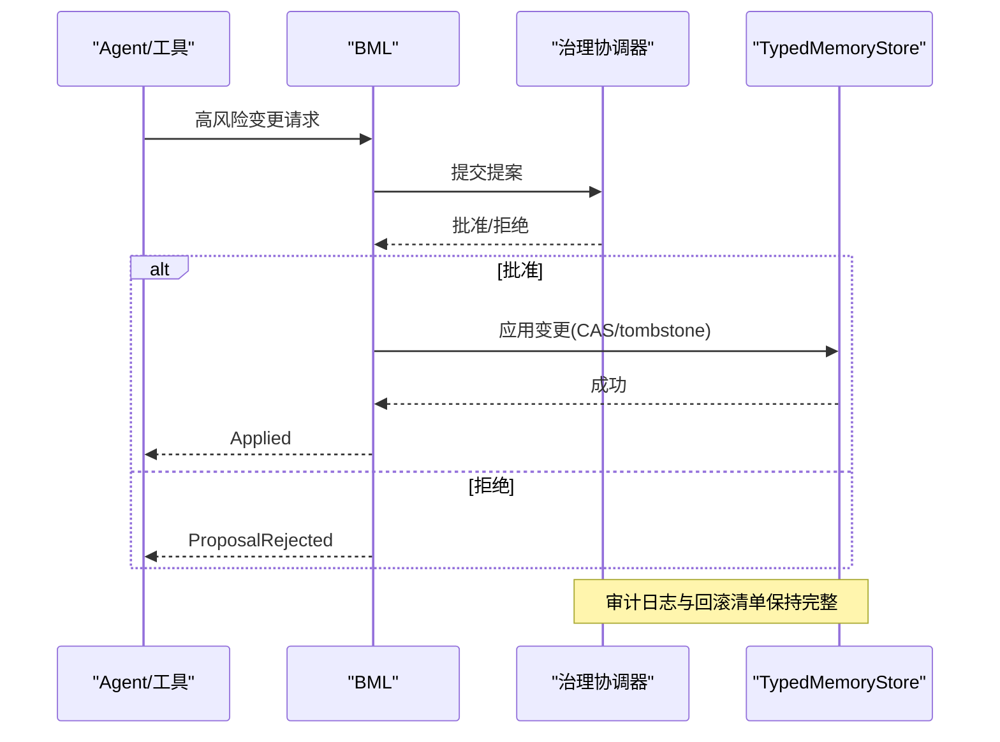
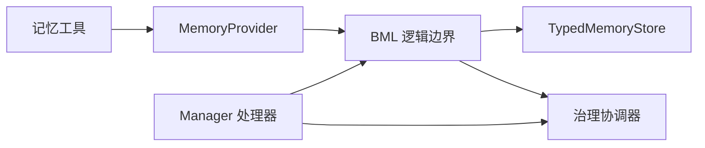

# 分层记忆系统

<cite>
**本文引用的文件**
- [agent-diva-laputa/src/lib.rs](file://agent-diva-laputa/src/lib.rs)
- [agent-diva-laputa/src/bml/mod.rs](file://agent-diva-laputa/src/bml/mod.rs)
- [agent-diva-laputa/src/typed_store.rs](file://agent-diva-laputa/src/typed_store.rs)
- [agent-diva-core/src/memory/mod.rs](file://agent-diva-core/src/memory/mod.rs)
- [agent-diva-core/src/memory/provider.rs](file://agent-diva-core/src/memory/provider.rs)
- [agent-diva-core/src/memory/crud.rs](file://agent-diva-core/src/memory/crud.rs)
- [agent-diva-tools/src/memory_add.rs](file://agent-diva-tools/src/memory_add.rs)
- [agent-diva-tools/src/memory_search.rs](file://agent-diva-tools/src/memory_search.rs)
- [agent-diva-tools/src/memory_distill.rs](file://agent-diva-tools/src/memory_distill.rs)
- [agent-diva-manager/src/handlers/memory.rs](file://agent-diva-manager/src/handlers/memory.rs)
- [agent-diva-manager/src/handlers/laputa.rs](file://agent-diva-manager/src/handlers/laputa.rs)
- [agent-diva-core/src/governance/mod.rs](file://agent-diva-core/src/governance/mod.rs)
- [docs/research/bml-layer-extraction-2026-08/bml-layer-extraction-research.md](file://docs/research/bml-layer-extraction-2026-08/bml-layer-extraction-research.md)
- [docs/logs/2026-08-context-management-enhancement/v0.0.7-bml-clean-break-docstring/summary.md](file://docs/logs/2026-08-context-management-enhancement/v0.0.7-bml-clean-break-docstring/summary.md)
</cite>

## 目录
1. [简介](#简介)
2. [项目结构](#项目结构)
3. [核心组件](#核心组件)
4. [架构总览](#架构总览)
5. [详细组件分析](#详细组件分析)
6. [依赖关系分析](#依赖关系分析)
7. [性能考虑](#性能考虑)
8. [故障排查指南](#故障排查指南)
9. [结论](#结论)
10. [附录](#附录)

## 简介
本文件面向 Agent Diva 的分层记忆系统，聚焦 BML（基础记忆层）与 Laputa（治理层）的协作关系、SQLite + FTS5 存储实现、数据类型与索引策略、记忆的 CRUD 与语义搜索、自动蒸馏机制，以及提案生成、治理审批、回滚审计等 Laputa 特性。文档同时提供配置示例、数据迁移方案、性能调优、备份恢复、数据清理与监控告警的最佳实践，并兼顾初学者理解与开发者扩展定制需求。

## 项目结构
Agent Diva 的记忆系统采用三层模型：BML（Basic Memory Layer）作为机器级权威存储；Laputa 作为人格治理层；Garden 为用户可见的管理面（当前仓库未实现）。在代码层面，BML 逻辑边界位于 `agent-diva-laputa::bml`，实际持久化由 `TypedMemoryStore`（SQLite + FTS5）实现；Agent 侧通过 `agent-diva-core::memory::provider` 暴露稳定契约，工具层以 memory_* 工具暴露 CRUD/搜索/蒸馏能力，Manager 提供 HTTP 端点与治理编排。

**图表来源**
- [agent-diva-laputa/src/bml/mod.rs:1-37](file://agent-diva-laputa/src/bml/mod.rs#L1-L37)
- [agent-diva-laputa/src/typed_store.rs:1-120](file://agent-diva-laputa/src/typed_store.rs#L1-L120)
- [agent-diva-core/src/memory/provider.rs:391-617](file://agent-diva-core/src/memory/provider.rs#L391-L617)
- [agent-diva-manager/src/handlers/memory.rs](file://agent-diva-manager/src/handlers/memory.rs)

**章节来源**
- [agent-diva-laputa/src/lib.rs:1-56](file://agent-diva-laputa/src/lib.rs#L1-L56)
- [agent-diva-core/src/memory/mod.rs:1-47](file://agent-diva-core/src/memory/mod.rs#L1-L47)
- [docs/research/bml-layer-extraction-2026-08/bml-layer-extraction-research.md:1-187](file://docs/research/bml-layer-extraction-2026-08/bml-layer-extraction-research.md#L1-L187)

## 核心组件
- BML 逻辑边界：定义机器级权威存储入口、写接口保护与迁移适配面。
- TypedMemoryStore：基于 SQLite + FTS5 的有界存储，提供记录增删改查、FTS 检索、工作记忆 GC、身份迁移与完整性检查。
- MemoryProvider：Agent 侧稳定契约，封装启动注入、意图感知预取、回合同步、会话结束钩子与记忆 CRUD。
- 记忆工具：add/list/search/update/remove/distill 等工具，统一接入 MemoryProvider。
- Manager 处理器：对外暴露记忆查询与管理端点，并与治理层协同。
- 治理模块：提案、审批、审计与回滚等通用治理契约。

**章节来源**
- [agent-diva-laputa/src/bml/mod.rs:1-37](file://agent-diva-laputa/src/bml/mod.rs#L1-L37)
- [agent-diva-laputa/src/typed_store.rs:1-120](file://agent-diva-laputa/src/typed_store.rs#L1-L120)
- [agent-diva-core/src/memory/provider.rs:391-617](file://agent-diva-core/src/memory/provider.rs#L391-L617)
- [agent-diva-core/src/memory/crud.rs:1-192](file://agent-diva-core/src/memory/crud.rs#L1-L192)
- [agent-diva-core/src/governance/mod.rs:1-17](file://agent-diva-core/src/governance/mod.rs#L1-L17)

## 架构总览
BML 是机器级权威存储层，唯一实体为 `{config_dir}/memory/memory.sqlite3`，通过 `MemoryHome` 暴露。非 BML 模块禁止直接调用原始写入接口，由边界守卫强制约束。Laputa 治理层负责提案、审批、审计与回滚；Agent 侧通过 MemoryProvider 进行启动注入、回合同步与会话生命周期管理；工具层提供用户/Agent 可操作的记忆操作；Manager 提供 HTTP 接口与治理编排。

**图表来源**
- [agent-diva-core/src/memory/provider.rs:415-617](file://agent-diva-core/src/memory/provider.rs#L415-L617)
- [agent-diva-core/src/memory/crud.rs:11-81](file://agent-diva-core/src/memory/crud.rs#L11-L81)
- [agent-diva-laputa/src/bml/mod.rs:1-37](file://agent-diva-laputa/src/bml/mod.rs#L1-L37)
- [agent-diva-core/src/governance/mod.rs:1-17](file://agent-diva-core/src/governance/mod.rs#L1-L17)

## 详细组件分析

### BML（基础记忆层）
- 职责：定义机器级权威存储入口、写接口保护、迁移适配面；确保非 BML 模块不直写底层存储。
- 关键类型：MemoryHome、TypedMemoryStore、MemorySearchHit、StoredMemoryRecord、MemoryStoreMetadata、MemoryStoreIntegrity。
- 边界规则：删除了 governed write 路径，保留 schema 以便审计；测试保障禁止重入旧路径。

**图表来源**
- [agent-diva-laputa/src/bml/mod.rs:1-37](file://agent-diva-laputa/src/bml/mod.rs#L1-L37)
- [agent-diva-laputa/src/typed_store.rs:86-112](file://agent-diva-laputa/src/typed_store.rs#L86-L112)

**章节来源**
- [agent-diva-laputa/src/bml/mod.rs:1-37](file://agent-diva-laputa/src/bml/mod.rs#L1-L37)
- [agent-diva-laputa/src/typed_store.rs:144-589](file://agent-diva-laputa/src/typed_store.rs#L144-L589)

### SQLite + FTS5 存储实现与索引策略
- 数据库位置：`{workspace_root}/.laputa/memory.sqlite3`。
- 表结构：
  - schema_meta：组件元信息、schema_version、store_revision、workspace_id。
  - memory_records：主记录表，包含 id、kind、tenant/workspace/session 标识、信任度、敏感度、时间戳、tombstone、content_bytes、record_json。
  - memory_supersedes：替代关系边，支持软删除与目标失效。
  - memory_apply_journal：保留历史 schema，用于审计与幂等。
  - memory_fts：FTS5 虚拟表，content 列启用 unicode61 分词，UNINDEXED 过滤字段提升查询效率。
- 索引策略：FTS5 倒排索引 + metadata 过滤；supersedes 外键保证一致性；WAL 模式提升并发与恢复能力。
- 容量限制：MAX_MEMORY_RECORDS=10000，MAX_MEMORY_CONTENT_BYTES=32MiB。

**图表来源**
- [agent-diva-laputa/src/typed_store.rs:476-589](file://agent-diva-laputa/src/typed_store.rs#L476-L589)

**章节来源**
- [agent-diva-laputa/src/typed_store.rs:22-76](file://agent-diva-laputa/src/typed_store.rs#L22-L76)
- [agent-diva-laputa/src/typed_store.rs:476-589](file://agent-diva-laputa/src/typed_store.rs#L476-L589)

### 数据类型与记录模型
- MemoryRecord：领域模型，包含 scope（workspace/session）、trust、sensitivity、时间戳、tombstone 等。
- MemoryEntry：对外可见条目，含 id、content、trust、provenance、evidence_refs、revision、created_at、updated_at。
- MemoryCrudOutcome：统一结果枚举，Applied/Listed/Failed，支持证据建议字段。
- 错误类型：TypedMemoryStoreError 涵盖无效记录、工作区不匹配、容量超限、FTS 不可用、导入冲突等。

**章节来源**
- [agent-diva-core/src/memory/crud.rs:11-127](file://agent-diva-core/src/memory/crud.rs#L11-L127)
- [agent-diva-laputa/src/typed_store.rs:31-76](file://agent-diva-laputa/src/typed_store.rs#L31-L76)

### 记忆的 CRUD 操作
- add：低风险即时写入，直接 put 到 BML。
- list：按 ID 序返回可见条目，支持 limit。
- get：按稳定 id 获取单条记录。
- search：基于 FTS5 全文检索，返回 BM25 评分候选。
- update/remove：CAS 更新/软删除，需 base_revision。
- distill：主动经验蒸馏，生成技能工件与证据引用。

**图表来源**
- [agent-diva-core/src/memory/crud.rs:11-81](file://agent-diva-core/src/memory/crud.rs#L11-L81)
- [agent-diva-laputa/src/typed_store.rs:615-638](file://agent-diva-laputa/src/typed_store.rs#L615-L638)

**章节来源**
- [agent-diva-core/src/memory/crud.rs:11-127](file://agent-diva-core/src/memory/crud.rs#L11-L127)
- [agent-diva-tools/src/memory_add.rs](file://agent-diva-tools/src/memory_add.rs)
- [agent-diva-tools/src/memory_search.rs](file://agent-diva-tools/src/memory_search.rs)
- [agent-diva-tools/src/memory_distill.rs](file://agent-diva-tools/src/memory_distill.rs)

### 语义搜索功能
- 使用 FTS5 虚拟表，content 列启用 unicode61 分词。
- 查询时结合 metadata 过滤（section/kind/scope），返回 BM25 评分。
- 读侧投影（启动 L1 索引、召回、搜索）会过滤被 supersedes tombstone 失效的记录。

**章节来源**
- [agent-diva-laputa/src/typed_store.rs:537-548](file://agent-diva-laputa/src/typed_store.rs#L537-L548)
- [agent-diva-laputa/src/typed_store.rs:640-662](file://agent-diva-laputa/src/typed_store.rs#L640-L662)

### 自动蒸馏机制
- 入口：MemoryDistillRequest，包含 skill_name、content、可选 evidence。
- 行为：生成技能工件（skills/<name>/SKILL.md），写入证据引用，审计标记；若失败则降级为 proposal。
- 集成：工具层 memory_distill 成功后置位标志，避免重复触发；与上下文压缩和预算控制联动。

**章节来源**
- [agent-diva-core/src/memory/crud.rs:69-81](file://agent-diva-core/src/memory/crud.rs#L69-L81)
- [agent-diva-tools/src/memory_distill.rs](file://agent-diva-tools/src/memory_distill.rs)

### Laputa 治理特性：提案、审批、回滚审计
- 提案生成：高风险或覆盖敏感内容的记忆变更进入提案流程。
- 审批：治理协调器统一处理批准/拒绝，批准后映射为 canonical MemoryRecord 并保留 provenance。
- 回滚审计：保留 apply journal 与 tombstone 历史，支持回滚到变更前状态；GUI/Manager 提供可视化与操作入口。

**图表来源**
- [agent-diva-core/src/governance/mod.rs:1-17](file://agent-diva-core/src/governance/mod.rs#L1-L17)
- [agent-diva-manager/src/handlers/laputa.rs](file://agent-diva-manager/src/handlers/laputa.rs)

**章节来源**
- [agent-diva-core/src/governance/mod.rs:1-17](file://agent-diva-core/src/governance/mod.rs#L1-L17)
- [agent-diva-manager/src/handlers/laputa.rs](file://agent-diva-manager/src/handlers/laputa.rs)

### 记忆配置示例
- 工作区根路径：`.laputa/memory.sqlite3` 所在目录。
- 容量限制：MAX_MEMORY_RECORDS=10000，MAX_MEMORY_CONTENT_BYTES=32MiB。
- 启动注入：L1 索引行数默认 30，可通过配置调整。
- 权限与信任：trust/sensitivity 字段控制可见性与注入策略。

**章节来源**
- [agent-diva-laputa/src/typed_store.rs:22-29](file://agent-diva-laputa/src/typed_store.rs#L22-L29)
- [agent-diva-core/src/memory/mod.rs:36-46](file://agent-diva-core/src/memory/mod.rs#L36-L46)

### 数据迁移方案
- 工作区身份迁移：从旧路径身份升级到规范身份，带备份与 manifest 校验。
- 迁移步骤：创建备份、读取记录、更新 workspace_id、校验完整性、提交 manifest。
- 回滚：根据 manifest 恢复备份，校验一致性后切换状态。

**章节来源**
- [agent-diva-laputa/src/typed_store.rs:201-392](file://agent-diva-laputa/src/typed_store.rs#L201-L392)

### 性能调优指南
- WAL 模式：提高并发与恢复能力。
- FTS5 分词：unicode61 适用于中英文 baseline；必要时引入 hybrid rank。
- 连接池：max_connections=4，读写锁串行化写操作。
- 容量控制：限制记录数与内容字节，避免膨胀。
- 扫描优化：FTS MATCH + metadata 过滤，减少全表扫描。

**章节来源**
- [agent-diva-laputa/src/typed_store.rs:171-179](file://agent-diva-laputa/src/typed_store.rs#L171-L179)
- [agent-diva-laputa/src/typed_store.rs:452-474](file://agent-diva-laputa/src/typed_store.rs#L452-L474)

### 备份恢复
- 备份：open_existing_database/open_existing_canonical 支持打开现有库；迁移过程自动生成备份。
- 恢复：rollback_canonical_identity 根据 manifest 恢复备份并校验一致性。
- 注意事项：备份路径不得存在；恢复前校验 store_revision 与记录计数。

**章节来源**
- [agent-diva-laputa/src/typed_store.rs:162-199](file://agent-diva-laputa/src/typed_store.rs#L162-L199)
- [agent-diva-laputa/src/typed_store.rs:327-392](file://agent-diva-laputa/src/typed_store.rs#L327-L392)

### 数据清理
- 工作记忆 GC：gc_session_scoped 物理删除 session-scoped 记录（非权威）。
- 启动清理：gc_stale_session_scoped 清理异常退出残留。
- Tombstone 过滤：读侧投影排除被 supersedes 失效的记录。

**章节来源**
- [agent-diva-laputa/src/typed_store.rs:664-743](file://agent-diva-laputa/src/typed_store.rs#L664-L743)
- [agent-diva-laputa/src/typed_store.rs:640-662](file://agent-diva-laputa/src/typed_store.rs#L640-L662)

### 监控告警
- 完整性检查：integrity() 返回 schema_version、store_revision、record_count、tombstone_count、content_bytes、fts_row_count、corrupt_record_ids、orphan_fts_rows。
- 告警阈值：连续两次显著 miss 才告警；容量超限抛出 CapacityExceeded。
- 日志与降级：FTS 不可用返回 FtsUnavailable；启动注入失败返回 Degraded 并提示原因。

**章节来源**
- [agent-diva-laputa/src/typed_store.rs:100-112](file://agent-diva-laputa/src/typed_store.rs#L100-L112)
- [agent-diva-core/src/memory/provider.rs:22-65](file://agent-diva-core/src/memory/provider.rs#L22-L65)

## 依赖关系分析
- Agent 工具依赖 MemoryProvider 契约，不直接访问存储。
- BML 逻辑边界封装 TypedMemoryStore，禁止非 BML 模块直写。
- Manager 处理器暴露 HTTP 端点，与治理层协同。
- 治理模块提供通用提案/审批/审计契约。

**图表来源**
- [agent-diva-core/src/memory/provider.rs:391-617](file://agent-diva-core/src/memory/provider.rs#L391-L617)
- [agent-diva-laputa/src/bml/mod.rs:1-37](file://agent-diva-laputa/src/bml/mod.rs#L1-L37)
- [agent-diva-core/src/governance/mod.rs:1-17](file://agent-diva-core/src/governance/mod.rs#L1-L17)

**章节来源**
- [agent-diva-core/src/memory/provider.rs:391-617](file://agent-diva-core/src/memory/provider.rs#L391-L617)
- [agent-diva-laputa/src/bml/mod.rs:1-37](file://agent-diva-laputa/src/bml/mod.rs#L1-L37)
- [agent-diva-core/src/governance/mod.rs:1-17](file://agent-diva-core/src/governance/mod.rs#L1-L17)

## 性能考虑
- 使用 FTS5 倒排索引提升检索性能，结合 metadata 过滤减少扫描范围。
- WAL 模式与连接池优化并发与恢复。
- 容量限制防止数据库膨胀，定期 GC 清理工作记忆。
- 启动注入使用 L1 索引而非全文，降低 prompt 体积。
- 连续缓存 miss 才告警，避免误报。

[本节提供一般性指导，无需特定文件分析]

## 故障排查指南
- FTS 不可用：检查 SQLite 运行时是否启用 FTS5 扩展。
- 工作区不匹配：确认 workspace_id 与数据库一致。
- 容量超限：检查 MAX_MEMORY_RECORDS 与 MAX_MEMORY_CONTENT_BYTES。
- 导入冲突：检查 record_id 与 canonical JSON 一致性。
- 启动注入失败：查看 Degraded 状态中的 reason 字段。

**章节来源**
- [agent-diva-laputa/src/typed_store.rs:31-76](file://agent-diva-laputa/src/typed_store.rs#L31-L76)
- [agent-diva-core/src/memory/provider.rs:22-65](file://agent-diva-core/src/memory/provider.rs#L22-L65)

## 结论
Agent Diva 的分层记忆系统通过 BML 与 Laputa 的清晰分工，实现了安全、可控、可扩展的记忆存储与治理。SQLite + FTS5 提供了可靠的持久化与检索能力，配合 CAS、tombstone、GC 与迁移机制，保障了数据一致性与可维护性。工具层与 Manager 提供了易用的操作面，治理层确保了高风险变更的可审计与可回滚。未来可在此基础上扩展语义检索增强与 GUI 管理面。

[本节总结无特定文件分析]

## 附录
- 术语澄清：BML = 基础记忆层；Laputa = 治理层；Garden = 用户可见管理面（未实现）。
- 决策背景：D3 冻结三层模型，BML 实体唯一归属 `.laputa/memory.sqlite3`。
- 边界守卫：非 BML 模块禁止直写存储，测试保障不重入旧路径。

**章节来源**
- [docs/research/bml-layer-extraction-2026-08/bml-layer-extraction-research.md:1-187](file://docs/research/bml-layer-extraction-2026-08/bml-layer-extraction-research.md#L1-L187)
- [docs/logs/2026-08-context-management-enhancement/v0.0.7-bml-clean-break-docstring/summary.md:1-6](file://docs/logs/2026-08-context-management-enhancement/v0.0.7-bml-clean-break-docstring/summary.md#L1-L6)