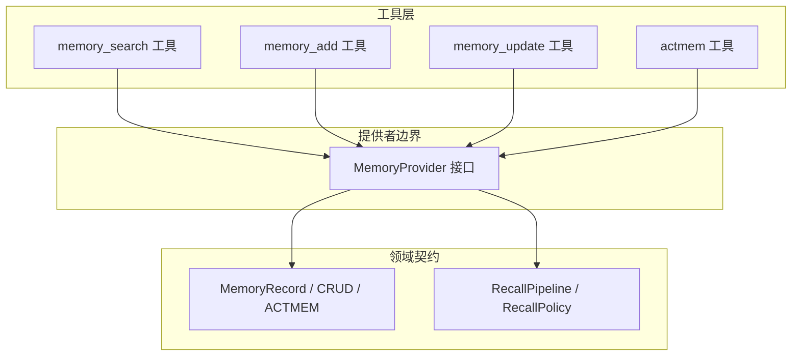
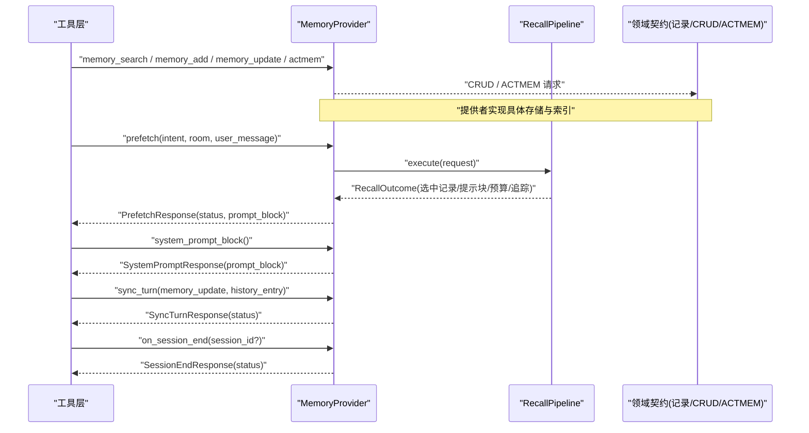
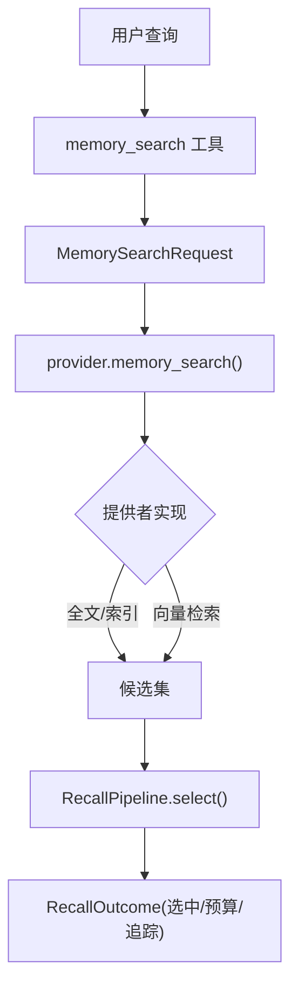
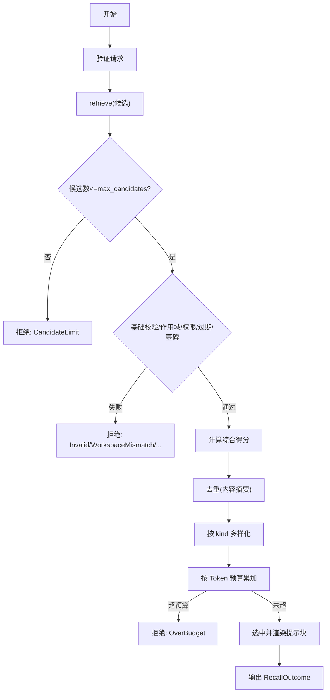
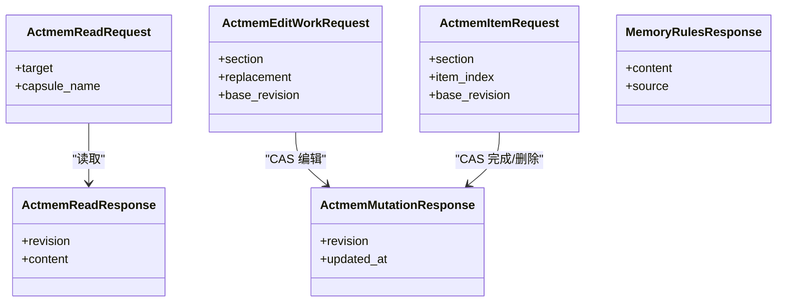
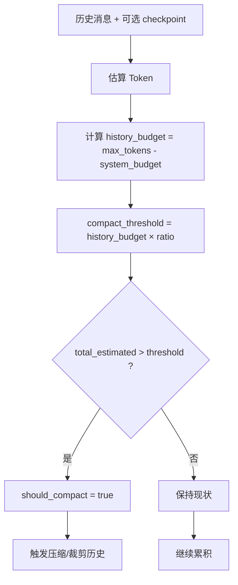
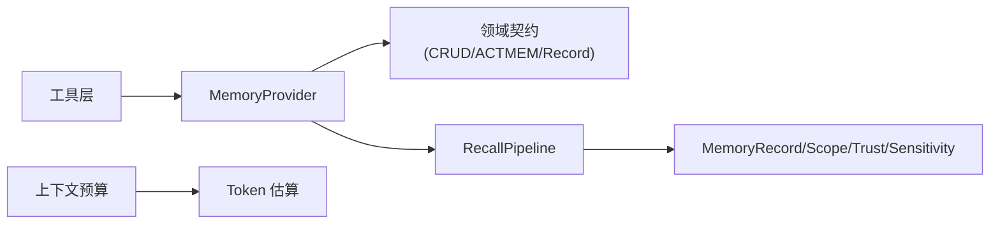

# 记忆操作与检索

<cite>
**本文引用的文件**
- [agent-diva-core/src/memory/mod.rs](file://agent-diva-core/src/memory/mod.rs)
- [agent-diva-core/src/memory/actmem.rs](file://agent-diva-core/src/memory/actmem.rs)
- [agent-diva-core/src/memory/provider.rs](file://agent-diva-core/src/memory/provider.rs)
- [agent-diva-core/src/memory/recall.rs](file://agent-diva-core/src/memory/recall.rs)
- [agent-diva-core/src/memory/crud.rs](file://agent-diva-core/src/memory/crud.rs)
- [agent-diva-core/src/memory/record.rs](file://agent-diva-core/src/memory/record.rs)
- [agent-diva-tools/src/memory_search.rs](file://agent-diva-tools/src/memory_search.rs)
- [agent-diva-tools/src/memory_add.rs](file://agent-diva-tools/src/memory_add.rs)
- [agent-diva-tools/src/memory_update.rs](file://agent-diva-tools/src/memory_update.rs)
- [agent-diva-tools/src/actmem.rs](file://agent-diva-tools/src/actmem.rs)
- [agent-diva-agent/src/context_budget.rs](file://agent-diva-agent/src/context_budget.rs)
- [agent-diva-core/src/token_ledger/budget.rs](file://agent-diva-core/src/token_ledger/budget.rs)
</cite>

## 目录
1. [简介](#简介)
2. [项目结构](#项目结构)
3. [核心组件](#核心组件)
4. [架构总览](#架构总览)
5. [详细组件分析](#详细组件分析)
6. [依赖关系分析](#依赖关系分析)
7. [性能考量](#性能考量)
8. [故障排查指南](#故障排查指南)
9. [结论](#结论)
10. [附录](#附录)

## 简介
本文件面向开发者，系统化说明 Agent-Diva 的记忆操作与检索能力，重点覆盖：
- 语义搜索（Semantic Search）的实现机制：候选召回、相似度与排序、预算控制。
- 回忆管道（Recall Pipeline）的工作流程：候选筛选、相关性评分、最终选择策略。
- ACTMEM（活动记忆）的操作接口：读取、编辑与工作区同步。
- 记忆预算管理与上下文窗口优化：Token 估算、优先级排序、内存控制。
- API 使用示例：查询构建、过滤条件、结果处理。
- 缓存策略与性能优化：预取、批量、异步。
- 错误处理模式与调试工具。
- 自定义检索策略与扩展搜索功能的指导。

## 项目结构
记忆系统由“领域契约 + 提供者边界 + 工具层”三层构成：
- 领域契约：定义记录模型、CRUD 请求/响应、ACTMEM 协议、召回管道与策略。
- 提供者边界：MemoryProvider 抽象，将上层调用与具体后端解耦。
- 工具层：暴露 memory_search、memory_add、memory_update、actmem 等工具，供代理在对话中调用。

**图表来源**
- [agent-diva-tools/src/memory_search.rs:1-105](file://agent-diva-tools/src/memory_search.rs#L1-L105)
- [agent-diva-tools/src/memory_add.rs:1-114](file://agent-diva-tools/src/memory_add.rs#L1-L114)
- [agent-diva-tools/src/memory_update.rs:1-105](file://agent-diva-tools/src/memory_update.rs#L1-L105)
- [agent-diva-tools/src/actmem.rs:1-68](file://agent-diva-tools/src/actmem.rs#L1-L68)
- [agent-diva-core/src/memory/provider.rs:414-617](file://agent-diva-core/src/memory/provider.rs#L414-L617)
- [agent-diva-core/src/memory/crud.rs:1-192](file://agent-diva-core/src/memory/crud.rs#L1-L192)
- [agent-diva-core/src/memory/actmem.rs:1-51](file://agent-diva-core/src/memory/actmem.rs#L1-L51)
- [agent-diva-core/src/memory/recall.rs:1-200](file://agent-diva-core/src/memory/recall.rs#L1-L200)

**章节来源**
- [agent-diva-core/src/memory/mod.rs:1-47](file://agent-diva-core/src/memory/mod.rs#L1-L47)

## 核心组件
- MemoryRecord：标准化记忆记录，包含种类、信任度、敏感度、范围、时间戳、证据引用、失效与墓碑标记等。
- CRUD 契约：提供 add/list/get/search/update/remove/distill 等操作的请求/响应类型与统一结果枚举。
- ACTMEM 协议：定义 Pulse/Recap/Work/Head/Capsules/Capsule 等目标及读写/编辑工作区的 CAS 协议。
- Provider 边界：MemoryProvider 暴露 system_prompt_block、prefetch、sync_turn、on_session_end 以及 CRUD/ACTMEM 的可选实现。
- RecallPipeline：确定性召回与选择管线，负责候选收集、过滤、评分、去重、多样性、预算控制与输出组装。

**章节来源**
- [agent-diva-core/src/memory/record.rs:1-200](file://agent-diva-core/src/memory/record.rs#L1-L200)
- [agent-diva-core/src/memory/crud.rs:1-192](file://agent-diva-core/src/memory/crud.rs#L1-L192)
- [agent-diva-core/src/memory/actmem.rs:1-51](file://agent-diva-core/src/memory/actmem.rs#L1-L51)
- [agent-diva-core/src/memory/provider.rs:22-142](file://agent-diva-core/src/memory/provider.rs#L22-L142)
- [agent-diva-core/src/memory/recall.rs:1-200](file://agent-diva-core/src/memory/recall.rs#L1-L200)

## 架构总览
下图展示从工具到提供者再到领域契约的调用链，以及启动/会话生命周期中的关键阶段。

**图表来源**
- [agent-diva-core/src/memory/provider.rs:414-617](file://agent-diva-core/src/memory/provider.rs#L414-L617)
- [agent-diva-core/src/memory/recall.rs:218-359](file://agent-diva-core/src/memory/recall.rs#L218-L359)
- [agent-diva-tools/src/memory_search.rs:41-79](file://agent-diva-tools/src/memory_search.rs#L41-L79)
- [agent-diva-tools/src/memory_add.rs:41-88](file://agent-diva-tools/src/memory_add.rs#L41-L88)
- [agent-diva-tools/src/memory_update.rs:41-79](file://agent-diva-tools/src/memory_update.rs#L41-L79)
- [agent-diva-tools/src/actmem.rs:32-66](file://agent-diva-tools/src/actmem.rs#L32-L66)

## 详细组件分析

### 语义搜索与向量检索
- 当前代码库未直接实现向量嵌入与相似度计算；语义搜索通过“文本匹配 + 索引/提供者实现”完成。
- 工具层暴露 memory_search，内部构造 MemorySearchRequest 并调用 provider.memory_search。
- 提供者可基于倒排索引、全文检索或外部向量服务实现候选召回；召回后进入 RecallPipeline 进行确定性的选择与预算控制。

**图表来源**
- [agent-diva-tools/src/memory_search.rs:41-79](file://agent-diva-tools/src/memory_search.rs#L41-L79)
- [agent-diva-core/src/memory/provider.rs:501-508](file://agent-diva-core/src/memory/provider.rs#L501-L508)
- [agent-diva-core/src/memory/recall.rs:218-359](file://agent-diva-core/src/memory/recall.rs#L218-L359)

**章节来源**
- [agent-diva-tools/src/memory_search.rs:1-105](file://agent-diva-tools/src/memory_search.rs#L1-L105)
- [agent-diva-core/src/memory/provider.rs:501-508](file://agent-diva-core/src/memory/provider.rs#L501-L508)

### 回忆管道（Recall Pipeline）
- 输入：RecallRequest（query/scope/correlation/now/token_budget/max_candidates/policy）。
- 候选来源：RecallCandidateSource.retrieve 返回 RecallCandidate（含 relevance_bps/retrieval_source）。
- 过滤阶段：
  - 基本校验：max_candidates 上限、relevance_bps 合法、source 非 Unknown。
  - 作用域与权限：tenant/workspace/session 匹配、过期检查、墓碑检查、信任与敏感度白名单。
- 评分与排序：
  - 综合得分 = 相关性权重(55) + 重要性权重(20) + 新鲜度权重(15) + 人格相关权重(10)。
  - 重要性由 trust/kind/confidence 推导；新鲜度按有效天数衰减；人格相关通过关键词匹配。
- 去重与多样性：
  - 内容摘要去重；按 kind 多样化保留。
- 预算控制：
  - 保守 Token 估算（字符数/3 向上取整），累计不超过 token_budget。
- 输出：
  - RecallOutcome(selected_records/prompt_block/budget/trace/status/failure)。

**图表来源**
- [agent-diva-core/src/memory/recall.rs:218-359](file://agent-diva-core/src/memory/recall.rs#L218-L359)
- [agent-diva-core/src/memory/recall.rs:400-489](file://agent-diva-core/src/memory/recall.rs#L400-L489)
- [agent-diva-core/src/memory/recall.rs:509-583](file://agent-diva-core/src/memory/recall.rs#L509-L583)

**章节来源**
- [agent-diva-core/src/memory/recall.rs:1-200](file://agent-diva-core/src/memory/recall.rs#L1-L200)
- [agent-diva-core/src/memory/recall.rs:218-359](file://agent-diva-core/src/memory/recall.rs#L218-L359)
- [agent-diva-core/src/memory/recall.rs:400-489](file://agent-diva-core/src/memory/recall.rs#L400-L489)
- [agent-diva-core/src/memory/recall.rs:509-583](file://agent-diva-core/src/memory/recall.rs#L509-L583)

### ACTMEM（活动记忆）操作接口
- 读取目标：Pulse、Recap、Work、Head、Capsules、Capsule。
- 读接口：ActmemReadRequest -> ActmemReadResponse(revision/content)。
- 写接口：
  - ActmemEditWorkRequest：以 base_revision 为 CAS 替换 Work 子节。
  - ActmemItemRequest：完成/删除某项（complete/drop），同样基于 revision 的 CAS。
- 规则接口：MemoryRulesResponse 提供写入手册用于注入。
- 工具封装：actmem 工具暴露受限只读访问；编辑与完成/删除可通过 provider 扩展。

**图表来源**
- [agent-diva-core/src/memory/actmem.rs:1-51](file://agent-diva-core/src/memory/actmem.rs#L1-L51)
- [agent-diva-core/src/memory/provider.rs:528-560](file://agent-diva-core/src/memory/provider.rs#L528-L560)
- [agent-diva-tools/src/actmem.rs:32-66](file://agent-diva-tools/src/actmem.rs#L32-L66)

**章节来源**
- [agent-diva-core/src/memory/actmem.rs:1-51](file://agent-diva-core/src/memory/actmem.rs#L1-L51)
- [agent-diva-core/src/memory/provider.rs:528-560](file://agent-diva-core/src/memory/provider.rs#L528-L560)
- [agent-diva-tools/src/actmem.rs:1-68](file://agent-diva-tools/src/actmem.rs#L1-L68)

### 记忆预算管理与上下文窗口优化
- 上下文预算：
  - BudgetConfig：max_tokens/system_budget_ratio/compact_threshold_ratio/keep_recent_count。
  - check_context_budget：估算历史消息与 checkpoint 的 Token，计算压力比，决定是否触发压缩。
- Token 估算：
  - 保守估算：字符数/3 向上取整，避免高估导致溢出。
- 会话级 Token 预算：
  - token_ledger 记录会话累计 Token，check_budget 超过限制则返回致命错误。

**图表来源**
- [agent-diva-agent/src/context_budget.rs:25-112](file://agent-diva-agent/src/context_budget.rs#L25-L112)
- [agent-diva-agent/src/context_budget.rs:164-207](file://agent-diva-agent/src/context_budget.rs#L164-L207)
- [agent-diva-core/src/memory/recall.rs:394-398](file://agent-diva-core/src/memory/recall.rs#L394-L398)
- [agent-diva-core/src/token_ledger/budget.rs:23-64](file://agent-diva-core/src/token_ledger/budget.rs#L23-L64)

**章节来源**
- [agent-diva-agent/src/context_budget.rs:25-112](file://agent-diva-agent/src/context_budget.rs#L25-L112)
- [agent-diva-agent/src/context_budget.rs:164-207](file://agent-diva-agent/src/context_budget.rs#L164-L207)
- [agent-diva-core/src/memory/recall.rs:394-398](file://agent-diva-core/src/memory/recall.rs#L394-L398)
- [agent-diva-core/src/token_ledger/budget.rs:1-172](file://agent-diva-core/src/token_ledger/budget.rs#L1-L172)

### API 使用示例
- 搜索查询构建：
  - 使用 memory_search 工具，参数 query 必填，limit 可选。
  - 示例路径：[memory_search 工具参数定义:51-53](file://agent-diva-tools/src/memory_search.rs#L51-L53)
- 过滤条件设置：
  - 通过 RecallPolicy 限定 allowed_trust 与 allowed_sensitivity。
  - 示例路径：[RecallPolicy 默认策略:37-56](file://agent-diva-core/src/memory/recall.rs#L37-L56)
- 结果处理：
  - 解析 RecallOutcome 中的 selected_records、prompt_block、budget、trace。
  - 示例路径：[RecallOutcome 结构:147-156](file://agent-diva-core/src/memory/recall.rs#L147-L156)
- 写入与更新：
  - memory_add：添加事实/偏好，支持 evidence_refs。
  - memory_update：基于 base_revision 的 CAS 更新。
  - 示例路径：[memory_add 工具:51-62](file://agent-diva-tools/src/memory_add.rs#L51-L62)、[memory_update 工具:51-53](file://agent-diva-tools/src/memory_update.rs#L51-L53)
- ACTMEM 读取：
  - actmem 工具 target 枚举：pulse/recap/work/head/capsules/capsule。
  - 示例路径：[actmem 工具参数:42-51](file://agent-diva-tools/src/actmem.rs#L42-L51)

**章节来源**
- [agent-diva-tools/src/memory_search.rs:51-53](file://agent-diva-tools/src/memory_search.rs#L51-L53)
- [agent-diva-core/src/memory/recall.rs:37-56](file://agent-diva-core/src/memory/recall.rs#L37-L56)
- [agent-diva-core/src/memory/recall.rs:147-156](file://agent-diva-core/src/memory/recall.rs#L147-L156)
- [agent-diva-tools/src/memory_add.rs:51-62](file://agent-diva-tools/src/memory_add.rs#L51-L62)
- [agent-diva-tools/src/memory_update.rs:51-53](file://agent-diva-tools/src/memory_update.rs#L51-L53)
- [agent-diva-tools/src/actmem.rs:42-51](file://agent-diva-tools/src/actmem.rs#L42-L51)

### 缓存策略与性能优化
- 预取（Prefetch）：
  - 在对话轮次中根据 intent/current_room/user_message 进行意图感知预取，快速注入上下文。
  - 示例路径：[PrefetchRequest/PrefetchResponse](file://agent-diva-core/src/memory/provider.rs:281-314)
- 批量操作：
  - 通过 RecallPipeline 一次性处理候选集合，减少往返；CRUD 列表接口支持 limit。
  - 示例路径：[RecallPipeline.select](file://agent-diva-core/src/memory/recall.rs:237-359)、[MemoryListRequest](file://agent-diva-core/src/memory/crud.rs:21-26)
- 异步处理：
  - prefetch/sync_turn/on_session_end 均为异步，避免阻塞主循环。
  - 示例路径：[MemoryProvider 异步方法](file://agent-diva-core/src/memory/provider.rs:439-617)
- 启动快照：
  - StartupContextSnapshot 将多源信息合并为紧凑 Markdown 注入系统提示，减少重复加载。
  - 示例路径：[StartupContextSnapshot.render_compact_markdown](file://agent-diva-core/src/memory/provider.rs:158-179)

**章节来源**
- [agent-diva-core/src/memory/provider.rs:281-314](file://agent-diva-core/src/memory/provider.rs#L281-L314)
- [agent-diva-core/src/memory/recall.rs:237-359](file://agent-diva-core/src/memory/recall.rs#L237-L359)
- [agent-diva-core/src/memory/crud.rs:21-26](file://agent-diva-core/src/memory/crud.rs#L21-L26)
- [agent-diva-core/src/memory/provider.rs:439-617](file://agent-diva-core/src/memory/provider.rs#L439-L617)
- [agent-diva-core/src/memory/provider.rs:158-179](file://agent-diva-core/src/memory/provider.rs#L158-L179)

### 错误处理模式与调试工具
- 请求校验错误：
  - RecallValidationError：缺失字段、未知信任/敏感度、非法候选上限。
  - 示例路径：[RecallValidationError](file://agent-diva-core/src/memory/recall.rs:171-183)
- 来源不可用降级：
  - 召回失败时返回 Degraded 状态与空结果，保证会话继续。
  - 示例路径：[RecallPipeline.execute 降级逻辑](file://agent-diva-core/src/memory/recall.rs:218-234)
- 工具层错误：
  - 无 provider/workspace 时返回 failed；参数解析失败返回 ToolError。
  - 示例路径：[memory_search 工具错误分支](file://agent-diva-tools/src/memory_search.rs:55-79)
- 会话 Token 预算超限：
  - BudgetExceeded 分类为 Fatal，携带 session_id/used/limit。
  - 示例路径：[BudgetExceeded](file://agent-diva-core/src/token_ledger/budget.rs:8-21)

**章节来源**
- [agent-diva-core/src/memory/recall.rs:171-183](file://agent-diva-core/src/memory/recall.rs#L171-L183)
- [agent-diva-core/src/memory/recall.rs:218-234](file://agent-diva-core/src/memory/recall.rs#L218-L234)
- [agent-diva-tools/src/memory_search.rs:55-79](file://agent-diva-tools/src/memory_search.rs#L55-L79)
- [agent-diva-core/src/token_ledger/budget.rs:8-21](file://agent-diva-core/src/token_ledger/budget.rs#L8-L21)

### 自定义检索策略与扩展搜索功能
- 实现 RecallCandidateSource：
  - 自定义 retrieve 方法，返回 RecallCandidate 列表，可集成向量检索、全文索引或混合索引。
  - 示例路径：[RecallCandidateSource 接口](file://agent-diva-core/src/memory/recall.rs:190-197)
- 替换 Token 估算器：
  - 实现 RecallTokenEstimator，传入 select_with_estimator 以适配不同分词器。
  - 示例路径：[RecallTokenEstimator 接口](file://agent-diva-core/src/memory/recall.rs:199-212)
- 调整 RecallPolicy：
  - 配置 allowed_trust/allowed_sensitivity，实现最小权限注入。
  - 示例路径：[RecallPolicy.default_prompt](file://agent-diva-core/src/memory/recall.rs:44-56)
- 扩展 MemoryProvider：
  - 实现 memory_search/memory_add/memory_update 等方法，对接后端存储与索引。
  - 示例路径：[MemoryProvider CRUD 方法](file://agent-diva-core/src/memory/provider.rs:475-526)

**章节来源**
- [agent-diva-core/src/memory/recall.rs:190-212](file://agent-diva-core/src/memory/recall.rs#L190-L212)
- [agent-diva-core/src/memory/recall.rs:44-56](file://agent-diva-core/src/memory/recall.rs#L44-L56)
- [agent-diva-core/src/memory/provider.rs:475-526](file://agent-diva-core/src/memory/provider.rs#L475-L526)

## 依赖关系分析
- 工具层依赖 MemoryProvider 接口，不直接依赖后端实现。
- Provider 依赖领域契约（CRUD/ACTMEM/Recall），保持领域稳定。
- RecallPipeline 依赖 MemoryRecord、MemoryScope、MemoryTrust、MemorySensitivity 等类型。
- 上下文预算模块依赖 token_estimate 与配置，独立于记忆子系统。

**图表来源**
- [agent-diva-tools/src/memory_search.rs:1-105](file://agent-diva-tools/src/memory_search.rs#L1-L105)
- [agent-diva-core/src/memory/provider.rs:414-617](file://agent-diva-core/src/memory/provider.rs#L414-L617)
- [agent-diva-core/src/memory/recall.rs:1-200](file://agent-diva-core/src/memory/recall.rs#L1-L200)
- [agent-diva-core/src/memory/record.rs:1-200](file://agent-diva-core/src/memory/record.rs#L1-L200)
- [agent-diva-agent/src/context_budget.rs:25-112](file://agent-diva-agent/src/context_budget.rs#L25-L112)

**章节来源**
- [agent-diva-core/src/memory/mod.rs:1-47](file://agent-diva-core/src/memory/mod.rs#L1-L47)

## 性能考量
- 候选数量限制：通过 max_candidates 控制召回规模，避免后续评分与渲染开销。
- 去重与多样性：内容摘要去重与 kind 多样化降低冗余，提升提示质量。
- 预算控制：保守 Token 估算与累计预算防止上下文溢出。
- 异步化：预取、同步与会话结束钩子均异步执行，减少阻塞。
- 启动快照：合并多源信息为紧凑 Markdown，减少重复加载与解析成本。

[本节为通用指导，无需特定文件来源]

## 故障排查指南
- 常见问题定位：
  - 工具层无 provider/workspace：检查工具初始化与注入。
  - 召回失败：查看 RecallOutcome.status/failure 与 trace 原因。
  - 预算超限：检查 token_ledger 累计与 check_budget 阈值。
- 调试建议：
  - 打印 RecallTrace 中的 decision/reason/estimated_tokens。
  - 使用 StartupContextSnapshot 的 compact markdown 观察注入内容。
  - 对 memory_search 增加日志，确认 query/limit 与后端返回。

**章节来源**
- [agent-diva-tools/src/memory_search.rs:55-79](file://agent-diva-tools/src/memory_search.rs#L55-L79)
- [agent-diva-core/src/memory/recall.rs:147-156](file://agent-diva-core/src/memory/recall.rs#L147-L156)
- [agent-diva-core/src/token_ledger/budget.rs:23-64](file://agent-diva-core/src/token_ledger/budget.rs#L23-L64)
- [agent-diva-core/src/memory/provider.rs:158-179](file://agent-diva-core/src/memory/provider.rs#L158-L179)

## 结论
Agent-Diva 的记忆系统通过清晰的领域契约、稳定的提供者边界与强大的 RecallPipeline，实现了可控、可观测、可扩展的记忆操作与检索。结合上下文预算与 Token 估算，确保在有限窗口内高效注入最相关的记忆内容。开发者可通过实现自定义 RecallCandidateSource、RecallTokenEstimator 与 MemoryProvider 来扩展搜索能力与后端集成。

[本节为总结，无需特定文件来源]

## 附录
- 关键类型速查：
  - MemoryRecord：记录模型与完整性约束。
  - CRUD：增删改查与蒸馏请求/响应。
  - ACTMEM：活动记忆读取/编辑/同步。
  - RecallPipeline：召回与选择管线。
  - Provider：启动/预取/同步/会话结束钩子。

**章节来源**
- [agent-diva-core/src/memory/record.rs:1-200](file://agent-diva-core/src/memory/record.rs#L1-L200)
- [agent-diva-core/src/memory/crud.rs:1-192](file://agent-diva-core/src/memory/crud.rs#L1-L192)
- [agent-diva-core/src/memory/actmem.rs:1-51](file://agent-diva-core/src/memory/actmem.rs#L1-L51)
- [agent-diva-core/src/memory/recall.rs:1-200](file://agent-diva-core/src/memory/recall.rs#L1-L200)
- [agent-diva-core/src/memory/provider.rs:22-142](file://agent-diva-core/src/memory/provider.rs#L22-L142)