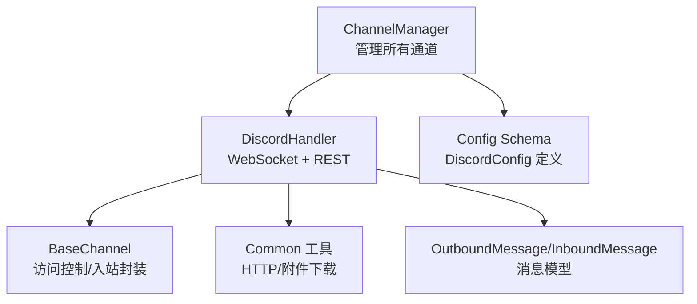
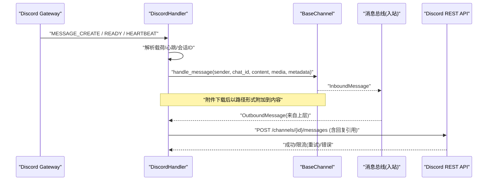
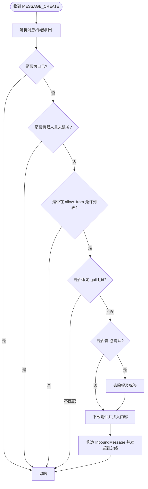
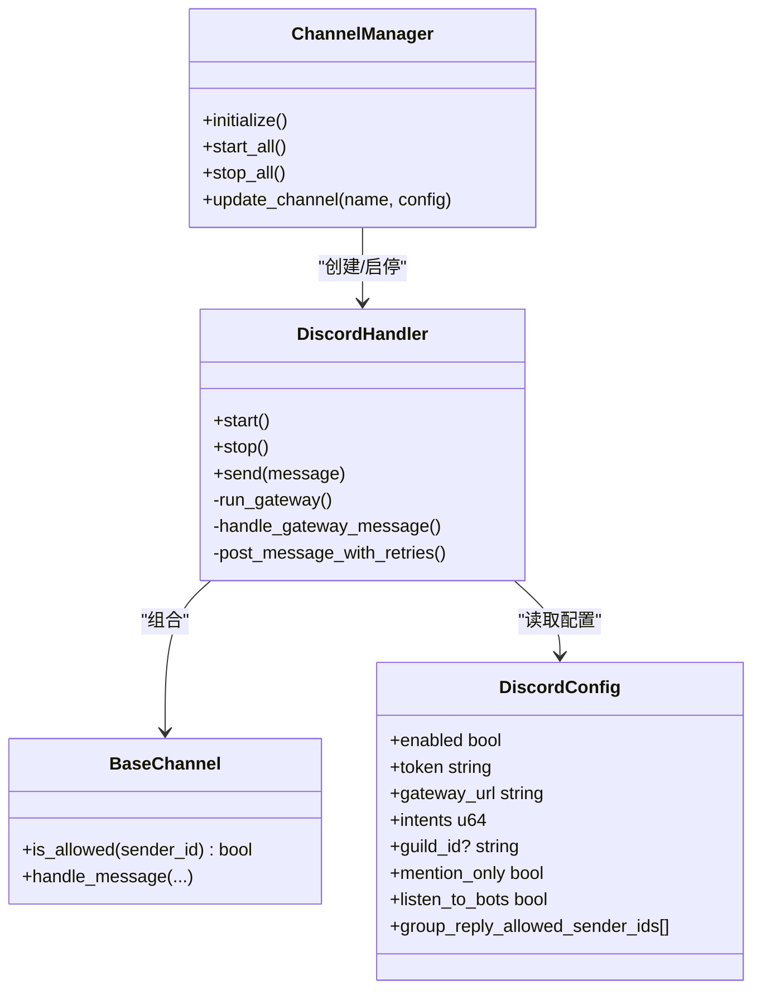

# Discord 通道

<cite>
**本文引用的文件**
- [discord.rs](file://agent-diva-channels/src/discord.rs)
- [base.rs](file://agent-diva-channels/src/base.rs)
- [manager.rs](file://agent-diva-channels/src/manager.rs)
- [schema.rs](file://agent-diva-core/src/config/schema.rs)
- [common/mod.rs](file://agent-diva-channels/src/common/mod.rs)
- [ChannelsSettings.vue](file://agent-diva-gui/src/components/settings/ChannelsSettings.vue)
</cite>

## 目录
1. [简介](#简介)
2. [项目结构](#项目结构)
3. [核心组件](#核心组件)
4. [架构总览](#架构总览)
5. [详细组件分析](#详细组件分析)
6. [依赖关系分析](#依赖关系分析)
7. [性能与限流](#性能与限流)
8. [故障排查指南](#故障排查指南)
9. [结论](#结论)
10. [附录：配置与使用示例](#附录配置与使用示例)

## 简介
本章节面向需要在 Agent Diva 中启用并配置 Discord 通道的用户，提供从应用注册、Bot Token 获取、权限设置到运行期消息收发、嵌入与附件处理、命令系统对接的完整说明。文档基于仓库中的实际实现进行梳理，确保每一步均可在代码中找到对应依据。

## 项目结构
Discord 通道由以下关键部分组成：
- 通道处理器：负责 WebSocket 连接、心跳、消息解析、发送与重试、打字指示等
- 基础通道能力：统一的访问控制、入站消息封装与发送
- 通道管理器：按配置初始化、启动、停止各通道（包括 Discord）
- 配置模式：定义 Discord 相关字段及默认值
- 通用工具：HTTP 客户端创建与附件下载

图表来源
- [manager.rs:378-418](file://agent-diva-channels/src/manager.rs#L378-L418)
- [discord.rs:296-318](file://agent-diva-channels/src/discord.rs#L296-L318)
- [base.rs:73-129](file://agent-diva-channels/src/base.rs#L73-L129)
- [schema.rs:657-705](file://agent-diva-core/src/config/schema.rs#L657-L705)
- [common/mod.rs:5-51](file://agent-diva-channels/src/common/mod.rs#L5-L51)

章节来源
- [manager.rs:378-418](file://agent-diva-channels/src/manager.rs#L378-L418)
- [discord.rs:296-318](file://agent-diva-channels/src/discord.rs#L296-L318)
- [base.rs:73-129](file://agent-diva-channels/src/base.rs#L73-L129)
- [schema.rs:657-705](file://agent-diva-core/src/config/schema.rs#L657-L705)
- [common/mod.rs:5-51](file://agent-diva-channels/src/common/mod.rs#L5-L51)

## 核心组件
- DiscordHandler：实现 Discord Gateway 连接、心跳、消息分发、REST 发送、速率限制重试、打字指示、消息分片等
- BaseChannel：统一访问控制策略（allow_from、deny_by_default）、入站消息封装与发送
- ChannelManager：根据配置动态初始化、启停通道；对 Discord 通道做必要校验（如 token 必填）
- DiscordConfig：包含 enabled、token、gateway_url、intents、guild_id、mention_only、listen_to_bots、group_reply_allowed_sender_ids 等
- Common 工具：创建带超时的 HTTP 客户端、将附件下载到本地媒体目录

章节来源
- [discord.rs:296-318](file://agent-diva-channels/src/discord.rs#L296-L318)
- [base.rs:73-129](file://agent-diva-channels/src/base.rs#L73-L129)
- [manager.rs:59-68](file://agent-diva-channels/src/manager.rs#L59-L68)
- [schema.rs:657-705](file://agent-diva-core/src/config/schema.rs#L657-L705)
- [common/mod.rs:5-51](file://agent-diva-channels/src/common/mod.rs#L5-L51)

## 架构总览
下图展示了从 Discord 事件到内部消息总线，再到出站消息发送的端到端流程。

图表来源
- [discord.rs:527-696](file://agent-diva-channels/src/discord.rs#L527-L696)
- [discord.rs:698-748](file://agent-diva-channels/src/discord.rs#L698-L748)
- [discord.rs:810-836](file://agent-diva-channels/src/discord.rs#L810-L836)
- [base.rs:186-229](file://agent-diva-channels/src/base.rs#L186-L229)

## 详细组件分析

### DiscordHandler：Gateway 与 REST 集成
- 连接与会话
  - 通过 GET /gateway/bot 获取 WebSocket 地址，拼接 v=10&encoding=json
  - 建立 WS 连接后，收到 Hello 时启动心跳任务，并发送 Identify 携带 intents
  - 维护 seq 用于心跳，记录 session_id 以便重连
- 消息接收
  - 仅处理 MESSAGE_CREATE 事件，过滤自身消息与可选的机器人消息
  - 支持 guild_id 白名单过滤；支持 mention_only 与 group_reply_allowed_sender_ids 精细控制群聊触发
  - 自动下载附件并写入本地媒体目录，将路径追加到内容中
- 消息发送
  - 超长消息按 2000 字符限制分片发送，首条可附带 message_reference 实现回复
  - 发送失败或 429 限流时，读取 retry-after 并指数退避重试
- 打字指示
  - 收到消息后周期性 POST /channels/{id}/typing，直到发送完成或通道切换

图表来源
- [discord.rs:335-442](file://agent-diva-channels/src/discord.rs#L335-L442)
- [base.rs:186-229](file://agent-diva-channels/src/base.rs#L186-L229)

章节来源
- [discord.rs:296-318](file://agent-diva-channels/src/discord.rs#L296-L318)
- [discord.rs:497-524](file://agent-diva-channels/src/discord.rs#L497-L524)
- [discord.rs:527-696](file://agent-diva-channels/src/discord.rs#L527-L696)
- [discord.rs:698-748](file://agent-diva-channels/src/discord.rs#L698-L748)
- [discord.rs:810-836](file://agent-diva-channels/src/discord.rs#L810-L836)

### BaseChannel：访问控制与入站封装
- 访问控制
  - 支持空列表“全部放行”或显式 allow_from 白名单
  - 支持 deny_by_default 策略（某些通道需要严格默认拒绝）
  - 支持复合 ID（如 user|username）与通配符匹配
- 入站消息
  - 统一封装 sender_id、chat_id、content、media、metadata，并通过 mpsc 发送至总线

章节来源
- [base.rs:73-129](file://agent-diva-channels/src/base.rs#L73-L129)
- [base.rs:186-229](file://agent-diva-channels/src/base.rs#L186-L229)

### ChannelManager：通道生命周期管理
- 初始化与校验
  - 针对 Discord：检查 enabled 与 token 是否为空
  - 若满足条件则创建 DiscordHandler 并注入 inbound_tx
- 启动/停止
  - 批量启动各通道，失败不影响其他通道继续运行
  - 支持热更新单个通道配置（停止旧实例、重建新实例）

章节来源
- [manager.rs:59-68](file://agent-diva-channels/src/manager.rs#L59-L68)
- [manager.rs:378-418](file://agent-diva-channels/src/manager.rs#L378-L418)
- [manager.rs:644-680](file://agent-diva-channels/src/manager.rs#L644-L680)
- [manager.rs:699-735](file://agent-diva-channels/src/manager.rs#L699-L735)

### 配置模式：DiscordConfig
- 关键字段
  - enabled：是否启用
  - token：Bot Token（必填）
  - gateway_url：WebSocket 地址（默认官方网关）
  - intents：意图位掩码（默认包含 GUILDS/GUILD_MESSAGES/DIRECT_MESSAGES/MESSAGE_CONTENT）
  - guild_id：限定服务器 ID（DM 不受影响）
  - mention_only：群聊中是否需要 @提及才响应
  - listen_to_bots：是否处理其他机器人消息
  - group_reply_allowed_sender_ids：允许免 @提及的用户 ID 列表（支持 * 通配）
- 默认值与 GUI 归一化
  - GUI 会补齐缺失字段（如 intents、gateway_url、mention_only 等），保证配置一致性

章节来源
- [schema.rs:657-705](file://agent-diva-core/src/config/schema.rs#L657-L705)
- [ChannelsSettings.vue:34-45](file://agent-diva-gui/src/components/settings/ChannelsSettings.vue#L34-L45)

### 附件与消息格式
- 附件处理
  - 下载至 ~/.nanobot/media（或 ./.nanobot/media），文件名加前缀避免冲突
  - 超大附件（>20MB）将被跳过并在内容中标注
- 消息格式
  - 入站：文本 + 附件路径行；元数据包含 message_id、username、guild_id、reply_to
  - 出站：支持 reply_to（优先 OutboundMessage.reply_to，其次 metadata.reply_to）
  - 长消息自动分片，首条附带 message_reference 实现回复

章节来源
- [common/mod.rs:14-51](file://agent-diva-channels/src/common/mod.rs#L14-L51)
- [discord.rs:240-278](file://agent-diva-channels/src/discord.rs#L240-L278)
- [discord.rs:280-294](file://agent-diva-channels/src/discord.rs#L280-L294)
- [discord.rs:810-836](file://agent-diva-channels/src/discord.rs#L810-L836)

## 依赖关系分析
- DiscordHandler 依赖：
  - BaseChannel：访问控制与入站封装
  - Common：HTTP 客户端与附件下载
  - Config Schema：DiscordConfig 字段
  - 消息模型：InboundMessage/OutboundMessage（来自 core bus）
- ChannelManager 依赖：
  - 各通道 Handler（含 DiscordHandler）
  - Config Schema：用于校验与构建

图表来源
- [manager.rs:378-418](file://agent-diva-channels/src/manager.rs#L378-L418)
- [discord.rs:296-318](file://agent-diva-channels/src/discord.rs#L296-L318)
- [schema.rs:657-705](file://agent-diva-core/src/config/schema.rs#L657-L705)

章节来源
- [manager.rs:378-418](file://agent-diva-channels/src/manager.rs#L378-L418)
- [discord.rs:296-318](file://agent-diva-channels/src/discord.rs#L296-L318)
- [schema.rs:657-705](file://agent-diva-core/src/config/schema.rs#L657-L705)

## 性能与限流
- 速率限制
  - 发送失败返回 429 时，读取 retry-after 并等待后重试，最多尝试 3 次
- 心跳与重连
  - 根据 Hello 中的 heartbeat_interval 定时发送心跳
  - 连接断开或请求重连时，指数退避（初始 5s，最大 60s）
- 消息分片
  - 超过 2000 字符的消息自动分片，分片间延迟 500ms，避免瞬时压力
- 附件大小
  - 单附件上限 20MB，超限直接丢弃并记录提示

章节来源
- [discord.rs:698-748](file://agent-diva-channels/src/discord.rs#L698-L748)
- [discord.rs:527-604](file://agent-diva-channels/src/discord.rs#L527-L604)
- [discord.rs:240-278](file://agent-diva-channels/src/discord.rs#L240-L278)
- [discord.rs:387-413](file://agent-diva-channels/src/discord.rs#L387-L413)

## 故障排查指南
- WebSocket 连接问题
  - 现象：无法连接或频繁断开
  - 排查点：
    - 确认 token 有效且未被撤销
    - 检查网络代理与防火墙
    - 查看日志中 “Connecting to Discord gateway...” 与 “Reconnecting in ... seconds”
  - 参考位置：[discord.rs:527-604](file://agent-diva-channels/src/discord.rs#L527-L604)
- API 限流
  - 现象：发送失败并出现 429
  - 行为：自动读取 retry-after 并等待重试
  - 建议：降低发送频率或合并消息
  - 参考位置：[discord.rs:698-748](file://agent-diva-channels/src/discord.rs#L698-L748)
- 权限错误
  - 现象：无法接收消息或无法发送
  - 排查点：
    - intents 是否包含 MESSAGE_CONTENT、GUILD_MESSAGES、DIRECT_MESSAGES
    - 机器人角色是否具备发送消息、读取消息历史等权限
    - guild_id 是否限制了服务器范围
  - 参考位置：[schema.rs:688-690](file://agent-diva-core/src/config/schema.rs#L688-L690)、[discord.rs:362-368](file://agent-diva-channels/src/discord.rs#L362-L368)
- 访问控制导致无响应
  - 现象：用户在群聊中 @机器人 无响应
  - 排查点：
    - mention_only 是否开启
    - group_reply_allowed_sender_ids 是否包含该用户或 *
    - allow_from 是否包含该用户 ID
  - 参考位置：[discord.rs:320-379](file://agent-diva-channels/src/discord.rs#L320-L379)、[base.rs:121-184](file://agent-diva-channels/src/base.rs#L121-L184)
- 附件下载失败
  - 现象：附件未显示或提示下载失败
  - 排查点：
    - 网络可达性与链接有效性
    - 文件大小是否超过 20MB
  - 参考位置：[common/mod.rs:14-51](file://agent-diva-channels/src/common/mod.rs#L14-L51)、[discord.rs:387-413](file://agent-diva-channels/src/discord.rs#L387-L413)

章节来源
- [discord.rs:527-604](file://agent-diva-channels/src/discord.rs#L527-L604)
- [discord.rs:698-748](file://agent-diva-channels/src/discord.rs#L698-L748)
- [schema.rs:688-690](file://agent-diva-core/src/config/schema.rs#L688-L690)
- [discord.rs:362-368](file://agent-diva-channels/src/discord.rs#L362-L368)
- [discord.rs:320-379](file://agent-diva-channels/src/discord.rs#L320-L379)
- [base.rs:121-184](file://agent-diva-channels/src/base.rs#L121-L184)
- [common/mod.rs:14-51](file://agent-diva-channels/src/common/mod.rs#L14-L51)

## 结论
Discord 通道通过 Gateway WebSocket 与 REST API 协同工作，实现了稳定的消息收发、附件处理、速率限制与重连机制。配合灵活的访问控制与群聊触发策略，可满足私聊与服务器频道场景下的多种需求。合理配置 intents、guild_id、mention_only 与 allow_from，可有效提升可用性与安全性。

## 附录：配置与使用示例
以下为常见配置项与用途说明（请结合 GUI 或配置文件设置）：
- 启用与认证
  - channels.discord.enabled = true
  - channels.discord.token = "<你的 Bot Token>"
- 网关与意图
  - channels.discord.gateway_url = "wss://gateway.discord.gg/?v=10&encoding=json"（默认）
  - channels.discord.intents = 37377（默认，包含 GUILDS/GUILD_MESSAGES/DIRECT_MESSAGES/MESSAGE_CONTENT）
- 服务器与触发策略
  - channels.discord.guild_id = "<服务器ID>"（可选，限定只处理该服务器的消息）
  - channels.discord.mention_only = true/false（群聊是否必须 @提及）
  - channels.discord.listen_to_bots = true/false（是否处理其他机器人消息）
  - channels.discord.group_reply_allowed_sender_ids = ["user_id", "*"]（允许免 @提及的用户）
- 访问控制
  - channels.discord.allow_from = ["user_id_1", "user_id_2"]（为空表示全部放行）
- 使用要点
  - 私聊：无需 guild_id，直接对话即可
  - 服务器频道：如需仅在特定服务器生效，设置 guild_id；如需严格触发，开启 mention_only
  - 附件：自动下载并附加路径到内容；超大附件会被跳过
  - 回复：出站消息可通过 reply_to 指定上游消息 ID 实现回复
  - 限流：发送 429 会自动重试；建议合并消息或降低频率

章节来源
- [schema.rs:657-705](file://agent-diva-core/src/config/schema.rs#L657-L705)
- [ChannelsSettings.vue:34-45](file://agent-diva-gui/src/components/settings/ChannelsSettings.vue#L34-L45)
- [discord.rs:362-379](file://agent-diva-channels/src/discord.rs#L362-L379)
- [discord.rs:810-836](file://agent-diva-channels/src/discord.rs#L810-L836)
- [common/mod.rs:14-51](file://agent-diva-channels/src/common/mod.rs#L14-L51)