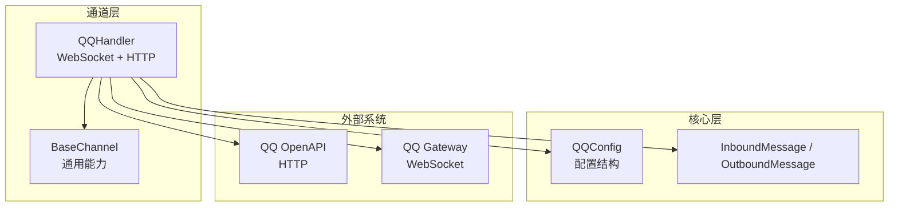
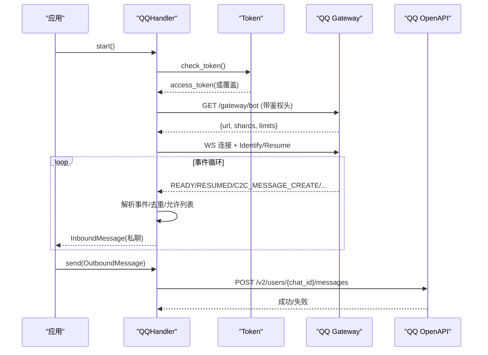
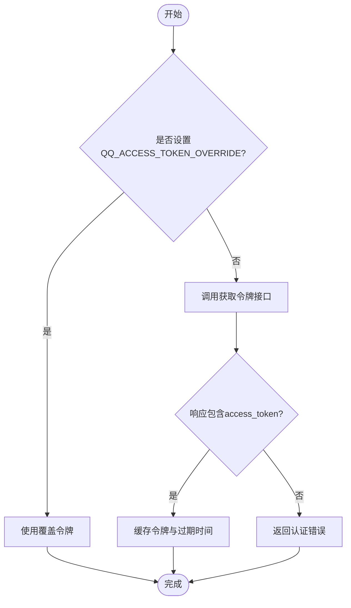
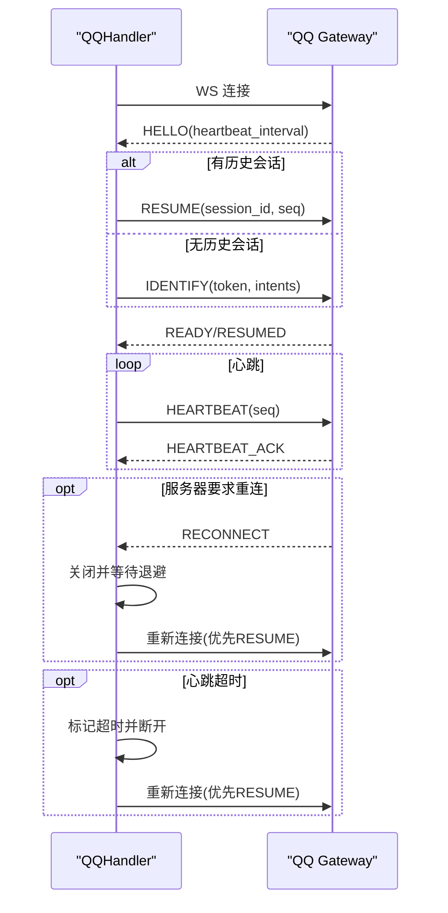
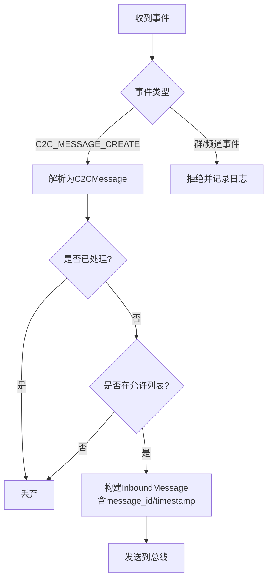
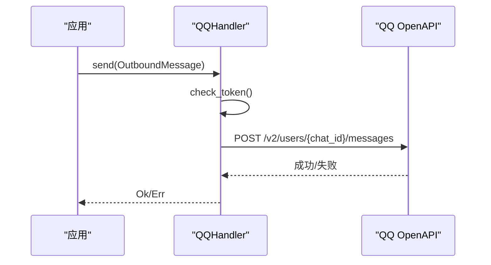
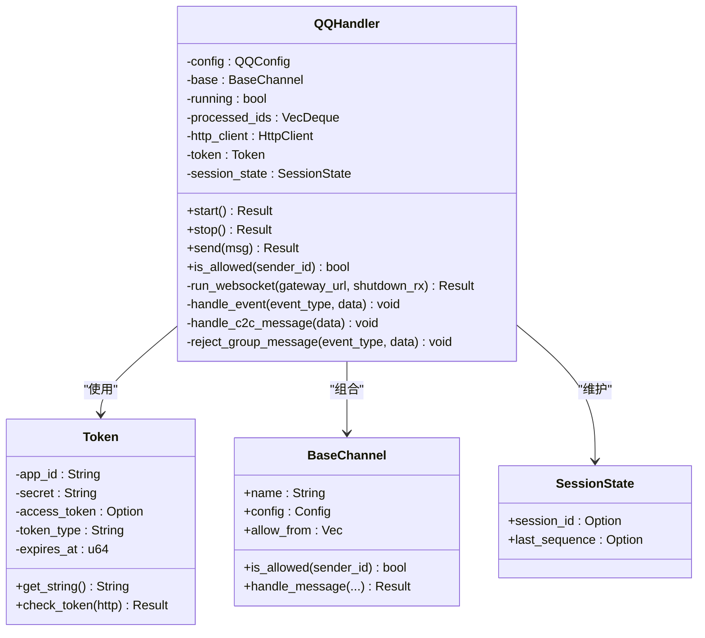
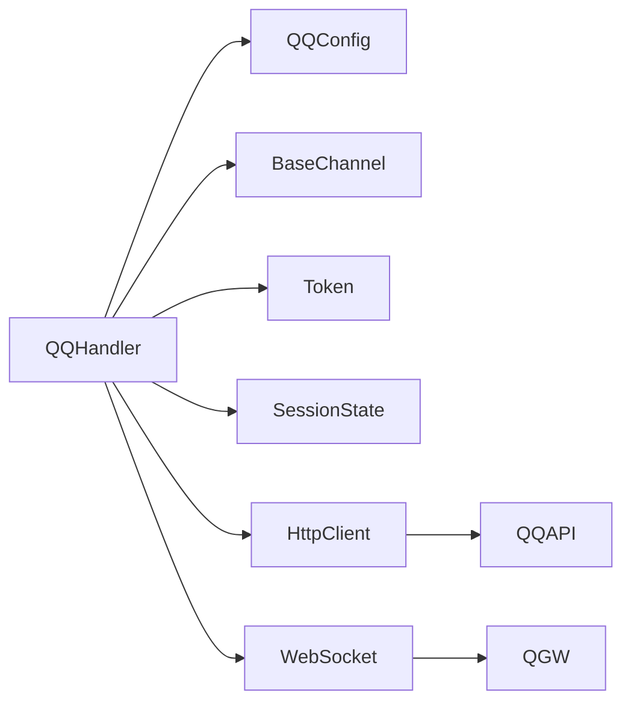

# QQ 通道

<cite>
**本文引用的文件**
- [qq.rs](file://agent-diva-channels/src/qq.rs)
- [base.rs](file://agent-diva-channels/src/base.rs)
- [schema.rs](file://agent-diva-core/src/config/schema.rs)
- [qq_reconnect_integration.rs](file://agent-diva-channels/tests/qq_reconnect_integration.rs)
- [channel-platforms.ts](file://agent-diva-gui/src/components/settings/channel-platforms.ts)
- [channel-wizard-fields.ts](file://agent-diva-gui/src/components/settings/channel-wizard-fields.ts)
</cite>

## 目录
1. [简介](#简介)
2. [项目结构](#项目结构)
3. [核心组件](#核心组件)
4. [架构总览](#架构总览)
5. [详细组件分析](#详细组件分析)
6. [依赖关系分析](#依赖关系分析)
7. [性能与可靠性](#性能与可靠性)
8. [故障排查指南](#故障排查指南)
9. [结论](#结论)
10. [附录：配置与使用示例](#附录配置与使用示例)

## 简介
本章节面向需要在 Agent-Diva 中接入 QQ 机器人通道的用户，提供从配置、认证到消息收发、事件处理、重连与故障恢复的完整说明。QQ 通道基于 WebSocket 网关实现实时消息接收，并通过 HTTP API 发送私聊消息；当前版本支持 C2C 私聊消息，群聊/频道消息默认拒绝并记录日志。

## 项目结构
- QQ 通道实现位于 channels 模块，核心逻辑在 qq.rs，基础能力与错误类型在 base.rs。
- 配置结构定义在 core 模块的 schema.rs。
- GUI 侧提供了 QQ 平台的字段定义与引导信息，便于可视化配置。
- 集成测试覆盖重连、心跳、无效会话等关键路径。

图表来源
- [qq.rs:231-265](file://agent-diva-channels/src/qq.rs#L231-L265)
- [base.rs:73-184](file://agent-diva-channels/src/base.rs#L73-L184)
- [schema.rs:960-972](file://agent-diva-core/src/config/schema.rs#L960-L972)

章节来源
- [qq.rs:1-1328](file://agent-diva-channels/src/qq.rs#L1-L1328)
- [base.rs:1-422](file://agent-diva-channels/src/base.rs#L1-L422)
- [schema.rs:960-972](file://agent-diva-core/src/config/schema.rs#L960-L972)

## 核心组件
- QQHandler：封装 QQ 通道的生命周期管理、WebSocket 连接、心跳、鉴权、事件分发、消息去重、允许列表控制、消息发送。
- Token：负责获取和缓存访问令牌，支持环境变量覆盖。
- SessionState：维护会话 ID 与序列号，用于断线后 Resume。
- BaseChannel：提供允许列表匹配、入站消息转发等通用能力。
- QQConfig：描述 QQ 通道启用开关、AppID、Secret、允许列表。

章节来源
- [qq.rs:50-181](file://agent-diva-channels/src/qq.rs#L50-L181)
- [qq.rs:231-265](file://agent-diva-channels/src/qq.rs#L231-L265)
- [base.rs:73-184](file://agent-diva-channels/src/base.rs#L73-L184)
- [schema.rs:960-972](file://agent-diva-core/src/config/schema.rs#L960-L972)

## 架构总览
QQ 通道通过 WebSocket 与 QQ Gateway 建立长连接，周期性发送心跳并处理服务端推送的事件（如私聊消息）。同时通过 HTTP 调用 QQ OpenAPI 发送私聊消息。启动流程包括校验配置、获取 Access Token、获取 Gateway URL、建立 WebSocket 连接、进入事件循环。

图表来源
- [qq.rs:979-1009](file://agent-diva-channels/src/qq.rs#L979-L1009)
- [qq.rs:1023-1074](file://agent-diva-channels/src/qq.rs#L1023-L1074)
- [qq.rs:301-336](file://agent-diva-channels/src/qq.rs#L301-L336)
- [qq.rs:429-750](file://agent-diva-channels/src/qq.rs#L429-L750)

## 详细组件分析

### 认证与令牌管理
- 首次启动时通过 HTTP 接口获取 Access Token，并缓存过期时间；支持通过环境变量直接覆盖 Access Token。
- 每次发送消息前会检查并刷新令牌，确保请求有效。
- 鉴权头包含 Authorization 与 X-Union-Appid。

图表来源
- [qq.rs:79-132](file://agent-diva-channels/src/qq.rs#L79-L132)
- [qq.rs:988-991](file://agent-diva-channels/src/qq.rs#L988-L991)
- [qq.rs:1030-1033](file://agent-diva-channels/src/qq.rs#L1030-L1033)

章节来源
- [qq.rs:50-132](file://agent-diva-channels/src/qq.rs#L50-L132)
- [qq.rs:988-991](file://agent-diva-channels/src/qq.rs#L988-L991)
- [qq.rs:1030-1033](file://agent-diva-channels/src/qq.rs#L1030-L1033)

### WebSocket 连接与会话恢复
- 连接建立后读取 HELLO，解析心跳间隔，启动心跳定时器。
- 若存在历史 session_id 与 seq，优先尝试 Resume；否则 Identify。
- 收到 READY/RESUMED 更新会话状态；收到 RECONNECT 主动断开并重连。
- 连续未收到心跳 ACK 达到阈值则判定超时并触发重连。
- 遇到 INVALID_SESSION 清理会话状态并按退避策略重试，支持冷却期防止风暴。

图表来源
- [qq.rs:429-750](file://agent-diva-channels/src/qq.rs#L429-L750)
- [qq.rs:752-846](file://agent-diva-channels/src/qq.rs#L752-L846)

章节来源
- [qq.rs:429-750](file://agent-diva-channels/src/qq.rs#L429-L750)
- [qq.rs:752-846](file://agent-diva-channels/src/qq.rs#L752-L846)

### 事件处理与消息格式转换
- 仅处理 C2C 私聊消息事件；群聊/频道相关事件被拒绝并记录日志，同时计入去重队列避免重复处理。
- 将 QQ 事件转换为内部 InboundMessage，携带 message_id、timestamp 等元数据。
- 支持 allow_from 白名单过滤，空列表表示不限制。

图表来源
- [qq.rs:855-962](file://agent-diva-channels/src/qq.rs#L855-L962)
- [base.rs:121-184](file://agent-diva-channels/src/base.rs#L121-L184)

章节来源
- [qq.rs:855-962](file://agent-diva-channels/src/qq.rs#L855-L962)
- [base.rs:121-184](file://agent-diva-channels/src/base.rs#L121-L184)

### 消息发送
- 通过 HTTP 向 QQ OpenAPI 发送私聊消息，支持回复引用（msg_id）。
- 发送前自动检查并刷新令牌，失败时返回明确的发送错误。

图表来源
- [qq.rs:1023-1074](file://agent-diva-channels/src/qq.rs#L1023-L1074)

章节来源
- [qq.rs:1023-1074](file://agent-diva-channels/src/qq.rs#L1023-L1074)

### 类图（代码级）

图表来源
- [qq.rs:231-265](file://agent-diva-channels/src/qq.rs#L231-L265)
- [qq.rs:50-181](file://agent-diva-channels/src/qq.rs#L50-L181)
- [base.rs:73-184](file://agent-diva-channels/src/base.rs#L73-L184)

章节来源
- [qq.rs:231-265](file://agent-diva-channels/src/qq.rs#L231-L265)
- [base.rs:73-184](file://agent-diva-channels/src/base.rs#L73-L184)

## 依赖关系分析
- QQHandler 依赖：
  - QQConfig（配置）、BaseChannel（通用能力）、HttpClient（HTTP 调用）、WebSocket（实时通信）。
  - 内部状态：Token、SessionState、消息去重队列。
- 外部依赖：
  - QQ OpenAPI（HTTP）：获取令牌、发送消息。
  - QQ Gateway（WebSocket）：事件推送、心跳、会话管理。

图表来源
- [qq.rs:231-265](file://agent-diva-channels/src/qq.rs#L231-L265)
- [schema.rs:960-972](file://agent-diva-core/src/config/schema.rs#L960-L972)

章节来源
- [qq.rs:231-265](file://agent-diva-channels/src/qq.rs#L231-L265)
- [schema.rs:960-972](file://agent-diva-core/src/config/schema.rs#L960-L972)

## 性能与可靠性
- 心跳机制：按服务端提供的间隔定时发送心跳，支持立即应答与超时容忍；连续丢失 ACK 触发重连。
- 重连策略：
  - 普通断开：固定退避延迟。
  - 无效会话风暴：递增退避 + 冷却期，避免频繁重连。
- 会话恢复：优先 Resume，失败回退 Identify，减少消息丢失风险。
- 消息去重：维护最近处理的消息 ID 队列，防止重复投递。
- 允许列表：默认允许所有（空列表），可配置精确或通配匹配。

章节来源
- [qq.rs:368-417](file://agent-diva-channels/src/qq.rs#L368-L417)
- [qq.rs:752-846](file://agent-diva-channels/src/qq.rs#L752-L846)
- [qq.rs:271-284](file://agent-diva-channels/src/qq.rs#L271-L284)
- [base.rs:121-184](file://agent-diva-channels/src/base.rs#L121-L184)

## 故障排查指南
- 网络连接问题
  - 现象：无法连接 Gateway 或频繁断开。
  - 排查：检查网络连通性、代理设置；确认 QQ_GATEWAY_URL_OVERRIDE（测试用）是否正确；查看心跳 ACK 是否持续收到。
  - 参考：连接失败与心跳超时处理逻辑。
- API 调用限制
  - 现象：获取令牌或发送消息失败。
  - 排查：确认 AppID/Secret 正确；检查速率限制与配额；查看返回状态码与错误文本。
  - 参考：令牌获取与消息发送的错误处理。
- 消息发送失败
  - 现象：send 返回错误。
  - 排查：确认通道处于运行状态；检查 chat_id 与 msg_type；查看 HTTP 响应状态与错误体。
  - 参考：发送流程与错误包装。
- 群聊/频道消息未到达
  - 现象：群内 @ 或频道消息未处理。
  - 原因：当前实现仅支持 C2C 私聊，群/频道事件会被拒绝并记录日志。
  - 建议：如需群聊支持，需扩展事件处理与权限策略。
- 重连风暴与冷却
  - 现象：短时间内多次无效会话导致频繁重连。
  - 行为：系统采用递增退避与冷却期保护；可通过环境变量调整测试参数。
  - 参考：无效会话处理与退避策略。

章节来源
- [qq.rs:79-132](file://agent-diva-channels/src/qq.rs#L79-L132)
- [qq.rs:1023-1074](file://agent-diva-channels/src/qq.rs#L1023-L1074)
- [qq.rs:848-912](file://agent-diva-channels/src/qq.rs#L848-L912)
- [qq.rs:752-846](file://agent-diva-channels/src/qq.rs#L752-L846)

## 结论
QQ 通道在当前版本实现了稳定的私聊消息收发与会话管理，具备完善的认证、心跳、重连与故障恢复机制。群聊与富媒体能力尚未开放，后续可按需扩展。通过合理的配置与监控，可在生产环境中获得高可用的 QQ 机器人服务。

## 附录：配置与使用示例

### 配置项说明（QQConfig）
- enabled：是否启用 QQ 通道。
- app_id：QQ 机器人应用 ID。
- secret：QQ 机器人密钥。
- allow_from：允许的用户 ID 列表（支持通配匹配），留空表示不限制。

章节来源
- [schema.rs:960-972](file://agent-diva-core/src/config/schema.rs#L960-L972)
- [base.rs:121-184](file://agent-diva-channels/src/base.rs#L121-L184)

### 认证流程与环境变量
- 首次启动通过 HTTP 接口获取 Access Token，并缓存过期时间。
- 支持环境变量覆盖：
  - QQ_ACCESS_TOKEN_OVERRIDE：直接指定访问令牌（测试/调试用途）。
  - QQ_API_BASE_OVERRIDE：覆盖 API 基地址。
  - QQ_GATEWAY_URL_OVERRIDE：覆盖 Gateway 地址（测试用途）。
  - QQ_WS_TEST_RECONNECT_DELAY_MS、QQ_WS_TEST_INVALID_SESSION_BACKOFF_MS、QQ_WS_TEST_INVALID_SESSION_COOLDOWN_MS：测试场景下的重连与退避参数。

章节来源
- [qq.rs:79-132](file://agent-diva-channels/src/qq.rs#L79-L132)
- [qq.rs:267-269](file://agent-diva-channels/src/qq.rs#L267-L269)
- [qq.rs:301-316](file://agent-diva-channels/src/qq.rs#L301-L316)
- [qq.rs:368-417](file://agent-diva-channels/src/qq.rs#L368-L417)

### 支持的 QQ 功能
- 私聊消息：支持接收与发送 C2C 私聊消息。
- 群聊消息：当前不支持，群/频道事件将被拒绝并记录日志。
- 富媒体消息：当前实现仅发送纯文本内容；富媒体扩展需另行实现。
- 事件处理：支持 READY/RESUMED/C2C_MESSAGE_CREATE 等事件；其他未知事件忽略并记录调试日志。

章节来源
- [qq.rs:855-962](file://agent-diva-channels/src/qq.rs#L855-L962)
- [qq.rs:1023-1074](file://agent-diva-channels/src/qq.rs#L1023-L1074)

### 消息格式转换与会话状态管理
- 入站转换：将 QQ 事件中的 id、content、author、timestamp 映射为内部 InboundMessage，并附加 message_id、timestamp 元数据。
- 会话状态：维护 session_id 与 last_sequence，用于断线后的 Resume 恢复。
- 身份验证：基于 Access Token 的鉴权，支持覆盖令牌以简化测试。

章节来源
- [qq.rs:914-962](file://agent-diva-channels/src/qq.rs#L914-L962)
- [qq.rs:162-166](file://agent-diva-channels/src/qq.rs#L162-L166)
- [qq.rs:429-750](file://agent-diva-channels/src/qq.rs#L429-L750)

### 重连机制与故障恢复
- 心跳超时：连续丢失 ACK 达到阈值触发重连。
- 服务器重连指令：收到 RECONNECT 主动断开并重连。
- 无效会话：清理会话状态并按递增退避与冷却期策略重试。
- 测试覆盖：集成测试验证了服务器关闭、心跳缺失、无效会话风暴等场景的重连与恢复。

章节来源
- [qq.rs:752-846](file://agent-diva-channels/src/qq.rs#L752-L846)
- [qq_reconnect_integration.rs:292-392](file://agent-diva-channels/tests/qq_reconnect_integration.rs#L292-L392)
- [qq_reconnect_integration.rs:460-552](file://agent-diva-channels/tests/qq_reconnect_integration.rs#L460-L552)
- [qq_reconnect_integration.rs:637-711](file://agent-diva-channels/tests/qq_reconnect_integration.rs#L637-L711)
- [qq_reconnect_integration.rs:713-800](file://agent-diva-channels/tests/qq_reconnect_integration.rs#L713-L800)

### GUI 配置入口
- 平台名称与教程路径：QQ 平台在 GUI 中有对应条目与教程链接。
- 必填字段：AppID、Secret；可选 allow_from。
- 快速引导：访问 QQ 开放平台创建机器人应用，获取 AppID 与 Secret，并在开发设置中配置权限与沙箱环境。

章节来源
- [channel-platforms.ts:118-132](file://agent-diva-gui/src/components/settings/channel-platforms.ts#L118-L132)
- [channel-wizard-fields.ts:361-377](file://agent-diva-gui/src/components/settings/channel-wizard-fields.ts#L361-L377)