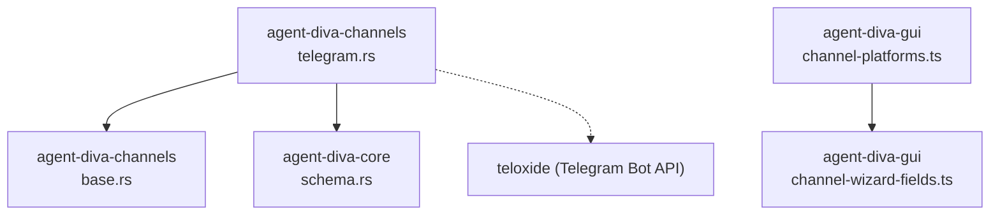
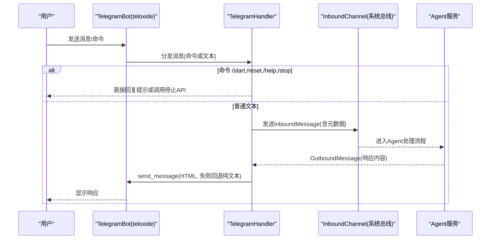
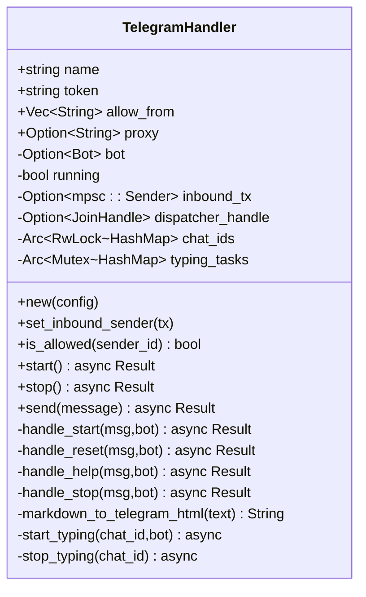
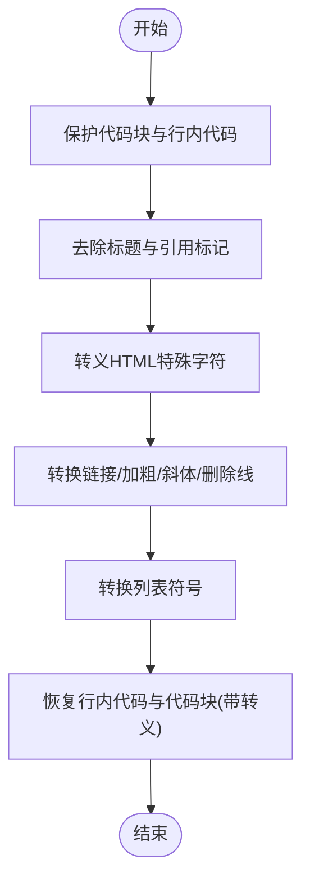
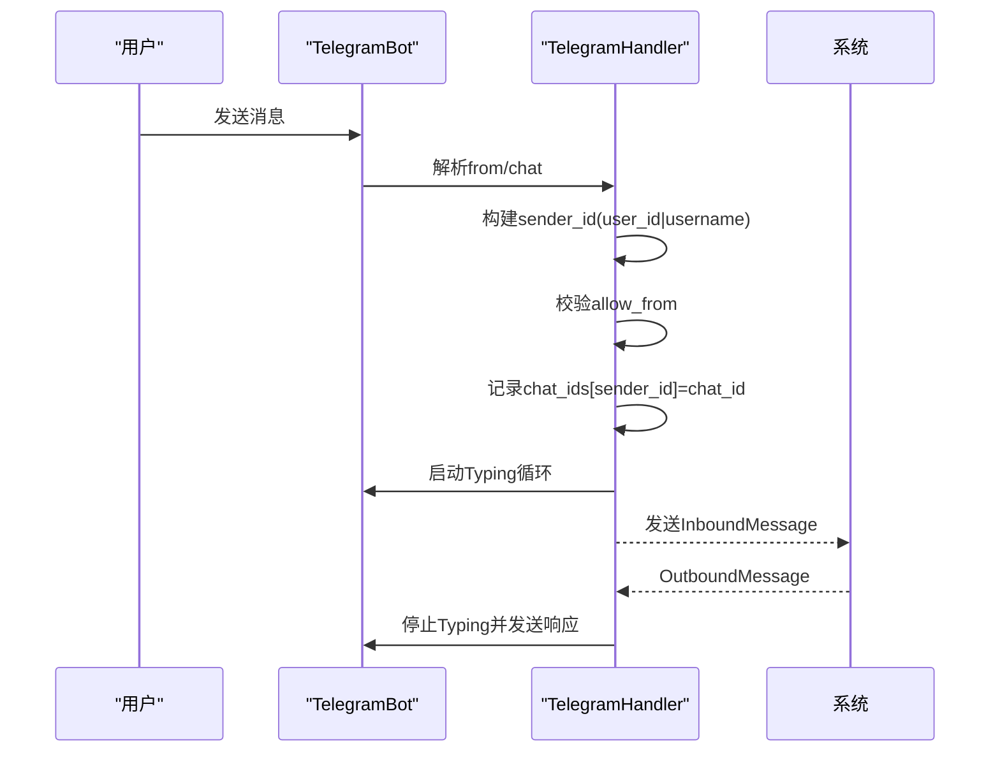
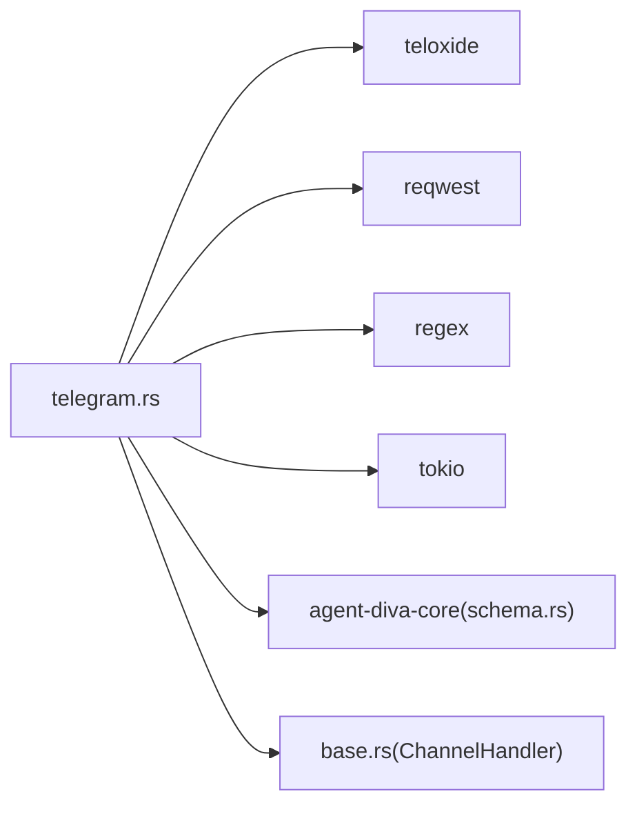

# Telegram 通道

<cite>
**本文引用的文件**
- [telegram.rs](file://agent-diva-channels/src/telegram.rs)
- [base.rs](file://agent-diva-channels/src/base.rs)
- [lib.rs](file://agent-diva-channels/src/lib.rs)
- [schema.rs](file://agent-diva-core/src/config/schema.rs)
- [channel-platforms.ts](file://agent-diva-gui/src/components/settings/channel-platforms.ts)
- [channel-wizard-fields.ts](file://agent-diva-gui/src/components/settings/channel-wizard-fields.ts)
- [Cargo.toml](file://agent-diva-channels/Cargo.toml)
</cite>

## 目录
1. [简介](#简介)
2. [项目结构](#项目结构)
3. [核心组件](#核心组件)
4. [架构总览](#架构总览)
5. [详细组件分析](#详细组件分析)
6. [依赖关系分析](#依赖关系分析)
7. [性能与速率控制](#性能与速率控制)
8. [故障排查指南](#故障排查指南)
9. [测试与调试](#测试与调试)
10. [结论](#结论)
11. [附录：配置示例与环境变量](#附录：配置示例与环境变量)

## 简介
本章节面向需要在 agent-diva 中启用并配置 Telegram 通道的用户，提供从 Bot Token 获取、配置项说明、消息格式转换、用户身份映射、会话管理到故障排查与性能优化的完整指南。该通道基于 teloxide 实现长轮询模式，支持文本消息、命令处理（/start、/reset、/help、/stop），并在发送时自动将 Markdown 转换为 Telegram HTML；同时内置“正在输入”指示器以提升交互体验。

## 项目结构
Telegram 通道位于 channels 子模块中，核心实现集中在 telegram.rs，并通过 base.rs 暴露统一的 ChannelHandler 接口；配置结构定义在 core 的 schema.rs；GUI 侧提供了快速引导和表单字段定义，便于可视化配置。

图表来源
- [telegram.rs:1-17](file://agent-diva-channels/src/telegram.rs#L1-L17)
- [base.rs:1-32](file://agent-diva-channels/src/base.rs#L1-L32)
- [schema.rs:644-655](file://agent-diva-core/src/config/schema.rs#L644-L655)
- [channel-platforms.ts:43-55](file://agent-diva-gui/src/components/settings/channel-platforms.ts#L43-L55)
- [channel-wizard-fields.ts:25-50](file://agent-diva-gui/src/components/settings/channel-wizard-fields.ts#L25-L50)

章节来源
- [lib.rs:9-50](file://agent-diva-channels/src/lib.rs#L9-L50)
- [Cargo.toml:46-47](file://agent-diva-channels/Cargo.toml#L46-L47)

## 核心组件
- TelegramHandler：封装 Telegram Bot 生命周期、消息分发、权限校验、Markdown→HTML 转换、发送与停止生成等逻辑。
- ChannelHandler trait：统一通道抽象，定义 start/stop/send/is_allowed 等方法。
- TelegramConfig：通道配置结构体，包含 enabled、token、allow_from、proxy 等字段。
- GUI 向导：提供创建 Bot 的快速步骤与表单字段，降低配置门槛。

章节来源
- [telegram.rs:36-122](file://agent-diva-channels/src/telegram.rs#L36-L122)
- [base.rs:9-32](file://agent-diva-channels/src/base.rs#L9-L32)
- [schema.rs:644-655](file://agent-diva-core/src/config/schema.rs#L644-L655)
- [channel-platforms.ts:43-55](file://agent-diva-gui/src/components/settings/channel-platforms.ts#L43-L55)
- [channel-wizard-fields.ts:25-50](file://agent-diva-gui/src/components/settings/channel-wizard-fields.ts#L25-L50)

## 架构总览
Telegram 通道通过 teloxide 的 Dispatcher 监听更新，路由到命令分支或普通消息分支。普通消息会进行权限校验、构建 InboundMessage 并发送到系统总线；发送响应时会将 Markdown 转为 HTML，若解析失败则回退为纯文本。

图表来源
- [telegram.rs:468-675](file://agent-diva-channels/src/telegram.rs#L468-L675)
- [telegram.rs:711-749](file://agent-diva-channels/src/telegram.rs#L711-L749)

## 详细组件分析

### TelegramHandler 类与方法
- 构造与状态：维护 token、allow_from、proxy、bot 实例、运行状态、inbound_tx、dispatcher_handle、chat_ids 映射、typing_tasks 任务集合。
- 启动流程：校验 token，创建 Bot，设置命令菜单，验证连接，启动 Dispatcher。
- 命令处理：/start、/reset、/help、/stop，其中 /stop 通过本地 HTTP 调用通知 Agent 停止当前生成。
- 消息处理：提取 sender_id（支持 user_id|username 复合 ID）、权限校验、构建 InboundMessage、启动“正在输入”指示器。
- 发送响应：Markdown→HTML 转换，发送消息，失败时回退为纯文本。

图表来源
- [telegram.rs:36-122](file://agent-diva-channels/src/telegram.rs#L36-L122)
- [telegram.rs:415-749](file://agent-diva-channels/src/telegram.rs#L415-L749)

章节来源
- [telegram.rs:18-34](file://agent-diva-channels/src/telegram.rs#L18-L34)
- [telegram.rs:61-122](file://agent-diva-channels/src/telegram.rs#L61-L122)
- [telegram.rs:415-749](file://agent-diva-channels/src/telegram.rs#L415-L749)

### 消息格式转换（Markdown → Telegram HTML）
- 保护代码块与行内代码，避免被正则替换影响。
- 去除标题与引用标记，转义 HTML 特殊字符。
- 链接、加粗、斜体、删除线、列表等转换为对应 HTML 标签。
- 恢复代码块与行内代码，确保安全转义。
- 发送时优先使用 HTML 模式，若解析失败则回退为纯文本。

图表来源
- [telegram.rs:151-243](file://agent-diva-channels/src/telegram.rs#L151-L243)
- [telegram.rs:728-749](file://agent-diva-channels/src/telegram.rs#L728-L749)

章节来源
- [telegram.rs:151-243](file://agent-diva-channels/src/telegram.rs#L151-L243)
- [telegram.rs:728-749](file://agent-diva-channels/src/telegram.rs#L728-L749)

### 用户身份映射与会话管理
- 用户标识：sender_id 由 user_id 与可选 username 组成，支持复合 ID 匹配 allow_from。
- 会话上下文：chat_ids 映射 sender_id -> chat_id，用于后续回复定位。
- 权限策略：allow_from 为空表示允许所有；否则精确匹配或复合 ID 部分匹配。
- “正在输入”指示器：每 4 秒发送一次 Typing 动作，发送响应后停止。

图表来源
- [telegram.rs:245-331](file://agent-diva-channels/src/telegram.rs#L245-L331)
- [telegram.rs:550-665](file://agent-diva-channels/src/telegram.rs#L550-L665)
- [telegram.rs:376-402](file://agent-diva-channels/src/telegram.rs#L376-L402)

章节来源
- [telegram.rs:245-331](file://agent-diva-channels/src/telegram.rs#L245-L331)
- [telegram.rs:550-665](file://agent-diva-channels/src/telegram.rs#L550-L665)
- [telegram.rs:376-402](file://agent-diva-channels/src/telegram.rs#L376-L402)

### 命令处理与群组支持
- 命令：/start、/reset、/help、/stop，分别用于欢迎、重置历史、帮助、停止生成。
- 群组支持：通过 is_group 元数据判断（chat_id < 0 为群组），命令与消息均可在群组中使用。
- 权限：群组中的每个用户仍受 allow_from 控制。

章节来源
- [telegram.rs:18-34](file://agent-diva-channels/src/telegram.rs#L18-L34)
- [telegram.rs:333-374](file://agent-diva-channels/src/telegram.rs#L333-L374)
- [telegram.rs:288-323](file://agent-diva-channels/src/telegram.rs#L288-L323)

## 依赖关系分析
- 外部库：teloxide（Telegram Bot API 客户端）、reqwest（HTTP 调用）、regex（正则表达式）、tokio（异步运行时）。
- 内部依赖：agent-diva-core（配置与总线类型）、base（通道抽象）。
- 编译特性：channels 默认不包含未验证通道，仅启用 telegram。

图表来源
- [Cargo.toml:46-59](file://agent-diva-channels/Cargo.toml#L46-L59)
- [lib.rs:9-50](file://agent-diva-channels/src/lib.rs#L9-L50)

章节来源
- [Cargo.toml:46-59](file://agent-diva-channels/Cargo.toml#L46-L59)
- [lib.rs:9-50](file://agent-diva-channels/src/lib.rs#L9-L50)

## 性能与速率控制
- 长轮询模式：Dispatcher 持续拉取更新，适合无公网 IP 场景。
- “正在输入”指示器：每 4 秒发送一次，提升用户体验；发送响应后立即停止，减少无效请求。
- Markdown→HTML 转换：使用正则批量替换，注意复杂嵌套可能带来开销；必要时可考虑更高效的解析器。
- 错误回退：HTML 解析失败时回退为纯文本，保证可用性。
- 速率限制：Telegram API 有全局与频道级限制；建议在应用层增加重试与退避策略（当前实现未内置，可参考其他通道如 Discord 的重试逻辑）。

章节来源
- [telegram.rs:376-402](file://agent-diva-channels/src/telegram.rs#L376-L402)
- [telegram.rs:728-749](file://agent-diva-channels/src/telegram.rs#L728-L749)
- [discord.rs:698-731](file://agent-diva-channels/src/discord.rs#L698-L731)

## 故障排查指南
- 无法启动：检查 token 是否为空；若为空将返回 NotConfigured 错误。
- 连接失败：get_me 调用失败会返回 ApiError，检查网络与代理设置。
- 权限拒绝：allow_from 未包含 sender_id（包括复合 ID），日志会记录 AccessDenied。
- 停止生成失败：/stop 调用本地 HTTP 接口失败会返回错误信息，检查服务是否运行。
- 发送失败：HTML 解析失败会回退为纯文本；若仍失败，记录 ApiError。
- 速率限制：若遇到 Telegram 限流，建议增加重试与退避（可参考 Discord 通道实现）。

章节来源
- [telegram.rs:415-455](file://agent-diva-channels/src/telegram.rs#L415-L455)
- [telegram.rs:62-106](file://agent-diva-channels/src/telegram.rs#L62-L106)
- [telegram.rs:711-749](file://agent-diva-channels/src/telegram.rs#L711-L749)
- [base.rs:34-71](file://agent-diva-channels/src/base.rs#L34-L71)

## 测试与调试
- 单元测试：覆盖 Markdown→HTML 转换、权限判断、构造器等。
- 调试方法：
  - 启用 tracing 日志，观察启动、消息处理、错误信息。
  - 使用 GUI 向导快速填写 token 与 allow_from，验证连通性。
  - 在 Telegram 中发送 /help 查看可用命令。
- 性能测试：监控“正在输入”频率与消息发送延迟，调整业务层超时与重试策略。

章节来源
- [telegram.rs:760-860](file://agent-diva-channels/src/telegram.rs#L760-L860)
- [channel-platforms.ts:43-55](file://agent-diva-gui/src/components/settings/channel-platforms.ts#L43-L55)

## 结论
Telegram 通道提供了稳定易用的集成方案，支持文本消息、命令处理、群组支持与 Markdown 格式转换。通过合理的权限控制与“正在输入”指示器，提升了用户体验。在生产环境中，建议结合重试与速率控制策略，确保在高负载下的稳定性。

## 附录：配置示例与环境变量
- 配置结构：
  - enabled：是否启用通道
  - token：Bot Token（必填）
  - allow_from：允许的用户 ID 列表（支持复合 ID 与通配符）
  - proxy：代理 URL（可选）
- 环境变量：可通过系统环境变量注入 token 与 proxy（具体加载逻辑由上层配置管理器负责）。
- GUI 快速引导：
  - 在 Telegram 中搜索 @BotFather，创建新机器人，复制 Token。
  - 在 GUI 设置中选择 Telegram，填入 Token 与 allow_from。

章节来源
- [schema.rs:644-655](file://agent-diva-core/src/config/schema.rs#L644-L655)
- [channel-platforms.ts:43-55](file://agent-diva-gui/src/components/settings/channel-platforms.ts#L43-L55)
- [channel-wizard-fields.ts:25-50](file://agent-diva-gui/src/components/settings/channel-wizard-fields.ts#L25-L50)