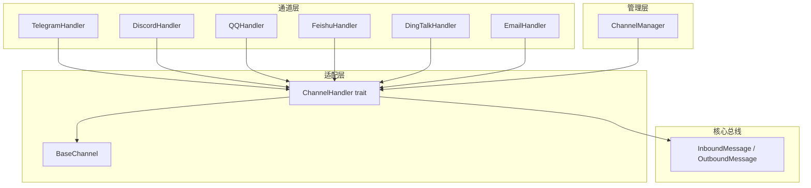
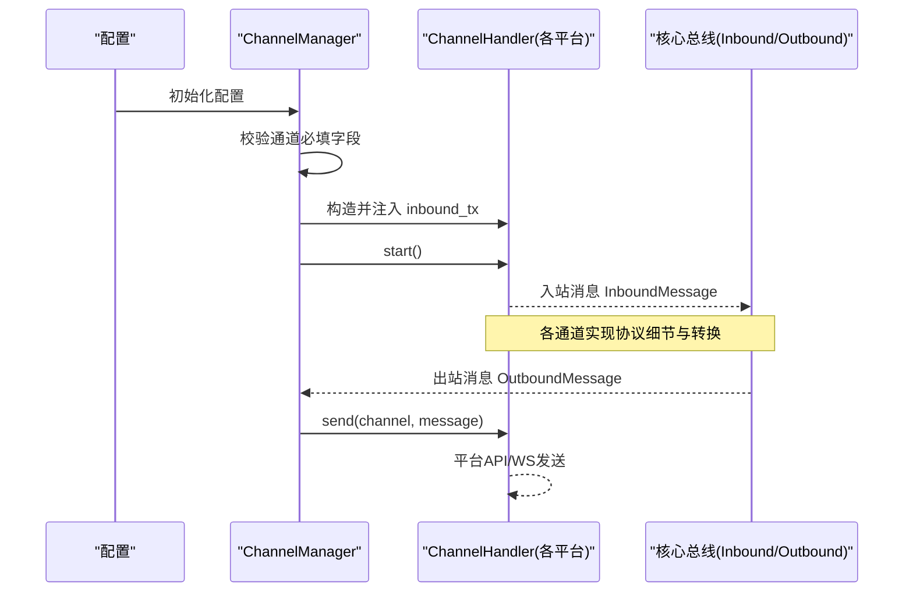
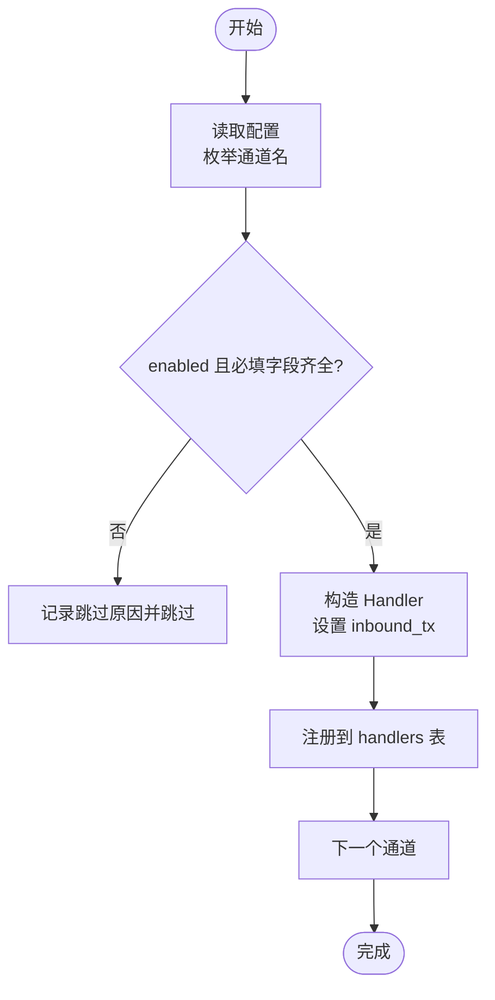
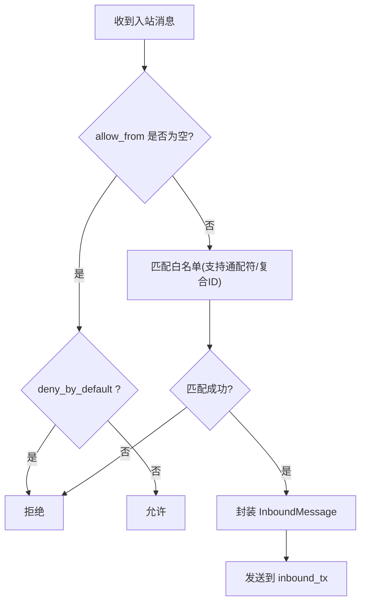
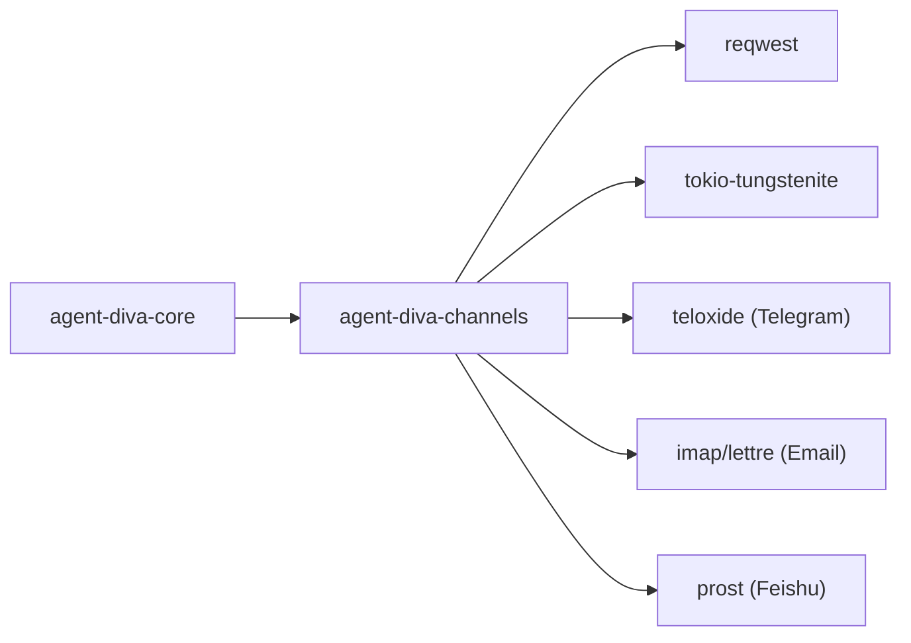

# 多通道网关

<cite>
**本文引用的文件**
- [lib.rs](file://agent-diva-channels/src/lib.rs)
- [manager.rs](file://agent-diva-channels/src/manager.rs)
- [base.rs](file://agent-diva-channels/src/base.rs)
- [Cargo.toml](file://agent-diva-channels/Cargo.toml)
- [telegram.rs](file://agent-diva-channels/src/telegram.rs)
- [discord.rs](file://agent-diva-channels/src/discord.rs)
- [dingtalk.rs](file://agent-diva-channels/src/dingtalk.rs)
- [feishu.rs](file://agent-diva-channels/src/feishu.rs)
- [qq.rs](file://agent-diva-channels/src/qq.rs)
- [email.rs](file://agent-diva-channels/src/email.rs)
- [schema.rs](file://agent-diva-core/src/config/schema.rs)
</cite>

## 目录
1. [简介](#简介)
2. [项目结构](#项目结构)
3. [核心组件](#核心组件)
4. [架构总览](#架构总览)
5. [详细组件分析](#详细组件分析)
6. [依赖关系分析](#依赖关系分析)
7. [性能考虑](#性能考虑)
8. [故障排查指南](#故障排查指南)
9. [结论](#结论)
10. [附录：配置与接入步骤](#附录配置与接入步骤)

## 简介
本章节面向初学者与进阶用户，系统阐述 Agent Diva 的多通道网关能力：消息路由机制、通道适配器架构、连接管理与消息转换流程；覆盖 Telegram、Discord、QQ、钉钉、飞书、邮件等通道的配置方法与接入步骤；解释通道生命周期管理、错误处理策略与重连机制；并提供添加新通道适配器与自定义消息格式转换的实践指导。

## 项目结构
多通道网关位于 agent-diva-channels crate，采用“统一接口 + 多实现”的适配器模式：
- 统一抽象：ChannelHandler trait 定义通道生命周期与消息收发接口；BaseChannel 提供通用权限控制、入站消息封装与发送。
- 管理器：ChannelManager 负责按配置初始化、启动、停止各通道，并维护运行中的通道实例映射。
- 具体通道：每个平台一个 Handler（如 TelegramHandler、DiscordHandler、DingTalkHandler、FeishuHandler、QQHandler、EmailHandler），各自实现协议细节、鉴权、心跳、重连、去重、富媒体与消息格式转换。
- 配置：通道配置集中在 agent-diva-core 的配置 schema 中，包含 enabled、鉴权字段、allow_from 白名单等。

图表来源
- [manager.rs:30-56](file://agent-diva-channels/src/manager.rs#L30-L56)
- [base.rs:9-32](file://agent-diva-channels/src/base.rs#L9-L32)
- [lib.rs:9-52](file://agent-diva-channels/src/lib.rs#L9-L52)

章节来源
- [lib.rs:9-52](file://agent-diva-channels/src/lib.rs#L9-L52)
- [manager.rs:30-56](file://agent-diva-channels/src/manager.rs#L30-L56)
- [base.rs:9-32](file://agent-diva-channels/src/base.rs#L9-L32)

## 核心组件
- ChannelHandler 接口：定义 name、is_running、start、stop、send、set_inbound_sender、is_allowed 等方法，统一通道生命周期与消息收发契约。
- BaseChannel：提供 allow_from 白名单匹配（支持通配符与复合 ID）、默认拒绝策略、入站消息封装与发送。
- ChannelManager：根据配置校验与构建各通道处理器，集中初始化、启动、停止、更新与查询。
- 通道适配器：各平台 Handler 实现具体协议（WebSocket/HTTP/IMAP/SMTP）、鉴权、心跳、重连、去重、富媒体与消息格式转换。

章节来源
- [base.rs:9-32](file://agent-diva-channels/src/base.rs#L9-L32)
- [base.rs:73-229](file://agent-diva-channels/src/base.rs#L73-L229)
- [manager.rs:30-56](file://agent-diva-channels/src/manager.rs#L30-L56)
- [manager.rs:377-642](file://agent-diva-channels/src/manager.rs#L377-L642)

## 架构总览
多通道网关通过 ChannelManager 读取配置，为每个启用的通道创建对应的 Handler，并通过 set_inbound_sender 将入站消息投递到核心总线。出站消息由上层通过 manager.send 分发至指定通道。

图表来源
- [manager.rs:377-642](file://agent-diva-channels/src/manager.rs#L377-L642)
- [base.rs:186-229](file://agent-diva-channels/src/base.rs#L186-L229)

## 详细组件分析

### 通道管理器（ChannelManager）
职责
- 配置校验：对每个通道检查 enabled 与必填字段，未满足则跳过并记录警告。
- 生命周期：initialize 构建并注册通道；start_all 启动所有通道；stop_all 停止并清理；update_channel 热更新单个通道。
- 路由：send 根据 channel 名称路由到对应 Handler 的 send。

关键流程
- 初始化时遍历各通道，若 enabled 且校验通过，则构造对应 Handler 并设置 inbound sender，随后插入 handlers 表。
- 启动失败不影响其他通道继续运行，仅记录告警。

图表来源
- [manager.rs:59-163](file://agent-diva-channels/src/manager.rs#L59-L163)
- [manager.rs:377-642](file://agent-diva-channels/src/manager.rs#L377-L642)

章节来源
- [manager.rs:59-163](file://agent-diva-channels/src/manager.rs#L59-L163)
- [manager.rs:377-642](file://agent-diva-channels/src/manager.rs#L377-L642)
- [manager.rs:688-735](file://agent-diva-channels/src/manager.rs#L688-L735)

### 基础通道（BaseChannel）
功能
- 访问控制：allow_from 白名单匹配，支持通配符与复合 ID（如 user|id）。
- 默认策略：empty allow_from 时可按 deny_by_default 决定默认行为。
- 入站消息：handle_message 校验权限后封装 InboundMessage 并发送到 inbound_tx。

复杂度
- 白名单匹配使用正则表达式，时间复杂度近似 O(N·M)，N 为 allow_from 条目数，M 为匹配长度。

图表来源
- [base.rs:121-184](file://agent-diva-channels/src/base.rs#L121-L184)
- [base.rs:186-229](file://agent-diva-channels/src/base.rs#L186-L229)

章节来源
- [base.rs:73-229](file://agent-diva-channels/src/base.rs#L73-L229)

### Telegram 通道
要点
- 基于 teloxide 框架，支持命令（/start、/reset、/help、/stop）。
- Markdown 到 HTML 的转换，保护代码块与行内代码，转义特殊字符，链接格式化。
- 支持代理、打字指示器、聊天 ID 映射。

消息流
- 接收消息 -> 权限校验 -> 转换为内部消息 -> 发送至总线。
- 发送消息 -> 平台 API 发送。

章节来源
- [telegram.rs:18-59](file://agent-diva-channels/src/telegram.rs#L18-L59)
- [telegram.rs:108-149](file://agent-diva-channels/src/telegram.rs#L108-L149)
- [telegram.rs:151-200](file://agent-diva-channels/src/telegram.rs#L151-L200)

### Discord 通道
要点
- 使用 Gateway WebSocket 进行实时消息接收，REST API 发送消息。
- 内置心跳、会话恢复、附件下载与大小限制、消息长度限制。
- 支持群聊回复白名单与机器人提及识别。

消息流
- WS 事件 -> 解析作者/内容/附件 -> 权限校验 -> 封装入站消息 -> 总线。
- 出站消息 -> REST API 发送。

章节来源
- [discord.rs:1-26](file://agent-diva-channels/src/discord.rs#L1-L26)
- [discord.rs:29-75](file://agent-diva-channels/src/discord.rs#L29-L75)
- [discord.rs:113-135](file://agent-diva-channels/src/discord.rs#L113-L135)

### 钉钉（DingTalk）通道
要点
- 使用 Stream 模式 WebSocket 长连接，无需公网 IP。
- Client ID + Secret 鉴权，消息去重（processed_ids 队列），私聊与群聊支持。
- HTTP API 发送消息。

消息流
- WS 订阅 -> 解析消息体 -> 去重 -> 权限校验 -> 入站消息 -> 总线。
- 出站消息 -> HTTP API 发送。

章节来源
- [dingtalk.rs:1-17](file://agent-diva-channels/src/dingtalk.rs#L1-L17)
- [dingtalk.rs:36-121](file://agent-diva-channels/src/dingtalk.rs#L36-L121)
- [dingtalk.rs:154-187](file://agent-diva-channels/src/dingtalk.rs#L154-L187)

### 飞书（Feishu/Lark）通道
要点
- 使用 WebSocket 长连接与 protobuf 帧编码（pbbp2.proto），服务端推送事件。
- App ID + Secret 鉴权，事件去重（event_id/message_id），心跳机制，大消息分片重组。
- HTTP API 发送消息。

消息流
- WS 帧解码 -> 解析事件 -> 去重 -> 权限校验 -> 入站消息 -> 总线。
- 出站消息 -> HTTP API 发送。

章节来源
- [feishu.rs:1-17](file://agent-diva-channels/src/feishu.rs#L1-L17)
- [feishu.rs:56-120](file://agent-diva-channels/src/feishu.rs#L56-L120)
- [feishu.rs:177-200](file://agent-diva-channels/src/feishu.rs#L177-L200)

### QQ 通道
要点
- 基于 QQ Bot OpenAPI，WebSocket 网关连接，自动重连与心跳 ACK 超时容忍。
- Token 自动刷新，C2C 私聊支持，消息去重，白名单访问控制。
- HTTP API 发送消息。

重连机制
- 支持 Identify/Resume 两种模式，InvalidSession 冷却退避，最大错过心跳次数阈值。

章节来源
- [qq.rs:1-13](file://agent-diva-channels/src/qq.rs#L1-L13)
- [qq.rs:31-49](file://agent-diva-channels/src/qq.rs#L31-L49)
- [qq.rs:50-133](file://agent-diva-channels/src/qq.rs#L50-L133)

### 邮件（Email）通道
要点
- IMAP 轮询 + SMTP 回复，阻塞 I/O 通过 spawn_blocking 执行，适合低频场景。
- 支持主题前缀、HTML 转纯文本、邮件解析与去重（UID/Subject/Message-ID）。
- 配置校验缺失必填字段时报错。

消息流
- 定时拉取 -> 解析邮件 -> 权限校验 -> 入站消息 -> 总线。
- 出站消息 -> SMTP 发送。

章节来源
- [email.rs:1-6](file://agent-diva-channels/src/email.rs#L1-L6)
- [email.rs:30-58](file://agent-diva-channels/src/email.rs#L30-L58)
- [email.rs:60-91](file://agent-diva-channels/src/email.rs#L60-L91)
- [email.rs:129-175](file://agent-diva-channels/src/email.rs#L129-L175)

## 依赖关系分析
- 通道模块通过 Cargo features 控制可选编译（如 slack、whatsapp、matrix、irc、mattermost、nextcloud-talk），默认不启用以减小体积。
- 各通道依赖 reqwest/tokio-tungstenite 进行 HTTP/WebSocket 通信；Telegram 使用 teloxide；Email 使用 imap/lettre/mail-parser；Feishu 使用 prost 编解码。

图表来源
- [Cargo.toml:22-76](file://agent-diva-channels/Cargo.toml#L22-L76)

章节来源
- [Cargo.toml:11-20](file://agent-diva-channels/Cargo.toml#L11-L20)
- [Cargo.toml:22-76](file://agent-diva-channels/Cargo.toml#L22-L76)

## 性能考虑
- 高频通道（Telegram/Discord/QQ/钉钉/飞书）采用异步 I/O 与长连接，减少阻塞。
- 邮件通道使用阻塞 I/O，但通过任务隔离避免影响主循环；适合低频场景。
- 去重缓存（QQ/钉钉/飞书）使用内存集合或队列，注意容量与清理策略。
- 白名单匹配使用正则，建议合理控制 allow_from 规模。
- 附件与消息长度限制（如 Discord 20MB/2000字符）避免资源滥用。

## 故障排查指南
常见问题与定位
- 通道未启动：检查配置 enabled 与必填字段是否齐全；查看管理器日志中的跳过原因。
- 认证失败：核对 token/app_id/secret 等凭据；关注 AuthError 类型错误。
- 连接失败/网络异常：检查代理、TLS、防火墙；关注 ConnectionFailed/ConnectionError。
- 心跳超时/断线：观察心跳间隔与 ACK 超时；确认服务侧限流与重连退避。
- 权限拒绝：确认 allow_from 白名单与 deny_by_default 策略；检查复合 ID 匹配。
- 消息重复：检查去重缓存是否生效；必要时调整 TTL 或清理周期。

错误类型参考
- ChannelError 包含 NotConfigured、InvalidConfig、ApiError、SendError、ConnectionFailed、AuthError、AccessDenied 等。

章节来源
- [base.rs:34-71](file://agent-diva-channels/src/base.rs#L34-L71)
- [manager.rs:198-220](file://agent-diva-channels/src/manager.rs#L198-L220)

## 结论
Agent Diva 的多通道网关通过统一的 ChannelHandler 抽象与 ChannelManager 编排，实现了跨平台的消息路由与转换。各通道适配器在保持协议差异的同时，复用 BaseChannel 的权限控制与入站消息封装能力，确保一致的安全策略与可观测性。结合配置校验、错误分类与重连机制，系统具备良好的可扩展性与稳定性。

## 附录：配置与接入步骤

### 支持的通道与必填字段
- Telegram：token
- Discord：token
- 飞书：app_id、app_secret
- 钉钉：client_id、client_secret
- 邮件：imap_host、imap_username、imap_password、smtp_host、smtp_username、smtp_password、from_address
- QQ：app_id、secret
- Neuro-link：无必填字段（需启用）

章节来源
- [manager.rs:59-163](file://agent-diva-channels/src/manager.rs#L59-L163)
- [schema.rs:733-805](file://agent-diva-core/src/config/schema.rs#L733-L805)

### 接入步骤概览
- 准备凭据：在各平台开发者控制台创建应用/机器人，获取 token/app_id/secret 等。
- 配置 enable 与必填字段：在配置文件中开启对应通道并填写必要参数。
- 启动服务：ChannelManager.initialize 会校验并构建通道；start_all 启动所有通道。
- 验证连通：发送测试消息，观察入站消息是否进入核心总线。
- 权限控制：按需配置 allow_from 白名单与 deny_by_default。

章节来源
- [manager.rs:377-642](file://agent-diva-channels/src/manager.rs#L377-L642)
- [base.rs:121-184](file://agent-diva-channels/src/base.rs#L121-L184)

### 添加新通道适配器
步骤
- 新增通道模块：在 src 下新建 xxx.rs，实现 ChannelHandler trait。
- 注册到管理器：在 manager.rs 的 build_updated_handler 与 initialize 中添加分支，按配置构造并启动。
- 暴露导出：在 lib.rs 中 pub use 新通道处理器。
- 配置支持：在 schema.rs 中新增 XxxConfig 结构体，并在 manager 的校验逻辑中加入必填字段检查。
- 可选 feature：如需外部依赖，可在 Cargo.toml 中新增 feature 并条件编译。

章节来源
- [lib.rs:9-52](file://agent-diva-channels/src/lib.rs#L9-L52)
- [manager.rs:222-359](file://agent-diva-channels/src/manager.rs#L222-L359)
- [Cargo.toml:11-20](file://agent-diva-channels/Cargo.toml#L11-L20)

### 自定义消息格式转换
实践
- 在通道 Handler 中实现平台特定格式到内部消息的转换（如 Markdown→HTML、富媒体解析）。
- 复用 BaseChannel::handle_message 进行权限校验与入站消息封装。
- 出站消息通过 manager.send 调用各通道的 send 方法，按平台 API 要求组装。

章节来源
- [base.rs:186-229](file://agent-diva-channels/src/base.rs#L186-L229)
- [manager.rs:688-697](file://agent-diva-channels/src/manager.rs#L688-L697)