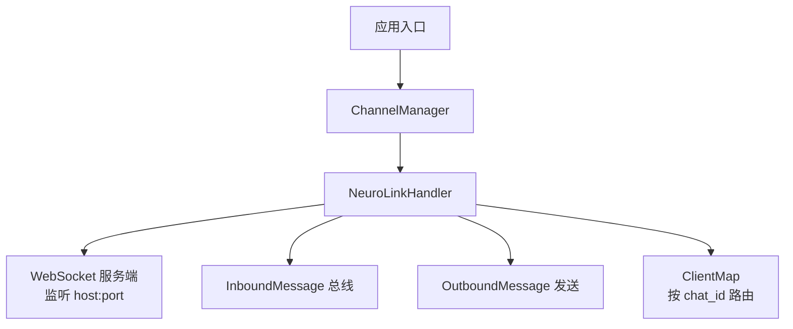
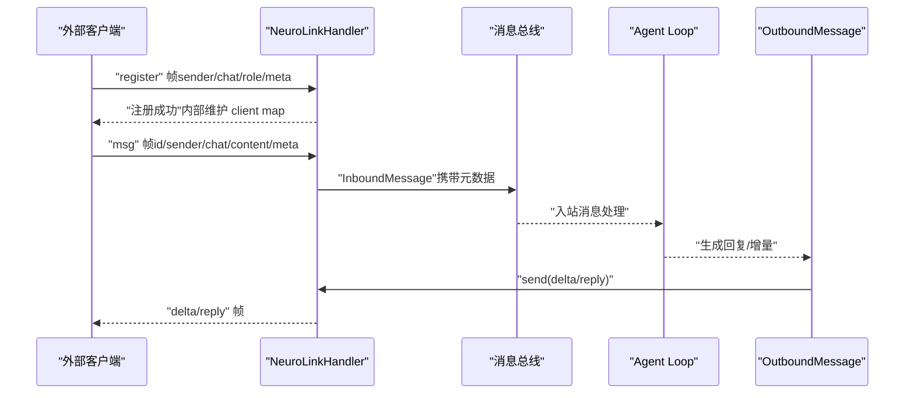
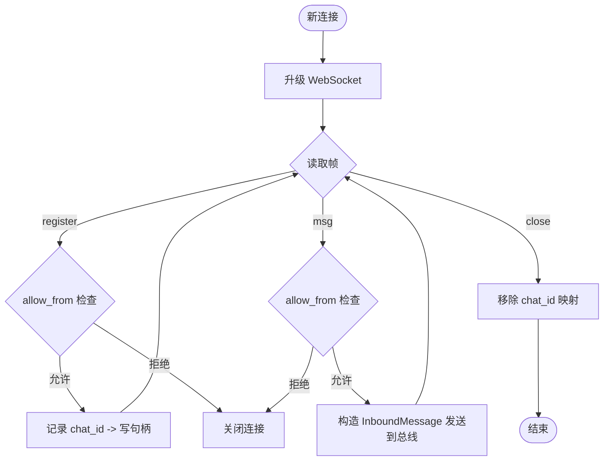
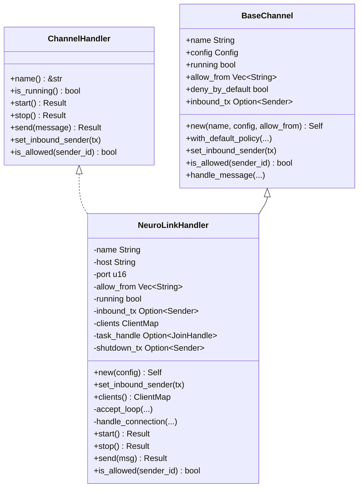
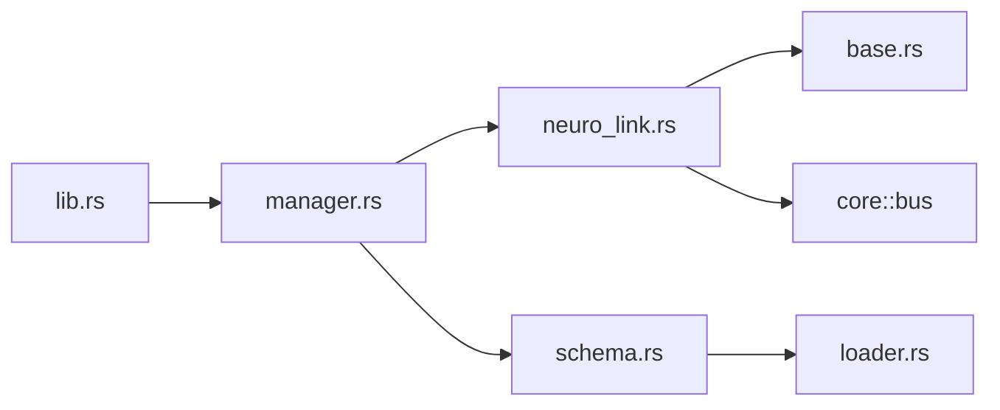

# 神经链接通道

<cite>
**本文引用的文件**
- [neuro_link.rs](file://agent-diva-channels/src/neuro_link.rs)
- [base.rs](file://agent-diva-channels/src/base.rs)
- [manager.rs](file://agent-diva-channels/src/manager.rs)
- [lib.rs](file://agent-diva-channels/src/lib.rs)
- [schema.rs](file://agent-diva-core/src/config/schema.rs)
- [loader.rs](file://agent-diva-core/src/config/loader.rs)
- [README.md](file://README.md)
</cite>

## 目录
1. [简介](#简介)
2. [项目结构](#项目结构)
3. [核心组件](#核心组件)
4. [架构总览](#架构总览)
5. [详细组件分析](#详细组件分析)
6. [依赖关系分析](#依赖关系分析)
7. [性能与扩展性](#性能与扩展性)
8. [安全与隐私](#安全与隐私)
9. [配置与使用指南](#配置与使用指南)
10. [故障排查](#故障排查)
11. [结论](#结论)

## 简介
本文件为“神经链接通道”（Neuro-Link）提供完整的技术说明、集成方法与配置指南。神经链接通道是一个本地 WebSocket 服务器，用于在进程内或本机与其他管道客户端进行双向通信。它通过统一的通道接口接入 Agent Diva 的消息总线，支持消息接收、流式增量输出以及回复发送。该通道定位为“预留的重型通道”，默认不对外暴露非回环地址，强调安全边界。

## 项目结构
神经链接通道位于 channels 模块中，由以下关键文件组成：
- 通道实现：neuro_link.rs
- 通道基类与校验：base.rs
- 通道管理器：manager.rs
- 模块导出：lib.rs
- 配置定义：schema.rs（包含 NeuroLinkConfig）
- 配置别名归一化：loader.rs（将 neuro-link / neuro_link / generic_pipe 统一）

图表来源
- [manager.rs:362-642](file://agent-diva-channels/src/manager.rs#L362-L642)
- [neuro_link.rs:82-164](file://agent-diva-channels/src/neuro_link.rs#L82-L164)
- [base.rs:232-233](file://agent-diva-channels/src/base.rs#L232-L233)

章节来源
- [lib.rs:1-53](file://agent-diva-channels/src/lib.rs#L1-L53)
- [manager.rs:1-800](file://agent-diva-channels/src/manager.rs#L1-L800)
- [neuro_link.rs:1-531](file://agent-diva-channels/src/neuro_link.rs#L1-L531)
- [base.rs:1-422](file://agent-diva-channels/src/base.rs#L1-L422)
- [schema.rs:974-1007](file://agent-diva-core/src/config/schema.rs#L974-L1007)
- [loader.rs:429-463](file://agent-diva-core/src/config/loader.rs#L429-L463)

## 核心组件
- NeuroLinkHandler：实现 ChannelHandler 接口的具体通道处理器，负责启动本地 WebSocket 服务、连接管理、协议解析、入站消息转发到总线、出站消息回写。
- BaseChannel：通用通道能力与访问控制策略（allow_from、deny_by_default），并提供基础校验工具（如 validate_neurolink_host）。
- ChannelManager：根据配置初始化并启停各通道，包括神经链接通道；提供统一的消息发送与状态查询。
- NeuroLinkConfig：通道配置结构体，包含 enabled、host、port、allow_from。

章节来源
- [neuro_link.rs:82-164](file://agent-diva-channels/src/neuro_link.rs#L82-L164)
- [base.rs:73-230](file://agent-diva-channels/src/base.rs#L73-L230)
- [manager.rs:362-642](file://agent-diva-channels/src/manager.rs#L362-L642)
- [schema.rs:974-1007](file://agent-diva-core/src/config/schema.rs#L974-L1007)

## 架构总览
神经链接通道作为本地 WebSocket 服务端运行，外部客户端通过 JSON 帧与其交互。通道将入站消息转换为 InboundMessage 推送到消息总线，Agent Loop 处理后通过 OutboundMessage 经同一通道返回给客户端。

图表来源
- [neuro_link.rs:166-289](file://agent-diva-channels/src/neuro_link.rs#L166-L289)
- [neuro_link.rs:356-386](file://agent-diva-channels/src/neuro_link.rs#L356-L386)
- [neuro_link.rs:409-435](file://agent-diva-channels/src/neuro_link.rs#L409-L435)

## 详细组件分析

### 协议与数据帧
- 入站帧类型
  - register：客户端注册，包含 sender、chat、可选 role、meta。首次注册后建立 chat_id 到写句柄的映射。
  - msg：实际消息，包含 id、sender、chat、content、meta。
- 出站帧类型
  - reply：对某条入站消息的直接回复。
  - delta：流式增量输出，常用于实时响应。
- 字段约定
  - pipe：帧类型标识（register/msg/delta/reply）
  - id：请求/消息唯一标识
  - reply_to：回复目标消息 id
  - chat：会话标识
  - content：文本内容
  - meta：扩展元数据（键值对）

章节来源
- [neuro_link.rs:31-69](file://agent-diva-channels/src/neuro_link.rs#L31-L69)
- [neuro_link.rs:190-289](file://agent-diva-channels/src/neuro_link.rs#L190-L289)
- [neuro_link.rs:356-386](file://agent-diva-channels/src/neuro_link.rs#L356-L386)
- [neuro_link.rs:409-435](file://agent-diva-channels/src/neuro_link.rs#L409-L435)

### 连接与会话管理
- 每个连接独立处理，首次收到 register 或 msg 时记录 chat_id 并保存写句柄到 ClientMap。
- 断开连接时清理对应 chat_id 的条目，避免资源泄漏。
- 支持 allow_from 白名单过滤，未在白名单中的 sender 将被拒绝。

图表来源
- [neuro_link.rs:166-289](file://agent-diva-channels/src/neuro_link.rs#L166-L289)

章节来源
- [neuro_link.rs:166-289](file://agent-diva-channels/src/neuro_link.rs#L166-L289)

### 入站消息处理流程
- 解析 JSON 帧，校验 pipe 字段。
- 若为 register，则完成注册与权限校验。
- 若为 msg，则构建 InboundMessage 并附加元数据（pipe_msg_id、meta 等），发送至消息总线。
- 错误处理：JSON 解析失败、read 错误、发送失败均会记录日志并继续或终止连接。

章节来源
- [neuro_link.rs:190-289](file://agent-diva-channels/src/neuro_link.rs#L190-L289)

### 出站消息发送与流式增量
- send：根据 OutboundMessage 的 metadata 决定 pipe 类型（默认 reply），序列化 PipeFrame 并通过已注册的写句柄发送。
- send_delta：专用函数用于推送增量内容，pipe 固定为 delta。
- 若目标 chat_id 无对应客户端，返回 NotRunning 错误。

章节来源
- [neuro_link.rs:356-386](file://agent-diva-channels/src/neuro_link.rs#L356-L386)
- [neuro_link.rs:409-435](file://agent-diva-channels/src/neuro_link.rs#L409-L435)

### 通道生命周期管理
- start：绑定 TCP 监听地址，启动 accept_loop，处理连接并接受 WebSocket 升级。
- stop：发送关闭信号，中止任务，关闭所有客户端写句柄，重置运行状态。
- manager：根据配置初始化并启动神经链接通道，支持动态更新与停止。

章节来源
- [neuro_link.rs:304-354](file://agent-diva-channels/src/neuro_link.rs#L304-L354)
- [manager.rs:562-575](file://agent-diva-channels/src/manager.rs#L562-L575)
- [manager.rs:644-680](file://agent-diva-channels/src/manager.rs#L644-L680)

### 类图（代码级）

图表来源
- [base.rs:9-32](file://agent-diva-channels/src/base.rs#L9-L32)
- [base.rs:73-230](file://agent-diva-channels/src/base.rs#L73-L230)
- [neuro_link.rs:82-164](file://agent-diva-channels/src/neuro_link.rs#L82-L164)
- [neuro_link.rs:294-395](file://agent-diva-channels/src/neuro_link.rs#L294-L395)

## 依赖关系分析
- 模块导出：lib.rs 暴露 base、manager、neuro_link 等模块及公共类型。
- 管理器：manager.rs 根据 ChannelsConfig 创建并启动 NeuroLinkHandler。
- 配置：schema.rs 定义 NeuroLinkConfig；loader.rs 将多种键名归一化为 canonical key。
- 运行时：neuro_link.rs 依赖 tokio_tungstenite 进行 WebSocket 通信，依赖 agent_diva_core::bus 进行消息收发。

图表来源
- [lib.rs:1-53](file://agent-diva-channels/src/lib.rs#L1-L53)
- [manager.rs:1-800](file://agent-diva-channels/src/manager.rs#L1-L800)
- [schema.rs:974-1007](file://agent-diva-core/src/config/schema.rs#L974-L1007)
- [loader.rs:429-463](file://agent-diva-core/src/config/loader.rs#L429-L463)
- [neuro_link.rs:1-27](file://agent-diva-channels/src/neuro_link.rs#L1-L27)

章节来源
- [lib.rs:1-53](file://agent-diva-channels/src/lib.rs#L1-L53)
- [manager.rs:1-800](file://agent-diva-channels/src/manager.rs#L1-L800)
- [schema.rs:974-1007](file://agent-diva-core/src/config/schema.rs#L974-L1007)
- [loader.rs:429-463](file://agent-diva-core/src/config/loader.rs#L429-L463)

## 性能与扩展性
- 并发模型：基于 Tokio 异步 I/O，每个连接独立任务处理，accept_loop 使用 select! 同时处理新连接与关闭信号。
- 内存占用：ClientMap 以 Arc<RwLock<HashMap<String, WsSink>>> 维护，按 chat_id 索引，连接断开时及时清理。
- 可扩展点：
  - 协议扩展：可在 PipeFrame/PipeMsg/PipeRegister 中添加新字段，保持向后兼容。
  - 鉴权扩展：allow_from 可结合更复杂的匹配策略（当前支持精确匹配）。
  - 流式优化：send_delta 可用于高频增量推送，注意客户端消费能力与背压。

[本节为通用指导，无需特定文件引用]

## 安全与隐私
- 主机绑定限制：validate_neurolink_host 仅允许 127.0.0.1 或 localhost；非回环地址将返回警告式错误，建议生产环境严格限制为本地回环。
- 访问控制：allow_from 白名单机制，未列入的 sender 将被拒绝；空列表表示允许全部（可通过 deny_by_default 调整默认策略）。
- 元数据处理：入站消息的 meta 会被透传到 InboundMessage，建议在下游进行敏感信息过滤与脱敏。
- 日志与审计：连接、错误、拒绝事件均有日志记录，便于问题定位与安全审计。

章节来源
- [base.rs:255-268](file://agent-diva-channels/src/base.rs#L255-L268)
- [base.rs:121-184](file://agent-diva-channels/src/base.rs#L121-L184)
- [neuro_link.rs:222-258](file://agent-diva-channels/src/neuro_link.rs#L222-L258)

## 配置与使用指南

### 配置项说明（NeuroLinkConfig）
- enabled：是否启用神经链接通道。
- host：监听地址，建议使用 127.0.0.1 或 localhost。
- port：监听端口，默认 9100。
- allow_from：允许的 sender 列表，为空表示允许全部（或通过 deny_by_default 调整默认策略）。

章节来源
- [schema.rs:974-1007](file://agent-diva-core/src/config/schema.rs#L974-L1007)
- [loader.rs:429-463](file://agent-diva-core/src/config/loader.rs#L429-L463)

### 配置文件示例（概念性）
- 在 channels 下添加 neuro-link 或 neuro_link 或 generic_pipe 任一键名，设置 enabled、host、port、allow_from。
- 确保 host 为本地回环地址，避免暴露到公网。

章节来源
- [loader.rs:429-463](file://agent-diva-core/src/config/loader.rs#L429-L463)
- [schema.rs:974-1007](file://agent-diva-core/src/config/schema.rs#L974-L1007)

### 设备连接参数与数据格式
- 连接参数：WebSocket 地址为 ws://{host}:{port}。
- 数据格式：
  - 入站：register/msg 帧，包含 pipe、id、sender、chat、content、meta。
  - 出站：reply/delta 帧，包含 pipe、id、reply_to、chat、content、meta。
- 元数据：支持自定义键值对，用于传递额外上下文（如 pipe_msg_id）。

章节来源
- [neuro_link.rs:31-69](file://agent-diva-channels/src/neuro_link.rs#L31-L69)
- [neuro_link.rs:190-289](file://agent-diva-channels/src/neuro_link.rs#L190-L289)
- [neuro_link.rs:356-386](file://agent-diva-channels/src/neuro_link.rs#L356-L386)
- [neuro_link.rs:409-435](file://agent-diva-channels/src/neuro_link.rs#L409-L435)

### 信号预处理、噪声过滤与意图识别
- 当前通道层不做信号预处理、噪声过滤或意图识别；这些逻辑应在上游客户端或下游 Agent Loop 中实现。
- 建议：
  - 客户端侧进行信号降噪与特征提取。
  - 下游通过工具或技能实现意图识别与响应生成。
  - 使用 meta 字段传递预处理结果与置信度。

[本节为通用指导，无需特定文件引用]

### 安全考虑与隐私保护
- 仅在本机回环地址监听，避免远程访问。
- 使用 allow_from 限制可信来源。
- 对敏感元数据进行脱敏后再进入系统。
- 记录并审计连接与访问事件。

章节来源
- [base.rs:255-268](file://agent-diva-channels/src/base.rs#L255-L268)
- [neuro_link.rs:222-258](file://agent-diva-channels/src/neuro_link.rs#L222-L258)

## 故障排查
- 无法启动监听：检查 host:port 是否被占用，确认 bind 成功。
- 客户端无法注册：确认 allow_from 包含 sender；检查 register 帧格式。
- 消息未到达总线：检查 msg 帧格式与元数据；查看日志中的解析错误。
- 无法发送回复：确认 chat_id 已注册且客户端在线；否则返回 NotRunning。
- 主机绑定警告：validate_neurolink_host 对非回环地址返回错误，请改为 127.0.0.1 或 localhost。

章节来源
- [neuro_link.rs:304-354](file://agent-diva-channels/src/neuro_link.rs#L304-L354)
- [neuro_link.rs:190-289](file://agent-diva-channels/src/neuro_link.rs#L190-L289)
- [base.rs:255-268](file://agent-diva-channels/src/base.rs#L255-L268)

## 结论
神经链接通道为 Agent Diva 提供了安全的本地 WebSocket 管道能力，支持消息接收、流式增量输出与回复发送。其设计强调本地回环绑定与访问控制，适合作为未来重型通道的基座。通过合理的配置与上下游协作，可实现脑机接口数据接收、信号处理与响应生成的端到端链路。

[本节为总结，无需特定文件引用]