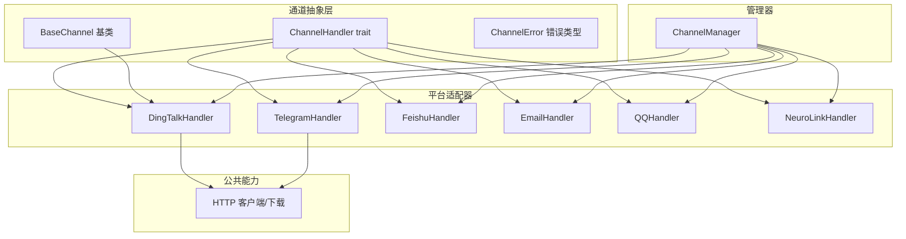
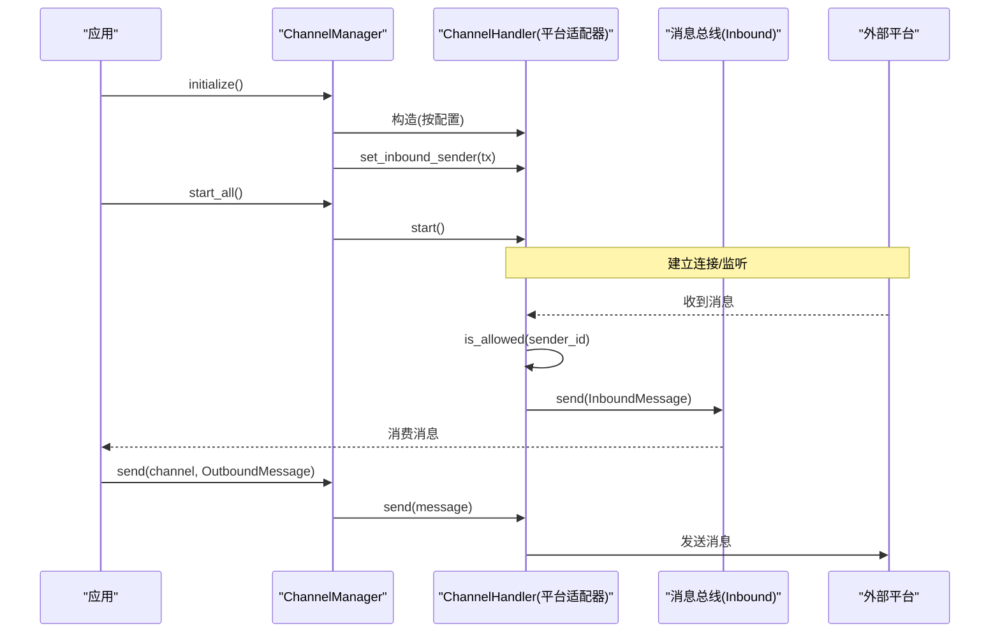
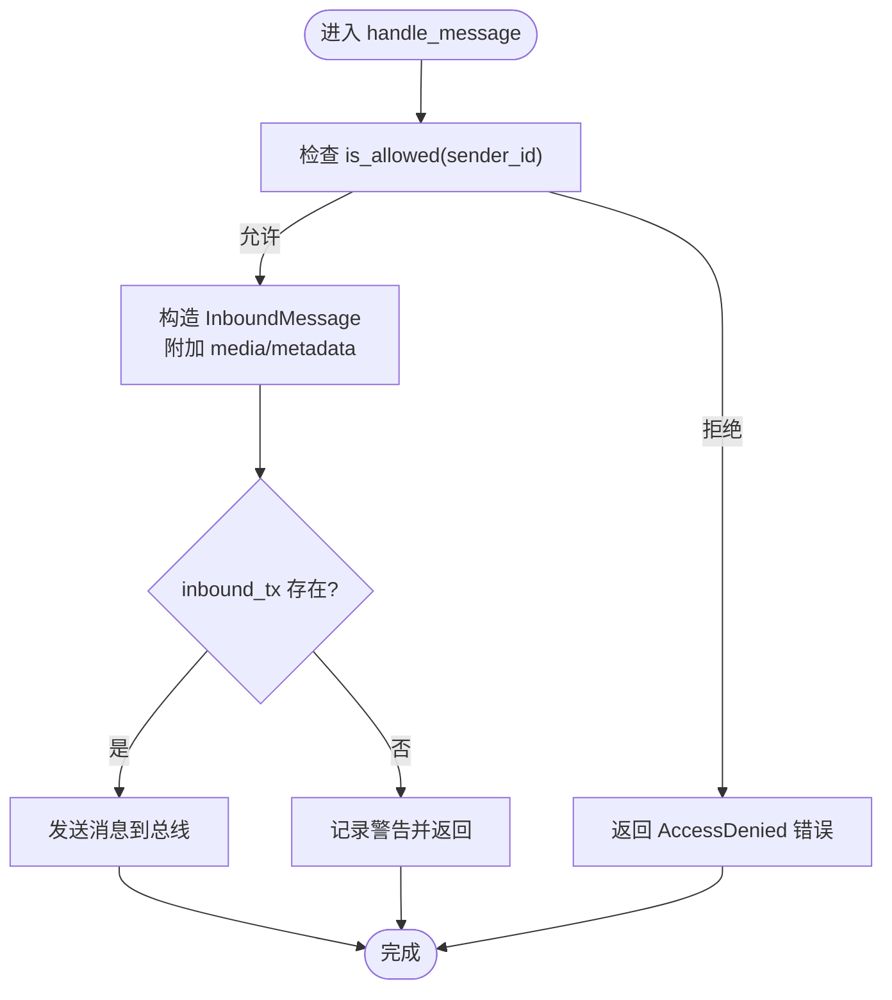
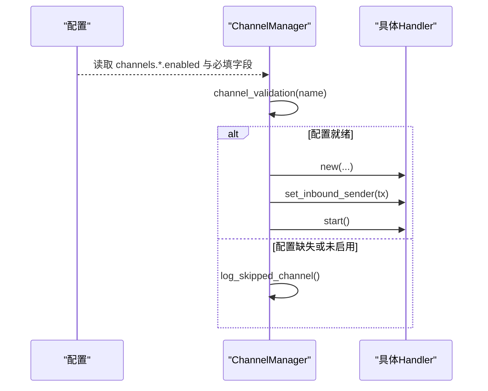
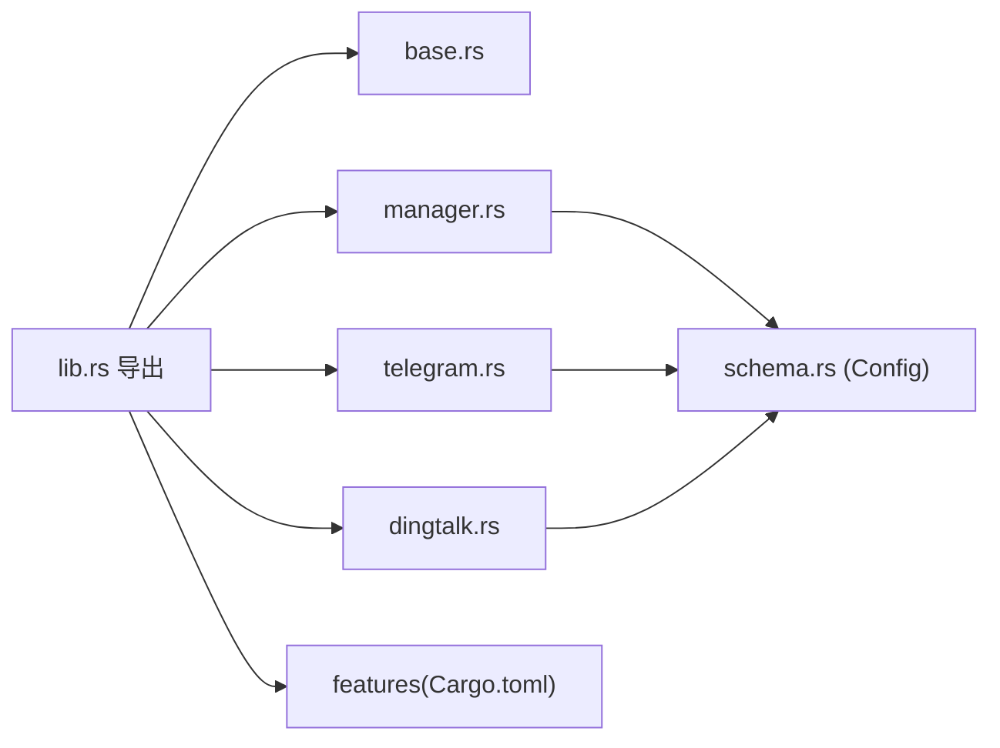

# 通道架构设计

<cite>
**本文引用的文件**
- [lib.rs](file://agent-diva-channels/src/lib.rs)
- [base.rs](file://agent-diva-channels/src/base.rs)
- [manager.rs](file://agent-diva-channels/src/manager.rs)
- [telegram.rs](file://agent-diva-channels/src/telegram.rs)
- [dingtalk.rs](file://agent-diva-channels/src/dingtalk.rs)
- [common/mod.rs](file://agent-diva-channels/src/common/mod.rs)
- [Cargo.toml](file://agent-diva-channels/Cargo.toml)
- [schema.rs](file://agent-diva-core/src/config/schema.rs)
</cite>

## 目录
1. [简介](#简介)
2. [项目结构](#项目结构)
3. [核心组件](#核心组件)
4. [架构总览](#架构总览)
5. [详细组件分析](#详细组件分析)
6. [依赖关系分析](#依赖关系分析)
7. [性能与并发注意事项](#性能与并发注意事项)
8. [故障排查指南](#故障排查指南)
9. [结论](#结论)
10. [附录：扩展新平台适配器的步骤](#附录：扩展新平台适配器的步骤)

## 简介
本文件面向开发者，系统化阐述 Agent Diva 的“通道”子系统架构。重点覆盖：
- BaseChannel 基类的设计模式与通用能力（访问控制、入站消息封装）
- ChannelHandler trait 接口规范（生命周期、发送、入站桥接）
- ChannelManager 管理器的生命周期管理（注册、启动、停止、销毁、热更新）
- 消息路由机制、连接管理与错误处理策略
- 通道适配器开发指南与配置结构、状态管理与监控指标
- 如何扩展新的聊天平台支持

## 项目结构
通道子系统位于 agent-diva-channels crate，采用“统一抽象 + 多实现”的分层组织：
- base：定义 ChannelHandler trait、BaseChannel 基类、错误类型与工具方法
- manager：集中管理各平台 Handler 的创建、初始化、启停、查询与热更新
- common：HTTP 客户端构建、媒体下载等通用能力
- 具体平台适配器：如 telegram、dingtalk、feishu、email、qq、neuro_link 等
- 通过 Cargo features 控制可选通道编译与启用

图表来源
- [base.rs:9-32](file://agent-diva-channels/src/base.rs#L9-L32)
- [base.rs:73-233](file://agent-diva-channels/src/base.rs#L73-L233)
- [manager.rs:42-755](file://agent-diva-channels/src/manager.rs#L42-L755)
- [common/mod.rs:5-51](file://agent-diva-channels/src/common/mod.rs#L5-L51)

章节来源
- [lib.rs:1-53](file://agent-diva-channels/src/lib.rs#L1-L53)
- [Cargo.toml:11-20](file://agent-diva-channels/Cargo.toml#L11-L20)

## 核心组件
- ChannelHandler trait：定义通道的最小契约，包括 name、is_running、start、stop、send、set_inbound_sender、is_allowed。所有平台适配器必须实现该 trait。
- BaseChannel：提供通用的允许列表校验、入站消息构造与发送、默认策略（allow_all 或 deny_by_default）。
- ChannelManager：集中负责通道实例的创建、初始化、启停、查询、热更新与发送路由。
- 平台适配器：以 Telegram/DingTalk 为代表，实现各自协议细节（鉴权、长连接、消息格式转换、去重、访问控制等）。

章节来源
- [base.rs:9-32](file://agent-diva-channels/src/base.rs#L9-L32)
- [base.rs:73-233](file://agent-diva-channels/src/base.rs#L73-L233)
- [manager.rs:42-755](file://agent-diva-channels/src/manager.rs#L42-L755)
- [telegram.rs:36-127](file://agent-diva-channels/src/telegram.rs#L36-L127)
- [dingtalk.rs:154-192](file://agent-diva-channels/src/dingtalk.rs#L154-L192)

## 架构总览
通道子系统围绕“统一抽象 + 管理器调度 + 平台适配”的模式运行：
- 上层通过 ChannelManager 获取或发送消息到指定通道
- 每个通道实现 ChannelHandler，负责与外部平台交互
- BaseChannel 提供通用能力，减少重复代码
- 管理器在初始化阶段根据配置决定是否创建并启动对应通道
- 入站消息经 set_inbound_sender 注入后，由通道适配器统一封装为 InboundMessage 推送到总线

图表来源
- [manager.rs:377-642](file://agent-diva-channels/src/manager.rs#L377-L642)
- [manager.rs:644-697](file://agent-diva-channels/src/manager.rs#L644-L697)
- [base.rs:186-229](file://agent-diva-channels/src/base.rs#L186-L229)

## 详细组件分析

### ChannelHandler trait 接口规范
- name：通道标识名，用于路由与管理
- is_running：运行时状态查询
- start/stop：生命周期管理，需保证幂等与可恢复
- send：向外发送消息（OutboundMessage）
- set_inbound_sender：注入入站消息发送端，将平台消息转为 InboundMessage 推送
- is_allowed：访问控制，决定特定 sender_id 是否被允许

章节来源
- [base.rs:9-32](file://agent-diva-channels/src/base.rs#L9-L32)

### BaseChannel 基类设计模式
- 通用字段：name、config、running、allow_from、deny_by_default、inbound_tx
- 访问控制策略：
  - allow_from 为空时，遵循 deny_by_default 策略（默认 allow_all）
  - 支持通配符匹配与复合 ID（如 “12345|username”）
- 入站消息封装：handle_message 自动填充 media、metadata，并通过 inbound_tx 发送
- 安全校验：session key 格式校验、neuro-link 主机地址限制（仅本地回环）

图表来源
- [base.rs:121-184](file://agent-diva-channels/src/base.rs#L121-L184)
- [base.rs:186-229](file://agent-diva-channels/src/base.rs#L186-L229)

章节来源
- [base.rs:73-233](file://agent-diva-channels/src/base.rs#L73-L233)
- [base.rs:239-268](file://agent-diva-channels/src/base.rs#L239-L268)

### ChannelManager 生命周期管理
- 初始化 initialize：
  - 遍历配置中各通道，若 enabled 且必填字段齐全则创建对应 Handler 并注入 inbound_tx
  - 未满足条件时记录跳过原因（missing fields）
- 启动 start_all：
  - 对已注册的 Handler 调用 start，失败不影响其他通道继续运行
- 停止 stop_all：
  - 逐个调用 stop，最后清空 handlers
- 热更新 update_channel：
  - 停止旧实例 -> 移除 -> 基于新配置构建新实例 -> 设置 inbound_tx -> 启动 -> 插入映射
- 路由 send：
  - 根据 channel 名称查找 Handler，转发 OutboundMessage
- 查询 list_channels / is_channel_running / get_handler

图表来源
- [manager.rs:58-163](file://agent-diva-channels/src/manager.rs#L58-L163)
- [manager.rs:377-642](file://agent-diva-channels/src/manager.rs#L377-L642)

章节来源
- [manager.rs:42-755](file://agent-diva-channels/src/manager.rs#L42-L755)

### 平台适配器示例

#### Telegram 适配器
- 职责：维护 Bot 实例、命令分发、打字指示、聊天 ID 映射、停止生成指令
- 接入点：new 构造、set_inbound_sender、is_allowed（允许列表）、markdown_to_html 转换
- 特点：使用 teloxide 框架进行事件分发；通过 HTTP 调用内部 API 触发停止

章节来源
- [telegram.rs:18-127](file://agent-diva-channels/src/telegram.rs#L18-L127)

#### DingTalk 适配器
- 职责：Stream 模式 WebSocket 接收消息、HTTP API 发送消息、消息去重、访问策略（dm/group policy）
- 接入点：new 构造 BaseChannel、set_inbound_sender、token 刷新、processed_ids 去重
- 特点：无需公网 IP；支持私聊与群聊；Markdown 消息

章节来源
- [dingtalk.rs:1-192](file://agent-diva-channels/src/dingtalk.rs#L1-L192)

### 消息路由机制
- 入站：平台适配器收到消息后，先执行 is_allowed，再通过 BaseChannel.handle_message 封装为 InboundMessage 并发送到 inbound_tx
- 出站：上层通过 ChannelManager.send 将 OutboundMessage 路由到指定 channel 的 Handler.send

章节来源
- [base.rs:186-229](file://agent-diva-channels/src/base.rs#L186-L229)
- [manager.rs:688-697](file://agent-diva-channels/src/manager.rs#L688-L697)

### 连接池与网络客户端
- 统一通过 create_http_client 构建带超时的 reqwest Client
- 媒体下载 download_file 将远程资源保存到本地媒体目录，便于后续处理

章节来源
- [common/mod.rs:5-51](file://agent-diva-channels/src/common/mod.rs#L5-L51)

### 错误处理策略
- 统一错误类型 ChannelError，涵盖配置缺失、未运行、API 错误、发送失败、认证失败、连接失败、访问拒绝等
- 管理器在启动/停止/更新过程中记录错误日志，尽量保持其他通道可用
- 访问控制失败返回 AccessDenied，便于上层统计与告警

章节来源
- [base.rs:34-71](file://agent-diva-channels/src/base.rs#L34-L71)
- [manager.rs:644-697](file://agent-diva-channels/src/manager.rs#L644-L697)

## 依赖关系分析
- 模块导出：lib.rs 暴露 BaseChannel、ChannelHandler、ChannelManager 及各平台 Handler
- 特性开关：Cargo.toml 通过 features 控制可选通道编译与测试
- 配置模型：core 层的 schema.rs 定义了各通道配置结构（enabled、凭据、策略、allow_from 等）

图表来源
- [lib.rs:9-53](file://agent-diva-channels/src/lib.rs#L9-L53)
- [Cargo.toml:11-20](file://agent-diva-channels/Cargo.toml#L11-L20)
- [schema.rs:709-949](file://agent-diva-core/src/config/schema.rs#L709-L949)

章节来源
- [lib.rs:9-53](file://agent-diva-channels/src/lib.rs#L9-L53)
- [Cargo.toml:11-20](file://agent-diva-channels/Cargo.toml#L11-L20)
- [schema.rs:709-949](file://agent-diva-core/src/config/schema.rs#L709-L949)

## 性能与并发注意事项
- 锁持有范围：文档指出 manager.rs 中存在跨 await 持锁的风险（例如 start_all、stop_all、send、update_channel），建议将迭代集合提前拷贝出锁，避免长时间持有全局读写锁阻塞其他操作
- 建议优化：
  - start_all：先克隆 handlers 列表再释放读锁，逐一起动
  - stop_all：先收集待停止项，释放写锁后再逐一 stop
  - send：先查找到 handler 引用，再释放 map 锁后调用 send
  - update_channel：分阶段停止旧实例、释放锁、启动新实例、重新加锁插入
- 这些优化可降低锁竞争，提升并发吞吐与响应性

章节来源
- [manager.rs:644-697](file://agent-diva-channels/src/manager.rs#L644-L697)
- [docs/dev/.../P1-4-channel-manager-lock.md:1-140](file://docs/dev/archive(old-docs-dont-read-me)/2026-08-docs-corpus-reset/legacy-batches/agent-diva-main/docs/dev/20260611-general-audit-main/P1-4-channel-manager-lock.md#L1-L140)

## 故障排查指南
- 通道未启动：检查配置 enabled 与必填字段是否齐全；查看管理器日志中的 skipped channel 提示
- 访问被拒绝：确认 sender_id 是否在 allow_from 列表中；注意复合 ID 与通配符匹配规则
- 发送失败：核对 outbound 目标通道是否存在；检查平台 API 返回码与错误信息
- 连接问题：确认网络可达性与凭据正确性；对于需要本地绑定的通道（如 neuro-link），确保仅绑定本地地址
- 热更新失败：确认新配置有效；若新实例启动失败，旧实例已被停止，需回滚或修正配置后重试

章节来源
- [manager.rs:58-163](file://agent-diva-channels/src/manager.rs#L58-L163)
- [base.rs:121-184](file://agent-diva-channels/src/base.rs#L121-L184)
- [base.rs:239-268](file://agent-diva-channels/src/base.rs#L239-L268)

## 结论
Agent Diva 的通道子系统通过统一的 ChannelHandler 抽象与 BaseChannel 基类，实现了多平台适配的可扩展架构；ChannelManager 提供了完善的生命周期管理与路由能力。结合配置驱动与特性开关，系统可在不同环境中灵活启用所需通道。建议在后续版本中进一步优化管理器锁粒度，以提升高并发场景下的稳定性与性能。

## 附录：扩展新平台适配器的步骤
- 新增适配器文件：在 agent-diva-channels/src 下创建新模块（如 myplatform.rs），实现 ChannelHandler trait
- 复用 BaseChannel：如需通用访问控制与入站消息封装，可组合 BaseChannel
- 配置结构：在 core 的 schema.rs 中添加 MyPlatformConfig，包含 enabled、凭据、策略、allow_from 等字段
- 管理器集成：
  - 在 manager.rs 的 build_updated_handler 与 initialize 中添加对新平台的分支
  - 在 channel_validation 中声明必填字段
  - 在 configured_channel_names 中纳入新平台
- 特性开关（可选）：在 Cargo.toml 添加 feature 并在 lib.rs 中条件导出
- 测试与验证：编写单元测试与集成测试，覆盖启动、停止、发送、访问控制与错误路径

章节来源
- [base.rs:9-32](file://agent-diva-channels/src/base.rs#L9-L32)
- [manager.rs:222-359](file://agent-diva-channels/src/manager.rs#L222-L359)
- [schema.rs:709-949](file://agent-diva-core/src/config/schema.rs#L709-L949)
- [Cargo.toml:11-20](file://agent-diva-channels/Cargo.toml#L11-L20)
- [lib.rs:9-53](file://agent-diva-channels/src/lib.rs#L9-L53)