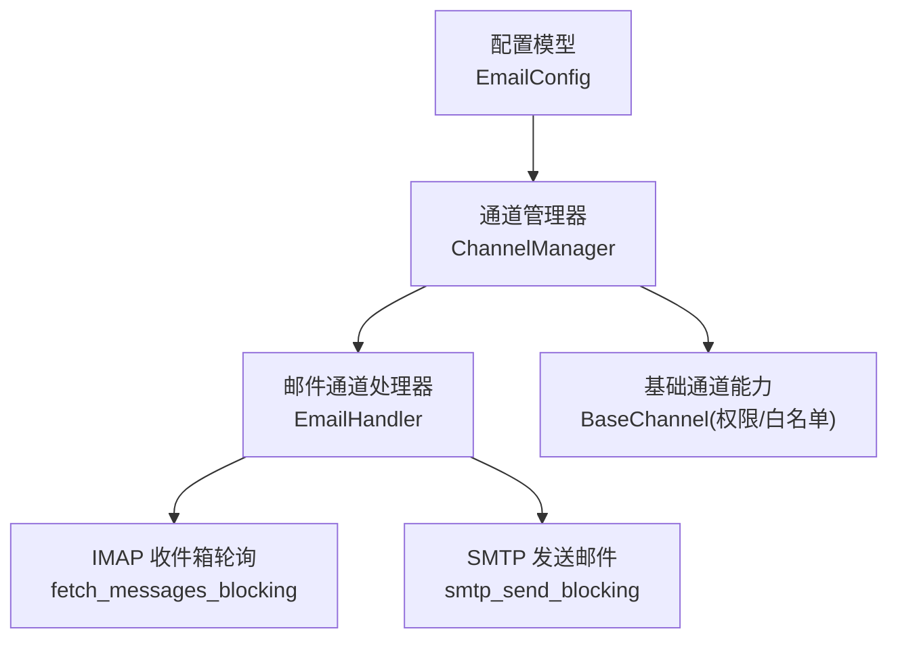
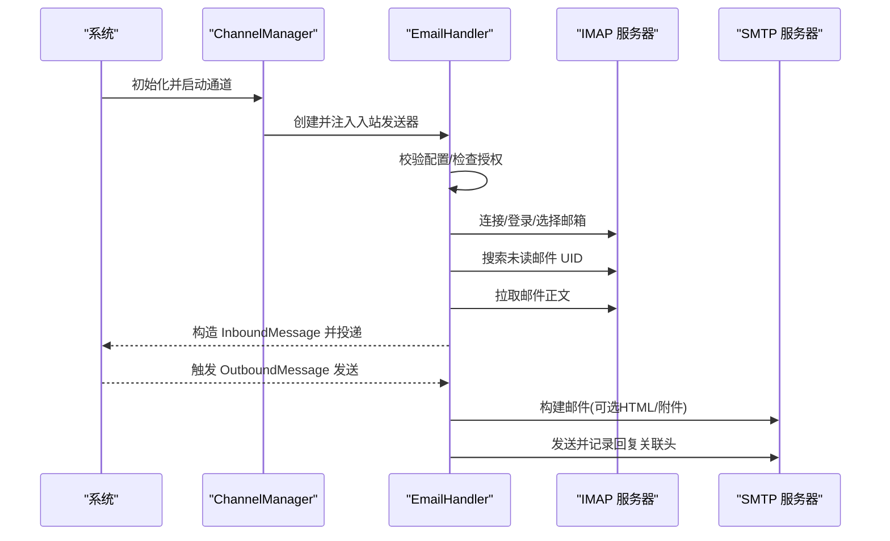
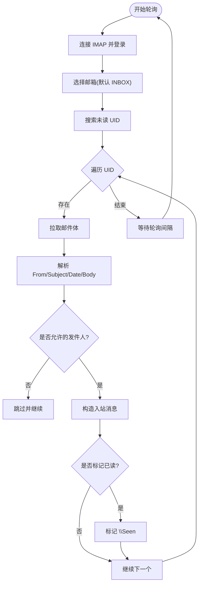
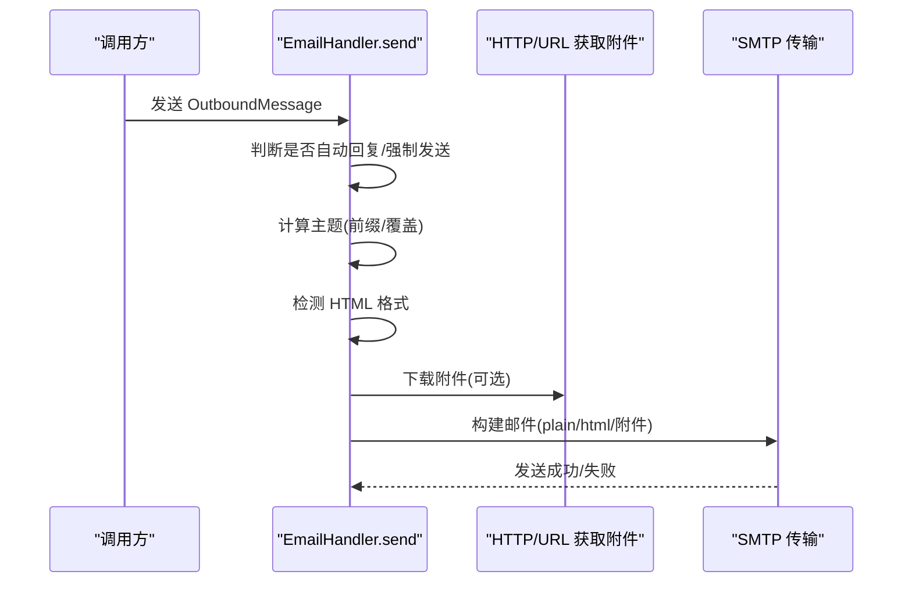
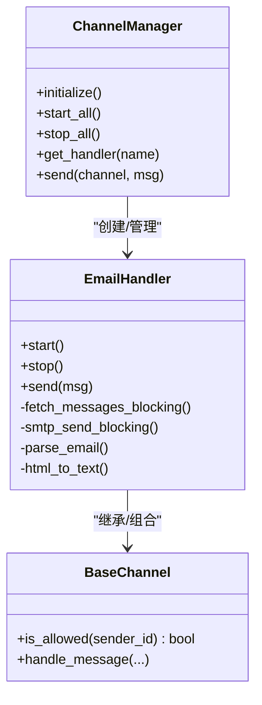

# 邮件通道

<cite>
**本文引用的文件**
- [agent-diva-channels/src/email.rs](file://agent-diva-channels/src/email.rs)
- [agent-diva-channels/src/base.rs](file://agent-diva-channels/src/base.rs)
- [agent-diva-channels/src/manager.rs](file://agent-diva-channels/src/manager.rs)
- [agent-diva-core/src/config/schema.rs](file://agent-diva-core/src/config/schema.rs)
- [agent-diva-gui/src/components/settings/channel-wizard-fields.ts](file://agent-diva-gui/src/components/settings/channel-wizard-fields.ts)
</cite>

## 目录
1. [简介](#简介)
2. [项目结构](#项目结构)
3. [核心组件](#核心组件)
4. [架构总览](#架构总览)
5. [详细组件分析](#详细组件分析)
6. [依赖关系分析](#依赖关系分析)
7. [性能与容量特性](#性能与容量特性)
8. [故障排查指南](#故障排查指南)
9. [结论](#结论)
10. [附录：配置参考与示例](#附录：配置参考与示例)

## 简介
本章节面向“邮件通道”的配置与使用，覆盖以下目标：
- 解释 SMTP 与 IMAP 协议在系统中的配置方式，包括端口、加密与认证。
- 说明支持的邮件功能：收件箱监听（IMAP 轮询）、邮件发送（SMTP）、HTML 格式支持、附件处理。
- 提供完整的配置项清单与常见邮箱服务商的服务器地址、端口与认证要点。
- 解释邮件格式转换、主题解析与内容提取机制。
- 说明模板与批量能力的使用边界与建议。
- 提供连接超时、认证失败、过滤规则等问题的排查方法。

## 项目结构
邮件通道由“通道实现 + 通道管理 + 配置模型 + GUI 向导字段”共同组成：
- 通道实现：负责 IMAP 收件箱轮询与 SMTP 发送邮件。
- 通道管理：统一初始化、启停与路由各通道。
- 配置模型：定义 EmailConfig 的所有可配置项及默认值。
- GUI 向导：提供可视化配置入口与字段提示。

图表来源
- [agent-diva-core/src/config/schema.rs:790-888](file://agent-diva-core/src/config/schema.rs#L790-L888)
- [agent-diva-channels/src/manager.rs:481-499](file://agent-diva-channels/src/manager.rs#L481-L499)
- [agent-diva-channels/src/email.rs:177-410](file://agent-diva-channels/src/email.rs#L177-L410)
- [agent-diva-channels/src/base.rs:73-229](file://agent-diva-channels/src/base.rs#L73-L229)

章节来源
- [agent-diva-channels/src/email.rs:1-789](file://agent-diva-channels/src/email.rs#L1-L789)
- [agent-diva-channels/src/manager.rs:1-800](file://agent-diva-channels/src/manager.rs#L1-L800)
- [agent-diva-core/src/config/schema.rs:790-888](file://agent-diva-core/src/config/schema.rs#L790-L888)
- [agent-diva-gui/src/components/settings/channel-wizard-fields.ts:213-353](file://agent-diva-gui/src/components/settings/channel-wizard-fields.ts#L213-L353)

## 核心组件
- EmailHandler：实现 IMAP 轮询与 SMTP 发送的核心逻辑，包含 HTML 转文本、主题前缀处理、附件抓取与发送、回复关联头维护等。
- BaseChannel：提供跨通道的通用能力，如允许发件人白名单、访问控制策略、入站消息投递。
- ChannelManager：根据配置动态创建并启动 EmailHandler，统一管理生命周期。
- EmailConfig：集中定义 IMAP/SMTP 相关参数、行为开关与限制。

章节来源
- [agent-diva-channels/src/email.rs:31-410](file://agent-diva-channels/src/email.rs#L31-L410)
- [agent-diva-channels/src/base.rs:73-229](file://agent-diva-channels/src/base.rs#L73-L229)
- [agent-diva-channels/src/manager.rs:481-499](file://agent-diva-channels/src/manager.rs#L481-L499)
- [agent-diva-core/src/config/schema.rs:790-888](file://agent-diva-core/src/config/schema.rs#L790-L888)

## 架构总览
邮件通道采用“阻塞式 IMAP 轮询 + 阻塞式 SMTP 发送”，通过异步任务调度与线程池隔离，避免阻塞事件循环。

图表来源
- [agent-diva-channels/src/email.rs:428-558](file://agent-diva-channels/src/email.rs#L428-L558)
- [agent-diva-channels/src/email.rs:573-689](file://agent-diva-channels/src/email.rs#L573-L689)
- [agent-diva-channels/src/manager.rs:481-499](file://agent-diva-channels/src/manager.rs#L481-L499)

## 详细组件分析

### 收件箱监听（IMAP 轮询）
- 连接与登录：使用 TLS 连接 IMAP 服务器，登录后选择邮箱（默认 INBOX）。
- 未读检索：按 UNSEEN 搜索 UID，逐个拉取邮件体。
- 去重与标记：维护已处理 UID 集合，支持将邮件标记为已读。
- 内容解析：优先取纯文本，回退到 HTML 转文本；截取最大字符数。
- 权限控制：基于 allow_from 白名单过滤发件人。
- 入站投递：构造 InboundMessage，携带 message_id、subject、date、uid 等元数据。

图表来源
- [agent-diva-channels/src/email.rs:177-291](file://agent-diva-channels/src/email.rs#L177-L291)
- [agent-diva-channels/src/email.rs:462-552](file://agent-diva-channels/src/email.rs#L462-L552)

章节来源
- [agent-diva-channels/src/email.rs:177-291](file://agent-diva-channels/src/email.rs#L177-L291)
- [agent-diva-channels/src/email.rs:462-552](file://agent-diva-channels/src/email.rs#L462-L552)

### 邮件发送（SMTP）
- 发件人选择：优先使用 from_address，否则回退到 smtp_username 或 imap_username。
- 主题处理：自动添加主题前缀（默认 Re:），支持元数据覆盖主题。
- HTML 支持：若检测到 HTML 或元数据指定 format=html，则同时生成 plain 与 html 两部分。
- 附件处理：从 OutboundMessage.media 列表下载附件，推断文件名与 MIME 类型并附加。
- 回复关联：自动设置 In-Reply-To 与 References 以维持对话线程。
- 传输层：支持 STARTTLS 与 SSL 直连两种模式，端口与主机来自配置。

图表来源
- [agent-diva-channels/src/email.rs:307-410](file://agent-diva-channels/src/email.rs#L307-L410)
- [agent-diva-channels/src/email.rs:573-689](file://agent-diva-channels/src/email.rs#L573-L689)

章节来源
- [agent-diva-channels/src/email.rs:307-410](file://agent-diva-channels/src/email.rs#L307-L410)
- [agent-diva-channels/src/email.rs:573-689](file://agent-diva-channels/src/email.rs#L573-L689)

### 权限与白名单
- 白名单策略：allow_from 为空时遵循默认策略（默认允许所有）；也可显式开启“默认拒绝”。
- 复合 ID 匹配：支持形如 “id|username” 的复合标识进行匹配。
- 通配符匹配：支持 * 通配符进行域名或用户段匹配。

章节来源
- [agent-diva-channels/src/base.rs:73-229](file://agent-diva-channels/src/base.rs#L73-L229)

### 主题解析与内容提取
- 主题前缀：自动添加 Re: 或自定义前缀，避免重复添加。
- 内容提取：优先取 text/plain，若无则取 text/html 并转换为纯文本；最终截断至 max_body_chars。
- 元数据：保留 message_id、subject、date、uid 以便后续回复与追踪。

章节来源
- [agent-diva-channels/src/email.rs:93-127](file://agent-diva-channels/src/email.rs#L93-L127)
- [agent-diva-channels/src/email.rs:129-175](file://agent-diva-channels/src/email.rs#L129-L175)
- [agent-diva-channels/src/email.rs:488-537](file://agent-diva-channels/src/email.rs#L488-L537)

### 模板系统与批量处理
- 模板系统：当前实现未内置模板引擎；可通过外部工具生成 OutboundMessage.content 后发送。
- 批量处理：OutboundMessage 支持 media 列表，用于批量附件；但单条消息对应单个收件人。如需批量发送，可在上层循环调用 send。

章节来源
- [agent-diva-channels/src/email.rs:634-663](file://agent-diva-channels/src/email.rs#L634-L663)

## 依赖关系分析
- EmailHandler 依赖：
  - IMAP 客户端库：用于连接、登录、选择邮箱、搜索与拉取邮件。
  - 邮件解析库：用于解析 From、Subject、Date、Body(text/html)。
  - SMTP 传输库：用于构建与发送邮件，支持 STARTTLS/SSL。
  - HTTP 客户端：用于下载附件。
- BaseChannel 提供：
  - 白名单与访问控制。
  - 入站消息投递封装。
- ChannelManager 负责：
  - 根据配置启用/禁用通道。
  - 创建并启动 EmailHandler。
  - 统一生命周期管理。

图表来源
- [agent-diva-channels/src/email.rs:31-410](file://agent-diva-channels/src/email.rs#L31-L410)
- [agent-diva-channels/src/base.rs:73-229](file://agent-diva-channels/src/base.rs#L73-L229)
- [agent-diva-channels/src/manager.rs:481-499](file://agent-diva-channels/src/manager.rs#L481-L499)

章节来源
- [agent-diva-channels/src/email.rs:31-410](file://agent-diva-channels/src/email.rs#L31-L410)
- [agent-diva-channels/src/base.rs:73-229](file://agent-diva-channels/src/base.rs#L73-L229)
- [agent-diva-channels/src/manager.rs:481-499](file://agent-diva-channels/src/manager.rs#L481-L499)

## 性能与容量特性
- 轮询间隔：默认 30 秒，最小不低于 5 秒，避免频繁请求。
- 已处理 UID 缓存：内存中维护最多约 10 万条 UID，超过阈值会清理，防止内存增长。
- 正文长度限制：默认最大 12000 字符，避免过大内容影响处理效率。
- 阻塞操作隔离：IMAP/SMTP 操作在阻塞线程执行，不阻塞主事件循环。
- 附件下载：按需下载，大小受网络与内存限制，建议合理控制附件数量与体积。

章节来源
- [agent-diva-channels/src/email.rs:462-552](file://agent-diva-channels/src/email.rs#L462-L552)
- [agent-diva-core/src/config/schema.rs:850-888](file://agent-diva-core/src/config/schema.rs#L850-L888)

## 故障排查指南
- 连接超时
  - 检查 IMAP/SMTP 主机名与端口是否正确。
  - 确认防火墙/代理允许出站连接。
  - 验证 TLS/STARTTLS/SSL 模式与服务端一致。
  - 日志关注“连接错误”“TLS 连接器错误”“SMTP relay/starttls 错误”。
- 认证失败
  - 核对用户名与密码（或应用专用密码）。
  - 部分服务商需开启“允许第三方应用”或使用授权码。
  - 日志关注“认证错误”“登录失败”。
- 邮件过滤规则
  - 检查 allow_from 白名单是否包含发件人。
  - 若启用“默认拒绝”，必须显式加入允许列表。
  - 日志关注“访问被拒绝”“跳过未授权发件人”。
- 无法收到邮件
  - 确认 consent_granted 已开启。
  - 检查 IMAP 邮箱名称是否为 INBOX 或其他有效邮箱。
  - 查看轮询日志与错误信息。
- 无法发送邮件
  - 确认 SMTP 主机、端口、加密模式正确。
  - 检查 from_address 是否合法。
  - 日志关注“构建邮件错误”“SMTP 发送错误”。

章节来源
- [agent-diva-channels/src/email.rs:61-91](file://agent-diva-channels/src/email.rs#L61-L91)
- [agent-diva-channels/src/email.rs:177-291](file://agent-diva-channels/src/email.rs#L177-L291)
- [agent-diva-channels/src/email.rs:307-410](file://agent-diva-channels/src/email.rs#L307-L410)
- [agent-diva-channels/src/base.rs:121-229](file://agent-diva-channels/src/base.rs#L121-L229)

## 结论
邮件通道通过 IMAP 轮询与 SMTP 发送实现了稳定的收发能力，具备 HTML 支持与附件处理能力，并通过白名单与授权开关保障安全。合理配置 IMAP/SMTP 参数与行为选项，可满足大多数企业或个人邮箱场景。对于复杂模板与批量需求，可在上层编排 OutboundMessage 并循环调用发送接口。

## 附录：配置参考与示例

### 配置项总览（EmailConfig）
- 基本开关
  - enabled：是否启用邮件通道。
  - consent_granted：是否已获得用户授权。
- IMAP 设置
  - imap_host：IMAP 服务器地址。
  - imap_port：IMAP 端口（默认 993）。
  - imap_username：IMAP 用户名。
  - imap_password：IMAP 密码。
  - imap_mailbox：邮箱名称（默认 INBOX）。
  - imap_use_ssl：是否使用 SSL 连接 IMAP（默认 true）。
- SMTP 设置
  - smtp_host：SMTP 服务器地址。
  - smtp_port：SMTP 端口（默认 587）。
  - smtp_username：SMTP 用户名。
  - smtp_password：SMTP 密码。
  - smtp_use_tls：是否使用 STARTTLS（默认 true）。
  - smtp_use_ssl：是否使用 SSL（默认 false）。
  - from_address：发件人地址。
- 行为选项
  - auto_reply_enabled：是否启用自动回复。
  - poll_interval_seconds：轮询间隔（默认 30 秒）。
  - mark_seen：是否标记已读（默认 true）。
  - max_body_chars：正文最大字符数（默认 12000）。
  - subject_prefix：主题前缀（默认 Re: ）。
  - allow_from：允许的发件人列表。

章节来源
- [agent-diva-core/src/config/schema.rs:790-888](file://agent-diva-core/src/config/schema.rs#L790-L888)
- [agent-diva-gui/src/components/settings/channel-wizard-fields.ts:213-353](file://agent-diva-gui/src/components/settings/channel-wizard-fields.ts#L213-L353)

### 主流邮箱服务商配置要点
- Gmail
  - IMAP：imap.gmail.com，端口 993，启用 SSL。
  - SMTP：smtp.gmail.com，端口 587，启用 STARTTLS。
  - 认证：建议使用应用专用密码，并在账户中开启“允许第三方应用”。
- Outlook/Hotmail
  - IMAP：outlook.office365.com，端口 993，启用 SSL。
  - SMTP：smtp-mail.outlook.com，端口 587，启用 STARTTLS。
  - 认证：使用账户密码或应用专用密码。
- QQ 邮箱
  - IMAP：imap.qq.com，端口 993，启用 SSL。
  - SMTP：smtp.qq.com，端口 587，启用 STARTTLS。
  - 认证：需开启 IMAP/SMTP 服务并使用授权码。
- 163/126 邮箱
  - IMAP：imap.163.com 或 imap.126.com，端口 993，启用 SSL。
  - SMTP：smtp.163.com 或 smtp.126.com，端口 587，启用 STARTTLS。
  - 认证：需开启 IMAP/SMTP 服务并使用授权码。

注意：以上为常见默认值，具体请以服务商最新文档为准。

章节来源
- [agent-diva-core/src/config/schema.rs:840-858](file://agent-diva-core/src/config/schema.rs#L840-L858)
- [agent-diva-gui/src/components/settings/channel-wizard-fields.ts:213-353](file://agent-diva-gui/src/components/settings/channel-wizard-fields.ts#L213-L353)

### 完整配置示例（JSON）
以下为典型配置示例，请替换占位符为你的实际值：
- 基本字段
  - channels.email.enabled: true
  - channels.email.consent_granted: true
- IMAP
  - channels.email.imap_host: "imap.example.com"
  - channels.email.imap_port: 993
  - channels.email.imap_username: "your@example.com"
  - channels.email.imap_password: "your-imap-password-or-app-key"
  - channels.email.imap_mailbox: "INBOX"
  - channels.email.imap_use_ssl: true
- SMTP
  - channels.email.smtp_host: "smtp.example.com"
  - channels.email.smtp_port: 587
  - channels.email.smtp_username: "your@example.com"
  - channels.email.smtp_password: "your-smtp-password-or-app-key"
  - channels.email.smtp_use_tls: true
  - channels.email.smtp_use_ssl: false
  - channels.email.from_address: "your@example.com"
- 行为
  - channels.email.auto_reply_enabled: true
  - channels.email.poll_interval_seconds: 30
  - channels.email.mark_seen: true
  - channels.email.max_body_chars: 12000
  - channels.email.subject_prefix: "Re: "
  - channels.email.allow_from: ["user@example.com"]

章节来源
- [agent-diva-core/src/config/schema.rs:790-888](file://agent-diva-core/src/config/schema.rs#L790-L888)
- [agent-diva-gui/src/components/settings/channel-wizard-fields.ts:213-353](file://agent-diva-gui/src/components/settings/channel-wizard-fields.ts#L213-L353)

### 使用流程与最佳实践
- 首次启用
  - 填写 IMAP/SMTP 配置，确保连通性与认证正确。
  - 开启 consent_granted，避免通道被静默禁用。
- 日常使用
  - 通过 OutboundMessage 发送回复，系统会自动维护主题与回复关联头。
  - 如需 HTML 输出，设置 metadata.format=html 或确保 content 为 HTML。
  - 附件通过 media 列表传入，系统将下载并附加。
- 安全与合规
  - 使用 allow_from 限制可接收的发件人。
  - 定期审查日志，关注连接与认证错误。
  - 对敏感信息做脱敏处理后再发送。

章节来源
- [agent-diva-channels/src/email.rs:428-558](file://agent-diva-channels/src/email.rs#L428-L558)
- [agent-diva-channels/src/email.rs:573-689](file://agent-diva-channels/src/email.rs#L573-L689)
- [agent-diva-channels/src/base.rs:121-229](file://agent-diva-channels/src/base.rs#L121-L229)