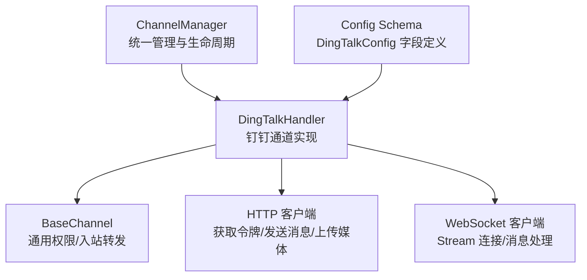
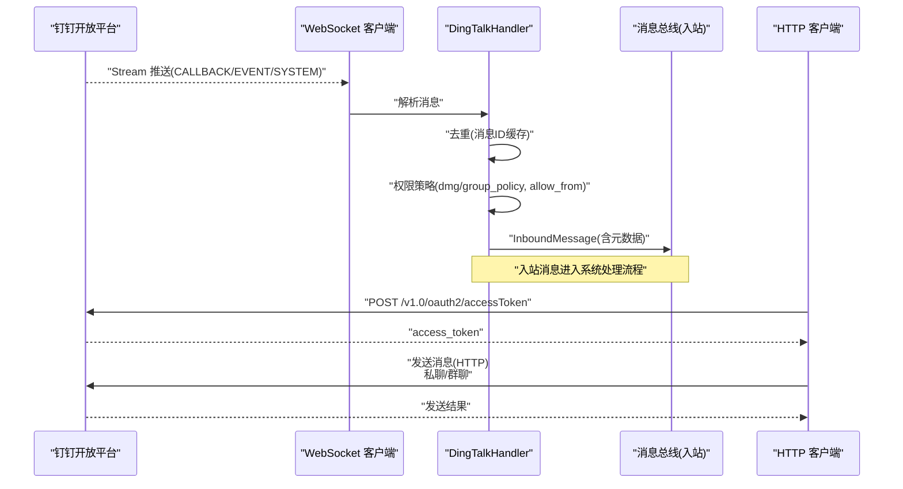
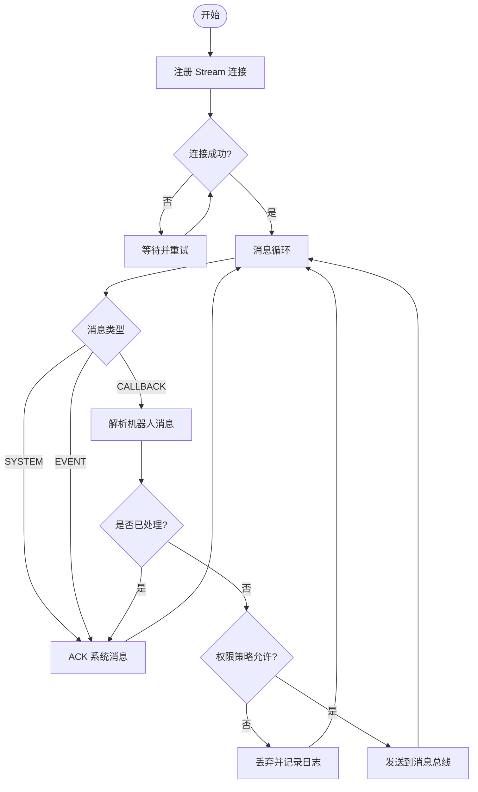
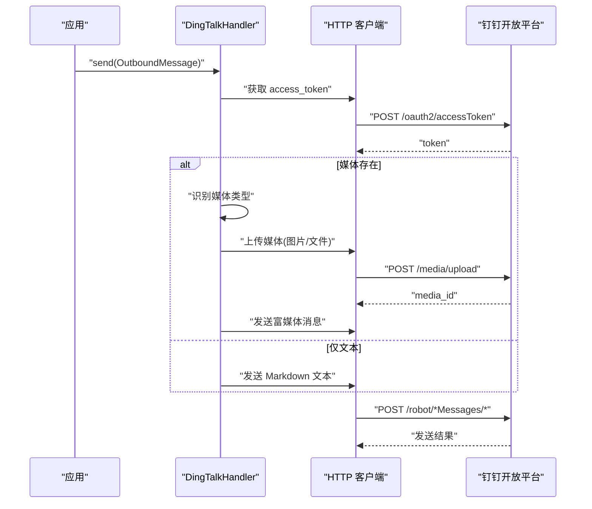
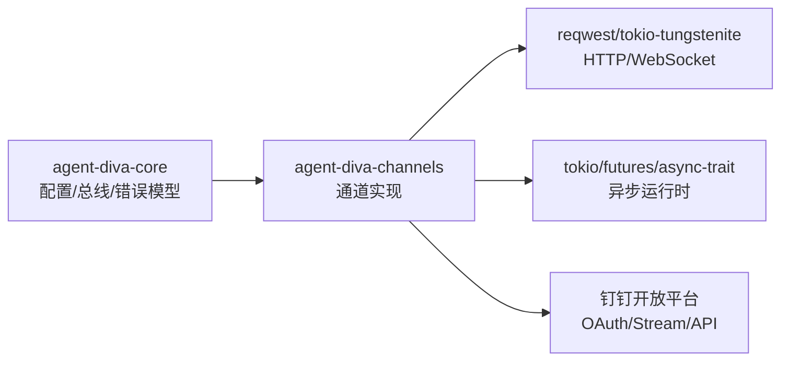

# 钉钉通道

<cite>
**本文引用的文件**
- [agent-diva-channels/src/dingtalk.rs](file://agent-diva-channels/src/dingtalk.rs)
- [agent-diva-channels/src/base.rs](file://agent-diva-channels/src/base.rs)
- [agent-diva-channels/src/manager.rs](file://agent-diva-channels/src/manager.rs)
- [agent-diva-core/src/config/schema.rs](file://agent-diva-core/src/config/schema.rs)
- [agent-diva-channels/Cargo.toml](file://agent-diva-channels/Cargo.toml)
</cite>

## 目录
1. [简介](#简介)
2. [项目结构](#项目结构)
3. [核心组件](#核心组件)
4. [架构总览](#架构总览)
5. [详细组件分析](#详细组件分析)
6. [依赖关系分析](#依赖关系分析)
7. [性能与可靠性](#性能与可靠性)
8. [故障排查指南](#故障排查指南)
9. [结论](#结论)
10. [附录：配置示例与最佳实践](#附录配置示例与最佳实践)

## 简介
本章节面向需要在企业环境中集成钉钉通道的用户，提供从开放平台机器人配置、API 密钥管理到消息收发、权限控制、媒体上传与企业级工作流集成的完整说明。该实现基于钉钉 Stream 模式（WebSocket）接收消息，并通过 HTTP API 发送消息，支持企业内部机器人、群机器人消息、Markdown 文本与图片/文件等富媒体内容。

## 项目结构
钉钉通道位于 channels 模块中，由统一的 ChannelManager 初始化并启动；具体实现集中在 dingtalk.rs，基础能力在 base.rs，配置结构定义在 core 的 schema.rs。

图表来源
- [agent-diva-channels/src/manager.rs:459-479](file://agent-diva-channels/src/manager.rs#L459-L479)
- [agent-diva-channels/src/dingtalk.rs:154-187](file://agent-diva-channels/src/dingtalk.rs#L154-L187)
- [agent-diva-channels/src/base.rs:73-129](file://agent-diva-channels/src/base.rs#L73-L129)
- [agent-diva-core/src/config/schema.rs:753-788](file://agent-diva-core/src/config/schema.rs#L753-L788)

章节来源
- [agent-diva-channels/src/manager.rs:459-479](file://agent-diva-channels/src/manager.rs#L459-L479)
- [agent-diva-channels/src/dingtalk.rs:154-187](file://agent-diva-channels/src/dingtalk.rs#L154-L187)
- [agent-diva-channels/src/base.rs:73-129](file://agent-diva-channels/src/base.rs#L73-L129)
- [agent-diva-core/src/config/schema.rs:753-788](file://agent-diva-core/src/config/schema.rs#L753-L788)

## 核心组件
- DingTalkHandler：负责钉钉 Stream 连接、消息去重、鉴权、收发消息、媒体上传、权限策略判断。
- BaseChannel：提供跨通道的通用能力，如 allow_from 白名单、默认拒绝策略、入站消息封装与转发。
- ChannelManager：根据配置动态创建、启动、停止各通道，包含对钉钉通道的校验与初始化逻辑。
- DingTalkConfig：钉钉通道配置结构体，包含启用开关、凭证、策略与白名单等。

章节来源
- [agent-diva-channels/src/dingtalk.rs:154-187](file://agent-diva-channels/src/dingtalk.rs#L154-L187)
- [agent-diva-channels/src/base.rs:73-129](file://agent-diva-channels/src/base.rs#L73-L129)
- [agent-diva-channels/src/manager.rs:85-91](file://agent-diva-channels/src/manager.rs#L85-L91)
- [agent-diva-core/src/config/schema.rs:753-788](file://agent-diva-core/src/config/schema.rs#L753-L788)

## 架构总览
钉钉通道采用“Stream 模式 + HTTP”的组合：
- 接收：通过 Stream WebSocket 订阅事件与回调，解析消息后去重、权限校验，再推送到内部消息总线。
- 发送：使用 HTTP 接口获取访问令牌，按私聊或群聊调用不同端点发送 Markdown 或富媒体消息。

图表来源
- [agent-diva-channels/src/dingtalk.rs:274-323](file://agent-diva-channels/src/dingtalk.rs#L274-L323)
- [agent-diva-channels/src/dingtalk.rs:529-603](file://agent-diva-channels/src/dingtalk.rs#L529-L603)
- [agent-diva-channels/src/dingtalk.rs:605-667](file://agent-diva-channels/src/dingtalk.rs#L605-L667)
- [agent-diva-channels/src/dingtalk.rs:831-858](file://agent-diva-channels/src/dingtalk.rs#L831-L858)

## 详细组件分析

### 认证与令牌管理
- 令牌获取：通过 HTTP 调用钉钉 OAuth 接口，传入 appKey/appSecret（对应配置的 client_id/client_secret），返回 access_token 并缓存，提前过期以避免边界问题。
- 安全建议：将 client_id 与 client_secret 作为敏感信息妥善管理，避免硬编码；生产环境建议使用环境变量或密钥管理服务注入。

章节来源
- [agent-diva-channels/src/dingtalk.rs:224-272](file://agent-diva-channels/src/dingtalk.rs#L224-L272)
- [agent-diva-core/src/config/schema.rs:753-788](file://agent-diva-core/src/config/schema.rs#L753-L788)

### Stream 连接与消息接收
- 注册 Stream：向钉钉注册连接，声明订阅类型（EVENT、CALLBACK），获取 endpoint 与 ticket。
- WebSocket 循环：建立连接后持续接收消息，处理 CALLBACK（机器人消息）、SYSTEM（心跳等）、EVENT（事件）。
- 消息处理：解析消息体，提取文本内容与发送者信息；进行去重与权限检查；构造 InboundMessage 并发送到总线。

图表来源
- [agent-diva-channels/src/dingtalk.rs:274-323](file://agent-diva-channels/src/dingtalk.rs#L274-L323)
- [agent-diva-channels/src/dingtalk.rs:529-603](file://agent-diva-channels/src/dingtalk.rs#L529-L603)
- [agent-diva-channels/src/dingtalk.rs:605-667](file://agent-diva-channels/src/dingtalk.rs#L605-L667)
- [agent-diva-channels/src/dingtalk.rs:669-777](file://agent-diva-channels/src/dingtalk.rs#L669-L777)

章节来源
- [agent-diva-channels/src/dingtalk.rs:274-323](file://agent-diva-channels/src/dingtalk.rs#L274-L323)
- [agent-diva-channels/src/dingtalk.rs:529-603](file://agent-diva-channels/src/dingtalk.rs#L529-L603)
- [agent-diva-channels/src/dingtalk.rs:605-667](file://agent-diva-channels/src/dingtalk.rs#L605-L667)
- [agent-diva-channels/src/dingtalk.rs:669-777](file://agent-diva-channels/src/dingtalk.rs#L669-L777)

### 消息发送与富媒体支持
- 私聊与群聊：根据 chat_id 前缀判断为群聊或私聊，分别调用不同的 HTTP 端点。
- 文本消息：以 Markdown 格式发送，标题固定为回复标识。
- 媒体消息：支持图片直链与本地/远程文件上传，自动识别媒体类型并上传至钉钉，返回 media_id 后发送富媒体消息。

图表来源
- [agent-diva-channels/src/dingtalk.rs:325-387](file://agent-diva-channels/src/dingtalk.rs#L325-L387)
- [agent-diva-channels/src/dingtalk.rs:389-443](file://agent-diva-channels/src/dingtalk.rs#L389-L443)
- [agent-diva-channels/src/dingtalk.rs:445-516](file://agent-diva-channels/src/dingtalk.rs#L445-L516)
- [agent-diva-channels/src/dingtalk.rs:831-858](file://agent-diva-channels/src/dingtalk.rs#L831-L858)

章节来源
- [agent-diva-channels/src/dingtalk.rs:325-387](file://agent-diva-channels/src/dingtalk.rs#L325-L387)
- [agent-diva-channels/src/dingtalk.rs:389-443](file://agent-diva-channels/src/dingtalk.rs#L389-L443)
- [agent-diva-channels/src/dingtalk.rs:445-516](file://agent-diva-channels/src/dingtalk.rs#L445-L516)
- [agent-diva-channels/src/dingtalk.rs:831-858](file://agent-diva-channels/src/dingtalk.rs#L831-L858)

### 权限与安全策略
- 策略字段：dm_policy（私聊策略）、group_policy（群聊策略），支持 open/pairing/allowlist 等语义。
- 白名单：allow_from 列表用于精确控制可访问的用户或群组；支持通配符匹配。
- 默认行为：当 allow_from 为空时，遵循 deny_by_default 策略；钉钉通道默认不强制拒绝，但可通过配置调整。

章节来源
- [agent-diva-channels/src/base.rs:73-129](file://agent-diva-channels/src/base.rs#L73-L129)
- [agent-diva-channels/src/base.rs:121-184](file://agent-diva-channels/src/base.rs#L121-L184)
- [agent-diva-core/src/config/schema.rs:753-788](file://agent-diva-core/src/config/schema.rs#L753-L788)
- [agent-diva-channels/src/dingtalk.rs:729-751](file://agent-diva-channels/src/dingtalk.rs#L729-L751)

### 配置结构与管理器
- 配置结构：DingTalkConfig 包含 enabled、client_id、client_secret、robot_code、dm_policy、group_policy、allow_from。
- 管理器校验：ChannelManager 在初始化时对钉钉通道进行必要字段校验，缺失则跳过启动并记录警告。

章节来源
- [agent-diva-core/src/config/schema.rs:753-788](file://agent-diva-core/src/config/schema.rs#L753-L788)
- [agent-diva-channels/src/manager.rs:85-91](file://agent-diva-channels/src/manager.rs#L85-L91)
- [agent-diva-channels/src/manager.rs:459-479](file://agent-diva-channels/src/manager.rs#L459-L479)

## 依赖关系分析
- 运行时依赖：tokio、async-trait、futures、reqwest、tokio-tungstenite 等用于异步网络与序列化。
- 功能特性：channels 模块通过 Cargo features 控制可选通道编译；钉钉通道默认启用。
- 外部服务：钉钉开放平台 API（OAuth、Stream、消息发送、媒体上传）。

图表来源
- [agent-diva-channels/Cargo.toml:22-60](file://agent-diva-channels/Cargo.toml#L22-L60)
- [agent-diva-channels/src/dingtalk.rs:18-34](file://agent-diva-channels/src/dingtalk.rs#L18-L34)

章节来源
- [agent-diva-channels/Cargo.toml:22-60](file://agent-diva-channels/Cargo.toml#L22-L60)
- [agent-diva-channels/src/dingtalk.rs:18-34](file://agent-diva-channels/src/dingtalk.rs#L18-L34)

## 性能与可靠性
- 令牌缓存：访问令牌在内存中缓存并在到期前刷新，减少频繁请求。
- 消息去重：维护最近处理的消息 ID 队列（容量上限），防止重复处理。
- 连接重试：WebSocket 断线后自动重试，提升稳定性。
- 媒体优化：图片直链可直接发送，无需上传；本地或远程文件按需下载并上传。
- 资源限制：入站消息队列与处理任务需结合上层系统容量规划，避免背压。

章节来源
- [agent-diva-channels/src/dingtalk.rs:224-272](file://agent-diva-channels/src/dingtalk.rs#L224-L272)
- [agent-diva-channels/src/dingtalk.rs:194-207](file://agent-diva-channels/src/dingtalk.rs#L194-L207)
- [agent-diva-channels/src/dingtalk.rs:529-603](file://agent-diva-channels/src/dingtalk.rs#L529-L603)
- [agent-diva-channels/src/dingtalk.rs:445-516](file://agent-diva-channels/src/dingtalk.rs#L445-L516)

## 故障排查指南
- 无法启动通道：检查 enabled 与必填字段（client_id、client_secret）是否配置正确。
- 令牌获取失败：确认 appKey/appSecret 有效且网络可达；查看错误日志中的状态码与响应体。
- 消息未送达：核对 chat_id 是否为正确的会话标识；群聊需使用 openConversationId，私聊使用 userId。
- 媒体上传失败：确认文件路径或 URL 可访问；检查媒体类型识别与钉钉返回的 media_id。
- 权限被拒：检查 dm_policy/group_policy 与 allow_from 列表；必要时放宽策略或添加白名单。
- WebSocket 断开：观察重连日志；确保防火墙/代理允许出站 WebSocket 连接。

章节来源
- [agent-diva-channels/src/manager.rs:85-91](file://agent-diva-channels/src/manager.rs#L85-L91)
- [agent-diva-channels/src/dingtalk.rs:224-272](file://agent-diva-channels/src/dingtalk.rs#L224-L272)
- [agent-diva-channels/src/dingtalk.rs:389-443](file://agent-diva-channels/src/dingtalk.rs#L389-L443)
- [agent-diva-channels/src/dingtalk.rs:445-516](file://agent-diva-channels/src/dingtalk.rs#L445-L516)
- [agent-diva-channels/src/dingtalk.rs:729-751](file://agent-diva-channels/src/dingtalk.rs#L729-L751)
- [agent-diva-channels/src/dingtalk.rs:529-603](file://agent-diva-channels/src/dingtalk.rs#L529-L603)

## 结论
钉钉通道通过 Stream 模式实现了低延迟、无需公网 IP 的消息接收，并结合 HTTP API 完成灵活的发送与富媒体支持。配合完善的权限策略与令牌缓存机制，可在企业环境中稳定运行。建议在部署时严格管理密钥、合理设置策略与白名单，并根据业务规模评估并发与资源占用。

## 附录：配置示例与最佳实践

### 配置字段说明
- enabled：是否启用钉钉通道。
- client_id：应用 Client ID（对应开放平台的 appKey）。
- client_secret：应用 Client Secret（对应开放平台的 appSecret）。
- robot_code：可选，指定机器人代码；若为空则回退使用 client_id。
- dm_policy：私聊策略，支持 open/pairing/allowlist。
- group_policy：群聊策略，支持 open/pairing/allowlist。
- allow_from：允许访问的用户或群组白名单，支持通配符匹配。

章节来源
- [agent-diva-core/src/config/schema.rs:753-788](file://agent-diva-core/src/config/schema.rs#L753-L788)
- [agent-diva-channels/src/dingtalk.rs:389-443](file://agent-diva-channels/src/dingtalk.rs#L389-L443)
- [agent-diva-channels/src/base.rs:121-184](file://agent-diva-channels/src/base.rs#L121-L184)

### 开放平台机器人配置流程（要点）
- 在企业内部应用中创建机器人，获取 Client ID 与 Client Secret。
- 开启 Stream 模式，以便在无公网 IP 环境下接收消息。
- 根据需要配置机器人权限与可见范围，确保目标用户或群组可访问。

章节来源
- [agent-diva-channels/src/dingtalk.rs:274-323](file://agent-diva-channels/src/dingtalk.rs#L274-L323)

### 支持的钉钉功能
- 企业内部机器人：通过 Stream 模式接收私聊与群聊消息，支持 Markdown 与富媒体。
- 工作通知：当前实现主要聚焦于机器人消息；如需工作通知，可结合工具层扩展调用相关 API。
- 群机器人：支持群内消息发送与接收，chat_id 使用 openConversationId。
- 企业微信集成：当前仓库未包含企业微信通道实现；如需集成，可参考现有通道模式新增独立通道。

章节来源
- [agent-diva-channels/src/dingtalk.rs:1-17](file://agent-diva-channels/src/dingtalk.rs#L1-L17)
- [agent-diva-channels/src/dingtalk.rs:389-443](file://agent-diva-channels/src/dingtalk.rs#L389-L443)

### 消息格式转换与元数据
- 入站消息：提取文本内容，附加 sender_name、conversation_id、conversation_type、message_id 等元数据。
- 出站消息：默认以 Markdown 文本发送；媒体消息通过上传获得 media_id 后发送富媒体。

章节来源
- [agent-diva-channels/src/dingtalk.rs:669-777](file://agent-diva-channels/src/dingtalk.rs#L669-L777)
- [agent-diva-channels/src/dingtalk.rs:831-858](file://agent-diva-channels/src/dingtalk.rs#L831-L858)

### 企业级工作流集成建议
- 审批流：可通过工具层调用钉钉审批 API，或在消息中嵌入链接引导用户至审批页面。
- 日程安排：结合日历 API 创建日程，或通过消息提醒触发日程操作。
- 文档协作：在消息中分享文档链接，或使用工具层更新共享文档内容。

章节来源
- [agent-diva-channels/src/dingtalk.rs:389-443](file://agent-diva-channels/src/dingtalk.rs#L389-L443)

### 安全与运维建议
- 密钥管理：使用环境变量或密钥管理服务注入 client_id/client_secret，避免明文存储。
- 策略最小化：优先使用 allowlist 与 pairing 策略，仅在受信任环境使用 open。
- 监控告警：关注令牌获取失败、WebSocket 断线、发送失败等关键日志，及时告警。
- 容量规划：根据消息量评估 WebSocket 连接数与 HTTP 并发，避免资源耗尽。

章节来源
- [agent-diva-channels/src/base.rs:73-129](file://agent-diva-channels/src/base.rs#L73-L129)
- [agent-diva-channels/src/dingtalk.rs:224-272](file://agent-diva-channels/src/dingtalk.rs#L224-L272)
- [agent-diva-channels/src/dingtalk.rs:529-603](file://agent-diva-channels/src/dingtalk.rs#L529-L603)