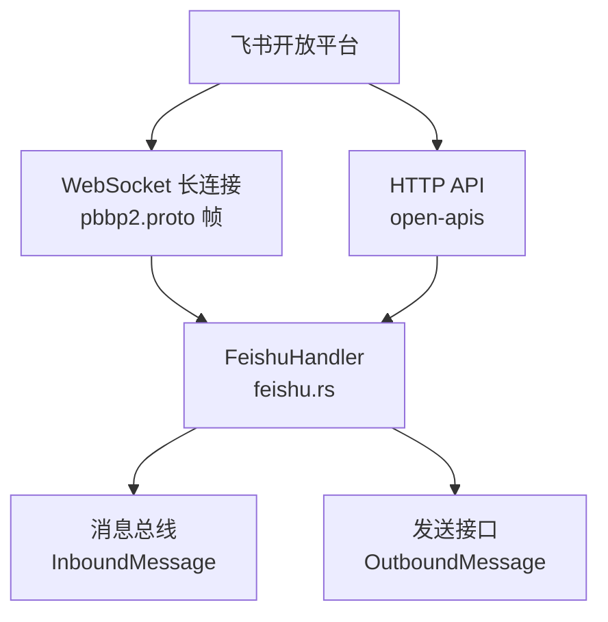
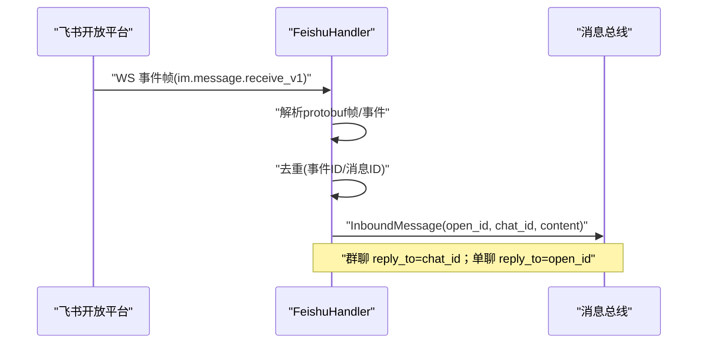
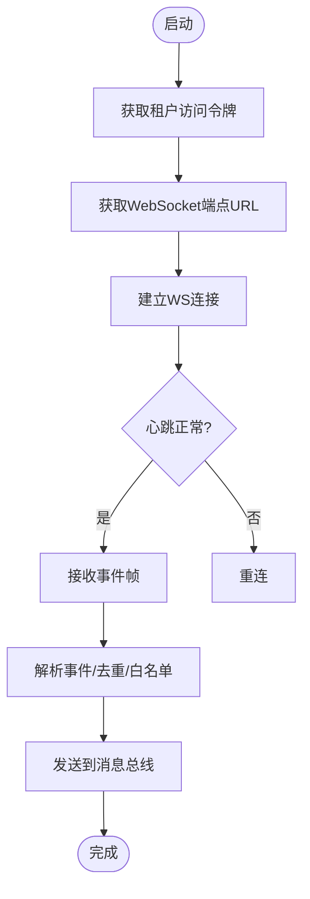
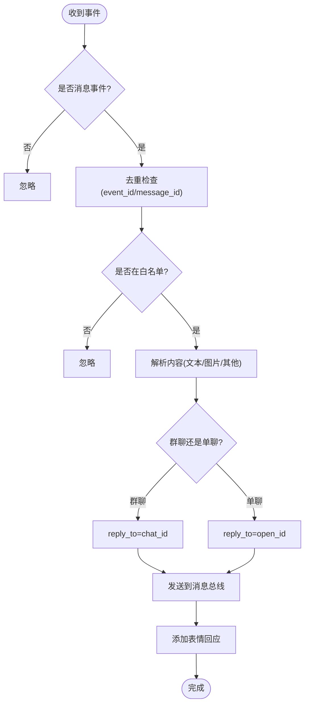
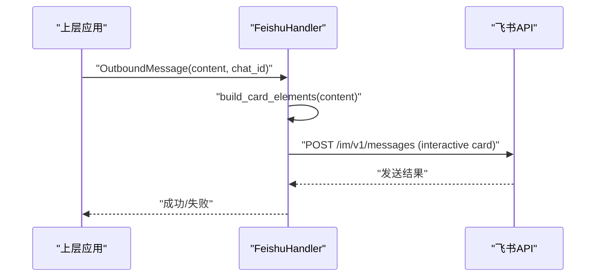
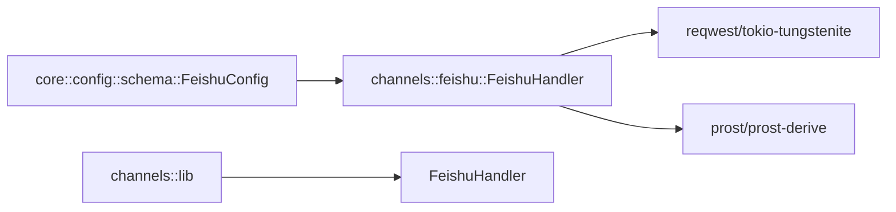

# 飞书通道

<cite>
**本文引用的文件**
- [agent-diva-channels/src/feishu.rs](file://agent-diva-channels/src/feishu.rs)
- [agent-diva-core/src/config/schema.rs](file://agent-diva-core/src/config/schema.rs)
- [agent-diva-channels/Cargo.toml](file://agent-diva-channels/Cargo.toml)
- [agent-diva-channels/src/lib.rs](file://agent-diva-channels/src/lib.rs)
- [agent-diva-gui/src/components/settings/channel-wizard-fields.ts](file://agent-diva-gui/src/components/settings/channel-wizard-fields.ts)
</cite>

## 目录
1. [简介](#简介)
2. [项目结构](#项目结构)
3. [核心组件](#核心组件)
4. [架构总览](#架构总览)
5. [详细组件分析](#详细组件分析)
6. [依赖关系分析](#依赖关系分析)
7. [性能与可靠性](#性能与可靠性)
8. [配置与使用指南](#配置与使用指南)
9. [消息格式与身份映射](#消息格式与身份映射)
10. [高级功能集成](#高级功能集成)
11. [故障排查指南](#故障排查指南)
12. [最佳实践](#最佳实践)
13. [结论](#结论)

## 简介
本章节面向需要在 agent-diva 中接入飞书（Feishu/Lark）通道的用户与开发者，说明如何创建机器人应用、配置权限、启用 WebSocket 长连接接收事件、发送富文本卡片消息，以及如何处理图片等附件。文档基于仓库中的实际实现进行梳理，确保可操作性和准确性。

## 项目结构
- 飞书通道实现位于 channels 模块的 feishu.rs，负责：
  - 获取租户访问令牌
  - 获取并维护 WebSocket 长连接
  - 解析 protobuf 帧、处理事件、去重、转发到内部消息总线
  - 发送富文本卡片消息（支持 Markdown 与表格）
  - 下载图片并转换为数据 URI 标记
  - 为消息添加表情回应以表示“已读”
- 配置模型定义在 core 模块的 schema.rs 中，包含 FeishuConfig 的所有字段
- GUI 侧提供飞书配置的表单字段定义，便于可视化配置
- Cargo 特性与依赖声明在 channels 的 Cargo.toml 中

图表来源
- [agent-diva-channels/src/feishu.rs:39-46](file://agent-diva-channels/src/feishu.rs#L39-L46)
- [agent-diva-channels/src/feishu.rs:920-1036](file://agent-diva-channels/src/feishu.rs#L920-L1036)

章节来源
- [agent-diva-channels/src/feishu.rs:1-18](file://agent-diva-channels/src/feishu.rs#L1-L18)
- [agent-diva-core/src/config/schema.rs:733-751](file://agent-diva-core/src/config/schema.rs#L733-L751)
- [agent-diva-gui/src/components/settings/channel-wizard-fields.ts:113-159](file://agent-diva-gui/src/components/settings/channel-wizard-fields.ts#L113-L159)
- [agent-diva-channels/Cargo.toml:68-73](file://agent-diva-channels/Cargo.toml#L68-L73)

## 核心组件
- FeishuHandler：实现 ChannelHandler 接口，封装飞书鉴权、WS 连接、事件处理、消息发送
- 配置模型 FeishuConfig：enabled、app_id、app_secret、encrypt_key、verification_token、allow_from、port
- 消息总线 InboundMessage/OutboundMessage：统一入站/出站消息抽象
- GUI 配置项：App ID、App Secret、Verification Token、Encrypt Key、允许的用户 ID、Webhook 端口

章节来源
- [agent-diva-channels/src/feishu.rs:177-214](file://agent-diva-channels/src/feishu.rs#L177-L214)
- [agent-diva-core/src/config/schema.rs:733-751](file://agent-diva-core/src/config/schema.rs#L733-L751)
- [agent-diva-gui/src/components/settings/channel-wizard-fields.ts:113-159](file://agent-diva-gui/src/components/settings/channel-wizard-fields.ts#L113-L159)

## 架构总览
飞书通道采用“WebSocket 长连接 + HTTP API”的组合：
- 通过 HTTP 获取 tenant_access_token 和 WebSocket 端点 URL
- 使用 pbbp2.proto 帧协议建立 WS 连接，周期性 ping/pong 保活
- 收到 im.message.receive_v1 事件后，解析内容、去重、白名单校验、转发到消息总线
- 发送消息时构建 interactive 卡片，支持 Markdown 与表格元素

图表来源
- [agent-diva-channels/src/feishu.rs:593-708](file://agent-diva-channels/src/feishu.rs#L593-L708)

章节来源
- [agent-diva-channels/src/feishu.rs:336-371](file://agent-diva-channels/src/feishu.rs#L336-L371)
- [agent-diva-channels/src/feishu.rs:920-1036](file://agent-diva-channels/src/feishu.rs#L920-L1036)

## 详细组件分析

### 认证与会话管理
- 获取租户访问令牌：调用 /auth/v3/tenant_access_token/internal，缓存 token 并在过期前复用
- 获取 WebSocket 端点：调用 /callback/ws/endpoint，返回 URL 与客户端心跳配置
- 心跳机制：按服务端返回的 PingInterval 定时发送 ping，超时检测避免僵尸连接

图表来源
- [agent-diva-channels/src/feishu.rs:277-334](file://agent-diva-channels/src/feishu.rs#L277-L334)
- [agent-diva-channels/src/feishu.rs:336-371](file://agent-diva-channels/src/feishu.rs#L336-L371)
- [agent-diva-channels/src/feishu.rs:414-528](file://agent-diva-channels/src/feishu.rs#L414-L528)

章节来源
- [agent-diva-channels/src/feishu.rs:277-334](file://agent-diva-channels/src/feishu.rs#L277-L334)
- [agent-diva-channels/src/feishu.rs:336-371](file://agent-diva-channels/src/feishu.rs#L336-L371)
- [agent-diva-channels/src/feishu.rs:414-528](file://agent-diva-channels/src/feishu.rs#L414-L528)

### 事件处理与去重
- 仅处理 im.message.receive_v1 事件类型
- 去重策略：优先使用 event_id，否则回退 message_id；内存缓存 TTL 清理
- 白名单控制：仅处理 allow_from 中的 open_id
- 自动“已读”：为收到的消息添加点赞表情回应

图表来源
- [agent-diva-channels/src/feishu.rs:593-708](file://agent-diva-channels/src/feishu.rs#L593-L708)
- [agent-diva-channels/src/feishu.rs:774-810](file://agent-diva-channels/src/feishu.rs#L774-L810)

章节来源
- [agent-diva-channels/src/feishu.rs:593-708](file://agent-diva-channels/src/feishu.rs#L593-L708)
- [agent-diva-channels/src/feishu.rs:774-810](file://agent-diva-channels/src/feishu.rs#L774-L810)

### 图片与附件处理
- 图片：从消息内容提取 image_key，调用资源下载接口，转为 data URI 标记
- 其他媒体类型：音频、文件、贴纸等以占位符形式显示

章节来源
- [agent-diva-channels/src/feishu.rs:710-772](file://agent-diva-channels/src/feishu.rs#L710-L772)

### 发送富文本卡片消息
- 根据 chat_id 前缀判断 receive_id_type（oc_ 为 chat_id，否则为 open_id）
- 将内容渲染为 interactive 卡片，支持 Markdown 与表格元素
- 通过 /im/v1/messages 发送

图表来源
- [agent-diva-channels/src/feishu.rs:977-1036](file://agent-diva-channels/src/feishu.rs#L977-L1036)
- [agent-diva-channels/src/feishu.rs:875-917](file://agent-diva-channels/src/feishu.rs#L875-L917)

章节来源
- [agent-diva-channels/src/feishu.rs:977-1036](file://agent-diva-channels/src/feishu.rs#L977-L1036)
- [agent-diva-channels/src/feishu.rs:875-917](file://agent-diva-channels/src/feishu.rs#L875-L917)

## 依赖关系分析
- 运行时依赖：reqwest（HTTP）、tokio-tungstenite（WebSocket）、prost/prost-derive（Protobuf 编解码）
- 模块导出：channels 库导出 FeishuHandler，供管理器初始化
- 配置依赖：core 模块的 FeishuConfig 被 channels 使用

图表来源
- [agent-diva-channels/Cargo.toml:68-73](file://agent-diva-channels/Cargo.toml#L68-L73)
- [agent-diva-channels/src/lib.rs:32-36](file://agent-diva-channels/src/lib.rs#L32-L36)
- [agent-diva-core/src/config/schema.rs:733-751](file://agent-diva-core/src/config/schema.rs#L733-L751)

章节来源
- [agent-diva-channels/Cargo.toml:68-73](file://agent-diva-channels/Cargo.toml#L68-L73)
- [agent-diva-channels/src/lib.rs:32-36](file://agent-diva-channels/src/lib.rs#L32-L36)
- [agent-diva-core/src/config/schema.rs:733-751](file://agent-diva-core/src/config/schema.rs#L733-L751)

## 性能与可靠性
- 心跳与超时：按服务端 PingInterval 动态调整心跳间隔；无响应超过阈值触发重连
- 事件去重：内存缓存 event_id/message_id，定期清理，避免重复处理
- 分片重组：对大数据量事件进行分片组装，保证完整性
- 令牌缓存：提前 5 分钟过期，减少频繁刷新

章节来源
- [agent-diva-channels/src/feishu.rs:414-528](file://agent-diva-channels/src/feishu.rs#L414-L528)
- [agent-diva-channels/src/feishu.rs:231-260](file://agent-diva-channels/src/feishu.rs#L231-L260)
- [agent-diva-channels/src/feishu.rs:545-561](file://agent-diva-channels/src/feishu.rs#L545-L561)
- [agent-diva-channels/src/feishu.rs:321-334](file://agent-diva-channels/src/feishu.rs#L321-L334)

## 配置与使用指南
- 在飞书开放平台创建机器人应用，获取 App ID 与 App Secret
- 在 agent-diva 中启用飞书通道，填写以下配置项：
  - enabled：是否启用
  - app_id：飞书应用 App ID
  - app_secret：飞书应用 App Secret
  - verification_token：验证 Token（用于 Webhook 模式）
  - encrypt_key：事件加密 Key（用于 Webhook 模式）
  - allow_from：允许的用户 ID 列表（白名单）
  - port：可选，Webhook 模式监听端口（WebSocket 模式不使用）
- 事件订阅：建议订阅 im.message.receive_v1 事件类型
- 权限要求：确保应用具备 IM 相关权限（如读取消息、发送消息、下载资源等）

章节来源
- [agent-diva-core/src/config/schema.rs:733-751](file://agent-diva-core/src/config/schema.rs#L733-L751)
- [agent-diva-gui/src/components/settings/channel-wizard-fields.ts:113-159](file://agent-diva-gui/src/components/settings/channel-wizard-fields.ts#L113-L159)

## 消息格式与身份映射
- 入站消息：
  - sender.open_id：发送者标识
  - message.chat_id：会话标识（群聊时为 oc_ 开头）
  - message.message_type：消息类型（text/image/file 等）
  - message.content：原始内容（文本或 JSON）
- 出站消息：
  - receive_id_type：根据 chat_id 前缀选择 open_id 或 chat_id
  - msg_type：interactive（富文本卡片）
  - content：卡片 JSON（elements 数组，支持 markdown/table）

章节来源
- [agent-diva-channels/src/feishu.rs:684-700](file://agent-diva-channels/src/feishu.rs#L684-L700)
- [agent-diva-channels/src/feishu.rs:984-1009](file://agent-diva-channels/src/feishu.rs#L984-L1009)

## 高级功能集成
当前实现聚焦于消息收发与基础能力。对于审批流、日历、云文档等高级功能，可通过以下方式扩展：
- 审批流：调用飞书审批 API（需额外权限），结合工具层发起流程、查询状态
- 日历：调用飞书日历 API，创建日程、同步会议信息
- 云文档：调用飞书云文档 API，读写文档、表格、知识库条目
- 注意：这些能力不在当前通道实现内，需要新增工具或服务层对接

[本节为概念性说明，不直接分析具体代码文件]

## 故障排查指南
- 无法获取令牌：检查 App ID/Secret 是否正确；确认网络可达；查看错误码与消息
- WebSocket 连接失败：确认服务可用；检查防火墙/代理设置；观察日志中的连接错误
- 心跳超时：检查网络稳定性；确认服务端返回的 PingInterval；必要时调整本地超时
- 事件未处理：确认订阅了 im.message.receive_v1；检查白名单；查看去重日志
- 图片下载失败：确认拥有资源下载权限；检查 image_key 有效性；查看 HTTP 状态码
- 发送失败：检查 receive_id_type 是否正确；确认卡片格式合法；查看错误响应

章节来源
- [agent-diva-channels/src/feishu.rs:277-334](file://agent-diva-channels/src/feishu.rs#L277-L334)
- [agent-diva-channels/src/feishu.rs:414-528](file://agent-diva-channels/src/feishu.rs#L414-L528)
- [agent-diva-channels/src/feishu.rs:593-708](file://agent-diva-channels/src/feishu.rs#L593-L708)
- [agent-diva-channels/src/feishu.rs:710-772](file://agent-diva-channels/src/feishu.rs#L710-L772)
- [agent-diva-channels/src/feishu.rs:977-1036](file://agent-diva-channels/src/feishu.rs#L977-L1036)

## 最佳实践
- 使用白名单限制可交互用户，提升安全性
- 合理设置心跳与超时，避免僵尸连接
- 利用去重机制防止重复处理
- 发送富文本时使用 Markdown 与表格增强可读性
- 监控令牌有效期，提前刷新避免中断
- 对图片等资源下载增加重试与错误降级

章节来源
- [agent-diva-channels/src/feishu.rs:231-260](file://agent-diva-channels/src/feishu.rs#L231-L260)
- [agent-diva-channels/src/feishu.rs:414-528](file://agent-diva-channels/src/feishu.rs#L414-L528)
- [agent-diva-channels/src/feishu.rs:875-917](file://agent-diva-channels/src/feishu.rs#L875-L917)
- [agent-diva-channels/src/feishu.rs:321-334](file://agent-diva-channels/src/feishu.rs#L321-L334)

## 结论
飞书通道通过 WebSocket 长连接与 HTTP API 实现了稳定可靠的消息收发能力，支持文本、图片及富文本卡片，具备完善的鉴权、心跳、去重与白名单机制。对于更复杂的业务场景（审批、日历、云文档），可在现有基础上扩展工具或服务层对接飞书开放平台 API。