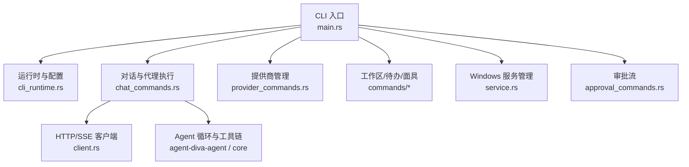
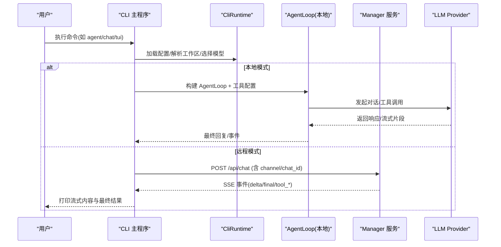
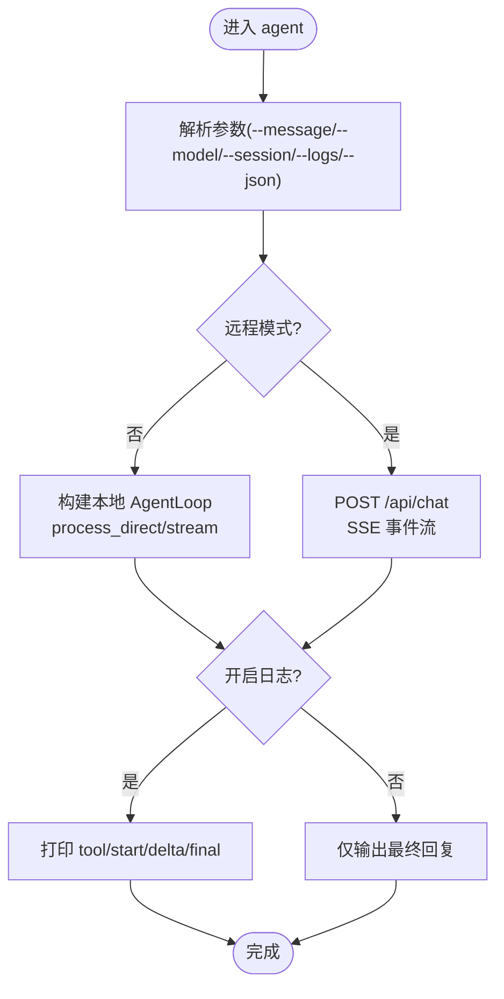
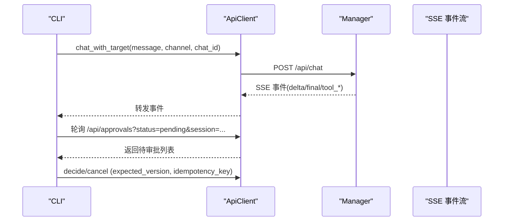

# CLI 命令行工具

<cite>
**本文引用的文件**
- [main.rs](file://agent-diva-cli/src/main.rs)
- [lib.rs](file://agent-diva-cli/src/lib.rs)
- [chat_commands.rs](file://agent-diva-cli/src/chat_commands.rs)
- [provider_commands.rs](file://agent-diva-cli/src/provider_commands.rs)
- [cli_runtime.rs](file://agent-diva-cli/src/cli_runtime.rs)
- [client.rs](file://agent-diva-cli/src/client.rs)
- [service.rs](file://agent-diva-cli/src/service.rs)
- [commands/workspace.rs](file://agent-diva-cli/src/commands/workspace.rs)
- [commands/todo.rs](file://agent-diva-cli/src/commands/todo.rs)
- [commands/mask.rs](file://agent-diva-cli/src/commands/mask.rs)
- [approval_commands.rs](file://agent-diva-cli/src/approval_commands.rs)
- [Cargo.toml](file://agent-diva-cli/Cargo.toml)
</cite>

## 目录
1. [简介](#简介)
2. [项目结构](#项目结构)
3. [核心组件](#核心组件)
4. [架构总览](#架构总览)
5. [详细命令参考](#详细命令参考)
6. [依赖与集成分析](#依赖与集成分析)
7. [性能与可靠性](#性能与可靠性)
8. [故障排查与调试](#故障排查与调试)
9. [结论](#结论)
10. [附录：常用示例与最佳实践](#附录常用示例与最佳实践)

## 简介
本文件面向开发者与高级用户，系统化说明 Agent Diva 的 CLI 命令行工具。内容覆盖所有命令与子命令（agent、chat、tui、gateway、provider、config、workspace、todo、mask、cron、service、approvals、channels、status、onboard），包括参数选项、配置方式、输出格式、远程连接模式与认证方式、错误处理、日志与调试技巧，以及 API 集成与扩展开发参考。CLI 既支持本地直接调用 Agent 循环，也支持与后端 Manager 服务通过 HTTP/SSE 进行远程交互。

## 项目结构
CLI 入口位于 agent-diva-cli，使用 clap 解析命令树，并通过 cli_runtime 加载配置、解析工作区、构建 Provider；chat_commands 实现本地与远程对话流程；provider_commands 管理模型与凭据；commands 提供 workspace、todo、mask 等子命令；service 提供 Windows 服务管理能力；client 封装对 Manager 的 HTTP/SSE 通信；approval_commands 统一审批流接口。

图表来源
- [main.rs:59-205](file://agent-diva-cli/src/main.rs#L59-L205)
- [cli_runtime.rs:14-135](file://agent-diva-cli/src/cli_runtime.rs#L14-L135)
- [chat_commands.rs:79-144](file://agent-diva-cli/src/chat_commands.rs#L79-L144)
- [client.rs:12-54](file://agent-diva-cli/src/client.rs#L12-L54)

章节来源
- [main.rs:59-205](file://agent-diva-cli/src/main.rs#L59-L205)
- [lib.rs:1-9](file://agent-diva-cli/src/lib.rs#L1-L9)
- [Cargo.toml:1-93](file://agent-diva-cli/Cargo.toml#L1-L93)

## 核心组件
- 命令路由与全局选项：主程序定义 Commands 枚举与全局参数（--config/--config-dir/--workspace/--remote/--api-url），并分发到各子命令处理器。
- 运行时 CliRuntime：负责配置加载、工作区解析、Provider 构建、路径报告、通道状态、医生诊断等。
- 对话执行 chat_commands：构建 AgentLoop、工具配置、网络工具、AskUser 协调器；支持本地直连与远程 SSE 事件流。
- 提供商 provider_commands：列出/设置/登录/查询模型，持久化默认 Provider 与模型。
- 客户端 client：封装对 Manager 的 HTTP 请求与 SSE 事件解析（delta/final/tool_start/tool_finish/tool_delta/error/turn_plan_updated/context_compaction）。
- 审批 approval_commands：统一的审批列表、决策、取消、交互式审查，支持 JSON 结构化输出。
- 子命令：workspace/todo/mask/cron/service 等，分别管理数据与工作区、任务、面具、定时任务、Windows 服务。

章节来源
- [main.rs:59-205](file://agent-diva-cli/src/main.rs#L59-L205)
- [cli_runtime.rs:14-135](file://agent-diva-cli/src/cli_runtime.rs#L14-L135)
- [chat_commands.rs:79-144](file://agent-diva-cli/src/chat_commands.rs#L79-L144)
- [provider_commands.rs:25-153](file://agent-diva-cli/src/provider_commands.rs#L25-L153)
- [client.rs:12-54](file://agent-diva-cli/src/client.rs#L12-L54)
- [approval_commands.rs:12-77](file://agent-diva-cli/src/approval_commands.rs#L12-L77)

## 架构总览
CLI 支持两种运行模式：
- 本地模式：直接在进程内构建 AgentLoop，调用 LLM Provider，执行工具链，输出结果或流式事件。
- 远程模式：通过 --remote 与 --api-url 连接到 agent-diva-manager，使用 HTTP POST 发送消息，SSE 接收流式事件；同时可轮询审批队列以在无人值守模式下安全执行。

图表来源
- [main.rs:489-553](file://agent-diva-cli/src/main.rs#L489-L553)
- [chat_commands.rs:260-364](file://agent-diva-cli/src/chat_commands.rs#L260-L364)
- [chat_commands.rs:466-550](file://agent-diva-cli/src/chat_commands.rs#L466-L550)
- [client.rs:152-262](file://agent-diva-cli/src/client.rs#L152-L262)

## 详细命令参考

### 全局选项
- --config <path>：指定配置文件路径。
- -C, --config-dir <dir>：指定配置目录。
- -w, --workspace <path>：临时覆盖工作区路径（不修改 config.json）。
- --remote：启用远程模式，连接 Manager。
- --api-url <url>：指定 Manager API 地址（默认 http://localhost:3000/api）。

章节来源
- [main.rs:67-86](file://agent-diva-cli/src/main.rs#L67-L86)

### onboard：初始化向导
- 作用：非交互式或交互式创建/刷新配置，设置 Provider、模型、API Key、工作区等。
- 关键参数：--provider/--model/--api-key/--api-base/--workspace/--force/--refresh。
- 行为：若存在现有配置且未指定 provider/model，会提示刷新或覆盖；支持保留已有值填充缺失默认项。

章节来源
- [main.rs:396-419](file://agent-diva-cli/src/main.rs#L396-L419)
- [main.rs:775-800](file://agent-diva-cli/src/main.rs#L775-L800)

### gateway：网关
- 子命令：gateway run
- 作用：前台启动 Gateway（由 manager 模块提供）。
- 典型用法：用于本地托管会话、工具执行与审批队列。

章节来源
- [main.rs:94-97](file://agent-diva-cli/src/main.rs#L94-L97)
- [main.rs:260-263](file://agent-diva-cli/src/main.rs#L260-L263)
- [main.rs:481-488](file://agent-diva-cli/src/main.rs#L481-L488)

### agent：单轮对话
- 作用：向 Agent 发送一条消息并等待完成；支持本地与远程模式。
- 关键参数：
  - --message：消息内容（必填）
  - -m, --model：指定模型
  - -s, --session：会话键（用于上下文连续性）
  - --markdown/--no-markdown：是否渲染为 Markdown 友好文本
  - --logs/--no-logs：是否显示流式推理/工具日志
  - --approval-mode：headless 审批模式（fail|queue）
  - --json：输出结构化 JSON
- 行为要点：
  - 本地模式：构建 AgentLoop，执行 process_direct 或 process_direct_stream。
  - 远程模式：POST /api/chat，SSE 接收 delta/final/tool_* 事件；若需要审批，支持轮询队列并在 headless 下拒绝或排队。
- 输出：最终回复（可选带标题头）、工具调用开始/结束日志、推理片段（当开启 logs）。

图表来源
- [main.rs:489-537](file://agent-diva-cli/src/main.rs#L489-L537)
- [chat_commands.rs:260-364](file://agent-diva-cli/src/chat_commands.rs#L260-L364)
- [chat_commands.rs:466-550](file://agent-diva-cli/src/chat_commands.rs#L466-L550)

章节来源
- [main.rs:98-127](file://agent-diva-cli/src/main.rs#L98-L127)
- [main.rs:489-537](file://agent-diva-cli/src/main.rs#L489-L537)
- [chat_commands.rs:375-448](file://agent-diva-cli/src/chat_commands.rs#L375-L448)
- [chat_commands.rs:537-663](file://agent-diva-cli/src/chat_commands.rs#L537-L663)

### chat：轻量交互式对话
- 作用：进入 REPL，持续与 Agent 对话；支持切换会话、停止、压缩、面具、思考模式等。
- 关键参数：--model/--session/--markdown/--no-markdown/--logs/--no-logs。
- 内置命令：
  - /quit：退出
  - /clear：清屏
  - /new：新建会话
  - /stop：停止当前会话（需本地模式）
  - /thinking auto|on|off：切换思考模式
  - /compact：压缩会话（需本地模式）
  - /mask list/wear/off/status/reload：面具管理
- 输出：会话信息、流式内容、最终回复。

章节来源
- [main.rs:128-148](file://agent-diva-cli/src/main.rs#L128-L148)
- [main.rs:538-553](file://agent-diva-cli/src/main.rs#L538-L553)
- [chat_commands.rs:665-778](file://agent-diva-cli/src/chat_commands.rs#L665-L778)
- [chat_commands.rs:780-800](file://agent-diva-cli/src/chat_commands.rs#L780-L800)

### tui：终端图形界面
- 作用：启动基于 ratatui 的 TUI 聊天界面。
- 关键参数：--model/--session。
- 行为：支持本地与远程模式（--remote/--api-url）。

章节来源
- [main.rs:154-162](file://agent-diva-cli/src/main.rs#L154-L162)
- [main.rs:636-645](file://agent-diva-cli/src/main.rs#L636-L645)

### approvals：审批中心
- 子命令：
  - list：列出审批（默认 pending），支持 --session 与 --json。
  - decide：对某审批做出明确决策（allow-once|allow-session|allow-rule|deny），支持 --version 与 --json。
  - cancel：撤销某审批，支持 --version 与 --json。
  - review：交互式审查所有待处理审批。
- 行为：通过 ApiClient 访问 /api/approvals* 端点；支持分页与游标；JSON 输出便于自动化。

章节来源
- [main.rs:149-153](file://agent-diva-cli/src/main.rs#L149-L153)
- [main.rs:207-242](file://agent-diva-cli/src/main.rs#L207-L242)
- [main.rs:554-635](file://agent-diva-cli/src/main.rs#L554-L635)
- [approval_commands.rs:12-77](file://agent-diva-cli/src/approval_commands.rs#L12-L77)
- [approval_commands.rs:79-131](file://agent-diva-cli/src/approval_commands.rs#L79-L131)
- [approval_commands.rs:152-201](file://agent-diva-cli/src/approval_commands.rs#L152-L201)

### status：状态信息
- 作用：展示配置路径、默认模型/Provider、日志级别/格式/目录、Provider 状态、通道状态、Cron 数量、MCP 服务器统计、医生诊断摘要。
- 关键参数：--json。

章节来源
- [main.rs:163-164](file://agent-diva-cli/src/main.rs#L163-L164)
- [main.rs:646-651](file://agent-diva-cli/src/main.rs#L646-L651)
- [cli_runtime.rs:75-106](file://agent-diva-cli/src/cli_runtime.rs#L75-L106)
- [cli_runtime.rs:793-800](file://agent-diva-cli/src/cli_runtime.rs#L793-L800)

### channels：通道管理
- 子命令：
  - login <channel>：登录通道（如 telegram/discord/whatsapp 等）。
  - status：查看通道状态（--json）。
- 行为：根据配置判断通道是否启用与就绪，并报告缺失字段。

章节来源
- [main.rs:165-169](file://agent-diva-cli/src/main.rs#L165-L169)
- [main.rs:265-272](file://agent-diva-cli/src/main.rs#L265-L272)
- [main.rs:652-665](file://agent-diva-cli/src/main.rs#L652-L665)
- [cli_runtime.rs:561-725](file://agent-diva-cli/src/cli_runtime.rs#L561-L725)

### provider：提供商管理
- 子命令：
  - list：列出可管理的 Provider 及其状态（--json）。
  - status：查看当前模型/Provider 及每个 Provider 的准备情况（--json）。
  - set：设置默认 Provider、模型、API Key、API Base（--json）。
  - models：查询 Provider 可用模型（--json，支持静态回退）。
  - login：占位实现（未来支持 OAuth/设备码流程）。
- 行为：从 ProviderCatalogService 获取视图与模型；保存配置；输出人类可读或 JSON 报告。

章节来源
- [main.rs:170-174](file://agent-diva-cli/src/main.rs#L170-L174)
- [main.rs:274-319](file://agent-diva-cli/src/main.rs#L274-L319)
- [main.rs:666-688](file://agent-diva-cli/src/main.rs#L666-L688)
- [provider_commands.rs:25-153](file://agent-diva-cli/src/provider_commands.rs#L25-L153)
- [provider_commands.rs:177-234](file://agent-diva-cli/src/provider_commands.rs#L177-L234)

### config：配置管理
- 子命令：
  - path：打印解析后的配置与运行时路径（--json）。
  - init：非交互式初始化（同 onboard 语义）。
  - refresh：刷新配置与工作区模板，不覆盖用户值。
  - validate：校验配置结构与语义规则（--json）。
  - doctor：校验+运行时就绪检查（--json）。
  - show：打印当前有效配置（敏感字段脱敏），支持 pretty/json。
- 行为：使用 ConfigLoader 读写配置；doctor 汇总 errors/warnings；show 对 api_key/token/secret/password 等字段脱敏。

章节来源
- [main.rs:175-179](file://agent-diva-cli/src/main.rs#L175-L179)
- [main.rs:390-439](file://agent-diva-cli/src/main.rs#L390-L439)
- [main.rs:689-696](file://agent-diva-cli/src/main.rs#L689-L696)
- [cli_runtime.rs:429-468](file://agent-diva-cli/src/cli_runtime.rs#L429-L468)
- [cli_runtime.rs:727-791](file://agent-diva-cli/src/cli_runtime.rs#L727-L791)

### service：Windows 服务管理
- 子命令：install/start/stop/restart/uninstall/status（均支持 --dry-run；status 支持 --json）。
- 行为：仅在 Windows 平台可用；通过 windows-service crate 管理服务安装、启停、状态查询；自动设置描述与延迟自启动（可选）。

章节来源
- [main.rs:180-184](file://agent-diva-cli/src/main.rs#L180-L184)
- [main.rs:697-703](file://agent-diva-cli/src/main.rs#L697-L703)
- [service.rs:5-50](file://agent-diva-cli/src/service.rs#L5-L50)
- [service.rs:52-67](file://agent-diva-cli/src/service.rs#L52-L67)
- [service.rs:103-121](file://agent-diva-cli/src/service.rs#L103-L121)
- [service.rs:172-229](file://agent-diva-cli/src/service.rs#L172-L229)
- [service.rs:231-375](file://agent-diva-cli/src/service.rs#L231-L375)

### cron：定时任务
- 子命令：
  - add：添加任务（--name/--message/--every/--cron-expr/--at/--timezone/--deliver/--to/--channel）。
  - list：列出任务（--all）。
  - remove：删除任务。
  - enable：启用/禁用任务。
  - run：手动运行任务（--force）。
- 行为：通过 CronService 管理 jobs.json；支持秒级间隔、cron 表达式、一次性时间、渠道投递。

章节来源
- [main.rs:185-189](file://agent-diva-cli/src/main.rs#L185-L189)
- [main.rs:321-381](file://agent-diva-cli/src/main.rs#L321-L381)
- [main.rs:704-748](file://agent-diva-cli/src/main.rs#L704-L748)
- [cli_runtime.rs:196-201](file://agent-diva-cli/src/cli_runtime.rs#L196-L201)

### workspace：工作区管理
- 子命令：
  - list：列出受管工作区（config-dir/workspaces）。
  - create：创建工作区（--path 可从源复制）。
  - switch：切换到受管工作区（更新 config.json 中的 workspace）。
  - delete：删除工作区（--force 跳过确认；禁止删除当前活动工作区）。
- 行为：名称校验、路径规范化、防止误删当前工作区。

章节来源
- [main.rs:190-194](file://agent-diva-cli/src/main.rs#L190-L194)
- [main.rs:749-754](file://agent-diva-cli/src/main.rs#L749-L754)
- [commands/workspace.rs:8-34](file://agent-diva-cli/src/commands/workspace.rs#L8-L34)
- [commands/workspace.rs:36-152](file://agent-diva-cli/src/commands/workspace.rs#L36-L152)
- [commands/workspace.rs:154-202](file://agent-diva-cli/src/commands/workspace.rs#L154-L202)

### todo：待办事项
- 子命令：
  - list：列出所有待办。
  - add：新增待办（title）。
  - update：更新状态（open|pending|active|done|completed|cancelled）。
  - archive：归档超过 N 天的已完成项（--days）。
  - purge：清理超过 N 个月的归档文件（--months）。
- 行为：基于 JsonlTodoStore 存储于工作区的 todos 目录。

章节来源
- [main.rs:195-199](file://agent-diva-cli/src/main.rs#L195-L199)
- [main.rs:755-763](file://agent-diva-cli/src/main.rs#L755-L763)
- [commands/todo.rs:6-36](file://agent-diva-cli/src/commands/todo.rs#L6-L36)
- [commands/todo.rs:38-110](file://agent-diva-cli/src/commands/todo.rs#L38-L110)

### mask：面具管理
- 子命令：
  - list：列出所有面具（含默认身份）。
  - switch：按 name/id 激活面具。
  - show：显示面具 frontmatter 与正文。
  - create：从 markdown 文件创建面具。
  - edit：用新文件替换现有面具（保持稳定 id）。
  - delete：删除面具。
- 行为：读取工作区 masks 目录；维护 MaskRegistry；确保稳定 id；支持默认面具。

章节来源
- [main.rs:200-204](file://agent-diva-cli/src/main.rs#L200-L204)
- [main.rs:764-769](file://agent-diva-cli/src/main.rs#L764-L769)
- [commands/mask.rs:8-58](file://agent-diva-cli/src/commands/mask.rs#L8-L58)
- [commands/mask.rs:60-263](file://agent-diva-cli/src/commands/mask.rs#L60-L263)

## 依赖与集成分析

### CLI 与后端服务的通信机制
- 本地模式：CLI 直接构建 AgentLoop，调用 LLM Provider，执行工具链，输出结果。
- 远程模式：通过 ApiClient 向 Manager 发送 POST /api/chat，并使用 eventsource-stream 订阅 SSE 事件（delta/final/tool_start/tool_finish/tool_delta/error/turn_plan_updated/context_compaction）。
- 审批队列：在 headless 模式下，CLI 轮询 /api/approvals，遇到 command 域审批时可选择拒绝或排队；支持版本控制与幂等键避免重复提交。

图表来源
- [client.rs:152-262](file://agent-diva-cli/src/client.rs#L152-L262)
- [approval_commands.rs:79-131](file://agent-diva-cli/src/approval_commands.rs#L79-L131)
- [chat_commands.rs:552-663](file://agent-diva-cli/src/chat_commands.rs#L552-L663)

章节来源
- [client.rs:12-54](file://agent-diva-cli/src/client.rs#L12-L54)
- [client.rs:152-262](file://agent-diva-cli/src/client.rs#L152-L262)
- [approval_commands.rs:12-77](file://agent-diva-cli/src/approval_commands.rs#L12-L77)
- [chat_commands.rs:552-663](file://agent-diva-cli/src/chat_commands.rs#L552-L663)

### 远程连接模式与认证
- 连接：--remote 启用远程模式；--api-url 指定 Manager 地址（默认 http://localhost:3000/api）。
- 认证：CLI 本身不实现 Provider 登录流程（provider login 为占位）；Provider 凭据通过 provider set 写入配置；Manager 侧认证由服务端负责。
- 本地环回优化：当 base_url 为 localhost/127.0.0.1/[::1] 时，禁用代理以提升稳定性。

章节来源
- [main.rs:79-85](file://agent-diva-cli/src/main.rs#L79-L85)
- [provider_commands.rs:155-175](file://agent-diva-cli/src/provider_commands.rs#L155-L175)
- [client.rs:39-54](file://agent-diva-cli/src/client.rs#L39-L54)

### 配置与数据路径
- 配置加载：ConfigLoader 支持文件与目录两种方式；CLI 提供 path/init/refresh/validate/doctor/show。
- 工作区：effective_workspace 解析并创建必要目录；workspace 子命令管理 config-dir/workspaces。
- 存储：Cron jobs.json 位于 config_dir/data/cron/jobs.json；Todo 存储于工作区 todos 目录；Mask 存储于工作区 masks 目录。

章节来源
- [cli_runtime.rs:117-227](file://agent-diva-cli/src/cli_runtime.rs#L117-L227)
- [cli_runtime.rs:196-201](file://agent-diva-cli/src/cli_runtime.rs#L196-L201)
- [commands/workspace.rs:36-152](file://agent-diva-cli/src/commands/workspace.rs#L36-L152)
- [commands/todo.rs:38-110](file://agent-diva-cli/src/commands/todo.rs#L38-L110)
- [commands/mask.rs:60-263](file://agent-diva-cli/src/commands/mask.rs#L60-L263)

## 性能与可靠性
- 异步运行时：CLI 使用 tokio 多线程运行时，线程栈大小可调；适合高并发事件处理。
- 流式输出：SSE 事件逐条推送，减少首字节延迟；支持 stdout 即时 flush。
- 超时与预算：工具执行与全局超时、预算限制来自 ToolConfig；避免长时间阻塞。
- 审批队列：headless 模式下对 command 域审批默认拒绝或排队，保证无人值守安全。
- 日志：tracing 初始化支持终端输出；可通过日志级别与格式控制输出量。

章节来源
- [main.rs:441-448](file://agent-diva-cli/src/main.rs#L441-L448)
- [chat_commands.rs:285-364](file://agent-diva-cli/src/chat_commands.rs#L285-L364)
- [chat_commands.rs:552-663](file://agent-diva-cli/src/chat_commands.rs#L552-L663)
- [cli_runtime.rs:469-472](file://agent-diva-cli/src/cli_runtime.rs#L469-L472)

## 故障排查与调试
- 常见问题：
  - 无 Provider：doctor 会报告未找到 Provider；使用 provider set 设置默认 Provider 与模型。
  - 缺少字段：doctor 与通道状态会列出缺失字段（如 api_key、api_base、token 等）。
  - 工作区不存在：doctor 警告；ensure_workspace_templates 可创建基础结构。
  - 远程不可达：SSE 连接失败会返回错误；检查 --api-url 与防火墙/代理设置。
  - 审批队列不可用：headless 模式遇到 command 域审批将报错；需先通过 approvals 解决。
- 调试技巧：
  - 使用 --logs 查看流式推理与工具调用。
  - 使用 --json 输出结构化结果，便于脚本解析。
  - 使用 config doctor 快速定位问题。
  - 使用 provider models 验证模型可用性。
  - 使用 approvals list/review 处理卡住的审批。

章节来源
- [cli_runtime.rs:727-791](file://agent-diva-cli/src/cli_runtime.rs#L727-L791)
- [provider_commands.rs:25-153](file://agent-diva-cli/src/provider_commands.rs#L25-L153)
- [approval_commands.rs:152-201](file://agent-diva-cli/src/approval_commands.rs#L152-L201)
- [client.rs:294-309](file://agent-diva-cli/src/client.rs#L294-L309)

## 结论
Agent Diva CLI 提供了完整的个人 AI 助手操作入口，覆盖日常对话、批量处理、自动化脚本与服务管理。其设计兼顾本地直连与远程协作，支持流式输出、结构化 JSON、审批队列与医生诊断，便于开发与运维。建议在生产环境中结合 --remote、--api-url、approvals 与 config doctor 形成稳健的工作流。

## 附录：常用示例与最佳实践

- 日常对话
  - 本地单轮：agent-diva agent --message "你好"
  - 本地多轮：agent-diva chat
  - 远程单轮：agent-diva agent --remote --api-url "http://your-manager/api" --message "请总结今日新闻"
- 批量处理
  - 使用 --json 输出结构化结果，配合 shell 脚本处理多条消息。
  - 使用 --session 保持上下文连续性，适合长任务分步推进。
- 自动化脚本
  - 使用 approvals list/review 在 CI 中处理审批；结合 --json 解析状态。
  - 使用 provider models 动态选择模型；使用 config doctor 预检环境。
- 服务管理（Windows）
  - 安装并设置为开机自启：agent-diva service install --auto-start
  - 启停服务：agent-diva service start/stop
  - 查询状态：agent-diva service status --json
- 工作区与任务
  - 管理工作区：agent-diva workspace create/switch/list/delete
  - 管理待办：agent-diva todo add/update/archive/purge
  - 管理面具：agent-diva mask list/switch/create/edit/delete

章节来源
- [main.rs:98-127](file://agent-diva-cli/src/main.rs#L98-L127)
- [main.rs:128-148](file://agent-diva-cli/src/main.rs#L128-L148)
- [main.rs:180-184](file://agent-diva-cli/src/main.rs#L180-L184)
- [commands/workspace.rs:36-152](file://agent-diva-cli/src/commands/workspace.rs#L36-L152)
- [commands/todo.rs:38-110](file://agent-diva-cli/src/commands/todo.rs#L38-L110)
- [commands/mask.rs:60-263](file://agent-diva-cli/src/commands/mask.rs#L60-L263)
- [service.rs:103-121](file://agent-diva-cli/src/service.rs#L103-L121)
- [service.rs:231-375](file://agent-diva-cli/src/service.rs#L231-L375)