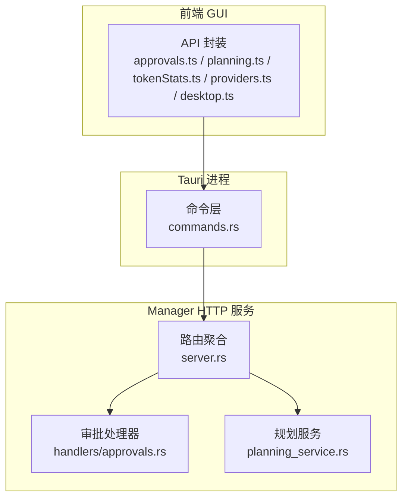
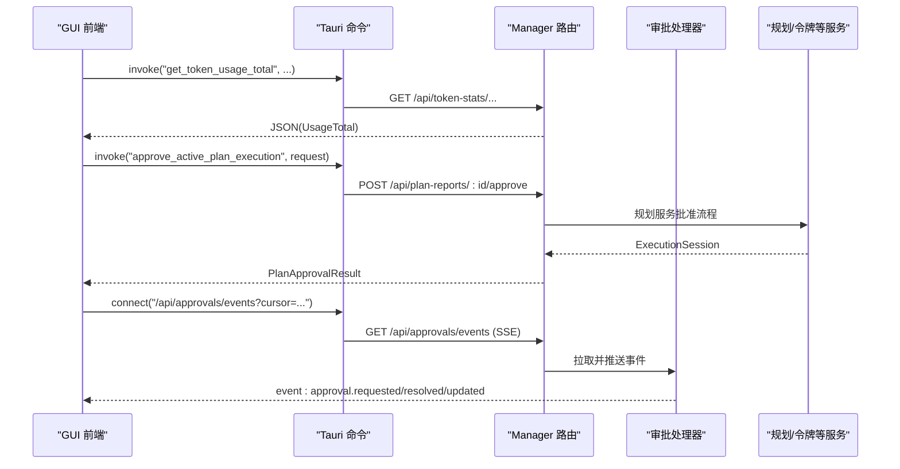
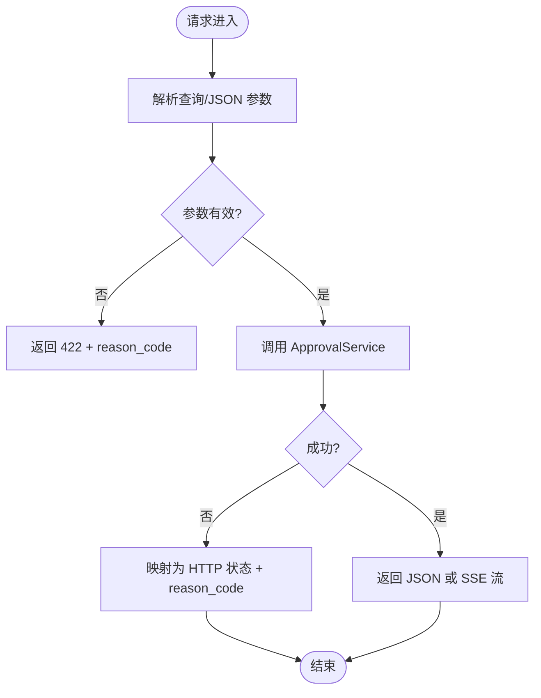
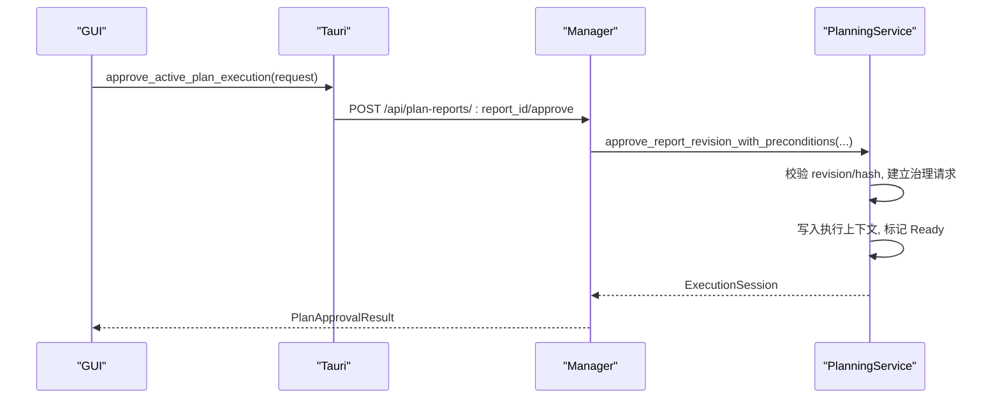
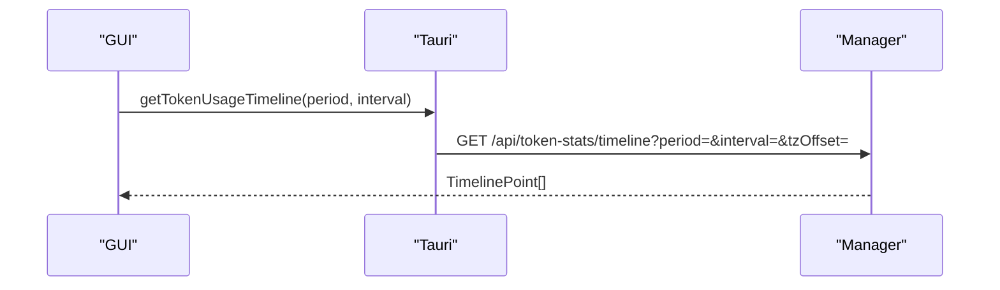
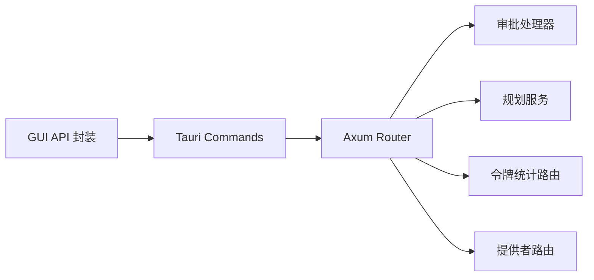

# API 集成

<cite>
**本文引用的文件**
- [agent-diva-gui/src/api/approvals.ts](file://agent-diva-gui/src/api/approvals.ts)
- [agent-diva-gui/src/api/capabilities.ts](file://agent-diva-gui/src/api/capabilities.ts)
- [agent-diva-gui/src/api/planning.ts](file://agent-diva-gui/src/api/planning.ts)
- [agent-diva-gui/src/api/tokenStats.ts](file://agent-diva-gui/src/api/tokenStats.ts)
- [agent-diva-gui/src/api/providers.ts](file://agent-diva-gui/src/api/providers.ts)
- [agent-diva-gui/src/api/desktop.ts](file://agent-diva-gui/src/api/desktop.ts)
- [agent-diva-manager/src/server.rs](file://agent-diva-manager/src/server.rs)
- [agent-diva-manager/src/handlers/approvals.rs](file://agent-diva-manager/src/handlers/approvals.rs)
- [agent-diva-manager/src/planning_service.rs](file://agent-diva-manager/src/planning_service.rs)
- [agent-diva-gui/src-tauri/src/commands.rs](file://agent-diva-gui/src-tauri/src/commands.rs)
</cite>

## 目录
1. [简介](#简介)
2. [项目结构](#项目结构)
3. [核心组件](#核心组件)
4. [架构总览](#架构总览)
5. [详细组件分析](#详细组件分析)
6. [依赖关系分析](#依赖关系分析)
7. [性能与可靠性](#性能与可靠性)
8. [故障排查指南](#故障排查指南)
9. [结论](#结论)
10. [附录：接口清单与迁移建议](#附录接口清单与迁移建议)

## 简介
本文件面向 Agent Diva 的 API 集成层，聚焦前端 GUI 与后端 Manager 服务之间的 HTTP/SSE/本地命令桥接。文档覆盖审批管理、能力声明、规划执行、令牌统计、提供者配置、桌面端能力等核心接口；说明请求封装、错误处理、重试策略、SSE 事件流、认证授权、版本管理与迁移、网络优化与缓存策略等工程实践。

## 项目结构
Agent Diva 的前端位于 agent-diva-gui，通过 Tauri 暴露命令到 Rust 侧（src-tauri），再由命令转发到本地运行的 Manager HTTP 服务（agent-diva-manager）。Manager 使用 Axum 路由聚合各业务模块（审批、规划、记忆、审计、令牌统计等），并通过 SSE 提供持久化事件流。

**图表来源**
- [agent-diva-gui/src/api/approvals.ts:1-135](file://agent-diva-gui/src/api/approvals.ts#L1-L135)
- [agent-diva-gui/src/api/planning.ts:1-152](file://agent-diva-gui/src/api/planning.ts#L1-L152)
- [agent-diva-gui/src/api/tokenStats.ts:1-159](file://agent-diva-gui/src/api/tokenStats.ts#L1-L159)
- [agent-diva-gui/src/api/providers.ts:1-94](file://agent-diva-gui/src/api/providers.ts#L1-L94)
- [agent-diva-gui/src/api/desktop.ts:1-800](file://agent-diva-gui/src/api/desktop.ts#L1-L800)
- [agent-diva-gui/src-tauri/src/commands.rs:1-800](file://agent-diva-gui/src-tauri/src/commands.rs#L1-L800)
- [agent-diva-manager/src/server.rs:1-800](file://agent-diva-manager/src/server.rs#L1-L800)
- [agent-diva-manager/src/handlers/approvals.rs:1-725](file://agent-diva-manager/src/handlers/approvals.rs#L1-L725)
- [agent-diva-manager/src/planning_service.rs:1-800](file://agent-diva-manager/src/planning_service.rs#L1-L800)

**章节来源**
- [agent-diva-manager/src/server.rs:94-113](file://agent-diva-manager/src/server.rs#L94-L113)
- [agent-diva-gui/src/api/capabilities.ts:14-263](file://agent-diva-gui/src/api/capabilities.ts#L14-L263)

## 核心组件
- 审批管理：统一审批列表、详情、决策、取消与 SSE 事件流，前后端类型严格校验。
- 规划执行：计划报告创建、修订、批准、执行上下文初始化与 TODO 物化。
- 令牌统计：总量、分组、时间线、会话级、模型分布与实时内存统计。
- 提供者配置：模型目录、自定义提供者增删改查、连通性测试。
- 桌面端能力：工作区切换、网关生命周期、日志、技能、记忆、Persona、AutoDream 等。

**章节来源**
- [agent-diva-gui/src/api/approvals.ts:1-135](file://agent-diva-gui/src/api/approvals.ts#L1-L135)
- [agent-diva-gui/src/api/planning.ts:1-152](file://agent-diva-gui/src/api/planning.ts#L1-L152)
- [agent-diva-gui/src/api/tokenStats.ts:1-159](file://agent-diva-gui/src/api/tokenStats.ts#L1-L159)
- [agent-diva-gui/src/api/providers.ts:1-94](file://agent-diva-gui/src/api/providers.ts#L1-L94)
- [agent-diva-gui/src/api/desktop.ts:1-800](file://agent-diva-gui/src/api/desktop.ts#L1-L800)

## 架构总览
前端通过 Tauri 命令调用本地 Manager HTTP 服务。Manager 将请求分发至对应处理器或服务，返回 JSON 或 SSE 流。关键路径包括：
- 审批：/api/approvals*（列表、详情、决策、取消、事件流）
- 规划：/api/plan-reports*、/api/plan-executions*
- 令牌统计：/api/token-stats*（由 server 合并路由）
- 提供者：/api/providers*
- 其他：/api/sessions、/api/memory、/api/persona、/api/autodream、/api/audit 等

**图表来源**
- [agent-diva-gui/src/api/tokenStats.ts:67-135](file://agent-diva-gui/src/api/tokenStats.ts#L67-L135)
- [agent-diva-gui/src/api/desktop.ts:289-296](file://agent-diva-gui/src/api/desktop.ts#L289-L296)
- [agent-diva-manager/src/server.rs:94-113](file://agent-diva-manager/src/server.rs#L94-L113)
- [agent-diva-manager/src/server.rs:338-369](file://agent-diva-manager/src/server.rs#L338-L369)
- [agent-diva-manager/src/handlers/approvals.rs:45-193](file://agent-diva-manager/src/handlers/approvals.rs#L45-L193)

## 详细组件分析

### 审批管理（Approvals）
- 能力与类型：定义 ApprovalDomain、ApprovalStatus、ApprovalReasonCode、ApprovalView、ApprovalEventView、ApprovalListPage，并提供运行时校验函数与去重守卫。
- 后端路由：/api/approvals（列表）、/api/approvals/events（SSE）、/api/approvals/:request_id（详情）、/decisions（决策）、/cancel（取消）。
- 错误映射：将底层错误映射为 HTTP 状态码与 reason_code，如 NOT_FOUND、CONFLICT、UNPROCESSABLE_ENTITY、SERVICE_UNAVAILABLE、INTERNAL_SERVER_ERROR。
- SSE 事件：按状态映射事件名 approval.requested、approval.resolved、approval.updated，支持 cursor 分页与限流。

**图表来源**
- [agent-diva-manager/src/handlers/approvals.rs:60-134](file://agent-diva-manager/src/handlers/approvals.rs#L60-L134)
- [agent-diva-manager/src/handlers/approvals.rs:206-293](file://agent-diva-manager/src/handlers/approvals.rs#L206-L293)

**章节来源**
- [agent-diva-gui/src/api/approvals.ts:1-135](file://agent-diva-gui/src/api/approvals.ts#L1-L135)
- [agent-diva-manager/src/handlers/approvals.rs:45-193](file://agent-diva-manager/src/handlers/approvals.rs#L45-L193)
- [agent-diva-manager/src/handlers/approvals.rs:206-293](file://agent-diva-manager/src/handlers/approvals.rs#L206-L293)

### 规划执行（Planning）
- DTO 与校验：PlanSummary/Detail/Step/Todo/RuntimeState、PlanApprovalReceipt/Result、PlanStreamEvent；Markdown 完整性检查（标题与必需章节）。
- 后端路由：/api/plan-reports（CRUD）、/api/plan-executions/*（活跃执行、TODO 列表与更新）。
- 治理与幂等：批准流程结合治理账本，支持 expected_version、idempotency_key、CAS 冲突检测；恢复未完成执行上下文。

**图表来源**
- [agent-diva-gui/src/api/planning.ts:5-152](file://agent-diva-gui/src/api/planning.ts#L5-L152)
- [agent-diva-manager/src/server.rs:338-369](file://agent-diva-manager/src/server.rs#L338-L369)
- [agent-diva-manager/src/planning_service.rs:174-402](file://agent-diva-manager/src/planning_service.rs#L174-L402)

**章节来源**
- [agent-diva-gui/src/api/planning.ts:1-152](file://agent-diva-gui/src/api/planning.ts#L1-L152)
- [agent-diva-manager/src/planning_service.rs:1-800](file://agent-diva-manager/src/planning_service.rs#L1-L800)

### 令牌统计（Token Stats）
- 前端封装：提供总量、分组、时间线、会话级、模型分布、实时内存统计等方法，统一传入时区偏移 tzOffset。
- 后端路由：由 server 合并 token_stats_routes，暴露多个统计端点。

**图表来源**
- [agent-diva-gui/src/api/tokenStats.ts:67-135](file://agent-diva-gui/src/api/tokenStats.ts#L67-L135)
- [agent-diva-manager/src/server.rs:94-113](file://agent-diva-manager/src/server.rs#L94-L113)

**章节来源**
- [agent-diva-gui/src/api/tokenStats.ts:1-159](file://agent-diva-gui/src/api/tokenStats.ts#L1-L159)

### 提供者配置（Providers）
- 前端封装：获取模型目录、添加/删除模型、创建/删除自定义提供者、测试模型连通性。
- 后端路由：/api/providers*（列表、解析、CRUD、模型管理）。

**章节来源**
- [agent-diva-gui/src/api/providers.ts:1-94](file://agent-diva-gui/src/api/providers.ts#L1-L94)
- [agent-diva-manager/src/server.rs:315-336](file://agent-diva-manager/src/server.rs#L315-L336)

### 桌面端能力（Desktop）
- 工作区切换：inspect/choose/switch/default workspace，含运行中操作阻断校验。
- 网关生命周期：start/stop/status，带健康检查与端口持久化。
- 日志、技能、记忆、Persona、AutoDream、MCP、Cron 等能力均通过 Tauri 命令桥接到 Manager 或本地资源。

**章节来源**
- [agent-diva-gui/src/api/desktop.ts:1-800](file://agent-diva-gui/src/api/desktop.ts#L1-L800)
- [agent-diva-gui/src-tauri/src/commands.rs:1-800](file://agent-diva-gui/src-tauri/src/commands.rs#L1-L800)

## 依赖关系分析
- GUI 仅依赖 Tauri invoke 与类型定义，不直接耦合 Manager 内部实现。
- Tauri commands 作为薄桥，负责 URL 构造、HTTP 调用、错误包装。
- Manager 通过 Axum Router 组合各业务路由，使用 AppState 注入服务。
- 审批与规划强依赖治理账本（ApprovalCoordinator）与持久化存储（SQLite）。

**图表来源**
- [agent-diva-manager/src/server.rs:94-113](file://agent-diva-manager/src/server.rs#L94-L113)
- [agent-diva-gui/src-tauri/src/commands.rs:488-800](file://agent-diva-gui/src-tauri/src/commands.rs#L488-L800)

**章节来源**
- [agent-diva-manager/src/server.rs:94-113](file://agent-diva-manager/src/server.rs#L94-L113)
- [agent-diva-gui/src-tauri/src/commands.rs:488-800](file://agent-diva-gui/src-tauri/src/commands.rs#L488-L800)

## 性能与可靠性
- 网络请求封装
  - 所有统计类接口统一携带 tzOffset，减少服务端时区计算开销。
  - 大文件上传限制（50MB）避免阻塞。
- 重试策略
  - 前端未内置通用重试；建议在调用层对幂等读接口（如 get_token_usage_*）增加指数退避重试，写接口需配合 idempotency_key。
  - 审批决策与计划批准已在后端支持幂等键与 CAS 冲突，客户端应传递 expected_version/idempotency_key。
- 缓存策略
  - 令牌统计可按 period/groupBy 做短期本地缓存，降低刷新频率。
  - 能力清单（capabilities）为静态常量，无需缓存。
- 离线支持
  - 读取型接口可基于 localStorage 缓存最近一次成功响应；变更型接口在断网时提示并延迟提交。
- SSE 连接管理
  - 审批事件流支持 cursor 续传；客户端需维护 last_cursor 并在断开后重连。
  - 服务端每 250ms 轮询缓冲，避免空转压力。

[本节为通用指导，不直接引用具体代码]

## 故障排查指南
- 常见错误码与原因
  - 422 UNPROCESSABLE_ENTITY：参数校验失败（invalid_body/invalid_query/invalid_cursor）。
  - 404 NOT_FOUND：审批不存在。
  - 409 CONFLICT：版本冲突、幂等冲突、过期、已消费/已解决、负载不可用。
  - 503 SERVICE_UNAVAILABLE：队列不可用。
  - 500 INTERNAL_SERVER_ERROR：持久化失败。
- 定位步骤
  - 查看 SSE 事件中的 reason_code 与 message。
  - 核对 expected_version、revision_hash、idempotency_key 是否一致。
  - 检查 Manager 日志与审计事件。
- 恢复建议
  - 遇到版本冲突：重新获取最新详情并重试。
  - 幂等冲突：复用相同 idempotency_key 再次提交。
  - 队列不可用：等待后重试或降级展示。

**章节来源**
- [agent-diva-manager/src/handlers/approvals.rs:206-293](file://agent-diva-manager/src/handlers/approvals.rs#L206-L293)

## 结论
Agent Diva 的 API 集成层以“前端类型安全封装 + Tauri 命令桥 + Manager HTTP 路由”的分层设计实现。审批与规划通过治理账本保证一致性，SSE 提供可靠事件流，令牌统计提供多维观测。遵循幂等、CAS、错误码规范可实现高可靠的跨进程通信。

[本节为总结，不直接引用具体代码]

## 附录：接口清单与迁移建议
- 审批
  - GET /api/approvals
  - GET /api/approvals/events
  - GET /api/approvals/:request_id
  - POST /api/approvals/:request_id/decisions
  - POST /api/approvals/:request_id/cancel
- 规划
  - GET/POST /api/plan-reports
  - POST /api/plan-reports/:report_id/revisions
  - POST /api/plan-reports/:report_id/approve
  - GET /api/plan-executions/active
  - GET/PATCH /api/plan-executions/:execution_id/todos[/todo_id]
- 令牌统计
  - GET /api/token-stats/total
  - GET /api/token-stats/summary
  - GET /api/token-stats/timeline
  - GET /api/token-stats/sessions
  - GET /api/token-stats/models
  - GET /api/token-stats/realtime
- 提供者
  - GET/POST /api/providers
  - POST /api/providers/resolve
  - GET/PUT/DELETE /api/providers/:name
  - GET/POST /api/providers/:name/models
  - DELETE /api/providers/:name/models/:model_id
- 迁移与兼容
  - 新增字段采用可选字段，旧客户端忽略未知字段。
  - 废弃路由保留一段时间并返回明确 410/404。
  - 版本号通过 content_digest/revision 控制，避免破坏性变更。

**章节来源**
- [agent-diva-manager/src/server.rs:115-382](file://agent-diva-manager/src/server.rs#L115-L382)