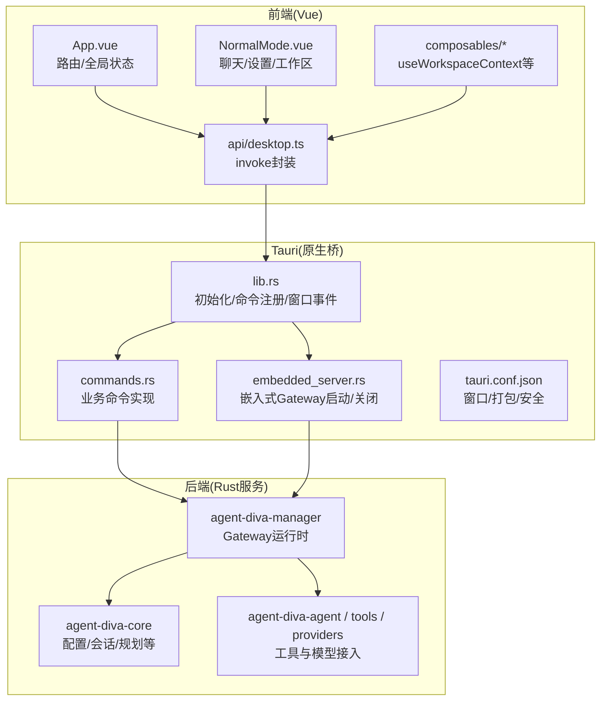
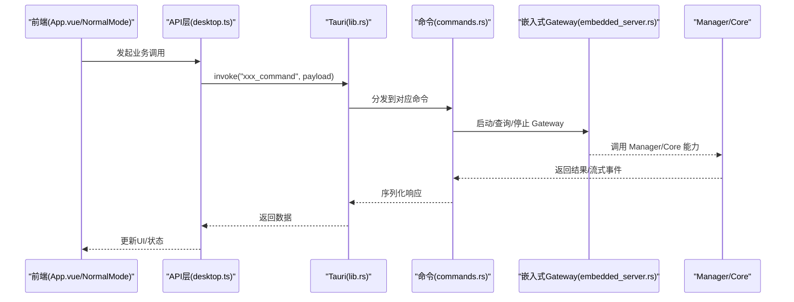
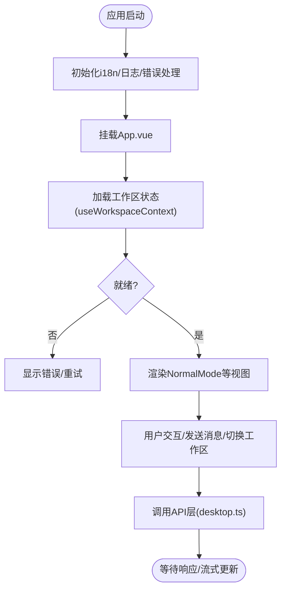
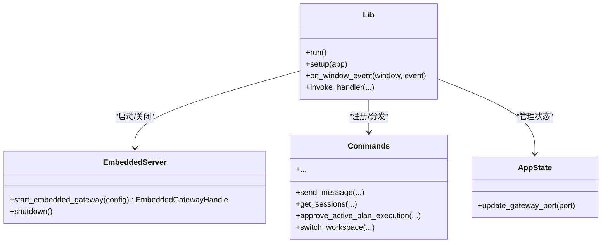
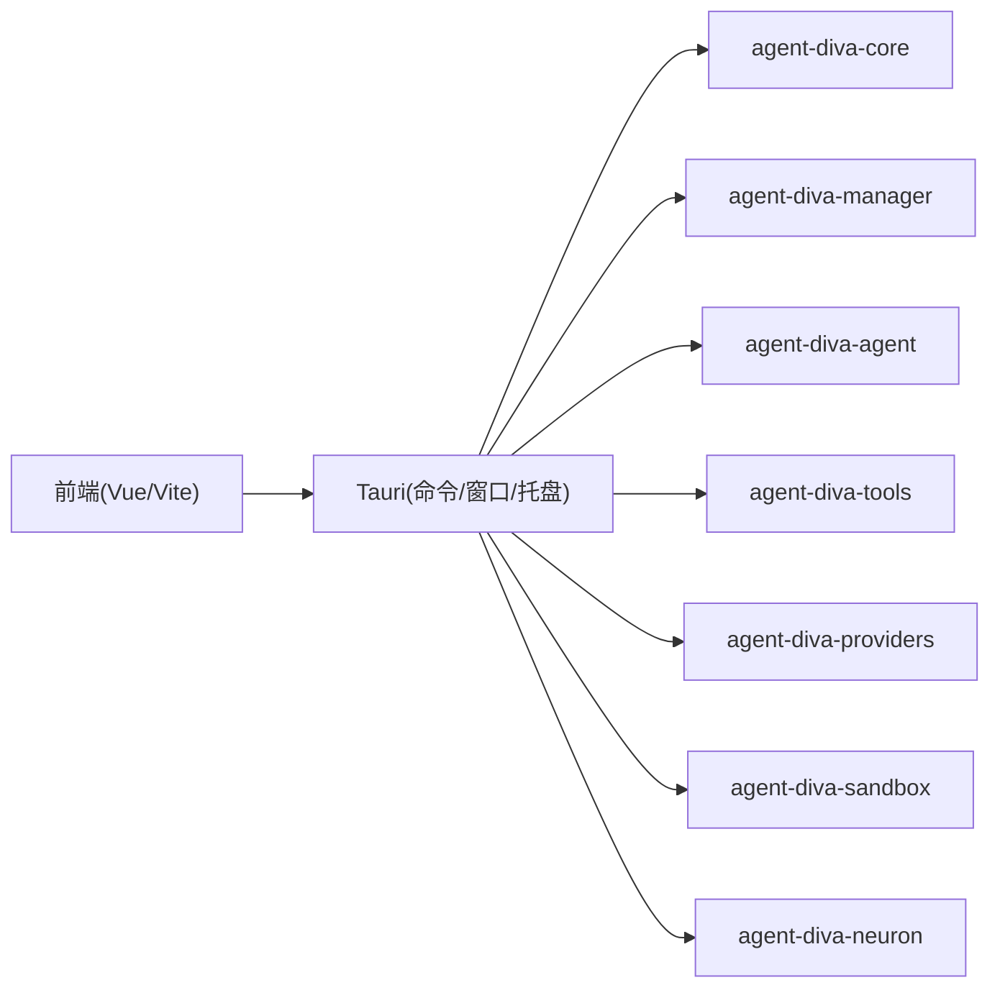

# GUI 架构概览

<cite>
**本文引用的文件**
- [agent-diva-gui/package.json](file://agent-diva-gui/package.json)
- [agent-diva-gui/vite.config.ts](file://agent-diva-gui/vite.config.ts)
- [agent-diva-gui/src/main.ts](file://agent-diva-gui/src/main.ts)
- [agent-diva-gui/src/App.vue](file://agent-diva-gui/src/App.vue)
- [agent-diva-gui/src/composables/useWorkspaceContext.ts](file://agent-diva-gui/src/composables/useWorkspaceContext.ts)
- [agent-diva-gui/src/components/NormalMode.vue](file://agent-diva-gui/src/components/NormalMode.vue)
- [agent-diva-gui/src/api/desktop.ts](file://agent-diva-gui/src/api/desktop.ts)
- [agent-diva-gui/src-tauri/Cargo.toml](file://agent-diva-gui/src-tauri/Cargo.toml)
- [agent-diva-gui/src-tauri/tauri.conf.json](file://agent-diva-gui/src-tauri/tauri.conf.json)
- [agent-diva-gui/src-tauri/src/lib.rs](file://agent-diva-gui/src-tauri/src/lib.rs)
- [agent-diva-gui/src-tauri/src/embedded_server.rs](file://agent-diva-gui/src-tauri/src/embedded_server.rs)
- [agent-diva-gui/src-tauri/src/commands.rs](file://agent-diva-gui/src-tauri/src/commands.rs)
</cite>

## 目录
1. [简介](#简介)
2. [项目结构](#项目结构)
3. [核心组件](#核心组件)
4. [架构总览](#架构总览)
5. [详细组件分析](#详细组件分析)
6. [依赖关系分析](#依赖关系分析)
7. [性能考虑](#性能考虑)
8. [故障排查指南](#故障排查指南)
9. [结论](#结论)
10. [附录](#附录)

## 简介
本文件面向 Agent Diva GUI 桌面应用的开发者，系统性阐述基于 Vue 3 + Tauri 构建的现代桌面应用的分层架构：前端 Vue 应用层、Tauri 原生桥接层与后端 Rust 服务（嵌入式 Gateway）的协作方式。文档覆盖组件化架构模式、状态管理策略、前后端通信机制、数据同步方案、跨平台兼容性、性能优化与安全边界设计，并提供开发环境搭建、构建流程与部署配置参考，以及扩展点与自定义开发指导。

## 项目结构
Agent Diva GUI 采用“前端 + 原生桥 + 后端服务”的三层结构：
- 前端：Vue 3 + Vite + TypeScript，使用 TailwindCSS、i18n、CodeMirror、Three.js/VRM 等生态；多页面入口支持主窗口与桌面伴侣窗口。
- 原生桥：Tauri 2.x，Rust 实现命令、系统托盘、窗口生命周期、嵌入式网关启动与关闭、日志与配置管理等。
- 后端服务：通过 Tauri 在进程内嵌入 agent-diva-manager 提供的 Gateway 运行时，暴露 HTTP/WebSocket 能力供前端调用。

图表来源
- [agent-diva-gui/src/App.vue:1-120](file://agent-diva-gui/src/App.vue#L1-L120)
- [agent-diva-gui/src/components/NormalMode.vue:1-120](file://agent-diva-gui/src/components/NormalMode.vue#L1-L120)
- [agent-diva-gui/src/composables/useWorkspaceContext.ts:1-94](file://agent-diva-gui/src/composables/useWorkspaceContext.ts#L1-L94)
- [agent-diva-gui/src/api/desktop.ts:1-200](file://agent-diva-gui/src/api/desktop.ts#L1-L200)
- [agent-diva-gui/src-tauri/src/lib.rs:263-565](file://agent-diva-gui/src-tauri/src/lib.rs#L263-L565)
- [agent-diva-gui/src-tauri/src/embedded_server.rs:72-154](file://agent-diva-gui/src-tauri/src/embedded_server.rs#L72-L154)
- [agent-diva-gui/src-tauri/tauri.conf.json:1-90](file://agent-diva-gui/src-tauri/tauri.conf.json#L1-L90)

章节来源
- [agent-diva-gui/package.json:1-54](file://agent-diva-gui/package.json#L1-L54)
- [agent-diva-gui/vite.config.ts:1-51](file://agent-diva-gui/vite.config.ts#L1-L51)
- [agent-diva-gui/src-tauri/tauri.conf.json:1-90](file://agent-diva-gui/src-tauri/tauri.conf.json#L1-L90)

## 核心组件
- 前端入口与全局错误处理：main.ts 挂载 i18n、安装 GUI 日志、注册 Vue 全局错误处理器。
- 应用根组件：App.vue 负责会话、审批中心、计划执行流、工作区切换、配置与工具集、消息流式更新、HITL 问答等。
- 视图容器：NormalMode.vue 组织聊天、设置、控制台、笔记本、进化、记忆、桌面伴侣等功能模块。
- 状态管理：useWorkspaceContext 提供工作区上下文状态（加载/刷新/就绪/错误），并维护显式会话覆盖逻辑。
- API 层：desktop.ts 定义类型与 invoke 调用封装，统一前后端契约。
- Tauri 桥：lib.rs 注册命令、管理嵌入式 Gateway、窗口事件、系统托盘、退出流程。
- 嵌入式 Gateway：embedded_server.rs 在独立线程中启动 Tokio 运行时并托管 Gateway 生命周期。
- 命令实现：commands.rs 承载大量业务命令（会话、计划、审批、技能、MCP、提供商、工作区、日志等）。

章节来源
- [agent-diva-gui/src/main.ts:1-13](file://agent-diva-gui/src/main.ts#L1-L13)
- [agent-diva-gui/src/App.vue:1-120](file://agent-diva-gui/src/App.vue#L1-L120)
- [agent-diva-gui/src/components/NormalMode.vue:1-120](file://agent-diva-gui/src/components/NormalMode.vue#L1-L120)
- [agent-diva-gui/src/composables/useWorkspaceContext.ts:1-94](file://agent-diva-gui/src/composables/useWorkspaceContext.ts#L1-L94)
- [agent-diva-gui/src/api/desktop.ts:1-200](file://agent-diva-gui/src/api/desktop.ts#L1-L200)
- [agent-diva-gui/src-tauri/src/lib.rs:263-565](file://agent-diva-gui/src-tauri/src/lib.rs#L263-L565)
- [agent-diva-gui/src-tauri/src/embedded_server.rs:72-154](file://agent-diva-gui/src-tauri/src/embedded_server.rs#L72-L154)
- [agent-diva-gui/src-tauri/src/commands.rs:1-200](file://agent-diva-gui/src-tauri/src/commands.rs#L1-L200)

## 架构总览
整体采用“前端 UI + Tauri 命令桥 + 嵌入式 Gateway 服务”的分层设计：
- 前端通过 @tauri-apps/api/core.invoke 调用 Rust 命令，获取数据或触发操作。
- Tauri 命令层将请求转发到 agent-diva-manager 的 Gateway 运行时，或通过 core/cli/sandbox/providers 等子模块完成具体任务。
- 嵌入式 Gateway 运行于独立线程，具备独立的 Tokio 运行时，支持优雅关闭与端口复用。
- 窗口与系统托盘由 Tauri 管理，支持最小化到托盘、全屏退出、Splash 屏过渡等。

图表来源
- [agent-diva-gui/src/App.vue:1-120](file://agent-diva-gui/src/App.vue#L1-L120)
- [agent-diva-gui/src/api/desktop.ts:1-200](file://agent-diva-gui/src/api/desktop.ts#L1-L200)
- [agent-diva-gui/src-tauri/src/lib.rs:369-549](file://agent-diva-gui/src-tauri/src/lib.rs#L369-L549)
- [agent-diva-gui/src-tauri/src/embedded_server.rs:72-154](file://agent-diva-gui/src-tauri/src/embedded_server.rs#L72-L154)

## 详细组件分析

### 前端应用层（Vue 3 + Vite）
- 入口与国际化：main.ts 安装 i18n、GUI 日志、全局错误处理，挂载 App 实例。
- 根组件：App.vue 集中管理会话、计划、审批、工作区、配置、工具集、流式消息、HITL 问答等，并通过 useWorkspaceContext 与工作区状态联动。
- 视图容器：NormalMode.vue 组合聊天、设置、控制台、笔记本、进化、记忆、桌面伴侣等子视图，并处理工作区选择与切换。
- 状态管理：useWorkspaceContext 提供工作区状态（idle/loading/refreshing/ready/error）、刷新与覆盖逻辑，避免默认工作区误标记。
- API 层：desktop.ts 定义类型与 invoke 封装，统一前后端契约，便于测试与替换。

图表来源
- [agent-diva-gui/src/main.ts:1-13](file://agent-diva-gui/src/main.ts#L1-L13)
- [agent-diva-gui/src/App.vue:1-120](file://agent-diva-gui/src/App.vue#L1-L120)
- [agent-diva-gui/src/composables/useWorkspaceContext.ts:1-94](file://agent-diva-gui/src/composables/useWorkspaceContext.ts#L1-L94)
- [agent-diva-gui/src/components/NormalMode.vue:1-120](file://agent-diva-gui/src/components/NormalMode.vue#L1-L120)

章节来源
- [agent-diva-gui/src/main.ts:1-13](file://agent-diva-gui/src/main.ts#L1-L13)
- [agent-diva-gui/src/App.vue:1-120](file://agent-diva-gui/src/App.vue#L1-L120)
- [agent-diva-gui/src/components/NormalMode.vue:1-120](file://agent-diva-gui/src/components/NormalMode.vue#L1-L120)
- [agent-diva-gui/src/composables/useWorkspaceContext.ts:1-94](file://agent-diva-gui/src/composables/useWorkspaceContext.ts#L1-L94)
- [agent-diva-gui/src/api/desktop.ts:1-200](file://agent-diva-gui/src/api/desktop.ts#L1-L200)

### Tauri 原生桥接层
- 应用初始化：lib.rs 初始化日志、插件、状态（AgentState、ShutdownManager、SplashState、WorkspaceSwitchState），注册命令，启动嵌入式 Gateway，初始化系统托盘。
- 窗口与生命周期：监听窗口关闭事件，根据托盘设置决定隐藏到托盘或完全退出；Splash 屏在前后端都完成后关闭。
- 嵌入式 Gateway：embedded_server.rs 在独立线程创建 Tokio 运行时，绑定本地端口，启动 Gateway 运行时，支持优雅关闭。
- 命令实现：commands.rs 暴露大量命令，涵盖会话、计划、审批、技能、MCP、提供商、工作区、日志、Token 用量、沙箱配置等。

图表来源
- [agent-diva-gui/src-tauri/src/lib.rs:263-565](file://agent-diva-gui/src-tauri/src/lib.rs#L263-L565)
- [agent-diva-gui/src-tauri/src/embedded_server.rs:72-154](file://agent-diva-gui/src-tauri/src/embedded_server.rs#L72-L154)
- [agent-diva-gui/src-tauri/src/commands.rs:1-200](file://agent-diva-gui/src-tauri/src/commands.rs#L1-L200)

章节来源
- [agent-diva-gui/src-tauri/src/lib.rs:263-565](file://agent-diva-gui/src-tauri/src/lib.rs#L263-L565)
- [agent-diva-gui/src-tauri/src/embedded_server.rs:72-154](file://agent-diva-gui/src-tauri/src/embedded_server.rs#L72-L154)
- [agent-diva-gui/src-tauri/src/commands.rs:1-200](file://agent-diva-gui/src-tauri/src/commands.rs#L1-L200)

### 后端 Rust 服务（嵌入式 Gateway）
- 生命周期：在独立线程中创建 Tokio 运行时，绑定本地端口，启动 manager 提供的 Gateway 运行时，监听关闭信号并优雅退出。
- 配置与路径：解析配置目录、日志目录、工作区路径，规范化默认工作区，确保可访问性。
- 集成点：通过 agent-diva-manager 暴露 HTTP/WebSocket 接口，供前端通过 Tauri 命令间接调用。

章节来源
- [agent-diva-gui/src-tauri/src/embedded_server.rs:72-154](file://agent-diva-gui/src-tauri/src/embedded_server.rs#L72-L154)
- [agent-diva-gui/src-tauri/src/lib.rs:90-142](file://agent-diva-gui/src-tauri/src/lib.rs#L90-L142)

## 依赖关系分析
- 前端依赖：Vue 3、Vite、TailwindCSS、i18n、CodeMirror、Three.js/VRM、@tauri-apps/api。
- 原生桥依赖：Tauri 2.x、plugin-opener、plugin-store、core/agent/cli/neuron/sandbox/providers 等内部 crate。
- 构建与打包：Vite 多页面构建（主窗口、桌面伴侣、嵌入式伴侣），Tauri 打包目标包含 nsis/msi/app/dmg/deb/appimage。

图表来源
- [agent-diva-gui/package.json:16-50](file://agent-diva-gui/package.json#L16-L50)
- [agent-diva-gui/src-tauri/Cargo.toml:15-49](file://agent-diva-gui/src-tauri/Cargo.toml#L15-L49)
- [agent-diva-gui/vite.config.ts:41-49](file://agent-diva-gui/vite.config.ts#L41-L49)
- [agent-diva-gui/src-tauri/tauri.conf.json:58-88](file://agent-diva-gui/src-tauri/tauri.conf.json#L58-L88)

章节来源
- [agent-diva-gui/package.json:16-50](file://agent-diva-gui/package.json#L16-L50)
- [agent-diva-gui/src-tauri/Cargo.toml:15-49](file://agent-diva-gui/src-tauri/Cargo.toml#L15-L49)
- [agent-diva-gui/vite.config.ts:41-49](file://agent-diva-gui/vite.config.ts#L41-L49)
- [agent-diva-gui/src-tauri/tauri.conf.json:58-88](file://agent-diva-gui/src-tauri/tauri.conf.json#L58-L88)

## 性能考虑
- 流式输出与增量渲染：前端对消息进行流式追加，减少重绘开销；后端通过事件流推送，降低阻塞。
- 工作区切换节流：useWorkspaceContext 使用生成号避免竞态，防止重复刷新导致的闪烁。
- 嵌入式 Gateway 异步：独立线程与 Tokio 运行时，避免阻塞主线程；优雅关闭超时控制。
- 资源隔离：多页面（主窗口、桌面伴侣、嵌入式伴侣）按需加载，减少首屏体积。
- 日志与诊断：GUI 日志与后端日志分离，便于定位性能瓶颈。

[本节为通用性能讨论，不直接分析具体文件]

## 故障排查指南
- 启动失败：检查嵌入式 Gateway 是否成功绑定端口；查看 lib.rs 中的错误日志与 embedded_server.rs 的启动结果。
- 窗口无法关闭：确认托盘设置与 ShutdownManager 状态；检查 on_window_event 分支逻辑。
- 工作区切换异常：验证 inspect_workspace 权限与路径合法性；关注 WorkspaceSwitchRequest 的守卫条件。
- 审批与计划流中断：检查 approve_active_plan_execution 与相关流式事件；必要时刷新审批中心状态。
- 日志定位：使用 tail_logs 与 get_gui_log_lines 获取前后端日志；结合 tracing 级别调整。

章节来源
- [agent-diva-gui/src-tauri/src/lib.rs:331-368](file://agent-diva-gui/src-tauri/src/lib.rs#L331-L368)
- [agent-diva-gui/src-tauri/src/embedded_server.rs:72-154](file://agent-diva-gui/src-tauri/src/embedded_server.rs#L72-L154)
- [agent-diva-gui/src-tauri/src/commands.rs:155-200](file://agent-diva-gui/src-tauri/src/commands.rs#L155-L200)

## 结论
Agent Diva GUI 采用清晰的三层架构：前端 Vue 负责交互与状态，Tauri 作为原生桥管理窗口、托盘与生命周期，嵌入式 Gateway 提供稳定的后端服务。通过命令化接口、流式通信与模块化组件，实现了高内聚、低耦合的可扩展设计。结合完善的日志、诊断与打包配置，满足跨平台桌面应用的需求。

[本节为总结性内容，不直接分析具体文件]

## 附录

### 开发环境搭建
- Node 与 pnpm：使用 package.json 中声明的包管理器版本。
- 前端开发：vite dev 启动，端口 1420，HMR 支持。
- Tauri 开发：tauri dev 自动执行 beforeDevCommand，连接 devUrl。
- Rust 环境：安装 Rust Toolchain，确保 Cargo 可用。

章节来源
- [agent-diva-gui/package.json:7-15](file://agent-diva-gui/package.json#L7-L15)
- [agent-diva-gui/vite.config.ts:18-38](file://agent-diva-gui/vite.config.ts#L18-L38)
- [agent-diva-gui/src-tauri/tauri.conf.json:5-10](file://agent-diva-gui/src-tauri/tauri.conf.json#L5-L10)

### 构建流程说明
- 前端构建：vite build 输出到 dist。
- Tauri 构建：beforeBuildCommand 执行 pnpm build，frontendDist 指向 ../dist。
- 多页面：index.html、desktop-mate.html、embedded-mate.html 分别构建。

章节来源
- [agent-diva-gui/vite.config.ts:41-49](file://agent-diva-gui/vite.config.ts#L41-L49)
- [agent-diva-gui/src-tauri/tauri.conf.json:5-10](file://agent-diva-gui/src-tauri/tauri.conf.json#L5-L10)

### 部署配置参考
- 产物目标：nsis、msi、app、dmg、deb、appimage。
- 图标与资源：icons 与 resources 目录打包。
- Windows WebView：downloadBootstrapper 模式。
- macOS 私有 API：启用以支持系统级功能。

章节来源
- [agent-diva-gui/src-tauri/tauri.conf.json:58-88](file://agent-diva-gui/src-tauri/tauri.conf.json#L58-L88)

### 扩展点与自定义开发指导
- 新增前端命令：在 desktop.ts 添加类型与 invoke 封装，在 App.vue/NormalMode.vue 中调用。
- 新增 Tauri 命令：在 commands.rs 实现函数，并在 lib.rs 的 generate_handler! 中注册。
- 扩展嵌入式 Gateway：在 embedded_server.rs 中调整生命周期与配置；在 manager 侧对接新能力。
- 工作区扩展：在 commands.rs 的 inspect_workspace 与 switch_workspace 中增强校验与逻辑。
- 多页面扩展：在 vite.config.ts 与 tauri.conf.json 中添加新入口与窗口配置。

章节来源
- [agent-diva-gui/src/api/desktop.ts:1-200](file://agent-diva-gui/src/api/desktop.ts#L1-L200)
- [agent-diva-gui/src-tauri/src/commands.rs:1-200](file://agent-diva-gui/src-tauri/src/commands.rs#L1-L200)
- [agent-diva-gui/src-tauri/src/lib.rs:369-549](file://agent-diva-gui/src-tauri/src/lib.rs#L369-L549)
- [agent-diva-gui/src-tauri/src/embedded_server.rs:72-154](file://agent-diva-gui/src-tauri/src/embedded_server.rs#L72-L154)
- [agent-diva-gui/vite.config.ts:41-49](file://agent-diva-gui/vite.config.ts#L41-L49)
- [agent-diva-gui/src-tauri/tauri.conf.json:11-56](file://agent-diva-gui/src-tauri/tauri.conf.json#L11-L56)