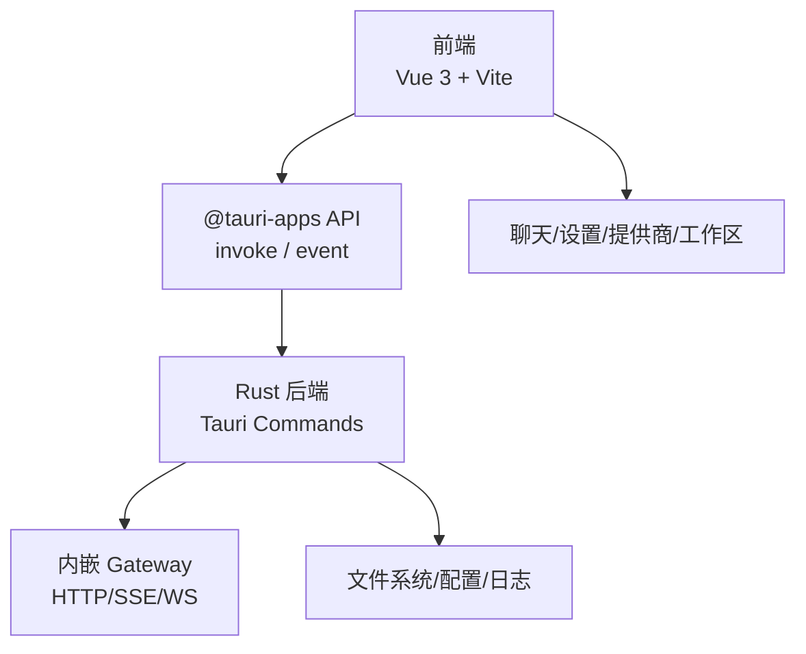
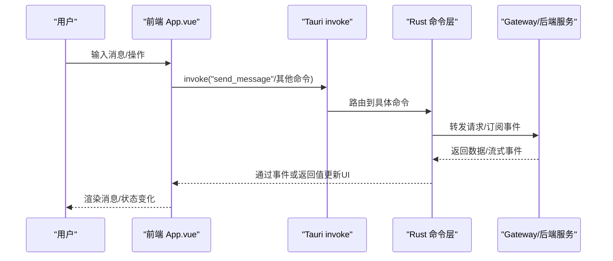
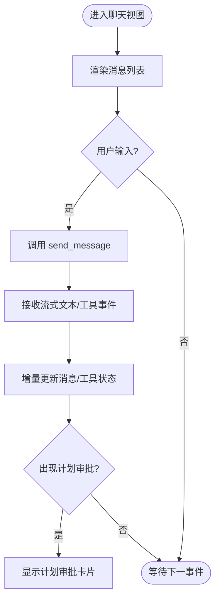
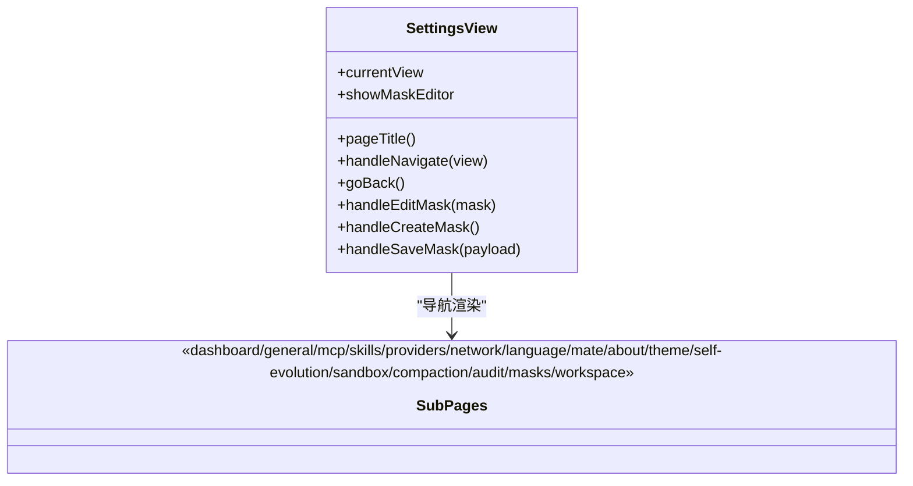
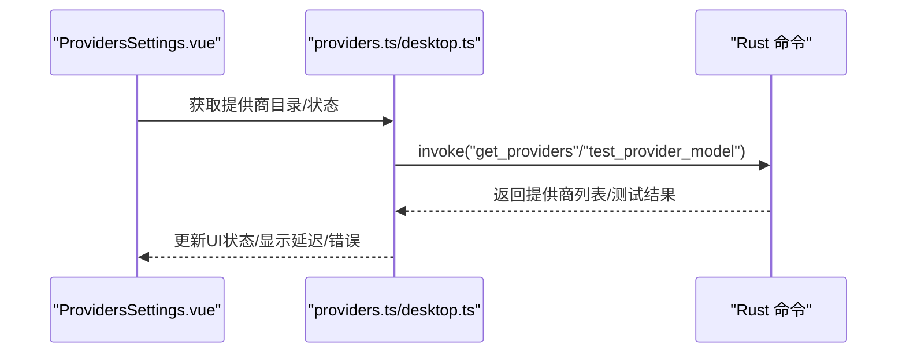
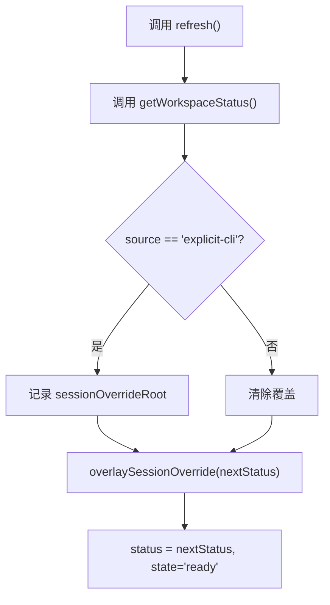
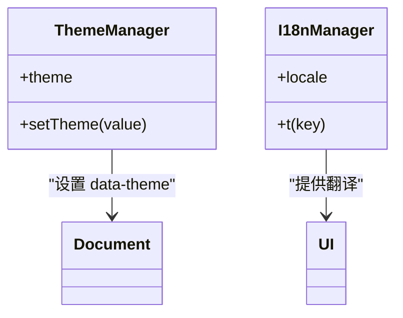
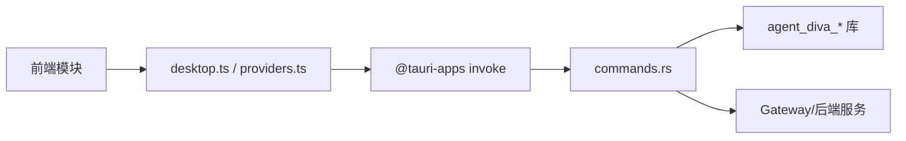

# GUI 桌面应用

<cite>
**本文引用的文件**
- [README.md](file://agent-diva-gui/README.md)
- [package.json](file://agent-diva-gui/package.json)
- [main.ts](file://agent-diva-gui/src/main.ts)
- [App.vue](file://agent-diva-gui/src/App.vue)
- [ChatView.vue](file://agent-diva-gui/src/components/ChatView.vue)
- [SettingsView.vue](file://agent-diva-gui/src/components/SettingsView.vue)
- [ProvidersSettings.vue](file://agent-diva-gui/src/components/settings/ProvidersSettings.vue)
- [desktop.ts](file://agent-diva-gui/src/api/desktop.ts)
- [lib.rs](file://agent-diva-gui/src-tauri/src/lib.rs)
- [commands.rs](file://agent-diva-gui/src-tauri/src/commands.rs)
- [useWorkspaceContext.ts](file://agent-diva-gui/src/composables/useWorkspaceContext.ts)
- [useTheme.ts](file://agent-diva-gui/src/composables/useTheme.ts)
- [i18n.ts](file://agent-diva-gui/src/i18n.ts)
- [tailwind.config.js](file://agent-diva-gui/tailwind.config.js)
</cite>

## 目录
1. [简介](#简介)
2. [项目结构](#项目结构)
3. [核心组件](#核心组件)
4. [架构总览](#架构总览)
5. [详细组件分析](#详细组件分析)
6. [依赖关系分析](#依赖关系分析)
7. [性能与可伸缩性](#性能与可伸缩性)
8. [故障排查指南](#故障排查指南)
9. [结论](#结论)
10. [附录：使用手册与开发者参考](#附录使用手册与开发者参考)

## 简介
Agent Diva GUI 是基于 Vue 3 + Tauri 的现代桌面应用，提供与 Agent 的实时对话、流式响应、工具可视化、动态配置与外部 Hook 等能力。前端通过 Tauri 命令调用 Rust 后端，后端启动内嵌 Gateway（或连接外部 Gateway），并暴露大量命令用于会话管理、计划审批、工作区切换、提供商管理、技能与 MCP 管理等。应用支持主题切换、多语言、工作区上下文与跨平台运行。

## 项目结构
- 前端工程位于 agent-diva-gui，采用 Vite + Vue 3 + TypeScript，样式基于 Tailwind CSS，国际化使用 vue-i18n。
- 后端入口在 src-tauri/src/lib.rs，注册所有 Tauri 命令，管理嵌入式 Gateway、系统托盘、窗口生命周期与日志。
- 前后端通信通过 @tauri-apps/api/core.invoke 调用 Rust 命令；事件总线通过 tauri::Emitter 推送状态更新。
- 关键模块：
  - 聊天界面：ChatView.vue 负责消息渲染、流式输出、工具结果展示、预算压力提示等。
  - 设置面板：SettingsView.vue 聚合通用、提供商、网络、MCP、技能、审计、工作区等子页面。
  - 提供商管理：ProvidersSettings.vue 提供模型目录、自定义提供商、测试连接等功能。
  - 工作区管理：useWorkspaceContext.ts 统一获取/刷新工作区状态，处理显式 CLI 选择覆盖。
  - 主题与国际化：useTheme.ts 管理主题持久化；i18n.ts 维护 zh/en 资源与默认值。

图表来源
- [lib.rs:267-330](file://agent-diva-gui/src-tauri/src/lib.rs#L267-L330)
- [main.ts:1-13](file://agent-diva-gui/src/main.ts#L1-L13)

章节来源
- [README.md:1-62](file://agent-diva-gui/README.md#L1-L62)
- [package.json:1-54](file://agent-diva-gui/package.json#L1-L54)

## 核心组件
- 应用壳 App.vue：集中管理会话、消息、流式事件、审批中心、工作区切换、保存模型与提供商配置、欢迎向导等。
- 聊天视图 ChatView.vue：渲染 Markdown、代码高亮、思考块、工具卡片、治理卡片、计划审批卡片、HITL 问答等。
- 设置面板 SettingsView.vue：导航到各设置子页，集成面具编辑器与工作区设置。
- 提供商设置 ProvidersSettings.vue：加载提供商目录、添加自定义提供商、测试模型连通性与延迟。
- 工作区上下文 useWorkspaceContext.ts：封装 getWorkspaceStatus，处理显式 CLI 选择的覆盖逻辑与错误态。
- 主题 useTheme.ts：读取/写入 localStorage，设置 data-theme 属性，提供受控主题状态。
- 国际化 i18n.ts：初始化 vue-i18n，合并 zh/en 资源，提供全局翻译函数。

章节来源
- [App.vue:1-800](file://agent-diva-gui/src/App.vue#L1-L800)
- [ChatView.vue:1-200](file://agent-diva-gui/src/components/ChatView.vue#L1-L200)
- [SettingsView.vue:1-200](file://agent-diva-gui/src/components/SettingsView.vue#L1-L200)
- [ProvidersSettings.vue:1-200](file://agent-diva-gui/src/components/settings/ProvidersSettings.vue#L1-L200)
- [useWorkspaceContext.ts:1-94](file://agent-diva-gui/src/composables/useWorkspaceContext.ts#L1-L94)
- [useTheme.ts:1-46](file://agent-diva-gui/src/composables/useTheme.ts#L1-L46)
- [i18n.ts:1-359](file://agent-diva-gui/src/i18n.ts#L1-L359)

## 架构总览
应用采用“前端 UI + Tauri 命令层 + Rust 后端服务”的分层架构。前端通过 invoke 调用后端命令，后端根据命令类型访问配置、会话、计划、提供商、工作区、技能、MCP、审计等子系统，并通过事件向 UI 推送实时更新。

图表来源
- [lib.rs:369-549](file://agent-diva-gui/src-tauri/src/lib.rs#L369-L549)
- [App.vue:1-800](file://agent-diva-gui/src/App.vue#L1-L800)

章节来源
- [lib.rs:267-330](file://agent-diva-gui/src-tauri/src/lib.rs#L267-L330)
- [commands.rs:1-200](file://agent-diva-gui/src-tauri/src/commands.rs#L1-L200)

## 详细组件分析

### 聊天界面（ChatView）
- 功能要点：Markdown 渲染与安全转义、代码高亮、思考块折叠/展开、工具结果预览、预算压力计算、HITL 问答、计划审批卡片、治理卡片。
- 数据流：从父组件接收 messages、isTyping、sessions 等 props，内部维护展开状态与偏好；通过 Tauri 命令上传附件、触发自动梦（autodream）等。
- 交互流程：发送消息 -> 后端流式返回 -> 前端增量渲染 -> 工具执行状态更新 -> 计划审批弹窗。

图表来源
- [ChatView.vue:1-200](file://agent-diva-gui/src/components/ChatView.vue#L1-L200)
- [App.vue:1-800](file://agent-diva-gui/src/App.vue#L1-L800)

章节来源
- [ChatView.vue:1-200](file://agent-diva-gui/src/components/ChatView.vue#L1-L200)
- [App.vue:1-800](file://agent-diva-gui/src/App.vue#L1-L800)

### 设置面板（SettingsView）
- 功能要点：仪表盘与各子页导航（通用、MCP、技能、提供商、网络、语言、Mate、关于、主题、自进化、沙箱、压缩、审计、面具、工作区）。
- 集成点：面具编辑器、工作区状态注入、保存配置动作回调、保存工具配置动作回调。
- 扩展方式：新增子页只需在路由映射中添加新视图，并在标题映射中补充文案。

图表来源
- [SettingsView.vue:1-200](file://agent-diva-gui/src/components/SettingsView.vue#L1-L200)

章节来源
- [SettingsView.vue:1-200](file://agent-diva-gui/src/components/SettingsView.vue#L1-L200)

### 提供商管理（ProvidersSettings）
- 功能要点：加载提供商目录、合并内置与自定义提供商、隐藏更多提供商分组、手动添加模型、创建/删除自定义提供商、测试模型连通性与延迟。
- 数据流：通过 desktop.ts 提供的 getConfigStatus 与 providers.ts 的 addProviderModel/testProviderModel 等接口与后端交互。
- 错误处理：对测试失败、网络异常进行本地状态标记与用户提示。

图表来源
- [ProvidersSettings.vue:1-200](file://agent-diva-gui/src/components/settings/ProvidersSettings.vue#L1-L200)
- [desktop.ts:1-200](file://agent-diva-gui/src/api/desktop.ts#L1-L200)

章节来源
- [ProvidersSettings.vue:1-200](file://agent-diva-gui/src/components/settings/ProvidersSettings.vue#L1-L200)
- [desktop.ts:1-200](file://agent-diva-gui/src/api/desktop.ts#L1-L200)

### 工作区管理（useWorkspaceContext）
- 功能要点：获取工作区状态、处理显式 CLI 选择覆盖、刷新与错误态管理、路径规范化与大小写处理。
- 策略：当 source 为 explicit-cli 时，记录 sessionOverrideRoot，避免后续刷新覆盖用户显式选择。
- 集成：被 App.vue 等组件使用，统一暴露 status/state/error/refresh/apply。

图表来源
- [useWorkspaceContext.ts:1-94](file://agent-diva-gui/src/composables/useWorkspaceContext.ts#L1-L94)

章节来源
- [useWorkspaceContext.ts:1-94](file://agent-diva-gui/src/composables/useWorkspaceContext.ts#L1-L94)

### 主题与国际化
- 主题：useTheme.ts 读取/写入 localStorage，设置 documentElement 的 data-theme 属性，提供只读 theme 与 setTheme。
- 国际化：i18n.ts 初始化 vue-i18n，合并 zh/en 资源，提供 t() 函数；Tailwind 配置中使用语义色令牌映射到 CSS 变量，便于主题切换。

图表来源
- [useTheme.ts:1-46](file://agent-diva-gui/src/composables/useTheme.ts#L1-L46)
- [i18n.ts:1-359](file://agent-diva-gui/src/i18n.ts#L1-L359)
- [tailwind.config.js:1-82](file://agent-diva-gui/tailwind.config.js#L1-L82)

章节来源
- [useTheme.ts:1-46](file://agent-diva-gui/src/composables/useTheme.ts#L1-L46)
- [i18n.ts:1-359](file://agent-diva-gui/src/i18n.ts#L1-L359)
- [tailwind.config.js:1-82](file://agent-diva-gui/tailwind.config.js#L1-L82)

## 依赖关系分析
- 前端依赖：Vue 3、@tauri-apps/api、vue-i18n、Tailwind CSS、CodeMirror、highlight.js、Three.js/VRM（虚拟形象相关）。
- 后端依赖：Tauri、agent_diva_core、agent_diva_manager、agent_diva_cli、agent_diva_providers、eventsource_stream、tokio_tungstenite 等。
- 命令注册：lib.rs 中集中注册大量命令，涵盖会话、计划、提供商、工作区、技能、MCP、审计、日志、虚拟形象等。

图表来源
- [lib.rs:369-549](file://agent-diva-gui/src-tauri/src/lib.rs#L369-L549)
- [desktop.ts:1-200](file://agent-diva-gui/src/api/desktop.ts#L1-L200)

章节来源
- [package.json:1-54](file://agent-diva-gui/package.json#L1-L54)
- [lib.rs:369-549](file://agent-diva-gui/src-tauri/src/lib.rs#L369-L549)

## 性能与可伸缩性
- 流式渲染：聊天界面增量更新消息，减少重绘开销；工具结果与思考块按需展开。
- 预算控制：ChatView 中计算预算压力百分比，辅助用户理解上下文长度与压缩阈值。
- 后端并发：Rust 侧使用 tokio 异步运行时与事件流，提高吞吐与响应速度。
- 缓存与状态：工作区上下文与主题状态本地持久化，减少重复请求与初始化成本。
- 建议：
  - 对长会话启用上下文压缩（Compaction）以降低内存占用。
  - 合理设置工具超时与重试策略，避免阻塞主线程。
  - 使用虚拟角色（VRM）时注意资源加载与动画帧率。

[本节为通用指导，不直接分析具体文件]

## 故障排查指南
- 常见问题定位：
  - 无法连接后端：检查是否启用了外部 Gateway 模式（环境变量 AGENT_DIVA_EXTERNAL_GATEWAY），确认端口与防火墙。
  - 提供商测试失败：查看 ProvidersSettings 中的测试状态与错误信息，确认 API Key/Base URL 正确。
  - 工作区切换失败：检查路径可读性与 agents.md 是否存在，关注 useWorkspaceContext 的错误态。
  - 审批中心无响应：刷新统一审批列表，检查版本冲突与幂等键生成。
- 日志与调试：
  - 前端：main.ts 安装 guiLogger，捕获未处理错误。
  - 后端：lib.rs 初始化 logging，支持终端输出与配置文件指定目录。
  - 命令层：commands.rs 中大量 invoke 方法，结合事件与返回值定位问题。

章节来源
- [main.ts:1-13](file://agent-diva-gui/src/main.ts#L1-L13)
- [lib.rs:80-88](file://agent-diva-gui/src-tauri/src/lib.rs#L80-L88)
- [commands.rs:1-200](file://agent-diva-gui/src-tauri/src/commands.rs#L1-L200)

## 结论
Agent Diva GUI 以清晰的层次结构与丰富的组件能力，提供了现代化的桌面 AI 助手体验。通过 Tauri 命令桥接前后端，实现了会话管理、计划审批、提供商与工作区管理等核心功能。主题与国际化支持提升了用户体验，性能优化与错误处理保障了稳定性。未来可进一步扩展虚拟形象交互、多通道集成与更细粒度的权限控制。

[本节为总结，不直接分析具体文件]

## 附录：使用手册与开发者参考

### 用户使用手册
- 首次运行：
  - 打开应用后，如未配置 API Key 等，发送消息会提示配置；点击右上角设置图标进入配置。
  - 可在“提供商”页面添加或切换模型，并进行连接测试。
- 日常使用：
  - 在聊天界面输入自然语言指令，观察流式响应与工具执行过程。
  - 如需外部脚本发送消息，可使用 HTTP POST 到本地 3000 端口（详见 README）。
- 设置与定制：
  - 主题：在设置中选择主题，支持持久化。
  - 语言：在设置中选择语言，支持中文与英文。
  - 工作区：在工作区设置中选择或切换工作区目录。
- 无障碍与兼容性：
  - 遵循语义化标签与键盘导航；在不同平台上保持行为一致。
  - 虚拟形象（VRM）资源需确保加载成功，必要时禁用以提升性能。

章节来源
- [README.md:14-62](file://agent-diva-gui/README.md#L14-L62)
- [useTheme.ts:1-46](file://agent-diva-gui/src/composables/useTheme.ts#L1-L46)
- [i18n.ts:1-359](file://agent-diva-gui/src/i18n.ts#L1-L359)

### 开发者参考
- 组件开发：
  - 新增聊天消息类型：在 ChatView 中扩展 Message 接口与渲染逻辑。
  - 新增设置子页：在 SettingsView 中添加路由与标题映射，实现对应组件。
- 样式定制：
  - 使用 Tailwind 语义色令牌与 CSS 变量，配合 useTheme 切换主题。
  - 在 tailwind.config.js 中扩展颜色、字号、圆角与阴影。
- 扩展集成：
  - 新增 Tauri 命令：在 lib.rs 中注册命令，并在 commands.rs 中实现逻辑。
  - 新增提供商：在 ProvidersSettings 中支持自定义提供商与模型目录。
- 状态管理与数据同步：
  - 使用 useWorkspaceContext 统一管理工作区状态。
  - 通过 Tauri 事件与 invoke 实现前后端数据同步。

章节来源
- [App.vue:1-800](file://agent-diva-gui/src/App.vue#L1-L800)
- [SettingsView.vue:1-200](file://agent-diva-gui/src/components/SettingsView.vue#L1-L200)
- [tailwind.config.js:1-82](file://agent-diva-gui/tailwind.config.js#L1-L82)
- [lib.rs:369-549](file://agent-diva-gui/src-tauri/src/lib.rs#L369-L549)
- [useWorkspaceContext.ts:1-94](file://agent-diva-gui/src/composables/useWorkspaceContext.ts#L1-L94)