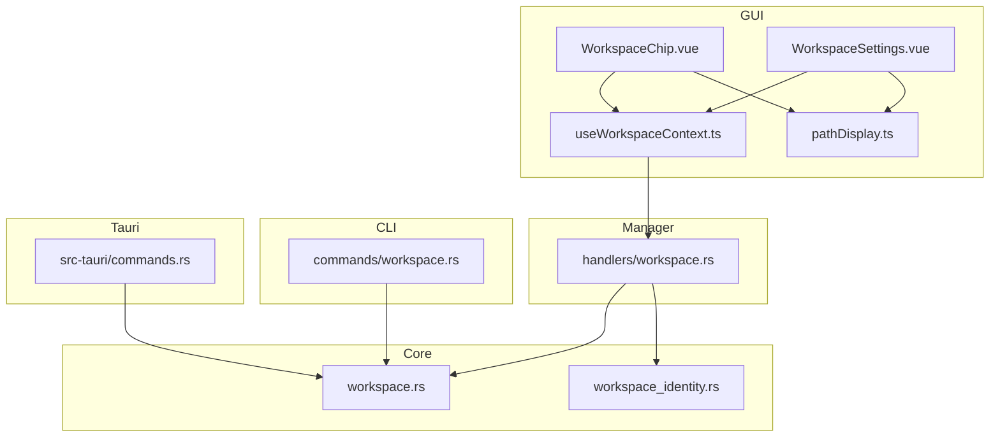
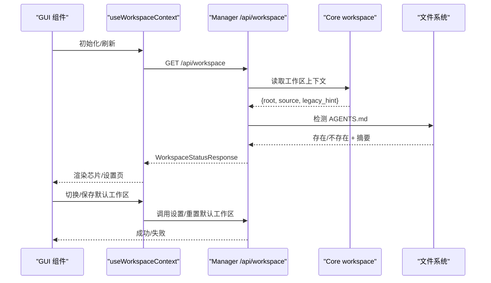
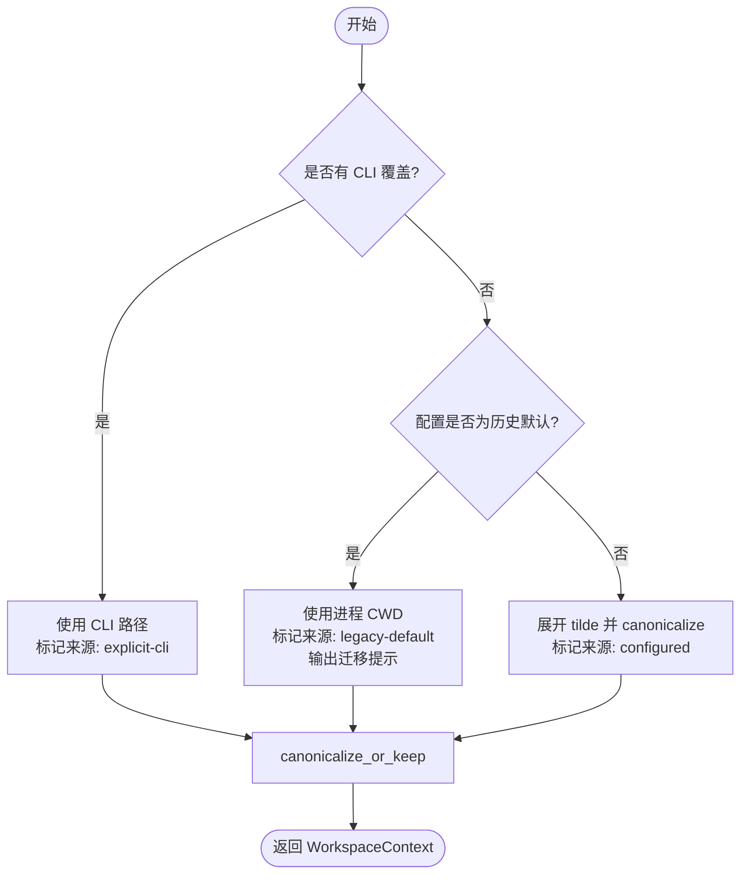
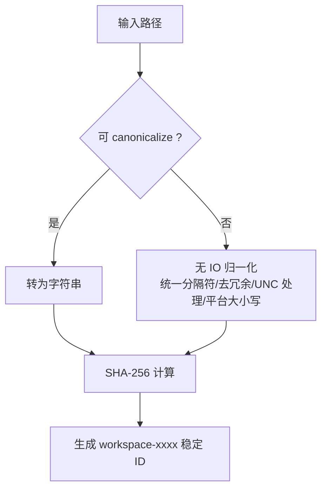
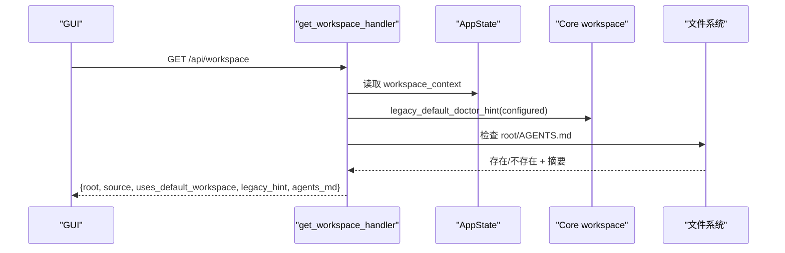
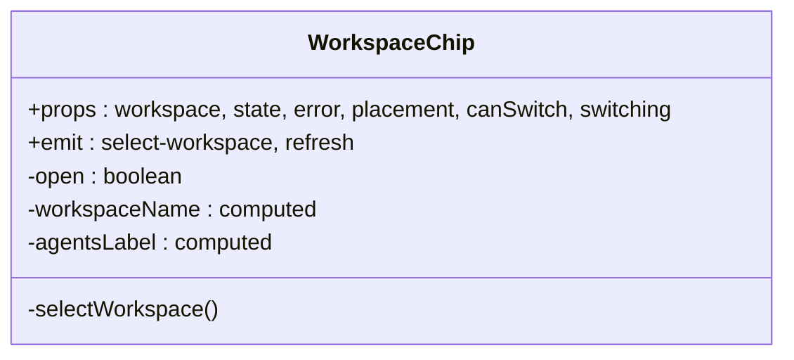
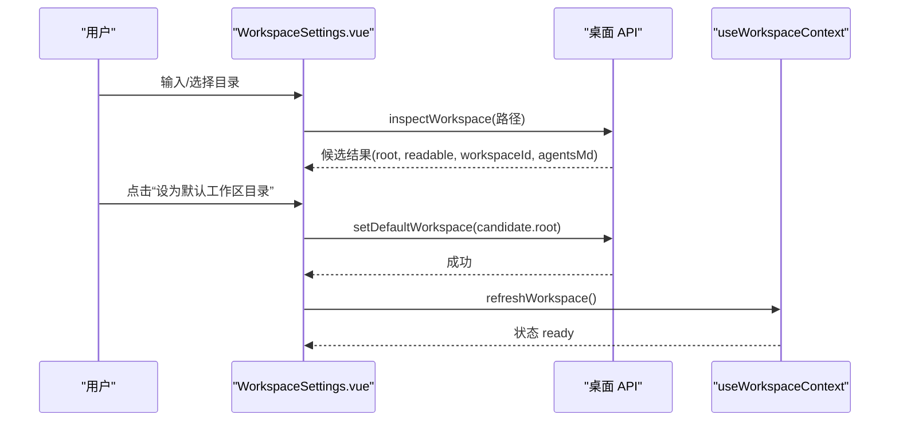
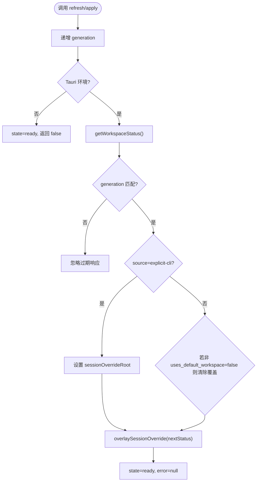
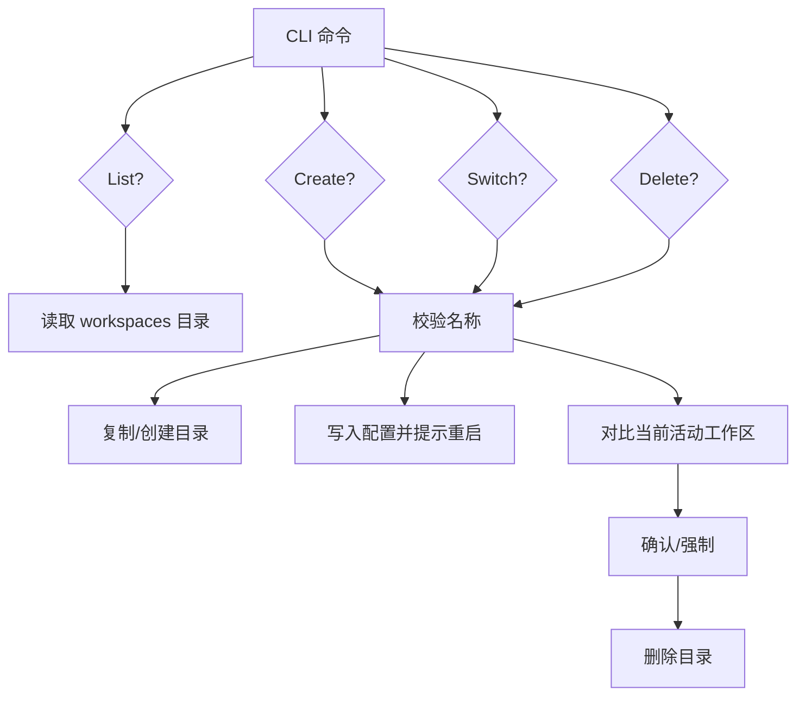
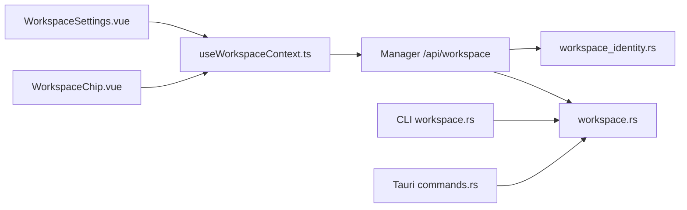

# 工作区管理

<cite>
**本文引用的文件**
- [agent-diva-core/src/workspace.rs](file://agent-diva-core/src/workspace.rs)
- [agent-diva-core/src/workspace_identity.rs](file://agent-diva-core/src/workspace_identity.rs)
- [agent-diva-manager/src/handlers/workspace.rs](file://agent-diva-manager/src/handlers/workspace.rs)
- [agent-diva-cli/src/commands/workspace.rs](file://agent-diva-cli/src/commands/workspace.rs)
- [agent-diva-gui/src/components/WorkspaceChip.vue](file://agent-diva-gui/src/components/WorkspaceChip.vue)
- [agent-diva-gui/src/composables/useWorkspaceContext.ts](file://agent-diva-gui/src/composables/useWorkspaceContext.ts)
- [agent-diva-gui/src/components/settings/WorkspaceSettings.vue](file://agent-diva-gui/src/components/settings/WorkspaceSettings.vue)
- [agent-diva-gui/src/utils/pathDisplay.ts](file://agent-diva-gui/src/utils/pathDisplay.ts)
- [agent-diva-gui/src-tauri/src/commands.rs](file://agent-diva-gui/src-tauri/src/commands.rs)
</cite>

## 目录
1. [简介](#简介)
2. [项目结构](#项目结构)
3. [核心组件](#核心组件)
4. [架构总览](#架构总览)
5. [详细组件分析](#详细组件分析)
6. [依赖关系分析](#依赖关系分析)
7. [性能考虑](#性能考虑)
8. [故障排查指南](#故障排查指南)
9. [结论](#结论)
10. [附录](#附录)

## 简介
本文件系统性说明 Agent Diva 的工作区管理机制，覆盖以下主题：
- 工作区的概念、作用域隔离与上下文管理
- 工作区芯片组件的路径显示、状态指示与快速切换
- 工作区设置面板的配置选项、预检与提交流程
- 工作区上下文的组合式函数实现（状态共享、事件驱动刷新、生命周期保护）
- 工作区初始化、迁移与清理的操作指南
- 路径规范化、权限检查与文件系统监控的技术要点

## 项目结构
Agent Diva 的工作区能力由前端 GUI、管理器后端、核心解析层与 CLI 工具共同构成：
- GUI 层：提供工作区芯片、设置页、上下文组合式函数与路径显示工具
- 管理器层：暴露工作区状态 API，聚合 AGENTS.md 观测信息
- 核心层：负责工作区根路径解析、来源追踪、身份标识与迁移提示
- CLI 层：提供工作区列表、创建、切换、删除等运维命令
- Tauri 命令：提供安全校验与本地磁盘清理等系统级操作

图表来源
- [agent-diva-gui/src/components/WorkspaceChip.vue:1-205](file://agent-diva-gui/src/components/WorkspaceChip.vue#L1-L205)
- [agent-diva-gui/src/components/settings/WorkspaceSettings.vue:1-314](file://agent-diva-gui/src/components/settings/WorkspaceSettings.vue#L1-L314)
- [agent-diva-gui/src/composables/useWorkspaceContext.ts:1-94](file://agent-diva-gui/src/composables/useWorkspaceContext.ts#L1-L94)
- [agent-diva-gui/src/utils/pathDisplay.ts:1-15](file://agent-diva-gui/src/utils/pathDisplay.ts#L1-L15)
- [agent-diva-manager/src/handlers/workspace.rs:1-323](file://agent-diva-manager/src/handlers/workspace.rs#L1-L323)
- [agent-diva-core/src/workspace.rs:1-208](file://agent-diva-core/src/workspace.rs#L1-L208)
- [agent-diva-core/src/workspace_identity.rs:1-103](file://agent-diva-core/src/workspace_identity.rs#L1-L103)
- [agent-diva-cli/src/commands/workspace.rs:1-202](file://agent-diva-cli/src/commands/workspace.rs#L1-L202)
- [agent-diva-gui/src-tauri/src/commands.rs:5434-5467](file://agent-diva-gui/src-tauri/src/commands.rs#L5434-L5467)

章节来源
- [agent-diva-gui/src/components/WorkspaceChip.vue:1-205](file://agent-diva-gui/src/components/WorkspaceChip.vue#L1-L205)
- [agent-diva-gui/src/components/settings/WorkspaceSettings.vue:1-314](file://agent-diva-gui/src/components/settings/WorkspaceSettings.vue#L1-L314)
- [agent-diva-gui/src/composables/useWorkspaceContext.ts:1-94](file://agent-diva-gui/src/composables/useWorkspaceContext.ts#L1-L94)
- [agent-diva-manager/src/handlers/workspace.rs:1-323](file://agent-diva-manager/src/handlers/workspace.rs#L1-L323)
- [agent-diva-core/src/workspace.rs:1-208](file://agent-diva-core/src/workspace.rs#L1-L208)
- [agent-diva-core/src/workspace_identity.rs:1-103](file://agent-diva-core/src/workspace_identity.rs#L1-L103)
- [agent-diva-cli/src/commands/workspace.rs:1-202](file://agent-diva-cli/src/commands/workspace.rs#L1-L202)
- [agent-diva-gui/src-tauri/src/commands.rs:5434-5467](file://agent-diva-gui/src-tauri/src/commands.rs#L5434-L5467)

## 核心组件
- 工作区上下文解析（核心层）：确定工作区根路径、来源类型、AGENTS.md 元数据，并处理遗留默认值迁移提示。
- 工作区状态接口（管理器层）：对外暴露当前工作区根、来源、是否仍使用默认工作区、遗留提示与 AGENTS.md 观测信息。
- 工作区芯片（GUI）：展示当前工作区名称、完整路径、AGENTS.md 状态、来源；支持刷新与切换到设置页。
- 工作区设置（GUI）：读取/重置默认工作区目录，选择并预检候选目录，保存后刷新会话状态。
- 工作区上下文组合式函数（GUI）：集中管理加载/刷新状态、错误、会话覆盖与防竞态。
- CLI 工作区命令：列出、创建、切换、删除受管工作区，写入配置并提示重启生效。
- Tauri 安全校验：禁止对受保护路径执行危险操作，提供本地磁盘清理的边界控制。

章节来源
- [agent-diva-core/src/workspace.rs:1-208](file://agent-diva-core/src/workspace.rs#L1-L208)
- [agent-diva-manager/src/handlers/workspace.rs:1-323](file://agent-diva-manager/src/handlers/workspace.rs#L1-L323)
- [agent-diva-gui/src/components/WorkspaceChip.vue:1-205](file://agent-diva-gui/src/components/WorkspaceChip.vue#L1-L205)
- [agent-diva-gui/src/components/settings/WorkspaceSettings.vue:1-314](file://agent-diva-gui/src/components/settings/WorkspaceSettings.vue#L1-L314)
- [agent-diva-gui/src/composables/useWorkspaceContext.ts:1-94](file://agent-diva-gui/src/composables/useWorkspaceContext.ts#L1-L94)
- [agent-diva-cli/src/commands/workspace.rs:1-202](file://agent-diva-cli/src/commands/workspace.rs#L1-L202)
- [agent-diva-gui/src-tauri/src/commands.rs:5434-5467](file://agent-diva-gui/src-tauri/src/commands.rs#L5434-L5467)

## 架构总览
工作区数据流从核心解析到管理器 API，再到 GUI 渲染与用户交互，形成“解析—上报—展示—变更”的闭环。

图表来源
- [agent-diva-manager/src/handlers/workspace.rs:50-84](file://agent-diva-manager/src/handlers/workspace.rs#L50-L84)
- [agent-diva-core/src/workspace.rs:77-114](file://agent-diva-core/src/workspace.rs#L77-L114)
- [agent-diva-gui/src/composables/useWorkspaceContext.ts:44-83](file://agent-diva-gui/src/composables/useWorkspaceContext.ts#L44-L83)
- [agent-diva-gui/src/components/WorkspaceChip.vue:21-61](file://agent-diva-gui/src/components/WorkspaceChip.vue#L21-L61)
- [agent-diva-gui/src/components/settings/WorkspaceSettings.vue:103-132](file://agent-diva-gui/src/components/settings/WorkspaceSettings.vue#L103-L132)

## 详细组件分析

### 工作区上下文解析（核心层）
- 解析优先级：CLI 显式覆盖 > 配置文件中的工作区 > 进程启动时 CWD。若配置为历史默认值，则回退到 CWD 并记录迁移提示。
- 路径规范化：尽可能 canonicalize 绝对路径；不存在时返回绝对路径；tilde 展开为用户主目录。
- 来源标记：explicit-cli、configured、process-cwd、legacy-default。
- 迁移提示：当配置仍为历史默认值时，生成医生向提示，引导用户通过配置命令固定工作区。

图表来源
- [agent-diva-core/src/workspace.rs:77-114](file://agent-diva-core/src/workspace.rs#L77-L114)
- [agent-diva-core/src/workspace.rs:130-150](file://agent-diva-core/src/workspace.rs#L130-L150)
- [agent-diva-core/src/workspace.rs:116-128](file://agent-diva-core/src/workspace.rs#L116-L128)

章节来源
- [agent-diva-core/src/workspace.rs:1-208](file://agent-diva-core/src/workspace.rs#L1-L208)

### 工作区身份标识（核心层）
- 目标：为所有持久化接缝提供稳定、无负载的工作区身份。
- 算法：优先 canonicalize 路径；否则进行无 IO 归一化（统一分隔符、去除冗余、UNC 前缀处理、Windows 大小写不敏感）。
- 输出：以 SHA-256 前缀生成的稳定 ID，兼容旧版基于路径的 ID 以便迁移。

图表来源
- [agent-diva-core/src/workspace_identity.rs:10-22](file://agent-diva-core/src/workspace_identity.rs#L10-L22)
- [agent-diva-core/src/workspace_identity.rs:32-50](file://agent-diva-core/src/workspace_identity.rs#L32-L50)

章节来源
- [agent-diva-core/src/workspace_identity.rs:1-103](file://agent-diva-core/src/workspace_identity.rs#L1-L103)

### 工作区状态接口（管理器层）
- 职责：读取当前工作区根与来源，判断运行时是否仍使用默认工作区，附加 AGENTS.md 观测信息。
- 逻辑要点：
  - 显式 CLI 来源永远视为非默认。
  - 对于历史默认值，需考虑 GUI 投影后的本地工作区路径一致性。
  - 比较运行时根与配置默认根是否一致，决定 uses_default_workspace。
  - 若存在 AGENTS.md，读取其摘要、截断状态与字符数。

图表来源
- [agent-diva-manager/src/handlers/workspace.rs:50-84](file://agent-diva-manager/src/handlers/workspace.rs#L50-L84)
- [agent-diva-manager/src/handlers/workspace.rs:86-133](file://agent-diva-manager/src/handlers/workspace.rs#L86-L133)

章节来源
- [agent-diva-manager/src/handlers/workspace.rs:1-323](file://agent-diva-manager/src/handlers/workspace.rs#L1-L323)

### 工作区芯片（GUI）
- 功能：
  - 显示工作区名称：优先显示实际目录名，或在默认/显式来源时显示“默认工作区”。
  - 显示完整路径：通过 pathDisplay 格式化 Windows 原始路径。
  - 状态指示：就绪/错误点、AGENTS.md 是否已加载、是否被截断。
  - 快速切换：打开弹出层，提供刷新与切换到设置页入口。
- 交互：点击打开/关闭弹出层；刷新触发上层 refresh；切换触发 select-workspace。

图表来源
- [agent-diva-gui/src/components/WorkspaceChip.vue:1-205](file://agent-diva-gui/src/components/WorkspaceChip.vue#L1-L205)
- [agent-diva-gui/src/utils/pathDisplay.ts:1-15](file://agent-diva-gui/src/utils/pathDisplay.ts#L1-L15)

章节来源
- [agent-diva-gui/src/components/WorkspaceChip.vue:1-205](file://agent-diva-gui/src/components/WorkspaceChip.vue#L1-L205)
- [agent-diva-gui/src/utils/pathDisplay.ts:1-15](file://agent-diva-gui/src/utils/pathDisplay.ts#L1-L15)

### 工作区设置面板（GUI）
- 功能：
  - 读取/重置默认工作区目录，显示内置默认或自定义路径。
  - 选择目录并预检：验证可读性、计算工作区 ID、探测 AGENTS.md。
  - 提交保存：仅更新默认值，不影响当前 session 的工作区。
  - 刷新当前 session 状态：确保界面与后端一致。
- 关键流程：输入/选择 -> 预检 -> 候选展示 -> 保存 -> 刷新。

图表来源
- [agent-diva-gui/src/components/settings/WorkspaceSettings.vue:65-132](file://agent-diva-gui/src/components/settings/WorkspaceSettings.vue#L65-L132)
- [agent-diva-gui/src/components/settings/WorkspaceSettings.vue:103-132](file://agent-diva-gui/src/components/settings/WorkspaceSettings.vue#L103-L132)

章节来源
- [agent-diva-gui/src/components/settings/WorkspaceSettings.vue:1-314](file://agent-diva-gui/src/components/settings/WorkspaceSettings.vue#L1-L314)

### 工作区上下文组合式函数（GUI）
- 职责：
  - 统一管理 status、state、error 三个响应式状态。
  - 提供 refresh 与 apply 方法，支持 Tauri 与非 Tauri 环境。
  - 会话覆盖：当来源为显式 CLI 时，锁定 uses_default_workspace=false，防止后续刷新覆盖用户意图。
  - 防竞态：使用 generation 计数器避免过期响应覆盖最新状态。
- 路径规范化：normalizeWorkspaceRoot 用于比较根路径等价性（统一分隔符、大小写、尾随斜杠）。

图表来源
- [agent-diva-gui/src/composables/useWorkspaceContext.ts:17-42](file://agent-diva-gui/src/composables/useWorkspaceContext.ts#L17-L42)
- [agent-diva-gui/src/composables/useWorkspaceContext.ts:44-83](file://agent-diva-gui/src/composables/useWorkspaceContext.ts#L44-L83)

章节来源
- [agent-diva-gui/src/composables/useWorkspaceContext.ts:1-94](file://agent-diva-gui/src/composables/useWorkspaceContext.ts#L1-L94)

### CLI 工作区命令
- 能力：
  - 列出受管工作区：扫描 config-dir/workspaces 下的目录。
  - 创建工作区：可选从源目录复制内容，或新建空目录。
  - 切换工作区：将配置中的默认工作区设置为指定受管目录，提示重启网关生效。
  - 删除工作区：防止删除当前活动工作区，支持强制删除。
- 安全与校验：
  - 工作区名称必须为单一普通目录名，不允许路径分隔符或遍历段。
  - 切换/删除前会展开配置中的工作区路径并进行规范比较。

图表来源
- [agent-diva-cli/src/commands/workspace.rs:36-151](file://agent-diva-cli/src/commands/workspace.rs#L36-L151)
- [agent-diva-cli/src/commands/workspace.rs:154-186](file://agent-diva-cli/src/commands/workspace.rs#L154-L186)

章节来源
- [agent-diva-cli/src/commands/workspace.rs:1-202](file://agent-diva-cli/src/commands/workspace.rs#L1-L202)

### Tauri 安全校验与清理
- 安全策略：
  - 禁止删除用户主目录。
  - 阻止在受保护系统路径下删除工作区（如 Program Files、Windows、ProgramData 等）。
- 清理流程：
  - 提供 wipe_local_disk_blocking 以阻塞方式清理本地磁盘上的工作区相关数据，收集移除路径与错误。

章节来源
- [agent-diva-gui/src-tauri/src/commands.rs:5434-5467](file://agent-diva-gui/src-tauri/src/commands.rs#L5434-L5467)

## 依赖关系分析
- GUI 组件依赖：
  - WorkspaceChip 依赖 useWorkspaceContext 提供的状态与刷新能力，以及 pathDisplay 的路径格式化。
  - WorkspaceSettings 依赖桌面 API 进行目录选择、预检、保存与重置默认工作区。
- Manager 依赖：
  - handlers/workspace 依赖 core 的 workspace 解析与 identity，同时直接访问文件系统获取 AGENTS.md 元数据。
- Core 内部：
  - workspace.rs 提供解析与迁移提示；workspace_identity.rs 提供稳定 ID。
- CLI 与 Tauri：
  - CLI 修改配置影响后续运行时的默认工作区；Tauri 提供系统级安全边界。

图表来源
- [agent-diva-gui/src/components/WorkspaceChip.vue:1-205](file://agent-diva-gui/src/components/WorkspaceChip.vue#L1-L205)
- [agent-diva-gui/src/components/settings/WorkspaceSettings.vue:1-314](file://agent-diva-gui/src/components/settings/WorkspaceSettings.vue#L1-L314)
- [agent-diva-gui/src/composables/useWorkspaceContext.ts:1-94](file://agent-diva-gui/src/composables/useWorkspaceContext.ts#L1-L94)
- [agent-diva-manager/src/handlers/workspace.rs:1-323](file://agent-diva-manager/src/handlers/workspace.rs#L1-L323)
- [agent-diva-core/src/workspace.rs:1-208](file://agent-diva-core/src/workspace.rs#L1-L208)
- [agent-diva-core/src/workspace_identity.rs:1-103](file://agent-diva-core/src/workspace_identity.rs#L1-L103)
- [agent-diva-cli/src/commands/workspace.rs:1-202](file://agent-diva-cli/src/commands/workspace.rs#L1-L202)
- [agent-diva-gui/src-tauri/src/commands.rs:5434-5467](file://agent-diva-gui/src-tauri/src/commands.rs#L5434-L5467)

章节来源
- [agent-diva-manager/src/handlers/workspace.rs:1-323](file://agent-diva-manager/src/handlers/workspace.rs#L1-L323)
- [agent-diva-core/src/workspace.rs:1-208](file://agent-diva-core/src/workspace.rs#L1-L208)
- [agent-diva-core/src/workspace_identity.rs:1-103](file://agent-diva-core/src/workspace_identity.rs#L1-L103)
- [agent-diva-gui/src/composables/useWorkspaceContext.ts:1-94](file://agent-diva-gui/src/composables/useWorkspaceContext.ts#L1-L94)
- [agent-diva-gui/src/components/WorkspaceChip.vue:1-205](file://agent-diva-gui/src/components/WorkspaceChip.vue#L1-L205)
- [agent-diva-gui/src/components/settings/WorkspaceSettings.vue:1-314](file://agent-diva-gui/src/components/settings/WorkspaceSettings.vue#L1-L314)
- [agent-diva-cli/src/commands/workspace.rs:1-202](file://agent-diva-cli/src/commands/workspace.rs#L1-L202)
- [agent-diva-gui/src-tauri/src/commands.rs:5434-5467](file://agent-diva-gui/src-tauri/src/commands.rs#L5434-L5467)

## 性能考虑
- 最小化网络请求：useWorkspaceContext 使用 shallowRef 与 generation 计数，避免重复渲染与竞态。
- 轻量 API：Manager 的 workspace 端点直接读取文件系统与核心上下文，避免昂贵的命令往返。
- 路径格式化开销低：pathDisplay 仅做前缀替换，适合高频渲染。
- 建议：
  - 在频繁刷新场景下合并请求或使用节流。
  - 对大文件 AGENTS.md 的摘要计算应在后端完成，前端只消费结果。
  - 避免在设置页中重复读取配置，尽量复用上层注入的状态。

[本节为通用指导，无需特定文件引用]

## 故障排查指南
- 工作区未正确识别：
  - 检查 CLI 是否覆盖了工作区参数；确认配置是否为历史默认值并查看迁移提示。
  - 参考解析逻辑与日志提示，重新设置显式工作区。
- AGENTS.md 未显示：
  - 确认工作区根目录下是否存在该文件；检查 Manager 端点返回的 agents_md 字段。
- 切换失败或状态不一致：
  - 使用设置页的“刷新 session 状态”按钮；检查 useWorkspaceContext 的错误消息。
  - 若来源为显式 CLI，GUI 会锁定 uses_default_workspace=false，避免刷新覆盖。
- 删除/清理受限：
  - 检查 Tauri 安全策略是否命中受保护路径；遵循提示调整目标位置。

章节来源
- [agent-diva-core/src/workspace.rs:77-114](file://agent-diva-core/src/workspace.rs#L77-L114)
- [agent-diva-manager/src/handlers/workspace.rs:50-84](file://agent-diva-manager/src/handlers/workspace.rs#L50-L84)
- [agent-diva-gui/src/composables/useWorkspaceContext.ts:44-83](file://agent-diva-gui/src/composables/useWorkspaceContext.ts#L44-L83)
- [agent-diva-gui/src-tauri/src/commands.rs:5434-5467](file://agent-diva-gui/src-tauri/src/commands.rs#L5434-L5467)

## 结论
Agent Diva 的工作区管理通过核心解析、管理器上报与 GUI 呈现形成清晰的分层架构。核心层保证路径与身份的稳定性与可迁移性；管理器层提供轻量、准确的运行时快照；GUI 层提供直观的状态展示与安全的配置变更流程。结合 CLI 与 Tauri 的安全边界，整体方案兼顾了易用性与安全性。

[本节为总结性内容，无需特定文件引用]

## 附录

### 操作指南：初始化、迁移与清理
- 初始化工作区：
  - 使用 CLI 创建受管工作区，或通过 GUI 设置页选择并预检目录。
  - 若配置为历史默认值，按提示迁移至显式工作区。
- 迁移：
  - 将配置中的工作区指向新的项目目录；重启网关使更改生效。
  - 使用 CLI 切换工作区，确保名称合法且目标存在。
- 清理：
  - 使用 CLI 删除不再需要的受管工作区；注意不可删除当前活动工作区。
  - 如需深度清理本地磁盘数据，使用 Tauri 提供的清理流程，并确保不在受保护路径。

章节来源
- [agent-diva-cli/src/commands/workspace.rs:36-151](file://agent-diva-cli/src/commands/workspace.rs#L36-L151)
- [agent-diva-core/src/workspace.rs:77-114](file://agent-diva-core/src/workspace.rs#L77-L114)
- [agent-diva-gui/src/components/settings/WorkspaceSettings.vue:103-132](file://agent-diva-gui/src/components/settings/WorkspaceSettings.vue#L103-L132)
- [agent-diva-gui/src-tauri/src/commands.rs:5434-5467](file://agent-diva-gui/src-tauri/src/commands.rs#L5434-L5467)

### 技术实现要点
- 路径规范化：
  - 前端：formatDisplayPath 处理 Windows 原始路径前缀。
  - 核心：canonicalize_or_keep、expand_tilde、absolutize。
- 权限检查：
  - CLI 在切换/删除前校验名称与当前活动工作区。
  - Tauri 禁止对受保护路径执行删除。
- 文件系统监控：
  - 当前实现通过按需读取与摘要计算观测 AGENTS.md；如需实时监听，可在 Manager 层引入文件系统事件并在状态变化时推送更新。

章节来源
- [agent-diva-gui/src/utils/pathDisplay.ts:1-15](file://agent-diva-gui/src/utils/pathDisplay.ts#L1-L15)
- [agent-diva-core/src/workspace.rs:130-150](file://agent-diva-core/src/workspace.rs#L130-L150)
- [agent-diva-cli/src/commands/workspace.rs:154-186](file://agent-diva-cli/src/commands/workspace.rs#L154-L186)
- [agent-diva-manager/src/handlers/workspace.rs:62-75](file://agent-diva-manager/src/handlers/workspace.rs#L62-L75)
- [agent-diva-gui/src-tauri/src/commands.rs:5434-5467](file://agent-diva-gui/src-tauri/src/commands.rs#L5434-L5467)