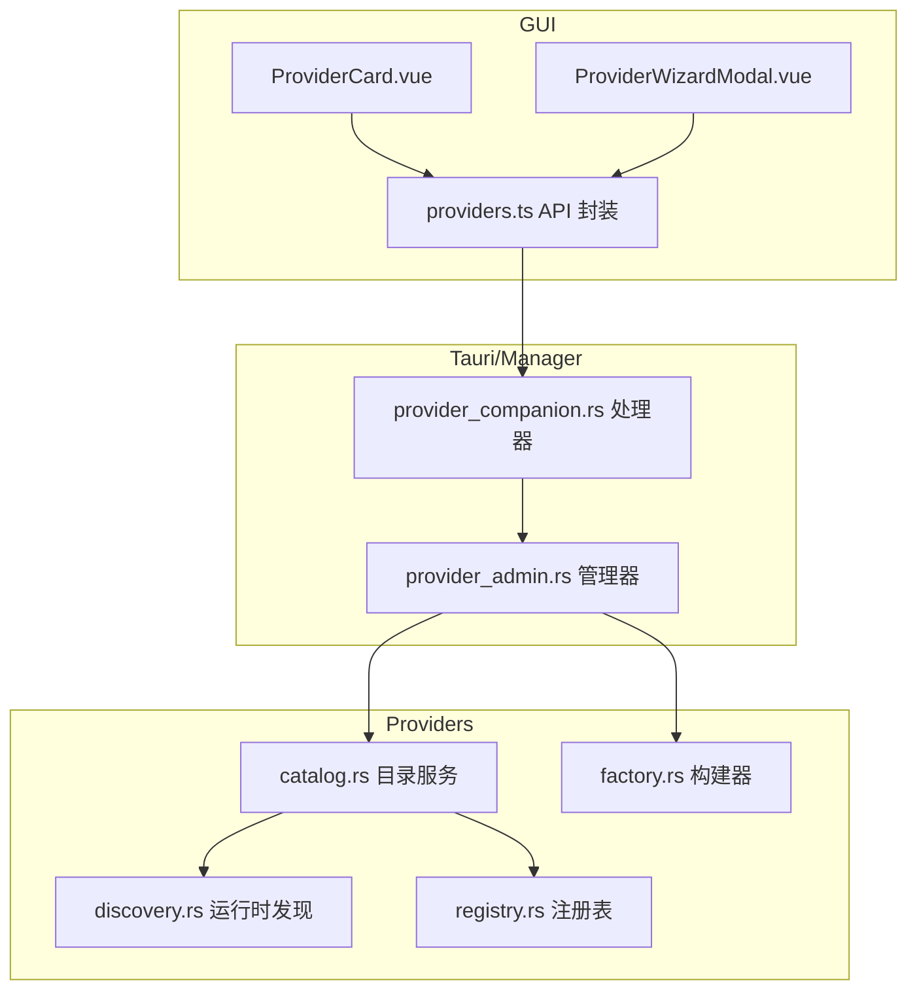
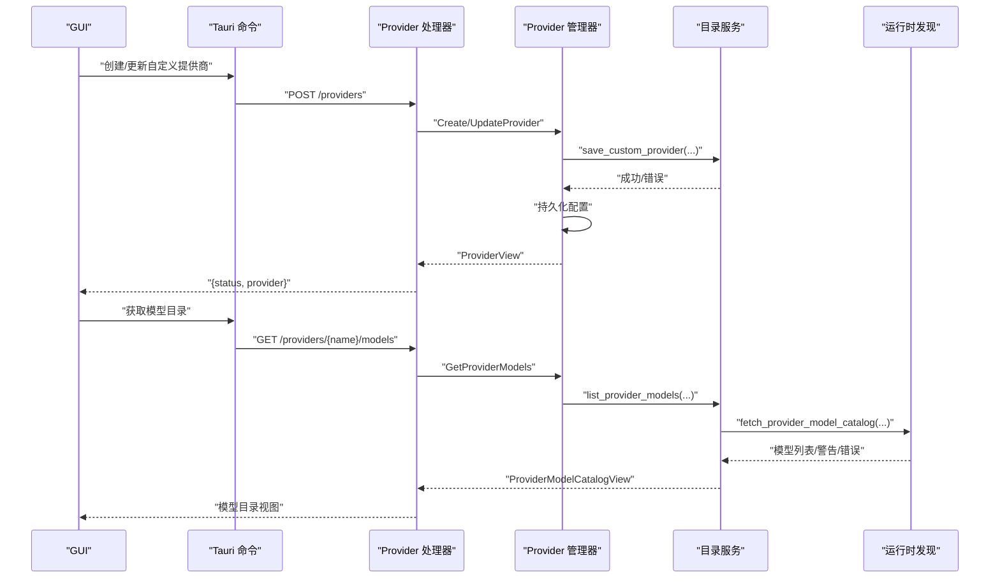
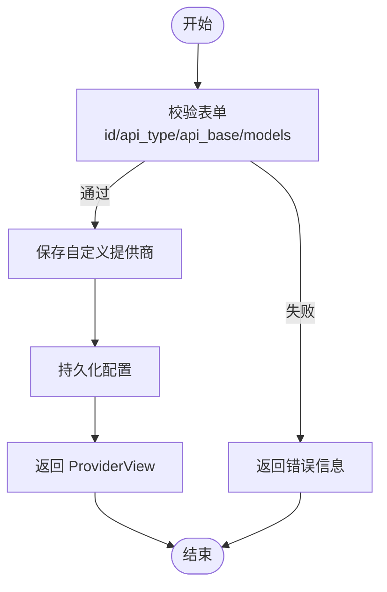
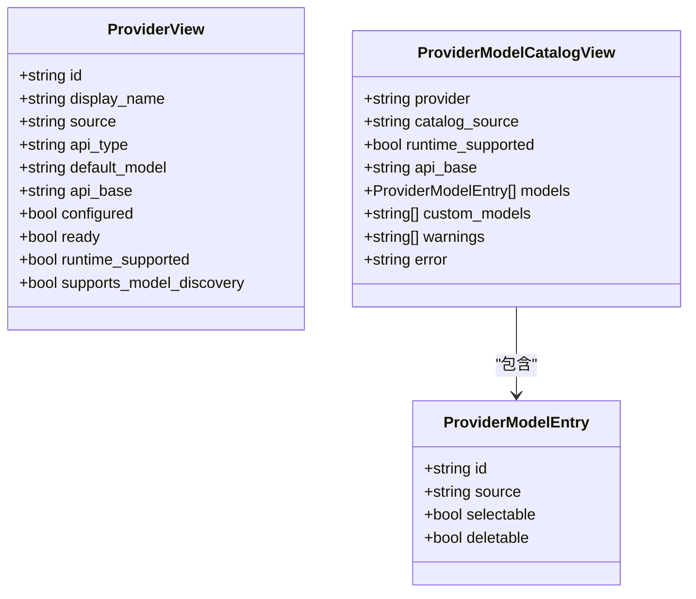
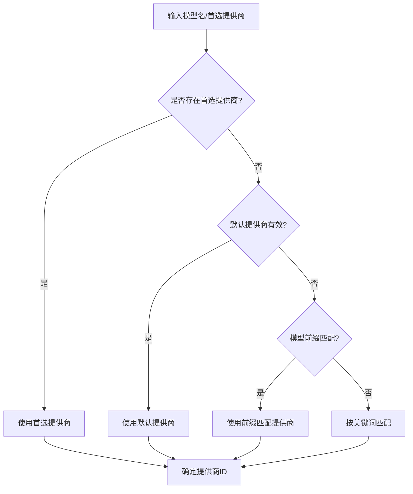
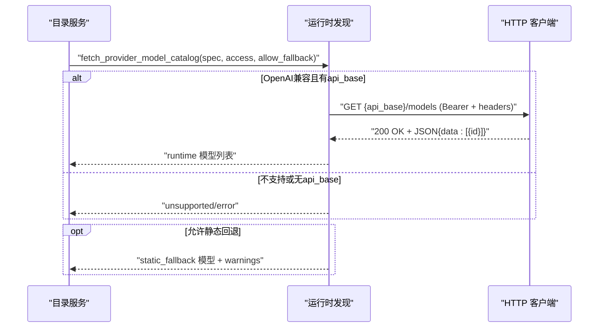
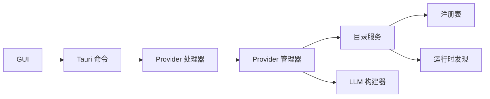

# 提供商管理

<cite>
**本文引用的文件**
- [agent-diva-manager/src/handlers/provider_companion.rs](file://agent-diva-manager/src/handlers/provider_companion.rs)
- [agent-diva-manager/src/manager/provider_admin.rs](file://agent-diva-manager/src/manager/provider_admin.rs)
- [agent-diva-providers/src/catalog.rs](file://agent-diva-providers/src/catalog.rs)
- [agent-diva-providers/src/discovery.rs](file://agent-diva-providers/src/discovery.rs)
- [agent-diva-providers/src/registry.rs](file://agent-diva-providers/src/registry.rs)
- [agent-diva-providers/src/factory.rs](file://agent-diva-providers/src/factory.rs)
- [agent-diva-gui/src/api/providers.ts](file://agent-diva-gui/src/api/providers.ts)
- [agent-diva-gui/src-tauri/src/app_state.rs](file://agent-diva-gui/src-tauri/src/app_state.rs)
- [agent-diva-gui/src-tauri/src/commands.rs](file://agent-diva-gui/src-tauri/src/commands.rs)
</cite>

## 目录
1. [简介](#简介)
2. [项目结构](#项目结构)
3. [核心组件](#核心组件)
4. [架构总览](#架构总览)
5. [详细组件分析](#详细组件分析)
6. [依赖关系分析](#依赖关系分析)
7. [性能与可靠性](#性能与可靠性)
8. [故障排查指南](#故障排查指南)
9. [结论](#结论)
10. [附录：接入示例与最佳实践](#附录：接入示例与最佳实践)

## 简介
本文件面向 Agent Diva 的“提供商管理系统”，聚焦提供商配置的完整生命周期（新增、编辑、测试、删除），提供商卡片的状态展示、连接测试与错误提示，提供商向导模态框的配置表单、字段校验与智能推荐，以及提供商发现机制、模型列表获取与配置模板系统。同时提供多种 LLM 服务提供商的接入指引（OpenAI、Anthropic、本地模型等）与安全、连接池、故障转移策略建议。

## 项目结构
提供商管理涉及三层协作：
- GUI 层：提供提供商卡片、向导模态框、模型目录与测试入口，调用 Tauri 命令。
- Tauri/Manager 层：暴露 HTTP/命令接口，编排 ProviderCatalogService 完成增删改查与模型目录聚合。
- Providers 层：统一注册表、目录服务、运行时模型发现与工厂构建。

**图表来源**
- [agent-diva-manager/src/handlers/provider_companion.rs:1-253](file://agent-diva-manager/src/handlers/provider_companion.rs#L1-L253)
- [agent-diva-manager/src/manager/provider_admin.rs:1-191](file://agent-diva-manager/src/manager/provider_admin.rs#L1-L191)
- [agent-diva-providers/src/catalog.rs:1-664](file://agent-diva-providers/src/catalog.rs#L1-L664)
- [agent-diva-providers/src/discovery.rs:1-464](file://agent-diva-providers/src/discovery.rs#L1-L464)
- [agent-diva-providers/src/registry.rs:1-95](file://agent-diva-providers/src/registry.rs#L1-L95)
- [agent-diva-providers/src/factory.rs:115-152](file://agent-diva-providers/src/factory.rs#L115-L152)
- [agent-diva-gui/src/api/providers.ts:1-94](file://agent-diva-gui/src/api/providers.ts#L1-L94)

**章节来源**
- [agent-diva-manager/src/handlers/provider_companion.rs:1-253](file://agent-diva-manager/src/handlers/provider_companion.rs#L1-L253)
- [agent-diva-manager/src/manager/provider_admin.rs:1-191](file://agent-diva-manager/src/manager/provider_admin.rs#L1-L191)
- [agent-diva-providers/src/catalog.rs:1-664](file://agent-diva-providers/src/catalog.rs#L1-L664)
- [agent-diva-providers/src/discovery.rs:1-464](file://agent-diva-providers/src/discovery.rs#L1-L464)
- [agent-diva-providers/src/registry.rs:1-95](file://agent-diva-providers/src/registry.rs#L1-L95)
- [agent-diva-providers/src/factory.rs:115-152](file://agent-diva-providers/src/factory.rs#L115-L152)
- [agent-diva-gui/src/api/providers.ts:1-94](file://agent-diva-gui/src/api/providers.ts#L1-L94)

## 核心组件
- 提供商目录服务（ProviderCatalogService）：统一列出提供商视图、合并模型目录、解析提供商 ID、保存/删除自定义提供商、添加/删除模型。
- 运行时模型发现（fetch_provider_model_catalog）：对 OpenAI 兼容端点发起 /models 请求，失败时回退到静态模型或返回不支持/错误信息。
- 提供商注册表（ProviderRegistry）：维护内建提供商元数据（名称、API 类型、默认模型、关键词等）。
- Manager 处理器与管理器：HTTP 路由与异步命令分发，持久化配置并返回统一视图。
- GUI API 封装：提供获取模型目录、测试模型、创建/删除自定义提供商等前端调用。

**章节来源**
- [agent-diva-providers/src/catalog.rs:1-664](file://agent-diva-providers/src/catalog.rs#L1-L664)
- [agent-diva-providers/src/discovery.rs:1-464](file://agent-diva-providers/src/discovery.rs#L1-L464)
- [agent-diva-providers/src/registry.rs:1-95](file://agent-diva-providers/src/registry.rs#L1-L95)
- [agent-diva-manager/src/handlers/provider_companion.rs:1-253](file://agent-diva-manager/src/handlers/provider_companion.rs#L1-L253)
- [agent-diva-manager/src/manager/provider_admin.rs:1-191](file://agent-diva-manager/src/manager/provider_admin.rs#L1-L191)
- [agent-diva-gui/src/api/providers.ts:1-94](file://agent-diva-gui/src/api/providers.ts#L1-L94)

## 架构总览
提供商管理的端到端流程如下：
- 新增/编辑自定义提供商：GUI 提交表单 → Tauri 命令 → Manager 处理器 → ProviderCatalogService 写入配置 → 持久化 → 返回统一视图。
- 获取模型目录：GUI 请求 → Manager → CatalogService → Discovery（运行时或静态回退）→ 合并自定义模型 → 返回视图。
- 测试连接：GUI 触发 → Tauri 命令构造临时访问凭据 → 构建 LLM 客户端 → 发送最小请求验证连通性 → 返回结果。

**图表来源**
- [agent-diva-manager/src/handlers/provider_companion.rs:164-229](file://agent-diva-manager/src/handlers/provider_companion.rs#L164-L229)
- [agent-diva-manager/src/manager/provider_admin.rs:130-189](file://agent-diva-manager/src/manager/provider_admin.rs#L130-L189)
- [agent-diva-providers/src/catalog.rs:161-193](file://agent-diva-providers/src/catalog.rs#L161-L193)
- [agent-diva-providers/src/discovery.rs:63-113](file://agent-diva-providers/src/discovery.rs#L63-L113)

## 详细组件分析

### 提供商配置生命周期（新增、编辑、测试、删除）
- 新增/编辑
  - 表单字段：id、display_name、api_type（当前仅支持 openai）、api_key、api_base、default_model、models、extra_headers。
  - 校验规则：id 非空且不为保留名；api_type 必须为 openai；api_base 去除尾部斜杠；models 去重。
  - 持久化：通过 ProviderCatalogService 写入 custom_providers，再保存配置。
- 删除
  - 从 custom_providers 移除；若被删除的是默认提供商，则回退到首个可用提供商并同步默认模型。
- 测试
  - 使用传入的 api_base 与 api_key 构建临时访问对象，构造 LLM 客户端发送最小请求以验证连通性与鉴权。

**图表来源**
- [agent-diva-providers/src/catalog.rs:239-276](file://agent-diva-providers/src/catalog.rs#L239-L276)
- [agent-diva-manager/src/manager/provider_admin.rs:130-189](file://agent-diva-manager/src/manager/provider_admin.rs#L130-L189)

**章节来源**
- [agent-diva-providers/src/catalog.rs:239-276](file://agent-diva-providers/src/catalog.rs#L239-L276)
- [agent-diva-manager/src/manager/provider_admin.rs:130-189](file://agent-diva-manager/src/manager/provider_admin.rs#L130-L189)
- [agent-diva-gui/src/api/providers.ts:78-94](file://agent-diva-gui/src/api/providers.ts#L78-L94)
- [agent-diva-gui/src-tauri/src/commands.rs:3582-3610](file://agent-diva-gui/src-tauri/src/commands.rs#L3582-L3610)

### 提供商卡片组件（状态展示、连接测试、错误提示）
- 状态展示
  - configured/ready：根据是否配置了 api_key 或 api_base 判定。
  - runtime_supported/supports_model_discovery：仅当 api_type=openai 且存在 api_base 时启用。
- 连接测试
  - 通过 Tauri 命令 test_provider_model，使用临时访问凭据构建 LLM 客户端执行最小请求，返回 ok/message/latency_ms。
- 错误提示
  - 模型目录获取失败时，返回 catalog_source=error 并携带 error/warnings；GUI 应展示可操作提示（如检查网络、密钥、端点）。

**图表来源**
- [agent-diva-providers/src/catalog.rs:24-57](file://agent-diva-providers/src/catalog.rs#L24-L57)

**章节来源**
- [agent-diva-providers/src/catalog.rs:326-387](file://agent-diva-providers/src/catalog.rs#L326-L387)
- [agent-diva-gui/src/api/providers.ts:3-18](file://agent-diva-gui/src/api/providers.ts#L3-L18)
- [agent-diva-gui/src-tauri/src/commands.rs:3582-3610](file://agent-diva-gui/src-tauri/src/commands.rs#L3582-L3610)

### 提供商向导模态框（配置表单、字段验证、智能推荐）
- 表单设计
  - 必填项：id、display_name、api_type（固定 openai）、api_key、api_base。
  - 可选：default_model、models、extra_headers。
- 字段验证
  - id 非空且非保留名；api_type 必须为 openai；api_base 清理尾斜杠；models 去重。
- 智能推荐
  - 基于 model 名称推断提供商：优先显式 preferred_provider，其次默认提供商，再次按模型前缀匹配，最后按注册表关键词匹配。
  - 模型目录自动拉取：对 OpenAI 兼容端点发起 /models 请求，失败时回退到静态模型或显示错误。

**图表来源**
- [agent-diva-providers/src/catalog.rs:111-145](file://agent-diva-providers/src/catalog.rs#L111-L145)
- [agent-diva-providers/src/registry.rs:91-95](file://agent-diva-providers/src/registry.rs#L91-L95)

**章节来源**
- [agent-diva-providers/src/catalog.rs:111-145](file://agent-diva-providers/src/catalog.rs#L111-L145)
- [agent-diva-providers/src/catalog.rs:239-276](file://agent-diva-providers/src/catalog.rs#L239-L276)
- [agent-diva-providers/src/registry.rs:1-95](file://agent-diva-providers/src/registry.rs#L1-L95)

### 提供商发现机制与模型列表获取
- 运行时发现
  - 仅对 ApiType=Openai 且存在 api_base 的提供商生效。
  - 请求 {api_base}/models，携带 Bearer Token 与额外头，解析 data[].id 去重后返回。
- 静态回退
  - 运行时失败时，若允许回退且 spec.models 非空，则返回静态模型并附带警告。
- 不支持/错误
  - 若不满足运行时条件或无法解析响应，返回 unsupported/error 并携带错误摘要。

**图表来源**
- [agent-diva-providers/src/discovery.rs:63-113](file://agent-diva-providers/src/discovery.rs#L63-L113)
- [agent-diva-providers/src/discovery.rs:179-246](file://agent-diva-providers/src/discovery.rs#L179-L246)

**章节来源**
- [agent-diva-providers/src/discovery.rs:63-113](file://agent-diva-providers/src/discovery.rs#L63-L113)
- [agent-diva-providers/src/discovery.rs:179-246](file://agent-diva-providers/src/discovery.rs#L179-L246)
- [agent-diva-providers/src/catalog.rs:161-193](file://agent-diva-providers/src/catalog.rs#L161-L193)

### 配置模板系统与提供商视图
- 提供商视图（ProviderView）
  - 区分内置/自定义来源，展示显示名、API 类型、默认模型、API Base、是否已配置/就绪、是否支持运行时发现。
- 模型条目（ProviderModelEntry）
  - 标记来源（runtime/static/custom）、是否可选/可删除。
- 模板化
  - 自定义提供商通过 CustomProviderUpsert 定义模板字段，保存时进行清洗与去重。

**章节来源**
- [agent-diva-providers/src/catalog.rs:24-69](file://agent-diva-providers/src/catalog.rs#L24-L69)
- [agent-diva-providers/src/catalog.rs:326-387](file://agent-diva-providers/src/catalog.rs#L326-L387)
- [agent-diva-providers/src/catalog.rs:239-276](file://agent-diva-providers/src/catalog.rs#L239-L276)

## 依赖关系分析
- GUI 依赖 Tauri 命令与 providers.ts 封装。
- Tauri 命令依赖 Manager 处理器与 ProviderCatalogService。
- ProviderCatalogService 依赖 ProviderRegistry（元数据）与 discovery（运行时发现）。
- Factory 用于构建具体 LLM 客户端（OpenAI/Anthropic/本地等）。

**图表来源**
- [agent-diva-gui/src/api/providers.ts:1-94](file://agent-diva-gui/src/api/providers.ts#L1-L94)
- [agent-diva-manager/src/handlers/provider_companion.rs:1-253](file://agent-diva-manager/src/handlers/provider_companion.rs#L1-L253)
- [agent-diva-manager/src/manager/provider_admin.rs:1-191](file://agent-diva-manager/src/manager/provider_admin.rs#L1-L191)
- [agent-diva-providers/src/catalog.rs:1-664](file://agent-diva-providers/src/catalog.rs#L1-L664)
- [agent-diva-providers/src/discovery.rs:1-464](file://agent-diva-providers/src/discovery.rs#L1-L464)
- [agent-diva-providers/src/registry.rs:1-95](file://agent-diva-providers/src/registry.rs#L1-L95)
- [agent-diva-providers/src/factory.rs:115-152](file://agent-diva-providers/src/factory.rs#L115-L152)

**章节来源**
- [agent-diva-gui/src/api/providers.ts:1-94](file://agent-diva-gui/src/api/providers.ts#L1-L94)
- [agent-diva-manager/src/handlers/provider_companion.rs:1-253](file://agent-diva-manager/src/handlers/provider_companion.rs#L1-L253)
- [agent-diva-manager/src/manager/provider_admin.rs:1-191](file://agent-diva-manager/src/manager/provider_admin.rs#L1-L191)
- [agent-diva-providers/src/catalog.rs:1-664](file://agent-diva-providers/src/catalog.rs#L1-L664)
- [agent-diva-providers/src/discovery.rs:1-464](file://agent-diva-providers/src/discovery.rs#L1-L464)
- [agent-diva-providers/src/registry.rs:1-95](file://agent-diva-providers/src/registry.rs#L1-L95)
- [agent-diva-providers/src/factory.rs:115-152](file://agent-diva-providers/src/factory.rs#L115-L152)

## 性能与可靠性
- 模型目录获取
  - 优先运行时发现，失败时回退到静态模型，避免阻塞 UI。
  - 对 /models 请求设置超时与错误摘要，减少长耗时与噪声日志。
- 连接测试
  - 使用最小请求验证连通性，降低开销；返回延迟指标便于前端提示。
- 配置持久化
  - 在增删改模型或提供商后统一持久化，确保一致性；删除默认提供商时自动回退。
- 并发与通道
  - 使用 oneshot 通道处理异步命令，避免阻塞主线程。

[本节为通用指导，不直接分析具体文件]

## 故障排查指南
- 模型目录为空或报错
  - 检查 catalog_source 是否为 error/unsupported；查看 warnings 与 error 字段。
  - 确认 api_base 是否正确、网络可达、鉴权通过。
- 连接测试失败
  - 核对 api_key 与 api_base；检查额外头是否必需；观察 latency_ms 与 message。
- 自定义提供商不可用
  - 确认 api_type 为 openai；id 非保留名；models 去重；保存成功后刷新视图。
- 默认提供商被删除
  - 系统会自动回退到首个可用提供商并调整默认模型；若仍异常，检查配置持久化。

**章节来源**
- [agent-diva-providers/src/discovery.rs:115-143](file://agent-diva-providers/src/discovery.rs#L115-L143)
- [agent-diva-manager/src/manager/provider_admin.rs:148-176](file://agent-diva-manager/src/manager/provider_admin.rs#L148-L176)
- [agent-diva-gui/src/api/providers.ts:3-18](file://agent-diva-gui/src/api/providers.ts#L3-L18)

## 结论
Agent Diva 的提供商管理系统通过统一的目录服务与运行时发现机制，实现了提供商配置的标准化生命周期管理与灵活的模型目录聚合。GUI 层提供了直观的状态展示、连接测试与向导配置，结合安全校验与回退策略，确保在多供应商场景下的稳定与易用。未来可在更多 API 类型与更丰富的发现策略上扩展，同时增强连接池与重试策略以提升鲁棒性。

[本节为总结，不直接分析具体文件]

## 附录：接入示例与最佳实践

### 接入指南概览
- OpenAI 兼容
  - 设置 api_type=openai，填写 api_base 与 api_key；启用运行时模型发现。
  - 示例：本地 Ollama 或第三方兼容网关。
- Anthropic
  - 通过内建提供商配置 api_key；当前自定义提供商仅支持 openai。
- 本地模型
  - 使用 OpenAI 兼容端点（如 vLLM、LocalAI）接入，配置 api_base 即可发现模型。

**章节来源**
- [agent-diva-providers/src/catalog.rs:239-276](file://agent-diva-providers/src/catalog.rs#L239-L276)
- [agent-diva-providers/src/discovery.rs:150-161](file://agent-diva-providers/src/discovery.rs#L150-L161)
- [agent-diva-providers/src/factory.rs:115-152](file://agent-diva-providers/src/factory.rs#L115-L152)

### API 密钥安全管理
- 密钥仅在需要时传递至后端，避免明文存储于前端。
- 使用 extra_headers 承载必要认证头；对敏感信息进行脱敏展示。
- 连接测试失败时，仅返回概要错误，不泄露密钥细节。

**章节来源**
- [agent-diva-providers/src/discovery.rs:36-61](file://agent-diva-providers/src/discovery.rs#L36-L61)
- [agent-diva-providers/src/discovery.rs:195-204](file://agent-diva-providers/src/discovery.rs#L195-L204)

### 连接池配置与故障转移策略
- 连接池
  - 为 HTTP 客户端设置合理超时与复用策略，减少握手开销。
- 故障转移
  - 运行时发现失败时回退到静态模型；必要时切换备用提供商或模型。
- 重试与熔断
  - 对关键请求增加重试与指数退避；对持续失败的提供商进行短期熔断。

[本节为通用指导，不直接分析具体文件]