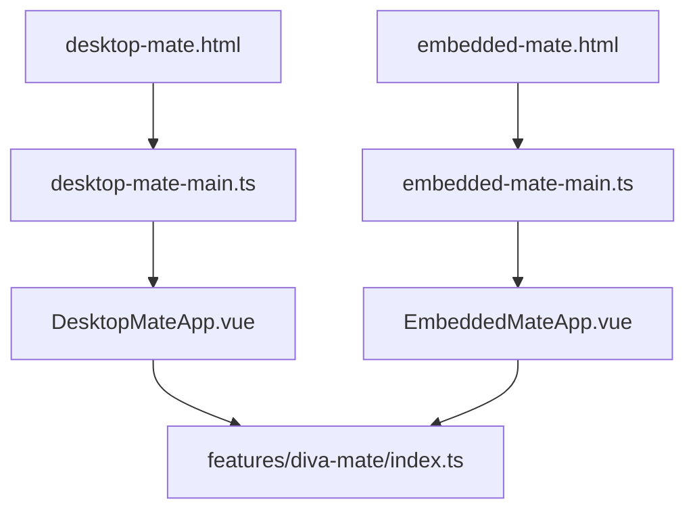
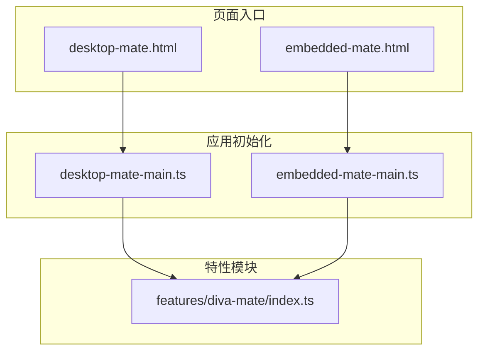
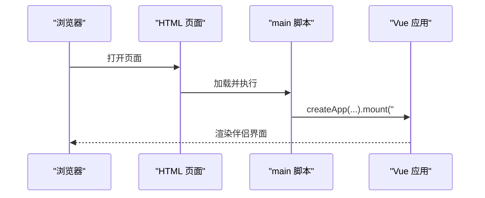
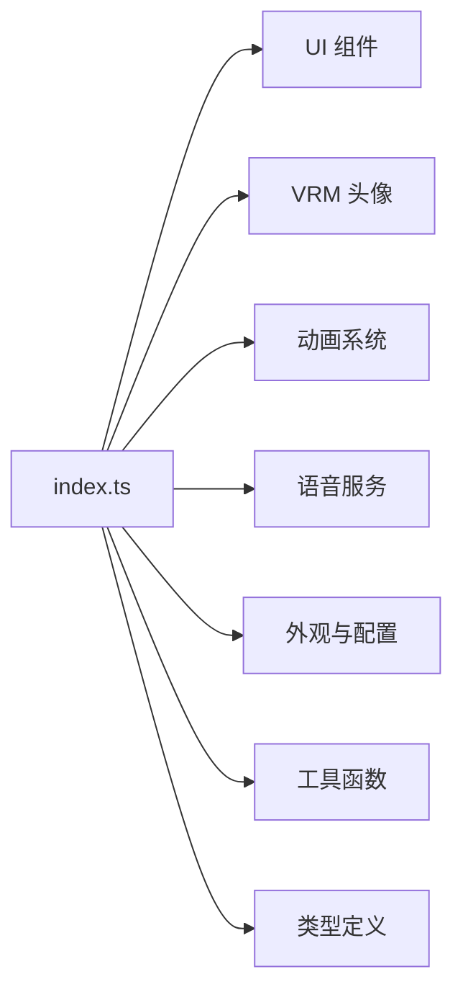
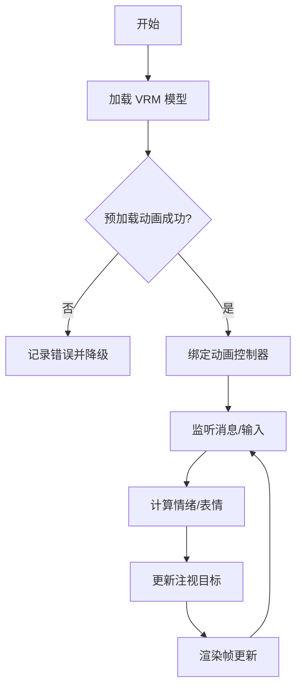
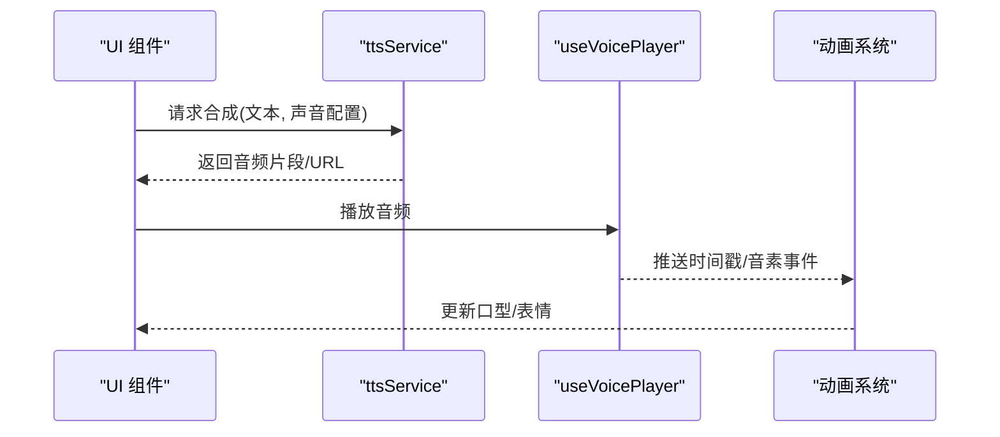
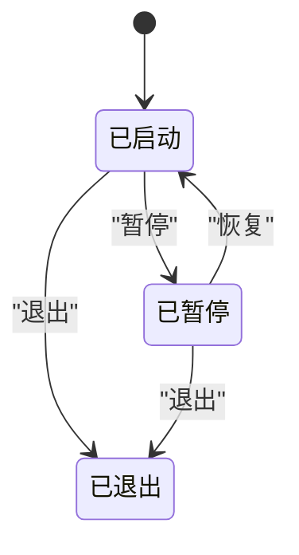
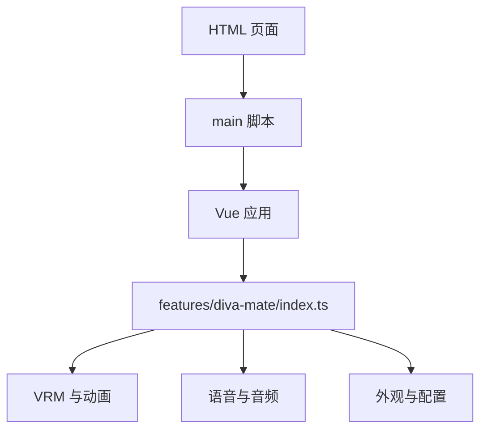

# 桌面伴侣

<cite>
**本文引用的文件**
- [desktop-mate.html](file://agent-diva-gui/desktop-mate.html)
- [embedded-mate.html](file://agent-diva-gui/embedded-mate.html)
- [desktop-mate-main.ts](file://agent-diva-gui/src/desktop-mate-main.ts)
- [embedded-mate-main.ts](file://agent-diva-gui/src/embedded-mate-main.ts)
- [index.ts](file://agent-diva-gui/src/features/diva-mate/index.ts)
</cite>

## 目录
1. [简介](#简介)
2. [项目结构](#项目结构)
3. [核心组件](#核心组件)
4. [架构总览](#架构总览)
5. [详细组件分析](#详细组件分析)
6. [依赖关系分析](#依赖关系分析)
7. [性能考虑](#性能考虑)
8. [故障排查指南](#故障排查指南)
9. [结论](#结论)
10. [附录](#附录)

## 简介
本文件为 Agent Diva 的“桌面伴侣”功能提供系统化技术文档，聚焦虚拟伴侣角色的视觉呈现、动画系统、交互行为、VRM 模型加载与表情管理、语音合成（TTS）集成、音频播放与音唇同步、外观与行为配置、模式启动/暂停/退出流程，以及性能优化与资源管理策略。读者可据此理解从入口页面到运行时渲染、动画控制、语音与配置的完整链路。

## 项目结构
桌面伴侣以独立 HTML 入口承载 Vue 应用，分别提供“桌面窗口模式”和“嵌入模式”。两个入口通过各自的 main 脚本挂载对应的根组件，并通过 features/diva-mate 的统一导出暴露 UI、动画、语音、配置等能力。

图表来源
- [desktop-mate.html:1-28](file://agent-diva-gui/desktop-mate.html#L1-L28)
- [embedded-mate.html:1-28](file://agent-diva-gui/embedded-mate.html#L1-L28)
- [desktop-mate-main.ts:1-7](file://agent-diva-gui/src/desktop-mate-main.ts#L1-L7)
- [embedded-mate-main.ts:1-6](file://agent-diva-gui/src/embedded-mate-main.ts#L1-L6)
- [index.ts:1-74](file://agent-diva-gui/src/features/diva-mate/index.ts#L1-L74)

章节来源
- [desktop-mate.html:1-28](file://agent-diva-gui/desktop-mate.html#L1-L28)
- [embedded-mate.html:1-28](file://agent-diva-gui/embedded-mate.html#L1-L28)
- [desktop-mate-main.ts:1-7](file://agent-diva-gui/src/desktop-mate-main.ts#L1-L7)
- [embedded-mate-main.ts:1-6](file://agent-diva-gui/src/embedded-mate-main.ts#L1-L6)
- [index.ts:1-74](file://agent-diva-gui/src/features/diva-mate/index.ts#L1-L74)

## 核心组件
- 入口与挂载
  - 桌面模式：HTML 引入 desktop-mate-main.ts，创建 Vue 应用并挂载 DesktopMateApp。
  - 嵌入模式：HTML 引入 embedded-mate-main.ts，创建 Vue 应用并挂载 EmbeddedMateApp。
- 统一能力导出
  - index.ts 集中导出 UI 面板、VRM 头像、动画系统、语音服务、外观与配置、情绪推导工具等，供上层组件按需使用。

章节来源
- [desktop-mate-main.ts:1-7](file://agent-diva-gui/src/desktop-mate-main.ts#L1-L7)
- [embedded-mate-main.ts:1-6](file://agent-diva-gui/src/embedded-mate-main.ts#L1-L6)
- [index.ts:1-74](file://agent-diva-gui/src/features/diva-mate/index.ts#L1-L74)

## 架构总览
桌面伴侣采用“入口页面 + Vue 应用 + 特性模块”的分层架构：
- 表现层：HTML 页面负责最小化容器样式；Vue 应用负责视图与交互。
- 特性层：features/diva-mate 提供 VRM 渲染、动画、表情、语音、配置等能力。
- 数据流：用户输入或外部事件触发 UI 更新 → 调用动画/语音/配置服务 → 驱动 VRM 模型与音频输出。

图表来源
- [desktop-mate.html:1-28](file://agent-diva-gui/desktop-mate.html#L1-L28)
- [embedded-mate.html:1-28](file://agent-diva-gui/embedded-mate.html#L1-L28)
- [desktop-mate-main.ts:1-7](file://agent-diva-gui/src/desktop-mate-main.ts#L1-L7)
- [embedded-mate-main.ts:1-6](file://agent-diva-gui/src/embedded-mate-main.ts#L1-L6)
- [index.ts:1-74](file://agent-diva-gui/src/features/diva-mate/index.ts#L1-L74)

## 详细组件分析

### 入口与挂载流程
- 桌面模式
  - HTML 定义透明背景与全屏容器，加载 desktop-mate-main.ts。
  - main 脚本创建 Vue 应用，挂载 i18n，并挂载 DesktopMateApp。
- 嵌入模式
  - HTML 定义透明背景与全屏容器，加载 embedded-mate-main.ts。
  - main 脚本创建 Vue 应用，挂载 EmbeddedMateApp。

图表来源
- [desktop-mate.html:1-28](file://agent-diva-gui/desktop-mate.html#L1-L28)
- [embedded-mate.html:1-28](file://agent-diva-gui/embedded-mate.html#L1-L28)
- [desktop-mate-main.ts:1-7](file://agent-diva-gui/src/desktop-mate-main.ts#L1-L7)
- [embedded-mate-main.ts:1-6](file://agent-diva-gui/src/embedded-mate-main.ts#L1-L6)

章节来源
- [desktop-mate.html:1-28](file://agent-diva-gui/desktop-mate.html#L1-L28)
- [embedded-mate.html:1-28](file://agent-diva-gui/embedded-mate.html#L1-L28)
- [desktop-mate-main.ts:1-7](file://agent-diva-gui/src/desktop-mate-main.ts#L1-L7)
- [embedded-mate-main.ts:1-6](file://agent-diva-gui/src/embedded-mate-main.ts#L1-L6)

### 特性模块能力总览
index.ts 作为特性模块的统一出口，提供以下能力：
- 组件：DivaMateView、DivaMateModelManager、DivaVrmAvatar、DesktopMateApp、DesktopMateOverlay、VrmAnimationPanel、VrmAppearancePanel、DivaMateVoicePanel
- 语音：useVoicePlayer、useVoiceInput、ttsService 及类型定义
- 配置：useMateConfig、getMateConfigSnapshot、useAppearanceConfig、generateAppearanceId、createEmptyAppearance
- 动画：IdleAnimationManager、ProceduralIdleGenerator、useVrmAnimation、preloadVRMAAnimations、LookAtController、useLookAt 及相关类型
- 工具：scanVRMAnimations、buildKnownMotionInfo、deriveMoodFromMessages、deriveMoodFromText、normalizeMood
- 类型：MateConfig、VrmMood、VrmModelInfo、VrmLoadState、VrmMotionInfo、VrmAppearanceConfig、VrmLookAtTarget 等

图表来源
- [index.ts:1-74](file://agent-diva-gui/src/features/diva-mate/index.ts#L1-L74)

章节来源
- [index.ts:1-74](file://agent-diva-gui/src/features/diva-mate/index.ts#L1-L74)

### VRM 模型加载与表情管理
- 模型加载
  - 通过 DivaVrmAvatar 组件与 DivaMateModelManager 管理 VRM 模型的加载状态与生命周期。
  - 使用 useVrmAnimation 与 preloadVRMAAnimations 进行动画资源的预加载与绑定。
- 表情与情绪
  - 通过 deriveMoodFromMessages / deriveMoodFromText / normalizeMood 将消息文本映射为情绪值，驱动表情切换。
  - LookAtController 与 useLookAt 实现注视与视线追踪，增强角色互动感。
- 动画系统
  - IdleAnimationManager 管理待机动画，ProceduralIdleGenerator 生成程序化待机动作。
  - scanVRMAnimations 与 buildKnownMotionInfo 扫描并构建已知动画元信息，便于 UI 选择与调度。

图表来源
- [index.ts:1-74](file://agent-diva-gui/src/features/diva-mate/index.ts#L1-L74)

章节来源
- [index.ts:1-74](file://agent-diva-gui/src/features/diva-mate/index.ts#L1-L74)

### 语音合成（TTS）、音频播放与音唇同步
- TTS 服务
  - ttsService 提供统一的语音合成接口，支持多种声音配置与提供者抽象。
  - useVoicePlayer 与 useVoiceInput 封装音频播放与输入能力。
- 音唇同步
  - 结合动画系统与音频时长，按时间轴驱动口型与表情变化，确保语音与视觉一致。
- 配置与个性化
  - 通过 TTSVoiceConfig 等类型定义声音偏好，配合外观与行为配置实现个性化体验。

图表来源
- [index.ts:1-74](file://agent-diva-gui/src/features/diva-mate/index.ts#L1-L74)

章节来源
- [index.ts:1-74](file://agent-diva-gui/src/features/diva-mate/index.ts#L1-L74)

### 外观定制、行为设置与个性化选项
- 外观配置
  - useAppearanceConfig、generateAppearanceId、createEmptyAppearance 提供外观配置的读取、生成与默认值。
  - VrmAppearancePanel 用于可视化调整外观参数。
- 行为设置
  - MateConfig 与相关类型定义行为开关与偏好，如待机动画、注视灵敏度、情绪阈值等。
  - VrmAnimationPanel 用于选择与管理动画组合。
- 个性化
  - 通过 TTSVoiceConfig 与情绪推导工具，实现基于对话内容的自适应表现。

章节来源
- [index.ts:1-74](file://agent-diva-gui/src/features/diva-mate/index.ts#L1-L74)

### 伴侣模式的启动、暂停与退出流程
- 启动
  - 打开对应 HTML 页面，main 脚本创建并挂载 Vue 应用，初始化 VRM、动画与语音子系统。
- 暂停
  - 暂停动画循环与音频播放，冻结表情与注视更新，释放部分资源占用。
- 退出
  - 清理动画与音频资源，卸载 VRM 场景，关闭监听与定时器，确保内存回收。

[此图为概念性流程图，不直接映射具体源码文件]

## 依赖关系分析
- 入口依赖
  - HTML 页面依赖 main 脚本；main 脚本依赖 Vue 与特性模块。
- 特性模块内部依赖
  - index.ts 聚合导出各子模块能力，形成松耦合的插件式结构。
- 外部依赖
  - VRM 渲染与动画库、音频 API、i18n 国际化等由上层组件与运行时环境提供。

图表来源
- [desktop-mate.html:1-28](file://agent-diva-gui/desktop-mate.html#L1-L28)
- [embedded-mate.html:1-28](file://agent-diva-gui/embedded-mate.html#L1-L28)
- [desktop-mate-main.ts:1-7](file://agent-diva-gui/src/desktop-mate-main.ts#L1-L7)
- [embedded-mate-main.ts:1-6](file://agent-diva-gui/src/embedded-mate-main.ts#L1-L6)
- [index.ts:1-74](file://agent-diva-gui/src/features/diva-mate/index.ts#L1-L74)

章节来源
- [desktop-mate.html:1-28](file://agent-diva-gui/desktop-mate.html#L1-L28)
- [embedded-mate.html:1-28](file://agent-diva-gui/embedded-mate.html#L1-L28)
- [desktop-mate-main.ts:1-7](file://agent-diva-gui/src/desktop-mate-main.ts#L1-L7)
- [embedded-mate-main.ts:1-6](file://agent-diva-gui/src/embedded-mate-main.ts#L1-L6)
- [index.ts:1-74](file://agent-diva-gui/src/features/diva-mate/index.ts#L1-L74)

## 性能考虑
- 资源预加载
  - 使用 preloadVRMAAnimations 提前加载常用动画，减少首帧卡顿。
- 动画与表情节流
  - 对表情与注视更新进行频率限制，避免每帧重算导致 CPU 抖动。
- 音频播放优化
  - 复用音频实例，避免频繁创建销毁；合理设置缓冲与解码策略。
- 内存管理
  - 在暂停/退出时主动释放 VRM 场景、动画与音频资源，防止内存泄漏。
- 降级策略
  - 当动画或 TTS 不可用时，回退至基础表情与静音模式，保证可用性。

[本节为通用性能建议，不直接引用具体源码文件]

## 故障排查指南
- 页面无法加载
  - 检查 HTML 中 main 脚本路径是否正确，控制台是否有模块加载错误。
- VRM 模型未显示
  - 确认模型路径与权限，查看动画预加载是否成功，必要时启用降级模式。
- 语音无声或不同步
  - 检查 TTS 服务配置与音频播放权限，确认音素事件是否按时推送至动画系统。
- 内存增长异常
  - 在暂停/退出时验证资源释放逻辑，关注 VRM 场景与音频实例的销毁。

[本节为通用排错建议，不直接引用具体源码文件]

## 结论
桌面伴侣通过清晰的入口与模块化设计，将 VRM 渲染、动画控制、表情管理、语音合成与配置系统有机整合，提供了可扩展且高性能的虚拟伴侣体验。借助统一的导出接口与完善的生命周期管理，开发者可快速集成与定制外观、行为与交互细节，同时保障资源与内存的高效利用。

## 附录
- 关键能力索引
  - 组件：DivaMateView、DivaMateModelManager、DivaVrmAvatar、DesktopMateApp、DesktopMateOverlay、VrmAnimationPanel、VrmAppearancePanel、DivaMateVoicePanel
  - 语音：useVoicePlayer、useVoiceInput、ttsService
  - 配置：useMateConfig、getMateConfigSnapshot、useAppearanceConfig、generateAppearanceId、createEmptyAppearance
  - 动画：IdleAnimationManager、ProceduralIdleGenerator、useVrmAnimation、preloadVRMAAnimations、LookAtController、useLookAt
  - 工具：scanVRMAnimations、buildKnownMotionInfo、deriveMoodFromMessages、deriveMoodFromText、normalizeMood
  - 类型：MateConfig、VrmMood、VrmModelInfo、VrmLoadState、VrmMotionInfo、VrmAppearanceConfig、VrmLookAtTarget

章节来源
- [index.ts:1-74](file://agent-diva-gui/src/features/diva-mate/index.ts#L1-L74)