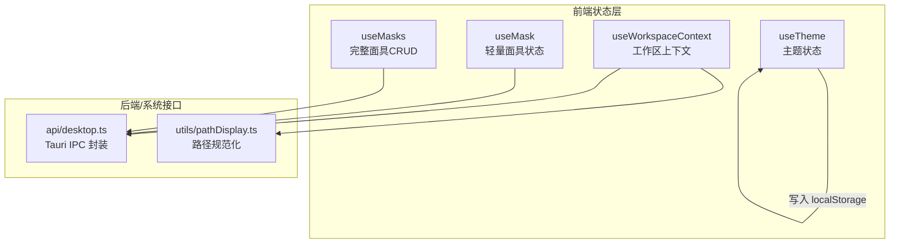
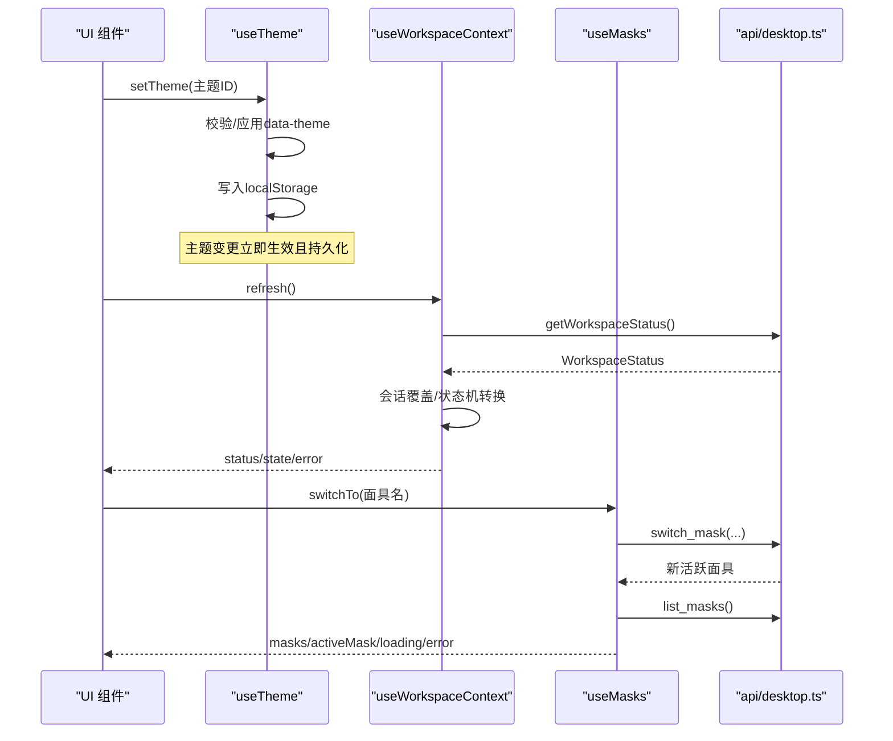
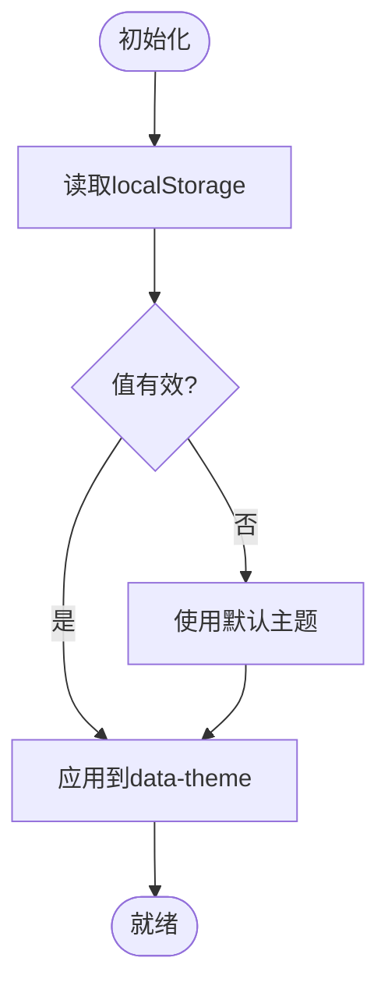
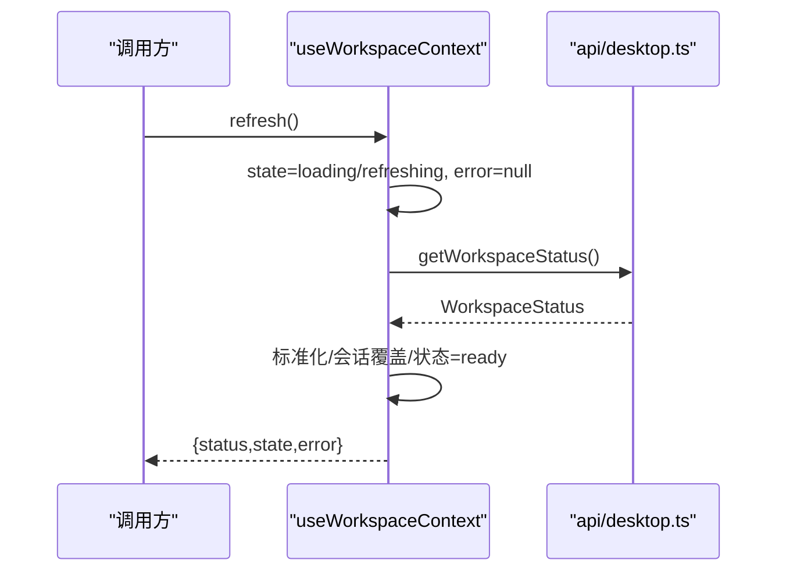
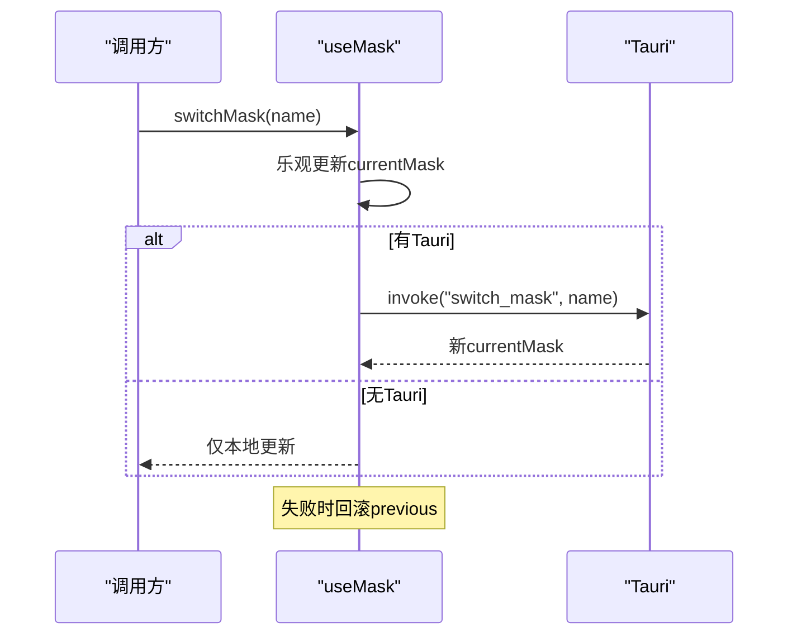
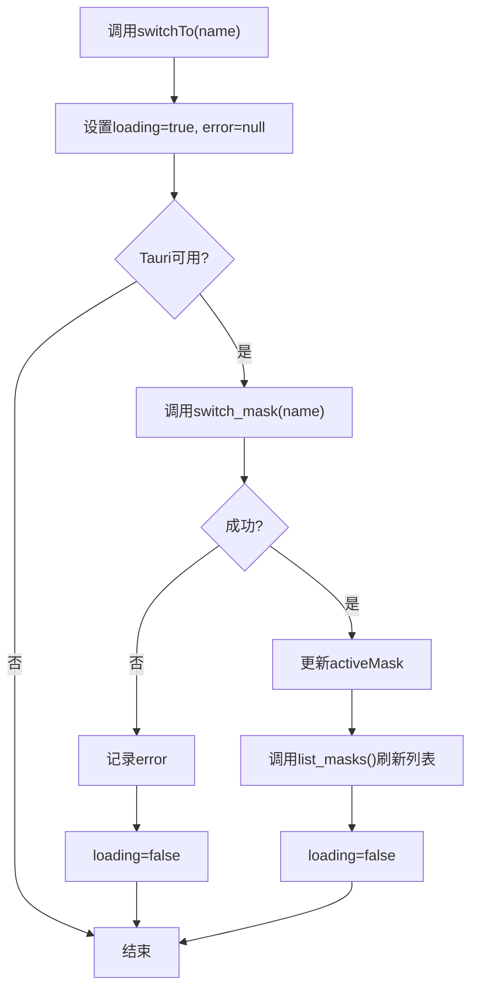
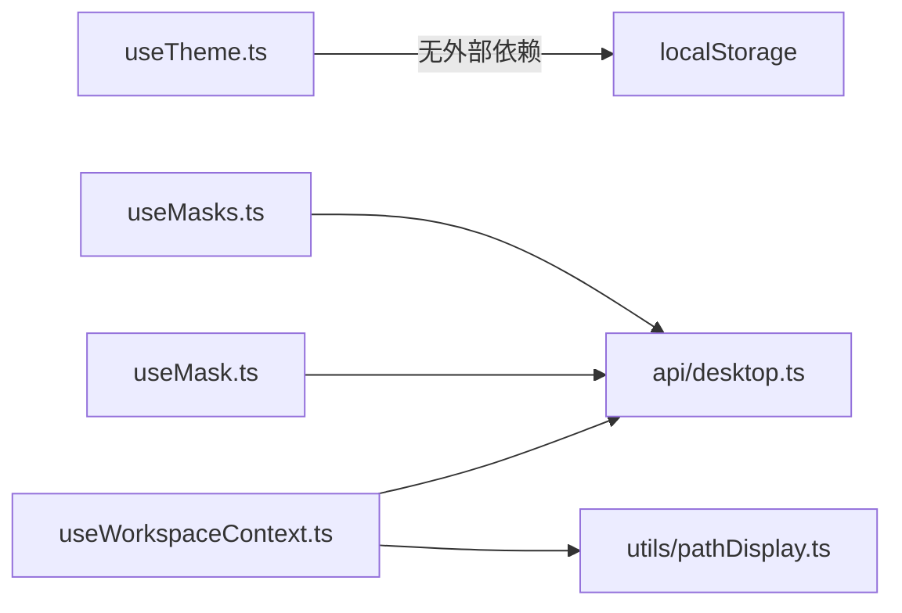

# 状态管理

<cite>
**本文引用的文件**
- [useTheme.ts](file://agent-diva-gui/src/composables/useTheme.ts)
- [useWorkspaceContext.ts](file://agent-diva-gui/src/composables/useWorkspaceContext.ts)
- [useMask.ts](file://agent-diva-gui/src/composables/useMask.ts)
- [useMasks.ts](file://agent-diva-gui/src/composables/useMasks.ts)
- [desktop.ts](file://agent-diva-gui/src/api/desktop.ts)
- [pathDisplay.ts](file://agent-diva-gui/src/utils/pathDisplay.ts)
</cite>

## 目录
1. [简介](#简介)
2. [项目结构](#项目结构)
3. [核心组件](#核心组件)
4. [架构总览](#架构总览)
5. [详细组件分析](#详细组件分析)
6. [依赖关系分析](#依赖关系分析)
7. [性能考虑](#性能考虑)
8. [故障排查指南](#故障排查指南)
9. [结论](#结论)
10. [附录](#附录)

## 简介
本文件为 Agent Diva 前端状态管理系统的权威文档，聚焦基于 Vue 3 组合式 API 的状态管理模式。内容覆盖主题状态、工作区上下文、面具选择等核心状态的实现与交互；阐述状态持久化策略（localStorage）、本地存储管理与数据同步机制；解释响应式更新、副作用处理与性能优化；提供调试、日志与错误追踪方案；并给出最佳实践、测试策略、重构指导以及状态迁移、版本兼容性与备份恢复建议。

## 项目结构
Agent Diva 的前端状态管理集中在 composables 目录中，采用“模块级单例 + 组合式函数”的模式：
- 主题状态：useTheme.ts
- 工作区上下文：useWorkspaceContext.ts
- 面具状态（轻量）：useMask.ts
- 面具状态（完整 CRUD）：useMasks.ts
- 与 Tauri 后端的桥接：api/desktop.ts
- 路径显示工具：utils/pathDisplay.ts

图表来源
- [useTheme.ts:1-46](file://agent-diva-gui/src/composables/useTheme.ts#L1-L46)
- [useWorkspaceContext.ts:1-94](file://agent-diva-gui/src/composables/useWorkspaceContext.ts#L1-L94)
- [useMask.ts:1-142](file://agent-diva-gui/src/composables/useMask.ts#L1-L142)
- [useMasks.ts:1-154](file://agent-diva-gui/src/composables/useMasks.ts#L1-L154)
- [desktop.ts](file://agent-diva-gui/src/api/desktop.ts)
- [pathDisplay.ts](file://agent-diva-gui/src/utils/pathDisplay.ts)

章节来源
- [useTheme.ts:1-46](file://agent-diva-gui/src/composables/useTheme.ts#L1-L46)
- [useWorkspaceContext.ts:1-94](file://agent-diva-gui/src/composables/useWorkspaceContext.ts#L1-L94)
- [useMask.ts:1-142](file://agent-diva-gui/src/composables/useMask.ts#L1-L142)
- [useMasks.ts:1-154](file://agent-diva-gui/src/composables/useMasks.ts#L1-L154)

## 核心组件
- 主题状态 useTheme
  - 职责：维护当前主题、应用 data-theme 属性、持久化到 localStorage。
  - 关键点：只读暴露主题值；设置时校验合法主题 ID；在不可用环境（如测试/SSR）安全降级。
  - 持久化：使用固定键名存储主题 ID，读取失败或类型不匹配回退默认主题。

- 工作区上下文 useWorkspaceContext
  - 职责：获取并缓存工作区状态（根路径、是否默认工作区等），管理加载/刷新/就绪/错误状态。
  - 关键点：会话覆盖（sessionOverrideRoot）用于保留用户显式选择的意图；标准化路径比较避免大小写/分隔符差异导致的误判；并发刷新通过 generation 防竞态。
  - 非 Tauri 环境：直接标记 ready，避免阻塞 UI。

- 面具状态 useMask（轻量）
  - 职责：维护当前激活的面具与可用面具列表，支持切换。
  - 关键点：在无 Tauri 时使用模拟数据；切换时乐观更新并在失败时回滚；提供便捷计算属性。

- 面具状态 useMasks（完整）
  - 职责：提供面具列表与活跃面具的完整生命周期管理（刷新、切换、创建、删除）。
  - 关键点：通过 api/desktop.ts 调用 Tauri 命令；并发请求（Promise.all）提升加载性能；统一 loading/error 状态管理。

章节来源
- [useTheme.ts:1-46](file://agent-diva-gui/src/composables/useTheme.ts#L1-L46)
- [useWorkspaceContext.ts:1-94](file://agent-diva-gui/src/composables/useWorkspaceContext.ts#L1-L94)
- [useMask.ts:1-142](file://agent-diva-gui/src/composables/useMask.ts#L1-L142)
- [useMasks.ts:1-154](file://agent-diva-gui/src/composables/useMasks.ts#L1-L154)

## 架构总览
前端状态管理遵循“单一职责 + 模块级单例”的组合式模式：
- 每个 composable 维护自身状态（ref/shallowRef），并通过返回方法对外暴露变更入口。
- 与后端通信统一通过 api/desktop.ts 的 Tauri 封装，保证跨环境一致性。
- 视图通过订阅组合式返回值获得响应式更新；副作用（如 DOM 属性修改、localStorage 读写）在组合式内部集中处理。

图表来源
- [useTheme.ts:1-46](file://agent-diva-gui/src/composables/useTheme.ts#L1-L46)
- [useWorkspaceContext.ts:1-94](file://agent-diva-gui/src/composables/useWorkspaceContext.ts#L1-L94)
- [useMasks.ts:1-154](file://agent-diva-gui/src/composables/useMasks.ts#L1-L154)
- [desktop.ts](file://agent-diva-gui/src/api/desktop.ts)

## 详细组件分析

### 主题状态（useTheme）
- 状态设计
  - 主题 ID 枚举与校验，确保仅允许受控的主题集合。
  - 使用 ref 保存当前主题，readonly 暴露给组件，防止外部直接篡改。
- 副作用处理
  - 应用 data-theme 到 documentElement，驱动样式切换。
  - 写入 localStorage 进行持久化；捕获异常以兼容测试/SSR 等受限环境。
- 初始化流程
  - 启动时从 localStorage 读取，若无效则回退默认主题。

图表来源
- [useTheme.ts:1-46](file://agent-diva-gui/src/composables/useTheme.ts#L1-L46)

章节来源
- [useTheme.ts:1-46](file://agent-diva-gui/src/composables/useTheme.ts#L1-L46)

### 工作区上下文（useWorkspaceContext）
- 状态设计
  - 使用 shallowRef 降低开销，分别维护 status、state、error 与 sessionOverrideRoot。
  - 状态机：idle → loading/refreshing → ready/error。
- 关键逻辑
  - 路径标准化与比较：统一大小写与分隔符，避免平台差异导致误判。
  - 会话覆盖：当显式 CLI 选择工作区时，强制标记为非默认工作区，避免后续刷新覆盖用户意图。
  - 并发安全：refreshGeneration 防止旧请求覆盖新结果。
- 非 Tauri 环境：直接就绪，避免阻塞。

图表来源
- [useWorkspaceContext.ts:1-94](file://agent-diva-gui/src/composables/useWorkspaceContext.ts#L1-L94)
- [desktop.ts](file://agent-diva-gui/src/api/desktop.ts)
- [pathDisplay.ts](file://agent-diva-gui/src/utils/pathDisplay.ts)

章节来源
- [useWorkspaceContext.ts:1-94](file://agent-diva-gui/src/composables/useWorkspaceContext.ts#L1-L94)

### 面具状态（useMask）
- 状态设计
  - 模块级 currentMask、masks、loaded；computed 提供便捷属性。
  - 无 Tauri 时使用模拟数据，便于开发与测试。
- 切换流程
  - 乐观更新 currentMask，随后调用后端；失败时回滚至 previous。
  - 提供 loadMasks 与 switchMask 两个主要入口。

图表来源
- [useMask.ts:1-142](file://agent-diva-gui/src/composables/useMask.ts#L1-L142)

章节来源
- [useMask.ts:1-142](file://agent-diva-gui/src/composables/useMask.ts#L1-L142)

### 面具状态（useMasks）
- 状态设计
  - 模块级 masks、activeMask、loading、error；统一生命周期管理。
- 操作语义
  - refresh：并行获取列表与活跃面具，减少往返。
  - switchTo：成功后刷新列表以同步活跃指示。
  - create/remove：成功后触发 refresh，保持数据一致。
- 错误处理
  - 统一捕获并记录错误信息，loading 在 finally 中关闭。

图表来源
- [useMasks.ts:1-154](file://agent-diva-gui/src/composables/useMasks.ts#L1-L154)

章节来源
- [useMasks.ts:1-154](file://agent-diva-gui/src/composables/useMasks.ts#L1-L154)

## 依赖关系分析
- 组件内聚性
  - 每个 composable 自包含状态与副作用，职责清晰，耦合度低。
- 外部依赖
  - 与 Tauri 的通信集中在 api/desktop.ts，便于替换或 Mock。
  - 路径处理统一由 utils/pathDisplay.ts 提供，避免重复实现。
- 潜在循环依赖
  - 当前结构未发现循环引用；composables 之间相互独立，通过各自 API 被组件消费。

图表来源
- [useTheme.ts:1-46](file://agent-diva-gui/src/composables/useTheme.ts#L1-L46)
- [useWorkspaceContext.ts:1-94](file://agent-diva-gui/src/composables/useWorkspaceContext.ts#L1-L94)
- [useMask.ts:1-142](file://agent-diva-gui/src/composables/useMask.ts#L1-L142)
- [useMasks.ts:1-154](file://agent-diva-gui/src/composables/useMasks.ts#L1-L154)
- [desktop.ts](file://agent-diva-gui/src/api/desktop.ts)
- [pathDisplay.ts](file://agent-diva-gui/src/utils/pathDisplay.ts)

章节来源
- [useWorkspaceContext.ts:1-94](file://agent-diva-gui/src/composables/useWorkspaceContext.ts#L1-L94)
- [useMasks.ts:1-154](file://agent-diva-gui/src/composables/useMasks.ts#L1-L154)

## 性能考虑
- 响应式优化
  - 使用 shallowRef 减少深层响应式开销（工作区上下文）。
  - computed 派生常用字段（面具图标/名称），避免重复计算。
- 网络与 I/O
  - 并发请求：useMasks.refresh 使用 Promise.all 同时拉取列表与活跃面具。
  - 防竞态：useWorkspaceContext.refresh 使用 generation 编号丢弃过期响应。
- 存储访问
  - 主题持久化使用 try/catch 包裹 localStorage 写入，避免异常影响主流程。
- 渲染优化
  - 将主题设置为只读，减少不必要的重渲染；仅在 setTheme 时变更。

[本节为通用性能建议，无需特定文件引用]

## 故障排查指南
- 主题无法持久化
  - 现象：刷新后主题未保留。
  - 排查：检查 localStorage 是否可用；确认主题 ID 是否在受控集合内；查看 setTheme 中的异常捕获分支。
  - 参考：[useTheme.ts:1-46](file://agent-diva-gui/src/composables/useTheme.ts#L1-L46)

- 工作区状态卡在 loading
  - 现象：界面一直显示加载中。
  - 排查：确认 isTauriRuntime 判断；检查 getWorkspaceStatus 是否抛出异常；验证 refreshGeneration 是否被正确递增。
  - 参考：[useWorkspaceContext.ts:1-94](file://agent-diva-gui/src/composables/useWorkspaceContext.ts#L1-L94)

- 面具切换失败
  - 现象：切换后 UI 回滚或报错。
  - 排查：确认 Tauri 命令是否存在；检查 switchMask 的乐观更新与回滚逻辑；查看 error 状态。
  - 参考：[useMask.ts:1-142](file://agent-diva-gui/src/composables/useMask.ts#L1-L142)、[useMasks.ts:1-154](file://agent-diva-gui/src/composables/useMasks.ts#L1-L154)

- 路径不一致导致工作区识别错误
  - 现象：同一工作区在不同平台被识别为不同根。
  - 排查：检查 normalizeWorkspaceRoot 的路径标准化逻辑；确认大小写与分隔符处理。
  - 参考：[useWorkspaceContext.ts:1-94](file://agent-diva-gui/src/composables/useWorkspaceContext.ts#L1-L94)、[pathDisplay.ts](file://agent-diva-gui/src/utils/pathDisplay.ts)

章节来源
- [useTheme.ts:1-46](file://agent-diva-gui/src/composables/useTheme.ts#L1-L46)
- [useWorkspaceContext.ts:1-94](file://agent-diva-gui/src/composables/useWorkspaceContext.ts#L1-L94)
- [useMask.ts:1-142](file://agent-diva-gui/src/composables/useMask.ts#L1-L142)
- [useMasks.ts:1-154](file://agent-diva-gui/src/composables/useMasks.ts#L1-L154)

## 结论
Agent Diva 的前端状态管理采用简洁而稳健的组合式模式：每个领域状态由独立的 composable 管理，职责清晰、副作用集中、易于测试与维护。通过会话覆盖、并发安全、路径标准化与乐观更新等机制，系统在多环境与多平台下具备良好鲁棒性。结合 localStorage 持久化与统一的错误处理，提供了良好的用户体验与可观测性。

[本节为总结性内容，无需特定文件引用]

## 附录

### 状态调试与日志
- 建议在每个 composable 的关键路径添加结构化日志（如进入/退出、错误堆栈、状态变更前后快照），便于定位问题。
- 可在开发模式下启用更详细的日志级别，生产环境关闭或降级。

[本节为通用建议，无需特定文件引用]

### 测试策略
- 单元测试
  - 对 useTheme 的持久化与校验逻辑进行断言。
  - 对 useWorkspaceContext 的路径标准化与会话覆盖逻辑进行边界测试。
  - 对 useMasks 的并发请求与错误处理进行 Mock 测试。
- 集成测试
  - 使用 vitest 的 Tauri Mock 能力，验证与后端命令的交互。
- 回归测试
  - 针对状态迁移与版本兼容性编写用例，确保向后兼容。

[本节为通用建议，无需特定文件引用]

### 重构指导
- 将共享常量（如 STORAGE_KEY、THEME_IDS）抽取到配置模块，便于统一管理。
- 将 Tauri 调用进一步抽象为服务层，便于替换与扩展。
- 引入统一的错误类型与日志门面，提升可维护性。

[本节为通用建议，无需特定文件引用]

### 状态迁移、版本兼容性与备份恢复
- 版本兼容
  - 在读取 localStorage 时进行版本检测与降级策略，避免旧格式导致崩溃。
  - 对主题 ID 集合进行白名单校验，新增主题需向后兼容。
- 数据备份与恢复
  - 提供导出/导入功能，将主题与工作区上下文等关键状态序列化为 JSON 文件。
  - 恢复时进行数据校验与冲突解决（如覆盖/合并策略）。
- 迁移脚本
  - 针对重大变更（如工作区根路径格式变化）提供迁移脚本，自动升级旧数据。

[本节为通用建议，无需特定文件引用]