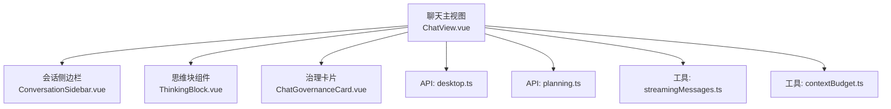
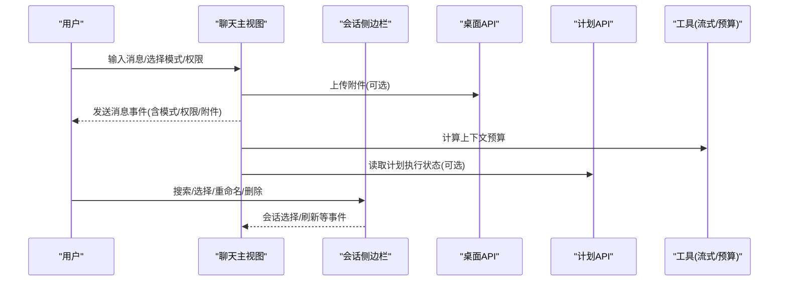
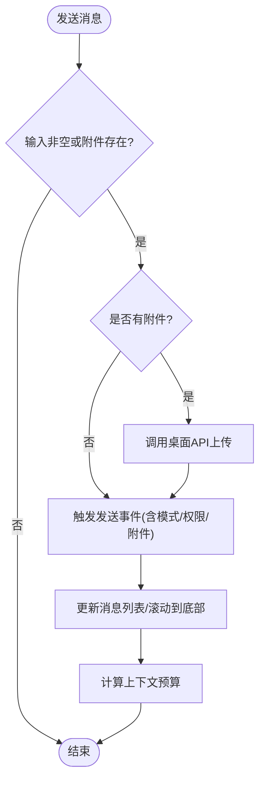
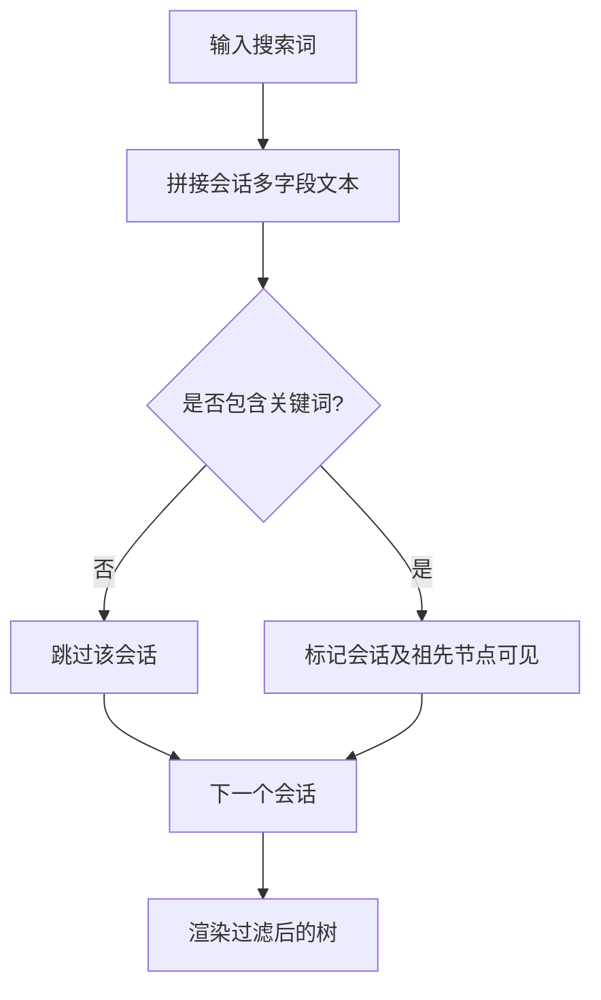
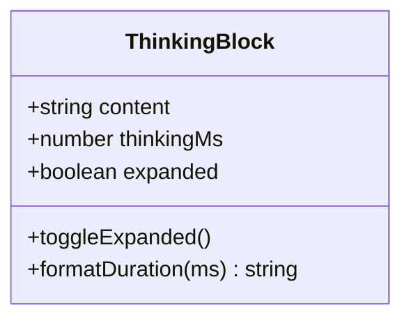
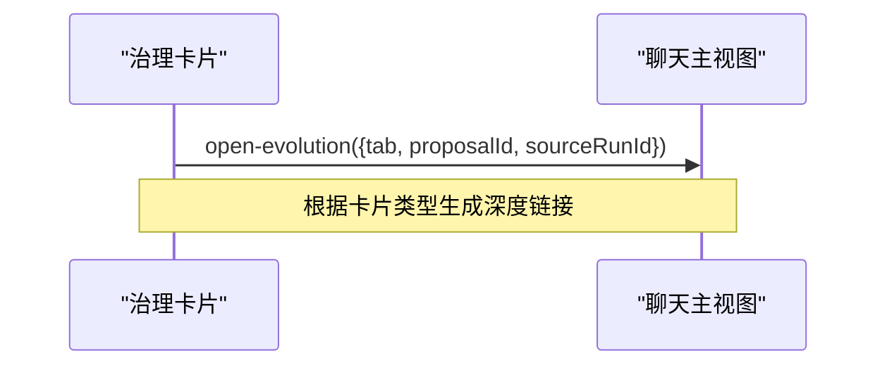
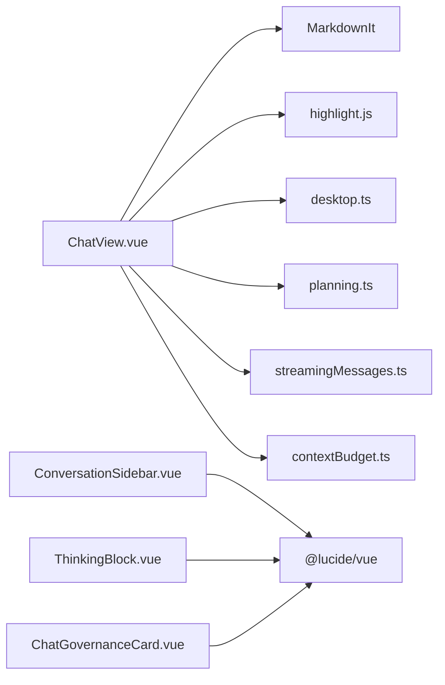

# 聊天界面系统

<cite>
**本文引用的文件**
- [ChatView.vue](file://agent-diva-gui/src/components/ChatView.vue)
- [ConversationSidebar.vue](file://agent-diva-gui/src/components/ConversationSidebar.vue)
- [ThinkingBlock.vue](file://agent-diva-gui/src/components/chat/ThinkingBlock.vue)
- [ChatGovernanceCard.vue](file://agent-diva-gui/src/components/chat/ChatGovernanceCard.vue)
- [desktop.ts](file://agent-diva-gui/src/api/desktop.ts)
- [planning.ts](file://agent-diva-gui/src/api/planning.ts)
- [streamingMessages.ts](file://agent-diva-gui/src/utils/streamingMessages.ts)
- [contextBudget.ts](file://agent-diva-gui/src/utils/contextBudget.ts)
</cite>

## 目录
1. [简介](#简介)
2. [项目结构](#项目结构)
3. [核心组件](#核心组件)
4. [架构总览](#架构总览)
5. [详细组件分析](#详细组件分析)
6. [依赖关系分析](#依赖关系分析)
7. [性能考量](#性能考量)
8. [故障排查指南](#故障排查指南)
9. [结论](#结论)
10. [附录](#附录)

## 简介
本文件为 Agent Diva 聊天界面系统的技术文档，聚焦于聊天主界面的设计与实现，涵盖消息渲染、流式响应处理、思考过程可视化、会话侧边栏的消息历史管理（搜索过滤与快速导航）、思维块组件的展开收起与交互、治理卡片在对话中的权限控制与审批展示、消息格式支持（Markdown 与多媒体）、以及用户交互优化（键盘快捷键与无障碍访问）等关键能力。

## 项目结构
聊天界面位于前端 GUI 工程内，核心由以下模块构成：
- 聊天主视图：负责消息列表渲染、输入区、模式切换、附件上传、滚动跟随、上下文预算指示等。
- 会话侧边栏：提供会话树形组织、搜索过滤、重命名、置顶、删除、刷新等操作。
- 思维块组件：用于可视化“思考过程”，支持展开/收起与时长显示。
- 治理卡片：用于在对话中展示自治运行或技能请求的状态与元信息，并引导进入治理详情。
- API 层：封装桌面端调用（如文件上传、自动运行触发），以及与计划执行相关的状态读取。
- 工具函数：流式消息处理、上下文预算计算等。

**图表来源**
- [ChatView.vue:1-800](file://agent-diva-gui/src/components/ChatView.vue#L1-L800)
- [ConversationSidebar.vue:1-800](file://agent-diva-gui/src/components/ConversationSidebar.vue#L1-L800)
- [ThinkingBlock.vue:1-272](file://agent-diva-gui/src/components/chat/ThinkingBlock.vue#L1-L272)
- [ChatGovernanceCard.vue:1-306](file://agent-diva-gui/src/components/chat/ChatGovernanceCard.vue#L1-L306)
- [desktop.ts](file://agent-diva-gui/src/api/desktop.ts)
- [planning.ts](file://agent-diva-gui/src/api/planning.ts)
- [streamingMessages.ts](file://agent-diva-gui/src/utils/streamingMessages.ts)
- [contextBudget.ts](file://agent-diva-gui/src/utils/contextBudget.ts)

**章节来源**
- [ChatView.vue:1-800](file://agent-diva-gui/src/components/ChatView.vue#L1-L800)
- [ConversationSidebar.vue:1-800](file://agent-diva-gui/src/components/ConversationSidebar.vue#L1-L800)

## 核心组件
- 聊天主视图（ChatView.vue）
  - 消息模型：统一 Message 类型，包含角色、内容、思考文本、流式标记、工具调用元数据、附件等。
  - Markdown 渲染：使用 MarkdownIt + highlight.js，禁用 HTML 防 XSS，代码高亮采用 GitHub Dark 主题。
  - 流式响应：通过 isStreaming/isThinking/toolStatus 等字段驱动 UI 更新；结合滚动跟随策略保持最新可见。
  - 上下文预算：基于 contextBudget 工具计算历史长度与预算压力，动态展示环形进度条。
  - 模式与权限：支持 agent/plan/ask 三种执行模式，以及 cautious/smart/trusted 权限模式选择，持久化到本地存储。
  - 附件上传：支持文件选择与粘贴图片上传，调用桌面端 API 完成上传并加入发送队列。
  - 清理模式：可折叠无交互的工具链与空 agent 消息，提升长对话可读性。
- 会话侧边栏（ConversationSidebar.vue）
  - 会话树：按工作区 -> 频道 -> 根/子会话层级组织，支持折叠/展开。
  - 搜索过滤：对标题、最后消息、片段、分支标签、频道、类型、路径等多字段联合检索，并高亮祖先节点。
  - 快捷操作：新建会话、重命名、置顶/取消置顶、删除、刷新列表。
  - 时间显示：相对时间格式化，便于快速定位最近会话。
- 思维块组件（ThinkingBlock.vue）
  - 展开/收起：头部按钮与右侧展开按钮双重控制，支持受控与非受控两种模式。
  - 过渡动画：高度自适应过渡，避免抖动。
  - 时长显示：将思考耗时以毫秒/秒为单位展示。
- 治理卡片（ChatGovernanceCard.vue）
  - 两类卡片：自治运行（autodream_run）与技能请求（skill_request）。
  - 状态语义：运行中/成功/失败/不可用，提案待审/过期/拒绝/通过等。
  - 深度链接：点击后打开治理面板对应 Tab，携带 proposalId/sourceRunId 等参数。

**章节来源**
- [ChatView.vue:1-800](file://agent-diva-gui/src/components/ChatView.vue#L1-L800)
- [ConversationSidebar.vue:1-800](file://agent-diva-gui/src/components/ConversationSidebar.vue#L1-L800)
- [ThinkingBlock.vue:1-272](file://agent-diva-gui/src/components/chat/ThinkingBlock.vue#L1-L272)
- [ChatGovernanceCard.vue:1-306](file://agent-diva-gui/src/components/chat/ChatGovernanceCard.vue#L1-L306)

## 架构总览
聊天主视图作为协调中心，聚合消息渲染、输入交互、模式/权限选择、附件上传、上下文预算、治理卡片与思维块等子功能，并通过事件向上冒泡至父级容器。侧边栏独立维护会话树与搜索状态，通过事件与主视图通信。

**图表来源**
- [ChatView.vue:1-800](file://agent-diva-gui/src/components/ChatView.vue#L1-L800)
- [ConversationSidebar.vue:1-800](file://agent-diva-gui/src/components/ConversationSidebar.vue#L1-L800)
- [desktop.ts](file://agent-diva-gui/src/api/desktop.ts)
- [planning.ts](file://agent-diva-gui/src/api/planning.ts)
- [streamingMessages.ts](file://agent-diva-gui/src/utils/streamingMessages.ts)
- [contextBudget.ts](file://agent-diva-gui/src/utils/contextBudget.ts)

## 详细组件分析

### 聊天主视图（ChatView.vue）
- 消息渲染与 Markdown
  - 使用 MarkdownIt 配置 linkify/breaks，关闭 HTML 输出防止 XSS。
  - 代码块通过 highlight.js 进行语法高亮，未知语言回退为纯文本转义。
- 流式响应与思考过程
  - 通过 isStreaming/isThinking/toolStatus 等字段驱动 UI 状态。
  - 思考过程以 ThinkingBlock 组件呈现，支持展开/收起与时长显示。
  - 工具调用结果支持引用解析（artifact 预览、截断提示、摘要）。
- 上下文预算可视化
  - 基于 contextBudget 工具计算历史估计与预算上限，展示百分比与颜色变化。
- 输入与附件
  - 支持 Enter 发送、Shift+Enter 换行；自动调整输入框高度。
  - 文件选择与粘贴图片上传，调用桌面端 API 完成二进制上传。
- 模式与权限
  - 执行模式：agent/plan/ask，影响占位符与行为。
  - 权限模式：cautious/smart/trusted，持久化到 localStorage。
- 清理模式
  - 折叠无交互的工具链与空 agent 消息，仅保留活跃态的推理与工具名。
- 滚动跟随
  - 监听滚动位置，默认跟随最新消息；当用户上滚时暂停跟随。

**图表来源**
- [ChatView.vue:423-441](file://agent-diva-gui/src/components/ChatView.vue#L423-L441)
- [ChatView.vue:462-505](file://agent-diva-gui/src/components/ChatView.vue#L462-L505)
- [ChatView.vue:308-329](file://agent-diva-gui/src/components/ChatView.vue#L308-L329)

**章节来源**
- [ChatView.vue:1-800](file://agent-diva-gui/src/components/ChatView.vue#L1-L800)

### 会话侧边栏（ConversationSidebar.vue）
- 会话树构建
  - 按 workspace_id/channel 分组，再按 parent_session_key 构建树形结构。
  - 支持折叠/展开工作区、频道与会话节点。
- 搜索过滤
  - 多字段联合匹配（标题、最后消息、片段、分支标签、频道、类型、路径）。
  - 匹配到的会话及其祖先节点均可见，便于理解上下文。
- 交互操作
  - 右键菜单：重命名、置顶/取消置顶、删除。
  - 键盘支持：Enter 确认重命名，Esc 取消。
- 时间与状态
  - 相对时间显示，状态图标区分运行/完成/错误。

**图表来源**
- [ConversationSidebar.vue:130-162](file://agent-diva-gui/src/components/ConversationSidebar.vue#L130-L162)
- [ConversationSidebar.vue:164-241](file://agent-diva-gui/src/components/ConversationSidebar.vue#L164-L241)

**章节来源**
- [ConversationSidebar.vue:1-800](file://agent-diva-gui/src/components/ConversationSidebar.vue#L1-L800)

### 思维块组件（ThinkingBlock.vue）
- 展开/收起
  - 支持受控（props.expanded）与非受控（内部 state）两种模式。
  - 头部按钮与右侧展开按钮均可切换状态。
- 过渡动画
  - 使用 Vue Transition 配合高度测量，实现平滑展开/收起。
- 时长显示
  - 将思考耗时转换为 ms 或 s 单位展示。

**图表来源**
- [ThinkingBlock.vue:57-84](file://agent-diva-gui/src/components/chat/ThinkingBlock.vue#L57-L84)
- [ThinkingBlock.vue:86-106](file://agent-diva-gui/src/components/chat/ThinkingBlock.vue#L86-L106)

**章节来源**
- [ThinkingBlock.vue:1-272](file://agent-diva-gui/src/components/chat/ThinkingBlock.vue#L1-L272)

### 治理卡片（ChatGovernanceCard.vue）
- 卡片类型
  - autodream_run：展示运行状态、触发方式、提案数量等。
  - skill_request：展示提案摘要、类型、目标、证据数量等。
- 状态语义
  - 运行中/成功/失败/不可用；提案待审/过期/拒绝/通过。
- 深度链接
  - 点击按钮打开治理面板，携带 tab、proposalId、sourceRunId 等参数。

**图表来源**
- [ChatGovernanceCard.vue:50-77](file://agent-diva-gui/src/components/chat/ChatGovernanceCard.vue#L50-L77)

**章节来源**
- [ChatGovernanceCard.vue:1-306](file://agent-diva-gui/src/components/chat/ChatGovernanceCard.vue#L1-L306)

## 依赖关系分析
- ChatView.vue 依赖：
  - MarkdownIt + highlight.js：用于 Markdown 渲染与代码高亮。
  - desktop.ts：文件上传、自动运行触发等桌面端能力。
  - planning.ts：读取计划执行状态，用于模式切换与进度展示。
  - streamingMessages.ts：流式消息处理逻辑（若使用）。
  - contextBudget.ts：上下文预算计算。
- ConversationSidebar.vue 依赖：
  - 无外部库依赖，主要使用 Vue 响应式与 Lucide 图标。
- ThinkingBlock.vue 与 ChatGovernanceCard.vue：
  - 纯 UI 组件，依赖 Vue 与图标库，逻辑简单清晰。

**图表来源**
- [ChatView.vue:1-800](file://agent-diva-gui/src/components/ChatView.vue#L1-L800)
- [ConversationSidebar.vue:1-800](file://agent-diva-gui/src/components/ConversationSidebar.vue#L1-L800)
- [ThinkingBlock.vue:1-272](file://agent-diva-gui/src/components/chat/ThinkingBlock.vue#L1-L272)
- [ChatGovernanceCard.vue:1-306](file://agent-diva-gui/src/components/chat/ChatGovernanceCard.vue#L1-L306)

**章节来源**
- [ChatView.vue:1-800](file://agent-diva-gui/src/components/ChatView.vue#L1-L800)
- [ConversationSidebar.vue:1-800](file://agent-diva-gui/src/components/ConversationSidebar.vue#L1-L800)

## 性能考量
- 渲染优化
  - 使用缓存 Map 对卡片解析结果进行缓存，减少重复解析开销。
  - 清理模式折叠无交互的工具链与空消息，降低 DOM 体积。
- 滚动性能
  - 仅在接近底部时自动滚动，避免频繁重排。
- 流式更新
  - 通过细粒度字段（isStreaming/isThinking/toolStatus）控制局部更新，减少整屏重绘。
- 预算计算
  - 基于工具函数计算上下文预算，避免在主循环中进行昂贵计算。

[本节为通用指导，不直接分析具体文件]

## 故障排查指南
- 附件上传失败
  - 检查桌面端 API 调用是否成功，捕获异常并提示用户。
  - 参考路径：[ChatView.vue:462-505](file://agent-diva-gui/src/components/ChatView.vue#L462-L505)
- 流式响应卡顿
  - 检查 isStreaming 标志是否正确设置与清除，确保滚动跟随逻辑不被阻塞。
  - 参考路径：[ChatView.vue:367-400](file://agent-diva-gui/src/components/ChatView.vue#L367-L400)
- 上下文预算异常
  - 核对 toolsConfig.budget 传入值与计算逻辑，确认历史长度估算合理。
  - 参考路径：[ChatView.vue:308-329](file://agent-diva-gui/src/components/ChatView.vue#L308-L329)
- 搜索无结果
  - 检查搜索字段拼接与大小写处理，确认祖先节点可见逻辑正确。
  - 参考路径：[ConversationSidebar.vue:130-162](file://agent-diva-gui/src/components/ConversationSidebar.vue#L130-L162)
- 治理卡片无法跳转
  - 确认 open-evolution 事件已正确发出，且父级容器能处理深度链接。
  - 参考路径：[ChatGovernanceCard.vue:50-77](file://agent-diva-gui/src/components/chat/ChatGovernanceCard.vue#L50-L77)

**章节来源**
- [ChatView.vue:462-505](file://agent-diva-gui/src/components/ChatView.vue#L462-L505)
- [ChatView.vue:367-400](file://agent-diva-gui/src/components/ChatView.vue#L367-L400)
- [ChatView.vue:308-329](file://agent-diva-gui/src/components/ChatView.vue#L308-L329)
- [ConversationSidebar.vue:130-162](file://agent-diva-gui/src/components/ConversationSidebar.vue#L130-L162)
- [ChatGovernanceCard.vue:50-77](file://agent-diva-gui/src/components/chat/ChatGovernanceCard.vue#L50-L77)

## 结论
Agent Diva 聊天界面系统以 ChatView 为核心，整合了消息渲染、流式响应、思考过程可视化、治理卡片与上下文预算等关键能力；会话侧边栏提供了高效的会话管理与搜索体验。整体设计注重可读性与性能，同时兼顾用户交互优化与无障碍访问。后续可进一步扩展多媒体内容展示、更丰富的交互卡片与更精细的权限控制。

[本节为总结性内容，不直接分析具体文件]

## 附录
- 消息格式支持
  - Markdown：启用 linkify 与 breaks，禁用 HTML 防 XSS。
  - 代码高亮：基于 highlight.js，支持常见语言。
  - 多媒体：通过附件上传与预览（artifact 引用）实现。
- 用户交互优化
  - 键盘快捷键：Enter 发送，Shift+Enter 换行；重命名支持 Enter/Esc。
  - 无障碍：aria-expanded、aria-controls 等属性用于思维块与交互元素。
- 流式响应处理
  - 通过 isStreaming/isThinking/toolStatus 等字段驱动 UI，结合滚动跟随保证最新可见。
- 权限控制与审批展示
  - 治理卡片展示自治运行与技能请求状态，并提供深度链接进入治理面板。

[本节为补充说明，不直接分析具体文件]