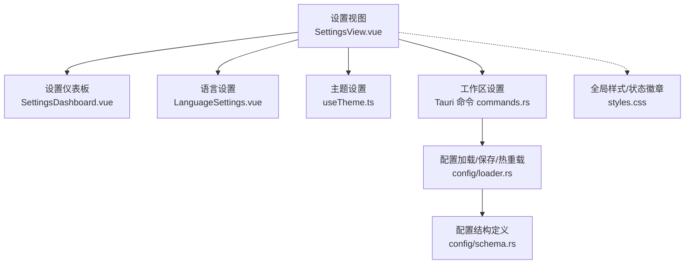
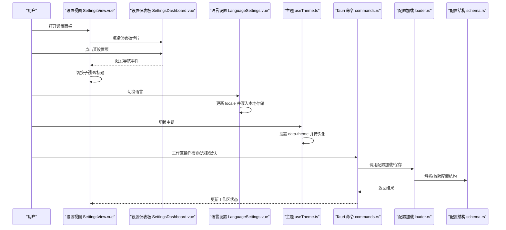
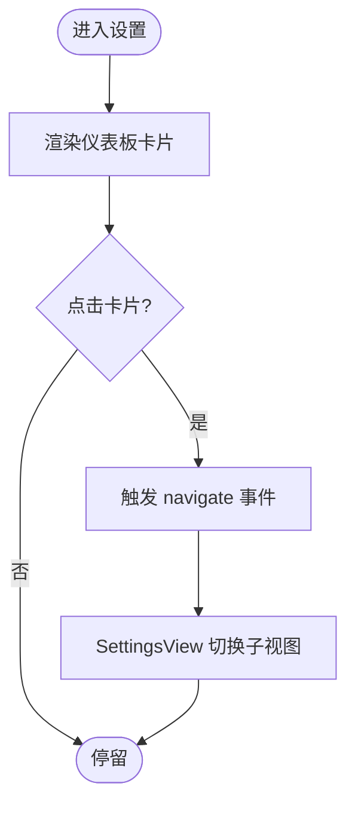
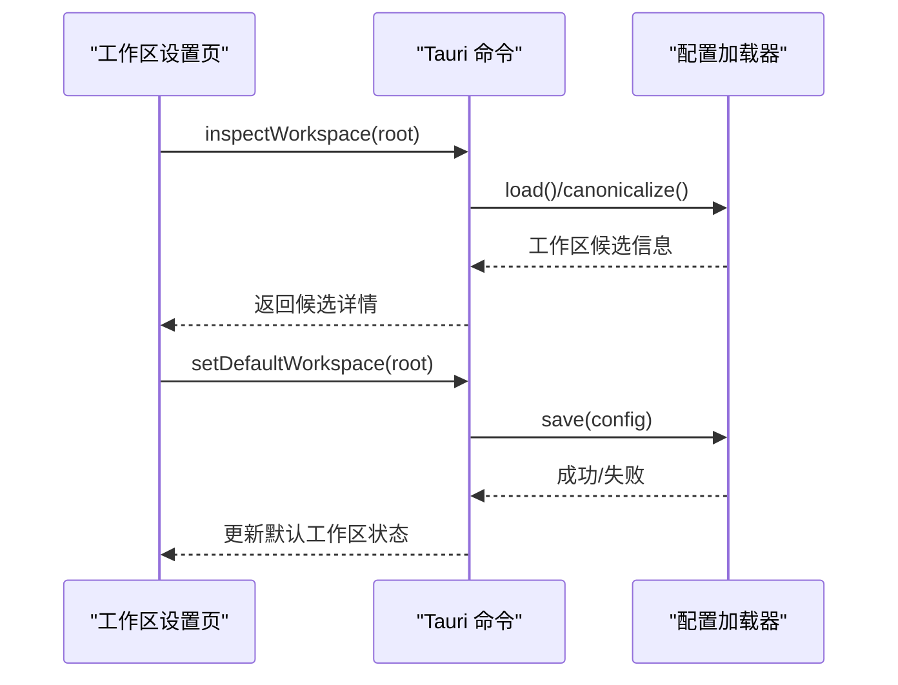
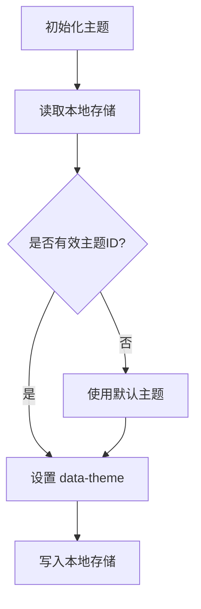
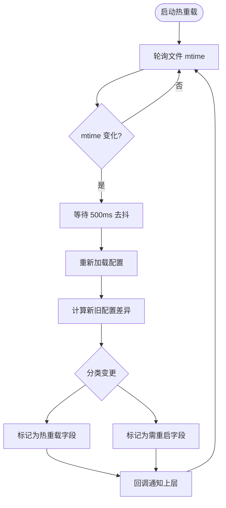
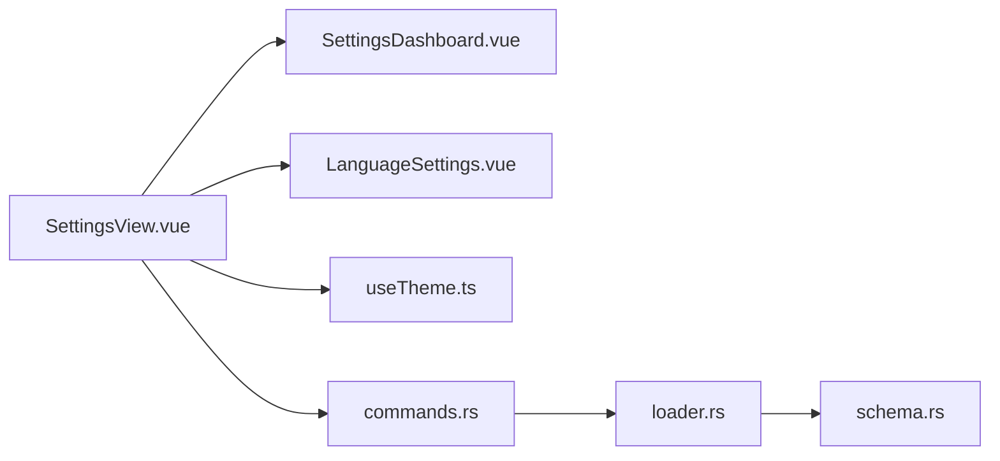

# 设置管理系统

<cite>
**本文引用的文件**
- [SettingsView.vue](file://agent-diva-gui/src/components/SettingsView.vue)
- [SettingsDashboard.vue](file://agent-diva-gui/src/components/settings/SettingsDashboard.vue)
- [LanguageSettings.vue](file://agent-diva-gui/src/components/settings/LanguageSettings.vue)
- [useTheme.ts](file://agent-diva-gui/src/composables/useTheme.ts)
- [styles.css](file://agent-diva-gui/src/styles.css)
- [commands.rs](file://agent-diva-gui/src-tauri/src/commands.rs)
- [mod.rs（配置模块）](file://agent-diva-core/src/config/mod.rs)
- [loader.rs（配置加载与热重载）](file://agent-diva-core/src/config/loader.rs)
- [schema.rs（配置结构定义）](file://agent-diva-core/src/config/schema.rs)
</cite>

## 目录
1. [简介](#简介)
2. [项目结构](#项目结构)
3. [核心组件](#核心组件)
4. [架构总览](#架构总览)
5. [详细组件分析](#详细组件分析)
6. [依赖关系分析](#依赖关系分析)
7. [性能考虑](#性能考虑)
8. [故障排查指南](#故障排查指南)
9. [结论](#结论)
10. [附录](#附录)

## 简介
本文件为 Agent Diva 的设置管理系统提供全面文档，覆盖设置仪表板的面板布局与导航、各设置模块的组织方式、配置参数与验证规则、默认值管理、持久化存储机制、动态刷新与热重载、国际化与主题切换、导入导出与备份恢复、迁移工具、冲突检测、版本兼容性与错误处理策略。目标是帮助开发者与用户快速理解并高效使用设置系统。

## 项目结构
设置系统由前端 GUI 与后端核心配置层组成：
- 前端 GUI（Vue + Tauri）
  - 设置视图容器与路由：SettingsView.vue
  - 设置仪表板卡片：SettingsDashboard.vue
  - 语言设置：LanguageSettings.vue
  - 主题设置：useTheme.ts
  - 全局样式与状态徽章：styles.css
  - Tauri 命令与工作区操作：commands.rs
- 后端核心（Rust）
  - 配置模块入口：config/mod.rs
  - 配置加载、合并、校验与热重载：config/loader.rs
  - 配置结构定义与默认值：config/schema.rs

**图表来源**
- [SettingsView.vue:1-120](file://agent-diva-gui/src/components/SettingsView.vue#L1-L120)
- [SettingsDashboard.vue:1-58](file://agent-diva-gui/src/components/settings/SettingsDashboard.vue#L1-L58)
- [LanguageSettings.vue:1-60](file://agent-diva-gui/src/components/settings/LanguageSettings.vue#L1-L60)
- [useTheme.ts:1-45](file://agent-diva-gui/src/composables/useTheme.ts#L1-L45)
- [commands.rs:145-170](file://agent-diva-gui/src-tauri/src/commands.rs#L145-L170)
- [loader.rs:57-82](file://agent-diva-core/src/config/loader.rs#L57-L82)
- [schema.rs:278-309](file://agent-diva-core/src/config/schema.rs#L278-L309)

**章节来源**
- [SettingsView.vue:1-120](file://agent-diva-gui/src/components/SettingsView.vue#L1-L120)
- [SettingsDashboard.vue:1-58](file://agent-diva-gui/src/components/settings/SettingsDashboard.vue#L1-L58)
- [LanguageSettings.vue:1-60](file://agent-diva-gui/src/components/settings/LanguageSettings.vue#L1-L60)
- [useTheme.ts:1-45](file://agent-diva-gui/src/composables/useTheme.ts#L1-L45)
- [styles.css:2365-2432](file://agent-diva-gui/src/styles.css#L2365-L2432)
- [commands.rs:145-170](file://agent-diva-gui/src-tauri/src/commands.rs#L145-L170)
- [mod.rs:1-12](file://agent-diva-core/src/config/mod.rs#L1-L12)
- [loader.rs:57-82](file://agent-diva-core/src/config/loader.rs#L57-L82)
- [schema.rs:278-309](file://agent-diva-core/src/config/schema.rs#L278-L309)

## 核心组件
- 设置视图容器（SettingsView.vue）
  - 负责子视图路由、标题渲染、返回导航、Mask 编辑器弹窗等。
  - 通过 props 注入配置、工具配置、通道配置保存回调、工作区状态与刷新函数。
- 设置仪表板（SettingsDashboard.vue）
  - 以卡片形式展示通用设置、提供商配置、工作区、技能、MCP、沙箱、网络、压缩、自进化、审计、主题、语言、伙伴、关于等入口。
- 语言设置（LanguageSettings.vue）
  - 切换当前语言并持久化到本地存储。
- 主题设置（useTheme.ts）
  - 维护主题状态、应用 data-theme 属性、持久化到 localStorage，支持白名单校验与回退默认值。
- 工作区设置（commands.rs）
  - 提供工作区检查、选择、默认工作区获取与重置等能力。
- 配置加载与热重载（loader.rs）
  - 从配置文件与环境变量加载、合并、别名归一化、校验；支持后台轮询文件 mtime 变更进行热重载或重启提示。
- 配置结构（schema.rs）
  - 定义根配置对象及各子模块结构、枚举、默认值与校验逻辑。

**章节来源**
- [SettingsView.vue:1-120](file://agent-diva-gui/src/components/SettingsView.vue#L1-L120)
- [SettingsDashboard.vue:1-58](file://agent-diva-gui/src/components/settings/SettingsDashboard.vue#L1-L58)
- [LanguageSettings.vue:1-60](file://agent-diva-gui/src/components/settings/LanguageSettings.vue#L1-L60)
- [useTheme.ts:1-45](file://agent-diva-gui/src/composables/useTheme.ts#L1-L45)
- [commands.rs:145-170](file://agent-diva-gui/src-tauri/src/commands.rs#L145-L170)
- [loader.rs:57-82](file://agent-diva-core/src/config/loader.rs#L57-L82)
- [schema.rs:278-309](file://agent-diva-core/src/config/schema.rs#L278-L309)

## 架构总览
设置系统采用“前端 UI + Tauri 命令 + 后端配置服务”的分层架构：
- 前端通过 Vue 组件组织设置页面与交互。
- Tauri 命令桥接前端与 Rust 后端，执行工作区与配置相关操作。
- 后端 ConfigLoader 负责配置的加载、合并、校验、持久化与热重载。

**图表来源**
- [SettingsView.vue:1-120](file://agent-diva-gui/src/components/SettingsView.vue#L1-L120)
- [SettingsDashboard.vue:1-58](file://agent-diva-gui/src/components/settings/SettingsDashboard.vue#L1-L58)
- [LanguageSettings.vue:1-60](file://agent-diva-gui/src/components/settings/LanguageSettings.vue#L1-L60)
- [useTheme.ts:1-45](file://agent-diva-gui/src/composables/useTheme.ts#L1-L45)
- [commands.rs:145-170](file://agent-diva-gui/src-tauri/src/commands.rs#L145-L170)
- [loader.rs:57-82](file://agent-diva-core/src/config/loader.rs#L57-L82)
- [schema.rs:278-309](file://agent-diva-core/src/config/schema.rs#L278-L309)

## 详细组件分析

### 设置仪表板与导航结构
- 仪表板卡片列表包含：提供商、通道、通用、工作区、技能、MCP、沙箱、网络、压缩、自进化、审计、主题、语言、伙伴、关于。
- 每个卡片携带图标、标题与描述，点击后向父视图发出导航事件，由 SettingsView.vue 切换对应子视图。
- 标题与文案通过 i18n 的 t() 函数渲染，保证多语言一致性。

**图表来源**
- [SettingsDashboard.vue:1-58](file://agent-diva-gui/src/components/settings/SettingsDashboard.vue#L1-L58)
- [SettingsView.vue:1-120](file://agent-diva-gui/src/components/SettingsView.vue#L1-L120)

**章节来源**
- [SettingsDashboard.vue:1-58](file://agent-diva-gui/src/components/settings/SettingsDashboard.vue#L1-L58)
- [SettingsView.vue:1-120](file://agent-diva-gui/src/components/SettingsView.vue#L1-L120)

### 通用设置与提供商配置
- 通用设置涉及聊天显示偏好、工具配置保存等，通过 props 传入并在子组件中触发保存回调。
- 提供商配置通过 ProviderConfigEntry 表示，支持来自 providers 与 custom_providers 的来源区分，并由上层保存回调统一持久化。

**章节来源**
- [SettingsView.vue:31-103](file://agent-diva-gui/src/components/SettingsView.vue#L31-L103)

### 工作区管理
- 工作区设置页接收工作区状态、状态机与错误信息，并提供刷新工作区的回调。
- Tauri 命令提供 inspectWorkspace、chooseWorkspaceDirectory、getDefaultWorkspace、setDefaultWorkspace、resetDefaultWorkspace 等能力，用于检查工作区候选、选择目录、获取/设置/重置默认工作区。

**图表来源**
- [commands.rs:145-170](file://agent-diva-gui/src-tauri/src/commands.rs#L145-L170)
- [loader.rs:57-82](file://agent-diva-core/src/config/loader.rs#L57-L82)

**章节来源**
- [commands.rs:145-170](file://agent-diva-gui/src-tauri/src/commands.rs#L145-L170)
- [SettingsView.vue:216-222](file://agent-diva-gui/src/components/SettingsView.vue#L216-L222)

### 语言与国际化
- 语言设置通过 vue-i18n 的 locale 控制当前语言，切换时写回本地存储键，实现跨会话记忆。
- 所有界面文案通过 t() 获取，确保一致的多语言体验。

**章节来源**
- [LanguageSettings.vue:1-60](file://agent-diva-gui/src/components/settings/LanguageSettings.vue#L1-L60)
- [SettingsView.vue:1-120](file://agent-diva-gui/src/components/SettingsView.vue#L1-L120)

### 主题与动态样式
- 主题通过 useTheme.ts 管理，维护受保护的主题 ID 白名单，应用 data-theme 属性到根元素，并持久化到 localStorage。
- 未知主题 ID 会被忽略并回退到默认主题；读取失败也回退到默认主题。
- 样式文件中定义了设置仪表板卡片、状态徽章、代码块等视觉样式，配合主题变量实现动态换肤。

**图表来源**
- [useTheme.ts:1-45](file://agent-diva-gui/src/composables/useTheme.ts#L1-L45)
- [styles.css:2365-2432](file://agent-diva-gui/src/styles.css#L2365-L2432)

**章节来源**
- [useTheme.ts:1-45](file://agent-diva-gui/src/composables/useTheme.ts#L1-L45)
- [styles.css:2365-2432](file://agent-diva-gui/src/styles.css#L2365-L2432)

### 配置加载、校验与热重载
- 配置加载流程：
  - 基于默认配置构建基础值。
  - 若存在配置文件则读取并合并。
  - 应用别名覆盖与环境变量路径覆盖。
  - 归一化别名键（如 mate/pet、neuro-link/neuro_link/generic_pipe、mcpServers/mcp_servers）。
  - 反序列化为强类型结构并执行校验。
- 热重载机制：
  - 后台任务每 5 秒轮询配置文件 mtime。
  - 检测到变更后等待 500ms 去抖，再次确认未继续写入。
  - 重新加载配置并计算差异，将变化分类为“可热重载”或“需重启”。
  - 仅允许白名单字段热重载（如模型、温度、工具超时、日志级别等），其余变更要求重启。

**图表来源**
- [loader.rs:94-166](file://agent-diva-core/src/config/loader.rs#L94-L166)
- [loader.rs:214-239](file://agent-diva-core/src/config/loader.rs#L214-L239)
- [loader.rs:241-306](file://agent-diva-core/src/config/loader.rs#L241-L306)

**章节来源**
- [loader.rs:57-82](file://agent-diva-core/src/config/loader.rs#L57-L82)
- [loader.rs:94-166](file://agent-diva-core/src/config/loader.rs#L94-L166)
- [loader.rs:214-239](file://agent-diva-core/src/config/loader.rs#L214-L239)
- [loader.rs:241-306](file://agent-diva-core/src/config/loader.rs#L241-L306)

### 配置结构与默认值
- 根配置对象包含 agents、channels、providers、gateway、tools、memory、self_evolution、reports、logging、sandbox、mate 等子模块。
- 各子模块提供默认值与可选覆盖，例如：
  - 代理默认：workspace、provider、model、max_tokens、temperature、max_tool_iterations、reasoning_effort、thinking_mode。
  - 报告生成：llm_curation.enabled/provider/model/language/max_input_tokens/max_output_tokens/timeout_secs/fallback。
  - 日志：level/format/dir/overrides/retention_days。
  - 沙箱：mode/windows_level/network_access/approval_policy/writable_roots/protected_paths/deny_patterns/timeout_seconds。
  - 通道：各平台 enabled/token/allow_from 等开关与凭据。
- 校验逻辑对关键数值进行约束（如 reports.llm_curation.timeout_secs > 0 等）。

**章节来源**
- [schema.rs:278-309](file://agent-diva-core/src/config/schema.rs#L278-L309)
- [schema.rs:378-463](file://agent-diva-core/src/config/schema.rs#L378-L463)
- [schema.rs:511-557](file://agent-diva-core/src/config/schema.rs#L511-L557)
- [schema.rs:559-603](file://agent-diva-core/src/config/schema.rs#L559-L603)
- [schema.rs:605-642](file://agent-diva-core/src/config/schema.rs#L605-L642)
- [schema.rs:644-731](file://agent-diva-core/src/config/schema.rs#L644-L731)
- [schema.rs:733-788](file://agent-diva-core/src/config/schema.rs#L733-L788)
- [schema.rs:790-800](file://agent-diva-core/src/config/schema.rs#L790-L800)

### 环境变量与别名覆盖
- 环境变量优先级高于配置文件：
  - 别名键映射：如 OPENAI_API_KEY -> providers.openai.api_key。
  - 路径键映射：AGENT_DIVA__AGENTS__DEFAULTS__MODEL 等按双下划线分段映射到配置路径。
- 别名键归一化：
  - channels.neuro-link 与 neuro_link/generic_pipe 合并到规范键。
  - tools.mcpServers 与 mcp_servers 合并。
  - 顶层 pet 段迁移到 mate。

**章节来源**
- [loader.rs:371-463](file://agent-diva-core/src/config/loader.rs#L371-L463)

### 导入导出、备份恢复与迁移
- 导入导出：
  - 配置保存为 JSON 文件，便于手动备份与迁移。
  - 可通过自定义配置目录或显式配置文件路径加载实例化多个配置。
- 备份恢复：
  - 直接复制 config.json 即可备份；恢复时替换文件或指定 with_file 加载。
- 迁移工具：
  - 别名归一化与旧键迁移（如 pet -> mate）在加载阶段自动完成。
  - 工作区默认路径内置默认目录与用户自定义默认工作区之间的切换与重置。

**章节来源**
- [loader.rs:34-55](file://agent-diva-core/src/config/loader.rs#L34-L55)
- [loader.rs:429-463](file://agent-diva-core/src/config/loader.rs#L429-L463)
- [commands.rs:5207-5243](file://agent-diva-gui/src-tauri/src/commands.rs#L5207-L5243)

### 冲突检测、版本兼容性与错误处理
- 冲突检测：
  - 通过 compute_diff 比较新旧配置，识别具体字段变化并分类。
  - 仅允许白名单字段热重载，其他变更需要重启以避免不一致。
- 版本兼容性：
  - 别名键与旧键迁移确保向后兼容（如 pet -> mate、generic_pipe -> neuro-link）。
  - 环境路径覆盖优先级最高，避免被文件覆盖导致意外行为。
- 错误处理：
  - 配置加载失败会记录警告并跳过本次热重载。
  - 主题设置对无效值进行回退，避免崩溃。
  - 工作区操作返回明确错误信息以便前端提示。

**章节来源**
- [loader.rs:94-166](file://agent-diva-core/src/config/loader.rs#L94-L166)
- [loader.rs:214-239](file://agent-diva-core/src/config/loader.rs#L214-L239)
- [loader.rs:241-306](file://agent-diva-core/src/config/loader.rs#L241-L306)
- [useTheme.ts:1-45](file://agent-diva-gui/src/composables/useTheme.ts#L1-L45)
- [commands.rs:145-170](file://agent-diva-gui/src-tauri/src/commands.rs#L145-L170)

## 依赖关系分析
- 前端组件依赖 i18n 与 lucide 图标库，通过 props 与事件与父视图通信。
- Tauri 命令依赖 Rust 后端配置加载器，执行文件系统与配置读写。
- 配置加载器依赖 schema 定义的强类型结构，确保数据一致性与校验。

**图表来源**
- [SettingsView.vue:1-120](file://agent-diva-gui/src/components/SettingsView.vue#L1-L120)
- [SettingsDashboard.vue:1-58](file://agent-diva-gui/src/components/settings/SettingsDashboard.vue#L1-L58)
- [LanguageSettings.vue:1-60](file://agent-diva-gui/src/components/settings/LanguageSettings.vue#L1-L60)
- [useTheme.ts:1-45](file://agent-diva-gui/src/composables/useTheme.ts#L1-L45)
- [commands.rs:145-170](file://agent-diva-gui/src-tauri/src/commands.rs#L145-L170)
- [loader.rs:57-82](file://agent-diva-core/src/config/loader.rs#L57-L82)
- [schema.rs:278-309](file://agent-diva-core/src/config/schema.rs#L278-L309)

**章节来源**
- [SettingsView.vue:1-120](file://agent-diva-gui/src/components/SettingsView.vue#L1-L120)
- [commands.rs:145-170](file://agent-diva-gui/src-tauri/src/commands.rs#L145-L170)
- [loader.rs:57-82](file://agent-diva-core/src/config/loader.rs#L57-L82)
- [schema.rs:278-309](file://agent-diva-core/src/config/schema.rs#L278-L309)

## 性能考虑
- 热重载轮询间隔为 5 秒，并在检测到变更后进行 500ms 去抖，减少频繁重读与解析开销。
- 仅对允许的热重载字段应用变更，避免不必要的重启成本。
- 主题切换与语言切换均为轻量级本地存储操作，无网络开销。
- 工作区检查与默认工作区操作通过 Tauri 命令异步执行，避免阻塞 UI。

[本节为通用指导，不直接分析具体文件]

## 故障排查指南
- 配置加载失败：
  - 检查配置文件是否存在且格式正确。
  - 查看热重载日志中的警告信息，定位最近一次失败的加载。
- 热重载未生效：
  - 确认修改的字段是否在热重载白名单内。
  - 若不在白名单，需重启应用使变更生效。
- 主题切换无效：
  - 检查本地存储是否可用或被拦截。
  - 确认传入的主题 ID 在白名单中。
- 工作区操作报错：
  - 检查路径是否为空或不可访问。
  - 查看 Tauri 命令返回的错误信息，确认权限与路径合法性。

**章节来源**
- [loader.rs:94-166](file://agent-diva-core/src/config/loader.rs#L94-L166)
- [loader.rs:214-239](file://agent-diva-core/src/config/loader.rs#L214-L239)
- [useTheme.ts:1-45](file://agent-diva-gui/src/composables/useTheme.ts#L1-L45)
- [commands.rs:145-170](file://agent-diva-gui/src-tauri/src/commands.rs#L145-L170)

## 结论
Agent Diva 的设置管理系统通过清晰的前端视图与后端配置服务分离，提供了强大的配置管理能力。仪表板卡片化导航直观易用；配置加载、合并、校验与热重载机制保障运行时灵活性与稳定性；国际化与主题切换提升用户体验；工作区管理简化了多工作区场景下的切换与维护。结合导入导出、备份恢复与迁移工具，用户可安全地管理配置生命周期。冲突检测与错误处理策略进一步增强了系统的健壮性。

[本节为总结性内容，不直接分析具体文件]

## 附录
- 常用配置路径示例（概念性说明）
  - 代理默认模型：agents.defaults.model
  - 工具超时：tools.exec.timeout
  - 日志级别：logging.level
  - 沙箱模式：sandbox.mode
  - 报告语言：reports.llm_curation.language
- 环境变量覆盖示例（概念性说明）
  - AGENT_DIVA__PROVIDERS__OPENAI__API_KEY
  - AGENT_DIVA__AGENTS__DEFAULTS__TEMPERATURE

[本节为补充说明，不直接分析具体文件]