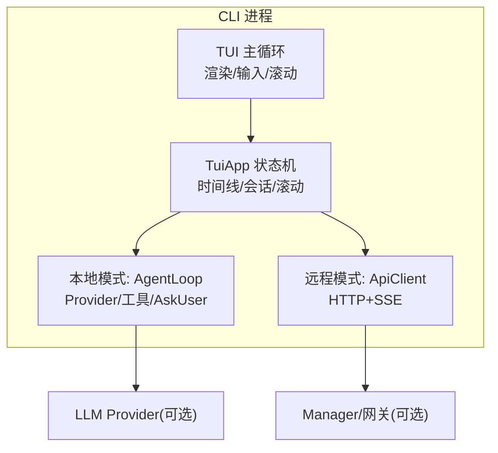
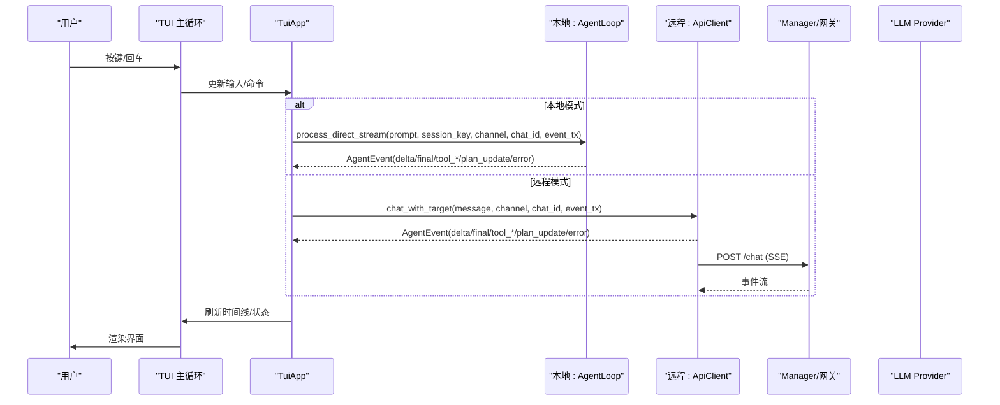
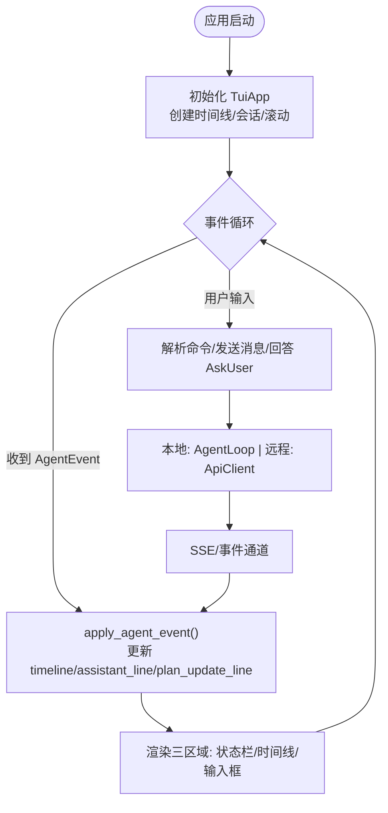
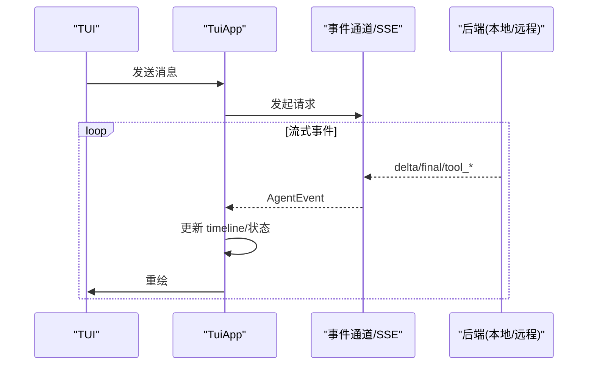
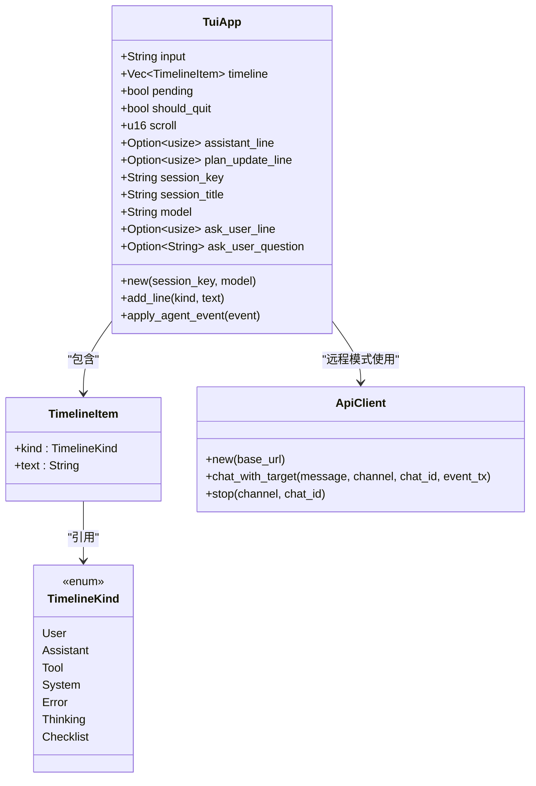
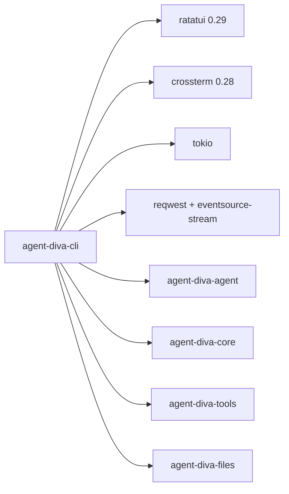

# TUI 终端界面

<cite>
**本文引用的文件**
- [agent-diva-cli/src/main.rs](file://agent-diva-cli/src/main.rs)
- [agent-diva-cli/src/client.rs](file://agent-diva-cli/src/client.rs)
- [agent-diva-cli/Cargo.toml](file://agent-diva-cli/Cargo.toml)
</cite>

## 目录
1. [简介](#简介)
2. [项目结构](#项目结构)
3. [核心组件](#核心组件)
4. [架构总览](#架构总览)
5. [详细组件分析](#详细组件分析)
6. [依赖关系分析](#依赖关系分析)
7. [性能考量](#性能考量)
8. [故障排查指南](#故障排查指南)
9. [结论](#结论)
10. [附录](#附录)

## 简介
本章节面向终端用户与开发者，系统性介绍 Agent Diva 的 TUI（基于 ratatui）终端界面。内容涵盖设计理念、会话管理、消息显示、实时流式响应、用户交互模式、键盘快捷键、窗口布局、状态指示器与错误提示机制；并提供界面定制选项、主题配置思路与性能优化建议，以及常见使用场景的操作指南和高级功能探索方法。

## 项目结构
TUI 终端界面位于 CLI 模块中，通过命令 agent-diva tui 启动，支持本地直连与远程连接两种模式：
- 本地模式：直接构建 LLM Provider、AgentLoop、工具链与 AskUser 协调器，事件通过通道在进程内流转。
- 远程模式：通过 HTTP + SSE 将请求发送至远端 Manager，事件以流式方式回推至 TUI。

图表来源
- [agent-diva-cli/src/main.rs:1297-1556](file://agent-diva-cli/src/main.rs#L1297-L1556)
- [agent-diva-cli/src/main.rs:2160-2347](file://agent-diva-cli/src/main.rs#L2160-L2347)
- [agent-diva-cli/src/client.rs:152-262](file://agent-diva-cli/src/client.rs#L152-L262)

章节来源
- [agent-diva-cli/src/main.rs:1297-1556](file://agent-diva-cli/src/main.rs#L1297-L1556)
- [agent-diva-cli/src/main.rs:2160-2347](file://agent-diva-cli/src/main.rs#L2160-L2347)
- [agent-diva-cli/src/client.rs:152-262](file://agent-diva-cli/src/client.rs#L152-L262)

## 核心组件
- TuiApp：维护输入缓冲区、时间线、滚动位置、会话标识、模型信息、待处理标志、当前助手行索引、计划更新行索引、AskUser 问题追踪等。
- TimelineItem/TimelineKind：消息类型与标签（user/assistant/tool/system/error/thinking/todo）。
- run_tui / run_tui_remote：分别实现本地与远程模式的 TUI 主循环、渲染、事件分发与退出清理。
- ApiClient：远程模式下通过 HTTP + SSE 接收 delta/final/tool_start/tool_finish/tool_delta/error/turn_plan_updated/context_compaction 等事件。

章节来源
- [agent-diva-cli/src/main.rs:1029-1220](file://agent-diva-cli/src/main.rs#L1029-L1220)
- [agent-diva-cli/src/main.rs:1297-1556](file://agent-diva-cli/src/main.rs#L1297-L1556)
- [agent-diva-cli/src/main.rs:2160-2347](file://agent-diva-cli/src/main.rs#L2160-L2347)
- [agent-diva-cli/src/client.rs:12-309](file://agent-diva-cli/src/client.rs#L12-L309)

## 架构总览
TUI 采用“事件驱动 + 渲染循环”的模式：
- 输入事件：按键事件进入 TuiApp 状态机，触发发送消息、切换会话、清空时间线、停止会话或回答 AskUser 问题。
- 后端事件：本地模式由 AgentLoop 产生 AgentEvent；远程模式由 ApiClient 解析 SSE 事件并转换为 AgentEvent。
- 渲染：每帧根据 TuiApp 状态绘制顶部状态栏、中间时间线、底部输入框，并设置光标位置。

图表来源
- [agent-diva-cli/src/main.rs:1297-1556](file://agent-diva-cli/src/main.rs#L1297-L1556)
- [agent-diva-cli/src/main.rs:2160-2347](file://agent-diva-cli/src/main.rs#L2160-L2347)
- [agent-diva-cli/src/client.rs:152-262](file://agent-diva-cli/src/client.rs#L152-L262)

## 详细组件分析

### 会话管理与时间线
- 会话键：默认 cli:tui，支持 /new 生成新会话键（含时间戳），用于区分不同对话上下文。
- 时间线：按类型追加消息，支持滚动查看历史；助手回复会复用同一行进行增量更新（assistant_line）。
- 计划清单：收到 turn_plan_updated 时，格式化任务清单并以独立行展示（plan_update_line）。

图表来源
- [agent-diva-cli/src/main.rs:1094-1220](file://agent-diva-cli/src/main.rs#L1094-L1220)
- [agent-diva-cli/src/main.rs:1297-1556](file://agent-diva-cli/src/main.rs#L1297-L1556)
- [agent-diva-cli/src/main.rs:2160-2347](file://agent-diva-cli/src/main.rs#L2160-L2347)

章节来源
- [agent-diva-cli/src/main.rs:1029-1220](file://agent-diva-cli/src/main.rs#L1029-L1220)
- [agent-diva-cli/src/main.rs:1297-1556](file://agent-diva-cli/src/main.rs#L1297-L1556)
- [agent-diva-cli/src/main.rs:2160-2347](file://agent-diva-cli/src/main.rs#L2160-L2347)

### 实时流式响应
- 本地模式：AgentLoop 通过事件通道推送 AssistantDelta/ReasoningDelta/ToolCallStarted/ToolCallFinished/FinalResponse/Error 等事件，TuiApp 即时追加或更新对应行。
- 远程模式：ApiClient 订阅 SSE 流，将 delta/final/tool_* 等事件映射为 AgentEvent 并发送到 TUI。

图表来源
- [agent-diva-cli/src/main.rs:1123-1219](file://agent-diva-cli/src/main.rs#L1123-L1219)
- [agent-diva-cli/src/client.rs:152-262](file://agent-diva-cli/src/client.rs#L152-L262)

章节来源
- [agent-diva-cli/src/main.rs:1123-1219](file://agent-diva-cli/src/main.rs#L1123-L1219)
- [agent-diva-cli/src/client.rs:152-262](file://agent-diva-cli/src/client.rs#L152-L262)

### 用户交互模式与键盘快捷键
- 输入区：Enter 发送；Shift+Enter 换行；Backspace 删除；Ctrl+C 或 Esc 退出。
- 导航：PageUp/Up 上滚；PageDown/Down 下滚。
- 命令：
  - /quit：退出 TUI
  - /clear：清空时间线
  - /new：新建会话（自动生成带时间戳的会话键）
  - /stop：停止当前会话（本地通过 RuntimeControlCommand::StopSession；远程通过 /chat/stop）
- AskUser 问答：当出现 ask_user 问题时，输入区会提示选择编号或自由文本；提交后自动清理问题标记。

章节来源
- [agent-diva-cli/src/main.rs:1477-1544](file://agent-diva-cli/src/main.rs#L1477-L1544)
- [agent-diva-cli/src/main.rs:2270-2335](file://agent-diva-cli/src/main.rs#L2270-L2335)
- [agent-diva-cli/src/main.rs:1222-1295](file://agent-diva-cli/src/main.rs#L1222-L1295)

### 窗口布局与状态指示器
- 三区域布局：顶部状态栏（显示 model/title/session/status）、中部时间线（可滚动）、底部输入框（带标题提示）。
- 状态指示：pending 为 processing，否则 idle；时间线条目按类型着色（user/assistant/tool/system/error/thinking/todo）。
- 光标定位：输入框末尾动态设置光标位置。

章节来源
- [agent-diva-cli/src/main.rs:1406-1475](file://agent-diva-cli/src/main.rs#L1406-L1475)
- [agent-diva-cli/src/main.rs:2199-2268](file://agent-diva-cli/src/main.rs#L2199-L2268)

### 错误提示机制
- 错误事件：Error 类型消息会重置 pending 与 assistant_line，并在时间线中以红色 error 标签显示。
- 停止失败：远程模式下 /stop 失败会在时间线中追加错误提示。
- 网络异常：SSE 流错误或 HTTP 非成功状态会转换为 Error 事件。

章节来源
- [agent-diva-cli/src/main.rs:1196-1204](file://agent-diva-cli/src/main.rs#L1196-L1204)
- [agent-diva-cli/src/main.rs:2311-2318](file://agent-diva-cli/src/main.rs#L2311-L2318)
- [agent-diva-cli/src/client.rs:167-171](file://agent-diva-cli/src/client.rs#L167-L171)
- [agent-diva-cli/src/client.rs:254-258](file://agent-diva-cli/src/client.rs#L254-L258)

### 类图（代码级）

图表来源
- [agent-diva-cli/src/main.rs:1029-1220](file://agent-diva-cli/src/main.rs#L1029-L1220)
- [agent-diva-cli/src/client.rs:12-309](file://agent-diva-cli/src/client.rs#L12-L309)

## 依赖关系分析
- 运行时依赖：ratatui 0.29、crossterm 0.28 提供 TUI 渲染与终端控制；tokio 异步运行时；reqwest/eventsource-stream 用于远程 SSE。
- 内部依赖：agent-diva-agent（AgentLoop/AgentEvent）、agent-diva-core（MessageBus/Config/AskUserCoordinator）、agent-diva-tools（工具配置）、agent-diva-files（附件存储）。

图表来源
- [agent-diva-cli/Cargo.toml:15-57](file://agent-diva-cli/Cargo.toml#L15-L57)

章节来源
- [agent-diva-cli/Cargo.toml:15-57](file://agent-diva-cli/Cargo.toml#L15-L57)

## 性能考量
- 渲染频率：事件轮询间隔约 60ms，平衡了响应性与 CPU 占用。
- 增量更新：助手回复通过 assistant_line 复用同一行，避免频繁插入新行导致重排开销。
- 滚动缓冲：scroll 仅记录偏移量，不复制时间线数据，降低内存压力。
- 远程流式：SSE 事件逐条转换并立即渲染，减少批量等待延迟。
- 建议：
  - 长时间会话可定期 /clear 释放内存。
  - 大段输出建议在本地模式以获得更低延迟。
  - 合理设置全局超时与工具执行超时以避免阻塞。

[本节为通用性能指导，无需特定文件引用]

## 故障排查指南
- 无法连接远程服务：检查 --api-url 是否指向可达地址；确认 Manager/网关已启动；查看错误事件中的 message。
- /stop 失败：远程模式下若返回非成功状态，会在时间线追加错误提示；可重试或检查服务端日志。
- AskUser 无响应：确认问题仍存在且允许自由文本或选择范围正确；如问题不再 pending，系统会提示并清理标记。
- 终端异常：确保启用原始模式与备用屏幕；退出时恢复光标与模式。

章节来源
- [agent-diva-cli/src/client.rs:167-171](file://agent-diva-cli/src/client.rs#L167-L171)
- [agent-diva-cli/src/main.rs:2311-2318](file://agent-diva-cli/src/main.rs#L2311-L2318)
- [agent-diva-cli/src/main.rs:1222-1295](file://agent-diva-cli/src/main.rs#L1222-L1295)
- [agent-diva-cli/src/main.rs:1552-1555](file://agent-diva-cli/src/main.rs#L1552-L1555)
- [agent-diva-cli/src/main.rs:2343-2346](file://agent-diva-cli/src/main.rs#L2343-L2346)

## 结论
Agent Diva 的 TUI 终端界面以简洁清晰的三区域布局、实时的流式响应与健壮的会话管理为核心，提供了流畅的命令行体验。通过本地与远程双模式适配，既满足低延迟交互需求，也支持分布式部署。对于开发者而言，TuiApp 的状态机设计、事件驱动架构与可扩展的时间线体系为后续功能扩展（如主题、布局、快捷键自定义）提供了良好基础。

[本节为总结性内容，无需特定文件引用]

## 附录

### 使用指南（常见场景）
- 开始对话：运行 agent-diva tui，输入消息并回车发送。
- 多会话：使用 /new 切换新会话，状态栏显示当前会话键。
- 查看进度：关注时间线中的 tool 与 thinking 条目了解工具调用与推理过程。
- 停止任务：使用 /stop 终止当前会话。
- 退出：Ctrl+C 或 Esc。

章节来源
- [agent-diva-cli/src/main.rs:1477-1544](file://agent-diva-cli/src/main.rs#L1477-L1544)
- [agent-diva-cli/src/main.rs:2270-2335](file://agent-diva-cli/src/main.rs#L2270-L2335)

### 界面定制与主题配置建议
- 颜色方案：当前时间线条目按类型使用固定颜色（cyan/green/yellow/blue/red/darkgray/magenta），可在渲染分支处调整颜色映射以适配个人偏好。
- 布局尺寸：可通过修改 Layout 约束（顶部/中部/底部高度比例）来适应不同终端大小。
- 字体与宽度：确保终端支持 Unicode 与等宽字体，以获得最佳显示效果。
- 主题持久化：如需持久化主题，可在 TuiApp 中增加配置项并通过配置文件加载。

章节来源
- [agent-diva-cli/src/main.rs:1430-1462](file://agent-diva-cli/src/main.rs#L1430-L1462)
- [agent-diva-cli/src/main.rs:2223-2255](file://agent-diva-cli/src/main.rs#L2223-L2255)

### 高级功能探索
- AskUser 集成：当工具需要用户确认时，TUI 会自动提示并可输入编号或自由文本完成决策。
- 计划清单：turn_plan_updated 事件会以任务清单形式展示，便于跟踪复杂任务的执行步骤。
- 远程协作：通过 --remote 与 --api-url 连接到远端 Manager，享受集中式会话管理与资源调度。

章节来源
- [agent-diva-cli/src/main.rs:1222-1295](file://agent-diva-cli/src/main.rs#L1222-L1295)
- [agent-diva-cli/src/main.rs:1205-1216](file://agent-diva-cli/src/main.rs#L1205-L1216)
- [agent-diva-cli/src/main.rs:2160-2347](file://agent-diva-cli/src/main.rs#L2160-L2347)