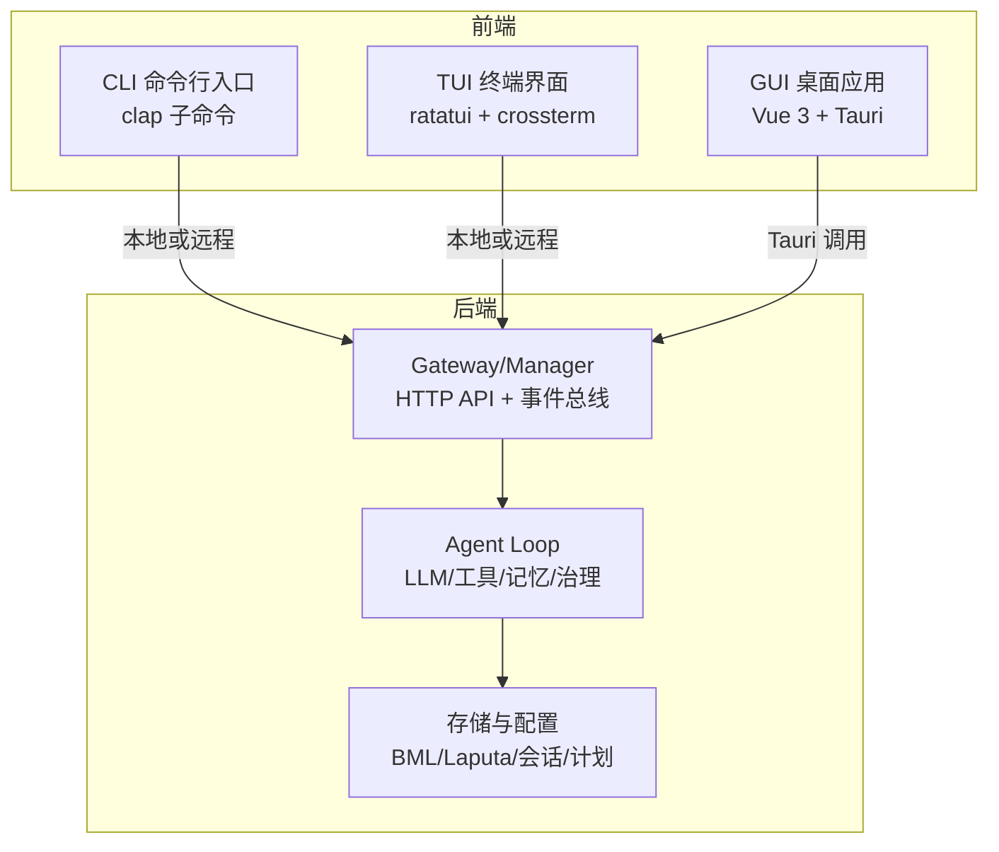
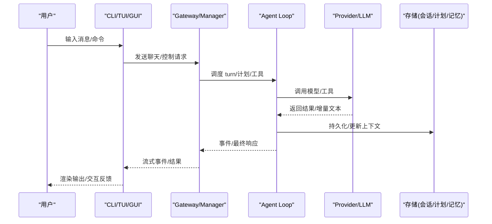
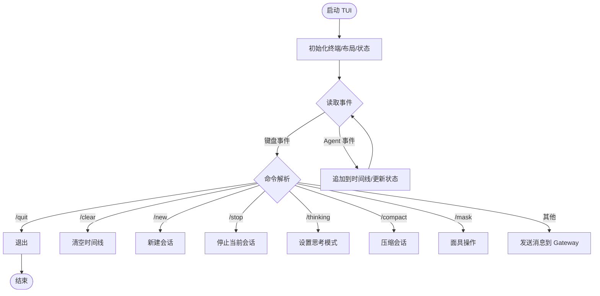
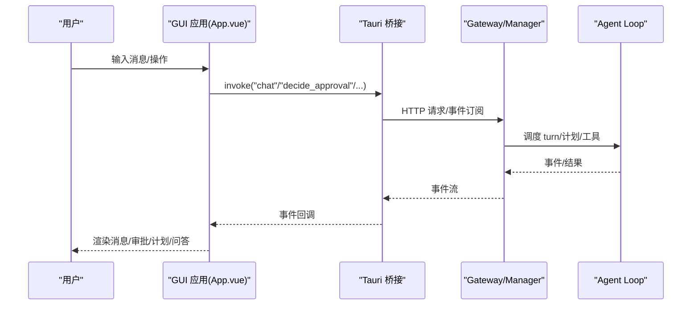
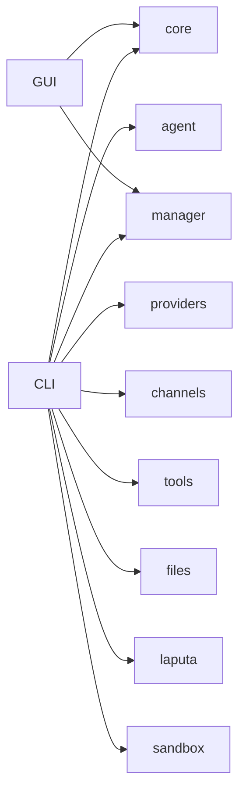

# 完整 UI 三件套

<cite>
**本文引用的文件**
- [README.md](file://README.md)
- [agent-diva-cli/Cargo.toml](file://agent-diva-cli/Cargo.toml)
- [agent-diva-cli/src/main.rs](file://agent-diva-cli/src/main.rs)
- [agent-diva-cli/src/chat_commands.rs](file://agent-diva-cli/src/chat_commands.rs)
- [agent-diva-gui/package.json](file://agent-diva-gui/package.json)
- [agent-diva-gui/src/main.ts](file://agent-diva-gui/src/main.ts)
- [agent-diva-gui/src/App.vue](file://agent-diva-gui/src/App.vue)
</cite>

## 目录
1. [简介](#简介)
2. [项目结构](#项目结构)
3. [核心组件](#核心组件)
4. [架构总览](#架构总览)
5. [详细组件分析](#详细组件分析)
6. [依赖关系分析](#依赖关系分析)
7. [性能考虑](#性能考虑)
8. [故障排查指南](#故障排查指南)
9. [结论](#结论)
10. [附录](#附录)

## 简介
本文件面向 Agent Diva 的“完整 UI 三件套”：CLI 命令行工具、TUI 终端界面与 GUI 桌面应用。内容覆盖命令与参数说明、交互模式与状态显示、实时通信机制、数据同步与任务分发、配置与主题定制、扩展开发、安装部署、常见问题与性能优化，并针对不同用户群体提供使用指导与开发参考。

## 项目结构
Agent Diva 采用多 crate 工作区组织，UI 三件套分别位于：
- CLI：agent-diva-cli（Rust 二进制）
- TUI：集成在 CLI 中，基于 ratatui/crossterm 的终端界面
- GUI：agent-diva-gui（Tauri + Vue 3 桌面应用）

图表来源
- [agent-diva-cli/src/main.rs:59-205](file://agent-diva-cli/src/main.rs#L59-L205)
- [agent-diva-gui/src/App.vue:1-120](file://agent-diva-gui/src/App.vue#L1-L120)

章节来源
- [README.md:87-108](file://README.md#L87-L108)
- [agent-diva-cli/Cargo.toml:1-93](file://agent-diva-cli/Cargo.toml#L1-L93)
- [agent-diva-gui/package.json:1-54](file://agent-diva-gui/package.json#L1-L54)

## 核心组件
- CLI 命令体系：通过 clap 定义全局选项与多级子命令，支持 agent、chat、tui、approvals、provider、config、cron、workspace、todo、mask、service、channels、status 等。
- TUI 交互循环：基于 crossterm 原始模式与 ratatui 渲染，维护时间线、会话、模型、标题、处理状态，支持 /quit、/clear、/new、/stop、/thinking、/compact、/mask 等命令。
- GUI 主应用：Vue 3 单页应用，管理消息流、会话历史、审批中心、计划执行、AskUser 问答、Provider/Channel 设置、语言切换等；通过 Tauri invoke 与后端 Gateway 通信。

章节来源
- [agent-diva-cli/src/main.rs:59-205](file://agent-diva-cli/src/main.rs#L59-L205)
- [agent-diva-cli/src/main.rs:1053-1092](file://agent-diva-cli/src/main.rs#L1053-L1092)
- [agent-diva-cli/src/main.rs:2175-2316](file://agent-diva-cli/src/main.rs#L2175-L2316)
- [agent-diva-gui/src/App.vue:1-120](file://agent-diva-gui/src/App.vue#L1-L120)

## 架构总览
三件套共享同一套后端能力：Gateway/Manager 暴露 HTTP API 与事件通道，Agent Loop 负责 LLM 调用、工具执行、记忆与治理，GUI/TUI/CLI 作为不同形态的前端接入。

图表来源
- [agent-diva-cli/src/chat_commands.rs:260-364](file://agent-diva-cli/src/chat_commands.rs#L260-L364)
- [agent-diva-cli/src/chat_commands.rs:466-535](file://agent-diva-cli/src/chat_commands.rs#L466-L535)
- [agent-diva-gui/src/App.vue:267-355](file://agent-diva-gui/src/App.vue#L267-L355)

## 详细组件分析

### CLI 命令与用法
- 全局选项
  - --config：指定配置文件路径
  - --config-dir：指定配置目录
  - -w/--workspace：临时覆盖工作区
  - --remote：连接远程 Manager
  - --api-url：远程 API 地址（默认 http://localhost:3000/api）
- 主要子命令
  - onboard：初始化/刷新配置与工作区模板
  - gateway run：前台运行 Gateway
  - agent：单次消息处理，支持 --model、--session、--markdown/--no-markdown、--logs/--no-logs、--approval-mode、--json
  - chat：轻量交互式对话，支持 --model、--session、--markdown/--no-markdown、--logs/--no-logs
  - tui：启动 TUI 终端界面，支持 --model、--session
  - approvals：审批列表/决策/取消/交互式审查
  - provider list/status/set/models/login：Provider 管理
  - config path/init/refresh/validate/doctor/show：配置诊断与展示
  - cron add/list/remove/enable/run：定时任务管理
  - workspace/todo/mask：工作区、待办、面具管理
  - channels login/status：渠道登录与状态
  - service：Windows 服务管理
  - status：系统状态查看

章节来源
- [agent-diva-cli/src/main.rs:59-205](file://agent-diva-cli/src/main.rs#L59-L205)
- [agent-diva-cli/src/main.rs:207-439](file://agent-diva-cli/src/main.rs#L207-L439)
- [agent-diva-cli/src/main.rs:441-773](file://agent-diva-cli/src/main.rs#L441-L773)

### TUI 终端界面
- 交互模式
  - 进入原始模式与备用屏幕，使用 ratatui 布局渲染顶部状态行、中间时间线、底部输入区
  - 支持命令：/quit、/clear、/new、/stop、/thinking auto|on|off、/compact、/mask 系列
- 状态显示
  - 状态行显示 model、title、session、status（processing/idle）
  - 时间线包含用户消息、助手回复、工具调用开始/结束、错误、系统提示等
- 实时通信
  - 本地模式：直接构建 AgentLoop，订阅 AgentEvent 流式事件（AssistantDelta、ReasoningDelta、ToolCallStarted/Finished、FinalResponse、Error）
  - 远程模式：通过 ApiClient.chat_with_target 接收事件并应用到时间线
- AskUser 问答
  - 后台轮询 AskUserCoordinator，交互式选择或输入答案，非交互模式下自动取消未决问题避免阻塞

图表来源
- [agent-diva-cli/src/main.rs:2175-2316](file://agent-diva-cli/src/main.rs#L2175-L2316)
- [agent-diva-cli/src/chat_commands.rs:260-364](file://agent-diva-cli/src/chat_commands.rs#L260-L364)

章节来源
- [agent-diva-cli/src/main.rs:1053-1092](file://agent-diva-cli/src/main.rs#L1053-L1092)
- [agent-diva-cli/src/main.rs:2175-2316](file://agent-diva-cli/src/main.rs#L2175-L2316)
- [agent-diva-cli/src/chat_commands.rs:146-258](file://agent-diva-cli/src/chat_commands.rs#L146-L258)

### GUI 桌面应用
- 功能模块
  - 聊天视图：流式消息、工具调用可视化、清理模式、自动展开推理/工具详情
  - 审批中心：统一审批列表与详情，支持 allow/deny/cancel，Plan 审批直达执行
  - 计划执行：从报告恢复 PlanRuntimeState，支持继续执行与错误恢复
  - Provider/Channel：API Key/Base URL、模型目录、渠道配置
  - 设置与偏好：语言切换、显示偏好、预算与压缩阈值
  - AskUser 问答：轮询并回答/取消问题
- 界面组件与工作流
  - App.vue 集中管理消息、会话、审批、计划、AskUser、Provider 配置等状态
  - 通过 @tauri-apps/api/event 监听后端事件，invoke 调用 Rust 侧命令
  - 会话历史加载、缓存、标题生成、工作区切换保护（防止冲突）
- 实时通信
  - 流式文本、重试、卡顿、上下文压缩、工具开始/结束、计划事件等通过事件通道推送至前端

图表来源
- [agent-diva-gui/src/App.vue:267-355](file://agent-diva-gui/src/App.vue#L267-L355)
- [agent-diva-gui/src/App.vue:381-421](file://agent-diva-gui/src/App.vue#L381-L421)
- [agent-diva-gui/src/App.vue:451-600](file://agent-diva-gui/src/App.vue#L451-L600)

章节来源
- [agent-diva-gui/src/main.ts:1-12](file://agent-diva-gui/src/main.ts#L1-L12)
- [agent-diva-gui/src/App.vue:1-120](file://agent-diva-gui/src/App.vue#L1-L120)
- [agent-diva-gui/src/App.vue:267-355](file://agent-diva-gui/src/App.vue#L267-L355)
- [agent-diva-gui/src/App.vue:381-421](file://agent-diva-gui/src/App.vue#L381-L421)
- [agent-diva-gui/src/App.vue:451-600](file://agent-diva-gui/src/App.vue#L451-L600)

### 数据同步、状态共享与任务分发
- 会话与会话键
  - CLI/TUI/GUI 均通过 session_key 与 chat_id 标识会话，保证消息归属与连续性
- 事件驱动
  - AgentEvent 流式事件用于实时更新 UI（文本增量、工具调用、错误、最终响应）
  - GUI 通过 Tauri 事件监听与 invoke 双向通信
- 审批与计划
  - 统一审批中心聚合各域审批，支持幂等键与版本控制
  - Plan 审批允许直接从报告恢复执行上下文，确保一致性
- AskUser 问答
  - CLI/TUI 后台轮询并解答；GUI 轮询并展示问答卡片，支持提交与取消

章节来源
- [agent-diva-cli/src/chat_commands.rs:260-364](file://agent-diva-cli/src/chat_commands.rs#L260-L364)
- [agent-diva-cli/src/chat_commands.rs:466-535](file://agent-diva-cli/src/chat_commands.rs#L466-L535)
- [agent-diva-gui/src/App.vue:381-421](file://agent-diva-gui/src/App.vue#L381-L421)
- [agent-diva-gui/src/App.vue:451-600](file://agent-diva-gui/src/App.vue#L451-L600)

### 配置、主题与扩展
- 配置
  - CLI：onboard/config refresh/validate/doctor/show，支持环境变量覆盖
  - GUI：Provider/Channel/网络工具/预算/显示偏好等设置面板
- 主题与国际化
  - GUI 支持中英文切换（vue-i18n），样式基于 Tailwind
- 扩展开发
  - 工具扩展：通过内置工具注册与 MCP 服务器配置
  - Provider 扩展：providers.yaml 与自定义 Provider
  - Channel 扩展：按 feature 编译启用
  - Skills：SKILL.md 规范与 GUI 市场安装

章节来源
- [README.md:150-200](file://README.md#L150-L200)
- [agent-diva-cli/src/main.rs:421-439](file://agent-diva-cli/src/main.rs#L421-L439)
- [agent-diva-gui/package.json:16-37](file://agent-diva-gui/package.json#L16-L37)

## 依赖关系分析
- CLI 依赖
  - agent-diva-core/agent/providers/channels/tools/manager/files/laputa/sandbox
  - 运行时：tokio、tracing、clap、console、dialoguer、indicatif、ratatui、crossterm
- GUI 依赖
  - Vue 3、@tauri-apps/*、Three.js/VRM、CodeMirror、Tailwind、i18n
- 后端
  - Gateway/Manager 提供 HTTP API 与事件通道，Agent Loop 协调 Provider、工具、记忆与治理

图表来源
- [agent-diva-cli/Cargo.toml:15-25](file://agent-diva-cli/Cargo.toml#L15-L25)
- [agent-diva-gui/package.json:16-37](file://agent-diva-gui/package.json#L16-L37)

章节来源
- [agent-diva-cli/Cargo.toml:1-93](file://agent-diva-cli/Cargo.toml#L1-L93)
- [agent-diva-gui/package.json:1-54](file://agent-diva-gui/package.json#L1-L54)

## 性能考虑
- 流式渲染
  - CLI/TUI/GUI 均采用增量文本输出与按需刷新，减少 I/O 压力
- 超时与限流
  - 工具执行超时、全局超时、Provider 重试策略
- 会话压缩
  - 支持 compact 指令与上下文压缩阈值，降低长会话开销
- 并发与线程栈
  - CLI 使用 tokio 多线程运行时，合理设置线程栈大小
- 审批与问答
  - 非交互模式下及时取消未决问题，避免阻塞

[本节为通用性能建议，不直接分析具体文件]

## 故障排查指南
- 常见错误
  - 审批队列不可用或非交互环境需要审批：CLI 会输出 reason_code 并中止
  - 远程聊天错误：打印错误信息并终止
  - 审批版本冲突：需重新获取最新状态后重试
- 诊断命令
  - config validate/doctor：校验配置与就绪性
  - provider models：列出可用模型，支持静态回退
  - approvals list/review：查看与处理待审批项
- 日志与调试
  - CLI 支持 --logs 显示推理与工具日志
  - GUI 控制台错误捕获与日志记录

章节来源
- [agent-diva-cli/src/chat_commands.rs:375-448](file://agent-diva-cli/src/chat_commands.rs#L375-L448)
- [agent-diva-cli/src/chat_commands.rs:466-535](file://agent-diva-cli/src/chat_commands.rs#L466-L535)
- [agent-diva-cli/src/main.rs:666-688](file://agent-diva-cli/src/main.rs#L666-L688)
- [agent-diva-gui/src/main.ts:1-12](file://agent-diva-gui/src/main.ts#L1-L12)

## 结论
Agent Diva 的 UI 三件套以统一的 Gateway/Manager 为核心，CLI/TUI/GUI 分别满足自动化、终端交互与桌面体验需求。通过事件驱动的实时通信、统一的审批与计划机制、以及丰富的配置与扩展能力，形成高内聚、低耦合的多端协同体系。开发者可基于现有接口快速扩展工具、Provider、Channel 与技能，用户可按需选择最合适的界面进行日常使用。

## 附录
- 安装与运行
  - 源码构建：cargo build/install，或使用 just 工作区命令
  - GUI 开发：pnpm install && pnpm tauri dev
  - 生产打包：pnpm tauri build，平台脚本见 scripts
- 外部钩子
  - Gateway HTTP API 默认端口 3000，支持外部工具注入消息
- 参考文档
  - docs/architecture、docs/engineering、AGENTS.md、AGENTS-ARCH.MD

章节来源
- [README.md:116-148](file://README.md#L116-L148)
- [README.md:287-342](file://README.md#L287-L342)
- [README.md:344-386](file://README.md#L344-L386)