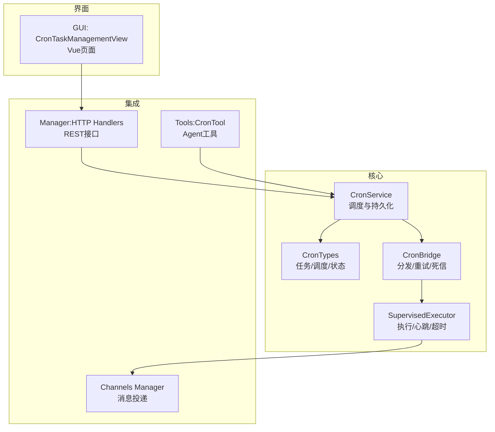
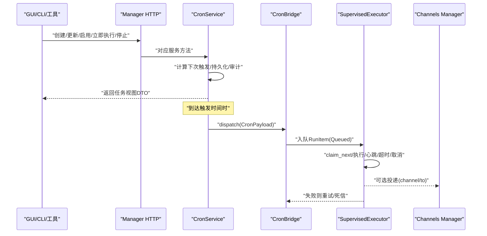
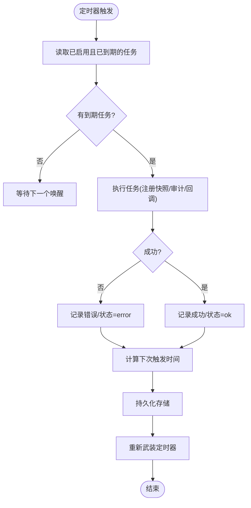
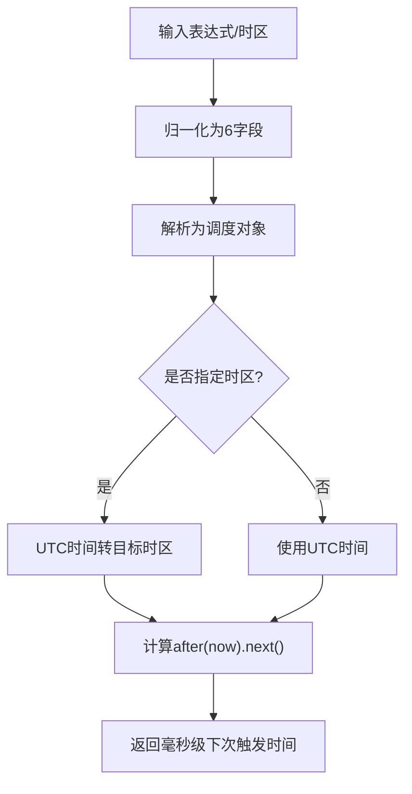
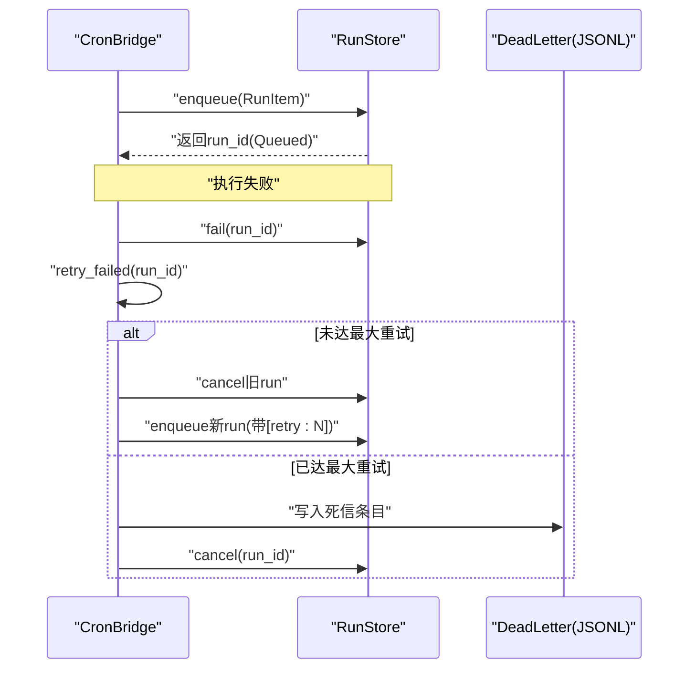
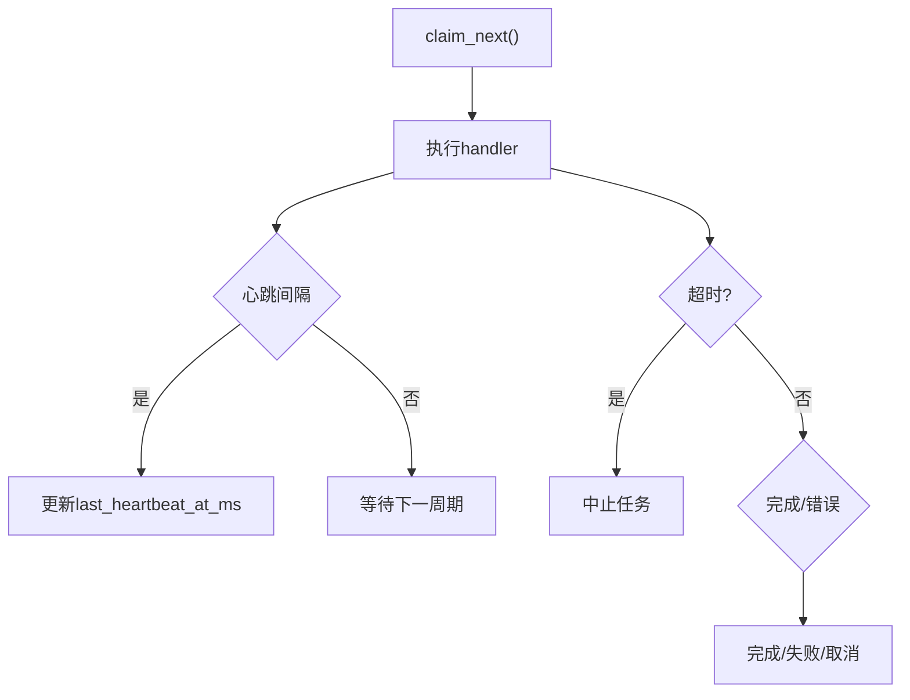
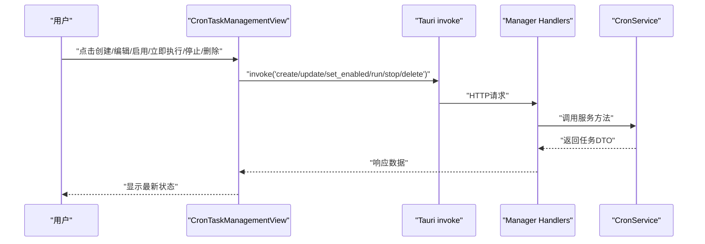
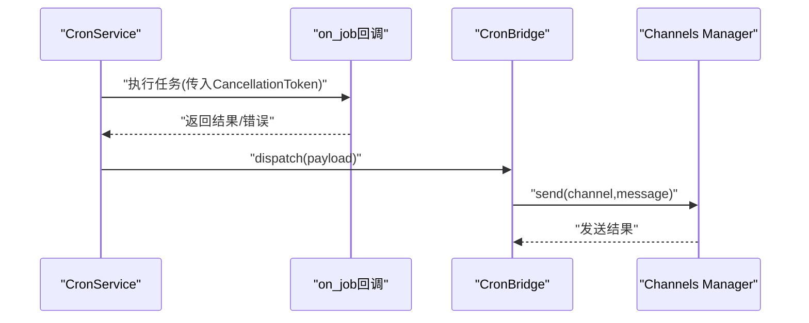
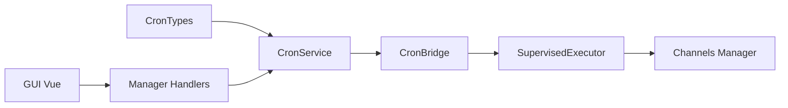

# 定时任务调度

<cite>
**本文引用的文件**
- [agent-diva-core/src/cron/mod.rs](file://agent-diva-core/src/cron/mod.rs)
- [agent-diva-core/src/cron/service.rs](file://agent-diva-core/src/cron/service.rs)
- [agent-diva-core/src/cron/types.rs](file://agent-diva-core/src/cron/types.rs)
- [agent-diva-core/src/scheduler/bridge.rs](file://agent-diva-core/src/scheduler/bridge.rs)
- [agent-diva-core/src/supervised/executor.rs](file://agent-diva-core/src/supervised/executor.rs)
- [agent-diva-tools/src/cron.rs](file://agent-diva-tools/src/cron.rs)
- [agent-diva-manager/src/handlers.rs](file://agent-diva-manager/src/handlers.rs)
- [agent-diva-gui/src/components/CronTaskManagementView.vue](file://agent-diva-gui/src/components/CronTaskManagementView.vue)
- [agent-diva-channels/src/manager.rs](file://agent-diva-channels/src/manager.rs)
</cite>

## 目录
1. [简介](#简介)
2. [项目结构](#项目结构)
3. [核心组件](#核心组件)
4. [架构总览](#架构总览)
5. [详细组件分析](#详细组件分析)
6. [依赖关系分析](#依赖关系分析)
7. [性能与并发控制](#性能与并发控制)
8. [故障排查指南](#故障排查指南)
9. [结论](#结论)
10. [附录：配置示例与最佳实践](#附录：配置示例与最佳实践)

## 简介
本文件面向 Agent Diva 的定时任务调度系统，系统性说明 Cron 表达式语法、时区处理、任务优先级管理、任务的创建/调度/执行/结果通知机制、持久化、失败重试、监控告警、CLI/GUI 管理方式、外部钩子与消息投递集成，以及生产环境的部署与维护建议。文档既适合初学者理解定时任务基本概念，也为运维人员提供可操作的排障与优化指导。

## 项目结构
Agent Diva 的定时任务能力由核心模块、调度桥接、执行器、工具封装、管理器 HTTP 接口和 GUI 共同组成：
- 核心调度：CronService 负责解析调度策略、计算下次触发时间、维护运行中任务、持久化状态并驱动定时器。
- 类型定义：CronSchedule、CronPayload、CronJob、CronStore 等描述任务结构与运行时快照。
- 调度桥接：CronBridge 将 cron 触发转换为受监督的运行项（RunItem），并提供失败重试与死信队列。
- 执行器：Supervised Executor 负责领取、执行、心跳、超时与取消。
- 工具封装：CronTool 暴露给 Agent 的工具层，便于通过自然语言或工具调用创建与管理任务。
- 管理器接口：HTTP 处理器暴露增删改查、启停、立即执行等操作。
- GUI：Vue 页面提供可视化任务管理、筛选、搜索、实时轮询与操作按钮。
- 通道：Channels Manager 支持按 channel/to 进行消息投递。



图表来源
- [agent-diva-core/src/cron/service.rs:176-274](file://agent-diva-core/src/cron/service.rs#L176-L274)
- [agent-diva-core/src/scheduler/bridge.rs:69-98](file://agent-diva-core/src/scheduler/bridge.rs#L69-L98)
- [agent-diva-core/src/supervised/executor.rs:1-44](file://agent-diva-core/src/supervised/executor.rs#L1-L44)
- [agent-diva-tools/src/cron.rs:255-377](file://agent-diva-tools/src/cron.rs#L255-L377)
- [agent-diva-manager/src/handlers.rs:1087-1155](file://agent-diva-manager/src/handlers.rs#L1087-L1155)
- [agent-diva-gui/src/components/CronTaskManagementView.vue:261-345](file://agent-diva-gui/src/components/CronTaskManagementView.vue#L261-L345)
- [agent-diva-channels/src/manager.rs:682-697](file://agent-diva-channels/src/manager.rs#L682-L697)

章节来源
- [agent-diva-core/src/cron/mod.rs:1-10](file://agent-diva-core/src/cron/mod.rs#L1-L10)
- [agent-diva-core/src/cron/types.rs:1-262](file://agent-diva-core/src/cron/types.rs#L1-L262)
- [agent-diva-core/src/cron/service.rs:1-800](file://agent-diva-core/src/cron/service.rs#L1-L800)
- [agent-diva-core/src/scheduler/bridge.rs:1-472](file://agent-diva-core/src/scheduler/bridge.rs#L1-L472)
- [agent-diva-core/src/supervised/executor.rs:1-275](file://agent-diva-core/src/supervised/executor.rs#L1-L275)
- [agent-diva-tools/src/cron.rs:255-377](file://agent-diva-tools/src/cron.rs#L255-L377)
- [agent-diva-manager/src/handlers.rs:1087-1155](file://agent-diva-manager/src/handlers.rs#L1087-L1155)
- [agent-diva-gui/src/components/CronTaskManagementView.vue:1-683](file://agent-diva-gui/src/components/CronTaskManagementView.vue#L1-L683)
- [agent-diva-channels/src/manager.rs:465-715](file://agent-diva-channels/src/manager.rs#L465-L715)

## 核心组件
- CronService：加载/保存任务存储、计算下次触发时间、启动/停止定时器、执行到期任务、记录审计事件、支持手动触发与停止运行中任务。
- CronTypes：定义调度策略（一次性 at、周期 every、cron 表达式）、任务负载（kind/message/deliver/channel/to）、任务状态与视图 DTO。
- CronBridge：将 CronPayload 分发为 RunItem 入队；失败重试采用指数退避；达到最大重试次数后进入死信队列。
- SupervisedExecutor：领取任务、执行、心跳上报、超时与取消处理。
- Tools:CronTool：通过工具参数 action（add/list/remove 等）管理任务。
- Manager Handlers：HTTP 端点映射到 CronService 的操作（创建、更新、启用/禁用、立即执行、停止运行）。
- GUI：Vue 页面提供任务列表、筛选、搜索、表单创建/编辑、状态展示与操作。
- Channels Manager：根据 payload.channel 与 to 进行消息投递。

章节来源
- [agent-diva-core/src/cron/service.rs:176-800](file://agent-diva-core/src/cron/service.rs#L176-L800)
- [agent-diva-core/src/cron/types.rs:1-262](file://agent-diva-core/src/cron/types.rs#L1-L262)
- [agent-diva-core/src/scheduler/bridge.rs:1-232](file://agent-diva-core/src/scheduler/bridge.rs#L1-L232)
- [agent-diva-core/src/supervised/executor.rs:1-275](file://agent-diva-core/src/supervised/executor.rs#L1-L275)
- [agent-diva-tools/src/cron.rs:255-377](file://agent-diva-tools/src/cron.rs#L255-L377)
- [agent-diva-manager/src/handlers.rs:1087-1155](file://agent-diva-manager/src/handlers.rs#L1087-L1155)
- [agent-diva-gui/src/components/CronTaskManagementView.vue:261-345](file://agent-diva-gui/src/components/CronTaskManagementView.vue#L261-L345)
- [agent-diva-channels/src/manager.rs:682-697](file://agent-diva-channels/src/manager.rs#L682-L697)

## 架构总览
下图展示了从 GUI/CLI/工具到核心调度、再到执行与消息投递的完整链路。



图表来源
- [agent-diva-manager/src/handlers.rs:1087-1155](file://agent-diva-manager/src/handlers.rs#L1087-L1155)
- [agent-diva-core/src/cron/service.rs:176-274](file://agent-diva-core/src/cron/service.rs#L176-L274)
- [agent-diva-core/src/scheduler/bridge.rs:69-98](file://agent-diva-core/src/scheduler/bridge.rs#L69-L98)
- [agent-diva-core/src/supervised/executor.rs:1-275](file://agent-diva-core/src/supervised/executor.rs#L1-L275)
- [agent-diva-channels/src/manager.rs:682-697](file://agent-diva-channels/src/manager.rs#L682-L697)

## 详细组件分析

### CronService 调度与执行流程
- 启动：加载存储、重算下次触发时间、保存、启动定时器。
- 定时器：计算最近唤醒时间，休眠至触发时刻，收集到期任务并逐一执行。
- 执行：注册运行快照、审计开始、调用回调（on_job）、记录时长与结果、更新下次触发时间、清理活跃运行、保存存储、重新武装定时器。
- 生命周期：支持创建、更新、删除、启用/禁用、立即执行、停止运行中任务。



图表来源
- [agent-diva-core/src/cron/service.rs:235-274](file://agent-diva-core/src/cron/service.rs#L235-L274)
- [agent-diva-core/src/cron/service.rs:744-800](file://agent-diva-core/src/cron/service.rs#L744-L800)
- [agent-diva-core/src/cron/service.rs:342-458](file://agent-diva-core/src/cron/service.rs#L342-L458)

章节来源
- [agent-diva-core/src/cron/service.rs:176-800](file://agent-diva-core/src/cron/service.rs#L176-L800)

### Cron 表达式与时区处理
- 表达式归一化：若输入为 5 字段表达式，自动补全秒字段为 0，转为 6 字段格式。
- 时区：支持在调度中指定 tz（如 IANA 时区字符串），解析失败回退 UTC。
- 下次触发计算：基于当前时间与调度策略（at/every/cron）计算下一次执行时间。



图表来源
- [agent-diva-core/src/cron/service.rs:25-81](file://agent-diva-core/src/cron/service.rs#L25-L81)

章节来源
- [agent-diva-core/src/cron/service.rs:25-81](file://agent-diva-core/src/cron/service.rs#L25-L81)
- [agent-diva-core/src/cron/types.rs:5-45](file://agent-diva-core/src/cron/types.rs#L5-L45)

### 任务持久化与状态模型
- 存储：JSON 文件形式，包含版本与任务列表。
- 任务状态：记录下次/上次运行时间、最后状态与错误信息。
- 运行快照：记录 run_id、job_id、开始时间、心跳时间、触发来源、是否可取消。
- 视图 DTO：附加 is_running、active_run、computed_status 等运行时信息。

```mermaid
classDiagram
class CronJob {
+id
+name
+enabled
+schedule
+payload
+state
+createdAtMs
+updatedAtMs
+deleteAfterRun
}
class CronSchedule {
<<enum>>
+At{atMs}
+Every{everyMs}
+Cron{expr,tz}
}
class CronPayload {
+kind
+message
+deliver
+channel
+to
}
class CronJobState {
+nextRunAtMs
+lastRunAtMs
+lastStatus
+lastError
}
class CronStore {
+version
+jobs
}
class CronRunSnapshot {
+run_id
+job_id
+startedAtMs
+lastHeartbeatAtMs
+trigger
+cancelable
}
CronJob --> CronSchedule : "使用"
CronJob --> CronPayload : "包含"
CronJob --> CronJobState : "包含"
CronStore --> CronJob : "持有"
CronRunSnapshot --> CronJob : "关联"
```

图表来源
- [agent-diva-core/src/cron/types.rs:5-163](file://agent-diva-core/src/cron/types.rs#L5-L163)

章节来源
- [agent-diva-core/src/cron/types.rs:78-163](file://agent-diva-core/src/cron/types.rs#L78-L163)
- [agent-diva-core/src/cron/service.rs:119-174](file://agent-diva-core/src/cron/service.rs#L119-L174)

### 失败重试与死信队列
- 重试策略：对失败的运行项进行指数退避重试，消息前缀记录重试次数。
- 上限与死信：超过最大重试次数后，将任务移至死信队列并标记为取消。
- 链接 Todo：当 payload.deliver=true 时，创建关联的 Todo 项以追踪投递。



图表来源
- [agent-diva-core/src/scheduler/bridge.rs:69-232](file://agent-diva-core/src/scheduler/bridge.rs#L69-L232)

章节来源
- [agent-diva-core/src/scheduler/bridge.rs:100-232](file://agent-diva-core/src/scheduler/bridge.rs#L100-L232)

### 执行器与心跳/超时/取消
- 心跳：周期性上报心跳时间，用于监控运行健康度。
- 超时：执行任务设置超时，超时后中止任务并返回超时结果。
- 取消：支持外部取消（如 GUI 停止运行），执行器监听取消信号并终止任务。



图表来源
- [agent-diva-core/src/supervised/executor.rs:1-44](file://agent-diva-core/src/supervised/executor.rs#L1-L44)
- [agent-diva-core/src/supervised/executor.rs:247-275](file://agent-diva-core/src/supervised/executor.rs#L247-L275)

章节来源
- [agent-diva-core/src/supervised/executor.rs:1-275](file://agent-diva-core/src/supervised/executor.rs#L1-L275)

### CLI 与 GUI 管理
- CLI：通过工具层 CronTool 暴露 add/list/remove 等操作，便于自动化脚本或 Agent 内部调用。
- GUI：Vue 页面提供任务列表、筛选（活动/计划/全部）、搜索、创建/编辑表单、立即执行、停止运行、删除等操作，并每 5 秒轮询刷新状态。



图表来源
- [agent-diva-gui/src/components/CronTaskManagementView.vue:261-345](file://agent-diva-gui/src/components/CronTaskManagementView.vue#L261-L345)
- [agent-diva-manager/src/handlers.rs:1087-1155](file://agent-diva-manager/src/handlers.rs#L1087-L1155)
- [agent-diva-tools/src/cron.rs:255-377](file://agent-diva-tools/src/cron.rs#L255-L377)

章节来源
- [agent-diva-gui/src/components/CronTaskManagementView.vue:1-683](file://agent-diva-gui/src/components/CronTaskManagementView.vue#L1-L683)
- [agent-diva-manager/src/handlers.rs:1087-1155](file://agent-diva-manager/src/handlers.rs#L1087-L1155)
- [agent-diva-tools/src/cron.rs:255-377](file://agent-diva-tools/src/cron.rs#L255-L377)

### 外部钩子与消息投递
- 外部钩子：CronService 支持注入 on_job 回调，用于对接业务逻辑（例如触发 agent_turn、调用外部服务等）。
- 消息投递：CronPayload 支持 deliver/channel/to，结合 Channels Manager 实现按渠道与收件人投递。



图表来源
- [agent-diva-core/src/cron/service.rs:342-458](file://agent-diva-core/src/cron/service.rs#L342-L458)
- [agent-diva-core/src/scheduler/bridge.rs:69-98](file://agent-diva-core/src/scheduler/bridge.rs#L69-L98)
- [agent-diva-channels/src/manager.rs:682-697](file://agent-diva-channels/src/manager.rs#L682-L697)

章节来源
- [agent-diva-core/src/cron/service.rs:342-458](file://agent-diva-core/src/cron/service.rs#L342-L458)
- [agent-diva-core/src/scheduler/bridge.rs:69-98](file://agent-diva-core/src/scheduler/bridge.rs#L69-L98)
- [agent-diva-channels/src/manager.rs:682-697](file://agent-diva-channels/src/manager.rs#L682-L697)

## 依赖关系分析
- CronService 依赖 types 定义的任务与调度结构，并通过 store_path 持久化。
- CronBridge 依赖 RunStore 与 JsonlTodoStore，实现任务入队与交付追踪。
- SupervisedExecutor 依赖 RunStore 与 RunHandler，负责执行与状态管理。
- Manager Handlers 依赖 CronService，对外暴露 REST 接口。
- GUI 通过 Tauri invoke 调用后端命令，最终落到 Manager Handlers。
- Channels Manager 作为消息投递后端，被 Bridge 或执行器间接使用。



图表来源
- [agent-diva-core/src/cron/types.rs:1-262](file://agent-diva-core/src/cron/types.rs#L1-L262)
- [agent-diva-core/src/cron/service.rs:176-800](file://agent-diva-core/src/cron/service.rs#L176-L800)
- [agent-diva-core/src/scheduler/bridge.rs:1-232](file://agent-diva-core/src/scheduler/bridge.rs#L1-L232)
- [agent-diva-core/src/supervised/executor.rs:1-275](file://agent-diva-core/src/supervised/executor.rs#L1-L275)
- [agent-diva-manager/src/handlers.rs:1087-1155](file://agent-diva-manager/src/handlers.rs#L1087-L1155)
- [agent-diva-gui/src/components/CronTaskManagementView.vue:261-345](file://agent-diva-gui/src/components/CronTaskManagementView.vue#L261-L345)
- [agent-diva-channels/src/manager.rs:682-697](file://agent-diva-channels/src/manager.rs#L682-L697)

章节来源
- [agent-diva-core/src/cron/mod.rs:1-10](file://agent-diva-core/src/cron/mod.rs#L1-L10)
- [agent-diva-core/src/cron/service.rs:176-800](file://agent-diva-core/src/cron/service.rs#L176-L800)
- [agent-diva-core/src/scheduler/bridge.rs:1-232](file://agent-diva-core/src/scheduler/bridge.rs#L1-L232)
- [agent-diva-core/src/supervised/executor.rs:1-275](file://agent-diva-core/src/supervised/executor.rs#L1-L275)
- [agent-diva-manager/src/handlers.rs:1087-1155](file://agent-diva-manager/src/handlers.rs#L1087-L1155)
- [agent-diva-gui/src/components/CronTaskManagementView.vue:261-345](file://agent-diva-gui/src/components/CronTaskManagementView.vue#L261-L345)
- [agent-diva-channels/src/manager.rs:682-697](file://agent-diva-channels/src/manager.rs#L682-L697)

## 性能与并发控制
- 定时器效率：仅对已启用且存在 next_run_at_ms 的任务进行过滤，取最小值作为唤醒时间，避免无谓扫描。
- 并发限制：SupervisedExecutor 通过心跳与超时控制单个任务资源占用；对于批量任务，建议在更上层引入并发限制（参考研究文档中的 ConcurrencyManager 思路）。
- 重试退避：指数退避减少瞬时压力，防止雪崩。
- 存储 IO：持久化采用 JSON 序列化与异步写入，注意大任务量下的磁盘 IO 影响。
- 建议：
  - 合理设置 every_ms 与 cron 表达式，避免过短周期导致高频触发。
  - 对长耗时任务设置超时与取消，避免阻塞调度器。
  - 监控 dead_letters.jsonl，及时处理异常任务。
  - 在高并发场景下，考虑引入按 provider/model 的限流与队列管理。

章节来源
- [agent-diva-core/src/cron/service.rs:223-274](file://agent-diva-core/src/cron/service.rs#L223-L274)
- [agent-diva-core/src/supervised/executor.rs:1-44](file://agent-diva-core/src/supervised/executor.rs#L1-L44)
- [agent-diva-core/src/scheduler/bridge.rs:100-232](file://agent-diva-core/src/scheduler/bridge.rs#L100-L232)

## 故障排查指南
- 任务不触发：
  - 检查 enabled 与 next_run_at_ms 是否正确计算。
  - 确认 cron 表达式与 tz 配置有效。
- 任务执行失败：
  - 查看 last_error 与审计事件（CronJobFailed）。
  - 检查重试次数与死信队列（dead_letters.jsonl）。
- 任务卡住：
  - 观察 active_run.last_heartbeat_at_ms 是否持续更新。
  - 使用 stop_cron_job_run 取消运行。
- 消息未投递：
  - 校验 payload.deliver/channel/to 配置。
  - 检查 Channels Manager 是否初始化对应渠道。

章节来源
- [agent-diva-core/src/cron/service.rs:342-458](file://agent-diva-core/src/cron/service.rs#L342-L458)
- [agent-diva-core/src/scheduler/bridge.rs:100-232](file://agent-diva-core/src/scheduler/bridge.rs#L100-L232)
- [agent-diva-core/src/supervised/executor.rs:247-275](file://agent-diva-core/src/supervised/executor.rs#L247-L275)
- [agent-diva-channels/src/manager.rs:682-697](file://agent-diva-channels/src/manager.rs#L682-L697)

## 结论
Agent Diva 的定时任务调度系统提供了完整的任务生命周期管理能力：从灵活的调度策略（含 Cron 表达式与时区）、可靠的持久化、健壮的重试与死信机制，到可视化的 GUI 管理与可扩展的消息投递。通过合理的配置与监控，可在生产环境中稳定运行并满足多样化需求。

## 附录：配置示例与最佳实践
- 调度策略选择：
  - 一次性任务：使用 at（精确时间点）。
  - 周期任务：使用 every（毫秒间隔）。
  - 复杂周期：使用 cron 表达式，必要时指定 tz。
- 任务负载：
  - kind：默认 agent_turn，可按需扩展。
  - message：任务内容，支持投递到渠道。
  - deliver/channel/to：开启投递并指定渠道与收件人。
- 执行策略调优：
  - 设置合理超时与取消，避免长时间占用资源。
  - 调整重试次数与退避策略，平衡可靠性与资源消耗。
- 监控告警：
  - 关注 CronJobStarted/CronJobCompleted/CronJobFailed 审计事件。
  - 定期检查 dead_letters.jsonl 与任务失败率。
- 生产部署：
  - 确保 cron 存储路径可写且具备备份策略。
  - 配置合适的日志级别与监控指标。
  - 对高并发场景引入限流与队列管理。

章节来源
- [agent-diva-core/src/cron/types.rs:5-163](file://agent-diva-core/src/cron/types.rs#L5-L163)
- [agent-diva-core/src/cron/service.rs:176-800](file://agent-diva-core/src/cron/service.rs#L176-L800)
- [agent-diva-core/src/scheduler/bridge.rs:69-232](file://agent-diva-core/src/scheduler/bridge.rs#L69-L232)
- [agent-diva-gui/src/components/CronTaskManagementView.vue:200-237](file://agent-diva-gui/src/components/CronTaskManagementView.vue#L200-L237)