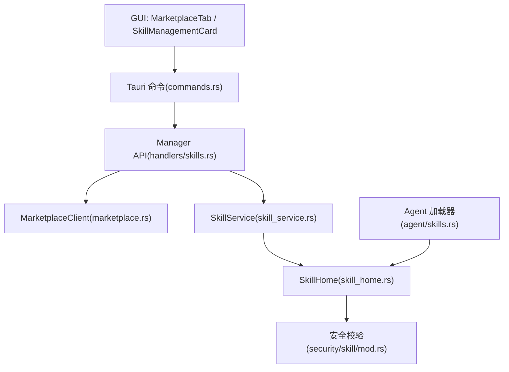
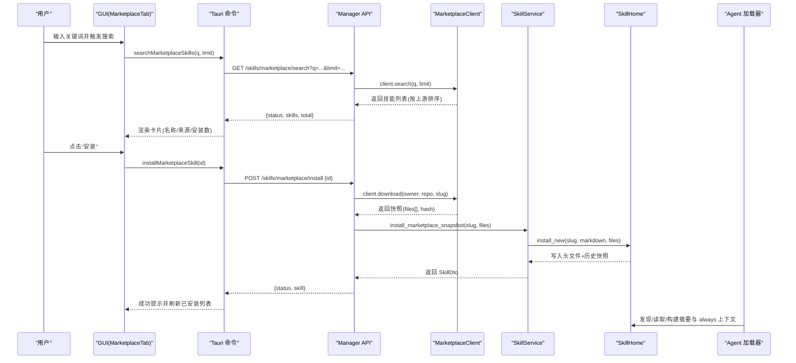
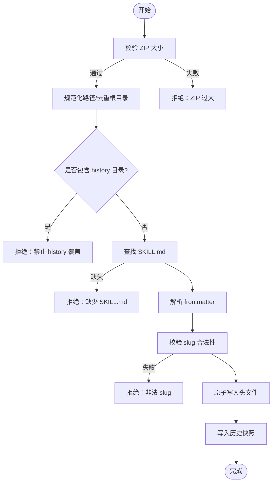
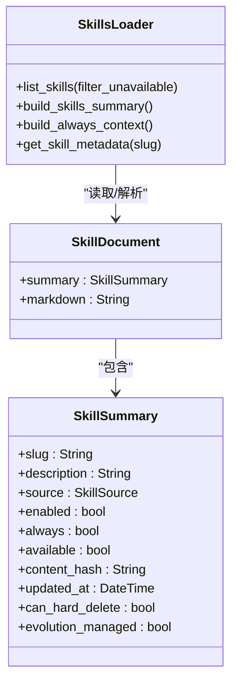
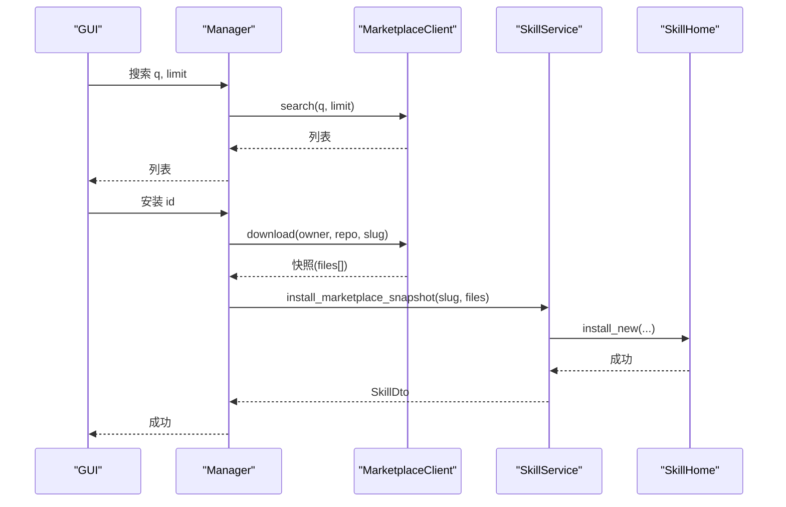
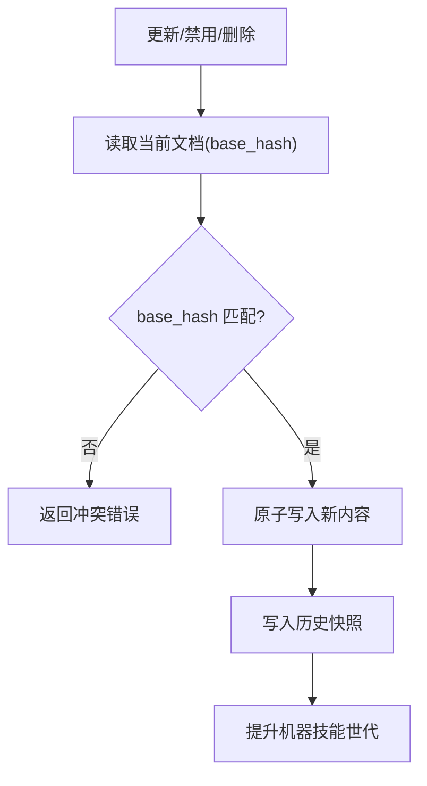
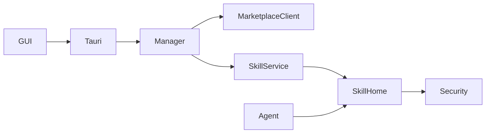

# 技能市场

<cite>
**本文引用的文件**
- [marketplace.rs](file://agent-diva-manager/src/marketplace.rs)
- [skill_service.rs](file://agent-diva-manager/src/skill_service.rs)
- [skills.rs（管理器处理器）](file://agent-diva-manager/src/handlers/skills.rs)
- [skill_home.rs](file://agent-diva-core/src/evolution/skill_home.rs)
- [skills.rs（加载器）](file://agent-diva-agent/src/skills.rs)
- [mod.rs（安全校验）](file://agent-diva-core/src/security/skill/mod.rs)
- [MarketplaceTab.vue](file://agent-diva-gui/src/components/settings/MarketplaceTab.vue)
- [SkillManagementCard.vue](file://agent-diva-gui/src/components/settings/SkillManagementCard.vue)
- [en.ts（国际化文案）](file://agent-diva-gui/src/locales/en.ts)
- [commands.rs（Tauri 命令）](file://agent-diva-gui/src-tauri/src/commands.rs)
- [acceptance.md（验收文档）](file://docs/logs/2026-08-skill-marketplace/v0.1.0-skills-sh-marketplace-adapter/acceptance.md)
</cite>

## 目录
1. [简介](#简介)
2. [项目结构](#项目结构)
3. [核心组件](#核心组件)
4. [架构总览](#架构总览)
5. [详细组件分析](#详细组件分析)
6. [依赖关系分析](#依赖关系分析)
7. [性能考虑](#性能考虑)
8. [故障排查指南](#故障排查指南)
9. [结论](#结论)
10. [附录](#附录)

## 简介
本文件面向 Agent Diva 的“技能市场”能力，覆盖技能包规范、SKILL.md 格式与能力声明、技能发现/安装/更新/卸载生命周期、与 skills.sh 市场的集成、搜索过滤与版本管理、权限控制与依赖检查、冲突解决策略、开发测试发布流程、质量评估与反馈机制，以及 GUI 中的浏览、安装与管理操作。内容兼顾初学者理解与开发者生态指导。

## 项目结构
技能市场由前端 GUI、网关服务（Manager）、核心存储与安全校验、Agent 运行时加载四部分协作完成：
- GUI：提供“已安装/市场”双标签页，支持搜索、展示精选榜单、一键安装与状态提示。
- Manager：暴露 HTTP API，封装 skills.sh 市场客户端、技能安装服务与 SkillHome 操作。
- Core：实现技能家目录（SkillHome）的权威存储、历史版本、请求审批流、路径与内容安全校验。
- Agent：负责技能发现、元数据解析、上下文注入与可用性检查。

图表来源
- [MarketplaceTab.vue:1-200](file://agent-diva-gui/src/components/settings/MarketplaceTab.vue#L1-L200)
- [commands.rs:4113-4145](file://agent-diva-gui/src-tauri/src/commands.rs#L4113-L4145)
- [skills.rs（管理器处理器）:85-138](file://agent-diva-manager/src/handlers/skills.rs#L85-L138)
- [marketplace.rs:108-186](file://agent-diva-manager/src/marketplace.rs#L108-L186)
- [skill_service.rs:98-157](file://agent-diva-manager/src/skill_service.rs#L98-L157)
- [skill_home.rs:245-438](file://agent-diva-core/src/evolution/skill_home.rs#L245-L438)
- [mod.rs（安全校验）:84-146](file://agent-diva-core/src/security/skill/mod.rs#L84-L146)

章节来源
- [MarketplaceTab.vue:1-200](file://agent-diva-gui/src/components/settings/MarketplaceTab.vue#L1-L200)
- [SkillManagementCard.vue:1-51](file://agent-diva-gui/src/components/settings/SkillManagementCard.vue#L1-L51)
- [commands.rs:4113-4145](file://agent-diva-gui/src-tauri/src/commands.rs#L4113-L4145)
- [skills.rs（管理器处理器）:85-138](file://agent-diva-manager/src/handlers/skills.rs#L85-L138)
- [marketplace.rs:108-186](file://agent-diva-manager/src/marketplace.rs#L108-L186)
- [skill_service.rs:98-157](file://agent-diva-manager/src/skill_service.rs#L98-L157)
- [skill_home.rs:245-438](file://agent-diva-core/src/evolution/skill_home.rs#L245-L438)
- [mod.rs（安全校验）:84-146](file://agent-diva-core/src/security/skill/mod.rs#L84-L146)

## 核心组件
- 市场客户端（MarketplaceClient）：对接 skills.sh 的搜索与下载接口，支持超时、UA、错误体解析与参数限制。
- 技能服务（SkillService）：统一 ZIP 上传与快照安装入口，执行大小限制、路径规范化、history 保护、SKILL.md 必需等校验。
- 技能家目录（SkillHome）：机器级权威存储，提供列表、读取、CAS 更新、禁用、硬删除、历史版本、请求审批流。
- 安全校验（security/skill）：ZIP 大小上限、SKILL.md 最小长度、always 注入预算、可信来源判定。
- Agent 加载器（SkillsLoader）：发现技能、构建摘要、加载 always 上下文、解析 frontmatter 与依赖要求。
- GUI 市场页（MarketplaceTab）：搜索防抖、按安装量排序、已安装态识别、安装按钮状态机、错误重试。

章节来源
- [marketplace.rs:108-186](file://agent-diva-manager/src/marketplace.rs#L108-L186)
- [skill_service.rs:98-157](file://agent-diva-manager/src/skill_service.rs#L98-L157)
- [skill_home.rs:245-438](file://agent-diva-core/src/evolution/skill_home.rs#L245-L438)
- [mod.rs（安全校验）:84-146](file://agent-diva-core/src/security/skill/mod.rs#L84-L146)
- [skills.rs（加载器）:57-165](file://agent-diva-agent/src/skills.rs#L57-L165)
- [MarketplaceTab.vue:56-134](file://agent-diva-gui/src/components/settings/MarketplaceTab.vue#L56-L134)

## 架构总览
技能从市场到运行的端到端流程如下：

图表来源
- [MarketplaceTab.vue:56-134](file://agent-diva-gui/src/components/settings/MarketplaceTab.vue#L56-L134)
- [commands.rs:4113-4145](file://agent-diva-gui/src-tauri/src/commands.rs#L4113-L4145)
- [skills.rs（管理器处理器）:85-138](file://agent-diva-manager/src/handlers/skills.rs#L85-L138)
- [marketplace.rs:130-186](file://agent-diva-manager/src/marketplace.rs#L130-L186)
- [skill_service.rs:118-157](file://agent-diva-manager/src/skill_service.rs#L118-L157)
- [skill_home.rs:384-438](file://agent-diva-core/src/evolution/skill_home.rs#L384-L438)
- [skills.rs（加载器）:87-165](file://agent-diva-agent/src/skills.rs#L87-L165)

## 详细组件分析

### 技能包结构与 SKILL.md 规范
- 包根必须包含 SKILL.md；其他文件作为资源随包安装。
- SKILL.md 使用 YAML frontmatter 描述元信息（如 name、description、homepage、enabled、always、metadata）。
- 系统会解析 frontmatter 并生成摘要；always 注入受字符与数量预算限制。
- 安装时强制校验：
  - 必须存在 SKILL.md；
  - 禁止 history 目录被覆盖或伪造；
  - 路径规范化防止穿越；
  - ZIP 总大小限制；
  - slug 合法性校验。

图表来源
- [skill_service.rs:185-230](file://agent-diva-manager/src/skill_service.rs#L185-L230)
- [skill_service.rs:268-298](file://agent-diva-manager/src/skill_service.rs#L268-L298)
- [skill_home.rs:384-438](file://agent-diva-core/src/evolution/skill_home.rs#L384-L438)
- [mod.rs（安全校验）:84-113](file://agent-diva-core/src/security/skill/mod.rs#L84-L113)

章节来源
- [skill_service.rs:98-157](file://agent-diva-manager/src/skill_service.rs#L98-L157)
- [skill_service.rs:185-230](file://agent-diva-manager/src/skill_service.rs#L185-L230)
- [skill_home.rs:384-438](file://agent-diva-core/src/evolution/skill_home.rs#L384-L438)
- [mod.rs（安全校验）:84-113](file://agent-diva-core/src/security/skill/mod.rs#L84-L113)

### 能力声明与依赖检查
- 在 SKILL.md 的 frontmatter.metadata 中可声明运行依赖（如 bins、env），支持 JSON 或 YAML 两种形式。
- 加载时会检测依赖是否满足（二进制是否存在、环境变量是否齐全），不满足则标记为不可用，避免影响上下文。
- 该能力声明用于“可用性与环境适配”，非执行权限控制。

图表来源
- [skills.rs（加载器）:57-165](file://agent-diva-agent/src/skills.rs#L57-L165)
- [skill_home.rs:46-67](file://agent-diva-core/src/evolution/skill_home.rs#L46-L67)

章节来源
- [skills.rs（加载器）:168-261](file://agent-diva-agent/src/skills.rs#L168-L261)
- [skill_home.rs:46-67](file://agent-diva-core/src/evolution/skill_home.rs#L46-L67)

### 与 skills.sh 市场的集成
- 搜索：GET /api/search?q=...&limit=...，默认 20，最大 50；结果按上游排序，GUI 侧再按安装量降序显示。
- 下载：GET /api/download/{owner}/{repo}/{slug}，返回文件快照（files[] 与 hash）。
- 精选榜单：内置离线 YAML 快照，无需网络即可展示。
- 环境变量：可通过 AGENT_DIVA_SKILLS_MARKETPLACE_URL 指定镜像地址。

图表来源
- [marketplace.rs:130-186](file://agent-diva-manager/src/marketplace.rs#L130-L186)
- [skills.rs（管理器处理器）:85-138](file://agent-diva-manager/src/handlers/skills.rs#L85-L138)
- [skill_service.rs:118-157](file://agent-diva-manager/src/skill_service.rs#L118-L157)

章节来源
- [marketplace.rs:130-186](file://agent-diva-manager/src/marketplace.rs#L130-L186)
- [skills.rs（管理器处理器）:85-138](file://agent-diva-manager/src/handlers/skills.rs#L85-L138)
- [acceptance.md:1-31](file://docs/logs/2026-08-skill-marketplace/v0.1.0-skills-sh-marketplace-adapter/acceptance.md#L1-L31)

### 搜索过滤与版本管理
- 搜索过滤：前端最少 2 字符触发搜索，防抖 300ms；后端校验长度并透传 limit；结果按安装量排序展示。
- 版本管理：
  - 每次写入头文件都会生成历史快照（revision 递增），支持查询历史与回滚。
  - 更新/禁用/删除均基于 CAS（base_hash）保证一致性。
  - 接受/拒绝请求后，若当前内容与提议不一致，请求会被标记为过期。

图表来源
- [skill_home.rs:314-342](file://agent-diva-core/src/evolution/skill_home.rs#L314-L342)
- [skill_home.rs:344-382](file://agent-diva-core/src/evolution/skill_home.rs#L344-L382)
- [skill_home.rs:657-679](file://agent-diva-core/src/evolution/skill_home.rs#L657-L679)

章节来源
- [MarketplaceTab.vue:56-91](file://agent-diva-gui/src/components/settings/MarketplaceTab.vue#L56-L91)
- [skills.rs（管理器处理器）:148-182](file://agent-diva-manager/src/handlers/skills.rs#L148-L182)
- [skill_home.rs:314-382](file://agent-diva-core/src/evolution/skill_home.rs#L314-L382)
- [skill_home.rs:657-679](file://agent-diva-core/src/evolution/skill_home.rs#L657-L679)

### 权限控制、依赖管理与冲突解决
- 权限控制：
  - 仅 trusted 来源的技能可自动注入；review/untrusted 需人工批准。
  - 安装过程严格校验路径与内容，禁止覆盖 history、禁止穿越、限制大小。
- 依赖管理：
  - 通过 metadata.requires.bins/env 声明，加载时检测可用性，不可用时标记为不可用。
- 冲突解决：
  - Home 覆盖 Builtin；同名 Home 已存在则拒绝安装。
  - 更新/禁用/删除采用 CAS（base_hash）冲突即失败。
  - 请求接受时若 base_hash 与当前不一致，请求标记为过期。

章节来源
- [mod.rs（安全校验）:140-146](file://agent-diva-core/src/security/skill/mod.rs#L140-L146)
- [skill_service.rs:118-157](file://agent-diva-manager/src/skill_service.rs#L118-L157)
- [skill_home.rs:384-438](file://agent-diva-core/src/evolution/skill_home.rs#L384-L438)
- [skill_home.rs:557-588](file://agent-diva-core/src/evolution/skill_home.rs#L557-L588)

### 技能开发生态：开发、测试与发布
- 开发：
  - 准备 SKILL.md（含必要 frontmatter）与可选资源文件；确保 slug 合法、内容充实。
  - 本地打包为 ZIP（根目录包含 SKILL.md），通过“上传 ZIP”安装到本地工作区。
- 测试：
  - 使用单元测试验证 ZIP 解析、路径规范化、history 保护、slug 校验、快照安装等。
  - 使用 e2e 验收流程验证搜索、安装、重复安装冲突、网络异常与重试。
- 发布：
  - 将技能提交至 skills.sh 仓库，上架后可通过市场搜索与安装。
  - 维护者可通过“请求审批流”对自动化变更进行治理（创建/接受/拒绝请求）。

章节来源
- [skill_service.rs:320-453](file://agent-diva-manager/src/skill_service.rs#L320-L453)
- [acceptance.md:1-31](file://docs/logs/2026-08-skill-marketplace/v0.1.0-skills-sh-marketplace-adapter/acceptance.md#L1-L31)
- [skill_home.rs:496-588](file://agent-diva-core/src/evolution/skill_home.rs#L496-L588)

### 质量评估、用户反馈与社区贡献
- 质量评估：
  - 安装前校验：ZIP 大小、SKILL.md 最小长度、路径安全、slug 合法性。
  - 运行时约束：always 注入字符与数量预算，避免上下文膨胀。
- 用户反馈：
  - GUI 提供错误提示与重试；安装成功后刷新已安装列表。
  - 市场页面展示安装量与来源，辅助选择高质量技能。
- 社区贡献：
  - 通过 skills.sh 公开仓库贡献技能；管理员可通过请求审批流治理自动化变更。

章节来源
- [mod.rs（安全校验）:25-35](file://agent-diva-core/src/security/skill/mod.rs#L25-L35)
- [mod.rs（安全校验）:84-138](file://agent-diva-core/src/security/skill/mod.rs#L84-L138)
- [MarketplaceTab.vue:154-193](file://agent-diva-gui/src/components/settings/MarketplaceTab.vue#L154-L193)
- [en.ts:477-510](file://agent-diva-gui/src/locales/en.ts#L477-L510)

### GUI 中的浏览、安装与管理
- 浏览：
  - “市场”标签页支持搜索与精选榜单；搜索结果按安装量排序。
  - “已安装”标签页展示本地技能，支持编辑、停用、历史查看。
- 安装：
  - 点击“安装”后进入“安装中...”状态，成功后变为“已安装”并禁用按钮；重复安装返回冲突提示。
  - 预览模式下仅展示 UI，不实际调用后端。
- 管理：
  - 通过设置面板切换标签页；在“已安装”中进行启用/禁用、删除等操作。

章节来源
- [SkillManagementCard.vue:1-51](file://agent-diva-gui/src/components/settings/SkillManagementCard.vue#L1-L51)
- [MarketplaceTab.vue:1-200](file://agent-diva-gui/src/components/settings/MarketplaceTab.vue#L1-L200)
- [en.ts:477-510](file://agent-diva-gui/src/locales/en.ts#L477-L510)

## 依赖关系分析
- GUI 依赖 Tauri 命令以调用后端 API。
- Manager 依赖 marketplace 客户端访问外部市场，依赖 SkillService 进行安装与校验。
- SkillService 依赖 SkillHome 进行持久化与版本管理。
- Agent 依赖 SkillHome 进行发现与上下文构建。
- 安全模块贯穿安装与注入阶段，保障尺寸、内容与预算合规。

图表来源
- [commands.rs:4113-4145](file://agent-diva-gui/src-tauri/src/commands.rs#L4113-L4145)
- [skills.rs（管理器处理器）:85-138](file://agent-diva-manager/src/handlers/skills.rs#L85-L138)
- [marketplace.rs:108-186](file://agent-diva-manager/src/marketplace.rs#L108-L186)
- [skill_service.rs:98-157](file://agent-diva-manager/src/skill_service.rs#L98-L157)
- [skill_home.rs:245-438](file://agent-diva-core/src/evolution/skill_home.rs#L245-L438)
- [mod.rs（安全校验）:84-146](file://agent-diva-core/src/security/skill/mod.rs#L84-L146)

章节来源
- [commands.rs:4113-4145](file://agent-diva-gui/src-tauri/src/commands.rs#L4113-L4145)
- [skills.rs（管理器处理器）:85-138](file://agent-diva-manager/src/handlers/skills.rs#L85-L138)
- [marketplace.rs:108-186](file://agent-diva-manager/src/marketplace.rs#L108-L186)
- [skill_service.rs:98-157](file://agent-diva-manager/src/skill_service.rs#L98-L157)
- [skill_home.rs:245-438](file://agent-diva-core/src/evolution/skill_home.rs#L245-L438)
- [mod.rs（安全校验）:84-146](file://agent-diva-core/src/security/skill/mod.rs#L84-L146)

## 性能考虑
- 搜索防抖：前端 300ms 防抖减少无效请求。
- 限制与超时：市场客户端设置连接与请求超时，限制搜索上限，避免长尾请求。
- 上下文预算：always 注入限制字符总数与数量，避免上下文膨胀影响推理性能。
- 原子写入与历史快照：减少并发写冲突，提高一致性与可恢复性。

[本节为通用指导，不直接分析具体文件]

## 故障排查指南
- 搜索无结果：
  - 确认关键词至少 2 个字符；检查网络连接与上游市场可用性；可使用“重试”按钮。
- 安装失败：
  - 常见原因：ZIP 过大、缺少 SKILL.md、路径非法、slug 不合法、目标已存在；查看错误提示并修正。
- 重复安装冲突：
  - 同一 slug 已存在会拒绝覆盖；如需更新请使用更新接口并提供正确的 base_hash。
- 无法注入/不可用：
  - 检查依赖（bins/env）是否满足；查看技能元数据与可用性标志。
- 历史回滚：
  - 通过历史列表查看修订版，使用更新接口恢复到期望版本。

章节来源
- [MarketplaceTab.vue:56-134](file://agent-diva-gui/src/components/settings/MarketplaceTab.vue#L56-L134)
- [skill_service.rs:185-230](file://agent-diva-manager/src/skill_service.rs#L185-L230)
- [skill_home.rs:314-382](file://agent-diva-core/src/evolution/skill_home.rs#L314-L382)
- [skills.rs（加载器）:200-261](file://agent-diva-agent/src/skills.rs#L200-L261)

## 结论
Agent Diva 的技能市场提供了从发现、安装到运行的一体化能力，结合严格的校验与版本管理，确保技能的安全与稳定。通过 GUI 的直观交互与 Manager 的稳健后端，用户可以轻松浏览与安装技能，开发者可以遵循规范快速开发与发布技能。安全与预算控制保障了系统的健壮性，请求审批流为自动化演进提供了治理手段。

[本节为总结，不直接分析具体文件]

## 附录
- 环境变量：AGENT_DIVA_SKILLS_MARKETPLACE_URL 可配置市场镜像地址。
- 常用路径：
  - 技能家目录：{config_dir}/skills/<slug>/SKILL.md
  - 历史目录：<slug>/history/<revision>.md
  - 请求目录：<slug>/requests/<uuid>.json

章节来源
- [marketplace.rs:14-19](file://agent-diva-manager/src/marketplace.rs#L14-L19)
- [skill_home.rs:23-26](file://agent-diva-core/src/evolution/skill_home.rs#L23-L26)
- [skill_home.rs:681-709](file://agent-diva-core/src/evolution/skill_home.rs#L681-L709)