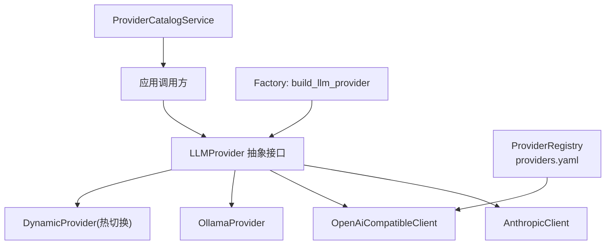
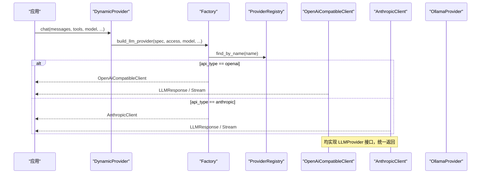
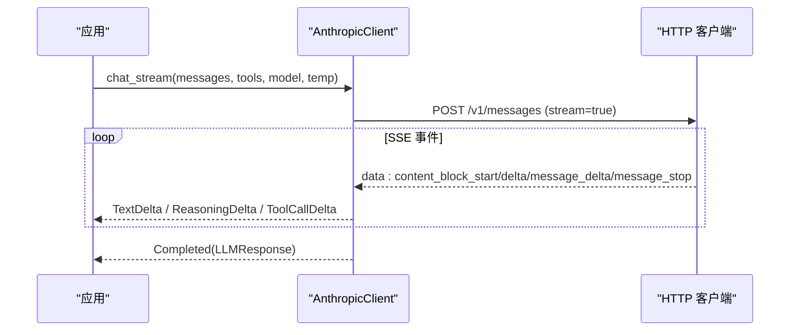
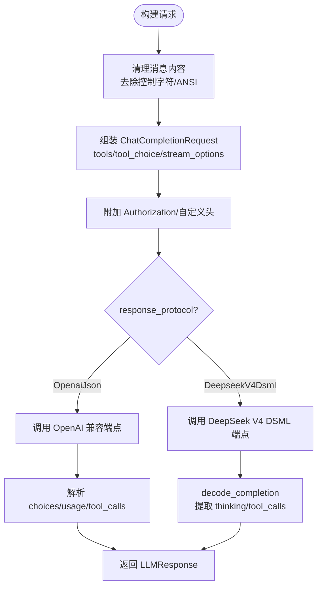
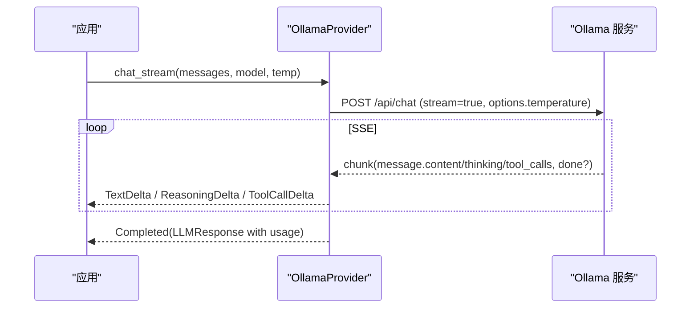
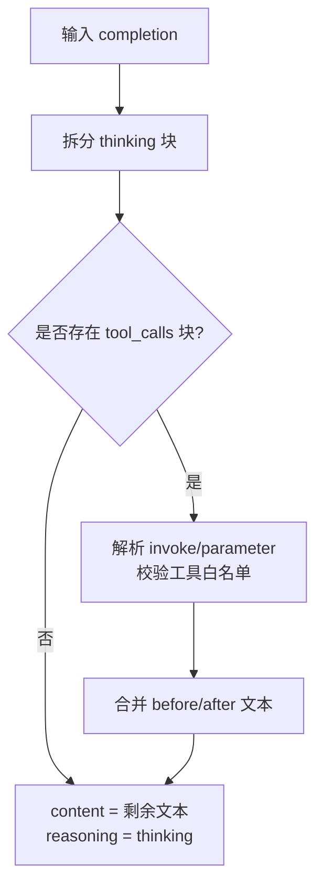
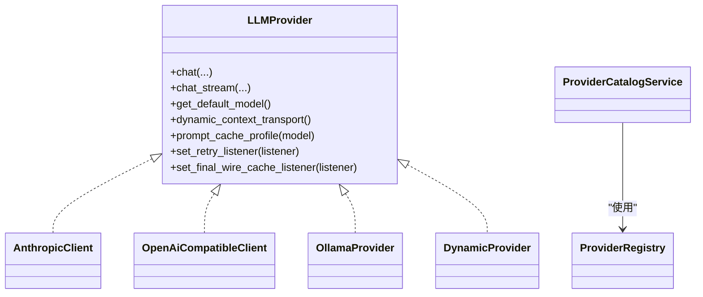

# 内置提供商

<cite>
**本文引用的文件**
- [lib.rs](file://agent-diva-providers/src/lib.rs)
- [factory.rs](file://agent-diva-providers/src/factory.rs)
- [registry.rs](file://agent-diva-providers/src/registry.rs)
- [base.rs](file://agent-diva-providers/src/base.rs)
- [catalog.rs](file://agent-diva-providers/src/catalog.rs)
- [anthropic.rs](file://agent-diva-providers/src/anthropic.rs)
- [openai_compatible.rs](file://agent-diva-providers/src/openai_compatible.rs)
- [ollama.rs](file://agent-diva-providers/src/ollama.rs)
- [deepseek_v4_dsml.rs](file://agent-diva-providers/src/deepseek_v4_dsml.rs)
- [providers.yaml](file://agent-diva-providers/src/providers.yaml)
</cite>

## 目录
1. [简介](#简介)
2. [项目结构](#项目结构)
3. [核心组件](#核心组件)
4. [架构总览](#架构总览)
5. [详细组件分析](#详细组件分析)
6. [依赖关系分析](#依赖关系分析)
7. [性能与可靠性](#性能与可靠性)
8. [故障排查指南](#故障排查指南)
9. [结论](#结论)
10. [附录：配置与最佳实践](#附录配置与最佳实践)

## 简介
本文件面向 Agent Diva 的内置 LLM 提供商，系统性说明 Anthropic、OpenAI 兼容接口、Ollama、DeepSeek V4 DSML 等核心提供商的实现原理、配置方法、认证方式、模型能力、功能特性与性能特点。文档同时解释 OpenAI 兼容接口的通用实现如何统一对接多种 LLM 服务，并提供错误处理、限流控制与负载均衡的最佳实践。内容兼顾初学者入门与高级用户的深度定制需求。

## 项目结构
Agent Diva 的提供商层位于 agent-diva-providers 模块，采用“抽象接口 + 多实现”的分层设计：
- 抽象层：定义统一的 LLMProvider 接口、消息/响应/事件类型、错误分类与能力探测。
- 注册与发现：ProviderRegistry 提供默认提供商元数据；ProviderCatalogService 负责视图展示与模型目录聚合。
- 工厂与动态切换：build_llm_provider 根据 API 类型构建具体客户端；DynamicProvider 支持运行时热切换。
- 具体实现：Anthropic 原生 Messages API、OpenAI 兼容 HTTP 客户端、Ollama 本地推理、DeepSeek V4 DSML 协议解码。

图表来源
- [lib.rs:46-124](file://agent-diva-providers/src/lib.rs#L46-L124)
- [factory.rs:23-70](file://agent-diva-providers/src/factory.rs#L23-L70)
- [registry.rs:73-108](file://agent-diva-providers/src/registry.rs#L73-L108)
- [catalog.rs:71-193](file://agent-diva-providers/src/catalog.rs#L71-L193)

章节来源
- [lib.rs:1-124](file://agent-diva-providers/src/lib.rs#L1-L124)
- [registry.rs:1-200](file://agent-diva-providers/src/registry.rs#L1-L200)
- [catalog.rs:1-193](file://agent-diva-providers/src/catalog.rs#L1-L193)

## 核心组件
- LLMProvider 抽象接口：统一 chat/chat_stream、默认模型、上下文传输策略、提示缓存策略、重试监听器与最终请求快照监听器。
- 消息与事件：Message、MessageContent（文本或多模态片段）、ToolCallRequest、LLMResponse、LLMStreamEvent（增量文本/思考/工具调用/完成）。
- 错误体系：ProviderError 包含 HTTP、JSON、无效响应、API 错误、配置错误、限流；并映射到可重试/超时/致命等类别。
- 能力探测：按模型 ID 推断是否支持视觉、工具调用、推理能力，以及上下文窗口大小。
- 注册表与目录：ProviderSpec 描述提供商元数据（名称、API 类型、环境变量键、默认模型、默认 base、模型列表、提示缓存支持等）；ProviderCatalogService 提供视图与模型目录合并。

章节来源
- [base.rs:10-80](file://agent-diva-providers/src/base.rs#L10-L80)
- [base.rs:131-264](file://agent-diva-providers/src/base.rs#L131-L264)
- [base.rs:384-425](file://agent-diva-providers/src/base.rs#L384-L425)
- [base.rs:708-780](file://agent-diva-providers/src/base.rs#L708-L780)
- [registry.rs:17-50](file://agent-diva-providers/src/registry.rs#L17-L50)
- [catalog.rs:24-57](file://agent-diva-providers/src/catalog.rs#L24-L57)

## 架构总览
整体流程：上层通过 DynamicProvider 或具体 Provider 调用 chat/chat_stream；工厂根据 spec.api_type 选择实现；OpenAI 兼容客户端通过 registry 解析提供商元数据并适配不同后端；Anthropic 使用原生 Messages API；Ollama 直接连接本地推理服务；DeepSeek V4 DSML 在 OpenAI 兼容路径中作为专用响应协议进行严格解码。

图表来源
- [factory.rs:23-70](file://agent-diva-providers/src/factory.rs#L23-L70)
- [registry.rs:73-108](file://agent-diva-providers/src/registry.rs#L73-L108)
- [lib.rs:46-124](file://agent-diva-providers/src/lib.rs#L46-L124)

## 详细组件分析

### Anthropic 提供商
- 认证方式：通过 x-api-key 与 anthropic-version 头传递密钥与版本；支持额外自定义头。
- 模型与能力：默认模型来自 providers.yaml；支持系统消息块与工具调用；提示缓存策略为 ephemeral（首个系统块/工具标记）。
- 流式处理：SSE 事件解析，支持 text_delta、thinking_delta、input_json_delta（工具参数增量），并在 message_stop 时输出 Completed。
- 工具调用：将 assistant 的 tool_use 与 tool_result 转换为标准 ToolCallRequest；缺失 tool_call_id 会报错。
- 错误与重试：通过 send_with_retry 包装请求；HTTP/JSON/流空闲超时等错误分类清晰。

图表来源
- [anthropic.rs:170-205](file://agent-diva-providers/src/anthropic.rs#L170-L205)
- [anthropic.rs:334-424](file://agent-diva-providers/src/anthropic.rs#L334-L424)
- [anthropic.rs:426-570](file://agent-diva-providers/src/anthropic.rs#L426-L570)

章节来源
- [anthropic.rs:170-205](file://agent-diva-providers/src/anthropic.rs#L170-L205)
- [anthropic.rs:334-424](file://agent-diva-providers/src/anthropic.rs#L334-L424)
- [anthropic.rs:426-570](file://agent-diva-providers/src/anthropic.rs#L426-L570)
- [anthropic.rs:577-782](file://agent-diva-providers/src/anthropic.rs#L577-L782)

### OpenAI 兼容接口
- 通用实现：构造 ChatCompletionRequest，支持 tools/tool_choice/stream_options/reasoning_effort；自动添加 Authorization: Bearer 与自定义头。
- 模型与能力：通过 ProviderRegistry 查找 spec，支持 model_overrides、supports_prompt_caching；对 system 消息与工具进行 cache_control 标注。
- 响应解析：非流式与流式均支持；当 response_protocol=DeepseekV4Dsml 且模型名包含 deepseek-v4 时，走 DSML 严格解码路径。
- 安全与健壮性：清理控制字符与 ANSI 转义序列；工具参数双重 JSON 字符串回退；usage 缺失时审计告警。
- 错误与重试：send_with_retry 包装；JSON/HTTP/流解析错误分类明确。

图表来源
- [openai_compatible.rs:251-342](file://agent-diva-providers/src/openai_compatible.rs#L251-L342)
- [openai_compatible.rs:370-446](file://agent-diva-providers/src/openai_compatible.rs#L370-L446)
- [openai_compatible.rs:448-542](file://agent-diva-providers/src/openai_compatible.rs#L448-L542)
- [openai_compatible.rs:544-614](file://agent-diva-providers/src/openai_compatible.rs#L544-L614)

章节来源
- [openai_compatible.rs:251-342](file://agent-diva-providers/src/openai_compatible.rs#L251-L342)
- [openai_compatible.rs:370-446](file://agent-diva-providers/src/openai_compatible.rs#L370-L446)
- [openai_compatible.rs:448-542](file://agent-diva-providers/src/openai_compatible.rs#L448-L542)
- [openai_compatible.rs:544-614](file://agent-diva-providers/src/openai_compatible.rs#L544-L614)

### Ollama 提供商
- 连接方式：直连本地 Ollama 服务（默认 http://localhost:11434），URL 规范化去除多余后缀。
- 模型与能力：支持非流/流式聊天、工具调用、thinking（推理内容）；temperature 通过 options 传入。
- 流式处理：SSE 事件解析，累积 content/thinking/tool_calls，done 时输出 Completed；usage 由 prompt_eval_count/eval_count 转换。
- 错误处理：HTTP/JSON 解析错误记录日志并转为 ProviderError；空响应时生成友好提示。

图表来源
- [ollama.rs:148-174](file://agent-diva-providers/src/ollama.rs#L148-L174)
- [ollama.rs:322-435](file://agent-diva-providers/src/ollama.rs#L322-L435)
- [ollama.rs:437-608](file://agent-diva-providers/src/ollama.rs#L437-L608)

章节来源
- [ollama.rs:148-174](file://agent-diva-providers/src/ollama.rs#L148-L174)
- [ollama.rs:322-435](file://agent-diva-providers/src/ollama.rs#L322-L435)
- [ollama.rs:437-608](file://agent-diva-providers/src/ollama.rs#L437-L608)

### DeepSeek V4 DSML 解码
- 协议约束：严格解析 <think>...</think> 与 <｜DSML｜tool_calls>...</｜DSML｜tool_calls>，仅允许单个 thinking 与 tool_calls 块；invoke 与 parameter 标签必须闭合且无嵌套。
- 工具校验：仅允许已声明的工具集合；参数 string 属性限制为 true/false，false 值需为合法 JSON。
- 输出：将 DSML 文本拆分为 reasoning_content 与可见 content，并生成 ToolCallRequest 列表。

图表来源
- [deepseek_v4_dsml.rs:29-67](file://agent-diva-providers/src/deepseek_v4_dsml.rs#L29-L67)
- [deepseek_v4_dsml.rs:94-169](file://agent-diva-providers/src/deepseek_v4_dsml.rs#L94-L169)

章节来源
- [deepseek_v4_dsml.rs:29-67](file://agent-diva-providers/src/deepseek_v4_dsml.rs#L29-L67)
- [deepseek_v4_dsml.rs:94-169](file://agent-diva-providers/src/deepseek_v4_dsml.rs#L94-L169)

## 依赖关系分析
- 抽象与实现：LLMProvider 被 AnthropicClient、OpenAiCompatibleClient、OllamaProvider 实现；DynamicProvider 包装任意实现以支持热切换。
- 注册与目录：ProviderRegistry 从 providers.yaml 加载默认提供商；ProviderCatalogService 基于 Config 与 Registry 生成 ProviderView 与模型目录。
- 工厂路由：build_llm_provider 依据 ApiType 选择实现；对 DeepSeek V4 DSML 协议进行模型名校验。

图表来源
- [base.rs:708-780](file://agent-diva-providers/src/base.rs#L708-L780)
- [lib.rs:46-124](file://agent-diva-providers/src/lib.rs#L46-L124)
- [registry.rs:73-108](file://agent-diva-providers/src/registry.rs#L73-L108)
- [catalog.rs:71-193](file://agent-diva-providers/src/catalog.rs#L71-L193)

章节来源
- [base.rs:708-780](file://agent-diva-providers/src/base.rs#L708-L780)
- [lib.rs:46-124](file://agent-diva-providers/src/lib.rs#L46-L124)
- [registry.rs:73-108](file://agent-diva-providers/src/registry.rs#L73-L108)
- [catalog.rs:71-193](file://agent-diva-providers/src/catalog.rs#L71-L193)

## 性能与可靠性
- 超时与重试：各提供商使用统一的 HTTP 客户端构建函数设置超时；Anthropic/OpenAI 兼容路径通过 send_with_retry 封装重试逻辑；Anthropic 流空闲超时为 60 秒。
- 流式处理：所有提供商均支持流式事件，减少首字节延迟；OpenAI 兼容路径启用 stream_options.include_usage 以便在流中获取用量。
- 提示缓存：Anthropic 与部分 OpenAI 兼容后端支持 ephemeral 缓存策略，针对首个稳定系统消息与工具锚点进行标注以提升命中。
- 资源利用：Ollama 本地推理避免网络开销；OpenAI 兼容路径支持多后端聚合，便于负载均衡与故障转移。
- 错误分类：ProviderError 映射到可重试/超时/致命类别，便于上层统一处理与降级。

[本节为通用指导，不直接分析具体文件]

## 故障排查指南
- 认证失败：检查 API Key 是否正确注入（Anthropic 使用 x-api-key，OpenAI 兼容使用 Authorization: Bearer）；确认 extra_headers 未覆盖必要头。
- 模型不可用：确保模型名与提供商匹配；若使用 DeepSeek V4 DSML 协议，模型名需包含 deepseek-v4。
- 流中断：关注流空闲超时与 UTF-8 解码错误；检查网络与代理设置。
- 工具调用异常：确认工具定义与调用参数格式正确；OpenAI 兼容路径支持双 JSON 字符串回退；Anthropic 要求 tool_call_id。
- 用量缺失：OpenAI 兼容与 Ollama 在缺少 usage 时会发出审计事件；可在上层监控与告警。

章节来源
- [base.rs:10-67](file://agent-diva-providers/src/base.rs#L10-L67)
- [anthropic.rs:242-264](file://agent-diva-providers/src/anthropic.rs#L242-L264)
- [openai_compatible.rs:214-249](file://agent-diva-providers/src/openai_compatible.rs#L214-L249)
- [ollama.rs:176-216](file://agent-diva-providers/src/ollama.rs#L176-L216)

## 结论
Agent Diva 的提供商层通过统一抽象与多实现，实现了跨服务的 LLM 调用一致性。Anthropic 提供原生 Messages API 与思考内容；OpenAI 兼容接口以高扩展性接入众多后端；Ollama 满足本地推理需求；DeepSeek V4 DSML 提供严格的协议解码保障。结合注册表、目录服务与工厂模式，系统具备良好的可维护性与可扩展性。建议在生产环境中结合重试、限流与负载均衡策略，提升稳定性与吞吐。

[本节为总结，不直接分析具体文件]

## 附录：配置与最佳实践

### 认证与基础配置
- Anthropic
  - 环境变量：ANTHROPIC_API_KEY
  - Base URL：https://api.anthropic.com（可通过 spec.default_api_base 覆盖）
  - 头信息：x-api-key、anthropic-version、application/json
  - 参考路径
    - [anthropic.rs:242-264](file://agent-diva-providers/src/anthropic.rs#L242-L264)
    - [providers.yaml:77-104](file://agent-diva-providers/src/providers.yaml#L77-L104)

- OpenAI 兼容接口
  - 环境变量：OPENAI_API_KEY（或对应网关的环境变量键）
  - Base URL：由各 spec 的 default_api_base 决定（如 OpenAI、DeepSeek、Gemini、DashScope 等）
  - 头信息：Authorization: Bearer <key>，可追加 extra_headers
  - 参考路径
    - [openai_compatible.rs:662-672](file://agent-diva-providers/src/openai_compatible.rs#L662-L672)
    - [providers.yaml:106-138](file://agent-diva-providers/src/providers.yaml#L106-L138)
    - [providers.yaml:140-163](file://agent-diva-providers/src/providers.yaml#L140-L163)
    - [providers.yaml:165-189](file://agent-diva-providers/src/providers.yaml#L165-L189)
    - [providers.yaml:226-254](file://agent-diva-providers/src/providers.yaml#L226-L254)

- Ollama
  - Base URL：http://localhost:11434（可自定义）
  - 端点：/api/chat
  - 参考路径
    - [ollama.rs:148-174](file://agent-diva-providers/src/ollama.rs#L148-L174)

- DeepSeek V4 DSML
  - 条件：response_protocol=DeepseekV4Dsml 且模型名包含 deepseek-v4
  - 参考路径
    - [factory.rs:29-40](file://agent-diva-providers/src/factory.rs#L29-L40)
    - [openai_compatible.rs:510-524](file://agent-diva-providers/src/openai_compatible.rs#L510-L524)
    - [deepseek_v4_dsml.rs:29-67](file://agent-diva-providers/src/deepseek_v4_dsml.rs#L29-L67)

### 连接参数、超时与重试
- 超时：HTTP 客户端默认超时 300 秒；Anthropic 流空闲超时 60 秒。
- 重试：通过 send_with_retry 包装请求；ProviderError 分类支持可重试错误。
- 参考路径
  - [anthropic.rs:190-205](file://agent-diva-providers/src/anthropic.rs#L190-L205)
  - [anthropic.rs:426-454](file://agent-diva-providers/src/anthropic.rs#L426-L454)
  - [openai_compatible.rs:327-342](file://agent-diva-providers/src/openai_compatible.rs#L327-L342)
  - [base.rs:34-67](file://agent-diva-providers/src/base.rs#L34-L67)

### 模型能力与上下文窗口
- 能力探测：vision/tools/reasoning/context_window 由模型 ID 与可选 reasoning_config 决定。
- 参考路径
  - [base.rs:131-264](file://agent-diva-providers/src/base.rs#L131-L264)

### 提示缓存策略
- Anthropic：ephemeral 策略应用于首个系统块与工具锚点。
- OpenAI 兼容：对首个 system 消息与最后一个工具添加 cache_control。
- 参考路径
  - [anthropic.rs:226-239](file://agent-diva-providers/src/anthropic.rs#L226-L239)
  - [anthropic.rs:700-737](file://agent-diva-providers/src/anthropic.rs#L700-L737)
  - [openai_compatible.rs:370-423](file://agent-diva-providers/src/openai_compatible.rs#L370-L423)

### 工具调用与参数处理
- Anthropic：tool_use/tool_result 转换，缺失 tool_call_id 报错。
- OpenAI 兼容：支持 tool_choice/auto/none；参数双重 JSON 字符串回退。
- Ollama：工具调用与 thinking 内容支持。
- 参考路径
  - [anthropic.rs:577-683](file://agent-diva-providers/src/anthropic.rs#L577-L683)
  - [openai_compatible.rs:448-542](file://agent-diva-providers/src/openai_compatible.rs#L448-L542)
  - [ollama.rs:218-314](file://agent-diva-providers/src/ollama.rs#L218-L314)

### 负载均衡与限流最佳实践
- 多后端聚合：通过 OpenAI 兼容接口对接多个网关（如 OpenRouter、SiliconFlow、Together 等），实现请求分发与故障转移。
- 限流策略：在上层结合 ProviderError::RateLimited 与重试退避；对高频模型设置并发上限与队列。
- 监控与审计：usage 缺失与解析错误会触发审计事件，建议接入监控告警。
- 参考路径
  - [providers.yaml:1-800](file://agent-diva-providers/src/providers.yaml#L1-L800)
  - [base.rs:34-67](file://agent-diva-providers/src/base.rs#L34-L67)
  - [openai_compatible.rs:214-249](file://agent-diva-providers/src/openai_compatible.rs#L214-L249)