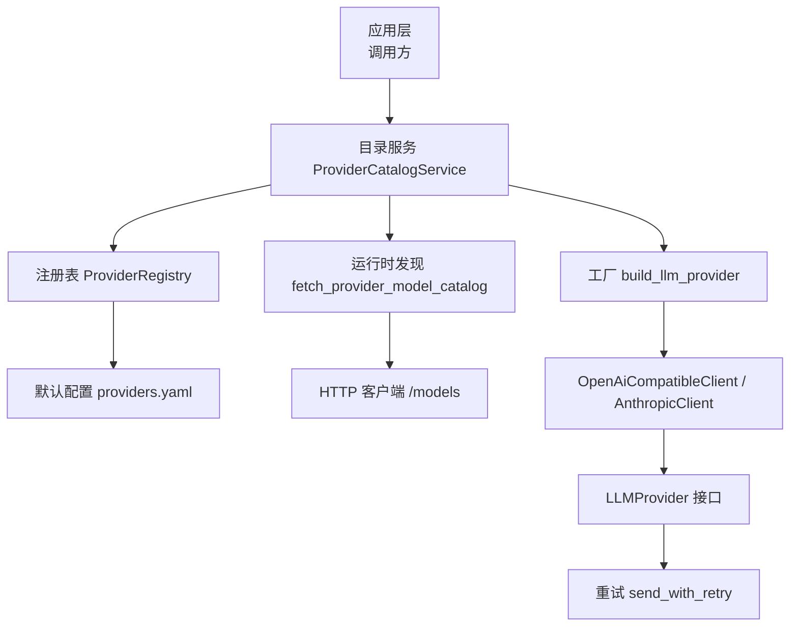
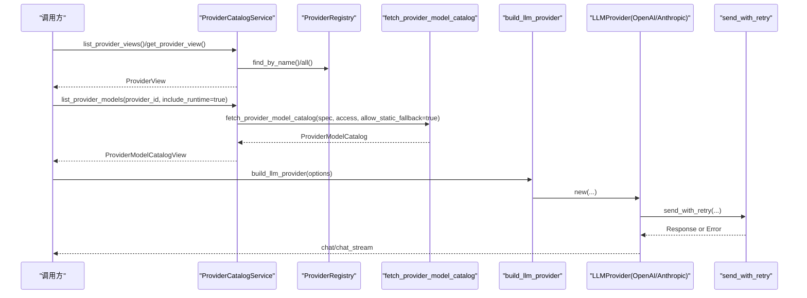
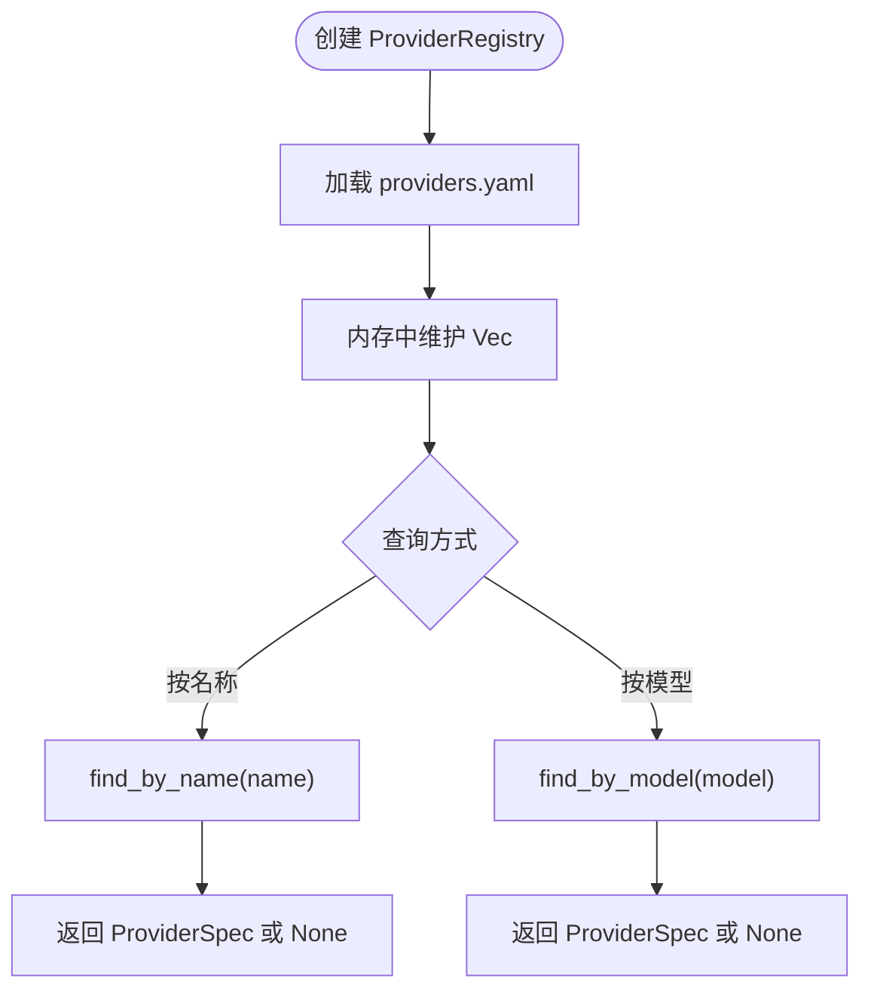
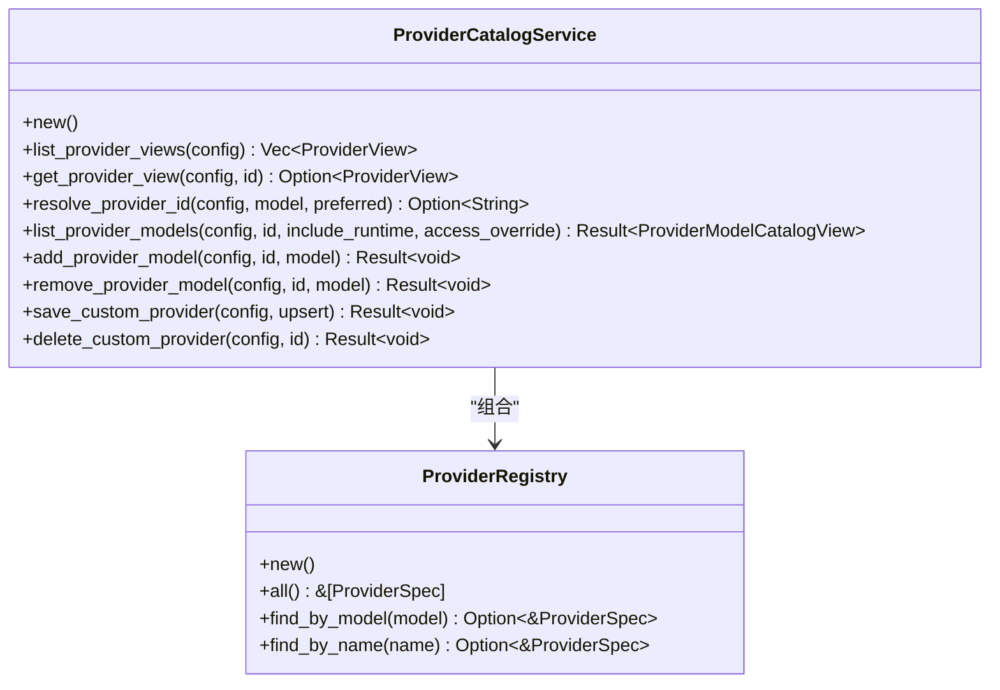
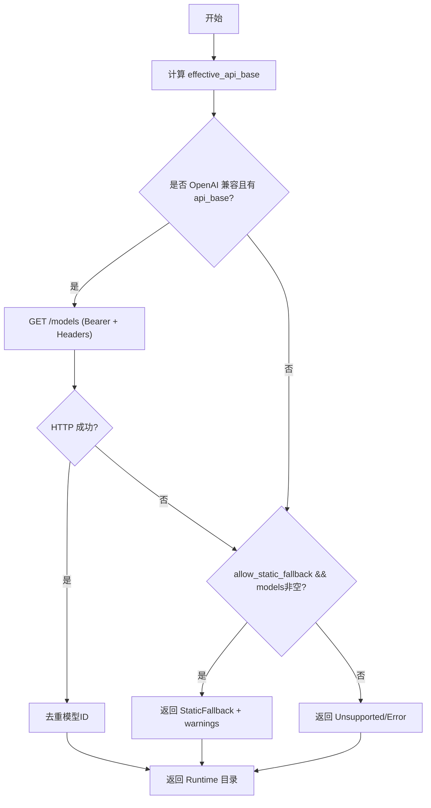
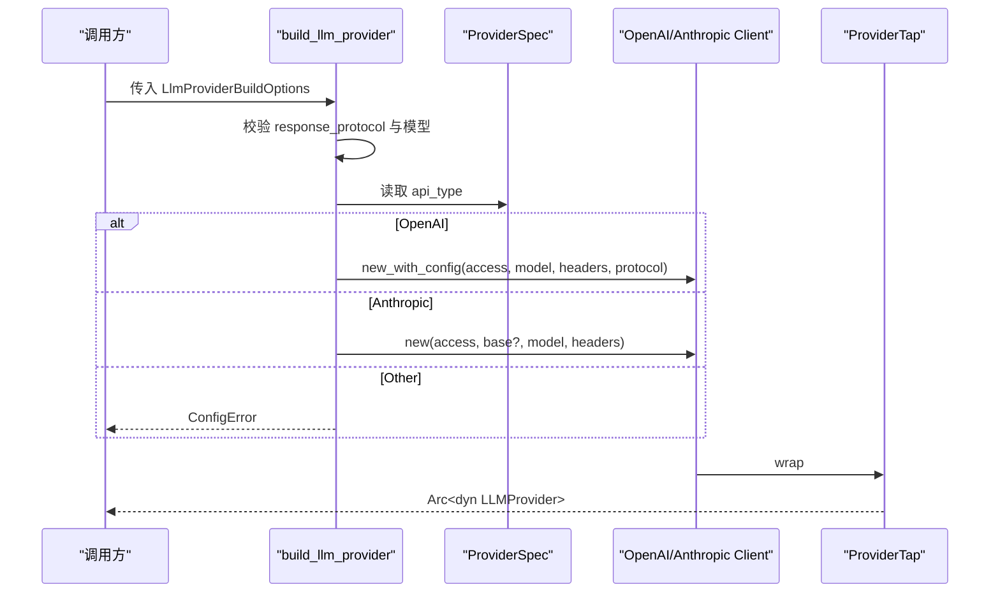
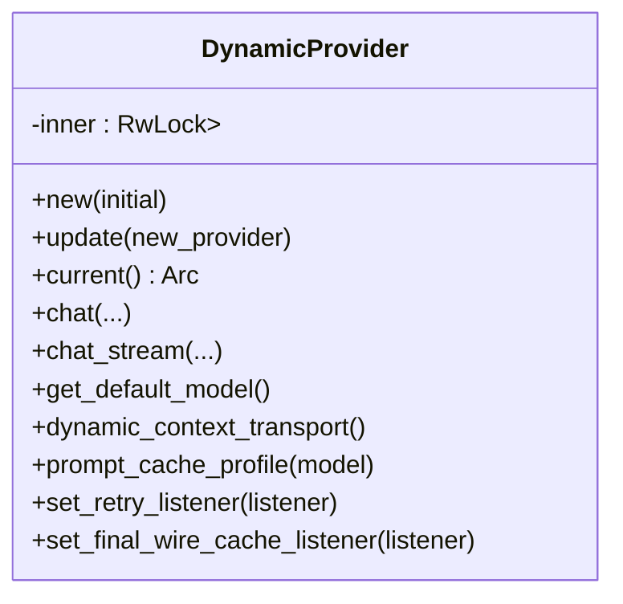
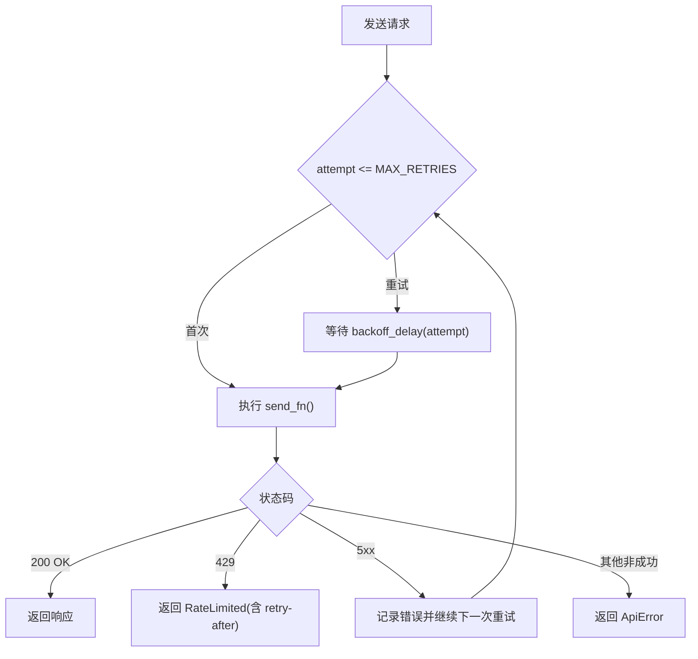
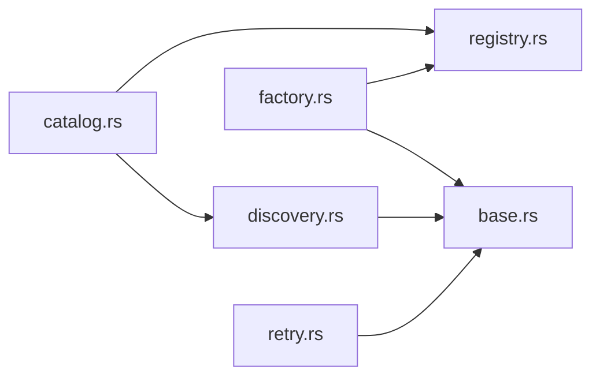

# 提供商注册与发现

<cite>
**本文引用的文件**
- [registry.rs](file://agent-diva-providers/src/registry.rs)
- [factory.rs](file://agent-diva-providers/src/factory.rs)
- [discovery.rs](file://agent-diva-providers/src/discovery.rs)
- [catalog.rs](file://agent-diva-providers/src/catalog.rs)
- [base.rs](file://agent-diva-providers/src/base.rs)
- [lib.rs](file://agent-diva-providers/src/lib.rs)
- [retry.rs](file://agent-diva-providers/src/retry.rs)
- [providers.yaml](file://agent-diva-providers/src/providers.yaml)
</cite>

## 目录
1. [简介](#简介)
2. [项目结构](#项目结构)
3. [核心组件](#核心组件)
4. [架构总览](#架构总览)
5. [详细组件分析](#详细组件分析)
6. [依赖关系分析](#依赖关系分析)
7. [性能考量](#性能考量)
8. [故障排查指南](#故障排查指南)
9. [结论](#结论)
10. [附录：扩展开发手册](#附录扩展开发手册)

## 简介
本文件面向开发者，系统性说明 Agent Diva 的“提供商注册与发现”体系：ProviderRegistry 的工作原理、动态注册机制与生命周期管理；工厂模式在提供商创建中的应用（配置验证、依赖注入、初始化流程）；提供商目录服务如何实现模型发现与元数据管理；以及如何自定义提供商注册、实现接口、定义配置与服务发现。同时涵盖热插拔、版本兼容、故障恢复策略，以及性能监控、健康检查与自动重连的实现指南。

## 项目结构
提供商子系统位于 agent-diva-providers 模块，围绕以下关键文件组织：
- 注册表与元数据：registry.rs、providers.yaml
- 目录服务与视图：catalog.rs
- 运行时模型发现：discovery.rs
- 工厂与构建选项：factory.rs
- 基础抽象与错误：base.rs
- 动态提供者与热插拔：lib.rs
- 重试与退避：retry.rs

图表来源
- [catalog.rs:71-193](file://agent-diva-providers/src/catalog.rs#L71-L193)
- [registry.rs:73-108](file://agent-diva-providers/src/registry.rs#L73-L108)
- [discovery.rs:63-113](file://agent-diva-providers/src/discovery.rs#L63-L113)
- [factory.rs:23-70](file://agent-diva-providers/src/factory.rs#L23-L70)
- [base.rs:708-780](file://agent-diva-providers/src/base.rs#L708-L780)
- [retry.rs:86-181](file://agent-diva-providers/src/retry.rs#L86-L181)

章节来源
- [registry.rs:1-108](file://agent-diva-providers/src/registry.rs#L1-L108)
- [catalog.rs:1-193](file://agent-diva-providers/src/catalog.rs#L1-L193)
- [discovery.rs:1-113](file://agent-diva-providers/src/discovery.rs#L1-L113)
- [factory.rs:1-70](file://agent-diva-providers/src/factory.rs#L1-L70)
- [base.rs:1-80](file://agent-diva-providers/src/base.rs#L1-L80)
- [retry.rs:1-181](file://agent-diva-providers/src/retry.rs#L1-L181)

## 核心组件
- ProviderSpec/ApiType：描述一个提供商的身份、API 类型、关键词、环境变量键、显示名、默认模型、网关前缀、跳过前缀、额外环境变量、默认 API Base、是否支持提示缓存、模型列表与模型级覆盖。
- ProviderRegistry：加载内置提供商清单（来自 providers.yaml），提供按名称或模型关键词查找的能力。
- ProviderAccess：从配置中抽取 api_key、api_base、extra_headers，用于运行时访问。
- ProviderCatalogService：聚合注册表与配置，生成 ProviderView/ProviderModelCatalogView，支持列出、查询、解析提供商 ID、合并自定义模型、保存/删除自定义提供商等。
- 运行时发现：对 OpenAI 兼容端点发起 GET /models，去重并返回可用模型；失败时回退到静态模型或报错。
- 工厂：根据 ApiType 选择具体实现（OpenAI 兼容或 Anthropic），封装为 LLMProvider 并通过 ProviderTap 进行横切增强。
- 动态提供者：DynamicProvider 通过 RwLock 包装 Arc<dyn LLMProvider>，支持运行时替换底层实现，实现热插拔。
- 重试：指数退避 + 抖动，区分 429 限流、5xx 可重试、其他非成功错误直接返回。

章节来源
- [registry.rs:6-108](file://agent-diva-providers/src/registry.rs#L6-L108)
- [discovery.rs:29-61](file://agent-diva-providers/src/discovery.rs#L29-L61)
- [catalog.rs:71-193](file://agent-diva-providers/src/catalog.rs#L71-L193)
- [factory.rs:13-70](file://agent-diva-providers/src/factory.rs#L13-L70)
- [lib.rs:46-124](file://agent-diva-providers/src/lib.rs#L46-L124)
- [retry.rs:17-181](file://agent-diva-providers/src/retry.rs#L17-L181)

## 架构总览
提供商系统采用“配置驱动 + 运行时发现 + 工厂构造 + 动态替换”的分层设计：
- 配置层：providers.yaml 声明内置提供商元数据；Config.providers 承载用户配置与自定义提供商。
- 注册与目录层：ProviderRegistry 提供元数据检索；ProviderCatalogService 将注册表与配置融合，输出统一视图与模型目录。
- 发现层：对 OpenAI 兼容端点执行 /models 拉取，失败则回退到静态模型或上报错误。
- 工厂层：依据 ApiType 与响应协议校验，构造具体客户端并包装为 LLMProvider。
- 运行层：DynamicProvider 允许热插拔；重试层保障网络与限流场景下的稳定性。

图表来源
- [catalog.rs:82-193](file://agent-diva-providers/src/catalog.rs#L82-L193)
- [registry.rs:78-108](file://agent-diva-providers/src/registry.rs#L78-L108)
- [discovery.rs:63-113](file://agent-diva-providers/src/discovery.rs#L63-L113)
- [factory.rs:23-70](file://agent-diva-providers/src/factory.rs#L23-L70)
- [retry.rs:86-181](file://agent-diva-providers/src/retry.rs#L86-L181)

## 详细组件分析

### ProviderRegistry：提供商元数据注册中心
- 职责：加载 providers.yaml 中的内置提供商清单，提供按名称和模型关键词查找能力。
- 关键点：
  - 默认清单通过 include_str! 编译期嵌入，避免运行时 IO。
  - find_by_model 使用大小写不敏感的关键词匹配，便于按模型名推断提供商。
  - label/default_model 提供友好的展示与默认模型解析。

图表来源
- [registry.rs:73-108](file://agent-diva-providers/src/registry.rs#L73-L108)

章节来源
- [registry.rs:1-108](file://agent-diva-providers/src/registry.rs#L1-L108)

### ProviderCatalogService：提供商目录与视图
- 职责：整合注册表与配置，生成 ProviderView/ProviderModelCatalogView，并提供增删改查自定义提供商与模型的能力。
- 关键点：
  - list_provider_views：合并内置与自定义提供商，排序输出。
  - resolve_provider_id：优先显式指定，其次默认 provider，再按模型前缀或关键词解析。
  - list_provider_models：可选择 include_runtime 触发运行时发现；否则返回静态模型；最终合并 custom_models。
  - save_custom_provider/delete_custom_provider：限制仅 openai 类型，保留内置名称不被覆盖。
  - merge_model_catalog：去重、标记来源（runtime/static/custom）、可选项 selectable/deletable。

图表来源
- [catalog.rs:71-193](file://agent-diva-providers/src/catalog.rs#L71-L193)
- [registry.rs:73-108](file://agent-diva-providers/src/registry.rs#L73-L108)

章节来源
- [catalog.rs:71-436](file://agent-diva-providers/src/catalog.rs#L71-L436)

### discovery：运行时模型发现
- 职责：对 OpenAI 兼容端点发起 GET /models，提取模型 ID 并去重；失败时根据 allow_static_fallback 决定是否回退到静态模型或返回错误。
- 关键点：
  - effective_api_base：优先使用配置的 api_base，否则回退到 spec.default_api_base。
  - runtime_strategy：仅当 ApiType=Openai 且存在 api_base 时启用运行时发现。
  - fetch_openai_compatible_models：携带 bearer token 与 extra headers，超时 15s，错误摘要化。
  - fallback_or_error：若允许静态回退且 spec.models 非空，返回 StaticFallback 并附带警告；否则返回 Error。

图表来源
- [discovery.rs:63-143](file://agent-diva-providers/src/discovery.rs#L63-L143)
- [discovery.rs:163-246](file://agent-diva-providers/src/discovery.rs#L163-L246)

章节来源
- [discovery.rs:1-246](file://agent-diva-providers/src/discovery.rs#L1-L246)

### factory：工厂模式与初始化流程
- 职责：根据 ProviderSpec.api_type 与响应协议，构造具体 LLMProvider 实例，并进行必要校验。
- 关键点：
  - LlmProviderBuildOptions：包含 spec、access、model、reasoning_effort/config、response_protocol。
  - 校验：当 response_protocol=DeepseekV4Dsml 时要求模型名包含 deepseek-v4。
  - 分支：Openai -> OpenAiCompatibleClient；Anthropic -> AnthropicClient；Google/Other -> 配置错误。
  - 封装：通过 ProviderTap 包装，便于横切（如重试监听、最终报文缓存监听）。

图表来源
- [factory.rs:23-70](file://agent-diva-providers/src/factory.rs#L23-L70)

章节来源
- [factory.rs:1-170](file://agent-diva-providers/src/factory.rs#L1-L170)

### base：LLMProvider 接口与能力探测
- 职责：定义统一的 LLMProvider 接口、消息/事件模型、工具调用、能力探测（vision/reasoning/context_window）、提示缓存策略、重试监听器注入等。
- 关键点：
  - chat/chat_stream：默认 stream 实现回退到非流式请求并转换为事件流。
  - dynamic_context_transport/prompt_cache_profile：供上层决定上下文传输与缓存策略。
  - set_retry_listener/set_final_wire_cache_listener：注入横切监听器。
  - 错误分类：ProviderError 映射到错误类别，便于上层重试/告警。

章节来源
- [base.rs:1-800](file://agent-diva-providers/src/base.rs#L1-L800)

### lib.rs：动态提供者与热插拔
- 职责：提供 DynamicProvider，内部以 RwLock<Arc<dyn LLMProvider>> 持有当前实现，支持 update/current 切换。
- 关键点：
  - update：写入新实现，读操作 current 获取克隆引用。
  - 代理所有 LLMProvider 方法至当前实现，保证无感替换。

图表来源
- [lib.rs:46-124](file://agent-diva-providers/src/lib.rs#L46-L124)

章节来源
- [lib.rs:1-124](file://agent-diva-providers/src/lib.rs#L1-L124)

### retry：自动重连与限流处理
- 职责：对 HTTP 请求实施指数退避 + 抖动，识别 429 限流与 5xx 服务器错误，支持可选 on_retry 回调。
- 关键点：
  - MAX_RETRIES=3，BASE_DELAY_MS=1000，抖动范围 base/5。
  - classify_response_status：429 立即返回 RateLimited；5xx 返回可重试；其他非成功返回 ApiError。
  - parse_retry_after：从 429 响应头解析重试时间。
  - send_with_retry：循环尝试，记录每次延迟与原因，支持监听器上报进度。

图表来源
- [retry.rs:17-181](file://agent-diva-providers/src/retry.rs#L17-L181)

章节来源
- [retry.rs:1-316](file://agent-diva-providers/src/retry.rs#L1-L316)

## 依赖关系分析
- catalog 依赖 registry 与 discovery，负责视图组装与模型目录合并。
- discovery 依赖 registry 的 ProviderSpec 与 http_util 构建 HTTP 客户端。
- factory 依赖 registry 的 ApiType 与具体客户端实现，并封装为 LLMProvider。
- base 被所有组件共享，定义统一接口与错误模型。
- retry 被具体客户端或上层调用链使用，提供健壮的网络层。

图表来源
- [catalog.rs:1-193](file://agent-diva-providers/src/catalog.rs#L1-L193)
- [discovery.rs:1-113](file://agent-diva-providers/src/discovery.rs#L1-L113)
- [factory.rs:1-70](file://agent-diva-providers/src/factory.rs#L1-L70)
- [base.rs:1-80](file://agent-diva-providers/src/base.rs#L1-L80)
- [retry.rs:1-181](file://agent-diva-providers/src/retry.rs#L1-L181)

章节来源
- [catalog.rs:1-193](file://agent-diva-providers/src/catalog.rs#L1-L193)
- [discovery.rs:1-113](file://agent-diva-providers/src/discovery.rs#L1-L113)
- [factory.rs:1-70](file://agent-diva-providers/src/factory.rs#L1-L70)
- [base.rs:1-80](file://agent-diva-providers/src/base.rs#L1-L80)
- [retry.rs:1-181](file://agent-diva-providers/src/retry.rs#L1-L181)

## 性能考量
- 模型发现：
  - 仅对 OpenAI 兼容端点启用运行时发现，减少不必要网络开销。
  - 超时设置为 15s，避免阻塞 UI/调度。
  - 去重使用 BTreeSet，保证稳定顺序与唯一性。
- 重试策略：
  - 指数退避 + 抖动，降低雪崩风险。
  - 429 立即返回，避免无效重试。
  - 最大重试次数 3，控制尾延迟。
- 视图与目录：
  - 合并自定义模型时去重，避免重复渲染。
  - 静态回退路径快速返回，提升首屏体验。

[本节为通用指导，无需特定文件来源]

## 故障排查指南
- 无法发现模型：
  - 确认 api_base 已正确设置且可达；检查鉴权头与 extra_headers。
  - 若运行时失败，查看 ProviderModelCatalog.warnings/error 字段定位问题。
- 频繁限流：
  - 关注 ProviderError::RateLimited，结合 retry-after 调整调用节奏。
  - 检查上游是否开启速率限制或配额不足。
- 配置错误：
  - 工厂层对 DeepSeek V4 DSML 协议有模型名校验，确保模型名包含 deepseek-v4。
  - 自定义提供商仅支持 api_type=openai，其他类型将被拒绝。
- 热插拔异常：
  - 更新 DynamicProvider 后，确保旧实现的资源释放由上层管理。
  - 读写并发通过 RwLock 保护，注意长时间持锁可能影响吞吐。

章节来源
- [discovery.rs:63-143](file://agent-diva-providers/src/discovery.rs#L63-L143)
- [retry.rs:49-181](file://agent-diva-providers/src/retry.rs#L49-L181)
- [factory.rs:23-70](file://agent-diva-providers/src/factory.rs#L23-L70)
- [catalog.rs:239-292](file://agent-diva-providers/src/catalog.rs#L239-L292)

## 结论
Agent Diva 的提供商注册与发现系统通过清晰的层次划分与可扩展的设计，实现了：
- 基于 YAML 的内置提供商元数据管理；
- 运行时模型发现与静态回退的弹性策略；
- 工厂模式驱动的提供商构造与配置校验；
- 目录服务提供的统一视图与模型管理能力；
- 动态提供者支持的热插拔与无缝替换；
- 健壮的重试与限流处理。
该体系既满足开箱即用，又为扩展第三方提供商提供了标准化接口与工具。

[本节为总结，无需特定文件来源]

## 附录：扩展开发手册

### 自定义提供商注册步骤
- 定义配置：
  - 在 Config.providers.custom_providers 中添加 CustomProviderConfig，至少包含 display_name、api_type=openai、api_base、可选 default_model 与 models。
  - 可使用 extra_headers 传递鉴权或租户信息。
- 保存与生效：
  - 通过 ProviderCatalogService.save_custom_provider 写入配置，系统将自动生成对应 ProviderSpec 并纳入目录。
  - 若需覆盖内置提供商同名项，应避免使用保留名称（内置名称受保护）。
- 模型发现：
  - 若 api_base 指向 OpenAI 兼容端点，可在 list_provider_models 时启用 include_runtime=true 拉取模型列表。
  - 不支持运行时发现的提供商将回退到静态模型或返回 unsupported。

章节来源
- [catalog.rs:239-292](file://agent-diva-providers/src/catalog.rs#L239-L292)
- [catalog.rs:490-536](file://agent-diva-providers/src/catalog.rs#L490-L536)
- [discovery.rs:150-177](file://agent-diva-providers/src/discovery.rs#L150-L177)

### 实现 LLMProvider 接口
- 参考 base.rs 中的 LLMProvider 接口，实现 chat/chat_stream、get_default_model、dynamic_context_transport、prompt_cache_profile、set_retry_listener、set_final_wire_cache_listener。
- 建议：
  - 在 chat_stream 中尽量使用原生流式接口，以提升实时性。
  - 合理设置 prompt_cache_profile，仅在支持时启用缓存。
  - 通过 set_retry_listener 暴露重试进度，便于 UI 反馈。

章节来源
- [base.rs:708-780](file://agent-diva-providers/src/base.rs#L708-L780)

### 配置验证与依赖注入
- 配置验证：
  - 工厂层会校验 response_protocol 与模型的兼容性（例如 DeepSeek V4 DSML 要求模型名包含 deepseek-v4）。
  - 自定义提供商仅支持 api_type=openai。
- 依赖注入：
  - 通过 LlmProviderBuildOptions 注入 spec、access、model、reasoning_effort/config、response_protocol。
  - 通过 ProviderAccess 注入 api_key、api_base、extra_headers。
  - 通过 set_retry_listener 与 set_final_wire_cache_listener 注入横切能力。

章节来源
- [factory.rs:23-70](file://agent-diva-providers/src/factory.rs#L23-L70)
- [discovery.rs:29-61](file://agent-diva-providers/src/discovery.rs#L29-L61)
- [base.rs:767-780](file://agent-diva-providers/src/base.rs#L767-L780)

### 热插拔、版本兼容与故障恢复
- 热插拔：
  - 使用 DynamicProvider.update 替换底层实现，read 操作通过 current 获取最新实例。
- 版本兼容：
  - 通过 ProviderSpec.model_overrides 针对特定模型设置参数覆盖，适配不同版本差异。
  - 运行时发现失败时回退到静态模型，保证可用性。
- 故障恢复：
  - 重试层对 5xx 与网络错误进行指数退避重试；429 立即返回限流错误。
  - 目录服务在发现失败时提供 warnings 与 error 字段，便于上层降级或提示。

章节来源
- [lib.rs:46-124](file://agent-diva-providers/src/lib.rs#L46-L124)
- [registry.rs:17-50](file://agent-diva-providers/src/registry.rs#L17-L50)
- [retry.rs:49-181](file://agent-diva-providers/src/retry.rs#L49-L181)
- [discovery.rs:115-143](file://agent-diva-providers/src/discovery.rs#L115-L143)

### 性能监控与健康检查
- 性能监控：
  - 通过 set_final_wire_cache_listener 捕获最终报文结构，用于缓存命中分析与性能统计。
  - 利用 set_retry_listener 收集重试次数、延迟与原因，形成指标上报。
- 健康检查：
  - 可通过定期调用 list_provider_models(include_runtime=true) 探测端点连通性与鉴权有效性。
  - 若返回 source=Unsupported/Error，结合 warnings/error 判断健康状态。
- 自动重连：
  - 重试层已内置指数退避与抖动；建议在业务层对 RateLimited 做退避与告警。

章节来源
- [base.rs:767-780](file://agent-diva-providers/src/base.rs#L767-L780)
- [retry.rs:86-181](file://agent-diva-providers/src/retry.rs#L86-L181)
- [discovery.rs:63-143](file://agent-diva-providers/src/discovery.rs#L63-L143)

### 完整示例流程（概念性）
- 新增自定义提供商：
  - 在配置中定义 CustomProviderConfig，调用 save_custom_provider 持久化。
  - 使用 list_provider_views 验证显示名称与状态。
- 发现模型：
  - 调用 list_provider_models(provider_id, include_runtime=true)，若支持则返回 runtime 模型；否则回退到静态或报错。
- 创建并使用提供商：
  - 通过 build_llm_provider 构造 LLMProvider，注入 reasoning_config 与 response_protocol。
  - 调用 chat/chat_stream 完成推理，结合重试监听器与最终报文监听器进行监控。

[本节为概念性流程，无需特定文件来源]