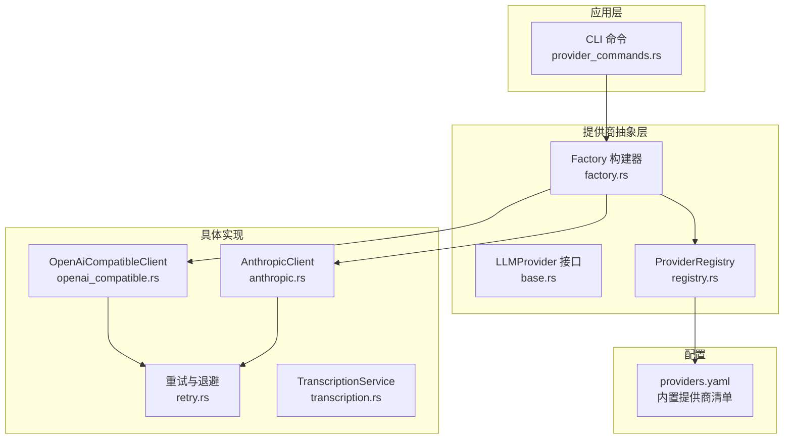
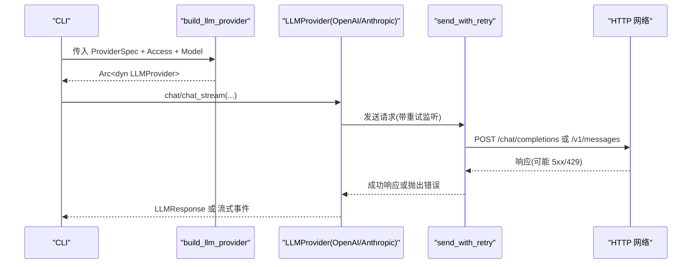
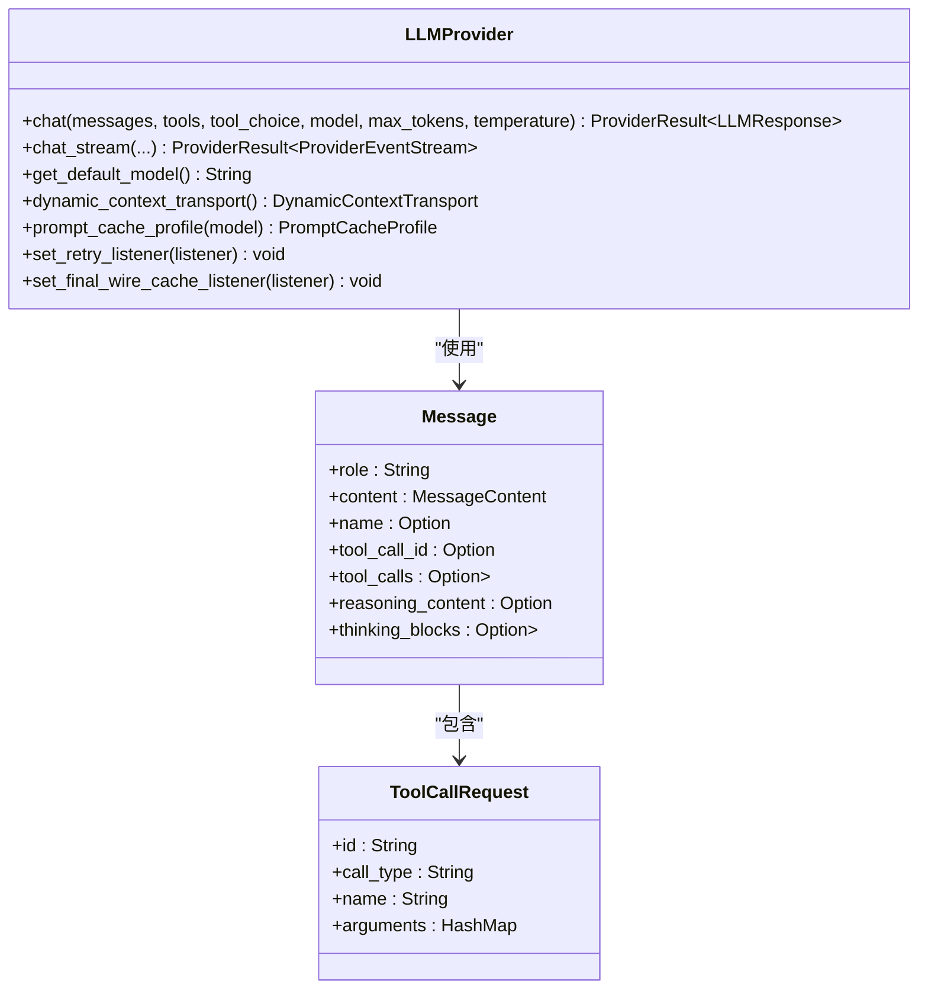
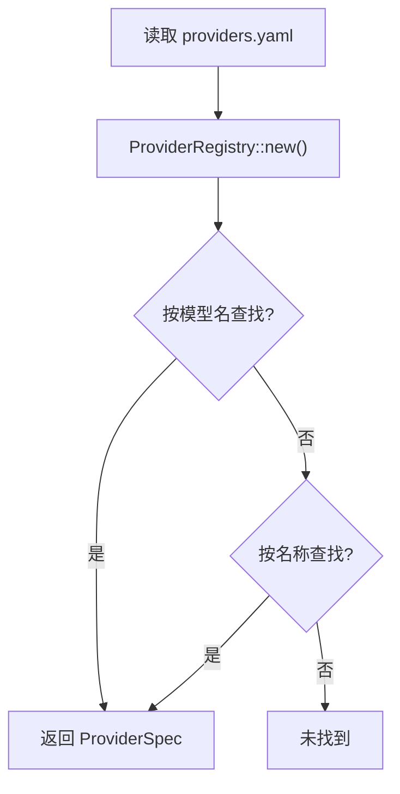
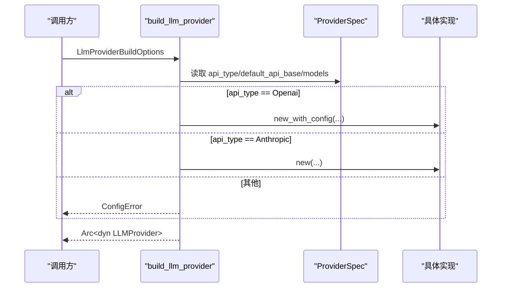
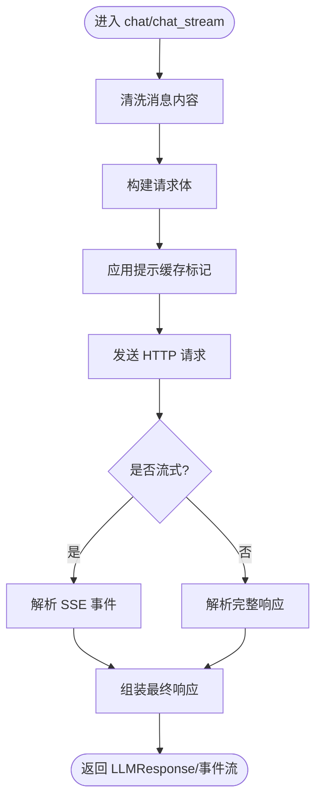
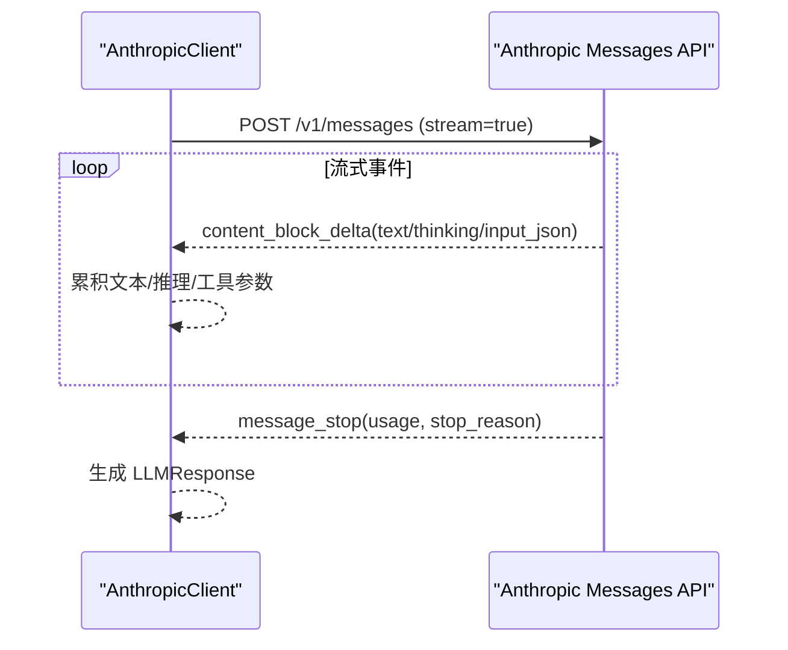
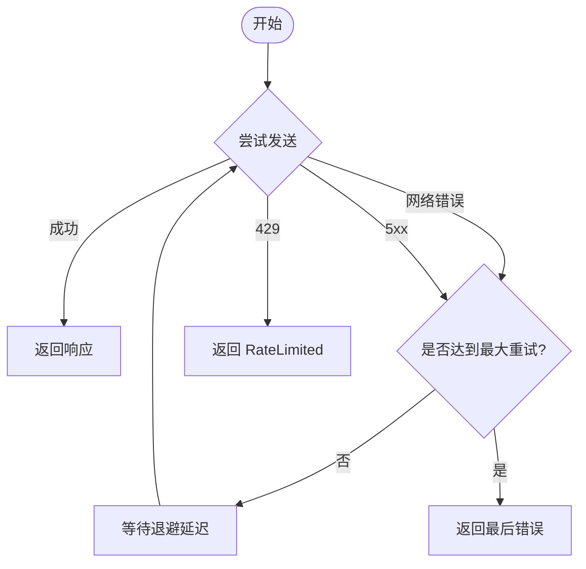
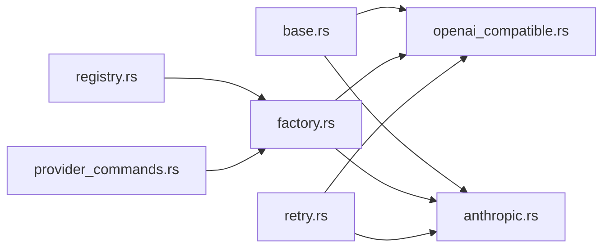

# 提供商集成

<cite>
**本文引用的文件**
- [lib.rs](file://agent-diva-providers/src/lib.rs)
- [base.rs](file://agent-diva-providers/src/base.rs)
- [registry.rs](file://agent-diva-providers/src/registry.rs)
- [factory.rs](file://agent-diva-providers/src/factory.rs)
- [openai_compatible.rs](file://agent-diva-providers/src/openai_compatible.rs)
- [anthropic.rs](file://agent-diva-providers/src/anthropic.rs)
- [retry.rs](file://agent-diva-providers/src/retry.rs)
- [transcription.rs](file://agent-diva-providers/src/transcription.rs)
- [providers.yaml](file://agent-diva-providers/src/providers.yaml)
- [provider_commands.rs](file://agent-diva-cli/src/provider_commands.rs)
</cite>

## 目录
1. [简介](#简介)
2. [项目结构](#项目结构)
3. [核心组件](#核心组件)
4. [架构总览](#架构总览)
5. [详细组件分析](#详细组件分析)
6. [依赖关系分析](#依赖关系分析)
7. [性能与可靠性](#性能与可靠性)
8. [故障排查指南](#故障排查指南)
9. [结论](#结论)
10. [附录：配置与示例](#附录：配置与示例)

## 简介
本文件面向初学者与开发者，系统性说明 Agent Diva 的“提供商集成”体系：抽象接口、注册机制、工厂模式、内置提供商清单与配置、OpenAI 兼容通用实现、自定义提供商开发流程、测试验证方法、负载均衡与故障转移策略、以及性能监控、错误处理与重试最佳实践。同时涵盖如何新增 LLM 服务提供商与语音转录服务。

## 项目结构
Agent Diva 将“提供商能力”集中在 agent-diva-providers crate 中，通过统一的抽象接口对外暴露，并通过 YAML 配置集中管理 45+ 内置提供商元数据（名称、API 类型、默认模型、默认 API Base、是否支持提示缓存等）。CLI 提供查询、设置提供商与模型的命令。

图表来源
- [factory.rs:23-70](file://agent-diva-providers/src/factory.rs#L23-L70)
- [registry.rs:78-107](file://agent-diva-providers/src/registry.rs#L78-L107)
- [openai_compatible.rs:168-184](file://agent-diva-providers/src/openai_compatible.rs#L168-L184)
- [anthropic.rs:170-205](file://agent-diva-providers/src/anthropic.rs#L170-L205)
- [retry.rs:94-181](file://agent-diva-providers/src/retry.rs#L94-L181)
- [providers.yaml:1-1114](file://agent-diva-providers/src/providers.yaml#L1-L1114)

章节来源
- [lib.rs:1-42](file://agent-diva-providers/src/lib.rs#L1-L42)
- [registry.rs:1-107](file://agent-diva-providers/src/registry.rs#L1-L107)
- [factory.rs:1-70](file://agent-diva-providers/src/factory.rs#L1-L70)

## 核心组件
- 抽象接口 LLMProvider：定义 chat/chat_stream、默认模型、动态上下文传输、提示缓存策略、重试监听器等统一能力。
- 注册表 ProviderRegistry：集中维护提供商元数据（名称、API 类型、关键词、环境变量键、默认 API Base、模型列表、提示缓存支持等），并提供按模型名或名称查找的能力。
- 工厂 build_llm_provider：根据 ProviderSpec 的 api_type 构造具体客户端（OpenAI 兼容或 Anthropic 原生），并包装为可观测的 ProviderTap。
- OpenAI 兼容客户端：适配遵循 OpenAI 风格的 HTTP 接口，负责请求构建、流式解析、工具调用、使用量统计、提示缓存控制、消息清洗等。
- Anthropic 原生客户端：直接对接 Anthropic Messages API，处理 system blocks、thinking、tool_use/tool_result 等。
- 重试模块：指数退避 + 抖动，识别 429 限流与 5xx 服务器错误，支持可选的重试回调以暴露进度。
- 语音转录：基于 Groq Whisper 的 TranscriptionService，提供安全失败回退。

章节来源
- [base.rs:708-780](file://agent-diva-providers/src/base.rs#L708-L780)
- [registry.rs:17-107](file://agent-diva-providers/src/registry.rs#L17-L107)
- [factory.rs:23-70](file://agent-diva-providers/src/factory.rs#L23-L70)
- [openai_compatible.rs:168-184](file://agent-diva-providers/src/openai_compatible.rs#L168-L184)
- [anthropic.rs:170-205](file://agent-diva-providers/src/anthropic.rs#L170-L205)
- [retry.rs:17-181](file://agent-diva-providers/src/retry.rs#L17-L181)
- [transcription.rs:34-166](file://agent-diva-providers/src/transcription.rs#L34-L166)

## 架构总览
下图展示了从 CLI 到具体提供商的调用路径，以及重试、流式事件和最终响应组装过程。

图表来源
- [factory.rs:23-70](file://agent-diva-providers/src/factory.rs#L23-L70)
- [openai_compatible.rs:791-800](file://agent-diva-providers/src/openai_compatible.rs#L791-L800)
- [anthropic.rs:314-332](file://agent-diva-providers/src/anthropic.rs#L314-L332)
- [retry.rs:94-181](file://agent-diva-providers/src/retry.rs#L94-L181)

## 详细组件分析

### 抽象接口与数据模型
- LLMProvider：统一聊天与流式接口；提供默认模型、动态上下文传输策略、提示缓存策略、重试监听器注入、最终线束缓存监听器注入。
- 消息与内容：Message/MessageContent/MessageContentPart 支持纯文本与多模态（图片 URL/文件/Data URI）；提供文本转换、图像检测等工具方法。
- 工具调用：ToolCallRequest 标准化工具调用参数，支持多种 JSON 编码形态的兼容解析。
- 能力探测：model_capabilities_for_model 系列函数保守地判断模型是否支持视觉、推理、上下文窗口大小，避免向不支持的模型发送多模态负载。

图表来源
- [base.rs:708-780](file://agent-diva-providers/src/base.rs#L708-L780)
- [base.rs:447-660](file://agent-diva-providers/src/base.rs#L447-L660)
- [base.rs:274-382](file://agent-diva-providers/src/base.rs#L274-L382)

章节来源
- [base.rs:10-68](file://agent-diva-providers/src/base.rs#L10-L68)
- [base.rs:131-264](file://agent-diva-providers/src/base.rs#L131-L264)
- [base.rs:447-660](file://agent-diva-providers/src/base.rs#L447-L660)

### 注册机制与配置
- ProviderSpec：描述一个提供商的身份、API 类型、关键词、环境变量键、显示名、默认模型、网关前缀、跳过前缀、额外环境变量、默认 API Base、是否支持提示缓存、模型列表、模型级参数覆盖等。
- ProviderRegistry：加载 providers.yaml 中的默认提供商集合，支持按模型名或名称查找。
- providers.yaml：集中声明 45+ 内置提供商（OpenAI、Anthropic、DeepSeek、Gemini、DashScope、Moonshot、MiniMax、Groq、xAI、Zhipu、Together、Perplexity、NVIDIA NIM、Baidu Qianfan、Voyage、Qiniu、Cerebras、Mimo 等），每个条目包含默认模型、默认 API Base、是否网关、是否本地、提示缓存支持等。

图表来源
- [registry.rs:78-107](file://agent-diva-providers/src/registry.rs#L78-L107)
- [providers.yaml:1-1114](file://agent-diva-providers/src/providers.yaml#L1-L1114)

章节来源
- [registry.rs:17-107](file://agent-diva-providers/src/registry.rs#L17-L107)
- [providers.yaml:1-1114](file://agent-diva-providers/src/providers.yaml#L1-L1114)

### 工厂模式与构建流程
- build_llm_provider：根据 ProviderSpec.api_type 选择实现：
  - OpenAI 兼容：OpenAiCompatibleClient
  - Anthropic：AnthropicClient
  - Google/Other：当前未实现，返回配置错误
- 支持 DeepSeek V4 DSML 协议校验：当 response_protocol=deepseek_v4_dsml 时要求模型名包含 deepseek-v4。
- 通过 ProviderTap 包装，便于后续扩展观测与拦截。

图表来源
- [factory.rs:23-70](file://agent-diva-providers/src/factory.rs#L23-L70)

章节来源
- [factory.rs:23-70](file://agent-diva-providers/src/factory.rs#L23-L70)

### OpenAI 兼容接口的通用实现
- 请求构建：支持 messages、tools、tool_choice、stream、stream_options、reasoning_effort、max_tokens、temperature。
- 消息清洗：去除 ANSI 转义与控制字符，防止 JSON 解析异常。
- 工具调用：兼容多种 JSON 编码形式，失败时降级为 raw 字段保留原始内容。
- 使用量统计：将 usage 映射为标准字段，缺失时记录审计事件。
- 提示缓存：对首个稳定前缀 system 消息或最后一个 tool 标记 cache_control=ephemeral。
- 流式处理：SSE 事件解析，增量文本/推理内容/工具调用增量，最终 Completed。
- 协议切换：支持 DeepSeek V4 DSML 解码路径。

图表来源
- [openai_compatible.rs:544-614](file://agent-diva-providers/src/openai_compatible.rs#L544-L614)
- [openai_compatible.rs:383-423](file://agent-diva-providers/src/openai_compatible.rs#L383-L423)
- [openai_compatible.rs:742-760](file://agent-diva-providers/src/openai_compatible.rs#L742-L760)

章节来源
- [openai_compatible.rs:168-184](file://agent-diva-providers/src/openai_compatible.rs#L168-L184)
- [openai_compatible.rs:251-342](file://agent-diva-providers/src/openai_compatible.rs#L251-L342)
- [openai_compatible.rs:448-542](file://agent-diva-providers/src/openai_compatible.rs#L448-L542)
- [openai_compatible.rs:616-660](file://agent-diva-providers/src/openai_compatible.rs#L616-L660)

### Anthropic 原生实现
- 消息转换：将系统消息提取为顶层 system blocks，assistant 消息合并 thinking/tool_use，tool 消息转换为 tool_result。
- 流式事件：处理 message_start/content_block_start/content_block_delta/message_delta/message_stop，聚合文本、推理内容与工具调用增量。
- 提示缓存：首个 system block 标记 ephemeral。
- 使用量统计：将 input/output/cache tokens 映射为标准字段。

图表来源
- [anthropic.rs:211-240](file://agent-diva-providers/src/anthropic.rs#L211-L240)
- [anthropic.rs:382-570](file://agent-diva-providers/src/anthropic.rs#L382-L570)
- [anthropic.rs:577-656](file://agent-diva-providers/src/anthropic.rs#L577-L656)

章节来源
- [anthropic.rs:170-205](file://agent-diva-providers/src/anthropic.rs#L170-L205)
- [anthropic.rs:266-292](file://agent-diva-providers/src/anthropic.rs#L266-L292)
- [anthropic.rs:314-332](file://agent-diva-providers/src/anthropic.rs#L314-L332)
- [anthropic.rs:746-782](file://agent-diva-providers/src/anthropic.rs#L746-L782)

### 重试与故障转移
- 指数退避：基础延迟 1s，每次翻倍，附加 ±20% 抖动，最大重试次数 3。
- 状态分类：429 立即返回 RateLimited（不重试），5xx 触发重试，其他非成功返回 ApiError。
- 监听器：每次重试前调用 RetryListener，便于上层展示进度或告警。
- 超时与空闲：流式场景设置空闲超时，避免长时间无数据阻塞。

图表来源
- [retry.rs:17-47](file://agent-diva-providers/src/retry.rs#L17-L47)
- [retry.rs:49-181](file://agent-diva-providers/src/retry.rs#L49-L181)

章节来源
- [retry.rs:17-181](file://agent-diva-providers/src/retry.rs#L17-L181)

### 语音转录服务
- 基于 Groq Whisper API，支持 MP3/WAV/OGG/FLAC/M4A。
- 提供 transcribe_safe 安全回退：失败返回空字符串而非错误，适合容错场景。
- 可通过环境变量 GROQ_API_KEY 或构造函数传入 API Key。

章节来源
- [transcription.rs:34-166](file://agent-diva-providers/src/transcription.rs#L34-L166)

## 依赖关系分析
- 抽象与实现解耦：LLMProvider 接口屏蔽底层差异，工厂根据配置选择实现。
- 配置驱动：providers.yaml 作为单一事实源，决定默认模型、API Base、提示缓存支持等。
- 重试与流式：重试模块被 OpenAI/Anthropic 客户端复用，流式事件统一封装为 ProviderEventStream。
- CLI 集成：CLI 通过 ProviderCatalogService 查询提供商视图、列出模型、设置凭证与默认模型。

图表来源
- [base.rs:708-780](file://agent-diva-providers/src/base.rs#L708-L780)
- [registry.rs:78-107](file://agent-diva-providers/src/registry.rs#L78-L107)
- [factory.rs:23-70](file://agent-diva-providers/src/factory.rs#L23-L70)
- [retry.rs:94-181](file://agent-diva-providers/src/retry.rs#L94-L181)
- [provider_commands.rs:25-234](file://agent-diva-cli/src/provider_commands.rs#L25-L234)

章节来源
- [provider_commands.rs:25-234](file://agent-diva-cli/src/provider_commands.rs#L25-L234)

## 性能与可靠性
- 流式输出：OpenAI/Anthropic 均支持流式事件，降低首字延迟，提升交互体验。
- 提示缓存：对首个稳定 system 消息或最后一个 tool 标记 ephemeral，减少重复计算成本。
- 消息清洗：去除控制字符与 ANSI 序列，避免 JSON 解析失败导致的重试与错误。
- 重试策略：指数退避 + 抖动，避免雪崩；429 快速失败，由上层进行节流或排队。
- 使用量统计：统一映射 usage 字段，缺失时记录审计事件，便于计费与监控。
- 超时与空闲：HTTP 客户端设置合理超时；流式场景设置空闲超时，避免资源泄漏。

[本节为通用指导，无需特定文件引用]

## 故障排查指南
- 429 限流：检查重试监听器输出的 attempt/delay_ms/reason，确认是否触发 RateLimited；必要时调整速率或增加队列。
- 5xx 服务器错误：查看日志中的重试次数与延迟，评估后端稳定性；考虑多提供商切换。
- JSON 解析失败：关注消息清洗日志与 problematic characters 信息，修正上游输入。
- 流式中断：检查空闲超时与网络状况；确认 provider 端 SSE 格式是否符合预期。
- 提示缓存无效：确认 provider 是否支持提示缓存（supports_prompt_caching），并确保首个 system 消息存在且未被后续历史覆盖。

章节来源
- [retry.rs:49-181](file://agent-diva-providers/src/retry.rs#L49-L181)
- [openai_compatible.rs:544-614](file://agent-diva-providers/src/openai_compatible.rs#L544-L614)
- [anthropic.rs:426-570](file://agent-diva-providers/src/anthropic.rs#L426-L570)

## 结论
Agent Diva 的提供商集成通过清晰的抽象接口、集中化的注册配置与工厂构建，实现了多提供商的统一接入与灵活扩展。OpenAI 兼容与 Anthropic 原生实现覆盖了主流生态，配合重试、流式、提示缓存与使用量统计，提供了高可用与高性能的基础能力。CLI 与配置驱动使得日常运维与调试更加便捷。

[本节为总结性内容，无需特定文件引用]

## 附录：配置与示例

### 内置提供商概览与配置要点
- 常见提供商：OpenAI、Anthropic、DeepSeek、Gemini、DashScope、Moonshot、MiniMax、Groq、xAI、Zhipu、Together、Perplexity、NVIDIA NIM、Baidu Qianfan、Voyage、Qiniu、Cerebras、Mimo 等。
- 关键字段：
  - name：内部标识
  - api_type：openai 或 anthropic
  - env_key：环境变量键名（如 OPENAI_API_KEY、ANTHROPIC_API_KEY）
  - default_model：默认模型
  - default_api_base：默认 API Base
  - supports_prompt_caching：是否支持提示缓存
  - models：支持的模型列表
  - model_overrides：模型级参数覆盖（如 temperature）

章节来源
- [providers.yaml:1-1114](file://agent-diva-providers/src/providers.yaml#L1-L1114)

### 认证方式与环境变量
- OpenAI 兼容：通常使用 Authorization: Bearer <api_key>，环境变量键见 providers.yaml（如 OPENAI_API_KEY、DEEPSEEK_API_KEY 等）。
- Anthropic：使用 x-api-key 与 anthropic-version 头，环境变量键为 ANTHROPIC_API_KEY。
- 自定义提供商：可在 providers.yaml 添加条目，或通过 CLI 设置自定义 API Base 与密钥。

章节来源
- [openai_compatible.rs:662-672](file://agent-diva-providers/src/openai_compatible.rs#L662-L672)
- [anthropic.rs:251-264](file://agent-diva-providers/src/anthropic.rs#L251-L264)
- [providers.yaml:1-1114](file://agent-diva-providers/src/providers.yaml#L1-L1114)

### 模型选择与能力探测
- 通过 model_capabilities_for_model 系列函数判断模型是否支持视觉、推理与上下文窗口大小。
- 对于推理模型，若提供 reasoning_config，则优先信任配置中的 reasoning_type。
- 在 providers.yaml 中为不同提供商配置默认模型与模型列表，便于 CLI 与上层逻辑选择。

章节来源
- [base.rs:155-264](file://agent-diva-providers/src/base.rs#L155-L264)
- [providers.yaml:1-1114](file://agent-diva-providers/src/providers.yaml#L1-L1114)

### 负载均衡与故障转移策略
- 单实例：通过重试与退避应对瞬时故障。
- 多实例：在上层（如代理或服务编排）实现多提供商轮询或权重分配，结合 429/5xx 自动切换。
- 提示缓存：利用 supports_prompt_caching 与 ephemeral 标记降低跨提供商切换时的冷启动成本。
- 监控：通过审计事件与重试监听器收集指标，辅助决策。

[本节为通用指导，无需特定文件引用]

### 自定义提供商开发流程
- 步骤：
  1. 在 providers.yaml 添加新提供商条目（name、api_type、env_key、default_model、default_api_base、models 等）。
  2. 若需原生实现，实现 LLMProvider 接口（参考 Anthropic/OpenAI 兼容实现）。
  3. 在 factory.rs 中为新 api_type 添加分支，构建具体客户端。
  4. 编写单元测试与集成测试，验证请求/响应、流式、重试与提示缓存。
  5. 通过 CLI 设置与查询，验证配置生效。

章节来源
- [registry.rs:78-107](file://agent-diva-providers/src/registry.rs#L78-L107)
- [factory.rs:23-70](file://agent-diva-providers/src/factory.rs#L23-L70)
- [provider_commands.rs:90-153](file://agent-diva-cli/src/provider_commands.rs#L90-L153)

### 测试与验证方法
- 单元测试：验证重试退避、状态分类、JSON 解析、消息清洗、提示缓存标记等。
- 集成测试：连接真实或模拟后端，验证流式事件、工具调用、使用量统计。
- CLI 验证：使用 provider list/status/set/models 命令检查配置与模型列表。

章节来源
- [retry.rs:183-316](file://agent-diva-providers/src/retry.rs#L183-L316)
- [provider_commands.rs:25-234](file://agent-diva-cli/src/provider_commands.rs#L25-L234)

### 添加新的 LLM 服务提供商
- 在 providers.yaml 中添加条目，确保 env_key、default_model、default_api_base、models 正确。
- 若为 OpenAI 兼容，可直接使用 OpenAiCompatibleClient；否则实现 LLMProvider。
- 在 factory.rs 中添加对应分支，构建客户端。
- 通过 CLI 设置与查询，验证功能。

章节来源
- [providers.yaml:1-1114](file://agent-diva-providers/src/providers.yaml#L1-L1114)
- [factory.rs:23-70](file://agent-diva-providers/src/factory.rs#L23-L70)
- [provider_commands.rs:90-153](file://agent-diva-cli/src/provider_commands.rs#L90-L153)

### 添加语音转录服务
- 使用 TranscriptionService，配置 GROQ_API_KEY 与模型（默认 whisper-large-v3）。
- 支持 transcribe_safe 安全回退，适用于容错场景。
- 可扩展为多提供商（如 Azure Speech、Google STT）并统一接口。

章节来源
- [transcription.rs:34-166](file://agent-diva-providers/src/transcription.rs#L34-L166)