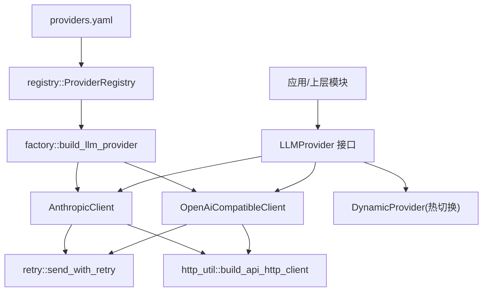
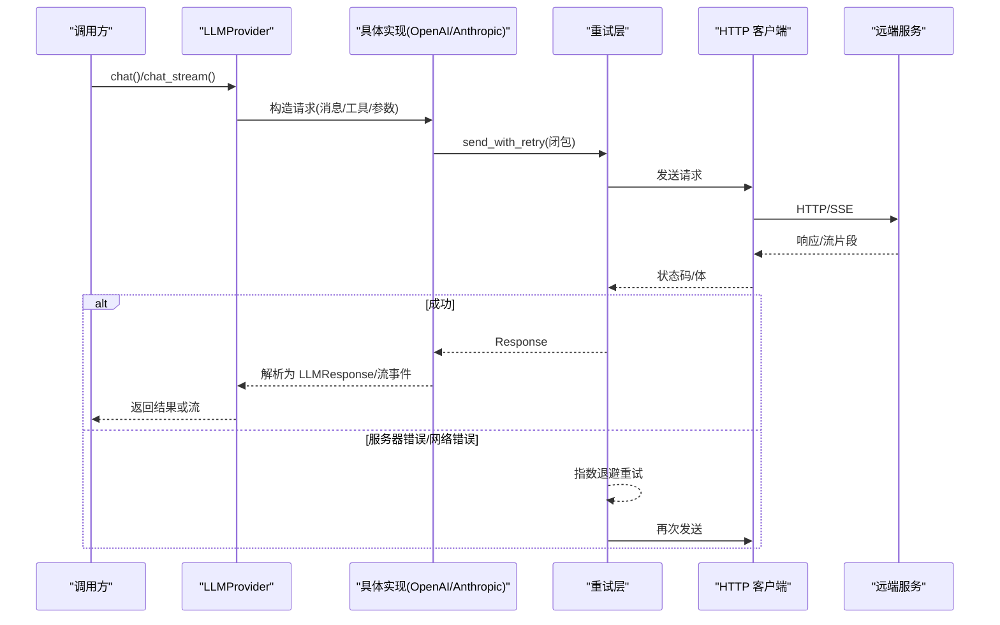
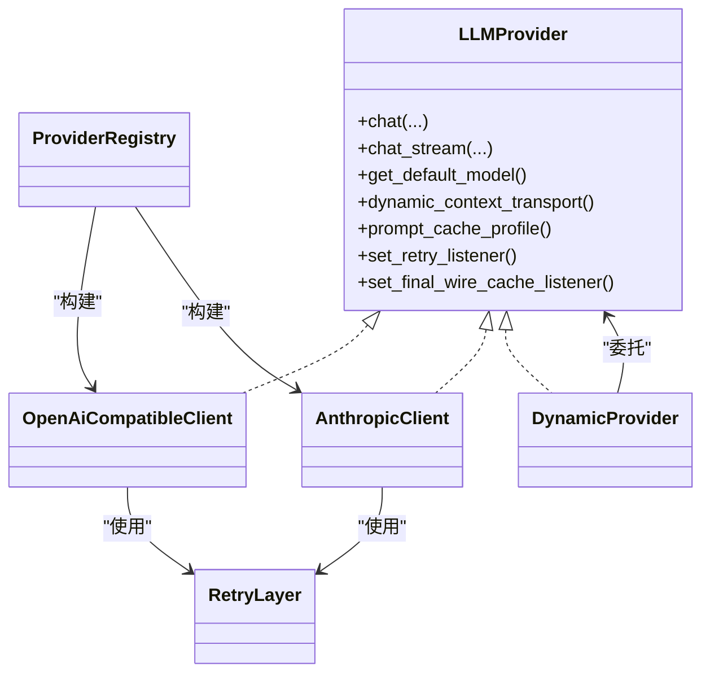

# 自定义提供商开发

<cite>
**本文引用的文件**
- [agent-diva-providers/src/base.rs](file://agent-diva-providers/src/base.rs)
- [agent-diva-providers/src/factory.rs](file://agent-diva-providers/src/factory.rs)
- [agent-diva-providers/src/registry.rs](file://agent-diva-providers/src/registry.rs)
- [agent-diva-providers/src/openai_compatible.rs](file://agent-diva-providers/src/openai_compatible.rs)
- [agent-diva-providers/src/anthropic.rs](file://agent-diva-providers/src/anthropic.rs)
- [agent-diva-providers/src/retry.rs](file://agent-diva-providers/src/retry.rs)
- [agent-diva-providers/src/http_util.rs](file://agent-diva-providers/src/http_util.rs)
- [agent-diva-providers/src/lib.rs](file://agent-diva-providers/src/lib.rs)
- [agent-diva-providers/src/providers.yaml](file://agent-diva-providers/src/providers.yaml)
- [agent-diva-providers/tests/provider_retry.rs](file://agent-diva-providers/tests/provider_retry.rs)
- [agent-diva-providers/tests/ollama_streaming.rs](file://agent-diva-providers/tests/ollama_streaming.rs)
</cite>

## 目录
1. [简介](#简介)
2. [项目结构](#项目结构)
3. [核心组件](#核心组件)
4. [架构总览](#架构总览)
5. [详细组件分析](#详细组件分析)
6. [依赖关系分析](#依赖关系分析)
7. [性能与可靠性](#性能与可靠性)
8. [测试策略](#测试策略)
9. [故障排查指南](#故障排查指南)
10. [结论](#结论)
11. [附录：从零实现一个自定义提供商的完整步骤](#附录从零实现一个自定义提供商的完整步骤)

## 简介
本指南面向希望为 Agent Diva 实现“自定义 LLM 提供商”的开发者。内容围绕 LLMProvider trait 的接口规范、消息格式转换、工具调用处理、流式响应、错误映射、认证机制、重试与超时、资源管理，以及集成到注册系统、单元测试与集成测试等生产级实践展开。你将学会从简单的 HTTP 客户端到复杂的异步流处理，逐步构建可插拔、可观测、可重试的生产级提供商。

## 项目结构
Agent Diva 的 LLM 提供商能力集中在 agent-diva-providers crate 中，采用“统一接口 + 多实现”的设计：
- base.rs：定义统一的 LLMProvider trait、消息模型、流事件、错误类型、能力探测等基础契约。
- openai_compatible.rs：兼容 OpenAI 协议的通用实现（支持 SSE 流、工具调用、缓存控制等）。
- anthropic.rs：Anthropic 原生 Messages API 实现（原生思考/工具流式输出）。
- retry.rs：指数退避重试、速率限制识别、重试监听器。
- http_util.rs：HTTP 客户端构建（连接超时、请求超时、HTTP/1.1 强制、代理禁用）。
- factory.rs：根据 ProviderSpec 构建具体提供商实例。
- registry.rs：提供商元数据注册表（名称、默认模型、API Base、能力开关等）。
- providers.yaml：内置提供商清单（OpenAI、Anthropic、DeepSeek、DashScope、vLLM 等）。
- lib.rs：对外导出统一接口与动态切换包装 DynamicProvider。

图表来源
- [agent-diva-providers/src/lib.rs:21-40](file://agent-diva-providers/src/lib.rs#L21-L40)
- [agent-diva-providers/src/factory.rs:23-70](file://agent-diva-providers/src/factory.rs#L23-L70)
- [agent-diva-providers/src/registry.rs:73-108](file://agent-diva-providers/src/registry.rs#L73-L108)
- [agent-diva-providers/src/openai_compatible.rs:168-184](file://agent-diva-providers/src/openai_compatible.rs#L168-L184)
- [agent-diva-providers/src/anthropic.rs:170-205](file://agent-diva-providers/src/anthropic.rs#L170-L205)
- [agent-diva-providers/src/retry.rs:86-181](file://agent-diva-providers/src/retry.rs#L86-L181)
- [agent-diva-providers/src/http_util.rs:25-39](file://agent-diva-providers/src/http_util.rs#L25-L39)

章节来源
- [agent-diva-providers/src/lib.rs:1-40](file://agent-diva-providers/src/lib.rs#L1-L40)
- [agent-diva-providers/src/factory.rs:1-70](file://agent-diva-providers/src/factory.rs#L1-L70)
- [agent-diva-providers/src/registry.rs:1-108](file://agent-diva-providers/src/registry.rs#L1-L108)

## 核心组件
- LLMProvider trait：统一抽象 chat/chat_stream/get_default_model/dynamic_context_transport/prompt_cache_profile/set_retry_listener/set_final_wire_cache_listener。
- 消息与流：Message、MessageContent、MessageContentPart、ToolCallRequest、LLMResponse、LLMStreamEvent、ProviderEventStream。
- 错误体系：ProviderError（Http/Json/InvalidResponse/ApiError/Config/RateLimited），并映射到全局错误分类。
- 重试与监听：指数退避、429 速率限制、5xx 重试、重试监听器回调。
- HTTP 客户端：统一构建，自动设置超时、HTTP/1.1 强制、本地地址禁用代理。
- 工厂与注册：按 ProviderSpec 构建具体实现；通过 YAML 声明式配置提供商元信息。

章节来源
- [agent-diva-providers/src/base.rs:10-780](file://agent-diva-providers/src/base.rs#L10-L780)
- [agent-diva-providers/src/retry.rs:1-181](file://agent-diva-providers/src/retry.rs#L1-L181)
- [agent-diva-providers/src/http_util.rs:1-56](file://agent-diva-providers/src/http_util.rs#L1-L56)
- [agent-diva-providers/src/factory.rs:13-70](file://agent-diva-providers/src/factory.rs#L13-L70)
- [agent-diva-providers/src/registry.rs:17-108](file://agent-diva-providers/src/registry.rs#L17-L108)

## 架构总览
下图展示了从上层调用到具体提供商实现的端到端流程，包括重试、流式事件和最终响应。

图表来源
- [agent-diva-providers/src/base.rs:708-780](file://agent-diva-providers/src/base.rs#L708-L780)
- [agent-diva-providers/src/openai_compatible.rs:791-800](file://agent-diva-providers/src/openai_compatible.rs#L791-L800)
- [agent-diva-providers/src/anthropic.rs:313-332](file://agent-diva-providers/src/anthropic.rs#L313-L332)
- [agent-diva-providers/src/retry.rs:86-181](file://agent-diva-providers/src/retry.rs#L86-L181)

## 详细组件分析

### LLMProvider 接口规范与实现要点
- chat(messages, tools, tool_choice, model, max_tokens, temperature) -> LLMResponse
  - 必须将内部消息转换为目标提供商的请求格式，并正确映射工具调用、推理内容、用量统计。
  - 建议对消息内容进行清理（去除控制字符/ANSI 转义序列），避免下游 JSON 解析失败。
- chat_stream(...) -> ProviderEventStream
  - 默认实现会回退为非流式 chat 并产生单条 TextDelta + Completed。
  - 推荐实现真正的 SSE/流式解析，逐块发出 TextDelta/ReasoningDelta/ToolCallDelta，并在结束时发出 Completed(LLMResponse)。
- get_default_model() -> String
  - 返回该提供商的默认模型标识。
- dynamic_context_transport()
  - 控制对话历史之后的“运行时上下文”如何投递（system 消息、用户包裹、或原生请求块）。
- prompt_cache_profile(model) -> PromptCacheProfile
  - 声明是否启用提示词缓存及 TTL，未知提供商默认关闭。
- set_retry_listener(listener)
  - 在内部重试前触发监听器，便于 UI/日志上报进度。
- set_final_wire_cache_listener(listener)
  - 在最终请求体序列化后，提供快照用于缓存键计算。

章节来源
- [agent-diva-providers/src/base.rs:708-780](file://agent-diva-providers/src/base.rs#L708-L780)
- [agent-diva-providers/src/openai_compatible.rs:791-800](file://agent-diva-providers/src/openai_compatible.rs#L791-L800)
- [agent-diva-providers/src/anthropic.rs:313-332](file://agent-diva-providers/src/anthropic.rs#L313-L332)

### 消息格式转换与工具调用处理
- 统一消息模型：Message/MessageContent/MessageContentPart 支持纯文本或多模态部分（图片 URL/文件/二进制）。
- 工具调用：ToolCallRequest 包含 id、call_type、name、arguments（HashMap）。
  - 解析时兼容多种字段名与嵌套结构，并对 double-encoded JSON 进行兜底解析。
- 提供商适配：
  - OpenAI 兼容：将 Message 转为 messages 数组，tools/tool_choice 透传；assistant 含 tool_calls 时 content 置 null 以兼容严格端点。
  - Anthropic：将 system 拆成顶层 system blocks；assistant 的 reasoning_content 映射为 thinking block；tool 结果映射为 tool_result。

章节来源
- [agent-diva-providers/src/base.rs:447-660](file://agent-diva-providers/src/base.rs#L447-L660)
- [agent-diva-providers/src/openai_compatible.rs:425-446](file://agent-diva-providers/src/openai_compatible.rs#L425-L446)
- [agent-diva-providers/src/anthropic.rs:577-656](file://agent-diva-providers/src/anthropic.rs#L577-L656)

### 流式响应处理最佳实践
- 使用 StreamingUtf8Decoder 安全地跨 chunk 解码 UTF-8，避免截断字符。
- 解析 SSE 事件：
  - OpenAI 兼容：按 data: 行聚合，解析 choices[].delta 中的 content/tool_calls/reasoning_content。
  - Anthropic：区分 message_start/content_block_start/content_block_delta/message_delta/message_stop 等事件，维护工具调用增量拼装。
- 完成时组装 LLMResponse，合并 usage、finish_reason、reasoning_content 与工具调用。

章节来源
- [agent-diva-providers/src/base.rs:82-129](file://agent-diva-providers/src/base.rs#L82-L129)
- [agent-diva-providers/src/openai_compatible.rs:742-760](file://agent-diva-providers/src/openai_compatible.rs#L742-L760)
- [agent-diva-providers/src/anthropic.rs:294-311](file://agent-diva-providers/src/anthropic.rs#L294-L311)
- [agent-diva-providers/src/anthropic.rs:426-570](file://agent-diva-providers/src/anthropic.rs#L426-L570)

### 错误映射与分类
- ProviderError 统一封装 HTTP/JSON/无效响应/API/配置/限流错误。
- 通过 CategorizeError 将错误分类为 Retryable/Timeout/Fatal/Config/Unknown，便于上层策略处理。
- 重试层：
  - 429 直接返回 RateLimited（可携带 Retry-After）。
  - 5xx 与网络错误触发指数退避重试（最多 3 次额外尝试）。
  - 非成功且不可重试的错误直接返回 ApiError。

章节来源
- [agent-diva-providers/src/base.rs:10-67](file://agent-diva-providers/src/base.rs#L10-L67)
- [agent-diva-providers/src/retry.rs:49-181](file://agent-diva-providers/src/retry.rs#L49-L181)

### 认证机制、请求重试、超时与资源管理
- 认证：
  - OpenAI 兼容：Authorization: Bearer <api_key>，并可附加 extra_headers。
  - Anthropic：x-api-key、anthropic-version、content-type。
- 重试：
  - 指数退避 + 抖动，避免雪崩；每次重试前调用 RetryListener 通知上层。
- 超时：
  - 连接超时 45s，请求超时默认 300s（可按需调整）。
- 资源：
  - 本地/HTTP 地址强制 HTTP/1.1 并禁用代理，避免 ALPN/TLS 问题。
  - 流式读取带空闲超时，防止挂起。

章节来源
- [agent-diva-providers/src/openai_compatible.rs:662-672](file://agent-diva-providers/src/openai_compatible.rs#L662-L672)
- [agent-diva-providers/src/anthropic.rs:251-264](file://agent-diva-providers/src/anthropic.rs#L251-L264)
- [agent-diva-providers/src/retry.rs:86-181](file://agent-diva-providers/src/retry.rs#L86-L181)
- [agent-diva-providers/src/http_util.rs:25-56](file://agent-diva-providers/src/http_util.rs#L25-L56)

### 集成到提供商注册系统
- 在 providers.yaml 中添加新提供商条目（name、api_type、keywords、env_key、display_name、default_model、default_api_base、supports_prompt_caching、models、model_overrides 等）。
- 通过 factory::build_llm_provider 依据 spec.api_type 选择实现（OpenAI 兼容或 Anthropic）。
- 若为新协议，需在 factory 中扩展分支并返回对应实现。

章节来源
- [agent-diva-providers/src/providers.yaml:58-76](file://agent-diva-providers/src/providers.yaml#L58-L76)
- [agent-diva-providers/src/factory.rs:23-70](file://agent-diva-providers/src/factory.rs#L23-L70)
- [agent-diva-providers/src/registry.rs:73-108](file://agent-diva-providers/src/registry.rs#L73-L108)

## 依赖关系分析
- base.rs 被所有提供商实现引用，定义契约与公共数据结构。
- openai_compatible.rs 与 anthropic.rs 分别实现 LLMProvider，复用 retry 与 http_util。
- factory.rs 依赖 registry.rs 提供的 ProviderSpec，决定构建哪个实现。
- providers.yaml 是单一事实源，驱动注册表与默认值。
- lib.rs 暴露统一 API 与 DynamicProvider 热切换能力。

图表来源
- [agent-diva-providers/src/base.rs:708-780](file://agent-diva-providers/src/base.rs#L708-L780)
- [agent-diva-providers/src/openai_compatible.rs:168-184](file://agent-diva-providers/src/openai_compatible.rs#L168-L184)
- [agent-diva-providers/src/anthropic.rs:170-205](file://agent-diva-providers/src/anthropic.rs#L170-L205)
- [agent-diva-providers/src/lib.rs:46-123](file://agent-diva-providers/src/lib.rs#L46-L123)
- [agent-diva-providers/src/registry.rs:73-108](file://agent-diva-providers/src/registry.rs#L73-L108)
- [agent-diva-providers/src/retry.rs:86-181](file://agent-diva-providers/src/retry.rs#L86-L181)

## 性能与可靠性
- 流式优先：尽可能实现真正的流式响应，降低首字节延迟与内存占用。
- 文本清洗：发送前清理控制字符与 ANSI 转义，减少解析失败与重试。
- 缓存控制：对稳定系统消息与工具定义标记 cache_control=ephemeral，提升缓存命中。
- 重试策略：指数退避+抖动，429 不重试，5xx 重试上限 3 次。
- 超时与空闲：连接/请求超时合理设置；流式读取空闲超时，避免僵尸连接。
- 资源隔离：本地/HTTP 地址禁用代理并强制 HTTP/1.1，避免 TLS/ALPN 异常。

[本节为通用指导，不直接分析具体文件]

## 测试策略
- 单元测试：
  - 验证消息转换、工具调用解析、流事件拆分、UTF-8 解码边界。
  - 验证错误分类与重试逻辑（429/5xx/4xx）。
- 集成测试：
  - 使用 mockito 模拟服务端响应，覆盖重试、限流、成功路径。
  - 针对流式场景，验证事件顺序与 Completed 的最终一致性。
- 示例参考：
  - provider_retry.rs：重试、限流、最大重试次数、最终快照仅触发一次。
  - ollama_streaming.rs：流式基本聊天与错误处理（需要运行 Ollama 或跳过）。

章节来源
- [agent-diva-providers/tests/provider_retry.rs:1-256](file://agent-diva-providers/tests/provider_retry.rs#L1-L256)
- [agent-diva-providers/tests/ollama_streaming.rs:1-58](file://agent-diva-providers/tests/ollama_streaming.rs#L1-L58)

## 故障排查指南
- JSON 解析失败：检查消息内容是否包含控制字符或 ANSI 转义；查看 sanitize_messages 行为。
- 工具调用参数解析失败：关注 ToolCallRequest 的 arguments 字段，可能为字符串或对象，注意 double-encoded JSON 兜底。
- 流中断/乱码：确认 StreamingUtf8Decoder 的 finish() 调用，确保无未完成的 UTF-8 字符。
- 429 限流：检查 Retry-After 头，上层应据此退避。
- 5xx 重试耗尽：确认重试监听器是否上报了多次重试；必要时调大 MAX_RETRIES 或优化上游稳定性。
- 本地/代理问题：确认 should_force_http1_only_for_api_base 与 should_disable_proxy_for_api_base 的行为是否符合预期。

章节来源
- [agent-diva-providers/src/openai_compatible.rs:544-614](file://agent-diva-providers/src/openai_compatible.rs#L544-L614)
- [agent-diva-providers/src/base.rs:82-129](file://agent-diva-providers/src/base.rs#L82-L129)
- [agent-diva-providers/src/retry.rs:49-181](file://agent-diva-providers/src/retry.rs#L49-L181)
- [agent-diva-providers/src/http_util.rs:8-56](file://agent-diva-providers/src/http_util.rs#L8-L56)

## 结论
通过统一的 LLMProvider 接口、健壮的重试与错误分类、完善的消息与流式处理、以及声明式的提供商注册，Agent Diva 提供了构建生产级自定义 LLM 提供商的完整基础设施。遵循本文的最佳实践，你可以快速接入新的后端，并确保高可用、可观测与易维护。

[本节为总结性内容，不直接分析具体文件]

## 附录：从零实现一个自定义提供商的完整步骤

### 步骤 1：设计你的提供商实现
- 新建一个模块（例如 my_provider.rs），实现 LLMProvider trait。
- 至少实现 chat 与 chat_stream；如不支持流式，可使用默认回退。
- 实现 get_default_model、dynamic_context_transport、prompt_cache_profile（如需缓存）。
- 实现 set_retry_listener 与 set_final_wire_cache_listener 以支持重试与缓存快照。

章节来源
- [agent-diva-providers/src/base.rs:708-780](file://agent-diva-providers/src/base.rs#L708-L780)

### 步骤 2：消息与工具转换
- 将 Message/MessageContent/MessageContentPart 转换为目标 API 的请求格式。
- 正确处理 assistant 含 tool_calls 时的 content 字段（某些端点要求 null）。
- 将工具定义与 tool_choice 映射为目标 API 的字段。

章节来源
- [agent-diva-providers/src/openai_compatible.rs:425-446](file://agent-diva-providers/src/openai_compatible.rs#L425-L446)
- [agent-diva-providers/src/anthropic.rs:577-656](file://agent-diva-providers/src/anthropic.rs#L577-L656)

### 步骤 3：流式响应与事件
- 使用 StreamingUtf8Decoder 安全解码 UTF-8。
- 解析 SSE 事件，逐条发出 TextDelta/ReasoningDelta/ToolCallDelta。
- 结束时发出 Completed(LLMResponse)，合并 usage、finish_reason、reasoning_content 与工具调用。

章节来源
- [agent-diva-providers/src/base.rs:82-129](file://agent-diva-providers/src/base.rs#L82-L129)
- [agent-diva-providers/src/anthropic.rs:426-570](file://agent-diva-providers/src/anthropic.rs#L426-L570)

### 步骤 4：认证、重试与超时
- 添加必要的认证头（Bearer/x-api-key 等）与 extra_headers。
- 使用 retry::send_with_retry 包装请求，利用指数退避与 429/5xx 策略。
- 使用 http_util::build_api_http_client 构建客户端，设置连接/请求超时，并根据 api_base 决定是否强制 HTTP/1.1 与禁用代理。

章节来源
- [agent-diva-providers/src/openai_compatible.rs:662-672](file://agent-diva-providers/src/openai_compatible.rs#L662-L672)
- [agent-diva-providers/src/anthropic.rs:251-264](file://agent-diva-providers/src/anthropic.rs#L251-L264)
- [agent-diva-providers/src/retry.rs:86-181](file://agent-diva-providers/src/retry.rs#L86-L181)
- [agent-diva-providers/src/http_util.rs:25-56](file://agent-diva-providers/src/http_util.rs#L25-L56)

### 步骤 5：注册与构建
- 在 providers.yaml 中添加条目，填写 name、api_type、keywords、env_key、display_name、default_model、default_api_base 等。
- 在 factory.rs 中根据 api_type 选择实现；若为新协议，新增分支并返回你的实现。
- 通过 build_llm_provider 获取 Arc<dyn LLMProvider>，注入到上层。

章节来源
- [agent-diva-providers/src/providers.yaml:58-76](file://agent-diva-providers/src/providers.yaml#L58-L76)
- [agent-diva-providers/src/factory.rs:23-70](file://agent-diva-providers/src/factory.rs#L23-L70)

### 步骤 6：测试
- 单元测试：验证消息转换、工具解析、流事件拆分、UTF-8 边界。
- 集成测试：使用 mockito 模拟服务端，覆盖重试、限流、成功路径。
- 流式测试：验证事件顺序与 Completed 的一致性。

章节来源
- [agent-diva-providers/tests/provider_retry.rs:1-256](file://agent-diva-providers/tests/provider_retry.rs#L1-L256)
- [agent-diva-providers/tests/ollama_streaming.rs:1-58](file://agent-diva-providers/tests/ollama_streaming.rs#L1-L58)

### 步骤 7：上线与监控
- 启用重试监听器，上报重试进度与错误。
- 启用 final wire 缓存监听，记录请求体快照用于缓存键计算。
- 观察日志与指标，持续优化超时、重试与流式处理。

章节来源
- [agent-diva-providers/src/openai_compatible.rs:791-800](file://agent-diva-providers/src/openai_compatible.rs#L791-L800)
- [agent-diva-providers/src/anthropic.rs:313-332](file://agent-diva-providers/src/anthropic.rs#L313-L332)
- [agent-diva-providers/src/retry.rs:23-37](file://agent-diva-providers/src/retry.rs#L23-L37)