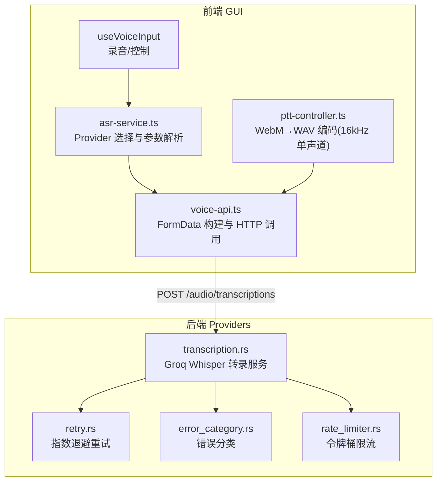
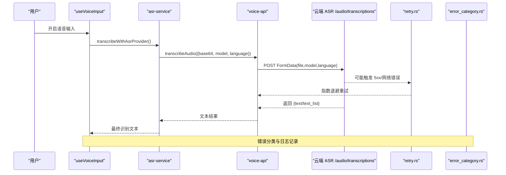
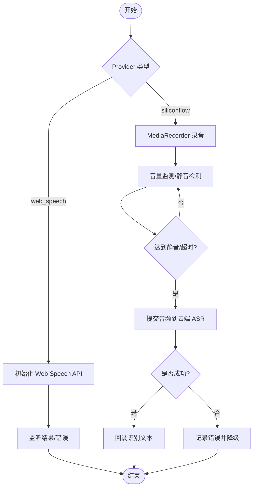
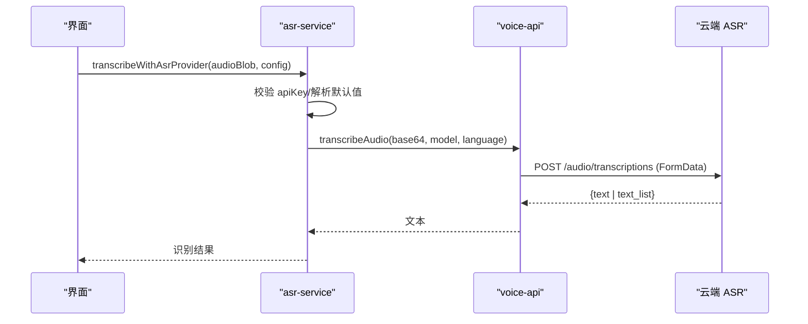
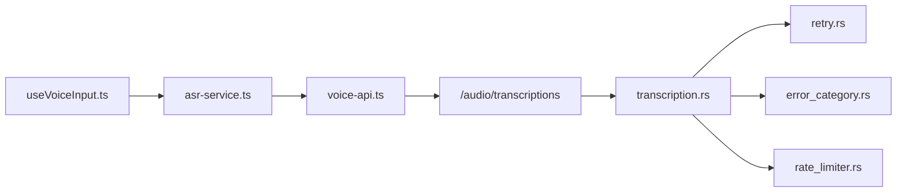

# 语音转录服务

<cite>
**本文引用的文件**
- [transcription.rs](file://agent-diva-providers/src/transcription.rs)
- [asr-service.ts](file://agent-diva-gui/src/features/diva-mate/voice/services/asr-service.ts)
- [voice-api.ts](file://agent-diva-gui/src/features/diva-mate/voice/services/voice-api.ts)
- [useVoiceInput.ts](file://agent-diva-gui/src/features/diva-mate/voice/composables/useVoiceInput.ts)
- [ptt-controller.ts](file://agent-diva-gui/avatar-runtime-vrm/src/runtime/ptt-controller.ts)
- [types.ts](file://agent-diva-gui/src/features/diva-mate/types.ts)
- [voice-log.ts](file://agent-diva-gui/src/features/diva-mate/voice/services/voice-log.ts)
- [retry.rs](file://agent-diva-providers/src/retry.rs)
- [error_category.rs](file://agent-diva-core/src/error_category.rs)
- [rate_limiter.rs](file://agent-diva-core/src/rate_limiter.rs)
- [siliconflow_asr.rs](file://agent-diva-providers/examples/siliconflow_asr.rs)
</cite>

## 目录
1. [简介](#简介)
2. [项目结构](#项目结构)
3. [核心组件](#核心组件)
4. [架构总览](#架构总览)
5. [详细组件分析](#详细组件分析)
6. [依赖关系分析](#依赖关系分析)
7. [性能考量](#性能考量)
8. [故障排查指南](#故障排查指南)
9. [结论](#结论)
10. [附录](#附录)

## 简介
本文件面向 Agent Diva 的语音转录（ASR）能力，系统性说明其前端与后端实现、支持的提供商与音频格式、语言识别能力、配置方法、实时与批量处理流程、缓存策略、错误处理与重试机制，以及扩展新提供商与自定义音频处理管道的最佳实践。文档同时提供面向用户的基本使用方式与面向开发者的扩展指南。

## 项目结构
Agent Diva 的语音转录由“前端采集与调用”和“后端服务与示例”两部分组成：
- 前端（GUI）负责录音、音频预处理、构建请求并调用云端 ASR 接口；同时支持浏览器内置 Web Speech API 作为本地识别路径。
- 后端（Providers）提供基于 Groq Whisper 的转录服务示例，以及通用的重试、限流与错误分类等基础设施。

图表来源
- [useVoiceInput.ts:118-739](file://agent-diva-gui/src/features/diva-mate/voice/composables/useVoiceInput.ts#L118-L739)
- [asr-service.ts:1-74](file://agent-diva-gui/src/features/diva-mate/voice/services/asr-service.ts#L1-L74)
- [voice-api.ts:213-305](file://agent-diva-gui/src/features/diva-mate/voice/services/voice-api.ts#L213-L305)
- [ptt-controller.ts:148-188](file://agent-diva-gui/avatar-runtime-vrm/src/runtime/ptt-controller.ts#L148-L188)
- [transcription.rs:34-166](file://agent-diva-providers/src/transcription.rs#L34-L166)
- [retry.rs:1-181](file://agent-diva-providers/src/retry.rs#L1-L181)
- [error_category.rs:1-118](file://agent-diva-core/src/error_category.rs#L1-L118)
- [rate_limiter.rs:44-92](file://agent-diva-core/src/rate_limiter.rs#L44-L92)

章节来源
- [useVoiceInput.ts:118-739](file://agent-diva-gui/src/features/diva-mate/voice/composables/useVoiceInput.ts#L118-L739)
- [asr-service.ts:1-74](file://agent-diva-gui/src/features/diva-mate/voice/services/asr-service.ts#L1-L74)
- [voice-api.ts:213-305](file://agent-diva-gui/src/features/diva-mate/voice/services/voice-api.ts#L213-L305)
- [ptt-controller.ts:148-188](file://agent-diva-gui/avatar-runtime-vrm/src/runtime/ptt-controller.ts#L148-L188)
- [transcription.rs:34-166](file://agent-diva-providers/src/transcription.rs#L34-L166)
- [retry.rs:1-181](file://agent-diva-providers/src/retry.rs#L1-L181)
- [error_category.rs:1-118](file://agent-diva-core/src/error_category.rs#L1-L118)
- [rate_limiter.rs:44-92](file://agent-diva-core/src/rate_limiter.rs#L44-L92)

## 核心组件
- 前端录音与控制
  - useVoiceInput：管理麦克风权限、Web Speech API 或云端 MediaRecorder 录音、静音检测、超时控制、错误提示与日志记录。
  - asr-service：根据 Provider 类型选择本地或云端转录路径，组装默认 baseUrl/model，校验 API Key。
  - voice-api：将 Base64 音频解码为二进制，构造 FormData 并 POST 到 /audio/transcriptions，解析返回文本。
  - ptt-controller：将 WebM 录音转码为 16kHz 单声道 PCM16 WAV，适配多数 ASR 模型输入要求。
- 后端转录服务
  - transcription.rs：封装 Groq Whisper 转录，读取文件、multipart 上传、超时与错误处理，并提供安全降级方法。
  - retry.rs：对 5xx 与网络错误进行指数退避重试，识别 429 限速并上报。
  - error_category.rs：统一错误分类（可重试/致命/配置/认证/超时），便于上层决策。
  - rate_limiter.rs：令牌桶限流，避免突发请求导致被限流。
- 配置与日志
  - types.ts：MateConfig 定义 ASR/TTS 开关、Provider、语言、API Key、Base URL、模型等。
  - voice-log.ts：统一记录 ASR/TTS 事件，自动脱敏敏感字段。

章节来源
- [useVoiceInput.ts:118-739](file://agent-diva-gui/src/features/diva-mate/voice/composables/useVoiceInput.ts#L118-L739)
- [asr-service.ts:1-74](file://agent-diva-gui/src/features/diva-mate/voice/services/asr-service.ts#L1-L74)
- [voice-api.ts:213-305](file://agent-diva-gui/src/features/diva-mate/voice/services/voice-api.ts#L213-L305)
- [ptt-controller.ts:148-188](file://agent-diva-gui/avatar-runtime-vrm/src/runtime/ptt-controller.ts#L148-L188)
- [transcription.rs:34-166](file://agent-diva-providers/src/transcription.rs#L34-L166)
- [retry.rs:1-181](file://agent-diva-providers/src/retry.rs#L1-L181)
- [error_category.rs:1-118](file://agent-diva-core/src/error_category.rs#L1-L118)
- [rate_limiter.rs:44-92](file://agent-diva-core/src/rate_limiter.rs#L44-L92)
- [types.ts:105-189](file://agent-diva-gui/src/features/diva-mate/types.ts#L105-L189)
- [voice-log.ts:1-59](file://agent-diva-gui/src/features/diva-mate/voice/services/voice-log.ts#L1-L59)

## 架构总览
语音转录的整体流程如下：
- 用户开启语音输入后，useVoiceInput 决定使用 Web Speech API 还是云端 MediaRecorder 录音。
- 若选择云端 Provider（当前为 siliconflow），则通过 asr-service 与 voice-api 将音频以 FormData 形式 POST 到 /audio/transcriptions。
- 后端 transcription.rs 提供 Groq Whisper 转录能力，结合 retry.rs 的重试与 error_category.rs 的错误分类，确保稳定性。
- 前端通过 voice-log.ts 记录关键事件，便于调试与审计。

图表来源
- [useVoiceInput.ts:457-621](file://agent-diva-gui/src/features/diva-mate/voice/composables/useVoiceInput.ts#L457-L621)
- [asr-service.ts:48-73](file://agent-diva-gui/src/features/diva-mate/voice/services/asr-service.ts#L48-L73)
- [voice-api.ts:239-305](file://agent-diva-gui/src/features/diva-mate/voice/services/voice-api.ts#L239-L305)
- [retry.rs:49-181](file://agent-diva-providers/src/retry.rs#L49-L181)
- [error_category.rs:7-28](file://agent-diva-core/src/error_category.rs#L7-L28)

## 详细组件分析

### 前端录音与识别（useVoiceInput）
- 功能要点
  - 支持两种模式：Web Speech API（本地）与云端 MediaRecorder（siliconflow）。
  - 云端模式具备静音检测、最大录音时长、空闲超时与活动阈值控制。
  - 错误分类与友好提示（如未授权、无麦克风、网络不可用）。
  - 通过 voice-log 记录事件，便于问题定位。
- 关键流程
  - 启用时请求麦克风权限，必要时创建 AudioContext 与 AnalyserNode 进行音量监测。
  - 根据 provider 分支启动不同录音与识别逻辑。
  - 识别完成后回调 onRecognizedText，并清理资源。

图表来源
- [useVoiceInput.ts:118-739](file://agent-diva-gui/src/features/diva-mate/voice/composables/useVoiceInput.ts#L118-L739)

章节来源
- [useVoiceInput.ts:118-739](file://agent-diva-gui/src/features/diva-mate/voice/composables/useVoiceInput.ts#L118-L739)

### 云端 ASR 调用（asr-service + voice-api）
- 功能要点
  - 根据 Provider 解析默认 baseUrl 与 model，校验 API Key。
  - 将 Blob 转为 Base64，再解码为二进制，构造 FormData 发送。
  - 支持可选 language 字段，服务端按模型期望解析。
  - 失败时记录 warn 日志并返回空字符串，保证前端不中断。
- 关键流程
  - resolveAsrTranscriptionConfig 统一 endpoint 与模型参数。
  - transcribeAudio 执行 HTTP 请求，解析 text 或 text_list[0]。

图表来源
- [asr-service.ts:48-73](file://agent-diva-gui/src/features/diva-mate/voice/services/asr-service.ts#L48-L73)
- [voice-api.ts:226-305](file://agent-diva-gui/src/features/diva-mate/voice/services/voice-api.ts#L226-L305)

章节来源
- [asr-service.ts:1-74](file://agent-diva-gui/src/features/diva-mate/voice/services/asr-service.ts#L1-L74)
- [voice-api.ts:213-305](file://agent-diva-gui/src/features/diva-mate/voice/services/voice-api.ts#L213-L305)

### 音频预处理（ptt-controller）
- 功能要点
  - 将 WebM 录音转码为 16kHz 单声道 PCM16 WAV，满足多数 ASR 模型输入要求。
  - 在编码失败时抛出错误并通过钩子通知上层。
- 适用场景
  - 当需要稳定采样率与声道数时，优先使用该编码器输出。

章节来源
- [ptt-controller.ts:148-188](file://agent-diva-gui/avatar-runtime-vrm/src/runtime/ptt-controller.ts#L148-L188)

### 后端转录服务（transcription.rs）
- 功能要点
  - 基于 Groq Whisper API，支持 MP3/WAV/OGG/FLAC/M4A 等常见格式。
  - 通过 multipart/form-data 上传音频与模型名，设置超时。
  - 提供 safe 版本在失败时返回空字符串，便于非阻塞场景。
- 错误处理
  - 明确区分未配置 API Key、文件不存在、HTTP 错误与 API 错误。

章节来源
- [transcription.rs:34-166](file://agent-diva-providers/src/transcription.rs#L34-L166)

### 重试与限流（retry.rs + rate_limiter.rs）
- 重试策略
  - 指数退避 + 抖动，针对 5xx 与网络错误自动重试。
  - 识别 429 限速并转换为 RateLimited 错误。
- 限流策略
  - 令牌桶算法，平滑突发流量，降低被限流概率。

章节来源
- [retry.rs:1-181](file://agent-diva-providers/src/retry.rs#L1-L181)
- [rate_limiter.rs:44-92](file://agent-diva-core/src/rate_limiter.rs#L44-L92)

### 错误分类（error_category.rs）
- 将错误分为可重试、致命、配置、认证、超时等类别，便于上层统一处理策略。

章节来源
- [error_category.rs:1-118](file://agent-diva-core/src/error_category.rs#L1-L118)

### 配置与日志（types.ts + voice-log.ts）
- MateConfig 集中管理 ASR/TTS 开关、Provider、语言、API Key、Base URL、模型等。
- voice-log 统一记录事件，自动脱敏 API Key 等敏感信息。

章节来源
- [types.ts:105-189](file://agent-diva-gui/src/features/diva-mate/types.ts#L105-L189)
- [voice-log.ts:1-59](file://agent-diva-gui/src/features/diva-mate/voice/services/voice-log.ts#L1-L59)

## 依赖关系分析
- 前端依赖
  - useVoiceInput 依赖 asr-service 与 voice-api，间接依赖 ptt-controller 的音频编码能力。
  - voice-api 直接调用云端 /audio/transcriptions。
- 后端依赖
  - transcription.rs 依赖 reqwest 进行 HTTP 请求，结合 retry.rs 与 error_category.rs 提升健壮性。
  - rate_limiter.rs 可在上游调用处限制并发与速率。

图表来源
- [useVoiceInput.ts:457-621](file://agent-diva-gui/src/features/diva-mate/voice/composables/useVoiceInput.ts#L457-L621)
- [asr-service.ts:48-73](file://agent-diva-gui/src/features/diva-mate/voice/services/asr-service.ts#L48-L73)
- [voice-api.ts:239-305](file://agent-diva-gui/src/features/diva-mate/voice/services/voice-api.ts#L239-L305)
- [transcription.rs:93-166](file://agent-diva-providers/src/transcription.rs#L93-L166)
- [retry.rs:49-181](file://agent-diva-providers/src/retry.rs#L49-L181)
- [error_category.rs:7-28](file://agent-diva-core/src/error_category.rs#L7-L28)
- [rate_limiter.rs:44-92](file://agent-diva-core/src/rate_limiter.rs#L44-L92)

章节来源
- [useVoiceInput.ts:457-621](file://agent-diva-gui/src/features/diva-mate/voice/composables/useVoiceInput.ts#L457-L621)
- [asr-service.ts:48-73](file://agent-diva-gui/src/features/diva-mate/voice/services/asr-service.ts#L48-L73)
- [voice-api.ts:239-305](file://agent-diva-gui/src/features/diva-mate/voice/services/voice-api.ts#L239-L305)
- [transcription.rs:93-166](file://agent-diva-providers/src/transcription.rs#L93-L166)
- [retry.rs:49-181](file://agent-diva-providers/src/retry.rs#L49-L181)
- [error_category.rs:7-28](file://agent-diva-core/src/error_category.rs#L7-L28)
- [rate_limiter.rs:44-92](file://agent-diva-core/src/rate_limiter.rs#L44-L92)

## 性能考量
- 音频质量优化
  - 使用 16kHz 单声道 PCM16 WAV 作为通用输入格式，提高识别准确率与兼容性。
  - 合理设置录音时长与静音阈值，减少无效音频上传。
- 网络与重试
  - 指数退避与抖动降低雪崩风险；对 429 限速进行专门处理。
  - 建议在上层集成令牌桶限流，避免瞬时高并发。
- 前端降级
  - 云端失败时返回空字符串并记录日志，不影响主流程；可回退到本地 Web Speech API。
- 资源释放
  - 及时停止 MediaStream、关闭 AudioContext，避免内存泄漏。

## 故障排查指南
- 常见问题
  - 未配置 API Key：前端会抛出缺失密钥错误；后端会返回 NoApiKey。
  - 文件不存在：后端读取失败时返回 FileNotFound。
  - 网络错误/超时：前端记录 warn 日志并返回空；后端可通过重试恢复。
  - 权限问题：浏览器未授予麦克风权限时给出明确提示。
- 日志与调试
  - 使用 voice-log 查看 ASR/TTS 事件，注意敏感字段已自动脱敏。
  - 检查 Provider 默认 baseUrl 与 model 是否正确解析。
- 建议步骤
  - 确认 Provider 与模型匹配；验证 Base URL 末尾斜杠处理。
  - 观察重试次数与延迟是否符合预期；必要时调整限流参数。
  - 对于复杂音频，先转码为 16kHz 单声道 PCM16 WAV 再上传。

章节来源
- [asr-service.ts:48-73](file://agent-diva-gui/src/features/diva-mate/voice/services/asr-service.ts#L48-L73)
- [voice-api.ts:239-305](file://agent-diva-gui/src/features/diva-mate/voice/services/voice-api.ts#L239-L305)
- [transcription.rs:93-166](file://agent-diva-providers/src/transcription.rs#L93-L166)
- [retry.rs:49-181](file://agent-diva-providers/src/retry.rs#L49-L181)
- [voice-log.ts:1-59](file://agent-diva-gui/src/features/diva-mate/voice/services/voice-log.ts#L1-L59)

## 结论
Agent Diva 的语音转录服务在前端实现了灵活的录音与识别路径，在后端提供了稳定的 Groq Whisper 转录能力与完善的重试、限流与错误分类机制。通过统一的配置结构与日志系统，用户可以便捷地启用与调优 ASR 功能，开发者也可以轻松扩展新的提供商与音频处理管道。

## 附录

### 支持的转录服务提供商
- 当前前端默认支持：
  - web_speech：浏览器内置语音识别（无需 API Key）。
  - siliconflow：云端 ASR，需配置 API Key、Base URL 与模型。
- 后端示例：
  - Groq Whisper：通过 transcription.rs 提供，支持多种音频格式。

章节来源
- [types.ts:105-189](file://agent-diva-gui/src/features/diva-mate/types.ts#L105-L189)
- [voice-api.ts:213-237](file://agent-diva-gui/src/features/diva-mate/voice/services/voice-api.ts#L213-L237)
- [transcription.rs:34-166](file://agent-diva-providers/src/transcription.rs#L34-L166)

### 音频格式支持与语言识别
- 前端
  - 录音输出：WebM（MediaRecorder），可转码为 16kHz 单声道 PCM16 WAV。
  - 上传格式：FormData 中的 file 字段，contentType 可指定。
- 后端
  - 支持 MP3/WAV/OGG/FLAC/M4A（Groq Whisper 示例）。
- 语言识别
  - 前端可传入 language 字段；后端按模型期望解析。

章节来源
- [ptt-controller.ts:148-188](file://agent-diva-gui/avatar-runtime-vrm/src/runtime/ptt-controller.ts#L148-L188)
- [voice-api.ts:239-305](file://agent-diva-gui/src/features/diva-mate/voice/services/voice-api.ts#L239-L305)
- [transcription.rs:86-92](file://agent-diva-providers/src/transcription.rs#L86-L92)

### 配置示例（API 密钥、音频预处理、转录参数）
- 前端 MateConfig（关键字段）
  - asrEnabled：是否启用 ASR。
  - asrProvider：web_speech 或 siliconflow。
  - asrLanguage：语言标签（如 zh-CN）。
  - asrApiKey：云端 Provider 的 API Key。
  - asrBaseUrl：云端 Base URL（如 https://api.siliconflow.cn/v1）。
  - asrModel：模型名称（如 FunAudioLLM/SenseVoiceSmall）。
- 后端环境变量
  - GROQ_API_KEY：用于 Groq Whisper 转录服务。
- 音频预处理
  - 推荐将录音转码为 16kHz 单声道 PCM16 WAV 后再上传。
- 转录参数
  - 通过 FormData 传递 model 与 language。

章节来源
- [types.ts:105-189](file://agent-diva-gui/src/features/diva-mate/types.ts#L105-L189)
- [voice-api.ts:213-237](file://agent-diva-gui/src/features/diva-mate/voice/services/voice-api.ts#L213-L237)
- [transcription.rs:44-68](file://agent-diva-providers/src/transcription.rs#L44-L68)

### 实时转录、批量处理与缓存策略
- 实时转录
  - 使用 MediaRecorder 分段录音，静音检测后一次性提交，适合短语音交互。
  - Web Speech API 提供流式中间结果，适合低延迟场景。
- 批量处理
  - 可将多个音频片段合并为单个文件或分批上传，结合重试与限流提升吞吐。
- 缓存策略
  - 当前代码未实现显式缓存；可在上层对相同音频哈希结果进行缓存，避免重复请求。

章节来源
- [useVoiceInput.ts:308-455](file://agent-diva-gui/src/features/diva-mate/voice/composables/useVoiceInput.ts#L308-L455)
- [voice-api.ts:239-305](file://agent-diva-gui/src/features/diva-mate/voice/services/voice-api.ts#L239-L305)

### 错误处理与重试逻辑最佳实践
- 前端
  - 捕获权限、网络与编码错误，记录日志并降级。
  - 对云端失败返回空字符串，保证主流程继续。
- 后端
  - 使用指数退避重试，识别 429 限速；对 5xx 与网络错误自动重试。
  - 通过错误分类统一处理策略。
- 限流
  - 使用令牌桶限制请求速率，避免触发限速。

章节来源
- [useVoiceInput.ts:564-621](file://agent-diva-gui/src/features/diva-mate/voice/composables/useVoiceInput.ts#L564-L621)
- [voice-api.ts:267-305](file://agent-diva-gui/src/features/diva-mate/voice/services/voice-api.ts#L267-L305)
- [retry.rs:49-181](file://agent-diva-providers/src/retry.rs#L49-L181)
- [error_category.rs:7-28](file://agent-diva-core/src/error_category.rs#L7-L28)
- [rate_limiter.rs:44-92](file://agent-diva-core/src/rate_limiter.rs#L44-L92)

### 如何添加新的转录服务提供商
- 前端
  - 在 types.ts 中扩展 asrProvider 枚举。
  - 在 voice-api.ts 中新增 Provider 默认 baseUrl 与 model。
  - 在 asr-service.ts 中增加 Provider 判断与参数解析。
- 后端
  - 参考 transcription.rs 实现新的 HTTP 客户端与响应解析。
  - 复用 retry.rs 与 error_category.rs 提升健壮性。
- 示例参考
  - siliconflow_asr.rs 展示了云端 ASR 的请求与响应处理。

章节来源
- [types.ts:105-189](file://agent-diva-gui/src/features/diva-mate/types.ts#L105-L189)
- [voice-api.ts:213-237](file://agent-diva-gui/src/features/diva-mate/voice/services/voice-api.ts#L213-L237)
- [asr-service.ts:44-73](file://agent-diva-gui/src/features/diva-mate/voice/services/asr-service.ts#L44-L73)
- [transcription.rs:34-166](file://agent-diva-providers/src/transcription.rs#L34-L166)
- [siliconflow_asr.rs:119-142](file://agent-diva-providers/examples/siliconflow_asr.rs#L119-L142)

### 如何自定义音频处理管道
- 前端
  - 替换 ptt-controller 的编码逻辑，输出目标采样率与声道数。
  - 在 voice-api 中设置正确的 contentType 与 fileName。
- 后端
  - 在 transcription.rs 中调整文件格式校验与上传参数。
  - 结合 rate_limiter.rs 控制并发与速率。

章节来源
- [ptt-controller.ts:148-188](file://agent-diva-gui/avatar-runtime-vrm/src/runtime/ptt-controller.ts#L148-L188)
- [voice-api.ts:239-305](file://agent-diva-gui/src/features/diva-mate/voice/services/voice-api.ts#L239-L305)
- [transcription.rs:93-166](file://agent-diva-providers/src/transcription.rs#L93-L166)
- [rate_limiter.rs:44-92](file://agent-diva-core/src/rate_limiter.rs#L44-L92)

### 面向用户的基本使用方法
- 启用语音输入：在设置中选择 ASR Provider（web_speech 或 siliconflow），配置语言与必要密钥。
- 开始录音：点击麦克风，允许权限后即可开始识别。
- 查看结果：识别文本将显示在对话中；如需调试，可查看语音日志。

章节来源
- [types.ts:105-189](file://agent-diva-gui/src/features/diva-mate/types.ts#L105-L189)
- [useVoiceInput.ts:688-725](file://agent-diva-gui/src/features/diva-mate/voice/composables/useVoiceInput.ts#L688-L725)
- [voice-log.ts:1-59](file://agent-diva-gui/src/features/diva-mate/voice/services/voice-log.ts#L1-L59)