# 核心特性

<cite>
**本文引用的文件**
- [README.md](file://README.md)
- [agent-diva-channels/src/lib.rs](file://agent-diva-channels/src/lib.rs)
- [agent-diva-channels/src/manager.rs](file://agent-diva-channels/src/manager.rs)
- [agent-diva-core/src/config/schema.rs](file://agent-diva-core/src/config/schema.rs)
- [agent-diva-core/src/memory/mod.rs](file://agent-diva-core/src/memory/mod.rs)
- [agent-diva-laputa/src/lib.rs](file://agent-diva-laputa/src/lib.rs)
- [agent-diva-providers/src/catalog.rs](file://agent-diva-providers/src/catalog.rs)
- [agent-diva-sandbox/src/lib.rs](file://agent-diva-sandbox/src/lib.rs)
- [agent-diva-manager/src/marketplace.rs](file://agent-diva-manager/src/marketplace.rs)
- [agent-diva-cli/src/main.rs](file://agent-diva-cli/src/main.rs)
- [agent-diva-manager/src/lib.rs](file://agent-diva-manager/src/lib.rs)
- [agent-diva-gui/src/main.ts](file://agent-diva-gui/src/main.ts)
</cite>

## 目录
1. [简介](#简介)
2. [项目结构](#项目结构)
3. [核心组件](#核心组件)
4. [架构总览](#架构总览)
5. [详细组件分析](#详细组件分析)
6. [依赖关系分析](#依赖关系分析)
7. [性能考量](#性能考量)
8. [故障排查指南](#故障排查指南)
9. [结论](#结论)
10. [附录：配置与使用示例](#附录配置与使用示例)

## 简介
Agent Diva 是一个自托管的个人 AI 网关，将多种聊天平台（Telegram、Discord、QQ、钉钉、飞书、邮件等）接入 LLM，并提供持久化记忆、受控的人格进化、技能市场、沙箱执行、人工审批、定时任务以及完整的 UI（CLI、TUI、GUI）。其目标是“开箱即用”的本地 AI 助手框架，同时具备生产级工程能力。

## 项目结构
仓库采用多 crate 工作区组织，按职责划分模块：
- agent-diva-core：共享配置、会话、内存、计划、心跳、事件总线等基础能力
- agent-diva-agent：Agent 循环、上下文组装、技能/子代理流程
- agent-diva-providers：LLM/语音转写提供商抽象与预设
- agent-diva-channels：各聊天平台适配器（Telegram、Discord、QQ、钉钉、飞书、Email 等）
- agent-diva-tools：内置工具（文件系统、Shell、Web、Cron、Spawn 等）
- agent-diva-files：文件索引与管理辅助
- agent-diva-tooling：共享工具抽象与实用库
- agent-diva-neuron：桌面 GUI 使用的支持类型/辅助
- agent-diva-manager：本地网关与 HTTP 控制面
- agent-diva-laputa：BML 记忆存储 + Laputa 人格治理
- agent-diva-autodream：AutoDream 提案生命周期（不直接写入人格）
- agent-diva-sandbox：沙箱策略、执行、审批/守护支持
- agent-diva-cli：用户 CLI 入口
- agent-diva-service：Windows 服务包装
- agent-diva-gui：Tauri + Vue 3 桌面应用

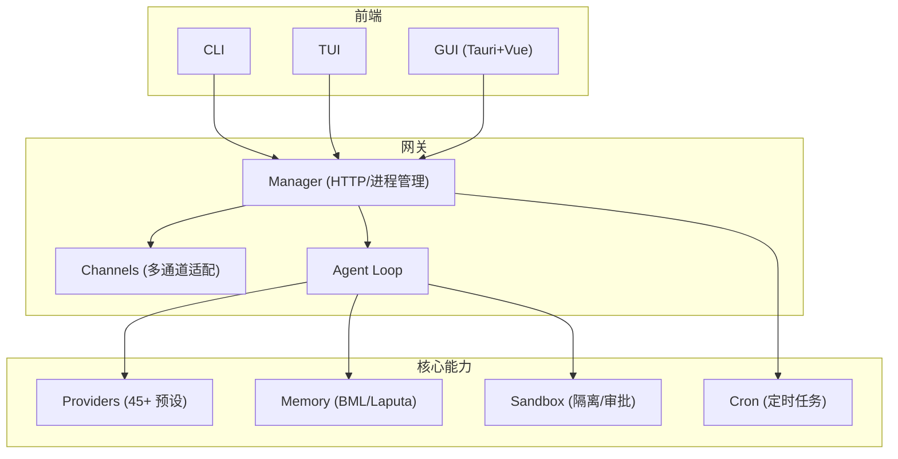

图表来源
- [README.md:43-85](file://README.md#L43-L85)
- [agent-diva-manager/src/lib.rs:1-20](file://agent-diva-manager/src/lib.rs#L1-L20)
- [agent-diva-channels/src/lib.rs:1-53](file://agent-diva-channels/src/lib.rs#L1-L53)

章节来源
- [README.md:87-108](file://README.md#L87-L108)

## 核心组件
- 多通道网关：统一接入 Telegram、Discord、QQ、钉钉、飞书、Email 等，并支持可选编译的 Slack、WhatsApp、Matrix、IRC、Mattermost、Nextcloud Talk。
- 45+ 内置提供商预设：OpenRouter、DeepSeek、OpenAI、Anthropic、Gemini、Zhipu、Moonshot、StepFun、Doubao、SiliconFlow、Groq、Ollama 等，支持 OpenAI 兼容端点与语音转写。
- 分层记忆系统：BML（SQLite + FTS5 的单一权威存储）+ Laputa（提案、治理、回滚、审计、Frozen Core 基线）。
- 人格与进化：Markdown 人格工作区；AutoDream 生成提案，GUI Evolution 审阅并受控应用。
- 技能市场：从 skills.sh 搜索/安装 SKILL.md 技能，GUI 设置中管理。
- 沙箱执行环境：命令隔离、文件系统访问控制、保护路径、审批缓存、Guardian 自动审批。
- 人工审批流程：持久化审批中心，CLI/GUI 均可查看与决策。
- 定时任务调度：Gateway 内运行 cron，支持投递到通道。
- 完整 UI 三件套：CLI（自动化）、TUI（终端聊天）、GUI（Tauri 桌面应用）。

章节来源
- [README.md:60-85](file://README.md#L60-L85)
- [agent-diva-channels/src/lib.rs:1-53](file://agent-diva-channels/src/lib.rs#L1-L53)
- [agent-diva-providers/src/catalog.rs:1-664](file://agent-diva-providers/src/catalog.rs#L1-L664)
- [agent-diva-core/src/memory/mod.rs:1-47](file://agent-diva-core/src/memory/mod.rs#L1-L47)
- [agent-diva-laputa/src/lib.rs:1-56](file://agent-diva-laputa/src/lib.rs#L1-L56)
- [agent-diva-manager/src/marketplace.rs:1-365](file://agent-diva-manager/src/marketplace.rs#L1-L365)
- [agent-diva-sandbox/src/lib.rs:1-116](file://agent-diva-sandbox/src/lib.rs#L1-L116)
- [agent-diva-cli/src/main.rs:88-205](file://agent-diva-cli/src/main.rs#L88-L205)

## 架构总览
消息从渠道进入网关的消息总线，经 Agent Loop 调用 LLM 与工具（在沙箱中），结果再回发到对应渠道；记忆与人格由 BML/Laputa 提供；定时任务在 Gateway 内运行；CLI/TUI/GUI 通过 Manager 暴露的 HTTP/进程接口交互。

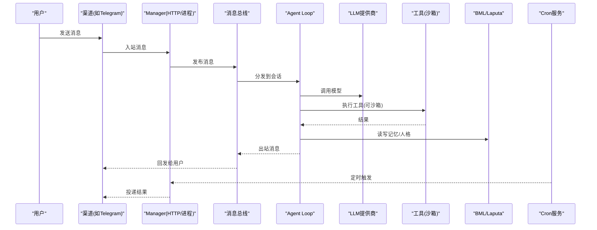

图表来源
- [README.md:43-85](file://README.md#L43-L85)
- [agent-diva-manager/src/lib.rs:1-20](file://agent-diva-manager/src/lib.rs#L1-L20)
- [agent-diva-core/src/memory/mod.rs:1-47](file://agent-diva-core/src/memory/mod.rs#L1-L47)
- [agent-diva-sandbox/src/lib.rs:1-116](file://agent-diva-sandbox/src/lib.rs#L1-L116)

## 详细组件分析

### 多通道网关支持（Telegram、Discord、QQ、钉钉、飞书、邮件等）
- 功能：统一接入多个聊天平台，默认启用 Telegram、Discord、QQ、钉钉、飞书、Email；其余通道通过 Cargo feature 按需编译。
- 配置方式：在 config.json 中为各通道配置凭据与白名单等字段（例如飞书的 app_id/app_secret/encrypt_key/verification_token/allow_from/port；钉钉的 client_id/client_secret；Discord 的 token/gateway_url/intents；Email 的 IMAP/SMTP 等）。
- 使用场景：将现有聊天平台作为 Agent 的输入输出通道，实现跨平台对话与通知。
- 协作关系：Channel 管理器负责注册、校验与生命周期管理；入站消息经总线进入 Agent Loop；出站消息由 Manager 路由至对应 Channel。

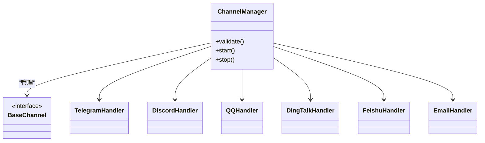

图表来源
- [agent-diva-channels/src/lib.rs:1-53](file://agent-diva-channels/src/lib.rs#L1-L53)
- [agent-diva-channels/src/manager.rs:1-41](file://agent-diva-channels/src/manager.rs#L1-L41)
- [agent-diva-core/src/config/schema.rs:709-760](file://agent-diva-core/src/config/schema.rs#L709-L760)

章节来源
- [agent-diva-channels/src/lib.rs:1-53](file://agent-diva-channels/src/lib.rs#L1-L53)
- [agent-diva-channels/src/manager.rs:1-41](file://agent-diva-channels/src/manager.rs#L1-L41)
- [agent-diva-core/src/config/schema.rs:709-760](file://agent-diva-core/src/config/schema.rs#L709-L760)

### 45+ 内置提供商预设
- 功能：集中管理提供商视图、模型目录、自定义提供商与运行时发现；支持 OpenAI/Anthropic/Google 等 API 类型与 OpenAI 兼容端点。
- 配置方式：在 providers 下配置 apiKey/apiBase/defaultModel；可通过 CLI 列出/设置/登录提供商；支持添加/删除自定义模型。
- 使用场景：快速切换不同 LLM 供应商或本地 Ollama；对聚合网关（如 OpenRouter）进行前缀路由。
- 协作关系：CatalogService 读取配置与注册表，合并静态与运行时模型目录；Manager/GUI 暴露查询与变更接口。

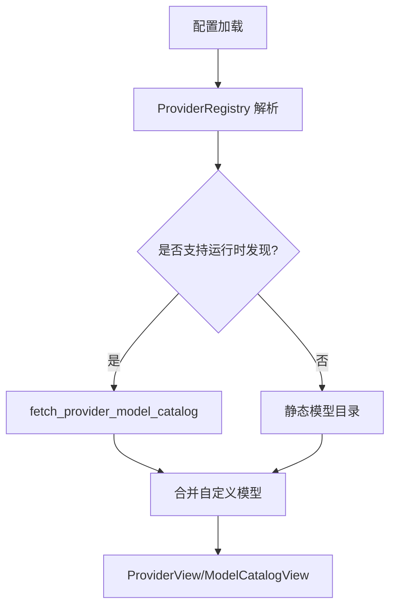

图表来源
- [agent-diva-providers/src/catalog.rs:1-664](file://agent-diva-providers/src/catalog.rs#L1-L664)

章节来源
- [agent-diva-providers/src/catalog.rs:1-664](file://agent-diva-providers/src/catalog.rs#L1-L664)

### 分层记忆系统（BML + Laputa）
- 功能：BML 为机器级 SQLite + FTS5 的单一权威存储；Laputa 在其之上提供提案、治理、回滚、审计与 Frozen Core 人格基线。
- 配置方式：通过 workspace 下的 .laputa/memory.sqlite3 等路径管理；Persona 文档位于人格工作区；Laputa 路径由 LaputaPaths 管理。
- 使用场景：会话间持久化记忆、检索增强、受控的人格演进与历史回溯。
- 协作关系：Agent Loop 通过 memory provider 接口读写；Laputa 约束写入边界，确保治理路径唯一。

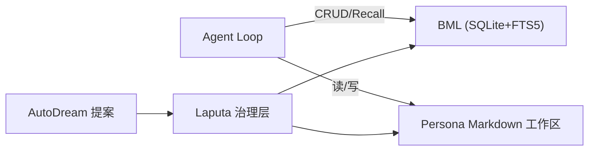

图表来源
- [agent-diva-core/src/memory/mod.rs:1-47](file://agent-diva-core/src/memory/mod.rs#L1-L47)
- [agent-diva-laputa/src/lib.rs:1-56](file://agent-diva-laputa/src/lib.rs#L1-L56)

章节来源
- [agent-diva-core/src/memory/mod.rs:1-47](file://agent-diva-core/src/memory/mod.rs#L1-L47)
- [agent-diva-laputa/src/lib.rs:1-56](file://agent-diva-laputa/src/lib.rs#L1-L56)

### 人格与进化机制
- 功能：人格以 Markdown 形式维护，包含身份、关系、红线、用户、世界、梦境、暗面等维度；AutoDream 生成提案，GUI Evolution 审阅并受控应用；支持修复与历史版本。
- 配置方式：通过 GUI 初始化/编辑人格文档；通过 CLI/Manager 获取状态、提交变更；Laputa 冻结核心保证会话一致性。
- 使用场景：长期个性化、安全可控的自我改进与知识沉淀。
- 协作关系：Persona Service 与 Laputa 治理层协作，确保所有变更走提案—审批—应用的闭环。

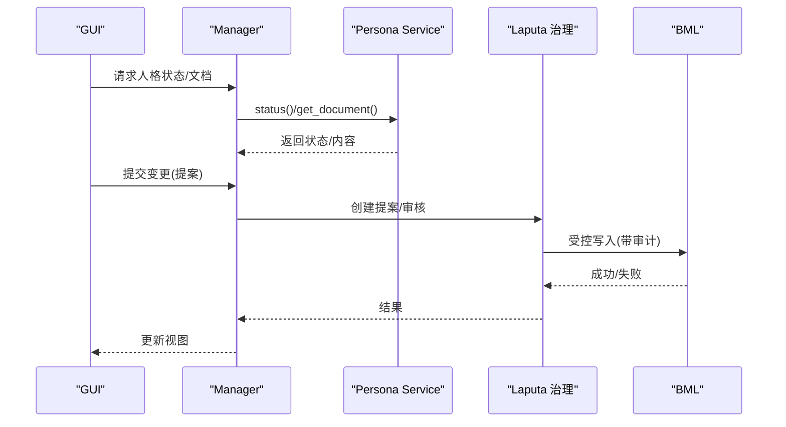

图表来源
- [agent-diva-manager/src/handlers/persona.rs:53-95](file://agent-diva-manager/src/handlers/persona.rs#L53-L95)
- [agent-diva-laputa/src/lib.rs:1-56](file://agent-diva-laputa/src/lib.rs#L1-L56)

章节来源
- [agent-diva-manager/src/handlers/persona.rs:53-95](file://agent-diva-manager/src/handlers/persona.rs#L53-L95)
- [agent-diva-laputa/src/lib.rs:1-56](file://agent-diva-laputa/src/lib.rs#L1-L56)

### 技能市场
- 功能：通过 skills.sh 目录 API 搜索与下载技能快照（SKILL.md 等），离线嵌入精选榜单，无需 Node/git 即可安装。
- 配置方式：环境变量覆盖 marketplace 基址；GUI 设置中浏览/安装/删除技能；CLI 也可配合 Manager 操作。
- 使用场景：快速扩展 Agent 能力，复用社区技能。
- 协作关系：MarketplaceClient 负责网络请求与错误处理；Manager 暴露安装/卸载接口；Agent 在运行时加载 SKILL.md。

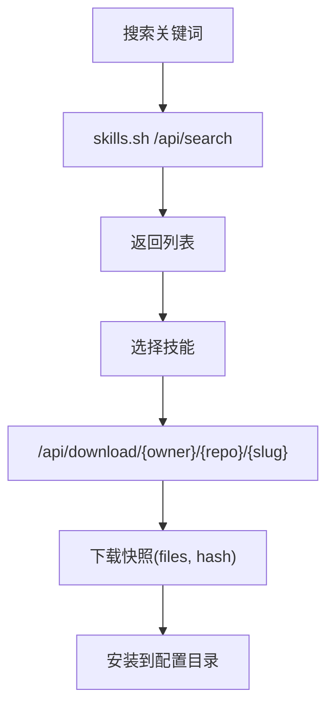

图表来源
- [agent-diva-manager/src/marketplace.rs:1-365](file://agent-diva-manager/src/marketplace.rs#L1-L365)

章节来源
- [agent-diva-manager/src/marketplace.rs:1-365](file://agent-diva-manager/src/marketplace.rs#L1-L365)

### 沙箱执行环境
- 功能：进程隔离、文件系统访问控制、保护路径、审批缓存、Guardian 自动审批；支持 ExecPolicy 规则与 ToolOrchestrator 编排。
- 配置方式：通过 SandboxPolicy/ExecPolicy 配置模式与规则；可通过环境变量关闭沙箱（仅调试用）；Manager 集成审批协调器。
- 使用场景：安全执行 Shell/外部命令、文件操作、网络请求等工具调用。
- 协作关系：ToolOrchestrator 根据策略决定是否需要审批/隔离；ApprovalCoordinator 与 Governance 对接；结果回传 Agent。

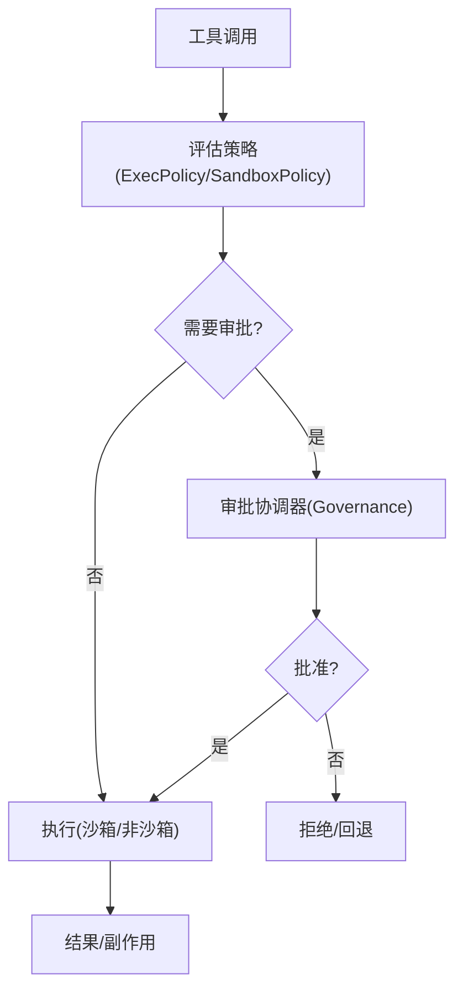

图表来源
- [agent-diva-sandbox/src/lib.rs:1-116](file://agent-diva-sandbox/src/lib.rs#L1-L116)

章节来源
- [agent-diva-sandbox/src/lib.rs:1-116](file://agent-diva-sandbox/src/lib.rs#L1-L116)

### 人工审批流程
- 功能：持久化审批中心，支持列表、决策、撤销、批量审查；CLI 与 GUI 均可操作；与沙箱、计划、人格变更等深度集成。
- 配置方式：通过 CLI 命令查看/决策审批；GUI 审批中心卡片/抽屉式界面；Manager 提供 REST 接口。
- 使用场景：高风险操作（如修改人格、执行命令、写入记忆）需人类确认。
- 协作关系：Sandbox/Planning/Persona 等子系统发起审批请求；Manager 持久化并暴露查询；CLI/GUI 驱动决策。

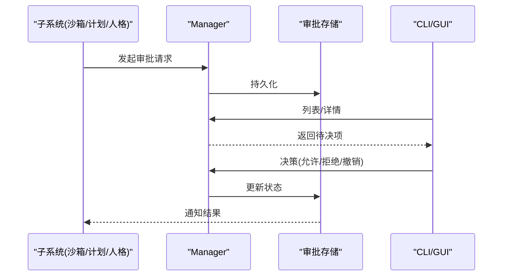

图表来源
- [agent-diva-cli/src/main.rs:149-242](file://agent-diva-cli/src/main.rs#L149-L242)

章节来源
- [agent-diva-cli/src/main.rs:149-242](file://agent-diva-cli/src/main.rs#L149-L242)

### 定时任务调度
- 功能：Gateway 内运行 cron 任务，支持表达式/间隔/一次性时间；可将结果投递到指定渠道；支持启停与手动触发。
- 配置方式：CLI 添加/列出/移除/启用/运行任务；Manager 内部 CronService 管理状态与调度。
- 使用场景：周期性提醒、巡检、数据拉取后推送消息。
- 协作关系：CronService 触发任务 -> 调用 Agent Loop -> 通过渠道投递结果。

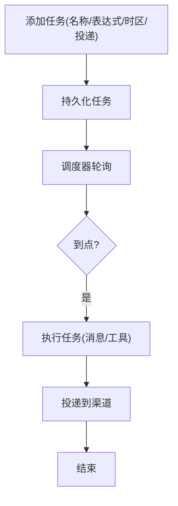

图表来源
- [agent-diva-cli/src/main.rs:321-381](file://agent-diva-cli/src/main.rs#L321-L381)
- [agent-diva-core/src/cron/mod.rs:1-11](file://agent-diva-core/src/cron/mod.rs#L1-L11)

章节来源
- [agent-diva-cli/src/main.rs:321-381](file://agent-diva-cli/src/main.rs#L321-L381)
- [agent-diva-core/src/cron/mod.rs:1-11](file://agent-diva-core/src/cron/mod.rs#L1-L11)

### 完整 UI 三件套（CLI、TUI、GUI）
- CLI：提供 onboard、gateway、agent、chat、tui、status、channels、provider、config、service、cron、workspace、todo、mask 等命令，适合自动化与远程管理。
- TUI：终端交互式聊天，轻量且便于脚本集成。
- GUI：基于 Tauri + Vue 3，提供实时流式聊天、工具调用可视化、审批中心、提供商/渠道配置、技能市场、记忆/人格治理、笔记本、定时任务、网关控制面板等。
- 协作关系：CLI/TUI/GUI 通过 Manager 的 HTTP/进程接口与 Gateway 交互；GUI 还内嵌 Gateway 进程以实现原子工作区切换。

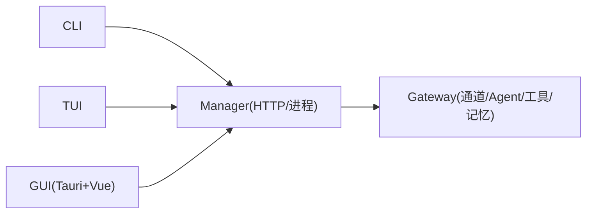

图表来源
- [agent-diva-cli/src/main.rs:88-205](file://agent-diva-cli/src/main.rs#L88-L205)
- [agent-diva-manager/src/lib.rs:1-20](file://agent-diva-manager/src/lib.rs#L1-L20)
- [agent-diva-gui/src/main.ts:1-13](file://agent-diva-gui/src/main.ts#L1-L13)

章节来源
- [agent-diva-cli/src/main.rs:88-205](file://agent-diva-cli/src/main.rs#L88-L205)
- [agent-diva-manager/src/lib.rs:1-20](file://agent-diva-manager/src/lib.rs#L1-L20)
- [agent-diva-gui/src/main.ts:1-13](file://agent-diva-gui/src/main.ts#L1-L13)

## 依赖关系分析
- 低耦合高内聚：每个 crate 聚焦单一职责，通过清晰接口（如 memory provider、channel handler、catalog service）交互。
- 关键依赖链：
  - CLI/TUI/GUI → Manager → Channels/Agent Loop → Providers/Memory/Sandbox/Cron
  - Laputa 治理层约束 BML 写入，确保人格/记忆变更可审计、可回滚
  - MarketplaceClient 独立于主流程，仅在技能安装时联网
- 潜在风险：
  - 渠道配置缺失导致无法连接
  - 提供商鉴权失败或模型目录不可达
  - 沙箱策略过严导致误拒，或过松带来安全风险
  - 审批队列积压影响用户体验

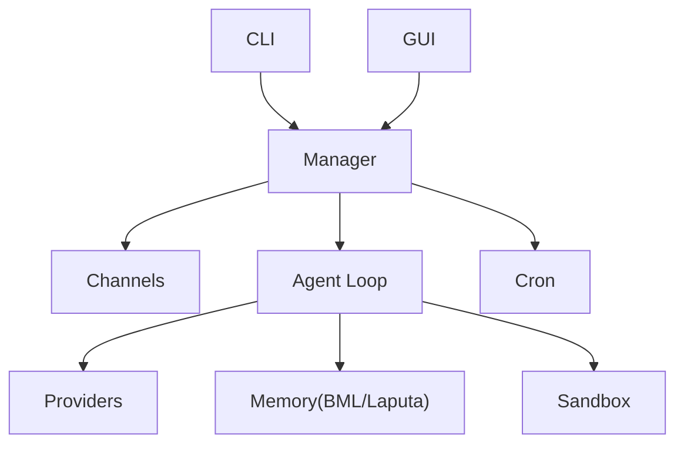

图表来源
- [agent-diva-manager/src/lib.rs:1-20](file://agent-diva-manager/src/lib.rs#L1-L20)
- [agent-diva-channels/src/lib.rs:1-53](file://agent-diva-channels/src/lib.rs#L1-L53)
- [agent-diva-core/src/memory/mod.rs:1-47](file://agent-diva-core/src/memory/mod.rs#L1-L47)
- [agent-diva-sandbox/src/lib.rs:1-116](file://agent-diva-sandbox/src/lib.rs#L1-L116)
- [agent-diva-core/src/cron/mod.rs:1-11](file://agent-diva-core/src/cron/mod.rs#L1-L11)

章节来源
- [agent-diva-manager/src/lib.rs:1-20](file://agent-diva-manager/src/lib.rs#L1-L20)
- [agent-diva-channels/src/lib.rs:1-53](file://agent-diva-channels/src/lib.rs#L1-L53)
- [agent-diva-core/src/memory/mod.rs:1-47](file://agent-diva-core/src/memory/mod.rs#L1-L47)
- [agent-diva-sandbox/src/lib.rs:1-116](file://agent-diva-sandbox/src/lib.rs#L1-L116)
- [agent-diva-core/src/cron/mod.rs:1-11](file://agent-diva-core/src/cron/mod.rs#L1-L11)

## 性能考量
- 提供商模型目录：优先使用运行时发现，失败时回退到静态目录，减少网络抖动影响。
- 记忆检索：BML 使用 FTS5 全文检索，注意查询词与预算控制，避免长上下文导致的延迟。
- 渠道连接：各通道保持长连接/重连逻辑，合理设置超时与重试。
- 沙箱执行：最小权限原则，限制文件系统与命令前缀，降低 IO 与 CPU 开销。
- 审批队列：批处理与分页展示，避免阻塞主流程。

[本节为通用指导，不直接分析具体文件]

## 故障排查指南
- 渠道无法连接：检查 config.json 中对应通道的 enabled、凭据与 allow_from；使用 CLI channels status 查看状态。
- 提供商不可用：使用 provider list/status/models 检查鉴权与模型目录；必要时切换到 static_fallback。
- 记忆/人格异常：查看 Laputa 提案与历史，必要时通过 repair 修复；关注 Frozen Core 基线。
- 沙箱误拒：调整 ExecPolicy/SandboxPolicy，或使用 Guardian 自动审批；必要时临时放宽规则并记录审计。
- 审批堆积：使用 approvals list/review 批量处理；关注超时与过期策略。
- 定时任务未触发：确认 cron 表达式与时区；使用 run --force 手动验证。

章节来源
- [agent-diva-cli/src/main.rs:149-242](file://agent-diva-cli/src/main.rs#L149-L242)
- [agent-diva-cli/src/main.rs:321-381](file://agent-diva-cli/src/main.rs#L321-L381)
- [agent-diva-providers/src/catalog.rs:1-664](file://agent-diva-providers/src/catalog.rs#L1-L664)
- [agent-diva-laputa/src/lib.rs:1-56](file://agent-diva-laputa/src/lib.rs#L1-L56)
- [agent-diva-sandbox/src/lib.rs:1-116](file://agent-diva-sandbox/src/lib.rs#L1-L116)

## 结论
Agent Diva 通过模块化设计将多通道接入、提供商管理、记忆/人格治理、技能市场、沙箱执行、人工审批与定时任务有机整合，并以 CLI/TUI/GUI 提供一致的用户体验。对于初学者，可从 onboard 开始，逐步启用渠道与提供商；对于有经验用户，可通过策略与治理机制实现安全可控的自动化与自我进化。

[本节为总结性内容，不直接分析具体文件]

## 附录：配置与使用示例
- 初始化与基本配置
  - 运行 onboarding 向导，创建工作区并配置至少一个提供商 apiKey
  - 参考 README 中的最小配置示例（providers.agents.defaults）
- 启动与交互
  - 启动 Gateway：gateway run
  - 本地聊天：chat 或 tui
  - 单条消息：agent --message "..."
- 渠道配置要点
  - 钉钉：client_id、client_secret，开启 Stream 模式
  - Discord：token、gateway_url（可选）、intents，确保机器人权限
  - 飞书：app_id、app_secret、encrypt_key、verification_token、allow_from、port
- 提供商管理
  - 列出/设置/登录提供商：provider list/set/login/models
  - 自定义 OpenAI 兼容端点：保存 custom_providers
- 技能市场
  - GUI 设置 → Skills 中搜索/安装；或通过 Manager 接口调用 marketplace
- 沙箱与审批
  - 通过 sandbox policy 与 exec policy 控制执行范围
  - 使用 approvals 命令或 GUI 审批中心查看与决策
- 定时任务
  - 添加任务：cron add（支持 cron 表达式、时区、投递渠道与收件人）
  - 管理任务：list/remove/enable/run

章节来源
- [README.md:116-242](file://README.md#L116-L242)
- [agent-diva-core/src/config/schema.rs:709-760](file://agent-diva-core/src/config/schema.rs#L709-L760)
- [agent-diva-manager/src/marketplace.rs:1-365](file://agent-diva-manager/src/marketplace.rs#L1-L365)
- [agent-diva-cli/src/main.rs:321-381](file://agent-diva-cli/src/main.rs#L321-L381)