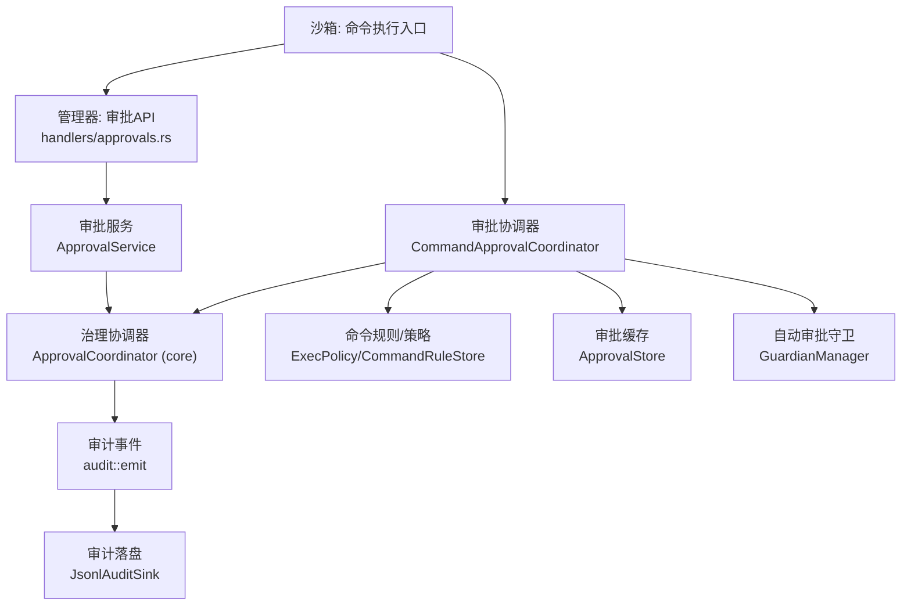
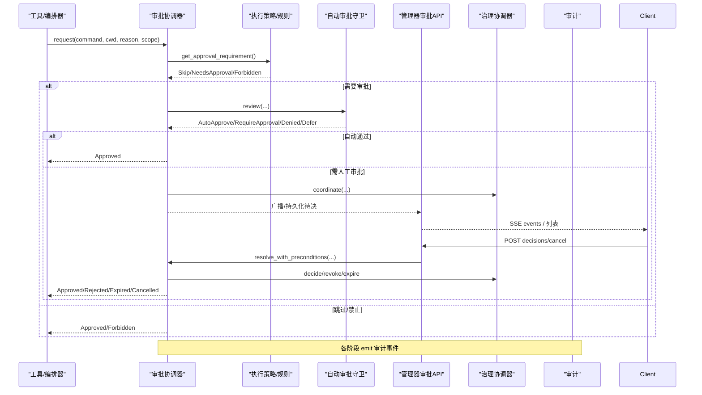
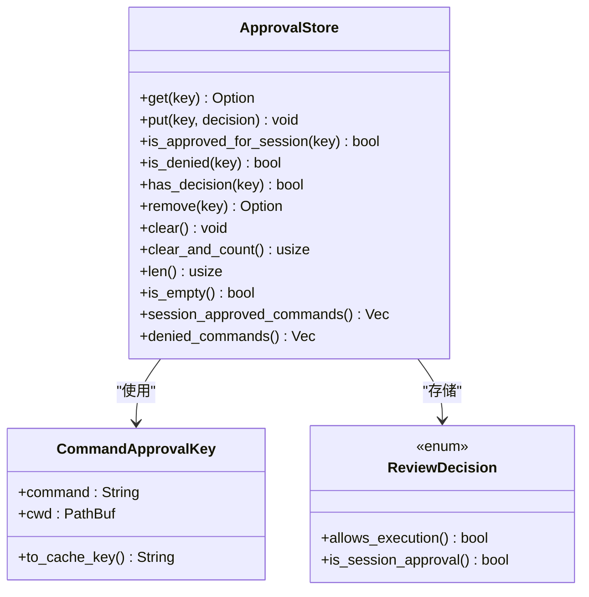
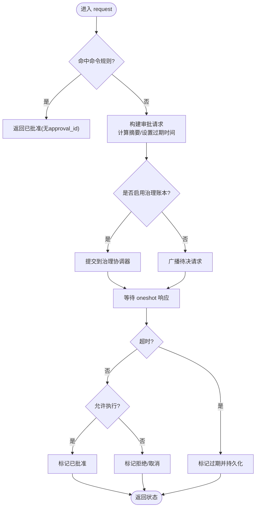
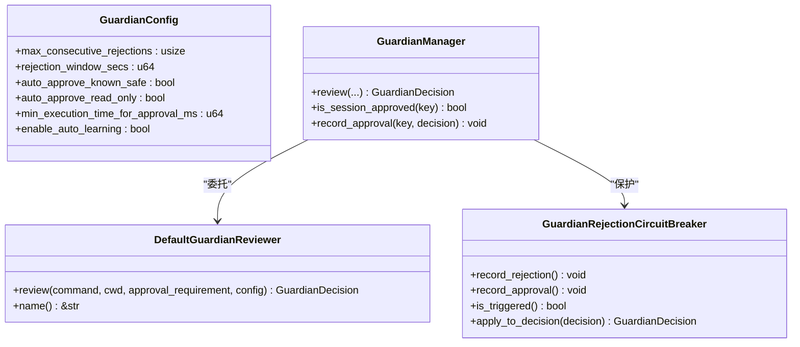
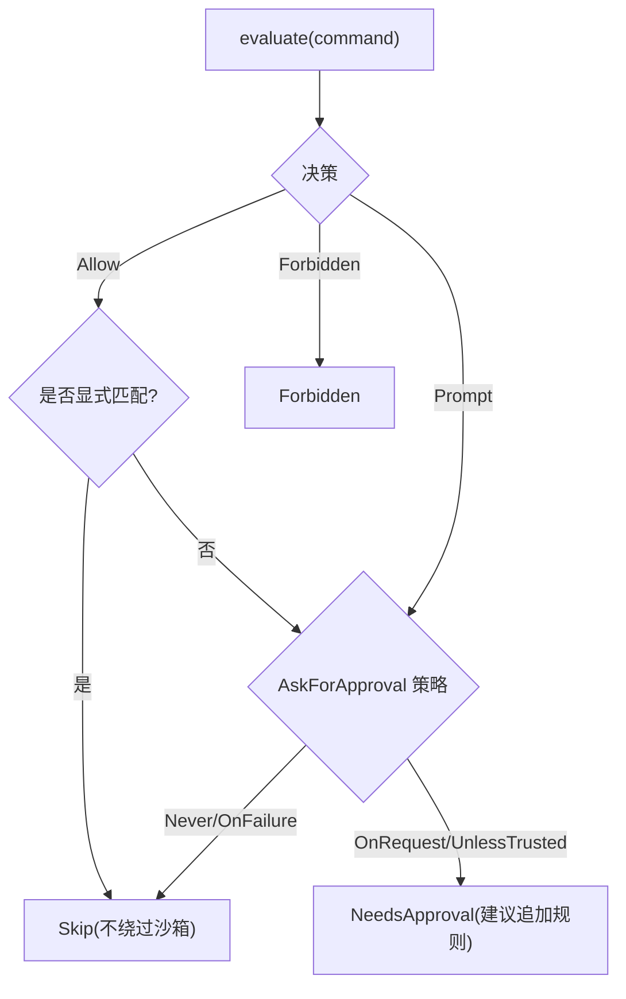
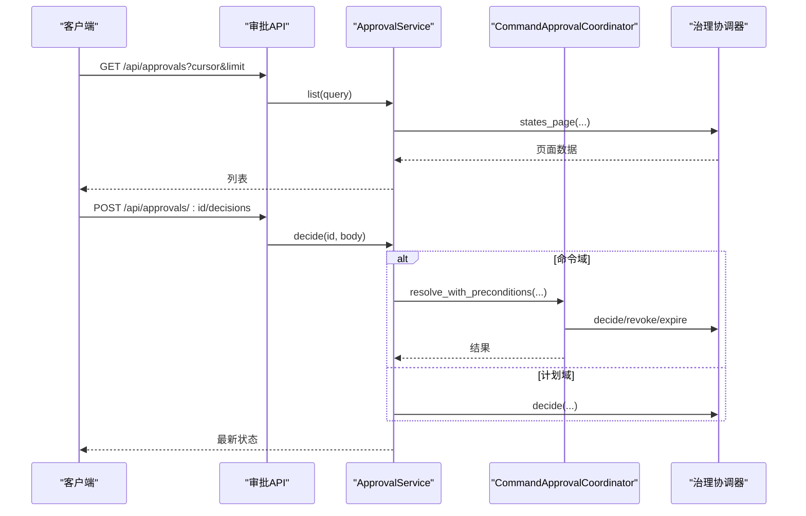
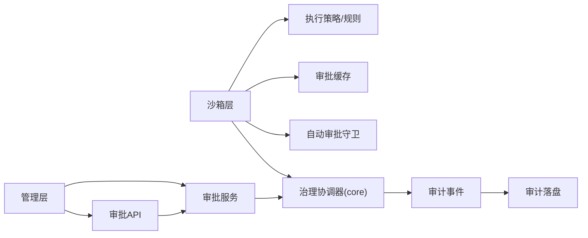
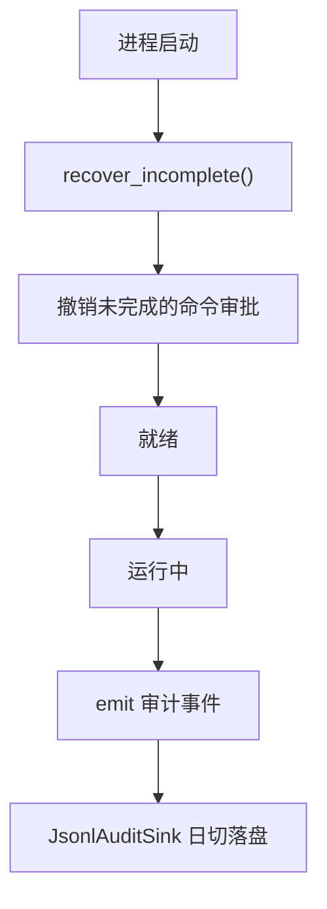

# 守护进程审批

<cite>
**本文引用的文件**
- [agent-diva-sandbox/src/lib.rs](file://agent-diva-sandbox/src/lib.rs)
- [agent-diva-sandbox/src/approval.rs](file://agent-diva-sandbox/src/approval.rs)
- [agent-diva-sandbox/src/approval_coordinator.rs](file://agent-diva-sandbox/src/approval_coordinator.rs)
- [agent-diva-sandbox/src/guardian.rs](file://agent-diva-sandbox/src/guardian.rs)
- [agent-diva-sandbox/src/exec_policy.rs](file://agent-diva-sandbox/src/exec_policy.rs)
- [agent-diva-manager/src/approval_service.rs](file://agent-diva-manager/src/approval_service.rs)
- [agent-diva-manager/src/handlers/approvals.rs](file://agent-diva-manager/src/handlers/approvals.rs)
- [agent-diva-core/src/audit.rs](file://agent-diva-core/src/audit.rs)
- [agent-diva-core/src/audit_sink.rs](file://agent-diva-core/src/audit_sink.rs)
</cite>

## 目录
1. [简介](#简介)
2. [项目结构](#项目结构)
3. [核心组件](#核心组件)
4. [架构总览](#架构总览)
5. [详细组件分析](#详细组件分析)
6. [依赖关系分析](#依赖关系分析)
7. [性能与超时](#性能与超时)
8. [故障恢复与可观测性](#故障恢复与可观测性)
9. [配置与集成指南](#配置与集成指南)
10. [结论](#结论)

## 简介
本文件面向 Agent Diva 沙箱守护进程的“审批系统”，系统性说明自动审批、人工审批接口与决策协调机制。内容覆盖：
- 审批请求生成、状态机流转与结果处理
- 权限验证、审批缓存与超时处理
- 审计日志、监控指标与故障恢复策略
- 自定义审批规则、外部审批系统集成与自动化审批策略
- 面向初学者的流程解释与管理员运维指导

## 项目结构
围绕审批的核心代码分布在以下模块：
- 沙箱层（sandbox）：负责命令执行前的审批判定、协调器、自动审批守卫、执行策略与缓存
- 管理层（manager）：提供统一的审批 API、事件流与跨域（命令/计划）统一视图
- 核心层（core）：治理账本、审计事件与可插拔审计落盘

**图表来源**
- [agent-diva-sandbox/src/approval_coordinator.rs:221-381](file://agent-diva-sandbox/src/approval_coordinator.rs#L221-L381)
- [agent-diva-manager/src/handlers/approvals.rs:45-193](file://agent-diva-manager/src/handlers/approvals.rs#L45-L193)
- [agent-diva-manager/src/approval_service.rs:148-304](file://agent-diva-manager/src/approval_service.rs#L148-L304)
- [agent-diva-core/src/audit.rs:224-253](file://agent-diva-core/src/audit.rs#L224-L253)
- [agent-diva-core/src/audit_sink.rs:145-257](file://agent-diva-core/src/audit_sink.rs#L145-L257)

**章节来源**
- [agent-diva-sandbox/src/lib.rs:1-116](file://agent-diva-sandbox/src/lib.rs#L1-L116)

## 核心组件
- 审批缓存 ApprovalStore：按“命令+工作目录”为键缓存用户决策，支持一次性批准与会话级批准
- 审批协调器 CommandApprovalCoordinator：维护待决审批、会话批准、超时、取消、撤销，并与治理账本对接
- 自动审批守卫 GuardianManager：基于默认审阅器与熔断器进行自动审批决策
- 执行策略 ExecPolicyManager：加载/评估规则，输出是否需要审批、跳过或禁止
- 管理器审批服务 ApprovalService：统一对外 API 与事件流，桥接命令与计划两类审批
- 审计与落盘 audit + AuditSink：结构化审计事件与 JSONL 日切落盘

**章节来源**
- [agent-diva-sandbox/src/approval.rs:10-248](file://agent-diva-sandbox/src/approval.rs#L10-L248)
- [agent-diva-sandbox/src/approval_coordinator.rs:100-127](file://agent-diva-sandbox/src/approval_coordinator.rs#L100-L127)
- [agent-diva-sandbox/src/guardian.rs:25-110](file://agent-diva-sandbox/src/guardian.rs#L25-L110)
- [agent-diva-sandbox/src/exec_policy.rs:165-386](file://agent-diva-sandbox/src/exec_policy.rs#L165-L386)
- [agent-diva-manager/src/approval_service.rs:142-304](file://agent-diva-manager/src/approval_service.rs#L142-L304)
- [agent-diva-core/src/audit.rs:33-253](file://agent-diva-core/src/audit.rs#L33-L253)
- [agent-diva-core/src/audit_sink.rs:60-257](file://agent-diva-core/src/audit_sink.rs#L60-L257)

## 架构总览
审批系统在沙箱执行前拦截，先经策略评估与自动审批守卫，再进入协调器等待人工决策；管理器暴露统一 API 供 GUI/CLI/外部系统调用；所有关键节点写入审计事件，支持持久化与回放。

**图表来源**
- [agent-diva-sandbox/src/approval_coordinator.rs:221-381](file://agent-diva-sandbox/src/approval_coordinator.rs#L221-L381)
- [agent-diva-sandbox/src/exec_policy.rs:270-324](file://agent-diva-sandbox/src/exec_policy.rs#L270-L324)
- [agent-diva-sandbox/src/guardian.rs:375-467](file://agent-diva-sandbox/src/guardian.rs#L375-L467)
- [agent-diva-manager/src/handlers/approvals.rs:94-193](file://agent-diva-manager/src/handlers/approvals.rs#L94-L193)
- [agent-diva-manager/src/approval_service.rs:239-304](file://agent-diva-manager/src/approval_service.rs#L239-L304)
- [agent-diva-core/src/audit.rs:224-253](file://agent-diva-core/src/audit.rs#L224-L253)

## 详细组件分析

### 审批缓存 ApprovalStore
- 作用：避免重复提示，支持“单次批准”和“会话级批准”
- 关键点：
  - 键由“命令+工作目录”组成，序列化后作为 HashMap 键
  - 提供 is_approved_for_session、is_denied、clear 等便捷方法
  - 线程安全通过 SharedApprovalStore = Arc<Mutex<...>> 共享

**图表来源**
- [agent-diva-sandbox/src/approval.rs:10-248](file://agent-diva-sandbox/src/approval.rs#L10-L248)

**章节来源**
- [agent-diva-sandbox/src/approval.rs:10-248](file://agent-diva-sandbox/src/approval.rs#L10-L248)

### 审批协调器 CommandApprovalCoordinator
- 职责：创建审批请求、维护待决集合、会话批准、超时、取消、撤销，并对接治理账本
- 关键流程：
  - request：若命中命令规则则直接批准；否则构造请求并持久到治理账本（可选），放入 pending，等待响应
  - resolve_with_preconditions：CAS 版本控制 + 幂等键，写回治理账本，必要时消费一次性授权
  - cancel_request/cancel_scope：撤销待决审批并清理本地状态
  - recover_incomplete：启动时回收未完成的待决审批
- 超时：默认 300 秒，超时将标记 Expired 并尝试在治理账本过期

**图表来源**
- [agent-diva-sandbox/src/approval_coordinator.rs:221-381](file://agent-diva-sandbox/src/approval_coordinator.rs#L221-L381)
- [agent-diva-sandbox/src/approval_coordinator.rs:383-594](file://agent-diva-sandbox/src/approval_coordinator.rs#L383-L594)
- [agent-diva-sandbox/src/approval_coordinator.rs:611-701](file://agent-diva-sandbox/src/approval_coordinator.rs#L611-L701)
- [agent-diva-sandbox/src/approval_coordinator.rs:159-206](file://agent-diva-sandbox/src/approval_coordinator.rs#L159-L206)

**章节来源**
- [agent-diva-sandbox/src/approval_coordinator.rs:100-701](file://agent-diva-sandbox/src/approval_coordinator.rs#L100-L701)

### 自动审批守卫 GuardianManager
- 默认审阅器 DefaultGuardianReviewer：根据命令模式、只读判断、危险命令检测与 AskForApproval 策略决定自动审批或要求人工审批
- 熔断器 GuardianRejectionCircuitBreaker：在短时间窗口内连续拒绝达到阈值时触发，阻止自动审批，强制人工介入
- 管理 Manager：组合审阅器与熔断器，记录批准/拒绝以更新熔断器状态

**图表来源**
- [agent-diva-sandbox/src/guardian.rs:25-110](file://agent-diva-sandbox/src/guardian.rs#L25-L110)
- [agent-diva-sandbox/src/guardian.rs:218-472](file://agent-diva-sandbox/src/guardian.rs#L218-L472)
- [agent-diva-sandbox/src/guardian.rs:474-736](file://agent-diva-sandbox/src/guardian.rs#L474-L736)

**章节来源**
- [agent-diva-sandbox/src/guardian.rs:25-736](file://agent-diva-sandbox/src/guardian.rs#L25-L736)

### 执行策略 ExecPolicyManager
- 从 TOML 文件或生产规则源加载规则，评估命令得到 Allow/Prompt/Forbidden
- 结合 AskForApproval 策略输出 ApprovalRequirement：Skip/NeedsApproval/Forbidden
- 支持自动学习：将用户批准的命令追加为 Allow 规则（受黑名单限制）

**图表来源**
- [agent-diva-sandbox/src/exec_policy.rs:254-324](file://agent-diva-sandbox/src/exec_policy.rs#L254-L324)
- [agent-diva-sandbox/src/exec_policy.rs:326-386](file://agent-diva-sandbox/src/exec_policy.rs#L326-L386)

**章节来源**
- [agent-diva-sandbox/src/exec_policy.rs:165-386](file://agent-diva-sandbox/src/exec_policy.rs#L165-L386)

### 管理器审批服务与 API
- ApprovalService：统一查询、详情、决策、取消、事件流；对命令与计划两个领域做适配
- handlers/approvals.rs：REST/SSE 路由，错误码映射，SSE 推送事件名约定
- 幂等与 CAS：决策与取消均支持 expected_version 与 idempotency_key

**图表来源**
- [agent-diva-manager/src/handlers/approvals.rs:45-193](file://agent-diva-manager/src/handlers/approvals.rs#L45-L193)
- [agent-diva-manager/src/approval_service.rs:160-304](file://agent-diva-manager/src/approval_service.rs#L160-L304)

**章节来源**
- [agent-diva-manager/src/handlers/approvals.rs:45-293](file://agent-diva-manager/src/handlers/approvals.rs#L45-L293)
- [agent-diva-manager/src/approval_service.rs:142-304](file://agent-diva-manager/src/approval_service.rs#L142-L304)

## 依赖关系分析
- 沙箱层依赖：
  - 命令规则/策略（exec_policy/command_rules）
  - 审批缓存（approval）
  - 自动审批守卫（guardian）
  - 治理协调器（core governance）
- 管理层依赖：
  - 审批服务（approval_service）
  - 审批 API（handlers/approvals）
  - 治理协调器（core governance）
- 核心层：
  - 审计事件（audit）
  - 审计落盘（audit_sink）

**图表来源**
- [agent-diva-sandbox/src/lib.rs:27-105](file://agent-diva-sandbox/src/lib.rs#L27-L105)
- [agent-diva-manager/src/approval_service.rs:142-304](file://agent-diva-manager/src/approval_service.rs#L142-L304)
- [agent-diva-manager/src/handlers/approvals.rs:45-193](file://agent-diva-manager/src/handlers/approvals.rs#L45-L193)
- [agent-diva-core/src/audit.rs:224-253](file://agent-diva-core/src/audit.rs#L224-L253)
- [agent-diva-core/src/audit_sink.rs:145-257](file://agent-diva-core/src/audit_sink.rs#L145-L257)

**章节来源**
- [agent-diva-sandbox/src/lib.rs:27-105](file://agent-diva-sandbox/src/lib.rs#L27-L105)
- [agent-diva-manager/src/approval_service.rs:142-304](file://agent-diva-manager/src/approval_service.rs#L142-L304)
- [agent-diva-manager/src/handlers/approvals.rs:45-193](file://agent-diva-manager/src/handlers/approvals.rs#L45-L193)

## 性能与超时
- 审批缓存：HashMap O(1) 查找，适合高频重复命令的快速放行
- 协调器超时：默认 300 秒，超时将标记过期并尝试在治理账本中过期，避免悬挂审批
- 熔断器：在短时间窗口内连续拒绝达到阈值时阻断自动审批，降低误批风险
- 策略评估：规则匹配为轻量级字符串前缀匹配，开销低
- 审计落盘：JSONL 行追加，日切滚动，失败被吞掉不影响主流程

**章节来源**
- [agent-diva-sandbox/src/approval.rs:155-248](file://agent-diva-sandbox/src/approval.rs#L155-L248)
- [agent-diva-sandbox/src/approval_coordinator.rs:30-32](file://agent-diva-sandbox/src/approval_coordinator.rs#L30-L32)
- [agent-diva-sandbox/src/guardian.rs:474-589](file://agent-diva-sandbox/src/guardian.rs#L474-L589)
- [agent-diva-core/src/audit_sink.rs:145-257](file://agent-diva-core/src/audit_sink.rs#L145-L257)

## 故障恢复与可观测性
- 启动恢复：协调器 recover_incomplete 会扫描治理账本中的 Pending/Allowed 且属于当前工作区的命令审批，统一撤销，防止重启后继续执行
- 幂等与冲突：决策/取消使用 expected_version 与 idempotency_key，避免并发冲突与重复执行
- 审计事件：关键节点 emit 审计事件，包含 agent_id、decision、context 等字段
- 审计落盘：全局可插拔 sink，默认 JSONL 日切文件，便于离线分析与告警

**图表来源**
- [agent-diva-sandbox/src/approval_coordinator.rs:159-206](file://agent-diva-sandbox/src/approval_coordinator.rs#L159-L206)
- [agent-diva-core/src/audit.rs:224-253](file://agent-diva-core/src/audit.rs#L224-L253)
- [agent-diva-core/src/audit_sink.rs:145-257](file://agent-diva-core/src/audit_sink.rs#L145-L257)

**章节来源**
- [agent-diva-sandbox/src/approval_coordinator.rs:159-206](file://agent-diva-sandbox/src/approval_coordinator.rs#L159-L206)
- [agent-diva-core/src/audit.rs:224-253](file://agent-diva-core/src/audit.rs#L224-L253)
- [agent-diva-core/src/audit_sink.rs:145-257](file://agent-diva-core/src/audit_sink.rs#L145-L257)

## 配置与集成指南

### 审批配置示例
- 自动审批策略（GuardianConfig）
  - strict：严格模式，几乎全部要求人工审批
  - smart：平衡模式，已知安全与只读命令自动批准
  - liberal：宽松模式，未知命令也可自动批准并可自动学习规则
- 执行策略（ExecPolicyManager）
  - 从 TOML 或生产规则源加载规则
  - 支持追加规则（自动学习），但受黑名单限制（如 sudo、bash -c、python -c 等）
- 审批超时（CommandApprovalCoordinator）
  - 默认 300 秒，可通过构造函数设置

**章节来源**
- [agent-diva-sandbox/src/guardian.rs:25-110](file://agent-diva-sandbox/src/guardian.rs#L25-L110)
- [agent-diva-sandbox/src/exec_policy.rs:24-96](file://agent-diva-sandbox/src/exec_policy.rs#L24-L96)
- [agent-diva-sandbox/src/exec_policy.rs:326-386](file://agent-diva-sandbox/src/exec_policy.rs#L326-L386)
- [agent-diva-sandbox/src/approval_coordinator.rs:30-32](file://agent-diva-sandbox/src/approval_coordinator.rs#L30-L32)

### 工作流程设计
- 命令执行前：
  - 策略评估 → 自动审批守卫 → 协调器等待人工审批（如需）→ 执行
- 管理器侧：
  - 提供统一 API 列出待决、查看详情、决策/取消、SSE 事件流
- 治理账本：
  - 持久化审批状态、收据、证据引用，支持幂等与版本控制

**章节来源**
- [agent-diva-sandbox/src/approval_coordinator.rs:221-381](file://agent-diva-sandbox/src/approval_coordinator.rs#L221-L381)
- [agent-diva-manager/src/handlers/approvals.rs:45-193](file://agent-diva-manager/src/handlers/approvals.rs#L45-L193)
- [agent-diva-manager/src/approval_service.rs:160-304](file://agent-diva-manager/src/approval_service.rs#L160-L304)

### 集成方案
- 外部审批系统：
  - 订阅管理器 SSE 事件流，接收待决审批
  - 调用 /api/approvals/:id/decisions 或 /cancel 完成决策
  - 使用 expected_version 与 idempotency_key 保证幂等
- CLI/GUI：
  - 通过管理器 API 展示待决审批并提供操作按钮
- 自定义审阅器：
  - 实现 GuardianReviewer trait，注入 GuardianManager 替换默认审阅器

**章节来源**
- [agent-diva-manager/src/handlers/approvals.rs:94-193](file://agent-diva-manager/src/handlers/approvals.rs#L94-L193)
- [agent-diva-sandbox/src/guardian.rs:187-209](file://agent-diva-sandbox/src/guardian.rs#L187-L209)

### 自定义审批规则与自动化策略
- 自定义规则：
  - 编辑 execpolicy.toml 或通过 CommandRuleStore 添加/启用 Allow 规则
  - 使用 safe_prefix_suggestion 生成安全前缀建议
- 自动化策略：
  - 调整 GuardianConfig 的 auto_approve_* 与 enable_auto_learning
  - 结合熔断器阈值与窗口，平衡效率与安全

**章节来源**
- [agent-diva-sandbox/src/exec_policy.rs:201-213](file://agent-diva-sandbox/src/exec_policy.rs#L201-L213)
- [agent-diva-sandbox/src/exec_policy.rs:326-386](file://agent-diva-sandbox/src/exec_policy.rs#L326-L386)
- [agent-diva-sandbox/src/guardian.rs:25-110](file://agent-diva-sandbox/src/guardian.rs#L25-L110)

## 结论
Agent Diva 沙箱审批系统通过“策略评估 + 自动审批守卫 + 协调器 + 治理账本 + 管理器 API + 审计落盘”的分层设计，实现了高安全、可审计、可扩展的命令执行审批闭环。管理员可通过策略与守卫配置灵活调节自动化程度，同时借助统一 API 与事件流轻松集成外部审批系统与监控体系。