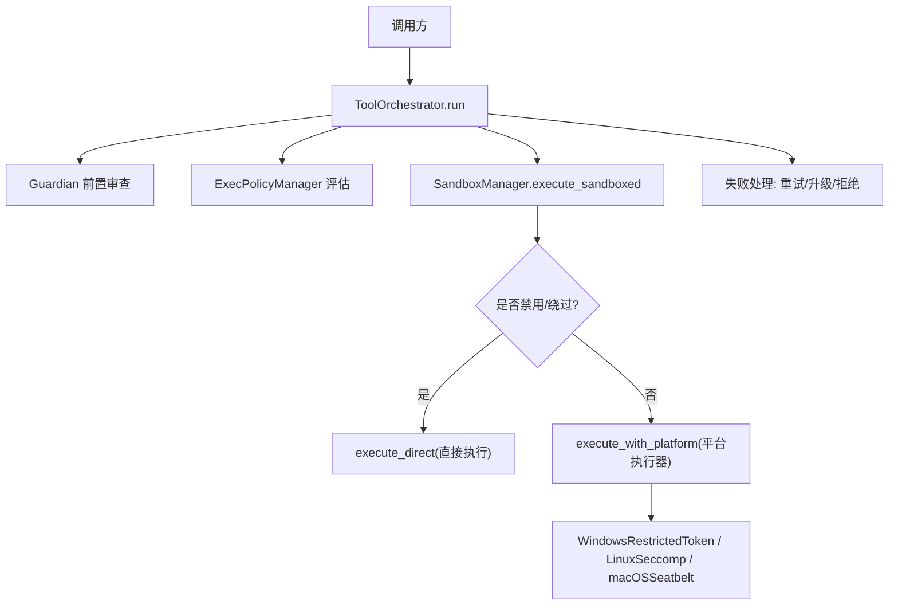
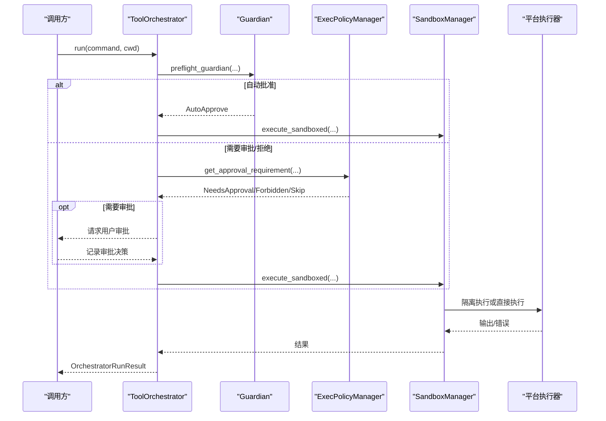
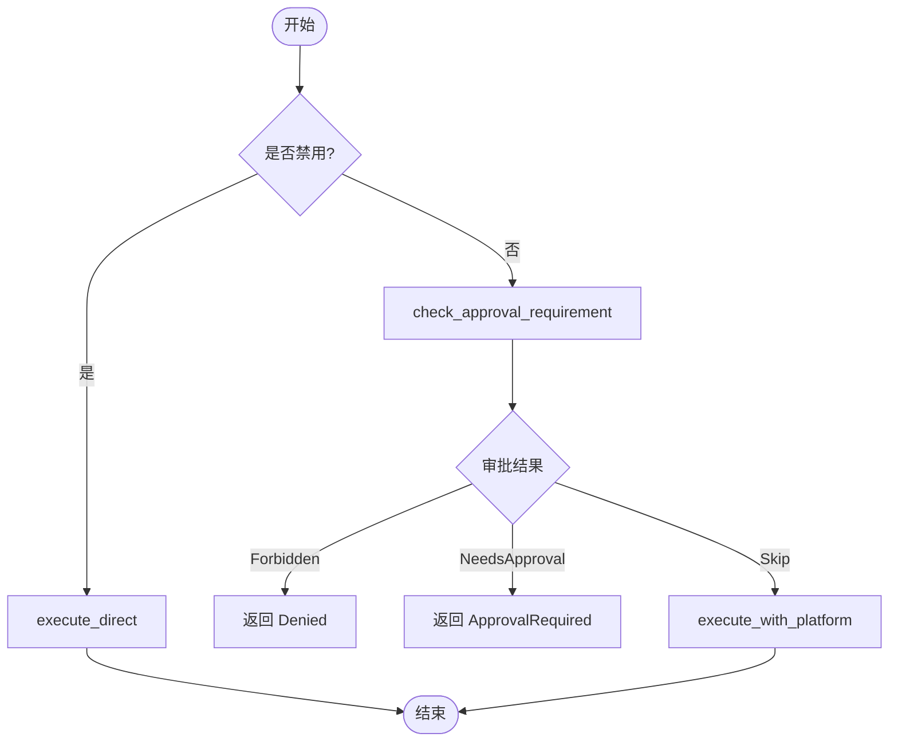
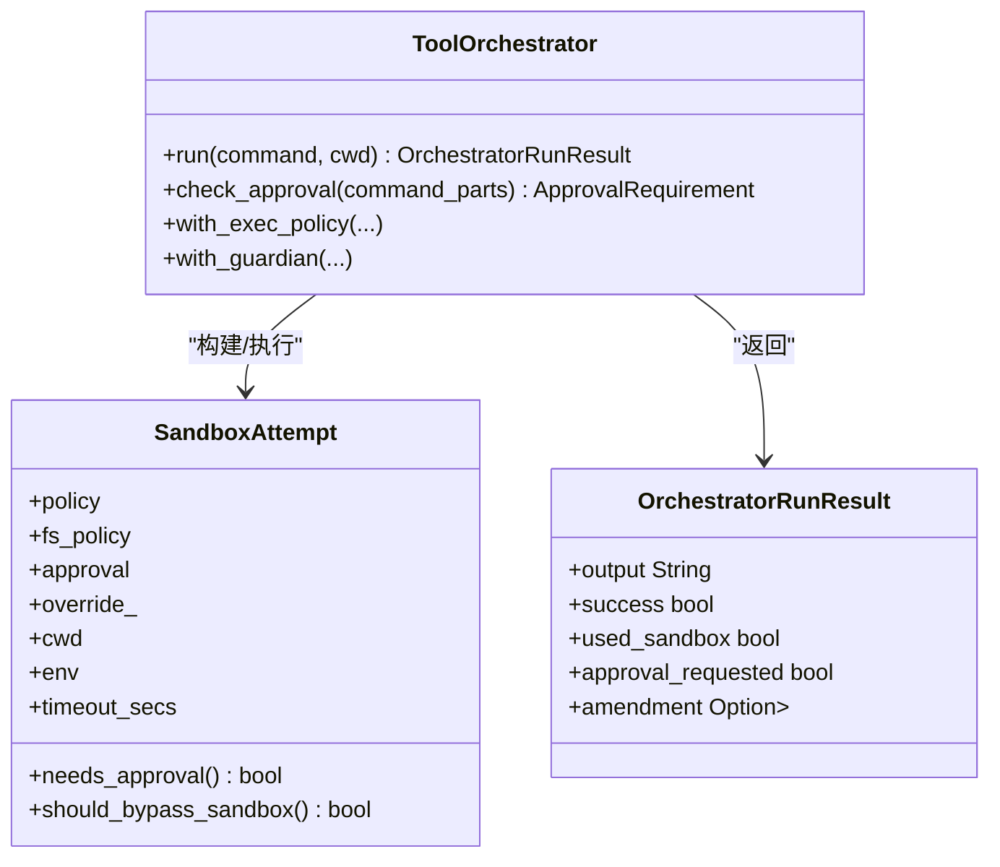
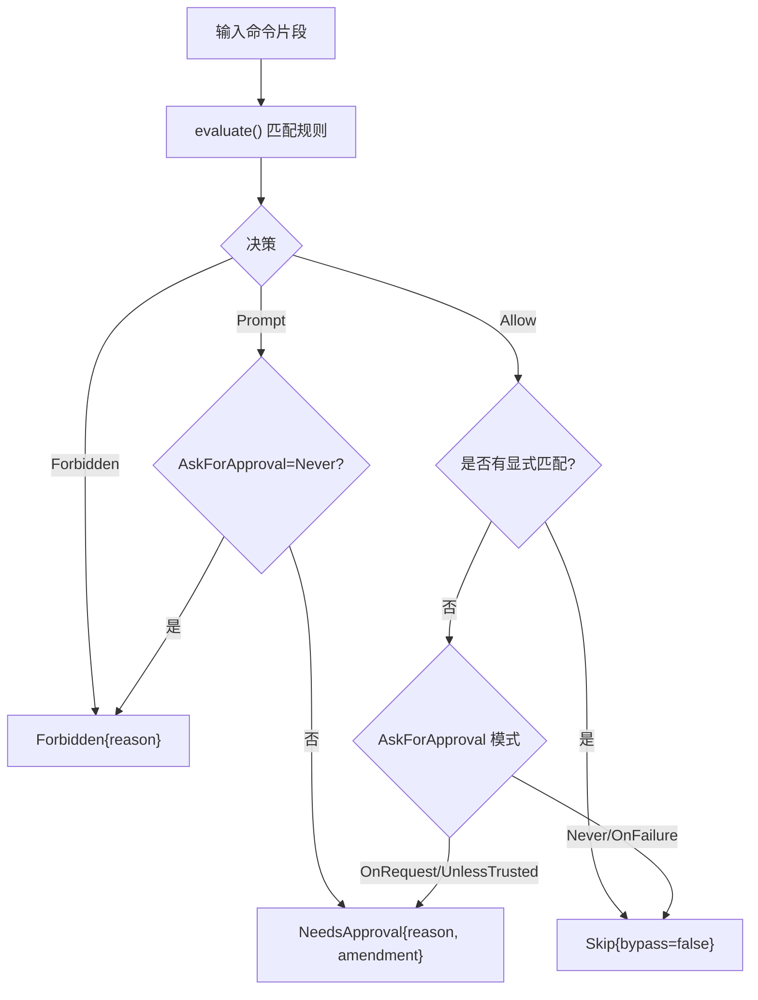
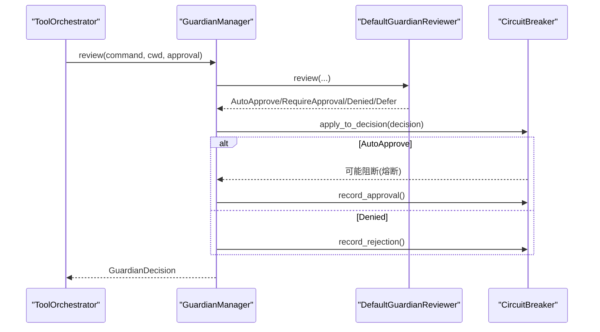
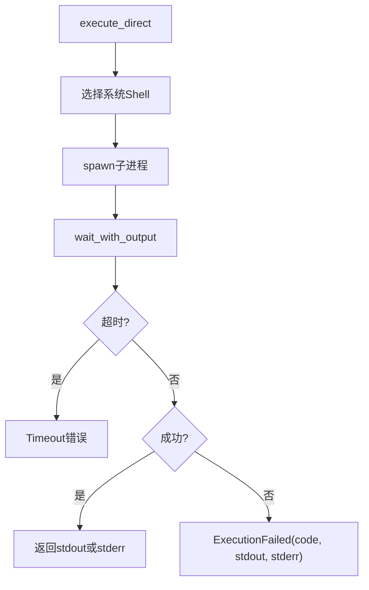
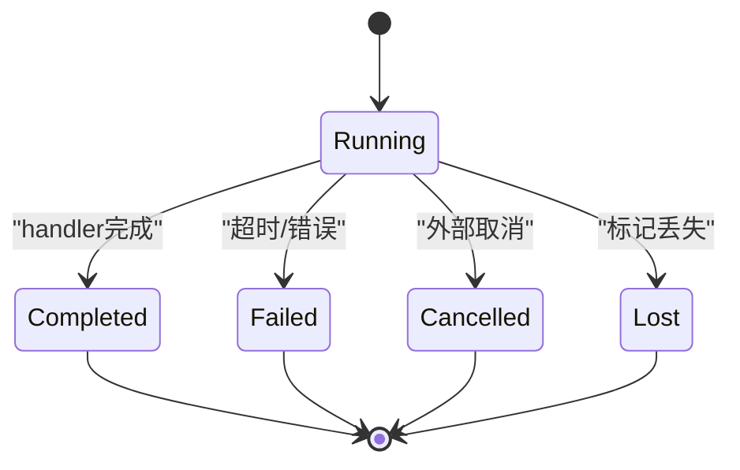
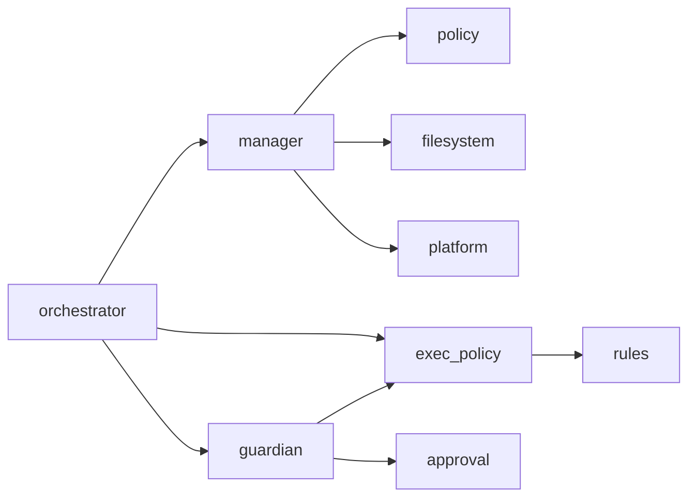

# 执行管理器

<cite>
**本文引用的文件**
- [lib.rs](file://agent-diva-sandbox/src/lib.rs)
- [manager.rs](file://agent-diva-sandbox/src/manager.rs)
- [orchestrator.rs](file://agent-diva-sandbox/src/orchestrator.rs)
- [exec_policy.rs](file://agent-diva-sandbox/src/exec_policy.rs)
- [policy.rs](file://agent-diva-sandbox/src/policy.rs)
- [approval.rs](file://agent-diva-sandbox/src/approval.rs)
- [guardian.rs](file://agent-diva-sandbox/src/guardian.rs)
- [platform/mod.rs](file://agent-diva-sandbox/src/platform/mod.rs)
- [executor.rs](file://agent-diva-core/src/supervised/executor.rs)
</cite>

## 目录
1. [简介](#简介)
2. [项目结构](#项目结构)
3. [核心组件](#核心组件)
4. [架构总览](#架构总览)
5. [详细组件分析](#详细组件分析)
6. [依赖关系分析](#依赖关系分析)
7. [性能与资源限制](#性能与资源限制)
8. [故障诊断与恢复](#故障诊断与恢复)
9. [结论](#结论)
10. [附录：配置示例与扩展指南](#附录：配置示例与扩展指南)

## 简介
本文件面向 Agent Diva 的沙箱执行管理器，系统性说明命令执行的完整生命周期、策略应用、权限检查、隔离环境设置、进程管理、超时控制、资源限制、错误处理、审计日志、监控指标以及批量执行与外部工具集成。文档同时为初学者提供概念性解释，并为开发者提供 API 使用与扩展指导。

## 项目结构
Agent Diva 沙箱子系统位于 agent-diva-sandbox，核心由以下模块组成：
- 管理器（SandboxManager）：统一入口，协调策略、审批、平台执行器与文件系统策略。
- 编排器（ToolOrchestrator）：串联“前置守护审查 → 审批判定 → 首次尝试 → 失败重试/升级”的完整流程。
- 执行策略（ExecPolicyManager）：基于规则的策略评估与自动学习（持久化到 TOML）。
- 审批系统（ApprovalStore/ReviewDecision）：会话级/一次性审批缓存。
- 守护（Guardian）：自动批准、拒绝熔断、可插拔审查器。
- 策略定义（SandboxPolicy/AskForApproval）：安全级别、网络访问、读写范围等。
- 平台抽象（platform）：Windows/Linux/macOS 隔离实现选择。
- 受监督任务执行（core/supervised executor）：心跳、超时、取消、状态流转。

图表来源
- [orchestrator.rs:400-430](file://agent-diva-sandbox/src/orchestrator.rs#L400-L430)
- [manager.rs:400-575](file://agent-diva-sandbox/src/manager.rs#L400-L575)
- [platform/mod.rs:12-54](file://agent-diva-sandbox/src/platform/mod.rs#L12-L54)

章节来源
- [lib.rs:1-116](file://agent-diva-sandbox/src/lib.rs#L1-L116)

## 核心组件
- SandboxManager：构建并持有 SandboxPolicy、FileSystemSandboxPolicy、审批策略与默认超时；提供 execute_sandboxed、execute_unsandboxed、路径权限检查、审批缓存读写。
- ToolOrchestrator：编排执行流，支持 Guardian 自动批准、ExecPolicy 规则评估、首次尝试与失败后重试/升级。
- ExecPolicyManager：加载/合并/评估规则，支持从 CommandRuleStore 派生，支持追加规则（自动学习），内置危险前缀白名单过滤。
- ApprovalStore：以“命令+工作目录”为键缓存 ReviewDecision（Denied/ApprovedOnce/ApprovedForSession）。
- Guardian：DefaultGuardianReviewer 结合 ExecPolicy/CommandRuleStore 判断“已知安全/只读/潜在危险”，配合拒绝熔断器防止自动批准风暴。
- Platform 抽象：根据目标平台选择具体隔离实现（受限令牌、seccomp/landlock、seatbelt）。
- Supervised Executor：心跳保活、超时控制、取消/丢失状态处理，保障长任务可控。

章节来源
- [manager.rs:236-615](file://agent-diva-sandbox/src/manager.rs#L236-L615)
- [orchestrator.rs:261-758](file://agent-diva-sandbox/src/orchestrator.rs#L261-L758)
- [exec_policy.rs:165-386](file://agent-diva-sandbox/src/exec_policy.rs#L165-L386)
- [approval.rs:10-248](file://agent-diva-sandbox/src/approval.rs#L10-L248)
- [guardian.rs:215-736](file://agent-diva-sandbox/src/guardian.rs#L215-L736)
- [platform/mod.rs:12-54](file://agent-diva-sandbox/src/platform/mod.rs#L12-L54)
- [executor.rs:58-408](file://agent-diva-core/src/supervised/executor.rs#L58-L408)

## 架构总览
执行管理器采用分层设计：
- 策略层：SandboxPolicy/AskForApproval/NetworkAccess/ReadOnlyAccess 决定整体安全边界。
- 规则层：ExecPolicyManager 通过 TOML 规则或 CommandRuleStore 派生，对命令进行 Allow/Prompt/Forbidden 决策。
- 审批层：ApprovalStore 缓存用户决策，避免重复提示；Guardian 在必要时自动批准或要求人工确认。
- 执行层：SandboxManager 根据策略与审批结果选择直接执行或平台隔离执行；ToolOrchestrator 负责失败后的重试/升级。
- 平台层：按操作系统选择隔离机制，确保最小权限运行。

图表来源
- [orchestrator.rs:400-430](file://agent-diva-sandbox/src/orchestrator.rs#L400-L430)
- [guardian.rs:432-514](file://agent-diva-sandbox/src/guardian.rs#L432-L514)
- [exec_policy.rs:270-324](file://agent-diva-sandbox/src/exec_policy.rs#L270-L324)
- [manager.rs:400-575](file://agent-diva-sandbox/src/manager.rs#L400-L575)

## 详细组件分析

### SandboxManager：命令执行与策略协调
- 职责
  - 根据 SandboxConfig 构建 SandboxPolicy 与 FileSystemSandboxPolicy。
  - 解析执行请求（命令、工作目录、环境变量、超时）。
  - 检查审批需求（含缓存命中）、路径读写权限。
  - 选择直接执行或平台隔离执行，封装超时与错误。
- 关键流程
  - execute_sandboxed：若禁用则直接执行；否则检查审批；再进入平台执行。
  - execute_direct：跨平台 shell 包装，捕获 stdout/stderr，超时返回 Timeout。
  - execute_with_platform：按目标平台构造对应执行器并传入策略与文件系统策略。
- 权限与隔离
  - can_read_path/can_write_path：基于文件系统策略与 cwd 判断。
  - 默认保护路径（如 .git/.diva/.env）可通过策略配置。
- 超时控制
  - 默认超时来自配置；请求可覆盖；直接执行使用 tokio::time::timeout。

图表来源
- [manager.rs:400-575](file://agent-diva-sandbox/src/manager.rs#L400-L575)

章节来源
- [manager.rs:30-124](file://agent-diva-sandbox/src/manager.rs#L30-L124)
- [manager.rs:126-234](file://agent-diva-sandbox/src/manager.rs#L126-L234)
- [manager.rs:236-615](file://agent-diva-sandbox/src/manager.rs#L236-L615)

### ToolOrchestrator：编排与重试/升级
- 职责
  - 前置 Guardian 审查：可能自动批准并创建规则。
  - 审批判定：结合 ExecPolicy 与 AskForApproval。
  - 首次尝试：根据 override 决定是否绕过沙箱。
  - 失败处理：根据错误类型决定是否重试/升级（无沙箱执行）。
- 关键能力
  - SandboxAttempt：封装策略、文件系统策略、审批需求、超时、环境变量。
  - RetryPermission：决定失败后是直接重试、需审批还是禁止。
  - should_offer_escalation：识别可升级的错误类型（如 Denied/PlatformError/ExecutionFailed 等）。
- 结果对象
  - OrchestratorRunResult：包含输出、成功标志、是否使用沙箱、是否请求审批、建议修正。

图表来源
- [orchestrator.rs:46-183](file://agent-diva-sandbox/src/orchestrator.rs#L46-L183)
- [orchestrator.rs:261-758](file://agent-diva-sandbox/src/orchestrator.rs#L261-L758)

章节来源
- [orchestrator.rs:261-758](file://agent-diva-sandbox/src/orchestrator.rs#L261-L758)

### ExecPolicyManager：规则评估与自动学习
- 规则来源
  - 从 TOML 文件或 CommandRuleStore 派生。
  - 支持合并规则、去重、持久化追加。
- 评估逻辑
  - evaluate：匹配 PrefixRule，返回 Allow/Prompt/Forbidden。
  - get_approval_requirement：结合 AskForApproval 策略，生成 ApprovalRequirement（Skip/NeedsApproval/Forbidden）。
- 安全约束
  - BANNED_PREFIX_SUGGESTIONS：禁止将危险前缀（解释器、提权、shell 等）自动加入允许规则。
  - append_amendment_shared：写入文件时加锁、检测重复、更新内存策略。

图表来源
- [exec_policy.rs:254-324](file://agent-diva-sandbox/src/exec_policy.rs#L254-L324)
- [exec_policy.rs:326-386](file://agent-diva-sandbox/src/exec_policy.rs#L326-L386)

章节来源
- [exec_policy.rs:20-131](file://agent-diva-sandbox/src/exec_policy.rs#L20-L131)
- [exec_policy.rs:165-386](file://agent-diva-sandbox/src/exec_policy.rs#L165-L386)

### ApprovalStore 与 Guardian：审批缓存与自动批准
- ApprovalStore
  - 以“命令+工作目录”为键缓存 ReviewDecision。
  - 支持一次性/会话级/拒绝三种决策，提供查询、清除、统计接口。
- Guardian
  - DefaultGuardianReviewer：基于 ExecPolicy/CommandRuleStore 判断“已知安全/只读/潜在危险”。
  - GuardianRejectionCircuitBreaker：窗口内连续拒绝达到阈值触发熔断，阻止自动批准。
  - GuardianManager：组合审查器与熔断器，记录审批/拒绝，影响熔断状态。

图表来源
- [guardian.rs:618-736](file://agent-diva-sandbox/src/guardian.rs#L618-L736)
- [guardian.rs:474-589](file://agent-diva-sandbox/src/guardian.rs#L474-L589)
- [approval.rs:155-248](file://agent-diva-sandbox/src/approval.rs#L155-L248)

章节来源
- [approval.rs:10-248](file://agent-diva-sandbox/src/approval.rs#L10-L248)
- [guardian.rs:215-736](file://agent-diva-sandbox/src/guardian.rs#L215-L736)

### 平台隔离与进程管理
- 平台选择
  - platform/mod.rs 暴露当前平台的 SandboxType（WindowsRestrictedToken/LinuxSeccomp/MacosSeatbelt）。
  - SandboxManager.execute_with_platform 根据目标平台实例化对应执行器并传入策略。
- 进程管理
  - 直接执行：使用系统 shell（PowerShell/sh）包装命令，设置 stdin/stdout/stderr，注入环境变量。
  - 超时控制：tokio::time::timeout 包裹 wait_with_output，超时返回 Timeout。
  - 错误映射：非零退出码转换为 ExecutionFailed，携带 stdout/stderr。

图表来源
- [manager.rs:435-496](file://agent-diva-sandbox/src/manager.rs#L435-L496)

章节来源
- [manager.rs:435-575](file://agent-diva-sandbox/src/manager.rs#L435-L575)
- [platform/mod.rs:12-54](file://agent-diva-sandbox/src/platform/mod.rs#L12-L54)

### 受监督任务执行（心跳、超时、取消）
- TaskExecutor
  - 从 RunStore 认领任务，注册处理器，启动心跳任务（每10秒）。
  - await_execution_outcome：监听任务完成、超时、取消、丢失、执行器关闭等事件。
  - 完成后调用 complete/fail/cancel 更新状态。
- 超时与取消
  - 支持可选超时 Duration；外部取消 CancellationToken 可中断执行。
  - 轮询状态，遇到 Cancelled/Lost 立即中止任务。

图表来源
- [executor.rs:90-220](file://agent-diva-core/src/supervised/executor.rs#L90-L220)
- [executor.rs:222-308](file://agent-diva-core/src/supervised/executor.rs#L222-L308)

章节来源
- [executor.rs:58-408](file://agent-diva-core/src/supervised/executor.rs#L58-L408)

## 依赖关系分析
- 模块耦合
  - orchestrator 依赖 manager、exec_policy、guardian、approval。
  - manager 依赖 policy、filesystem、platform、approval。
  - guardian 依赖 exec_policy、command_rules、approval。
  - exec_policy 依赖 rules、decision、command_rules。
- 外部依赖
  - 平台相关：Windows Restricted Token、Linux Landlock/Seccomp、macOS Seatbelt。
  - 异步运行时：tokio/tokio-util 用于超时、心跳、取消。
- 可能的循环依赖
  - 通过 trait 与 Arc 解耦，未见明显循环引用。

图表来源
- [orchestrator.rs:1-18](file://agent-diva-sandbox/src/orchestrator.rs#L1-L18)
- [manager.rs:1-29](file://agent-diva-sandbox/src/manager.rs#L1-L29)
- [guardian.rs:1-19](file://agent-diva-sandbox/src/guardian.rs#L1-L19)
- [exec_policy.rs:1-18](file://agent-diva-sandbox/src/exec_policy.rs#L1-L18)

章节来源
- [orchestrator.rs:1-18](file://agent-diva-sandbox/src/orchestrator.rs#L1-L18)
- [manager.rs:1-29](file://agent-diva-sandbox/src/manager.rs#L1-L29)
- [guardian.rs:1-19](file://agent-diva-sandbox/src/guardian.rs#L1-L19)
- [exec_policy.rs:1-18](file://agent-diva-sandbox/src/exec_policy.rs#L1-L18)

## 性能与资源限制
- 超时控制
  - 请求级超时：SandboxExecRequest.timeout_secs；直接执行使用 tokio timeout。
  - 任务级超时：TaskExecutor 支持可选超时，到达即中止任务。
- 资源限制
  - 文件系统：FileSystemSandboxPolicy 限制读写根目录与保护路径。
  - 网络访问：SandboxPolicy 中 NetworkAccess 控制出站网络。
  - 平台隔离：不同 OS 使用各自的最小权限机制（受限令牌/seccomp/seatbelt）。
- 批处理建议
  - 使用 ToolOrchestrator 串行执行命令，利用审批缓存减少交互。
  - 对高并发场景，可在上层并行调度多个 Orchestrator 实例，但共享 ApprovalStore 与 ExecPolicyManager。
- 监控指标（建议）
  - 执行次数、成功率、平均耗时、超时率、审批请求数、自动批准率、拒绝熔断触发次数。
  - 平台类型分布、策略命中率、规则匹配计数。

[本节为通用指导，不直接分析具体文件]

## 故障诊断与恢复
- 常见错误
  - Denied：被策略或审批拒绝。
  - ApprovalRequired：需要用户审批。
  - PlatformError/PlatformUnavailable：平台隔离不可用。
  - ExecutionFailed：命令非零退出码。
  - Timeout：超过指定时间未返回。
- 诊断步骤
  - 查看 OrchestratorRunResult 的 used_sandbox、approval_requested、amendment。
  - 检查 ApprovalStore 中的历史决策（session/denied）。
  - 检查 ExecPolicy 规则匹配与 banned prefix。
  - 检查平台可用性（current_platform_sandbox_type）。
- 恢复策略
  - 调整 AskForApproval 策略（Never/OnFailure/OnRequest/UnlessTrusted）。
  - 通过 Guardian 自动学习添加 Allow 规则（注意 banned prefix）。
  - 在失败后启用重试/升级（仅当策略允许且未被禁止）。
  - 重置熔断器（GuardianRejectionCircuitBreaker.reset）。

章节来源
- [orchestrator.rs:579-751](file://agent-diva-sandbox/src/orchestrator.rs#L579-L751)
- [exec_policy.rs:109-131](file://agent-diva-sandbox/src/exec_policy.rs#L109-L131)
- [guardian.rs:474-589](file://agent-diva-sandbox/src/guardian.rs#L474-L589)
- [manager.rs:400-575](file://agent-diva-sandbox/src/manager.rs#L400-L575)

## 结论
Agent Diva 的执行管理器通过分层策略、规则引擎、审批缓存与守护自动批准，实现了安全、可控、可扩展的命令执行体系。其平台抽象与超时控制保障了跨平台一致性与稳定性；受监督任务执行提供了心跳、取消与状态管理能力。开发者可基于现有 API 自定义策略、集成外部工具、实现批量执行与监控。

[本节为总结，不直接分析具体文件]

## 附录：配置示例与扩展指南

### 执行配置示例
- 基础配置（WorkspaceWrite 模式）
  - 工作区写权限、只读全局访问、禁用网络、默认超时 60s。
- 严格模式（OnRequest）
  - 所有未知命令均需审批；Guardian 配置为 strict。
- 宽松模式（UnlessTrusted）
  - 已知安全/只读命令自动批准；危险命令仍需审批；可开启自动学习。

参考路径
- [policy.rs:111-144](file://agent-diva-sandbox/src/policy.rs#L111-L144)
- [policy.rs:194-228](file://agent-diva-sandbox/src/policy.rs#L194-L228)
- [guardian.rs:61-110](file://agent-diva-sandbox/src/guardian.rs#L61-L110)

### 自定义执行策略
- 新增规则
  - 通过 ExecPolicyManager.append_amendment_shared 追加 Allow 规则（受 banned prefix 保护）。
  - 从 CommandRuleStore 派生 ExecPolicy，复用生产规则源。
- 自定义审查器
  - 实现 GuardianReviewer trait，注入 GuardianManager，替换默认审查器。
- 平台定制
  - 在 platform 模块扩展新的隔离实现，并在 SandboxManager.execute_with_platform 中接入。

参考路径
- [exec_policy.rs:326-386](file://agent-diva-sandbox/src/exec_policy.rs#L326-L386)
- [exec_policy.rs:201-213](file://agent-diva-sandbox/src/exec_policy.rs#L201-L213)
- [guardian.rs:187-209](file://agent-diva-sandbox/src/guardian.rs#L187-L209)
- [manager.rs:503-575](file://agent-diva-sandbox/src/manager.rs#L503-L575)

### 集成外部工具与批量执行
- 外部工具
  - 通过 SandboxCommand.to_command_string 安全拼接命令，避免注入。
  - 使用 SandboxExecRequest.with_env 注入环境变量。
- 批量执行
  - 使用 ToolOrchestrator 串行执行，利用审批缓存提升效率。
  - 上层并行调度多个 Orchestrator，共享 ApprovalStore 与 ExecPolicyManager。

参考路径
- [manager.rs:30-87](file://agent-diva-sandbox/src/manager.rs#L30-L87)
- [manager.rs:89-124](file://agent-diva-sandbox/src/manager.rs#L89-L124)
- [orchestrator.rs:557-577](file://agent-diva-sandbox/src/orchestrator.rs#L557-L577)

### 监控与审计日志
- 日志点
  - 执行开始/结束、审批请求/决策、规则匹配、平台选择、错误与超时。
- 指标采集
  - 建议在调用处埋点：执行时长、成功/失败、是否使用沙箱、是否请求审批。
- 审计存储
  - 使用 ApprovalStore.session_approved_commands/denied_commands 导出审计数据。

参考路径
- [approval.rs:231-248](file://agent-diva-sandbox/src/approval.rs#L231-L248)
- [orchestrator.rs:400-430](file://agent-diva-sandbox/src/orchestrator.rs#L400-L430)
- [manager.rs:400-433](file://agent-diva-sandbox/src/manager.rs#L400-L433)