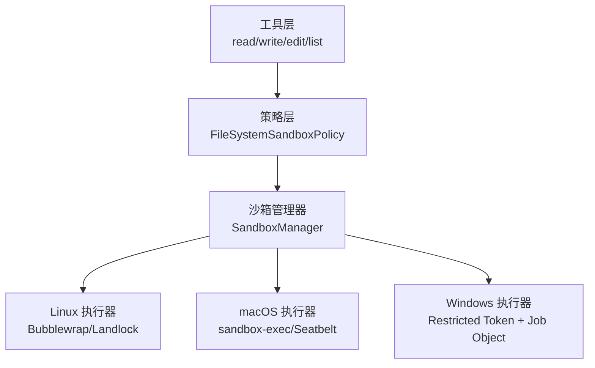
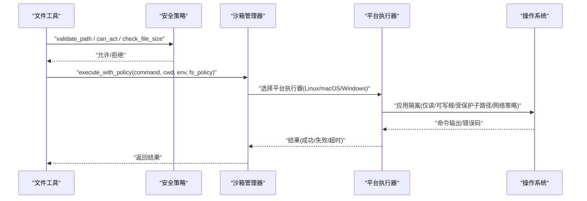
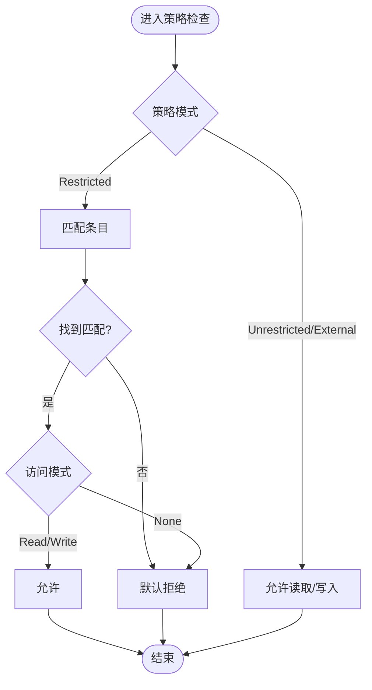
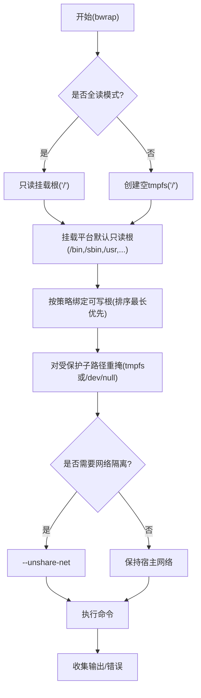
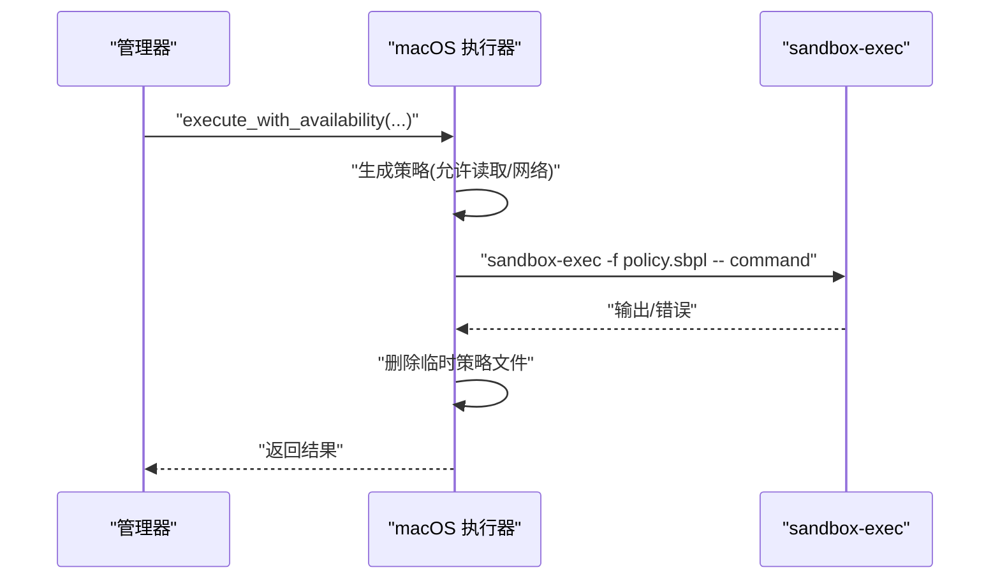
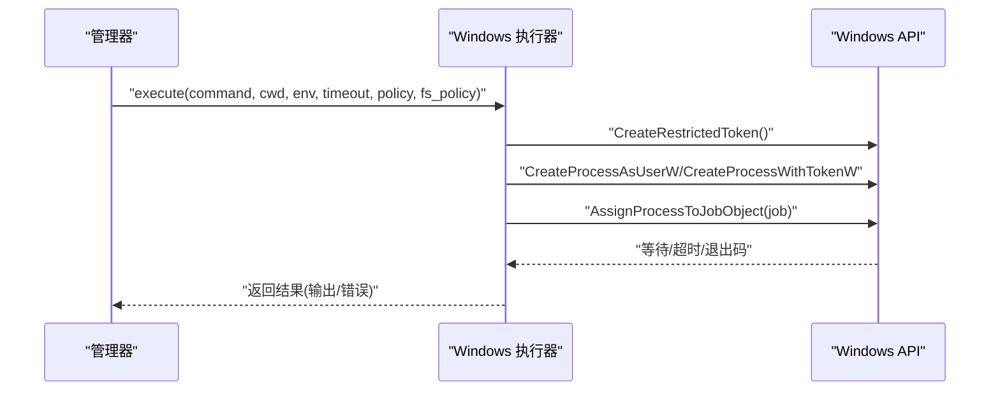
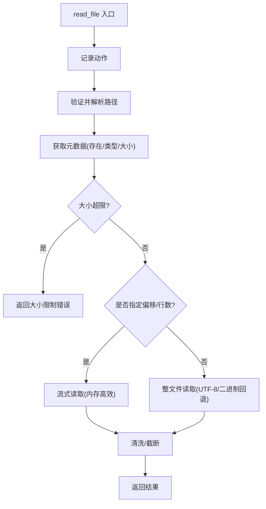
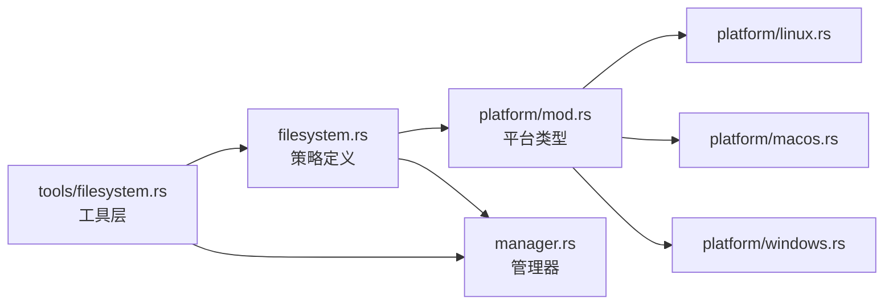

# 文件系统控制

<cite>
**本文引用的文件**
- [agent-diva-sandbox/src/filesystem.rs](file://agent-diva-sandbox/src/filesystem.rs)
- [agent-diva-sandbox/src/platform/mod.rs](file://agent-diva-sandbox/src/platform/mod.rs)
- [agent-diva-sandbox/src/platform/linux.rs](file://agent-diva-sandbox/src/platform/linux.rs)
- [agent-diva-sandbox/src/platform/macos.rs](file://agent-diva-sandbox/src/platform/macos.rs)
- [agent-diva-sandbox/src/platform/windows.rs](file://agent-diva-sandbox/src/platform/windows.rs)
- [agent-diva-sandbox/src/manager.rs](file://agent-diva-sandbox/src/manager.rs)
- [agent-diva-tools/src/filesystem.rs](file://agent-diva-tools/src/filesystem.rs)
</cite>

## 目录
1. [简介](#简介)
2. [项目结构](#项目结构)
3. [核心组件](#核心组件)
4. [架构总览](#架构总览)
5. [详细组件分析](#详细组件分析)
6. [依赖关系分析](#依赖关系分析)
7. [性能考虑](#性能考虑)
8. [故障排查指南](#故障排查指南)
9. [结论](#结论)
10. [附录](#附录)

## 简介
本文件面向 Agent Diva 的沙箱文件系统控制，系统性说明跨平台文件访问隔离机制、路径白名单与受保护目录管理、读写权限控制、符号链接处理、临时文件管理，以及 Linux（Bubblewrap/Landlock）、macOS（Sandbox/Seatbelt）、Windows（Restricted Token）等平台差异。同时提供策略配置示例、安全最佳实践、性能优化建议、审计与错误处理、故障排查指南，并指导如何自定义访问规则、集成外部存储与实现数据备份策略。文档兼顾初学者对文件系统安全概念的理解与管理员的平台特定配置和运维需求。

## 项目结构
Agent Diva 的文件系统沙箱由“策略定义 + 平台执行器 + 工具层调用”三层组成：
- 策略定义层：统一描述允许/禁止的读取与写入范围、特殊路径、可写根与只读子路径等。
- 平台执行层：在 Linux/macOS/Windows 上分别通过 Bubblewrap/Landlock、Seatbelt/sandbox-exec、Restricted Token + Job Object 实现进程级隔离与文件系统限制。
- 工具层：read_file/write_file/edit_file/list_dir 等工具在执行前进行路径校验、大小限制、符号链接检查与安全策略评估。

**图表来源**
- [agent-diva-sandbox/src/filesystem.rs:1-125](file://agent-diva-sandbox/src/filesystem.rs#L1-L125)
- [agent-diva-sandbox/src/platform/mod.rs:1-54](file://agent-diva-sandbox/src/platform/mod.rs#L1-L54)
- [agent-diva-sandbox/src/platform/linux.rs:1-80](file://agent-diva-sandbox/src/platform/linux.rs#L1-L80)
- [agent-diva-sandbox/src/platform/macos.rs:115-149](file://agent-diva-sandbox/src/platform/macos.rs#L115-L149)
- [agent-diva-sandbox/src/platform/windows.rs:1-60](file://agent-diva-sandbox/src/platform/windows.rs#L1-L60)
- [agent-diva-sandbox/src/manager.rs:236-272](file://agent-diva-sandbox/src/manager.rs#L236-L272)

**章节来源**
- [agent-diva-sandbox/src/filesystem.rs:1-125](file://agent-diva-sandbox/src/filesystem.rs#L1-L125)
- [agent-diva-sandbox/src/platform/mod.rs:1-54](file://agent-diva-sandbox/src/platform/mod.rs#L1-L54)
- [agent-diva-sandbox/src/manager.rs:236-272](file://agent-diva-sandbox/src/manager.rs#L236-L272)

## 核心组件
- 文件系统沙箱策略（FileSystemSandboxPolicy）：定义受限/无限制/外部沙箱模式，包含条目列表（路径+访问模式），支持按工作目录解析相对路径。
- 访问模式（FileSystemAccessMode）：Read/Write/None，提供 allows_read/allows_write 判断。
- 路径类型（FileSystemPath）：绝对路径、Glob 模式、特殊路径（根、最小系统、当前工作目录、项目根、临时目录等）。
- 可写根与受保护子路径（WritableRoot）：在工作区根下允许写入，但将 .git/.diva/.agents 等默认标记为只读子路径，防止敏感元数据被篡改。
- 默认拒绝匹配器（ReadDenyMatcher）：基于 Glob 的读取拒绝集，覆盖常见密钥、凭据、配置文件等。
- 平台执行器：
  - Linux：Bubblewrap 构建文件系统视图（只读基座或空 tmpfs + 平台默认读根 + 可写根绑定挂载 + 受保护子路径重掩），Landlock 用于内核态细粒度访问控制；WSL1 不支持 bwrap。
  - macOS：sandbox-exec 生成 Seatbelt 策略，按策略注入允许读取的子路径与网络策略。
  - Windows：Restricted Token + Job Object 创建受限令牌进程树，超时自动终止；直接执行使用 PowerShell。
- 沙箱管理器（SandboxManager）：协调策略、审批、平台执行器，决定禁用/受限/完全访问模式。
- 工具层：read_file/write_file/edit_file/list_dir 在执行前后进行安全校验、路径解析、大小限制、符号链接检查与审计记录。

**章节来源**
- [agent-diva-sandbox/src/filesystem.rs:10-173](file://agent-diva-sandbox/src/filesystem.rs#L10-L173)
- [agent-diva-sandbox/src/filesystem.rs:217-369](file://agent-diva-sandbox/src/filesystem.rs#L217-L369)
- [agent-diva-sandbox/src/filesystem.rs:371-404](file://agent-diva-sandbox/src/filesystem.rs#L371-L404)
- [agent-diva-sandbox/src/platform/linux.rs:25-80](file://agent-diva-sandbox/src/platform/linux.rs#L25-L80)
- [agent-diva-sandbox/src/platform/macos.rs:115-149](file://agent-diva-sandbox/src/platform/macos.rs#L115-L149)
- [agent-diva-sandbox/src/platform/windows.rs:1-60](file://agent-diva-sandbox/src/platform/windows.rs#L1-L60)
- [agent-diva-sandbox/src/manager.rs:236-272](file://agent-diva-sandbox/src/manager.rs#L236-L272)
- [agent-diva-tools/src/filesystem.rs:14-145](file://agent-diva-tools/src/filesystem.rs#L14-L145)
- [agent-diva-tools/src/filesystem.rs:147-261](file://agent-diva-tools/src/filesystem.rs#L147-L261)
- [agent-diva-tools/src/filesystem.rs:263-386](file://agent-diva-tools/src/filesystem.rs#L263-L386)
- [agent-diva-tools/src/filesystem.rs:388-488](file://agent-diva-tools/src/filesystem.rs#L388-L488)

## 架构总览
下图展示从工具调用到平台执行的完整流程，包括策略评估、路径解析、符号链接检查、平台隔离与输出收集。

**图表来源**
- [agent-diva-tools/src/filesystem.rs:69-145](file://agent-diva-tools/src/filesystem.rs#L69-L145)
- [agent-diva-tools/src/filesystem.rs:198-261](file://agent-diva-tools/src/filesystem.rs#L198-L261)
- [agent-diva-sandbox/src/manager.rs:236-272](file://agent-diva-sandbox/src/manager.rs#L236-L272)
- [agent-diva-sandbox/src/platform/linux.rs:427-507](file://agent-diva-sandbox/src/platform/linux.rs#L427-L507)
- [agent-diva-sandbox/src/platform/macos.rs:377-423](file://agent-diva-sandbox/src/platform/macos.rs#L377-L423)
- [agent-diva-sandbox/src/platform/windows.rs:80-105](file://agent-diva-sandbox/src/platform/windows.rs#L80-L105)

## 详细组件分析

### 策略与路径匹配
- 策略模式：Restricted（默认）、Unrestricted、ExternalSandbox。Restricted 模式下未显式允许的默认拒绝。
- 路径匹配：支持绝对路径、Glob 模式、特殊路径（如 CWD、Root、Tmpdir、ProjectRoots）。
- 读写判定：can_read_path/can_write_path 根据条目访问模式与是否处于 Restricted 模式决定。
- 可写根与受保护子路径：WritableRoot 确保工作区内写入，但默认保护 .git/.agents/.diva 等目录，防止敏感元数据被修改。
- 默认拒绝匹配器：ReadDenyMatcher 使用 GlobSet 快速匹配敏感文件（密钥、凭据、环境配置等）。

**图表来源**
- [agent-diva-sandbox/src/filesystem.rs:19-94](file://agent-diva-sandbox/src/filesystem.rs#L19-L94)
- [agent-diva-sandbox/src/filesystem.rs:163-215](file://agent-diva-sandbox/src/filesystem.rs#L163-L215)
- [agent-diva-sandbox/src/filesystem.rs:240-337](file://agent-diva-sandbox/src/filesystem.rs#L240-L337)
- [agent-diva-sandbox/src/filesystem.rs:371-404](file://agent-diva-sandbox/src/filesystem.rs#L371-L404)

**章节来源**
- [agent-diva-sandbox/src/filesystem.rs:10-173](file://agent-diva-sandbox/src/filesystem.rs#L10-L173)
- [agent-diva-sandbox/src/filesystem.rs:217-369](file://agent-diva-sandbox/src/filesystem.rs#L217-L369)
- [agent-diva-sandbox/src/filesystem.rs:371-404](file://agent-diva-sandbox/src/filesystem.rs#L371-L404)

### Linux 平台实现（Bubblewrap/Landlock）
- Bubblewrap 文件系统视图：
  - 全读模式：以只读方式挂载整个根文件系统，并创建标准设备节点。
  - 受限模式：以空 tmpfs 作为根，再挂载平台默认只读根（/bin,/sbin,/usr,/etc,/lib 等），随后按策略绑定可写根，并对受保护子路径进行重掩（tmpfs 或 /dev/null 文件）。
- 网络隔离：可选 --unshare-net 或代理路由。
- Landlock：内核态规则集，按 ABI 版本动态选择，添加只读/可写路径规则并应用到当前线程。
- WSL1 检测：WSL1 不支持用户命名空间，bwrap 不可用，需回退或提示升级至 WSL2。

**图表来源**
- [agent-diva-sandbox/src/platform/linux.rs:230-313](file://agent-diva-sandbox/src/platform/linux.rs#L230-L313)
- [agent-diva-sandbox/src/platform/linux.rs:315-388](file://agent-diva-sandbox/src/platform/linux.rs#L315-L388)
- [agent-diva-sandbox/src/platform/linux.rs:427-507](file://agent-diva-sandbox/src/platform/linux.rs#L427-L507)
- [agent-diva-sandbox/src/platform/linux.rs:573-757](file://agent-diva-sandbox/src/platform/linux.rs#L573-L757)

**章节来源**
- [agent-diva-sandbox/src/platform/linux.rs:25-80](file://agent-diva-sandbox/src/platform/linux.rs#L25-L80)
- [agent-diva-sandbox/src/platform/linux.rs:119-172](file://agent-diva-sandbox/src/platform/linux.rs#L119-L172)
- [agent-diva-sandbox/src/platform/linux.rs:178-313](file://agent-diva-sandbox/src/platform/linux.rs#L178-L313)
- [agent-diva-sandbox/src/platform/linux.rs:315-388](file://agent-diva-sandbox/src/platform/linux.rs#L315-L388)
- [agent-diva-sandbox/src/platform/linux.rs:427-507](file://agent-diva-sandbox/src/platform/linux.rs#L427-L507)
- [agent-diva-sandbox/src/platform/linux.rs:573-757](file://agent-diva-sandbox/src/platform/linux.rs#L573-L757)

### macOS 平台实现（Sandbox/Seatbelt）
- 通过 sandbox-exec 生成 Seatbelt 策略，按策略注入允许读取的子路径与网络策略。
- 受限模式下仅允许特定路径读取，并追加平台默认只读根。
- 执行时写入临时策略文件，执行后清理。

**图表来源**
- [agent-diva-sandbox/src/platform/macos.rs:115-149](file://agent-diva-sandbox/src/platform/macos.rs#L115-L149)
- [agent-diva-sandbox/src/platform/macos.rs:377-423](file://agent-diva-sandbox/src/platform/macos.rs#L377-L423)

**章节来源**
- [agent-diva-sandbox/src/platform/macos.rs:115-149](file://agent-diva-sandbox/src/platform/macos.rs#L115-L149)
- [agent-diva-sandbox/src/platform/macos.rs:377-423](file://agent-diva-sandbox/src/platform/macos.rs#L377-L423)

### Windows 平台实现（Restricted Token + Job Object）
- 使用 CreateRestrictedToken 创建 LUA 令牌，降低权限。
- 通过 Job Object 管理进程树生命周期，超时或关闭时终止子进程。
- 直接执行使用 PowerShell（非交互式），受限执行通过管道收集 stdout/stderr。

**图表来源**
- [agent-diva-sandbox/src/platform/windows.rs:80-105](file://agent-diva-sandbox/src/platform/windows.rs#L80-L105)
- [agent-diva-sandbox/src/platform/windows.rs:185-230](file://agent-diva-sandbox/src/platform/windows.rs#L185-L230)
- [agent-diva-sandbox/src/platform/windows.rs:232-356](file://agent-diva-sandbox/src/platform/windows.rs#L232-L356)
- [agent-diva-sandbox/src/platform/windows.rs:489-508](file://agent-diva-sandbox/src/platform/windows.rs#L489-L508)

**章节来源**
- [agent-diva-sandbox/src/platform/windows.rs:1-60](file://agent-diva-sandbox/src/platform/windows.rs#L1-L60)
- [agent-diva-sandbox/src/platform/windows.rs:80-105](file://agent-diva-sandbox/src/platform/windows.rs#L80-L105)
- [agent-diva-sandbox/src/platform/windows.rs:185-230](file://agent-diva-sandbox/src/platform/windows.rs#L185-L230)
- [agent-diva-sandbox/src/platform/windows.rs:232-356](file://agent-diva-sandbox/src/platform/windows.rs#L232-L356)
- [agent-diva-sandbox/src/platform/windows.rs:489-508](file://agent-diva-sandbox/src/platform/windows.rs#L489-L508)

### 工具层安全校验与操作
- read_file：记录动作、验证路径、检查文件大小、流式读取大文件、内容清洗与截断。
- write_file：检查可写能力、路径允许性、父目录校验（TOCTOU 安全）、符号链接检查、写入目标。
- edit_file：精确替换 old_text/new_text，存在多次匹配时警告。
- list_dir：列出目录内容，过滤无效名称。

**图表来源**
- [agent-diva-tools/src/filesystem.rs:69-145](file://agent-diva-tools/src/filesystem.rs#L69-L145)
- [agent-diva-tools/src/filesystem.rs:490-528](file://agent-diva-tools/src/filesystem.rs#L490-L528)

**章节来源**
- [agent-diva-tools/src/filesystem.rs:14-145](file://agent-diva-tools/src/filesystem.rs#L14-L145)
- [agent-diva-tools/src/filesystem.rs:147-261](file://agent-diva-tools/src/filesystem.rs#L147-L261)
- [agent-diva-tools/src/filesystem.rs:263-386](file://agent-diva-tools/src/filesystem.rs#L263-L386)
- [agent-diva-tools/src/filesystem.rs:388-488](file://agent-diva-tools/src/filesystem.rs#L388-L488)
- [agent-diva-tools/src/filesystem.rs:490-528](file://agent-diva-tools/src/filesystem.rs#L490-L528)

## 依赖关系分析
- 策略与执行解耦：策略定义独立于平台实现，便于扩展新平台或新规则。
- 平台抽象：platform/mod.rs 暴露 SandboxType 枚举与当前平台选择逻辑。
- 管理器协调：SandboxManager 组合策略、审批、平台执行器，屏蔽平台差异。
- 工具依赖安全策略：工具层通过 SecurityPolicy 进行路径校验、大小限制、符号链接检查与审计。

**图表来源**
- [agent-diva-sandbox/src/filesystem.rs:10-173](file://agent-diva-sandbox/src/filesystem.rs#L10-L173)
- [agent-diva-sandbox/src/platform/mod.rs:1-54](file://agent-diva-sandbox/src/platform/mod.rs#L1-L54)
- [agent-diva-sandbox/src/platform/linux.rs:1-80](file://agent-diva-sandbox/src/platform/linux.rs#L1-L80)
- [agent-diva-sandbox/src/platform/macos.rs:115-149](file://agent-diva-sandbox/src/platform/macos.rs#L115-L149)
- [agent-diva-sandbox/src/platform/windows.rs:1-60](file://agent-diva-sandbox/src/platform/windows.rs#L1-L60)
- [agent-diva-sandbox/src/manager.rs:236-272](file://agent-diva-sandbox/src/manager.rs#L236-L272)
- [agent-diva-tools/src/filesystem.rs:14-145](file://agent-diva-tools/src/filesystem.rs#L14-L145)

**章节来源**
- [agent-diva-sandbox/src/platform/mod.rs:1-54](file://agent-diva-sandbox/src/platform/mod.rs#L1-L54)
- [agent-diva-sandbox/src/manager.rs:236-272](file://agent-diva-sandbox/src/manager.rs#L236-L272)
- [agent-diva-tools/src/filesystem.rs:14-145](file://agent-diva-tools/src/filesystem.rs#L14-L145)

## 性能考虑
- 流式读取：read_file 支持 offset/limit 参数，避免一次性加载大文件导致内存峰值。
- 批量只读根挂载：Linux 平台先挂载平台默认只读根，减少重复 IO。
- 最短路径优先：可写根按长度降序绑定，确保嵌套正确且避免误覆盖。
- 超时控制：所有平台执行均设置超时，避免长时间阻塞。
- 策略快速路径：当策略为 Unrestricted 且网络全开时，Linux 平台可直接执行，跳过沙箱开销。

[本节为通用性能建议，不直接分析具体文件]

## 故障排查指南
- Linux：
  - 确认 bubblewrap 已安装且不在 WSL1 环境中；若不可用，会返回平台错误信息。
  - 检查 Landlock ABI 支持情况，内核版本过低可能导致规则集创建失败。
  - 查看 bwrap 生成的参数与实际挂载点，确认受保护子路径是否正确重掩。
- macOS：
  - 确认 sandbox-exec 可用；策略文件生成与清理过程应无残留。
  - 检查网络策略是否按预期启用/隔离。
- Windows：
  - 确认受限令牌创建成功；若失败，检查权限与环境。
  - 使用 Job Object 确保进程树在超时或异常时终止；观察管道输出是否正常。
- 工具层：
  - 路径解析失败或越界：检查 validate_path 与 is_path_allowed 的结果。
  - 符号链接被拒绝：确认 allow_symlinks 配置与目标是否为符号链接。
  - 大小限制触发：调整 max_actions_per_hour 或文件大小阈值。

**章节来源**
- [agent-diva-sandbox/src/platform/linux.rs:119-172](file://agent-diva-sandbox/src/platform/linux.rs#L119-L172)
- [agent-diva-sandbox/src/platform/linux.rs:427-507](file://agent-diva-sandbox/src/platform/linux.rs#L427-L507)
- [agent-diva-sandbox/src/platform/macos.rs:377-423](file://agent-diva-sandbox/src/platform/macos.rs#L377-L423)
- [agent-diva-sandbox/src/platform/windows.rs:185-230](file://agent-diva-sandbox/src/platform/windows.rs#L185-L230)
- [agent-diva-sandbox/src/platform/windows.rs:232-356](file://agent-diva-sandbox/src/platform/windows.rs#L232-L356)
- [agent-diva-tools/src/filesystem.rs:69-145](file://agent-diva-tools/src/filesystem.rs#L69-L145)
- [agent-diva-tools/src/filesystem.rs:198-261](file://agent-diva-tools/src/filesystem.rs#L198-L261)

## 结论
Agent Diva 的文件系统沙箱通过统一的策略定义与多平台执行器实现了跨平台的文件访问隔离。Linux 借助 Bubblewrap 与 Landlock 提供强隔离与细粒度控制；macOS 通过 sandbox-exec 生成 Seatbelt 策略；Windows 使用 Restricted Token 与 Job Object 保障进程边界与资源回收。工具层在每次文件操作前进行严格的安全校验与审计，确保最小权限原则与可追溯性。管理员可根据业务需求定制策略、扩展平台实现、集成外部存储与制定备份策略，同时遵循安全最佳实践与性能优化建议，以获得稳定可靠的沙箱运行环境。

[本节为总结性内容，不直接分析具体文件]

## 附录

### 文件系统策略配置示例（文本化说明）
- 受限模式（Restricted）：
  - 条目1：路径 "/workspace"，访问模式 Write（允许写入工作区）
  - 条目2：路径 "/usr/bin"，访问模式 Read（允许读取系统二进制）
  - 条目3：路径 ".env.*"，访问模式 None（拒绝读取环境变量文件）
- 无限制模式（Unrestricted）：
  - 不定义条目，允许任意读取/写入（谨慎使用）
- 外部沙箱模式（ExternalSandbox）：
  - 由容器或其他沙箱管理文件系统访问，内部策略为空

[本节为概念性说明，不直接分析具体文件]

### 安全最佳实践
- 默认拒绝：Restricted 模式下未显式允许的路径一律拒绝。
- 最小权限：仅授予必要的读取/写入路径，避免宽泛 Glob 模式。
- 保护敏感目录：默认保护 .git/.agents/.diva 等目录，必要时显式加入只读子路径。
- 符号链接：默认禁止符号链接，防止路径劫持。
- 大小限制：对读取内容进行大小限制与清洗，避免内存耗尽。
- 超时控制：所有命令执行设置合理超时，避免僵尸进程。

[本节为通用安全建议，不直接分析具体文件]

### 性能优化建议
- 使用流式读取：对大文件采用 offset/limit 参数。
- 合并只读根：Linux 平台批量挂载平台默认只读根，减少 IO。
- 策略快速路径：Unrestricted + 全网络时跳过沙箱开销。
- 缓存审批决策：复用审批结果，减少重复审批成本。

[本节为通用性能建议，不直接分析具体文件]

### 审计与错误处理
- 审计记录：工具层在读取/列举等操作前记录动作，便于追踪。
- 错误分类：平台执行失败、超时、令牌创建失败、路径非法等均有明确错误类型。
- 日志输出：各平台执行器输出调试与告警日志，便于定位问题。

**章节来源**
- [agent-diva-tools/src/filesystem.rs:69-145](file://agent-diva-tools/src/filesystem.rs#L69-L145)
- [agent-diva-sandbox/src/platform/linux.rs:427-507](file://agent-diva-sandbox/src/platform/linux.rs#L427-L507)
- [agent-diva-sandbox/src/platform/macos.rs:377-423](file://agent-diva-sandbox/src/platform/macos.rs#L377-L423)
- [agent-diva-sandbox/src/platform/windows.rs:232-356](file://agent-diva-sandbox/src/platform/windows.rs#L232-L356)

### 自定义访问规则与外部存储集成
- 自定义规则：在 FileSystemSandboxPolicy.entries 中添加路径与访问模式，支持绝对路径、Glob 模式与特殊路径。
- 外部存储：通过 ExternalSandbox 模式交由容器或外部沙箱管理文件系统访问，内部策略为空。
- 备份策略：将备份目录加入可写根，并将敏感子路径加入只读子路径，确保备份过程安全可控。

**章节来源**
- [agent-diva-sandbox/src/filesystem.rs:10-173](file://agent-diva-sandbox/src/filesystem.rs#L10-L173)
- [agent-diva-sandbox/src/filesystem.rs:240-337](file://agent-diva-sandbox/src/filesystem.rs#L240-L337)