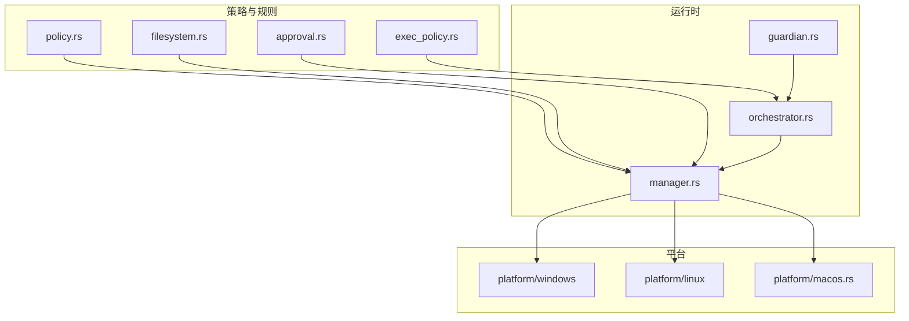
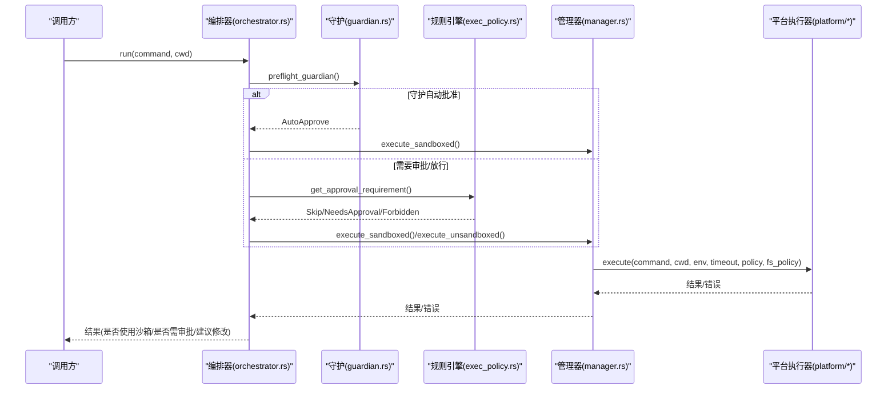
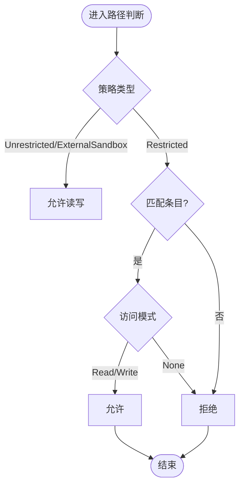
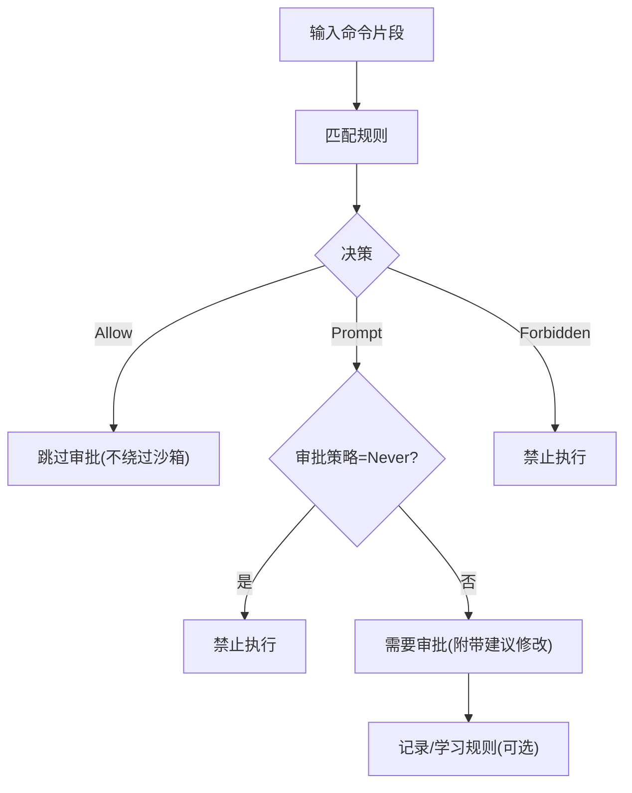
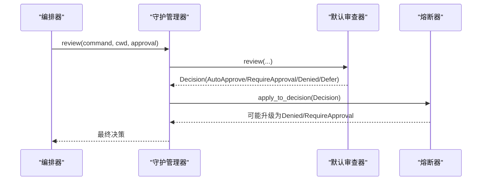
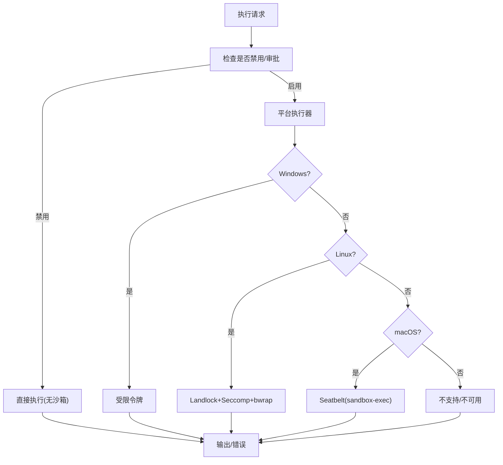
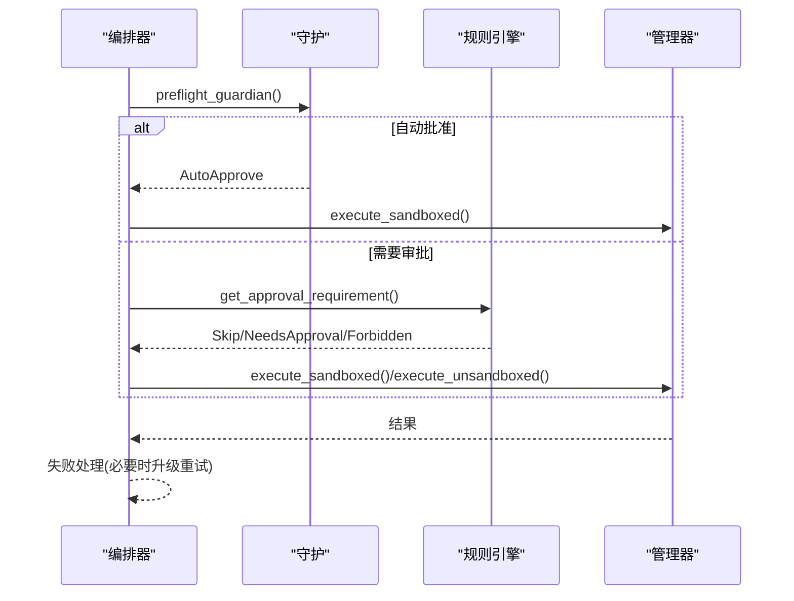
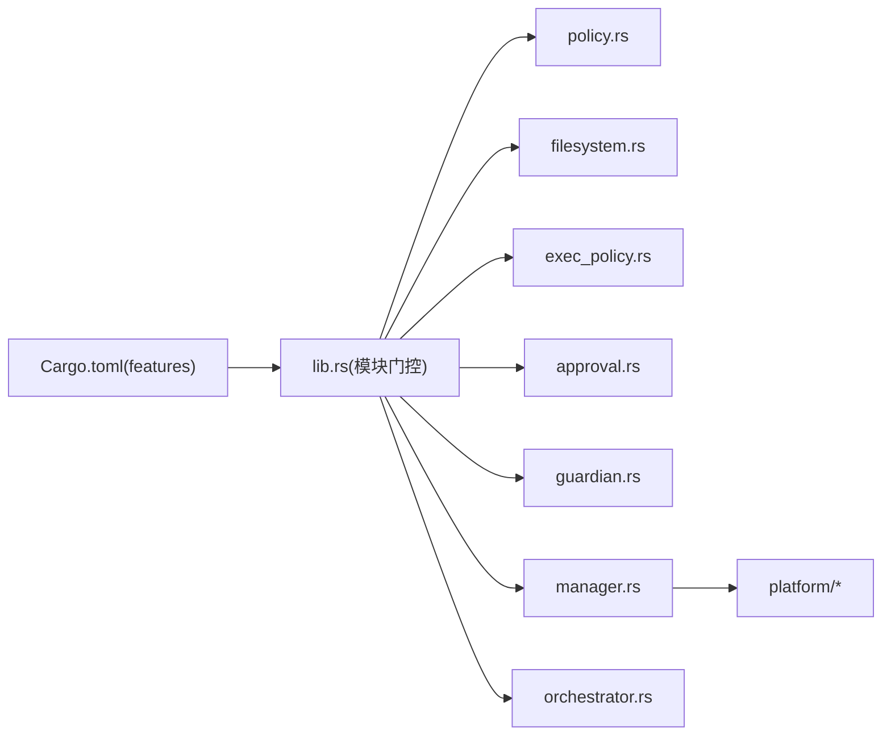

# 沙箱执行环境

<cite>
**本文引用的文件**
- [agent-diva-sandbox/Cargo.toml](file://agent-diva-sandbox/Cargo.toml)
- [agent-diva-sandbox/README.md](file://agent-diva-sandbox/README.md)
- [agent-diva-sandbox/src/lib.rs](file://agent-diva-sandbox/src/lib.rs)
- [agent-diva-sandbox/src/policy.rs](file://agent-diva-sandbox/src/policy.rs)
- [agent-diva-sandbox/src/filesystem.rs](file://agent-diva-sandbox/src/filesystem.rs)
- [agent-diva-sandbox/src/exec_policy.rs](file://agent-diva-sandbox/src/exec_policy.rs)
- [agent-diva-sandbox/src/approval.rs](file://agent-diva-sandbox/src/approval.rs)
- [agent-diva-sandbox/src/guardian.rs](file://agent-diva-sandbox/src/guardian.rs)
- [agent-diva-sandbox/src/manager.rs](file://agent-diva-sandbox/src/manager.rs)
- [agent-diva-sandbox/src/orchestrator.rs](file://agent-diva-sandbox/src/orchestrator.rs)
- [agent-diva-sandbox/src/platform/macos.rs](file://agent-diva-sandbox/src/platform/macos.rs)
</cite>

## 目录
1. [简介](#简介)
2. [项目结构](#项目结构)
3. [核心组件](#核心组件)
4. [架构总览](#架构总览)
5. [详细组件分析](#详细组件分析)
6. [依赖关系分析](#依赖关系分析)
7. [性能考量](#性能考量)
8. [故障排查指南](#故障排查指南)
9. [结论](#结论)
10. [附录](#附录)

## 简介
本章节面向初学者与管理员，系统阐述 Agent Diva 的沙箱执行环境：隔离执行机制、策略引擎与权限控制、文件访问限制、命令执行白名单、网络请求控制、资源使用限制、守护进程审批流程、安全策略配置与审计日志。同时提供策略配置示例、安全最佳实践、常见攻击防护方案、性能影响分析与调试排障方法，并说明如何自定义安全策略与集成外部审批系统。

## 项目结构
Agent Diva 的沙箱能力集中在 agent-diva-sandbox crate，采用模块化设计：
- 策略定义：policy.rs（SandboxPolicy/SandboxMode/NetworkAccess/AskForApproval）
- 文件系统策略：filesystem.rs（读写路径、受保护路径、WritableRoot）
- 规则引擎：exec_policy.rs（TOML 规则、白名单/禁止项、自动学习）
- 审批缓存：approval.rs（会话级审批缓存）
- 守护审批：guardian.rs（自动审批、熔断器、默认审查器）
- 管理器：manager.rs（统一入口、平台调度、超时控制）
- 编排器：orchestrator.rs（审批→选择→尝试→失败重试/升级）
- 平台实现：platform/*（Windows/Linux/macOS 具体隔离手段）
- 公共导出与环境开关：lib.rs（模块门控、环境变量禁用开关）



**图示来源**
- [agent-diva-sandbox/src/lib.rs:27-54](file://agent-diva-sandbox/src/lib.rs#L27-L54)
- [agent-diva-sandbox/src/manager.rs:236-320](file://agent-diva-sandbox/src/manager.rs#L236-L320)
- [agent-diva-sandbox/src/orchestrator.rs:261-348](file://agent-diva-sandbox/src/orchestrator.rs#L261-L348)
- [agent-diva-sandbox/src/guardian.rs:612-694](file://agent-diva-sandbox/src/guardian.rs#L612-L694)
- [agent-diva-sandbox/src/platform/macos.rs:72-83](file://agent-diva-sandbox/src/platform/macos.rs#L72-L83)

**章节来源**
- [agent-diva-sandbox/src/lib.rs:27-54](file://agent-diva-sandbox/src/lib.rs#L27-L54)
- [agent-diva-sandbox/Cargo.toml:9-18](file://agent-diva-sandbox/Cargo.toml#L9-L18)

## 核心组件
- 策略层
  - SandboxPolicy/SandboxMode：定义执行限制级别、只读/工作区写入/外部沙箱等模式；可映射到核心安全策略。
  - NetworkAccess/AskForApproval：控制网络访问与审批时机。
- 文件系统策略
  - FileSystemSandboxPolicy/WritableRoot：基于路径的读写控制与“受保护子路径”（如 .git/.diva/.agents）。
  - 默认受保护路径集合：密钥、凭据、配置文件等敏感文件默认拒绝读取。
- 规则引擎（ExecPolicy）
  - TOML 前缀规则：Allow/Prompt/Forbidden；支持从生产规则库导入；支持自动学习生成 Allow 规则（防危险前缀）。
  - 危险前缀黑名单：解释器、提权、Shell 等高危命令不可被自动建议为允许。
- 审批缓存（ApprovalStore）
  - 会话级缓存：ApprovedOnce/ApprovedForSession/Denied；避免重复提示。
- 守护审批（Guardian）
  - 默认审查器：识别已知安全、只读、潜在危险命令；结合 AskForApproval 策略决策。
  - 熔断器：连续拒绝达到阈值时阻断自动审批，强制人工介入。
- 管理器（SandboxManager）
  - 统一入口：构建策略与文件系统策略、检查审批、调用平台执行器、超时控制、直接执行回退。
- 编排器（ToolOrchestrator）
  - 完整流程：预检（Guardian）→ 审批解析 → 选择沙箱 → 首次尝试 → 失败处理（必要时升级/重试）。

**章节来源**
- [agent-diva-sandbox/src/policy.rs:9-144](file://agent-diva-sandbox/src/policy.rs#L9-L144)
- [agent-diva-sandbox/src/filesystem.rs:9-94](file://agent-diva-sandbox/src/filesystem.rs#L9-L94)
- [agent-diva-sandbox/src/exec_policy.rs:20-96](file://agent-diva-sandbox/src/exec_policy.rs#L20-L96)
- [agent-diva-sandbox/src/approval.rs:13-81](file://agent-diva-sandbox/src/approval.rs#L13-L81)
- [agent-diva-sandbox/src/guardian.rs:25-110](file://agent-diva-sandbox/src/guardian.rs#L25-L110)
- [agent-diva-sandbox/src/manager.rs:236-320](file://agent-diva-sandbox/src/manager.rs#L236-L320)
- [agent-diva-sandbox/src/orchestrator.rs:261-348](file://agent-diva-sandbox/src/orchestrator.rs#L261-L348)

## 架构总览
下图展示一次命令执行的端到端流程：编排器协调守护审批、规则引擎、管理器与平台执行器，最终在受限环境中运行命令或按策略回退。



**图示来源**
- [agent-diva-sandbox/src/orchestrator.rs:399-430](file://agent-diva-sandbox/src/orchestrator.rs#L399-L430)
- [agent-diva-sandbox/src/orchestrator.rs:432-514](file://agent-diva-sandbox/src/orchestrator.rs#L432-L514)
- [agent-diva-sandbox/src/manager.rs:400-433](file://agent-diva-sandbox/src/manager.rs#L400-L433)
- [agent-diva-sandbox/src/manager.rs:504-575](file://agent-diva-sandbox/src/manager.rs#L504-L575)
- [agent-diva-sandbox/src/platform/macos.rs:72-83](file://agent-diva-sandbox/src/platform/macos.rs#L72-L83)

## 详细组件分析

### 策略与权限控制（policy.rs）
- SandboxPolicy：DangerFullAccess/ReadOnly/WorkspaceWrite/ExternalSandbox，分别对应无限制、只读、工作区写入、外部容器场景。
- SandboxMode：配置友好枚举，转换为 SandboxPolicy。
- NetworkAccess/AskForApproval：控制网络与审批时机（Never/OnFailure/OnRequest/UnlessTrusted）。
- 与安全策略互转：可将沙箱策略映射为核心 SecurityPolicy，便于上层统一管理。

```mermaid
classDiagram
class SandboxPolicy {
+DangerFullAccess
+ReadOnly{access,network_access}
+WorkspaceWrite{writable_roots,read_only_access,network_access,exclude_tmpdir_env_var}
+ExternalSandbox{network_access}
+to_security_policy(workspace_dir) SecurityPolicy
}
class SandboxMode {
+DangerFullAccess
+ReadOnly
+WorkspaceWrite
+to_policy(workspace) SandboxPolicy
}
class NetworkAccess {
+Allowed
+Denied
+is_allowed() bool
}
class AskForApproval {
+Never
+OnFailure
+OnRequest
+UnlessTrusted
+should_ask_before_first_attempt() bool
+allows_sandbox_failure_retry() bool
}
SandboxMode --> SandboxPolicy : "转换"
```

**图示来源**
- [agent-diva-sandbox/src/policy.rs:9-144](file://agent-diva-sandbox/src/policy.rs#L9-L144)
- [agent-diva-sandbox/src/policy.rs:166-192](file://agent-diva-sandbox/src/policy.rs#L166-L192)
- [agent-diva-sandbox/src/policy.rs:194-228](file://agent-diva-sandbox/src/policy.rs#L194-L228)

**章节来源**
- [agent-diva-sandbox/src/policy.rs:9-144](file://agent-diva-sandbox/src/policy.rs#L9-L144)
- [agent-diva-sandbox/src/policy.rs:166-228](file://agent-diva-sandbox/src/policy.rs#L166-L228)

### 文件系统访问控制（filesystem.rs）
- FileSystemSandboxPolicy：Restricted/Unrestricted/ExternalSandbox，基于条目决定读/写权限。
- WritableRoot：在工作区根下允许写入，但内置受保护子路径（.git/.agents/.diva 等）保持只读。
- 默认受保护路径：包含密钥、凭据、配置文件等敏感文件，默认拒绝读取。
- ReadDenyMatcher：基于 glob 模式的读取拒绝匹配器。



**图示来源**
- [agent-diva-sandbox/src/filesystem.rs:19-94](file://agent-diva-sandbox/src/filesystem.rs#L19-L94)
- [agent-diva-sandbox/src/filesystem.rs:308-369](file://agent-diva-sandbox/src/filesystem.rs#L308-L369)

**章节来源**
- [agent-diva-sandbox/src/filesystem.rs:9-94](file://agent-diva-sandbox/src/filesystem.rs#L9-L94)
- [agent-diva-sandbox/src/filesystem.rs:240-306](file://agent-diva-sandbox/src/filesystem.rs#L240-L306)
- [agent-diva-sandbox/src/filesystem.rs:339-404](file://agent-diva-sandbox/src/filesystem.rs#L339-L404)

### 命令执行白名单与规则引擎（exec_policy.rs）
- 规则格式：TOML 前缀规则，支持 Allow/Prompt/Forbidden。
- 评估逻辑：根据命令前缀匹配返回 Evaluation，并转化为 ApprovalRequirement（Skip/NeedsApproval/Forbidden）。
- 自动学习：用户批准后自动生成 Allow 规则（排除危险前缀），持久化到规则文件。
- 危险前缀黑名单：解释器、提权、Shell 等高危命令不可自动建议为允许。



**图示来源**
- [agent-diva-sandbox/src/exec_policy.rs:270-324](file://agent-diva-sandbox/src/exec_policy.rs#L270-L324)
- [agent-diva-sandbox/src/exec_policy.rs:326-373](file://agent-diva-sandbox/src/exec_policy.rs#L326-L373)
- [agent-diva-sandbox/src/exec_policy.rs:20-96](file://agent-diva-sandbox/src/exec_policy.rs#L20-L96)

**章节来源**
- [agent-diva-sandbox/src/exec_policy.rs:20-96](file://agent-diva-sandbox/src/exec_policy.rs#L20-L96)
- [agent-diva-sandbox/src/exec_policy.rs:270-373](file://agent-diva-sandbox/src/exec_policy.rs#L270-L373)

### 守护审批与熔断（guardian.rs）
- 默认审查器：识别“已知安全”“只读”“潜在危险”，结合 AskForApproval 策略输出 AutoApprove/RequireApproval/Denied/Defer。
- 熔断器：在窗口期内连续拒绝超过阈值时，阻止自动审批，强制人工介入。
- 管理：维护配置、审查器、熔断器与会话审批缓存。



**图示来源**
- [agent-diva-sandbox/src/guardian.rs:612-694](file://agent-diva-sandbox/src/guardian.rs#L612-L694)
- [agent-diva-sandbox/src/guardian.rs:474-589](file://agent-diva-sandbox/src/guardian.rs#L474-L589)
- [agent-diva-sandbox/src/guardian.rs:375-472](file://agent-diva-sandbox/src/guardian.rs#L375-L472)

**章节来源**
- [agent-diva-sandbox/src/guardian.rs:25-110](file://agent-diva-sandbox/src/guardian.rs#L25-L110)
- [agent-diva-sandbox/src/guardian.rs:375-472](file://agent-diva-sandbox/src/guardian.rs#L375-L472)
- [agent-diva-sandbox/src/guardian.rs:474-589](file://agent-diva-sandbox/src/guardian.rs#L474-L589)
- [agent-diva-sandbox/src/guardian.rs:612-694](file://agent-diva-sandbox/src/guardian.rs#L612-L694)

### 管理器与平台执行（manager.rs + platform/*）
- 管理器职责：构建策略与文件系统策略、审批检查、平台执行、超时控制、直接执行回退。
- 平台实现：
  - Windows：受限令牌（Restricted Token）隔离。
  - Linux：Landlock LSM + Seccomp-BPF + Bubblewrap（bwrap）。
  - macOS：Seatbelt（sandbox-exec）动态策略。
- 环境变量：AGENT_DIVA_SANDBOX_DISABLED=1/true 可完全禁用沙箱。



**图示来源**
- [agent-diva-sandbox/src/manager.rs:400-433](file://agent-diva-sandbox/src/manager.rs#L400-L433)
- [agent-diva-sandbox/src/manager.rs:504-575](file://agent-diva-sandbox/src/manager.rs#L504-L575)
- [agent-diva-sandbox/src/platform/macos.rs:72-83](file://agent-diva-sandbox/src/platform/macos.rs#L72-L83)
- [agent-diva-sandbox/src/lib.rs:107-115](file://agent-diva-sandbox/src/lib.rs#L107-L115)

**章节来源**
- [agent-diva-sandbox/src/manager.rs:236-320](file://agent-diva-sandbox/src/manager.rs#L236-L320)
- [agent-diva-sandbox/src/manager.rs:400-433](file://agent-diva-sandbox/src/manager.rs#L400-L433)
- [agent-diva-sandbox/src/manager.rs:504-575](file://agent-diva-sandbox/src/manager.rs#L504-L575)
- [agent-diva-sandbox/src/lib.rs:107-115](file://agent-diva-sandbox/src/lib.rs#L107-L115)

### 编排器（orchestrator.rs）
- 流程：预检（Guardian）→ 审批解析（ExecPolicy/AskForApproval）→ 选择沙箱 → 首次尝试 → 失败处理（必要时升级/重试）。
- 结果：OrchestratorRunResult 包含输出、成功标志、是否使用沙箱、是否请求审批、建议修改。



**图示来源**
- [agent-diva-sandbox/src/orchestrator.rs:399-430](file://agent-diva-sandbox/src/orchestrator.rs#L399-L430)
- [agent-diva-sandbox/src/orchestrator.rs:432-514](file://agent-diva-sandbox/src/orchestrator.rs#L432-L514)
- [agent-diva-sandbox/src/orchestrator.rs:579-614](file://agent-diva-sandbox/src/orchestrator.rs#L579-L614)

**章节来源**
- [agent-diva-sandbox/src/orchestrator.rs:261-348](file://agent-diva-sandbox/src/orchestrator.rs#L261-L348)
- [agent-diva-sandbox/src/orchestrator.rs:399-430](file://agent-diva-sandbox/src/orchestrator.rs#L399-L430)
- [agent-diva-sandbox/src/orchestrator.rs:579-614](file://agent-diva-sandbox/src/orchestrator.rs#L579-L614)

## 依赖关系分析
- 模块门控：Cargo features 控制模块编译（approval/manager/orchestrator/platform/guardian/filesystem）。
- 外部依赖：tokio、serde、regex、globset、toml、parking_lot、chrono、uuid、sha2；平台相关依赖（Windows API、Linux Landlock/Seccomp/bwrap、macOS sandbox-exec）。
- 耦合度：orchestrator 依赖 guardian 与 exec_policy；manager 聚合 policy 与 filesystem；platform 仅暴露执行接口。



**图示来源**
- [agent-diva-sandbox/Cargo.toml:9-18](file://agent-diva-sandbox/Cargo.toml#L9-L18)
- [agent-diva-sandbox/src/lib.rs:27-54](file://agent-diva-sandbox/src/lib.rs#L27-L54)

**章节来源**
- [agent-diva-sandbox/Cargo.toml:21-54](file://agent-diva-sandbox/Cargo.toml#L21-L54)
- [agent-diva-sandbox/src/lib.rs:27-54](file://agent-diva-sandbox/src/lib.rs#L27-L54)

## 性能考量
- 平台开销
  - Windows 受限令牌：创建令牌与进程上下文切换有轻微开销。
  - Linux Landlock/Seccomp/bwrap：内核态过滤与命名空间隔离带来额外启动时间，但提供更强的隔离。
  - macOS Seatbelt：sandbox-exec 策略生成与加载有启动成本。
- 审批与规则
  - 规则匹配与缓存命中减少审批延迟。
  - 熔断器在高拒绝率时降低自动审批频率，避免频繁交互。
- 超时控制
  - 默认超时（秒级）防止长时间阻塞；可通过请求参数调整。
- 建议
  - 合理设置 writable_roots 与 protected_paths，减少不必要的 I/O 检查。
  - 对高频命令建立 Allow 规则，提升吞吐。
  - 在生产环境启用 Guardian 智能模式，平衡安全性与效率。

[本节为通用指导，无需特定文件引用]

## 故障排查指南
- 常见问题
  - 平台不可用：macOS 缺少 sandbox-exec 或 Linux 缺少 bwrap/Landlock/Seccomp 支持时，管理器返回平台不可用错误；编排器会触发审批重试流程。
  - 审批卡住：检查 ApprovalStore 缓存与 Guardian 熔断状态；确认 AskForApproval 策略是否符合预期。
  - 规则冲突：ExecPolicy 中重复规则会被拒绝；确保规则文件唯一性。
  - 误判只读：检查 WritableRoot 受保护子路径是否覆盖了目标路径。
- 诊断步骤
  - 查看管理器日志：执行命令、策略、文件系统策略、平台类型。
  - 检查规则文件：execpolicy.toml 内容是否正确加载与合并。
  - 验证环境变量：AGENT_DIVA_SANDBOX_DISABLED 是否意外开启。
  - 平台检测：确认当前平台可用性与特性支持。
- 快速修复
  - 临时禁用沙箱：设置 AGENT_DIVA_SANDBOX_DISABLED=1（仅限调试）。
  - 添加 Allow 规则：对稳定安全的命令追加规则，减少审批。
  - 调整 Guardian 配置：放宽或收紧自动审批策略。

**章节来源**
- [agent-diva-sandbox/src/manager.rs:504-575](file://agent-diva-sandbox/src/manager.rs#L504-L575)
- [agent-diva-sandbox/src/exec_policy.rs:326-373](file://agent-diva-sandbox/src/exec_policy.rs#L326-L373)
- [agent-diva-sandbox/src/lib.rs:107-115](file://agent-diva-sandbox/src/lib.rs#L107-L115)
- [agent-diva-sandbox/src/filesystem.rs:308-369](file://agent-diva-sandbox/src/filesystem.rs#L308-L369)

## 结论
Agent Diva 的沙箱执行环境通过策略层、规则引擎、守护审批与平台隔离的多层协同，实现了细粒度的命令执行控制。其优势在于：
- 灵活的模式与策略：支持多种执行限制与网络访问控制。
- 强大的规则系统：TOML 规则与自动学习，兼顾安全与易用。
- 健壮的审批流程：会话缓存与熔断器保障用户体验与安全。
- 多平台适配：Windows/Linux/macOS 各有最优隔离手段。
管理员应依据业务需求配置策略与规则，结合审计日志与调试工具持续优化，确保在安全与效率之间取得平衡。

[本节为总结，无需特定文件引用]

## 附录

### 沙箱策略配置示例（概念性）
- 工作区写入模式：允许对工作区写入，默认只读其他路径，关闭网络访问。
- 只读模式：仅允许读取指定范围，关闭网络访问。
- 外部沙箱：适用于容器环境，仅控制网络访问。
- 危险全开放：不建议生产使用，仅在本地调试且明确风险时使用。

[本节为概念性说明，无需特定文件引用]

### 安全最佳实践
- 默认最小权限：优先使用 ReadOnly 或 WorkspaceWrite，关闭网络访问。
- 保护敏感路径：利用默认受保护路径与 WritableRoot 受保护子路径。
- 规则白名单：为常用安全命令建立 Allow 规则，减少审批摩擦。
- 危险前缀防护：避免将解释器、提权、Shell 等高危命令加入自动建议。
- 审批策略：生产环境建议使用 OnFailure 或 UnlessTrusted，配合 Guardian 智能模式。
- 审计与监控：记录审批决策、规则变更与执行结果，定期复盘。

[本节为通用指导，无需特定文件引用]

### 常见攻击防护方案
- 命令注入：通过 shell 引号转义与平台执行器隔离，避免注入。
- 越权访问：文件系统策略与平台隔离双重保障。
- 数据泄露：默认拒绝读取敏感文件，限制网络出站。
- 资源耗尽：超时控制与熔断器防止滥用。
- 恶意脚本执行：危险前缀黑名单与 Guardian 审查拦截。

[本节为通用指导，无需特定文件引用]

### 自定义安全策略与集成外部审批系统
- 自定义审查器：实现 GuardianReviewer 接口，注入业务规则（如企业白名单、风险评估）。
- 集成外部审批：通过 CommandApprovalCoordinator 与 ApprovalStore 对接外部系统，实现集中审批与审计。
- 规则同步：将外部审批结果同步至 ExecPolicy 或 CommandRuleStore，形成闭环。

**章节来源**
- [agent-diva-sandbox/src/guardian.rs:183-210](file://agent-diva-sandbox/src/guardian.rs#L183-L210)
- [agent-diva-sandbox/src/approval.rs:155-248](file://agent-diva-sandbox/src/approval.rs#L155-L248)