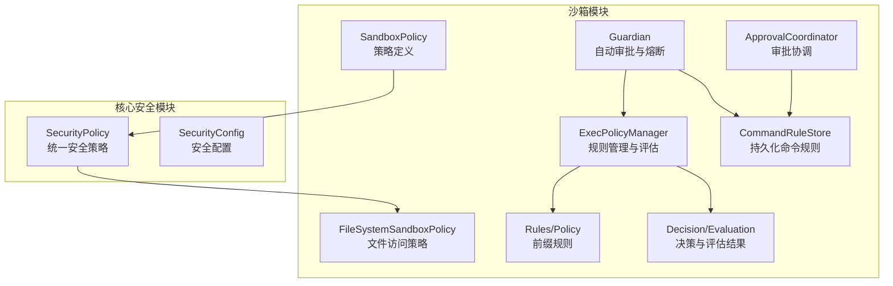
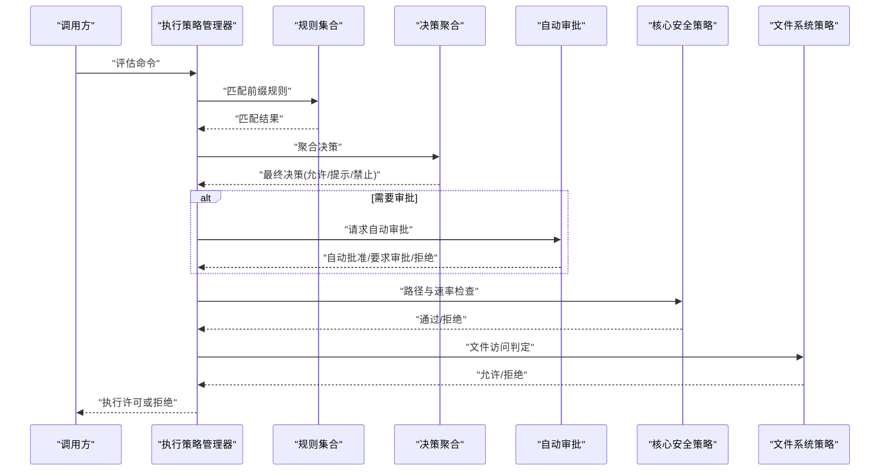
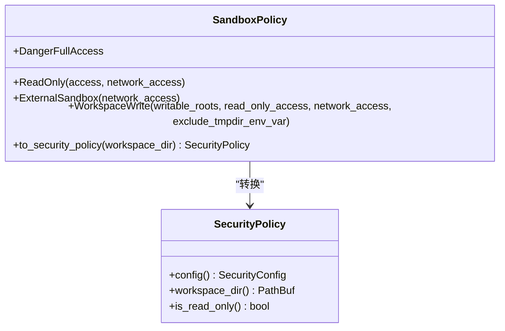
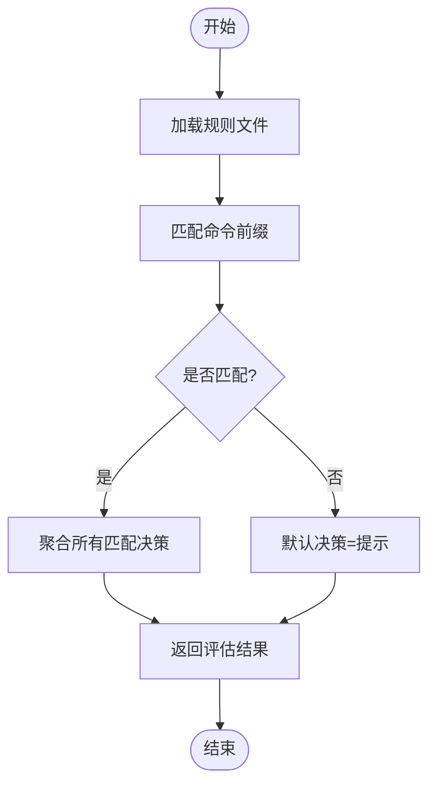
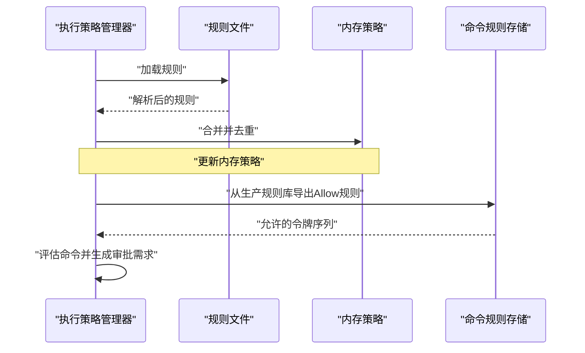
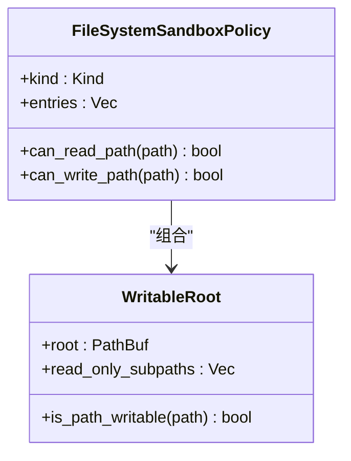
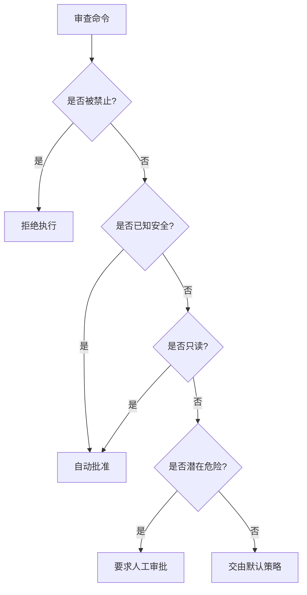
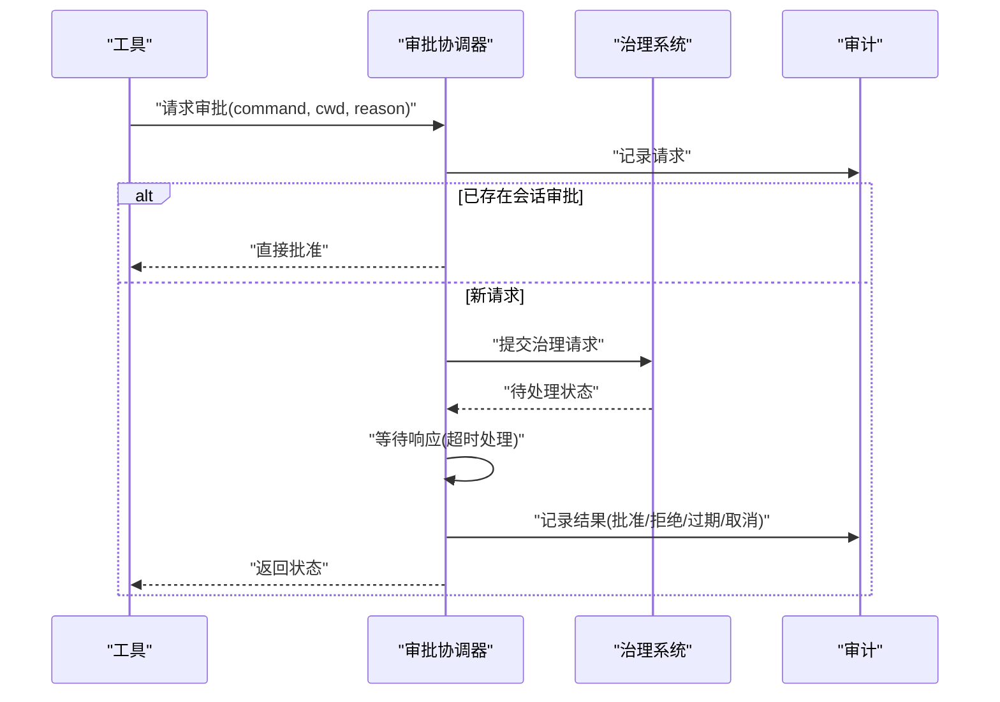
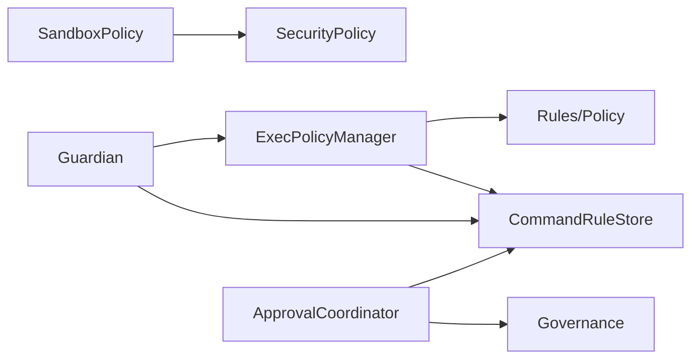

# 策略引擎

<cite>
**本文引用的文件**
- [agent-diva-sandbox/src/lib.rs](file://agent-diva-sandbox/src/lib.rs)
- [agent-diva-sandbox/src/policy.rs](file://agent-diva-sandbox/src/policy.rs)
- [agent-diva-sandbox/src/rules.rs](file://agent-diva-sandbox/src/rules.rs)
- [agent-diva-sandbox/src/exec_policy.rs](file://agent-diva-sandbox/src/exec_policy.rs)
- [agent-diva-sandbox/src/decision.rs](file://agent-diva-sandbox/src/decision.rs)
- [agent-diva-sandbox/src/filesystem.rs](file://agent-diva-sandbox/src/filesystem.rs)
- [agent-diva-sandbox/src/command_rules.rs](file://agent-diva-sandbox/src/command_rules.rs)
- [agent-diva-sandbox/src/guardian.rs](file://agent-diva-sandbox/src/guardian.rs)
- [agent-diva-sandbox/src/approval_coordinator.rs](file://agent-diva-sandbox/src/approval_coordinator.rs)
- [agent-diva-core/src/security/policy.rs](file://agent-diva-core/src/security/policy.rs)
- [agent-diva-core/src/security/config.rs](file://agent-diva-core/src/security/config.rs)
</cite>

## 目录
1. [简介](#简介)
2. [项目结构](#项目结构)
3. [核心组件](#核心组件)
4. [架构总览](#架构总览)
5. [详细组件分析](#详细组件分析)
6. [依赖关系分析](#依赖关系分析)
7. [性能考虑](#性能考虑)
8. [故障排查指南](#故障排查指南)
9. [结论](#结论)
10. [附录](#附录)

## 简介
本文件面向 Agent Diva 沙箱策略引擎，系统性阐述安全策略的定义、评估与执行机制。内容覆盖：
- 文件访问控制规则（读写限制、受保护路径）
- 命令执行白名单与黑名单（前缀匹配、禁止建议）
- 网络访问限制（允许/拒绝）
- 资源使用配额（速率限制、文件大小限制、工具超时）
- 策略优先级与规则匹配算法
- 动态策略更新（持久化、合并、去重、并发安全）
- 策略配置示例、最佳实践与性能优化建议
- 策略调试工具、审计日志分析与故障排查
- 自定义策略规则与外部策略源集成
- 面向初学者的概念解释与管理员操作指导

## 项目结构
Agent Diva 的策略能力由“沙箱模块”和“核心安全模块”共同构成：
- 沙箱模块负责命令执行策略、文件系统策略、审批协调、自动审批与规则管理
- 核心安全模块提供统一的安全策略、路径校验、速率限制与预算控制

图表来源
- [agent-diva-sandbox/src/policy.rs:1-109](file://agent-diva-sandbox/src/policy.rs#L1-L109)
- [agent-diva-sandbox/src/rules.rs:83-182](file://agent-diva-sandbox/src/rules.rs#L83-L182)
- [agent-diva-sandbox/src/exec_policy.rs:165-262](file://agent-diva-sandbox/src/exec_policy.rs#L165-L262)
- [agent-diva-sandbox/src/filesystem.rs:9-94](file://agent-diva-sandbox/src/filesystem.rs#L9-L94)
- [agent-diva-sandbox/src/decision.rs:9-148](file://agent-diva-sandbox/src/decision.rs#L9-L148)
- [agent-diva-sandbox/src/command_rules.rs:80-208](file://agent-diva-sandbox/src/command_rules.rs#L80-L208)
- [agent-diva-sandbox/src/guardian.rs:215-472](file://agent-diva-sandbox/src/guardian.rs#L215-L472)
- [agent-diva-sandbox/src/approval_coordinator.rs:118-215](file://agent-diva-sandbox/src/approval_coordinator.rs#L118-L215)
- [agent-diva-core/src/security/policy.rs:14-288](file://agent-diva-core/src/security/policy.rs#L14-L288)
- [agent-diva-core/src/security/config.rs:51-178](file://agent-diva-core/src/security/config.rs#L51-L178)

章节来源
- [agent-diva-sandbox/src/lib.rs:1-116](file://agent-diva-sandbox/src/lib.rs#L1-L116)

## 核心组件
- 沙箱策略（SandboxPolicy）：定义执行限制模式（危险全量、只读、工作区写入、外部沙箱），并桥接到核心安全策略
- 规则系统（Rules/Policy）：基于命令前缀的匹配规则，支持 TOML 序列化/反序列化与持久化
- 执行策略管理器（ExecPolicyManager）：加载、评估、合并规则，生成审批需求，支持动态追加规则
- 文件系统策略（FileSystemSandboxPolicy）：受限/无限制/外部沙箱三种模式，支持通配与特殊路径
- 决策与评估（Decision/Evaluation）：允许/提示/禁止三类决策，聚合最严格结果
- 命令规则存储（CommandRuleStore）：持久化、版本化、原子替换的命令规则库，支持安全建议过滤
- 自动审批（Guardian）：根据策略与命令特征进行自动批准或要求人工审批，具备熔断保护
- 审批协调器（ApprovalCoordinator）：异步审批流程、会话级缓存、治理集成与审计事件
- 核心安全策略（SecurityPolicy/SecurityConfig）：路径校验、速率限制、预算与工具超时等全局安全控制

章节来源
- [agent-diva-sandbox/src/policy.rs:10-109](file://agent-diva-sandbox/src/policy.rs#L10-L109)
- [agent-diva-sandbox/src/rules.rs:83-182](file://agent-diva-sandbox/src/rules.rs#L83-L182)
- [agent-diva-sandbox/src/exec_policy.rs:165-262](file://agent-diva-sandbox/src/exec_policy.rs#L165-L262)
- [agent-diva-sandbox/src/filesystem.rs:9-94](file://agent-diva-sandbox/src/filesystem.rs#L9-L94)
- [agent-diva-sandbox/src/decision.rs:9-148](file://agent-diva-sandbox/src/decision.rs#L9-L148)
- [agent-diva-sandbox/src/command_rules.rs:80-208](file://agent-diva-sandbox/src/command_rules.rs#L80-L208)
- [agent-diva-sandbox/src/guardian.rs:215-472](file://agent-diva-sandbox/src/guardian.rs#L215-L472)
- [agent-diva-sandbox/src/approval_coordinator.rs:118-215](file://agent-diva-sandbox/src/approval_coordinator.rs#L118-L215)
- [agent-diva-core/src/security/policy.rs:14-288](file://agent-diva-core/src/security/policy.rs#L14-L288)
- [agent-diva-core/src/security/config.rs:51-178](file://agent-diva-core/src/security/config.rs#L51-L178)

## 架构总览
策略引擎以“策略定义 → 规则匹配 → 审批决策 → 执行隔离”为主线，结合核心安全策略进行路径与速率控制。

图表来源
- [agent-diva-sandbox/src/exec_policy.rs:254-324](file://agent-diva-sandbox/src/exec_policy.rs#L254-L324)
- [agent-diva-sandbox/src/rules.rs:111-133](file://agent-diva-sandbox/src/rules.rs#L111-L133)
- [agent-diva-sandbox/src/decision.rs:106-148](file://agent-diva-sandbox/src/decision.rs#L106-L148)
- [agent-diva-sandbox/src/guardian.rs:375-467](file://agent-diva-sandbox/src/guardian.rs#L375-L467)
- [agent-diva-core/src/security/policy.rs:74-288](file://agent-diva-core/src/security/policy.rs#L74-L288)
- [agent-diva-sandbox/src/filesystem.rs:44-94](file://agent-diva-sandbox/src/filesystem.rs#L44-L94)

## 详细组件分析

### 策略定义与模式（SandboxPolicy）
- 模式类型：危险全量、只读、工作区写入、外部沙箱
- 网络访问：允许/拒绝
- 与工作区与安全策略的映射：将沙箱策略转换为 SecurityPolicy，设置工作区限制、只读标志、允许根路径
- 默认行为：工作区写入模式，关闭网络访问，排除用户临时目录环境变量可选

图表来源
- [agent-diva-sandbox/src/policy.rs:10-109](file://agent-diva-sandbox/src/policy.rs#L10-L109)
- [agent-diva-core/src/security/policy.rs:14-66](file://agent-diva-core/src/security/policy.rs#L14-L66)

章节来源
- [agent-diva-sandbox/src/policy.rs:10-109](file://agent-diva-sandbox/src/policy.rs#L10-L109)

### 规则系统与匹配算法（Rules/Policy）
- 前缀规则：按命令前缀匹配，支持精确匹配与扩展参数
- 策略容器：维护规则集合，提供匹配与评估方法
- 评估逻辑：对单条或多条命令进行评估，聚合为最终决策
- 持久化：TOML 格式，支持从文件加载与保存

图表来源
- [agent-diva-sandbox/src/rules.rs:111-133](file://agent-diva-sandbox/src/rules.rs#L111-L133)
- [agent-diva-sandbox/src/rules.rs:150-182](file://agent-diva-sandbox/src/rules.rs#L150-L182)

章节来源
- [agent-diva-sandbox/src/rules.rs:10-182](file://agent-diva-sandbox/src/rules.rs#L10-L182)

### 执行策略管理器（ExecPolicyManager）
- 规则加载与合并：从文件加载，合并已有规则，去重
- 命令评估：单条与批量评估，返回审批需求
- 动态更新：追加规则到文件并更新内存策略，防止重复与禁用危险前缀
- 与生产规则库集成：从 CommandRuleStore 导出 Allow 规则为 ExecPolicy

图表来源
- [agent-diva-sandbox/src/exec_policy.rs:215-262](file://agent-diva-sandbox/src/exec_policy.rs#L215-L262)
- [agent-diva-sandbox/src/exec_policy.rs:326-373](file://agent-diva-sandbox/src/exec_policy.rs#L326-L373)
- [agent-diva-sandbox/src/command_rules.rs:109-148](file://agent-diva-sandbox/src/command_rules.rs#L109-L148)

章节来源
- [agent-diva-sandbox/src/exec_policy.rs:165-386](file://agent-diva-sandbox/src/exec_policy.rs#L165-L386)

### 文件系统访问控制（FileSystemSandboxPolicy）
- 模式：受限、无限制、外部沙箱
- 路径匹配：支持绝对路径、通配模式、特殊路径（当前工作目录、项目根、临时目录等）
- 写权限：可写根目录与受保护子路径，默认保护 .git/.diva/.agents/.env 等敏感路径
- 读取拒绝匹配器：基于通配模式的默认拒绝列表

图表来源
- [agent-diva-sandbox/src/filesystem.rs:9-94](file://agent-diva-sandbox/src/filesystem.rs#L9-L94)
- [agent-diva-sandbox/src/filesystem.rs:240-337](file://agent-diva-sandbox/src/filesystem.rs#L240-L337)
- [agent-diva-sandbox/src/filesystem.rs:339-404](file://agent-diva-sandbox/src/filesystem.rs#L339-L404)

章节来源
- [agent-diva-sandbox/src/filesystem.rs:9-404](file://agent-diva-sandbox/src/filesystem.rs#L9-L404)

### 决策与评估（Decision/Evaluation）
- 决策类型：允许、提示、禁止
- 聚合规则：取最严格决策（禁止 > 提示 > 允许）
- 评估结果：包含匹配详情与是否有匹配

章节来源
- [agent-diva-sandbox/src/decision.rs:9-148](file://agent-diva-sandbox/src/decision.rs#L9-L148)

### 自动审批与熔断（Guardian）
- 自动审批策略：根据已知安全、只读判断、潜在危险命令决定自动批准或要求审批
- 熔断保护：在短时间窗口内多次拒绝后触发熔断，阻止自动批准
- 配置模式：严格、平衡、宽松，适配不同审批策略

图表来源
- [agent-diva-sandbox/src/guardian.rs:375-467](file://agent-diva-sandbox/src/guardian.rs#L375-L467)
- [agent-diva-sandbox/src/guardian.rs:475-589](file://agent-diva-sandbox/src/guardian.rs#L475-L589)

章节来源
- [agent-diva-sandbox/src/guardian.rs:215-589](file://agent-diva-sandbox/src/guardian.rs#L215-L589)

### 审批协调器（ApprovalCoordinator）
- 生命周期：创建请求、广播、等待响应、超时处理、状态清理
- 会话级缓存：同一会话中相同命令可复用审批
- 治理集成：与治理系统协作，支持撤销、过期、幂等性
- 审计事件：记录请求、批准、拒绝、取消等关键节点

图表来源
- [agent-diva-sandbox/src/approval_coordinator.rs:221-381](file://agent-diva-sandbox/src/approval_coordinator.rs#L221-L381)
- [agent-diva-sandbox/src/approval_coordinator.rs:383-594](file://agent-diva-sandbox/src/approval_coordinator.rs#L383-L594)

章节来源
- [agent-diva-sandbox/src/approval_coordinator.rs:118-594](file://agent-diva-sandbox/src/approval_coordinator.rs#L118-L594)

### 核心安全策略（SecurityPolicy/SecurityConfig）
- 路径校验：多层防护（空字节、路径穿越、URL编码穿越、波浪号展开、绝对路径限制、禁止前缀/扩展）
- 速率限制：每小时最大动作数，超限拒绝
- 预算控制：全局工具超时、会话与任务级 Token 预算
- 配置合并：工作区与家目录配置优先级与合并策略

章节来源
- [agent-diva-core/src/security/policy.rs:74-288](file://agent-diva-core/src/security/policy.rs#L74-L288)
- [agent-diva-core/src/security/config.rs:51-178](file://agent-diva-core/src/security/config.rs#L51-L178)

## 依赖关系分析
- 沙箱策略依赖核心安全策略进行路径与速率控制
- 执行策略管理器依赖规则系统与命令规则存储，实现动态更新与去重
- 自动审批依赖执行策略与命令规则存储，结合审批策略进行决策
- 审批协调器依赖命令规则存储与治理系统，确保审批的可恢复性与审计完整性

图表来源
- [agent-diva-sandbox/src/policy.rs:64-109](file://agent-diva-sandbox/src/policy.rs#L64-L109)
- [agent-diva-sandbox/src/exec_policy.rs:201-262](file://agent-diva-sandbox/src/exec_policy.rs#L201-L262)
- [agent-diva-sandbox/src/guardian.rs:215-274](file://agent-diva-sandbox/src/guardian.rs#L215-L274)
- [agent-diva-sandbox/src/approval_coordinator.rs:221-381](file://agent-diva-sandbox/src/approval_coordinator.rs#L221-L381)

章节来源
- [agent-diva-sandbox/src/exec_policy.rs:201-262](file://agent-diva-sandbox/src/exec_policy.rs#L201-L262)
- [agent-diva-sandbox/src/guardian.rs:215-274](file://agent-diva-sandbox/src/guardian.rs#L215-L274)
- [agent-diva-sandbox/src/approval_coordinator.rs:221-381](file://agent-diva-sandbox/src/approval_coordinator.rs#L221-L381)

## 性能考虑
- 规则匹配复杂度：前缀匹配为 O(n)，n 为规则数量；批量评估时注意规则规模
- 文件 I/O：规则持久化采用原子替换与文件锁，避免竞争条件
- 并发安全：使用读写锁与互斥锁保护共享状态，减少锁粒度
- 速率限制：合理设置每小时最大动作数，避免频繁拒绝导致性能抖动
- 熔断机制：在高拒绝率场景下自动阻断自动批准，降低无效审批开销

[本节为通用性能讨论，不直接分析具体文件]

## 故障排查指南
- 规则冲突：检查重复规则与版本冲突，使用去重与 CAS 更新
- 路径错误：验证路径是否包含穿越、禁止前缀或扩展，确认工作区限制
- 审批超时：调整审批超时时间，检查治理系统状态与撤销逻辑
- 熔断触发：查看近期拒绝次数与窗口，必要时手动重置熔断
- 审计日志：关注决策点事件，定位问题来源

章节来源
- [agent-diva-sandbox/src/exec_policy.rs:477-553](file://agent-diva-sandbox/src/exec_policy.rs#L477-L553)
- [agent-diva-sandbox/src/command_rules.rs:188-208](file://agent-diva-sandbox/src/command_rules.rs#L188-L208)
- [agent-diva-sandbox/src/approval_coordinator.rs:339-381](file://agent-diva-sandbox/src/approval_coordinator.rs#L339-L381)
- [agent-diva-sandbox/src/guardian.rs:502-589](file://agent-diva-sandbox/src/guardian.rs#L502-L589)

## 结论
Agent Diva 沙箱策略引擎通过分层策略定义、规则匹配、自动审批与核心安全控制，实现了灵活且安全的命令执行环境。管理员可通过策略配置、规则管理与审批协调，满足不同场景下的安全与效率需求。建议在生产环境中启用熔断与审计，定期审查规则与配置，确保系统稳定与安全。

[本节为总结性内容，不直接分析具体文件]

## 附录

### 策略配置示例
- 只读模式：限制文件写入，仅允许读取工作区或指定路径
- 工作区写入：允许在工作区与额外根路径写入，保护敏感子路径
- 外部沙箱：在网络访问受限的环境中运行，依赖外部容器隔离
- 命令白名单：为常用安全命令添加允许规则，减少审批频率
- 禁止建议：避免自动建议危险命令前缀，如解释器与提权命令

章节来源
- [agent-diva-sandbox/src/policy.rs:10-109](file://agent-diva-sandbox/src/policy.rs#L10-L109)
- [agent-diva-sandbox/src/exec_policy.rs:24-96](file://agent-diva-sandbox/src/exec_policy.rs#L24-L96)
- [agent-diva-sandbox/src/filesystem.rs:339-369](file://agent-diva-sandbox/src/filesystem.rs#L339-L369)

### 最佳实践
- 默认启用工作区限制与只读模式，逐步放宽权限
- 使用前缀规则明确允许安全命令，避免宽泛匹配
- 定期审查与清理规则，避免规则膨胀影响性能
- 启用熔断与审计，监控异常拒绝与审批行为
- 结合核心安全策略，限制路径与速率，防止滥用

章节来源
- [agent-diva-core/src/security/config.rs:142-178](file://agent-diva-core/src/security/config.rs#L142-L178)
- [agent-diva-sandbox/src/guardian.rs:475-589](file://agent-diva-sandbox/src/guardian.rs#L475-L589)

### 自定义策略与外部源集成
- 自定义规则：通过 TOML 文件或 API 添加前缀规则，支持注释与版本控制
- 外部策略源：从 CommandRuleStore 导入允许规则，保持策略一致性
- 动态更新：运行时追加规则并持久化，确保生效与可追溯

章节来源
- [agent-diva-sandbox/src/exec_policy.rs:201-262](file://agent-diva-sandbox/src/exec_policy.rs#L201-L262)
- [agent-diva-sandbox/src/command_rules.rs:109-148](file://agent-diva-sandbox/src/command_rules.rs#L109-L148)