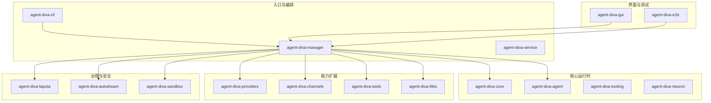
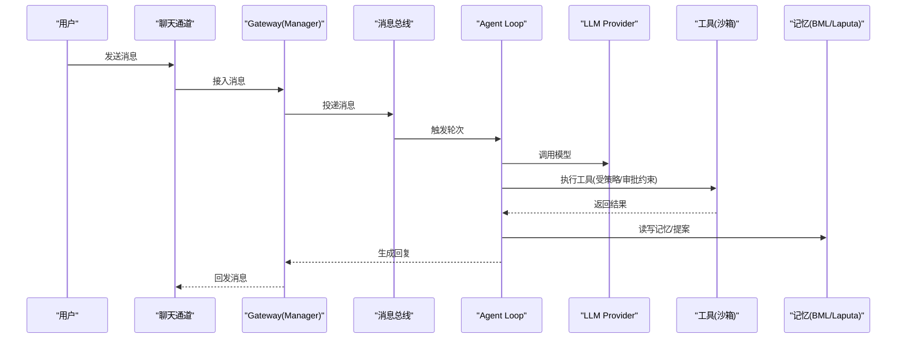
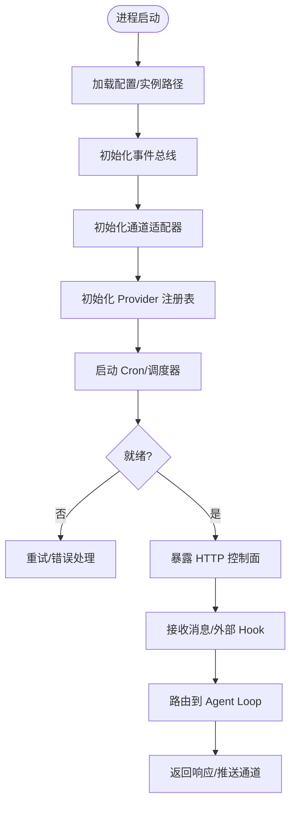
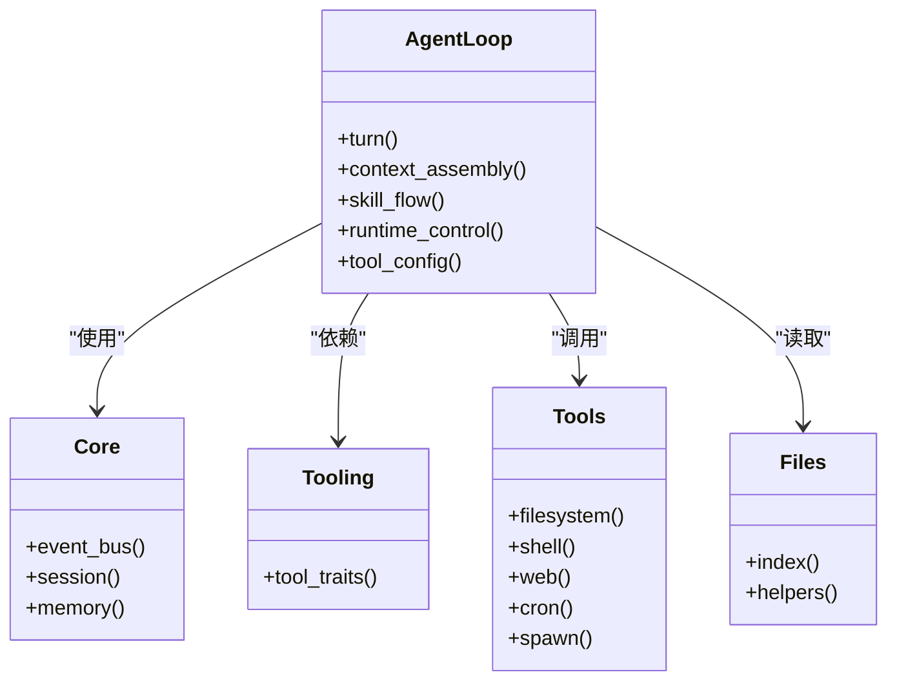
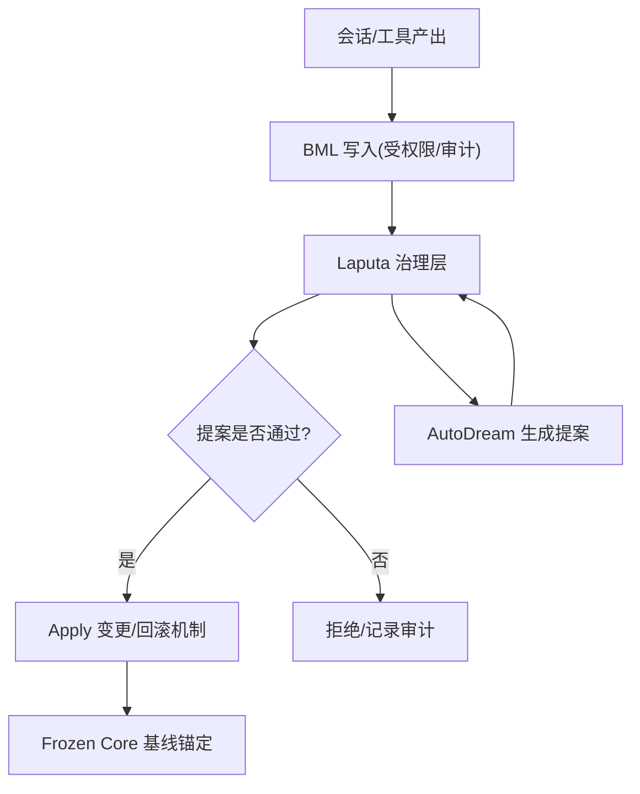
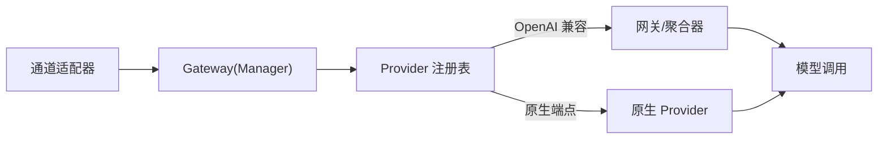
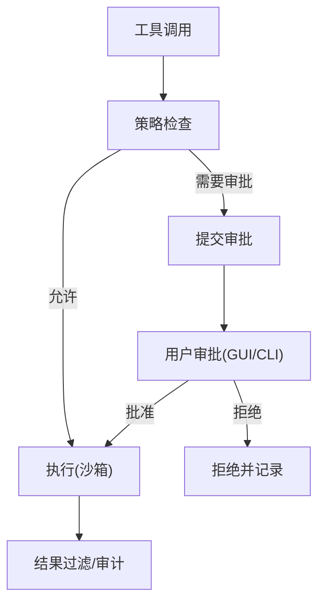
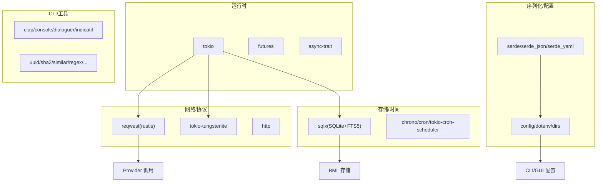

# 项目介绍

<cite>
**本文引用的文件**
- [README.md](file://README.md)
- [Cargo.toml](file://Cargo.toml)
- [AGENTS.md](file://AGENTS.md)
- [CLAUDE.md](file://CLAUDE.md)
- [agent-diva-core/README.md](file://agent-diva-core/README.md)
- [agent-diva-agent/README.md](file://agent-diva-agent/README.md)
- [docs/architecture/README.md](file://docs/architecture/README.md)
</cite>

## 目录
1. [简介](#简介)
2. [项目结构](#项目结构)
3. [核心组件](#核心组件)
4. [架构总览](#架构总览)
5. [详细组件分析](#详细组件分析)
6. [依赖关系分析](#依赖关系分析)
7. [性能与工程特性](#性能与工程特性)
8. [故障排查指南](#故障排查指南)
9. [结论](#结论)
10. [附录](#附录)

## 简介
Agent Diva 是一个自托管的个人 AI 网关，将聊天平台（如 Telegram、Discord、QQ、钉钉、飞书、邮件等）与 LLM 服务连接起来。它提供持久化记忆、可治理的人格演化、技能系统、定时任务与人机协同审批能力，并以 CLI、TUI 和 Tauri 桌面 GUI 三种界面交付。

项目的命名来源于《Vivy: Fluorite Eye's Song》：Agent 是执行者与工具，Diva 是舞台中心；Agent Diva 是 Project Vivy 的基础构件，目标是构建一个面向“AI 操作系统”的实验平台。

与 nanobot 的关系：Agent Diva 继承并扩展了 nanobot 的核心哲学——最小化的 Agent Loop 思想，但以 Rust 重写实现生产级工程能力，并提供完整 Pro 功能增强（多通道、多 Provider、GUI/TUI/CLI、安全沙箱、治理与审计、计划与审批、记忆与人格治理等）。

价值主张按用户群体划分：
- 开发者：开箱即用的多通道 + 多 Provider + 工具系统，无需从零搭建日常助手。
- 高级用户：熟悉 nanobot/openclaw，希望获得长期运行、安装即用、具备 UI 的本地网关。
- 实验者：关注人格/记忆治理、多 Agent 协作，需要一个现成平台进行实验。
- 分发者：关注包体大小、资源占用与分享后的团队体验。

技术栈概览与架构理念：
- 语言与运行时：Rust 工作区，tokio 异步运行时，rustls TLS。
- 配置与序列化：config、serde、dotenv、dirs。
- 网络与协议：reqwest、tokio-tungstenite、http。
- 数据库与存储：sqlx（SQLite + FTS5），BML 为唯一生产记忆权威。
- 日志与追踪：tracing 系列。
- 调度：cron、tokio-cron-scheduler。
- 前端：Tauri + Vue 3 桌面应用。
- 设计理念：轻量、可扩展、生产级工程实现；以 Gateway 为中心的消息总线驱动 Agent Loop，统一会话路由与通道接入。

**章节来源**
- [README.md:7-32](file://README.md#L7-L32)
- [README.md:20-32](file://README.md#L20-L32)
- [README.md:43-59](file://README.md#L43-L59)
- [README.md:60-86](file://README.md#L60-L86)
- [README.md:110-115](file://README.md#L110-L115)
- [Cargo.toml:27-105](file://Cargo.toml#L27-L105)

## 项目结构
仓库采用 Rust workspace 组织，按职责拆分 crate：
- agent-diva-core：共享配置、事件总线、会话与记忆服务、心跳/定时、日志与安全原语。
- agent-diva-agent：Agent Loop、上下文组装、技能/子 Agent 流程、运行时控制。
- agent-diva-providers：LLM/语音转写 Provider 抽象与预设。
- agent-diva-channels：通道适配器（Telegram、Discord、QQ、钉钉、飞书、邮件等）。
- agent-diva-tools：内置工具（文件系统、Shell、Web、Cron、Spawn 等）。
- agent-diva-files：文件索引与管理辅助。
- agent-diva-tooling：共享工具抽象与实用库。
- agent-diva-neuron：GUI 使用的支持类型/辅助。
- agent-diva-manager：本地网关与 HTTP 控制面（CLI 默认依赖）。
- agent-diva-laputa：BML 记忆存储与 Laputa 人格治理层。
- agent-diva-autodream：AutoDream 提案生命周期（手动运行、输入、输出）。
- agent-diva-sandbox：沙箱策略、执行、平台适配与审批/Guardian 支持。
- agent-diva-cli：用户入口二进制。
- agent-diva-service：Windows 服务包装。
- agent-diva-gui：Tauri + Vue 3 桌面应用。
- agent-diva-migration：迁移工具。
- agent-diva-e2e：端到端测试套件。

**图表来源**
- [Cargo.toml:1-20](file://Cargo.toml#L1-L20)
- [README.md:87-108](file://README.md#L87-L108)

**章节来源**
- [README.md:87-108](file://README.md#L87-L108)
- [AGENTS.md:5-26](file://AGENTS.md#L5-L26)
- [CLAUDE.md:14-33](file://CLAUDE.md#L14-L33)

## 核心组件
- 网关（Manager）：会话、路由、通道连接的单一事实源；消息经总线进入 Agent Loop，再回发至对应通道。
- Agent Loop：组合 Provider 访问、上下文组装、技能流、运行时控制与工具配置，形成可执行的 Agent 层。
- 记忆与人格：BML（基于 SQLite + FTS5 的本地 typed 存储）作为唯一生产记忆权威；Laputa 在其之上提供提案、治理 apply、回滚、审计与 Frozen Core 基线；AutoDream 生成提案但不直接写入人格状态。
- 工具与沙箱：内置工具通过沙箱策略与 Guardian 审批执行外部动作，确保可控性。
- 渠道与 Provider：多通道与多 Provider 抽象，支持 45+ 预设与自定义 OpenAI 兼容端点及语音转写。
- 界面：CLI（自动化）、TUI（终端对话）、GUI（全功能桌面体验）。

**章节来源**
- [README.md:20-32](file://README.md#L20-L32)
- [README.md:43-59](file://README.md#L43-L59)
- [README.md:60-86](file://README.md#L60-L86)
- [README.md:272-285](file://README.md#L272-L285)
- [agent-diva-core/README.md:1-16](file://agent-diva-core/README.md#L1-L16)
- [agent-diva-agent/README.md:1-16](file://agent-diva-agent/README.md#L1-L16)

## 架构总览
Agent Diva 以 Gateway 为中心，消息从通道进入消息总线，经过 Agent Loop 调用 LLM 与工具，最终返回到相应通道。GUI/TUI/CLI 通过 Manager 提供的 HTTP 控制面与网关交互。

**图表来源**
- [README.md:43-59](file://README.md#L43-L59)
- [README.md:60-86](file://README.md#L60-L86)

## 详细组件分析

### 网关与控制面（Manager）
- 角色：本地网关与 HTTP 控制面，CLI 默认依赖；负责会话管理、路由、通道连接、调度与对外 API。
- 与 CLI/GUI 的关系：CLI 通过 Manager 启动/控制 Gateway；GUI 在开发模式下由 Tauri 内嵌或外部模式连接 Gateway。
- 关键能力：消息总线集成、通道管理、Provider 装配、Cron 任务、审批中心、外部 Hook。

**图表来源**
- [README.md:43-59](file://README.md#L43-L59)
- [README.md:176-242](file://README.md#L176-L242)

**章节来源**
- [AGENTS.md:17-24](file://AGENTS.md#L17-L24)
- [CLAUDE.md:14-33](file://CLAUDE.md#L14-L33)
- [README.md:176-242](file://README.md#L176-L242)

### Agent Loop（agent-diva-agent）
- 职责：编排 Provider 访问、上下文组装、技能/子 Agent 流程、运行时控制与工具配置。
- 与 core/tooling/tools/files 的关系：依赖 core 的错误/事件类型，tooling 的工具抽象，tools 的内置工具，files 的文件索引。
- 演进特点：该 crate 变更频率较高，公共入口视为稳定集成面，内部调度细节可能继续演进。

**图表来源**
- [agent-diva-agent/README.md:1-16](file://agent-diva-agent/README.md#L1-L16)
- [agent-diva-core/README.md:1-16](file://agent-diva-core/README.md#L1-L16)

**章节来源**
- [agent-diva-agent/README.md:1-33](file://agent-diva-agent/README.md#L1-L33)
- [agent-diva-core/README.md:1-34](file://agent-diva-core/README.md#L1-L34)

### 记忆与人格治理（BML + Laputa + AutoDream）
- BML：基于 SQLite + FTS5 的 profile-local typed 存储，是唯一生产记忆权威；历史文件仅用于离线导入。
- Laputa：在 BML 之上的治理层，提供提案、治理 apply、回滚、审计与 Frozen Core 基线。
- AutoDream：定时蒸馏过程，生成 Laputa 提案，不直接写入人格状态；提案需经治理路径审查与应用。
- GUI Evolution：提供人格状态、提案审查、记忆审批与受控变更管理。

**图表来源**
- [README.md:272-285](file://README.md#L272-L285)
- [AGENTS.md:42-56](file://AGENTS.md#L42-L56)

**章节来源**
- [README.md:272-285](file://README.md#L272-L285)
- [AGENTS.md:42-56](file://AGENTS.md#L42-L56)

### 通道与 Provider
- 通道：默认启用 Telegram、Discord、QQ、钉钉、飞书、邮件；已退役通道（Slack、WhatsApp、Matrix、IRC、Mattermost、Nextcloud Talk）可通过 feature 编译启用。
- Provider：45+ 预设（OpenRouter、DeepSeek、OpenAI、Anthropic、Gemini、Zhipu、Moonshot、StepFun、Doubao、SiliconFlow、Groq、Ollama 等），支持完全自定义 OpenAI 兼容端点与语音转写。
- 模型 ID 安全规则：直连原生端点时发送原始模型 ID，避免自动改写为 gateway 前缀形式；仅在真正的 OpenAI 兼容网关/聚合器上应用 provider/model 前缀改写。

**图表来源**
- [README.md:60-86](file://README.md#L60-L86)
- [AGENTS.md:115-126](file://AGENTS.md#L115-L126)

**章节来源**
- [README.md:60-86](file://README.md#L60-L86)
- [AGENTS.md:115-126](file://AGENTS.md#L115-L126)

### 工具与沙箱
- 内置工具：文件系统、Shell、Web、Cron、Spawn 等，配合文件索引与管理辅助。
- 沙箱策略：对工具执行进行策略控制、Guardian 审批与审计，确保外部动作的可控性与安全性。
- 人机协同：通过 CLI/GUI 的审批中心查看并处理待批事项。

**图表来源**
- [README.md:60-86](file://README.md#L60-L86)
- [AGENTS.md:138-150](file://AGENTS.md#L138-L150)

**章节来源**
- [README.md:60-86](file://README.md#L60-L86)
- [AGENTS.md:138-150](file://AGENTS.md#L138-L150)

### 界面与交付（CLI/TUI/GUI）
- CLI：自动化与运维入口，支持 onboarding、配置校验、通道/Provider 管理、审批中心、工作区/任务/面具管理等。
- TUI：轻量终端对话体验。
- GUI：Tauri + Vue 3 桌面应用，提供实时流式对话、工具调用可视化、审批中心、Provider/通道配置、技能市场、记忆/人格治理、Cron 管理、网关控制面板、中英切换等。
- 外部 Hook：Gateway HTTP API 默认监听端口，支持外部工具注入消息。

**章节来源**
- [README.md:176-242](file://README.md#L176-L242)
- [README.md:287-342](file://README.md#L287-L342)

## 依赖关系分析
- 工作区成员与版本：根 workspace 包含多个 crate，统一版本号与 MSRV（Rust 1.80+）。
- 关键依赖：tokio、futures、async-trait、tokio-util；serde 系列；anyhow/thiserror；tracing 系列；config/dotenv/dirs；chrono/cron/tokio-cron-scheduler；reqwest/rustls；tokio-tungstenite/http；clap/console/dialoguer/indicatif；encoding_rs；uuid/sha2/similar/unicode-*；regex/lazy_static/once_cell/bytes/base64/which/windows-service；sqlx（SQLite + FTS5 + migrate）。
- 发布优化：release profile 开启 LTO、单 codegen unit、strip。

**图表来源**
- [Cargo.toml:27-105](file://Cargo.toml#L27-L105)

**章节来源**
- [Cargo.toml:1-20](file://Cargo.toml#L1-L20)
- [Cargo.toml:27-105](file://Cargo.toml#L27-L105)

## 性能与工程特性
- 性能：release 构建启用 LTO、单 codegen unit、strip，减少体积并提升性能；tokio 多线程运行时支撑高并发；rustls 跨平台 TLS 行为一致。
- 工程：严格 lint/format/test 门禁（just ci），结构化日志与可观测性，错误传播与上下文保留，最小权限默认策略，敏感字段脱敏。
- 可维护性：crate 边界清晰，跨域类型集中在 core，provider/channel 隔离，小模块优先，避免大单体文件。

[本节为通用指导，不直接分析具体文件]

## 故障排查指南
- 配置与实例：使用 onboarding/config refresh/path/validate/doctor 命令定位问题；环境变量覆盖支持结构化与别名。
- 通道配置：确保 Stream Mode（钉钉）、Bot 邀请与权限（Discord）等前置条件满足；已退役通道需显式 feature 编译。
- Provider 模型 ID：直连原生端点时使用原始模型 ID，避免自动改写；涉及路由变更需补充断言最终 outbound model 的测试。
- 审批与沙箱：通过 approvals 命令或 GUI 审批中心查看待批事项；确认策略与 Guardian 设置。
- 日志与错误：使用 tracing 级别控制，避免热路径噪音；保留 source error 上下文，便于定位。

**章节来源**
- [README.md:134-211](file://README.md#L134-L211)
- [AGENTS.md:115-150](file://AGENTS.md#L115-L150)

## 结论
Agent Diva 以 Gateway 为核心，将多通道与多 Provider 统一接入，结合 Agent Loop、记忆/人格治理、工具与沙箱、以及 CLI/TUI/GUI 三套界面，提供轻量、可扩展、生产级的个人 AI 网关。其命名源自《Vivy: Fluorite Eye's Song》，愿景是成为 Project Vivy 的基础构件，探索“AI 操作系统”的可能性。对于开发者、高级用户、实验者与分发者，Agent Diva 提供了开箱即用、可治理、可审计且易于部署的解决方案。

[本节总结性内容，不直接分析具体文件]

## 附录
- 快速开始：克隆仓库、构建、安装、onboard、tui/gateway run。
- 配置：默认配置文件位置、最小配置示例、环境变量覆盖。
- 技能与 Cron：技能目录、市场安装、Cron 添加/列表/触发。
- 文档入口：当前架构、决策记录、研究、迭代日志与工程参考。

**章节来源**
- [README.md:116-148](file://README.md#L116-L148)
- [README.md:150-211](file://README.md#L150-L211)
- [README.md:246-285](file://README.md#L246-L285)
- [README.md:373-386](file://README.md#L373-L386)