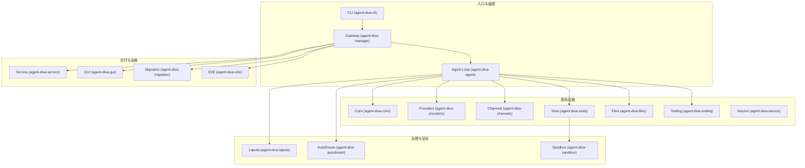
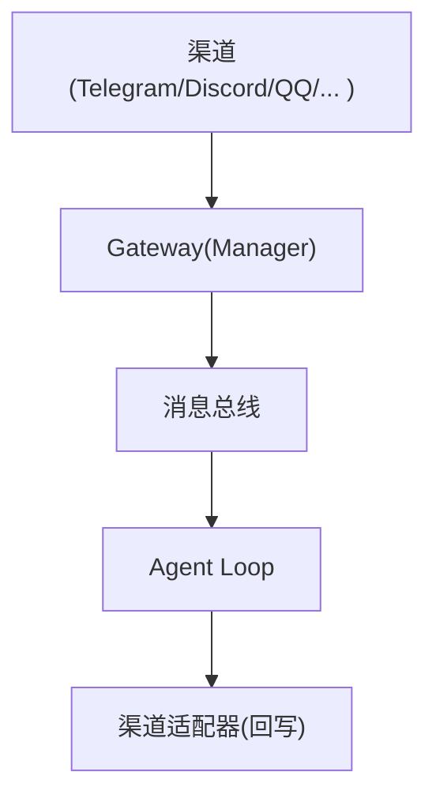
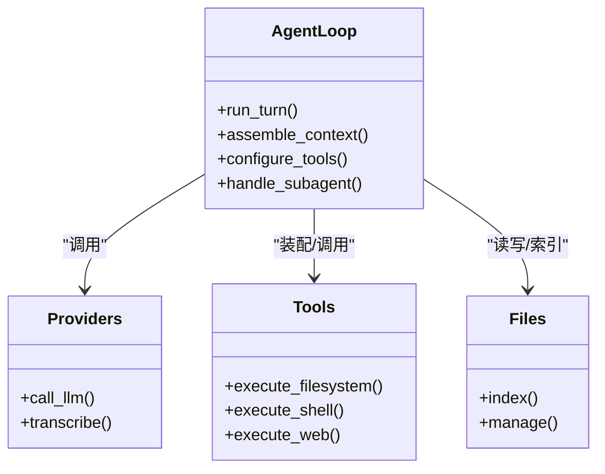
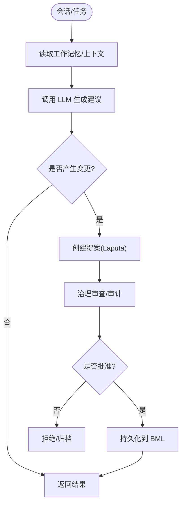
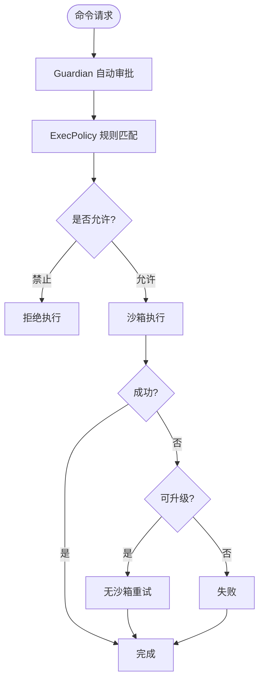
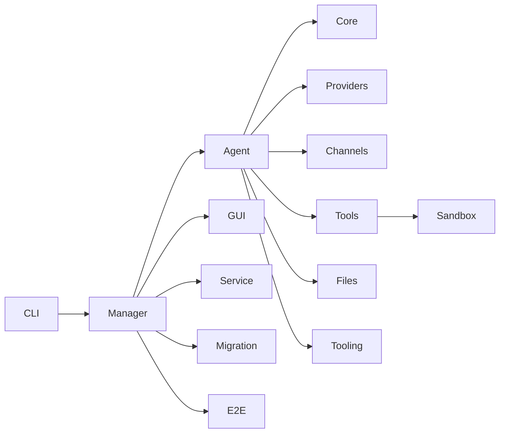

# 项目概述

<cite>
**本文引用的文件**
- [README.md](file://README.md)
- [Cargo.toml](file://Cargo.toml)
- [AGENTS.md](file://AGENTS.md)
- [agent-diva-agent/README.md](file://agent-diva-agent/README.md)
- [agent-diva-core/README.md](file://agent-diva-core/README.md)
- [agent-diva-sandbox/README.md](file://agent-diva-sandbox/README.md)
- [agent-diva-cli/src/main.rs](file://agent-diva-cli/src/main.rs)
- [docs/architecture/README.md](file://docs/architecture/README.md)
</cite>

## 目录
1. [简介](#简介)
2. [项目结构](#项目结构)
3. [核心组件](#核心组件)
4. [架构总览](#架构总览)
5. [关键组件详解](#关键组件详解)
6. [依赖关系分析](#依赖关系分析)
7. [性能与可维护性](#性能与可维护性)
8. [故障排查指南](#故障排查指南)
9. [结论](#结论)
10. [附录：快速开始与基础配置](#附录快速开始与基础配置)

## 简介
Agent Diva 是一个自托管的个人 AI 网关，将多种聊天平台（如 Telegram、Discord、QQ、DingTalk、飞书、邮件等）与本地或远程的 LLM 提供商连接起来。它提供持久化记忆、受治理的人格演化、技能系统、定时任务以及人机协同审批能力，并通过 CLI、TUI 和 Tauri GUI 三种界面提供服务。

该项目定位为“个人 AI 操作系统”的基础设施层，强调安全、可观测、可扩展与易部署。其设计目标包括：
- 多通道接入：统一消息路由到 Agent Loop，再回写到对应渠道。
- 智能体循环：以会话为单位组织上下文、工具调用、计划与验证。
- 记忆治理：基于 BML（SQLite + FTS5）作为唯一生产记忆权威，Laputa 提供提案、审计与回滚。
- 沙箱执行：对命令执行进行策略控制、自动审批与熔断保护。
- 完整 UI 三件套：CLI 自动化、TUI 终端交互、GUI 桌面体验。

与 nanobot 的关系：Agent Diva 继承并扩展了 nanobot 的最小 Agent Loop 理念，并以 Rust 重写实现工程级质量、全栈 UI 与更完善的安全治理。

**章节来源**
- [README.md:20-33](file://README.md#L20-L33)
- [AGENTS.md:42-56](file://AGENTS.md#L42-L56)

## 项目结构
仓库采用 Rust Workspace 组织，按职责划分 crate：
- agent-diva-core：共享配置、事件总线、会话、心跳、日志与安全基元。
- agent-diva-agent：Agent Loop 编排、上下文组装、技能/子代理流程。
- agent-diva-providers：LLM/语音转写 Provider 抽象与预设。
- agent-diva-channels：渠道适配器（Telegram、Discord、QQ、DingTalk、飞书、Email 等）。
- agent-diva-tools：内置工具（文件系统、Shell、Web、Cron、Spawn 等）。
- agent-diva-files：文件索引与管理辅助。
- agent-diva-tooling：通用工具抽象与实用库。
- agent-diva-neuron：GUI 使用的支持类型与辅助。
- agent-diva-manager：本地 Gateway 与 HTTP 控制面。
- agent-diva-laputa：BML 存储与 Laputa 人格治理。
- agent-diva-autodream：AutoDream 提案生命周期。
- agent-diva-sandbox：沙箱策略、执行与审批/守护人支持。
- agent-diva-cli：用户入口 CLI。
- agent-diva-service：Windows 服务包装。
- agent-diva-gui：Tauri + Vue 3 桌面应用。
- agent-diva-migration：版本迁移工具。
- agent-diva-e2e：端到端测试套件。



**图表来源**
- [Cargo.toml:1-20](file://Cargo.toml#L1-L20)
- [README.md:87-108](file://README.md#L87-L108)

**章节来源**
- [Cargo.toml:1-20](file://Cargo.toml#L1-L20)
- [README.md:87-108](file://README.md#L87-L108)
- [AGENTS.md:7-26](file://AGENTS.md#L7-L26)

## 核心组件
- 多通道接入：通过 channels crate 将不同平台的消息统一进入消息总线，再由 Gateway 路由至 Agent Loop。
- 智能体循环：agent-diva-agent 负责 turn 执行、上下文组装、工具装配与运行时控制。
- 记忆治理：BML 作为唯一生产记忆权威；Laputa 在之上提供提案、治理、审计与 Frozen Core 基线。
- 沙箱执行：sandbox crate 提供跨平台隔离、策略评估、自动审批与熔断保护。
- 提供者集成：providers crate 抽象 LLM/语音接口，内置 45+ 预设，支持自定义 OpenAI 兼容端点。
- 工具生态：tools crate 提供文件系统、Shell、Web、Cron、Spawn 等工具，配合 sandbox 安全执行。
- 管理面与 UI：manager 提供本地 Gateway 与 HTTP API；CLI/TUI/GUI 提供操作入口。

**章节来源**
- [agent-diva-agent/README.md:1-16](file://agent-diva-agent/README.md#L1-L16)
- [agent-diva-core/README.md:1-16](file://agent-diva-core/README.md#L1-L16)
- [agent-diva-sandbox/README.md:1-32](file://agent-diva-sandbox/README.md#L1-L32)
- [README.md:60-86](file://README.md#L60-L86)

## 架构总览
Agent Diva 的核心数据流是“渠道 → 网关 → Agent Loop → 提供商/工具/记忆 → 渠道”。Gateway 是会话、路由与渠道连接的单一事实源。消息经消息总线进入 Agent Loop，由 Loop 调用 LLM 与工具，并将结果回写至相应渠道。

```mermaid
sequenceDiagram
participant User as "用户"
participant Channel as "渠道适配器"
participant Gateway as "Gateway (Manager)"
participant Bus as "消息总线"
participant Loop as "Agent Loop"
participant Provider as "LLM Provider"
participant Tools as "工具(沙箱)"
participant Memory as "记忆(BML/Laputa)"
User->>Channel : 发送消息
Channel->>Gateway : 接入消息
Gateway->>Bus : 投递消息
Bus->>Loop : 触发 Turn
Loop->>Memory : 读取上下文/工作记忆
Loop->>Provider : 生成响应
Provider-->>Loop : 返回内容
Loop->>Tools : 必要时调用工具
Tools-->>Loop : 返回结果
Loop->>Memory : 更新记忆/摘要
Loop->>Gateway : 输出结果
Gateway->>Channel : 回写消息
Channel-->>User : 展示回复
```

**图表来源**
- [README.md:43-59](file://README.md#L43-L59)
- [agent-diva-cli/src/main.rs:1-57](file://agent-diva-cli/src/main.rs#L1-L57)

**章节来源**
- [README.md:43-59](file://README.md#L43-L59)

## 关键组件详解

### 多通道接入与网关
- 渠道适配：channels crate 为各平台提供适配器，默认启用 Telegram、Discord、QQ、DingTalk、飞书、Email；部分已退役渠道可通过 Cargo feature 编译。
- 网关管理：manager 提供本地 Gateway 与 HTTP 控制面，CLI 通过 manager 启动/管理 Gateway。
- 外部 Hook：Gateway 暴露 HTTP 钩子用于外部工具注入消息。



**图表来源**
- [README.md:60-86](file://README.md#L60-L86)
- [agent-diva-cli/src/main.rs:52-57](file://agent-diva-cli/src/main.rs#L52-L57)

**章节来源**
- [README.md:60-86](file://README.md#L60-L86)
- [agent-diva-cli/src/main.rs:52-57](file://agent-diva-cli/src/main.rs#L52-L57)

### 智能体循环（Agent Loop）
- 职责：turn 执行、上下文组装、工具装配、运行时控制与子代理支持。
- 依赖：core、providers、tooling、tools、files。
- 特点：高变更频率模块，公共入口视为稳定集成面；内部调度细节可能演进。



**图表来源**
- [agent-diva-agent/README.md:1-16](file://agent-diva-agent/README.md#L1-L16)

**章节来源**
- [agent-diva-agent/README.md:1-16](file://agent-diva-agent/README.md#L1-L16)

### 记忆治理（BML + Laputa + AutoDream）
- BML：基于 SQLite + FTS5 的 profile-local 存储，是唯一生产记忆权威；旧文件仅作为离线导入源。
- Laputa：在 BML 之上的治理层，提供提案、治理 apply、回滚、审计与 Frozen Core 基线。
- AutoDream：定时蒸馏过程，生成 Laputa 提案，不直接写入人格状态；提案需经治理路径审查与应用。



**图表来源**
- [README.md:272-286](file://README.md#L272-L286)
- [AGENTS.md:42-56](file://AGENTS.md#L42-L56)

**章节来源**
- [README.md:272-286](file://README.md#L272-L286)
- [AGENTS.md:42-56](file://AGENTS.md#L42-L56)

### 沙箱执行与审批（HITL）
- 平台隔离：Windows 使用受限令牌；Linux 使用 Landlock + Seccomp + Bubblewrap；macOS 使用 Seatbelt。
- 策略与规则：ExecPolicy 规则文件定义允许/提示/禁止的命令前缀；Guardian 自动审批结合熔断器防止滥用。
- 编排流程：自动审批 → 策略审批 → 首次尝试（沙箱/直接）→ 失败重试/升级。



**图表来源**
- [agent-diva-sandbox/README.md:33-52](file://agent-diva-sandbox/README.md#L33-L52)
- [agent-diva-sandbox/README.md:246-289](file://agent-diva-sandbox/README.md#L246-L289)

**章节来源**
- [agent-diva-sandbox/README.md:33-52](file://agent-diva-sandbox/README.md#L33-L52)
- [agent-diva-sandbox/README.md:246-289](file://agent-diva-sandbox/README.md#L246-L289)

### 与 nanobot 的关系及 Rust 重写优势
- 关系：Agent Diva 继承 nanobot 的最小 Agent Loop 理念，但提供更完整的工程体系与 UI。
- Rust 重写优势：内存安全、并发模型（tokio）、跨平台能力、更好的性能与可维护性；同时具备生产级工程实践（构建、测试、CI、文档）。

**章节来源**
- [README.md:29-33](file://README.md#L29-L33)
- [Cargo.toml:27-110](file://Cargo.toml#L27-L110)

## 依赖关系分析
Workspace 成员与依赖关系清晰分层：
- 高层：CLI、Manager、GUI、Service、E2E。
- 中层：Agent、Tools、Channels、Providers、Files、Tooling。
- 底层：Core、Sandbox、Laputa、Autodream、Migration。



**图表来源**
- [Cargo.toml:1-20](file://Cargo.toml#L1-L20)

**章节来源**
- [Cargo.toml:1-20](file://Cargo.toml#L1-L20)

## 性能与可维护性
- 异步运行时：基于 tokio，支持多线程、时间、进程、IO 等特性，适合高并发消息处理。
- 构建优化：release 配置开启 LTO、strip，减少体积并提升性能。
- 模块化：按职责拆分 crate，降低耦合度，便于独立测试与维护。
- 安全边界：沙箱与治理层确保工具执行与记忆修改的可控性。
- 可观测性：结构化日志与错误上下文，便于定位问题。

[本节为一般性指导，不直接分析具体文件]

## 故障排查指南
- 配置诊断：使用 CLI 的 config validate/doctor 检查实例配置与路径。
- 渠道状态：channels status 查看渠道连接与健康状况。
- 审批中心：approvals 命令查看并处理待决审批。
- 外部 Hook：HTTP 钩子用于调试消息注入与路由。
- 日志级别：调整 tracing 级别以获取更详细的运行信息。

**章节来源**
- [README.md:176-199](file://README.md#L176-L199)
- [README.md:230-242](file://README.md#L230-L242)
- [README.md:333-342](file://README.md#L333-L342)

## 结论
Agent Diva 通过多通道接入、智能体循环、记忆治理与沙箱执行，构建了安全、可扩展且易于部署的个人 AI 网关。Rust 重写带来了工程级质量与性能优势，CLI/TUI/GUI 三位一体的交付方式降低了使用门槛。对于初学者，可从 onboard 与 tui 开始；对于有经验的开发者，可深入 agent loop、laputa 治理与 sandbox 策略定制。

[本节为总结性内容，不直接分析具体文件]

## 附录：快速开始与基础配置
- 安装与初始化：
  - 克隆仓库并使用 just 构建与安装，或直接 cargo build/install。
  - 运行 onboard 初始化配置与工作区模板。
- 最小配置：
  - 在配置文件中添加至少一个 Provider 的 apiKey，并设置默认 agents/provider/model。
- 启动与交互：
  - 使用 tui 或 chat 进行本地对话；无需渠道配置即可使用。
  - 使用 gateway run 启动 Gateway，包含渠道与 cron。
- 环境变量覆盖：
  - 支持结构化与环境变量别名覆盖配置项。

**章节来源**
- [README.md:116-148](file://README.md#L116-L148)
- [README.md:150-199](file://README.md#L150-L199)
- [README.md:213-242](file://README.md#L213-L242)