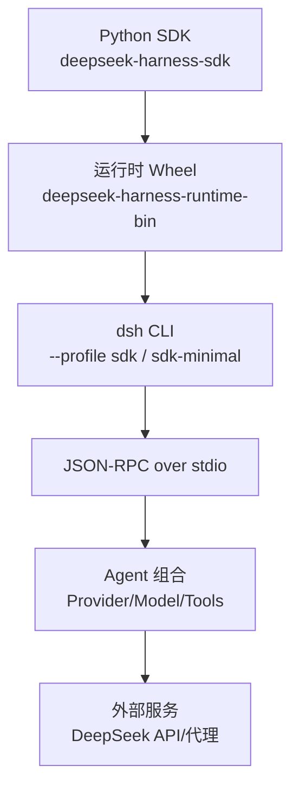
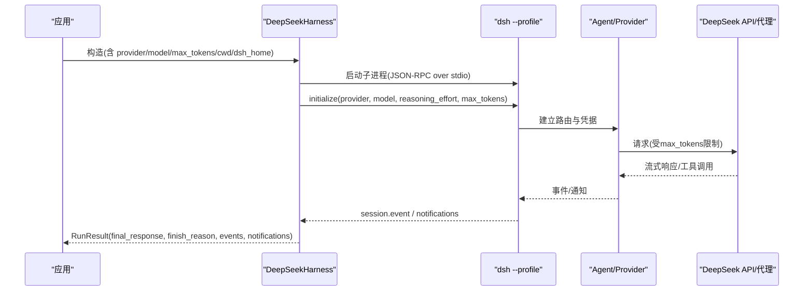
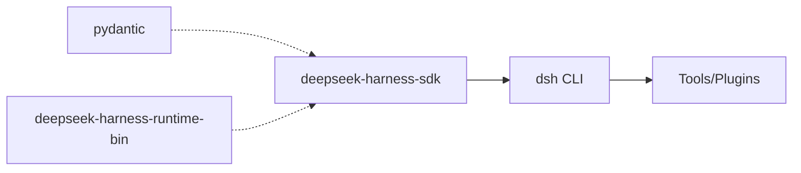

# SDK开发

<cite>
**本文引用的文件**
- [python/sdk/README.md](file://python/sdk/README.md)
- [python/sdk/README.zh.md](file://python/sdk/README.zh.md)
- [python/sdk/pyproject.toml](file://python/sdk/pyproject.toml)
- [python/sdk/examples/README.md](file://python/sdk/examples/README.md)
- [python/sdk/examples/README.zh.md](file://python/sdk/examples/README.zh.md)
- [python/sdk/examples/minimal.py](file://python/sdk/examples/minimal.py)
- [python/sdk-runtime/README.md](file://python/sdk-runtime/README.md)
- [docs/user/guide/python-sdk.md](file://docs/user/guide/python-sdk.md)
- [snapshots/sdk/text-turn/notifications.expected.jsonl](file://snapshots/sdk/text-turn/notifications.expected.jsonl)
</cite>

## 目录
1. [简介](#简介)
2. [项目结构](#项目结构)
3. [核心组件](#核心组件)
4. [架构总览](#架构总览)
5. [详细组件分析](#详细组件分析)
6. [依赖关系分析](#依赖关系分析)
7. [性能考虑](#性能考虑)
8. [故障排查指南](#故障排查指南)
9. [结论](#结论)
10. [附录](#附录)

## 简介
本文件面向使用 DeepSeek Harness Python SDK 的开发者，提供安装与配置、认证设置、主要 API（客户端初始化、会话管理、工具调用、事件处理）、完整示例、异步模式与错误处理最佳实践、性能优化建议、调试技巧，以及与其他语言 SDK 的对比与迁移指南。SDK 通过子进程启动内置 dsh CLI，以 JSON-RPC over stdio 与运行时通信；profile 负责 agent 组合、凭据、持久化、工具与关闭流程。

## 项目结构
Python SDK 由两部分组成：
- Python SDK 包：提供高层 API 与示例，依赖运行时 wheel。
- 运行时 wheel：打包 dsh CLI 及其闭包依赖，提供平台原生可执行文件与 sidecar。

图表来源
- [python/sdk/README.md:1-33](file://python/sdk/README.md#L1-L33)
- [python/sdk-runtime/README.md:1-24](file://python/sdk-runtime/README.md#L1-L24)

章节来源
- [python/sdk/README.md:1-33](file://python/sdk/README.md#L1-L33)
- [python/sdk-runtime/README.md:1-24](file://python/sdk-runtime/README.md#L1-L24)
- [python/sdk/pyproject.toml:1-38](file://python/sdk/pyproject.toml#L1-L38)

## 核心组件
- DeepSeekHarness：延迟启动并复用 dsh 子进程，封装 JSON-RPC 会话与生命周期管理。
- Session.run：发起一轮对话，返回 RunResult（包含最终响应、结束原因、事件与通知）。
- Profile 与插件：通过 dsh profile 与插件机制扩展工具、设置、凭据等。
- 运行时 wheel：提供 dsh 命令与平台相关二进制及 sidecar，无需系统 Node.js。

章节来源
- [python/sdk/README.md:11-68](file://python/sdk/README.md#L11-L68)
- [python/sdk-runtime/README.md:7-24](file://python/sdk-runtime/README.md#L7-L24)

## 架构总览
SDK 采用“Python 客户端 + 子进程运行时”的架构。Python 侧仅负责参数组装、JSON-RPC 消息与结果解析；真正的 agent 编排、工具执行、持久化与凭据管理在 dsh 进程中完成。

图表来源
- [python/sdk/README.md:11-33](file://python/sdk/README.md#L11-L33)
- [python/sdk-runtime/README.md:7-24](file://python/sdk-runtime/README.md#L7-L24)
- [docs/user/guide/python-sdk.md:81-106](file://docs/user/guide/python-sdk.md#L81-L106)

## 详细组件分析

### 安装与配置
- 安装 SDK：pip 安装 deepseek-harness-sdk，自动安装匹配的 deepseek-harness-runtime-bin。
- 环境变量与凭据：
  - DEEPSEEK_API_KEY：模型凭据。
  - DEEPSEEK_BASE_URL：兼容代理端点（可选）。
  - DSH_HOME：显式指定 Harness home，SDK 不会隐式读取 ~/.dsh。
- 工作目录：
  - cwd：agent workspace。
  - runtime_cwd：子进程工作目录（独立于 cwd）。
- 模型与推理：
  - provider：选择已注册的提供方路由。
  - model：模型 ID。
  - reasoning_effort：可选推理强度标识。
  - max_tokens：可选正整数输出 token 上限。

章节来源
- [python/sdk/README.md:1-33](file://python/sdk/README.md#L1-L33)
- [python/sdk/README.zh.md:1-33](file://python/sdk/README.zh.md#L1-L33)
- [docs/user/guide/python-sdk.md:15-55](file://docs/user/guide/python-sdk.md#L15-L55)

### 客户端初始化与会话管理
- 使用上下文管理器创建 DeepSeekHarness，延迟启动并复用子进程。
- 首次握手超时：initialize_timeout_seconds（默认 30 秒）。
- 普通轮次超时：request_timeout_seconds（未设置则无界）。
- run() 活动区间：从提示词进入持久 inbox 开始，到整个 agent 下一次 idle 结束。
- 返回 RunResult：
  - final_response：根会话最后提交的 assistant 文本。
  - finish_reason：最后一个 turn/end 的 kind（如 completed、max-tokens、error），无结束时为 None。
  - events：仅根会话事件。
  - notifications：根会话与已知后代的通知（按协议顺序）。

章节来源
- [python/sdk/README.md:33-68](file://python/sdk/README.md#L33-L68)
- [python/sdk/README.zh.md:33-68](file://python/sdk/README.zh.md#L33-L68)
- [docs/user/guide/python-sdk.md:81-106](file://docs/user/guide/python-sdk.md#L81-L106)

### 工具调用与第三方集成
- 工具由 profile 暴露，例如 sdk-minimal 提供持久 bash/pwsh 与 str_replace_editor。
- 插件可通过 dsh plugin 安装到 profile，修改 cordis.patch.yml 实现持久化。
- 第三方服务通过 Provider/Adapter 接入，可在自定义组合中挂载 llm-pi-ai 等并提供凭据与端点。

章节来源
- [python/sdk/examples/README.md:22-29](file://python/sdk/examples/README.md#L22-L29)
- [python/sdk/examples/README.zh.md:22-29](file://python/sdk/examples/README.zh.md#L22-L29)
- [python/sdk/README.md:35-62](file://python/sdk/README.md#L35-L62)
- [python/sdk/README.zh.md:35-62](file://python/sdk/README.zh.md#L35-L62)

### 事件处理
- 事件类型包括 assistant/chunk、usage、finish 等，按协议顺序推送。
- RunResult.events 仅包含根会话事件；notifications 包含根会话与已知后代。
- 低层 session_prompt() 立即返回排队消息 id，绕过 run() 需自行管理活动边界。

章节来源
- [python/sdk/README.md:64-68](file://python/sdk/README.md#L64-L68)
- [python/sdk/README.zh.md:64-68](file://python/sdk/README.zh.md#L64-L68)
- [snapshots/sdk/text-turn/notifications.expected.jsonl:37-40](file://snapshots/sdk/text-turn/notifications.expected.jsonl#L37-L40)

### 完整示例
- 运行最小示例：导出凭据，指定 dsh_home 与 workspace，传入会话 id 与提示。
- 在程序中直接使用 DeepSeekHarness 上下文管理器，run() 获取最终响应。

章节来源
- [python/sdk/examples/README.md:7-20](file://python/sdk/examples/README.md#L7-L20)
- [python/sdk/examples/README.zh.md:7-20](file://python/sdk/examples/README.zh.md#L7-L20)
- [python/sdk/examples/minimal.py](file://python/sdk/examples/minimal.py)
- [docs/user/guide/python-sdk.md:57-77](file://docs/user/guide/python-sdk.md#L57-L77)
- [docs/user/guide/python-sdk.md:81-106](file://docs/user/guide/python-sdk.md#L81-L106)

### 异步编程模式
- 当前文档未提供明确的异步 API；SDK 通过子进程并发处理 JSON-RPC 请求。
- 若需并发，建议在 Python 侧使用线程或进程池并行调用多个 harness 实例，或在同一 harness 内注意请求调度与超时策略。

[本节为概念性说明，不直接分析具体文件]

### 错误处理最佳实践
- 超时：合理设置 initialize_timeout_seconds 与 request_timeout_seconds。
- 协议错误：缺少 data.reason.kind 的 turn/end 会抛出 SdkProtocolError。
- 配置错误：缺失适配器、不可用模型或不支持的推理强度会在初始化阶段拒绝。
- 凭据与端点：确保 DEEPSEEK_API_KEY 与可选 DEEPSEEK_BASE_URL 正确设置。

章节来源
- [python/sdk/README.md:33-68](file://python/sdk/README.md#L33-L68)
- [python/sdk/README.zh.md:33-68](file://python/sdk/README.zh.md#L33-L68)

## 依赖关系分析
- Python SDK 依赖 pydantic 与 deepseek-harness-runtime-bin。
- 运行时 wheel 提供 dsh 命令与平台相关可执行文件，无需系统 Node.js。
- 示例与教程引用 minimal.py 与 sdk-minimal profile。

图表来源
- [python/sdk/pyproject.toml:1-38](file://python/sdk/pyproject.toml#L1-L38)
- [python/sdk-runtime/README.md:7-24](file://python/sdk-runtime/README.md#L7-L24)

章节来源
- [python/sdk/pyproject.toml:1-38](file://python/sdk/pyproject.toml#L1-L38)
- [python/sdk-runtime/README.md:7-24](file://python/sdk-runtime/README.md#L7-L24)

## 性能考虑
- 模型输出上限：通过 max_tokens 控制根 agent 及其进程内后代的每次请求输出 token 数。
- 超时策略：为初始化与普通轮次分别设置超时，避免长时间阻塞。
- 会话隔离：不同任务使用不同的 dsh_home 与 session_id，避免资源竞争与状态污染。
- 工具与插件：按需启用必要工具，减少不必要的 I/O 与网络开销。
- 日志与诊断：利用运行时保留的诊断信息定位问题。

章节来源
- [python/sdk/README.md:33-62](file://python/sdk/README.md#L33-L62)
- [python/sdk/README.zh.md:33-62](file://python/sdk/README.zh.md#L33-L62)

## 故障排查指南
- 无法找到 dsh 或 DSH_HOME：确保已安装运行时 wheel，并显式设置 DSH_HOME。
- 凭据无效：检查 DEEPSEEK_API_KEY 与可选 DEEPSEEK_BASE_URL。
- 模型不可用或推理强度不受支持：确认 provider/model/reasoning_effort 配置。
- 事件异常：关注 notifications 与 events，核对协议字段是否完整。
- 工具权限：sdk-minimal 的 PTY 与 editor 具有较高权限，应在一次性环境或容器中运行。

章节来源
- [python/sdk-runtime/README.md:7-24](file://python/sdk-runtime/README.md#L7-L24)
- [python/sdk/examples/README.md:22-29](file://python/sdk/examples/README.md#L22-L29)
- [python/sdk/examples/README.zh.md:22-29](file://python/sdk/examples/README.zh.md#L22-L29)
- [python/sdk/README.md:33-68](file://python/sdk/README.md#L33-L68)

## 结论
DeepSeek Harness Python SDK 通过简洁的高层 API 与稳定的子进程运行时，提供了易用的智能体驱动能力。借助 profile 与插件机制，开发者可以灵活扩展工具与服务；通过合理的超时、令牌限制与会话隔离，可获得稳定且高效的运行体验。

[本节为总结性内容，不直接分析具体文件]

## 附录

### 与其他语言 SDK 的对比与迁移
- TypeScript/JavaScript SDK：与 Python SDK 共享相同的初始化字段与 JSON-RPC 行为，均通过 dsh --profile sdk 提供服务。
- 迁移要点：
  - 保持 provider/model/reasoning_effort/max_tokens 一致。
  - 使用相同 dsh_home 与 session_id 可延续对话与资源。
  - 注意各语言 SDK 的事件与通知格式保持一致。

章节来源
- [.agents/notes/implemented/feature/2026-07-27-typescript-sdk-and-sdk-subagent-backend.md:20-20](file://.agents/notes/implemented/feature/2026-07-27-typescript-sdk-and-sdk-subagent-backend.md#L20-L20)
- [python/sdk/README.md:33-62](file://python/sdk/README.md#L33-L62)
- [python/sdk/README.zh.md:33-62](file://python/sdk/README.zh.md#L33-L62)