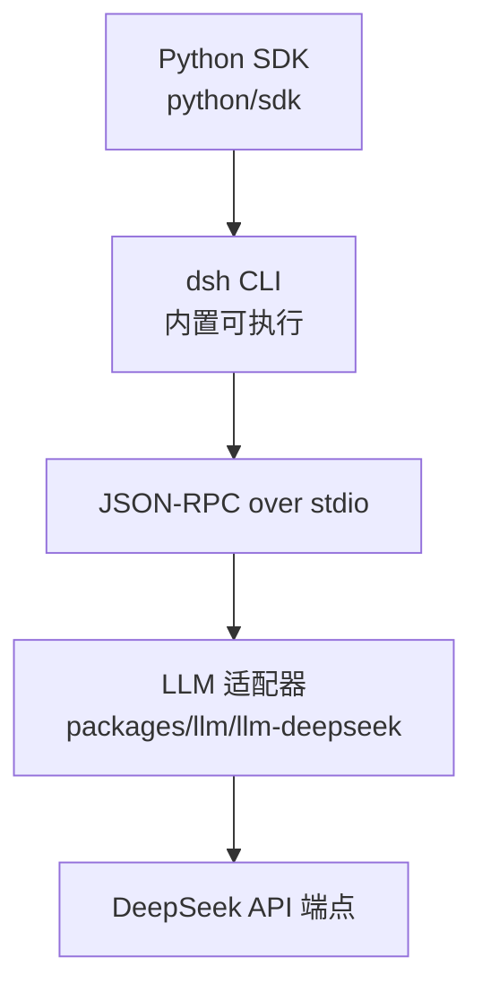
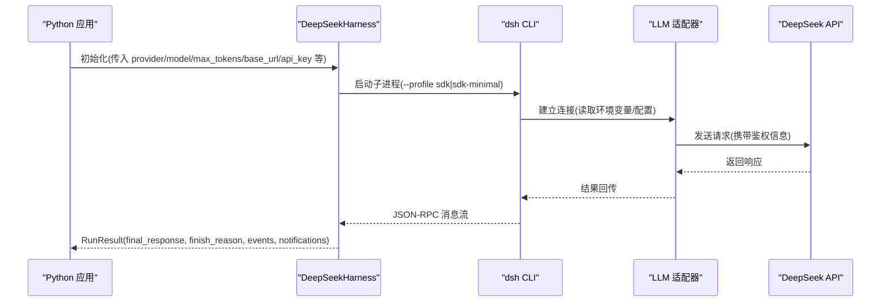
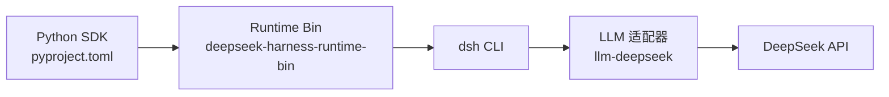

# 安装与配置

<cite>
**本文引用的文件**
- [python/sdk/pyproject.toml](file://python/sdk/pyproject.toml)
- [python/sdk/README.md](file://python/sdk/README.md)
- [python/sdk/README.zh.md](file://python/sdk/README.zh.md)
- [docs/user/guide/python-sdk.md](file://docs/user/guide/python-sdk.md)
- [packages/llm/llm-deepseek/src/index.ts](file://packages/llm/llm-deepseek/src/index.ts)
- [packages/web/web-search-deepseek/src/index.ts](file://packages/web/web-search-deepseek/src/index.ts)
- [python/sdk/examples/minimal.py](file://python/sdk/examples/minimal.py)
</cite>

## 目录
1. [简介](#简介)
2. [项目结构](#项目结构)
3. [核心组件](#核心组件)
4. [架构总览](#架构总览)
5. [详细组件分析](#详细组件分析)
6. [依赖关系分析](#依赖关系分析)
7. [性能注意事项](#性能注意事项)
8. [故障排查指南](#故障排查指南)
9. [结论](#结论)
10. [附录](#附录)

## 简介
本章节面向首次使用 DeepSeek Harness Python SDK 的开发者，提供从环境准备、安装到基础配置的完整说明。SDK 通过子进程方式启动内置的 dsh CLI，并以 JSON-RPC over stdio 与运行时通信；每次运行需显式指定 Harness home（DSH_HOME），并可通过环境变量或构造参数设置认证与端点。

## 项目结构
Python SDK 位于仓库的 python/sdk 目录，包含包定义、文档与示例程序；LLM 适配层在 packages/llm/llm-deepseek 中实现，负责解析 DEEPSEEK_BASE_URL 与 DEEPSEEK_API_KEY 等环境变量。

图表来源
- [python/sdk/README.md:11-33](file://python/sdk/README.md#L11-L33)
- [packages/llm/llm-deepseek/src/index.ts:198-203](file://packages/llm/llm-deepseek/src/index.ts#L198-L203)

章节来源
- [python/sdk/pyproject.toml:1-38](file://python/sdk/pyproject.toml#L1-L38)
- [python/sdk/README.md:1-33](file://python/sdk/README.md#L1-L33)
- [docs/user/guide/python-sdk.md:7-37](file://docs/user/guide/python-sdk.md#L7-L37)

## 核心组件
- DeepSeekHarness：Python 侧入口，延迟启动 dsh 子进程，复用运行时直至关闭；支持 provider、model、reasoning_effort、max_tokens、base_url、api_key、cwd、runtime_cwd、initialize_timeout_seconds、request_timeout_seconds、profile、patches、dsh_bin、dsh_home 等参数。
- dsh CLI：由 SDK 以 --profile sdk 或 sdk-minimal 启动，承载 JSON-RPC 服务、Agent 组合、凭据、工具与持久化。
- LLM 适配器：读取 DEEPSEEK_BASE_URL 与 DEEPSEEK_API_KEY，完成认证与请求路由。

章节来源
- [python/sdk/README.md:11-33](file://python/sdk/README.md#L11-L33)
- [python/sdk/README.zh.md:11-33](file://python/sdk/README.zh.md#L11-L33)
- [packages/llm/llm-deepseek/src/index.ts:198-203](file://packages/llm/llm-deepseek/src/index.ts#L198-L203)

## 架构总览
下图展示从 Python 调用到 LLM 请求的关键路径与环境变量生效顺序。

图表来源
- [python/sdk/README.md:11-33](file://python/sdk/README.md#L11-L33)
- [packages/llm/llm-deepseek/src/index.ts:198-203](file://packages/llm/llm-deepseek/src/index.ts#L198-L203)

## 详细组件分析

### 环境与依赖要求
- Python 版本：>= 3.10
- 平台：Linux x64/arm64、macOS arm64 (14+)、Windows x64
- 依赖：pydantic、deepseek-harness-runtime-bin（随 SDK 安装）
- 可选：Node.js/pnpm（仅用于插件管理命令，运行 SDK 不需要）

章节来源
- [docs/user/guide/python-sdk.md:7-14](file://docs/user/guide/python-sdk.md#L7-L14)
- [python/sdk/pyproject.toml:1-16](file://python/sdk/pyproject.toml#L1-L16)
- [python/sdk/README.md:35-45](file://python/sdk/README.md#L35-L45)

### 安装方法
- 直接安装发布包：pip install deepseek-harness-sdk
- 源码开发：克隆仓库后创建虚拟环境并安装 SDK；示例脚本可直接运行

章节来源
- [python/sdk/README.md:5-9](file://python/sdk/README.md#L5-L9)
- [docs/user/guide/python-sdk.md:15-37](file://docs/user/guide/python-sdk.md#L15-L37)

### 认证与端点配置
- 环境变量
  - DEEPSEEK_API_KEY：API 密钥
  - DEEPSEEK_BASE_URL：兼容端点地址（默认 https://api.deepseek.com）
- 代码覆盖
  - base_url、api_key 可在构造 DeepSeekHarness 时显式传入，覆盖子进程环境中的同名环境变量
- 优先级
  - 显式配置优先于环境变量；若均未提供则报错提示缺少凭据

章节来源
- [python/sdk/README.md:33-33](file://python/sdk/README.md#L33-L33)
- [python/sdk/README.zh.md:33-33](file://python/sdk/README.zh.md#L33-L33)
- [packages/llm/llm-deepseek/src/index.ts:198-203](file://packages/llm/llm-deepseek/src/index.ts#L198-L203)
- [packages/llm/llm-deepseek/src/index.ts:429-450](file://packages/llm/llm-deepseek/src/index.ts#L429-L450)

### DeepSeekHarness 关键参数说明
- provider：选择已注册的提供方路由（如 deepseek-official）
- model：模型 ID（例如 deepseek-v4-flash）
- reasoning_effort：可选，适配器自有标识符，省略时使用模型默认
- max_tokens：可选正整数，限制根 agent 及其进程内后代每次请求的输出 token 上限
- base_url / api_key：覆盖子进程环境的 DEEPSEEK_BASE_URL / DEEPSEEK_API_KEY
- cwd：agent 工作区；runtime_cwd：子进程工作目录（两者均转为绝对路径）
- initialize_timeout_seconds：首次握手超时（默认 30 秒）
- request_timeout_seconds：普通轮次超时（未设置时无限等待）
- profile：选择内置或自定义 profile（sdk、sdk-minimal 等）
- patches：按序注入的 patch 文件（绝对路径）
- dsh_bin：指定 dsh 可执行路径
- dsh_home：必须显式指定，SDK 不会自动发现 ~/.dsh

章节来源
- [python/sdk/README.md:11-33](file://python/sdk/README.md#L11-L33)
- [python/sdk/README.zh.md:11-33](file://python/sdk/README.zh.md#L11-L33)
- [python/sdk/examples/minimal.py:13-44](file://python/sdk/examples/minimal.py#L13-L44)

### 不同部署场景的配置示例

- 本地开发
  - 设置环境变量：DEEPSEEK_API_KEY、可选的 DEEPSEEK_BASE_URL
  - 使用 sdk-minimal profile 快速验证
  - 通过 --workspace 与 --dsh-home 隔离工作区与 home

  章节来源
  - [docs/user/guide/python-sdk.md:41-79](file://docs/user/guide/python-sdk.md#L41-L79)
  - [python/sdk/examples/minimal.py:13-44](file://python/sdk/examples/minimal.py#L13-L44)

- 生产环境
  - 固定 provider 与 model，设置合理的 max_tokens 与 request_timeout_seconds
  - 通过 base_url 指向受控网关或代理
  - 使用独立 dsh_home 隔离会话与凭据
  - 如需插件扩展，提前通过 dsh plugin 安装并固化到 profile

  章节来源
  - [python/sdk/README.md:35-62](file://python/sdk/README.md#L35-L62)
  - [python/sdk/README.zh.md:35-62](file://python/sdk/README.zh.md#L35-L62)

- 容器化部署
  - 将 DSH_HOME 挂载为卷，保证会话与配置持久化
  - 通过环境变量注入 DEEPSEEK_API_KEY 与 DEEPSEEK_BASE_URL
  - 使用最小镜像仅安装 SDK 与必要系统库；无需 Node.js

  章节来源
  - [docs/user/guide/python-sdk.md:7-14](file://docs/user/guide/python-sdk.md#L7-L14)
  - [python/sdk/README.md:35-45](file://python/sdk/README.md#L35-L45)

### 结果与通知
- run() 返回 RunResult，包含 final_response、finish_reason、events、notifications
- finish_reason 可为 completed、max-tokens、error 等；无轮次结束时为 None
- 事件与通知区分根会话与子 agent 输出

章节来源
- [python/sdk/README.md:64-70](file://python/sdk/README.md#L64-L70)
- [python/sdk/README.zh.md:64-70](file://python/sdk/README.zh.md#L64-L70)

## 依赖关系分析
- 包依赖：pydantic、deepseek-harness-runtime-bin（同版本 wheel）
- 运行时依赖：dsh CLI（随 wheel 提供）、JSON-RPC 通道
- 外部依赖：DeepSeek API（通过 DEEPSEEK_BASE_URL 与 DEEPSEEK_API_KEY 访问）

图表来源
- [python/sdk/pyproject.toml:1-16](file://python/sdk/pyproject.toml#L1-L16)
- [packages/llm/llm-deepseek/src/index.ts:198-203](file://packages/llm/llm-deepseek/src/index.ts#L198-L203)

章节来源
- [python/sdk/pyproject.toml:1-38](file://python/sdk/pyproject.toml#L1-L38)

## 性能注意事项
- 合理设置 max_tokens：避免过长输出导致延迟与成本上升
- 控制 request_timeout_seconds：对长任务适当放宽，短任务收紧以避免阻塞
- 复用 harness：上下文管理器退出前会复用同一运行时进程，减少启动开销
- 压缩摘要：由压缩插件单独配置上限，注意与 max_tokens 的协同

章节来源
- [python/sdk/README.md:11-33](file://python/sdk/README.md#L11-L33)
- [python/sdk/README.md:60-62](file://python/sdk/README.md#L60-L62)

## 故障排查指南
- 缺少 API Key
  - 现象：初始化时报错提示缺少凭据
  - 处理：设置 DEEPSEEK_API_KEY，或通过 credentials 服务写入；也可在构造时传入 api_key
- 端点不正确
  - 现象：请求失败或无法连接
  - 处理：检查 DEEPSEEK_BASE_URL；必要时通过 base_url 覆盖
- 找不到 dsh 或 profile 错误
  - 现象：启动失败或初始化失败
  - 处理：确认 dsh_bin 正确；确保所选 profile 包含 JSON-RPC 服务器行；使用 sdk 或 sdk-minimal
- 工作区与 home 未隔离
  - 现象：会话污染或权限问题
  - 处理：为每次运行指定独立的 dsh_home 与 workspace；避免使用 ~/.dsh
- 超时问题
  - 现象：握手或请求超时
  - 处理：调整 initialize_timeout_seconds 与 request_timeout_seconds；检查网络与端点可达性

章节来源
- [packages/llm/llm-deepseek/src/index.ts:429-450](file://packages/llm/llm-deepseek/src/index.ts#L429-L450)
- [python/sdk/README.md:11-33](file://python/sdk/README.md#L11-L33)
- [python/sdk/README.md:35-62](file://python/sdk/README.md#L35-L62)

## 结论
通过显式指定 dsh_home、合理配置 provider/model/max_tokens 与认证信息，并结合 profile 与补丁机制，可以在本地、生产与容器环境中稳定使用 DeepSeek Harness Python SDK。遵循最佳实践可有效提升稳定性与可维护性。

## 附录

### 环境变量速查
- DEEPSEEK_API_KEY：API 密钥
- DEEPSEEK_BASE_URL：兼容端点地址（默认 https://api.deepseek.com）
- DSH_HOME：必须显式指定的 Harness home

章节来源
- [docs/user/guide/python-sdk.md:41-55](file://docs/user/guide/python-sdk.md#L41-L55)
- [packages/llm/llm-deepseek/src/index.ts:198-203](file://packages/llm/llm-deepseek/src/index.ts#L198-L203)

### 常用命令行参考
- 安装 SDK：pip install deepseek-harness-sdk
- 运行示例：python python/sdk/examples/minimal.py --workspace <path> --dsh-home <path> --session-id <id> "<prompt>"

章节来源
- [python/sdk/README.md:5-9](file://python/sdk/README.md#L5-L9)
- [docs/user/guide/python-sdk.md:57-79](file://docs/user/guide/python-sdk.md#L57-L79)
- [python/sdk/examples/minimal.py:13-44](file://python/sdk/examples/minimal.py#L13-L44)