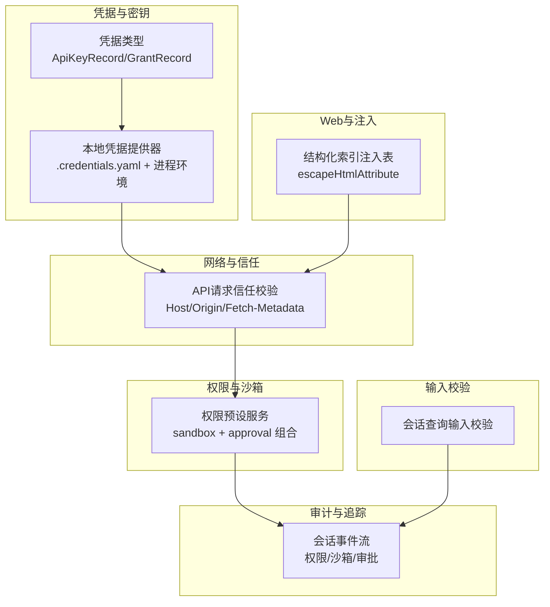
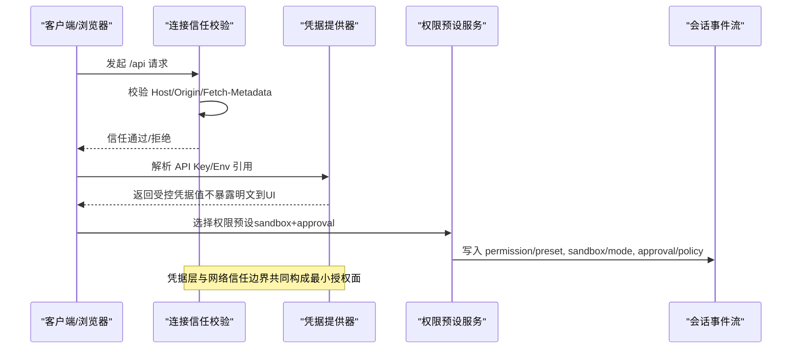
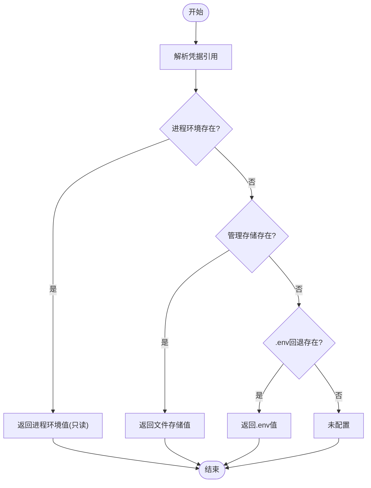
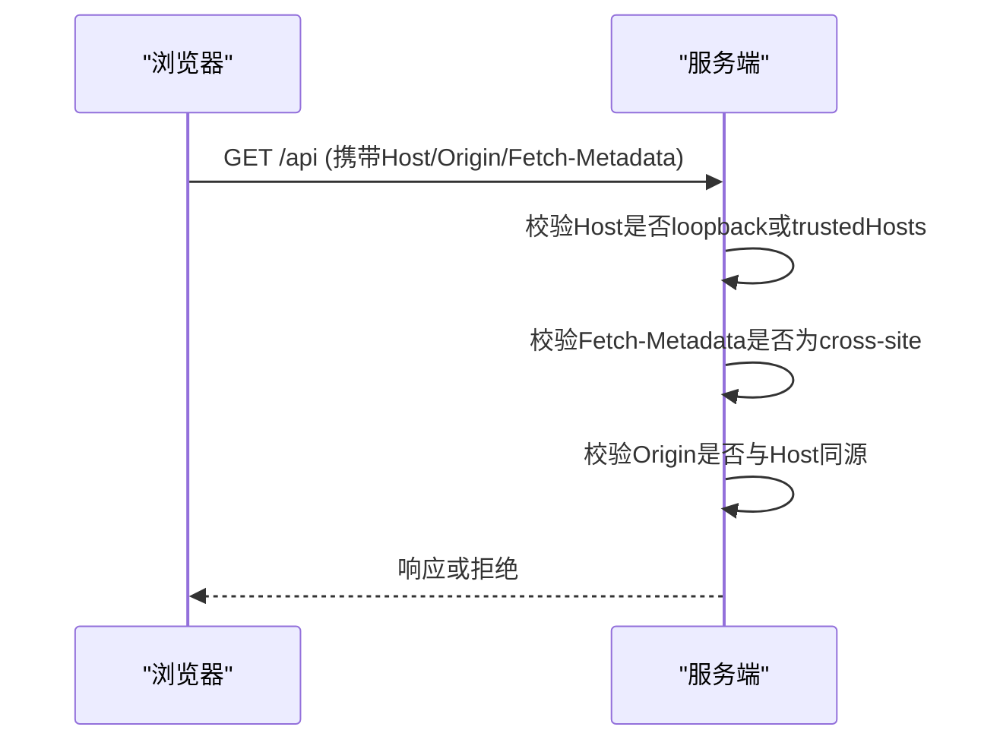
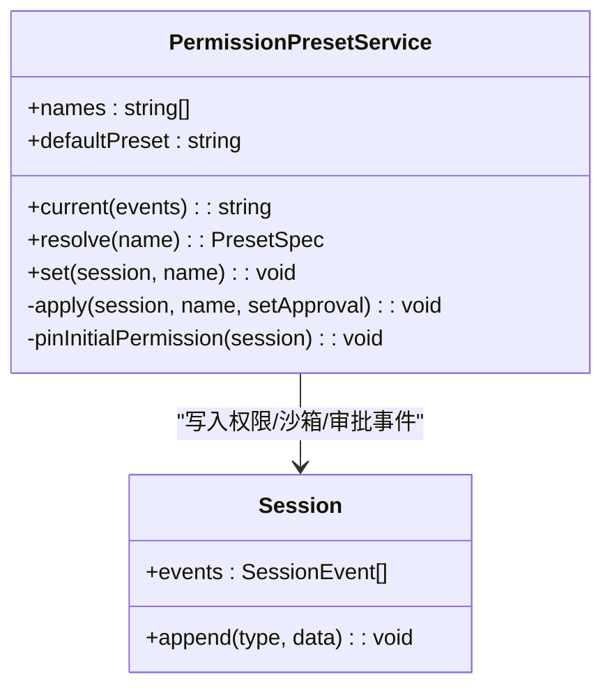
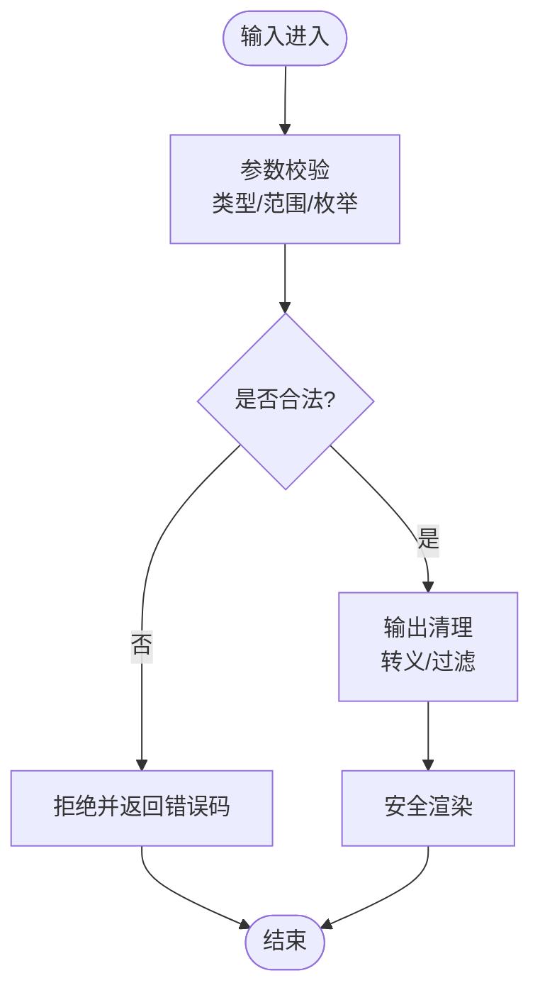
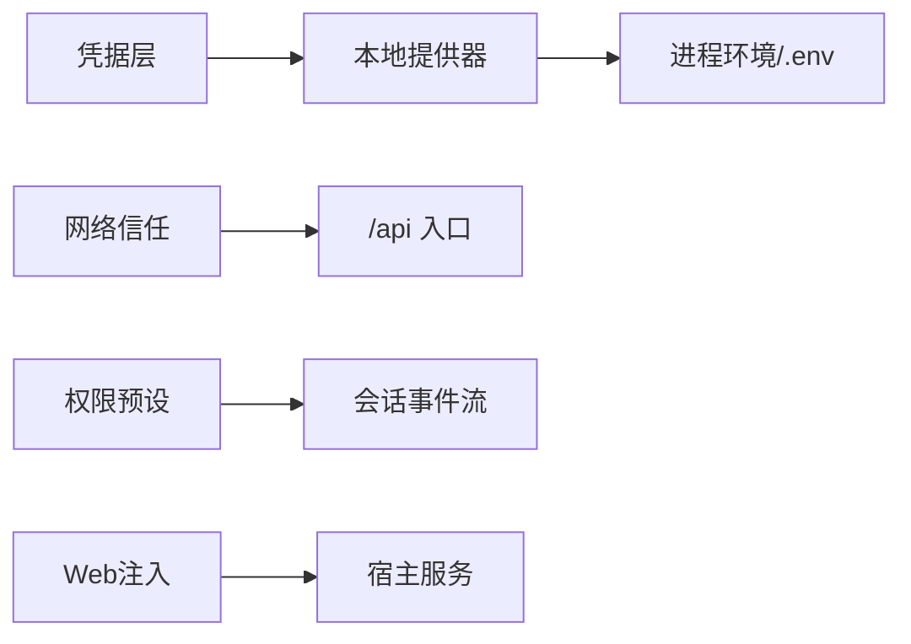

# 安全考虑与防护

<cite>
**本文引用的文件**
- [packages/credentials/credentials/src/types.ts](file://packages/credentials/credentials/src/types.ts)
- [packages/credentials/credentials-local/src/index.ts](file://packages/credentials/credentials-local/src/index.ts)
- [packages/client/connection/src/api-request-trust.ts](file://packages/client/connection/src/api-request-trust.ts)
- [packages/client/connection/tests/api-request-trust.host.spec.ts](file://packages/client/connection/tests/api-request-trust.host.spec.ts)
- [packages/interaction/permission-presets/src/index.ts](file://packages/interaction/permission-presets/src/index.ts)
- [scripts/verify-config-source-ownership.ts](file://scripts/verify-config-source-ownership.ts)
- [.agents/notes/implemented/architecture/2026-08-19-web-index-injection-table.md](file://.agents/notes/implemented/architecture/2026-08-19-web-index-injection-table.md)
- [packages/host/webserver/src/injections.ts](file://packages/host/webserver/src/injections.ts)
- [packages/session-query/tool-session-query/tests/tool-session-query.spec.ts](file://packages/session-query/tool-session-query/tests/tool-session-query.spec.ts)
- [snapshots/sdk/subagent-report/session.1.jsonl](file://snapshots/sdk/subagent-report/session.1.jsonl)
- [snapshots/session/hook-codex-posttool-context/session.jsonl](file://snapshots/session/hook-codex-posttool-context/session.jsonl)
</cite>

## 目录
1. [简介](#简介)
2. [项目结构](#项目结构)
3. [核心组件](#核心组件)
4. [架构总览](#架构总览)
5. [详细组件分析](#详细组件分析)
6. [依赖关系分析](#依赖关系分析)
7. [性能与安全权衡](#性能与安全权衡)
8. [故障排查指南](#故障排查指南)
9. [结论](#结论)
10. [附录](#附录)

## 简介
本指南面向DeepSeek Harness SDK的安全最佳实践，聚焦以下方面：
- 敏感信息保护：API密钥管理、环境变量分层、配置文件加密与权限控制
- 权限控制机制：细粒度访问控制、角色化预设、会话隔离
- 输入验证与输出清理：防止注入攻击与数据泄露
- 网络安全：HTTPS/TLS、证书校验、传输加密与可信主机策略
- 安全审计与漏洞检测：日志、事件追踪、定期评估与应急响应流程

本指南基于仓库中已实现的安全能力进行提炼与组织，帮助开发者在集成与扩展时遵循一致的安全边界。

## 项目结构
与“安全考虑与防护”直接相关的代码分布在以下模块：
- 凭据与密钥管理：凭据类型定义与本地文件提供者（YAML存储、进程环境覆盖）
- 网络信任边界：浏览器端对/api请求的Host/Origin/Fetch-Metadata校验
- 权限与沙箱：权限预设服务将沙箱模式与审批策略绑定为可切换的“角色”
- 配置来源治理：禁止在 shipped 配置中内联环境变量，强制通过凭据层解析
- Web注入安全：结构化索引注入表，避免字符串拼接导致的XSS风险
- 输入校验：工具查询参数严格校验，拒绝非法值
- 审计与追踪：会话事件流记录权限、沙箱、审批等关键决策点

**图表来源**
- [packages/credentials/credentials/src/types.ts:31-60](file://packages/credentials/credentials/src/types.ts#L31-L60)
- [packages/credentials/credentials-local/src/index.ts:1-36](file://packages/credentials/credentials-local/src/index.ts#L1-L36)
- [packages/client/connection/src/api-request-trust.ts:1-14](file://packages/client/connection/src/api-request-trust.ts#L1-L14)
- [packages/interaction/permission-presets/src/index.ts:1-11](file://packages/interaction/permission-presets/src/index.ts#L1-L11)
- [packages/host/webserver/src/injections.ts:42-76](file://packages/host/webserver/src/injections.ts#L42-L76)
- [packages/session-query/tool-session-query/tests/tool-session-query.spec.ts:332-350](file://packages/session-query/tool-session-query/tests/tool-session-query.spec.ts#L332-L350)
- [snapshots/sdk/subagent-report/session.1.jsonl:1-7](file://snapshots/sdk/subagent-report/session.1.jsonl#L1-L7)

**章节来源**
- [packages/credentials/credentials/src/types.ts:31-60](file://packages/credentials/credentials/src/types.ts#L31-L60)
- [packages/credentials/credentials-local/src/index.ts:1-36](file://packages/credentials/credentials-local/src/index.ts#L1-L36)
- [packages/client/connection/src/api-request-trust.ts:1-14](file://packages/client/connection/src/api-request-trust.ts#L1-L14)
- [packages/interaction/permission-presets/src/index.ts:1-11](file://packages/interaction/permission-presets/src/index.ts#L1-L11)
- [packages/host/webserver/src/injections.ts:42-76](file://packages/host/webserver/src/injections.ts#L42-L76)
- [packages/session-query/tool-session-query/tests/tool-session-query.spec.ts:332-350](file://packages/session-query/tool-session-query/tests/tool-session-query.spec.ts#L332-L350)
- [snapshots/sdk/subagent-report/session.1.jsonl:1-7](file://snapshots/sdk/subagent-report/session.1.jsonl#L1-L7)

## 核心组件
- 凭据模型与存储
  - 支持两类凭据记录：API Key 与 Grant（由所有者插件解释），以及引用与描述视图，便于跨进程/远程安全暴露元信息而不泄露值
  - 本地提供器以 $DSH_HOME/.credentials.yaml 为主存储，叠加进程环境（只读且最高优先级）、项目.env与用户.env作为回退；写入采用原子写与跨进程文件锁，确保并发安全与最小权限（文件mode 0600）
- 网络信任边界
  - 对每个/api请求执行Host/Origin/Fetch-Metadata校验，防御DNS重绑定与跨站请求；仅允许loopback或配置的trustedHosts白名单
- 权限与沙箱
  - 将沙箱模式与审批策略打包为“权限预设”，可在会话级别切换并持久化到事件流；默认新会话自动填充缺失权限事实
- 配置来源治理
  - 通过脚本检查禁止在 shipped 配置中内联环境变量，强制通过凭据层与环境快照解析，避免绕过部署级安全策略
- Web注入安全
  - 使用结构化注入表与属性转义，避免字符串拼接HTML带来的XSS风险
- 输入校验
  - 会话查询工具对查询参数进行严格校验，拒绝非法值与越界范围

**章节来源**
- [packages/credentials/credentials/src/types.ts:31-60](file://packages/credentials/credentials/src/types.ts#L31-L60)
- [packages/credentials/credentials-local/src/index.ts:96-146](file://packages/credentials/credentials-local/src/index.ts#L96-L146)
- [packages/client/connection/src/api-request-trust.ts:85-118](file://packages/client/connection/src/api-request-trust.ts#L85-L118)
- [packages/interaction/permission-presets/src/index.ts:410-449](file://packages/interaction/permission-presets/src/index.ts#L410-L449)
- [scripts/verify-config-source-ownership.ts:24-55](file://scripts/verify-config-source-ownership.ts#L24-L55)
- [packages/host/webserver/src/injections.ts:42-76](file://packages/host/webserver/src/injections.ts#L42-L76)
- [packages/session-query/tool-session-query/tests/tool-session-query.spec.ts:332-350](file://packages/session-query/tool-session-query/tests/tool-session-query.spec.ts#L332-L350)

## 架构总览
下图展示了从凭据解析、网络信任校验到权限预设与审计事件的端到端安全链路：

**图表来源**
- [packages/client/connection/src/api-request-trust.ts:85-118](file://packages/client/connection/src/api-request-trust.ts#L85-L118)
- [packages/credentials/credentials-local/src/index.ts:617-639](file://packages/credentials/credentials-local/src/index.ts#L617-L639)
- [packages/interaction/permission-presets/src/index.ts:410-449](file://packages/interaction/permission-presets/src/index.ts#L410-L449)
- [snapshots/sdk/subagent-report/session.1.jsonl:1-7](file://snapshots/sdk/subagent-report/session.1.jsonl#L1-L7)

## 详细组件分析

### 凭据与密钥管理
- 设计要点
  - 区分“引用”和“记录”两个键空间，避免命名冲突与越权读取
  - 本地提供器按优先级解析：进程环境（只读）> 管理存储 > 项目.env > 用户.env
  - 写入路径使用原子写与跨进程文件锁，保证并发安全；文件权限限制为仅所有者可读
  - 解析阶段严格校验YAML结构与字段，拒绝未知字段与非法值，错误消息不包含敏感内容
- 建议实践
  - 生产环境优先使用进程环境注入密钥（CI/容器），避免落盘
  - 若需持久化，使用提供的YAML存储并设置严格文件权限
  - 不要在内联配置中硬编码密钥或端点，统一通过凭据层解析

**图表来源**
- [packages/credentials/credentials-local/src/index.ts:617-639](file://packages/credentials/credentials-local/src/index.ts#L617-L639)

**章节来源**
- [packages/credentials/credentials/src/types.ts:31-60](file://packages/credentials/credentials/src/types.ts#L31-L60)
- [packages/credentials/credentials-local/src/index.ts:96-146](file://packages/credentials/credentials-local/src/index.ts#L96-L146)
- [packages/credentials/credentials-local/src/index.ts:188-227](file://packages/credentials/credentials-local/src/index.ts#L188-L227)
- [packages/credentials/credentials-local/src/index.ts:617-639](file://packages/credentials/credentials-local/src/index.ts#L617-L639)

### 网络信任与传输安全
- 设计要点
  - 对所有/api请求执行Host/Origin/Fetch-Metadata校验，防御DNS重绑定与跨站请求
  - trustedHosts仅接受裸authority（host或host:port），拒绝路径、用户信息、非规范化形式
  - 当前Connection避免在每个请求上访问凭据提供方，降低侧信道风险
- 建议实践
  - 部署时明确配置trustedHosts，仅包含预期域名/端口
  - 对外暴露服务时启用HTTPS，并在网关层校验TLS证书链与SNI
  - 对cookie等敏感状态，生产环境应启用Secure/HttpOnly/SameSite，并限制作用域

**图表来源**
- [packages/client/connection/src/api-request-trust.ts:85-118](file://packages/client/connection/src/api-request-trust.ts#L85-L118)
- [packages/client/connection/tests/api-request-trust.host.spec.ts:78-97](file://packages/client/connection/tests/api-request-trust.host.spec.ts#L78-L97)

**章节来源**
- [packages/client/connection/src/api-request-trust.ts:1-14](file://packages/client/connection/src/api-request-trust.ts#L1-L14)
- [packages/client/connection/src/api-request-trust.ts:35-53](file://packages/client/connection/src/api-request-trust.ts#L35-L53)
- [packages/client/connection/src/api-request-trust.ts:85-118](file://packages/client/connection/src/api-request-trust.ts#L85-L118)
- [packages/client/connection/tests/api-request-trust.host.spec.ts:78-97](file://packages/client/connection/tests/api-request-trust.host.spec.ts#L78-L97)

### 权限控制与角色授权
- 设计要点
  - 权限预设将沙箱模式与审批策略绑定为可切换的“角色”，如workspace-write、danger-full-access
  - 新会话创建时自动填充缺失权限事实，保证一致性
  - 所有权限变更通过事件流持久化，便于审计与回放
- 建议实践
  - 为不同用户/租户配置不同的默认预设，最小权限原则
  - 对高风险操作启用审批策略，结合沙箱限制文件系统与命令执行范围
  - 通过会话投影展示当前权限状态，便于前端提示与引导

**图表来源**
- [packages/interaction/permission-presets/src/index.ts:175-241](file://packages/interaction/permission-presets/src/index.ts#L175-L241)
- [packages/interaction/permission-presets/src/index.ts:410-449](file://packages/interaction/permission-presets/src/index.ts#L410-L449)

**章节来源**
- [packages/interaction/permission-presets/src/index.ts:1-11](file://packages/interaction/permission-presets/src/index.ts#L1-L11)
- [packages/interaction/permission-presets/src/index.ts:175-241](file://packages/interaction/permission-presets/src/index.ts#L175-L241)
- [packages/interaction/permission-presets/src/index.ts:410-449](file://packages/interaction/permission-presets/src/index.ts#L410-L449)
- [snapshots/sdk/subagent-report/session.1.jsonl:1-7](file://snapshots/sdk/subagent-report/session.1.jsonl#L1-L7)

### 输入验证与输出清理
- 设计要点
  - 会话查询工具对查询参数进行严格校验，拒绝空查询、非法枚举、越界数值与无效日期
  - Web注入采用结构化注入表与属性转义，避免字符串拼接导致的XSS风险
- 建议实践
  - 对所有外部输入执行白名单校验与范围检查
  - 输出到HTML/JS上下文前进行转义，避免注入
  - 对富文本渲染使用安全的DOM API或框架内置转义

**图表来源**
- [packages/session-query/tool-session-query/tests/tool-session-query.spec.ts:332-350](file://packages/session-query/tool-session-query/tests/tool-session-query.spec.ts#L332-L350)
- [packages/host/webserver/src/injections.ts:42-76](file://packages/host/webserver/src/injections.ts#L42-L76)

**章节来源**
- [packages/session-query/tool-session-query/tests/tool-session-query.spec.ts:332-350](file://packages/session-query/tool-session-query/tests/tool-session-query.spec.ts#L332-L350)
- [packages/host/webserver/src/injections.ts:42-76](file://packages/host/webserver/src/injections.ts#L42-L76)
- [.agents/notes/implemented/architecture/2026-08-19-web-index-injection-table.md:1-13](file://.agents/notes/implemented/architecture/2026-08-19-web-index-injection-table.md#L1-L13)

### 配置来源治理与密钥保护
- 设计要点
  - 通过脚本检查禁止在 shipped 配置中内联环境变量，强制通过凭据层与环境快照解析
  - 本地凭据提供器对YAML文档进行严格解析与版本迁移，错误消息不包含敏感内容
- 建议实践
  - 在CI中加入配置来源检查，阻止违规提交
  - 对敏感配置使用外部密钥管理服务（KMS/Vault），运行时注入进程环境
  - 对落盘凭据文件实施最小权限与加密存储（操作系统级或磁盘加密）

**章节来源**
- [scripts/verify-config-source-ownership.ts:24-55](file://scripts/verify-config-source-ownership.ts#L24-L55)
- [packages/credentials/credentials-local/src/index.ts:188-227](file://packages/credentials/credentials-local/src/index.ts#L188-L227)

### 审计与事件追踪
- 设计要点
  - 会话事件流记录权限预设、沙箱模式、审批策略等关键决策点，支持回放与审计
  - 钩子与工具调用结果可被审计日志捕获，便于事后分析与合规检查
- 建议实践
  - 将关键事件导出至集中式日志系统，建立告警规则
  - 定期抽样回放会话事件，验证权限与沙箱策略是否符合预期
  - 对异常行为（如频繁拒绝、越权尝试）建立监控与响应流程

**章节来源**
- [snapshots/sdk/subagent-report/session.1.jsonl:1-7](file://snapshots/sdk/subagent-report/session.1.jsonl#L1-L7)
- [snapshots/session/hook-codex-posttool-context/session.jsonl:24-32](file://snapshots/session/hook-codex-posttool-context/session.jsonl#L24-L32)

## 依赖关系分析
- 凭据层依赖本地文件提供器，后者依赖进程环境与.env回退
- 网络信任校验独立于凭据层，但共同作用于/api请求入口
- 权限预设服务依赖会话事件流，用于持久化与回放
- Web注入逻辑依赖宿主服务，通过结构化表注入安全标记

**图表来源**
- [packages/credentials/credentials-local/src/index.ts:1-36](file://packages/credentials/credentials-local/src/index.ts#L1-L36)
- [packages/client/connection/src/api-request-trust.ts:85-118](file://packages/client/connection/src/api-request-trust.ts#L85-L118)
- [packages/interaction/permission-presets/src/index.ts:410-449](file://packages/interaction/permission-presets/src/index.ts#L410-L449)
- [packages/host/webserver/src/injections.ts:42-76](file://packages/host/webserver/src/injections.ts#L42-L76)

**章节来源**
- [packages/credentials/credentials-local/src/index.ts:1-36](file://packages/credentials/credentials-local/src/index.ts#L1-L36)
- [packages/client/connection/src/api-request-trust.ts:85-118](file://packages/client/connection/src/api-request-trust.ts#L85-L118)
- [packages/interaction/permission-presets/src/index.ts:410-449](file://packages/interaction/permission-presets/src/index.ts#L410-L449)
- [packages/host/webserver/src/injections.ts:42-76](file://packages/host/webserver/src/injections.ts#L42-L76)

## 性能与安全权衡
- 凭据解析：进程环境优先减少I/O开销，但需确保环境变量安全注入
- 文件锁与原子写：保障并发安全，可能引入短暂等待，需合理设置超时
- 网络信任校验：轻量级头部检查，几乎无性能影响，但能显著降低攻击面
- 权限预设：事件追加开销小，便于审计与回放，但需控制事件规模
- Web注入：结构化注入比字符串拼接更安全，轻微增加构建/渲染开销

[本节为通用指导，无需特定文件来源]

## 故障排查指南
- 凭据无法解析
  - 检查进程环境是否覆盖了目标引用（只读且最高优先级）
  - 确认.credentials.yaml格式正确且权限为0600
  - 查看解析错误是否包含非法字段或值
- 网络请求被拒绝
  - 检查Host是否在trustedHosts白名单中
  - 确认Origin与Host同源，且Fetch-Metadata不为cross-site
- 权限预设未生效
  - 检查会话事件流中是否存在对应的permission/preset、sandbox/mode、approval/policy事件
  - 确认默认预设配置与组合默认值匹配
- 输入校验失败
  - 检查查询参数类型、范围与枚举值是否符合预期
  - 查看错误码定位具体校验失败点

**章节来源**
- [packages/credentials/credentials-local/src/index.ts:188-227](file://packages/credentials/credentials-local/src/index.ts#L188-L227)
- [packages/client/connection/src/api-request-trust.ts:85-118](file://packages/client/connection/src/api-request-trust.ts#L85-L118)
- [packages/interaction/permission-presets/src/index.ts:410-449](file://packages/interaction/permission-presets/src/index.ts#L410-L449)
- [packages/session-query/tool-session-query/tests/tool-session-query.spec.ts:332-350](file://packages/session-query/tool-session-query/tests/tool-session-query.spec.ts#L332-L350)

## 结论
DeepSeek Harness SDK在凭据管理、网络信任、权限控制、输入校验与审计追踪等方面提供了坚实的安全基础。建议在生产环境中：
- 优先使用进程环境注入密钥，避免落盘
- 严格配置trustedHosts与HTTPS/TLS
- 为不同角色分配最小权限预设
- 对所有输入进行白名单校验，输出进行安全转义
- 建立事件审计与监控告警机制，定期进行安全评估与应急演练

[本节为总结性内容，无需特定文件来源]

## 附录
- 相关文档与规范
  - 凭据类型与记录定义
  - 本地凭据提供器实现
  - API请求信任校验
  - 权限预设服务
  - 配置来源治理脚本
  - Web注入安全设计
  - 会话事件审计示例

[本节为参考列表，无需特定文件来源]