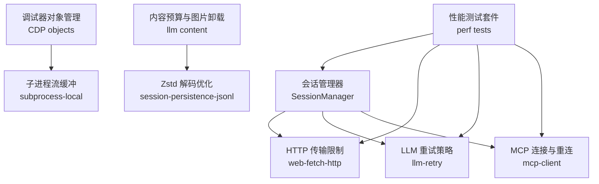
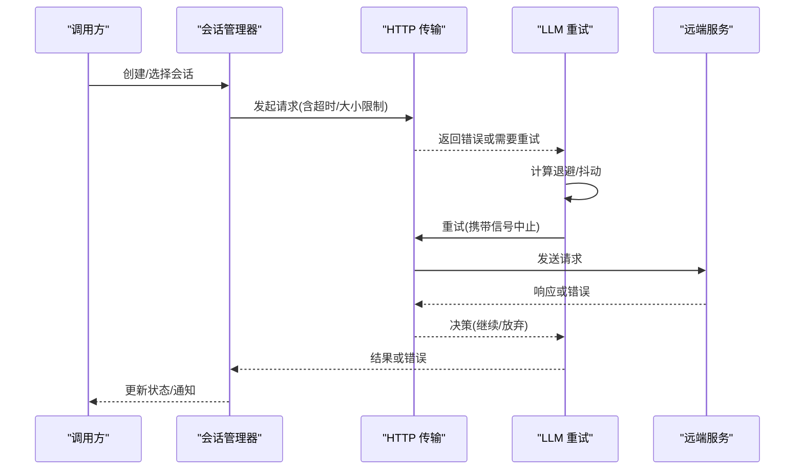
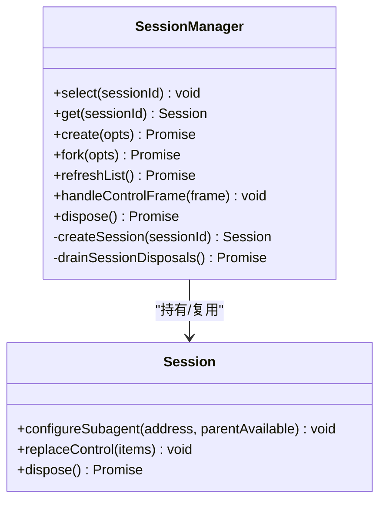
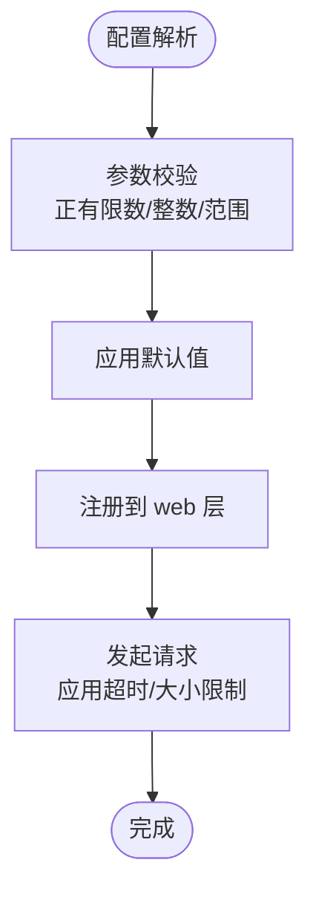
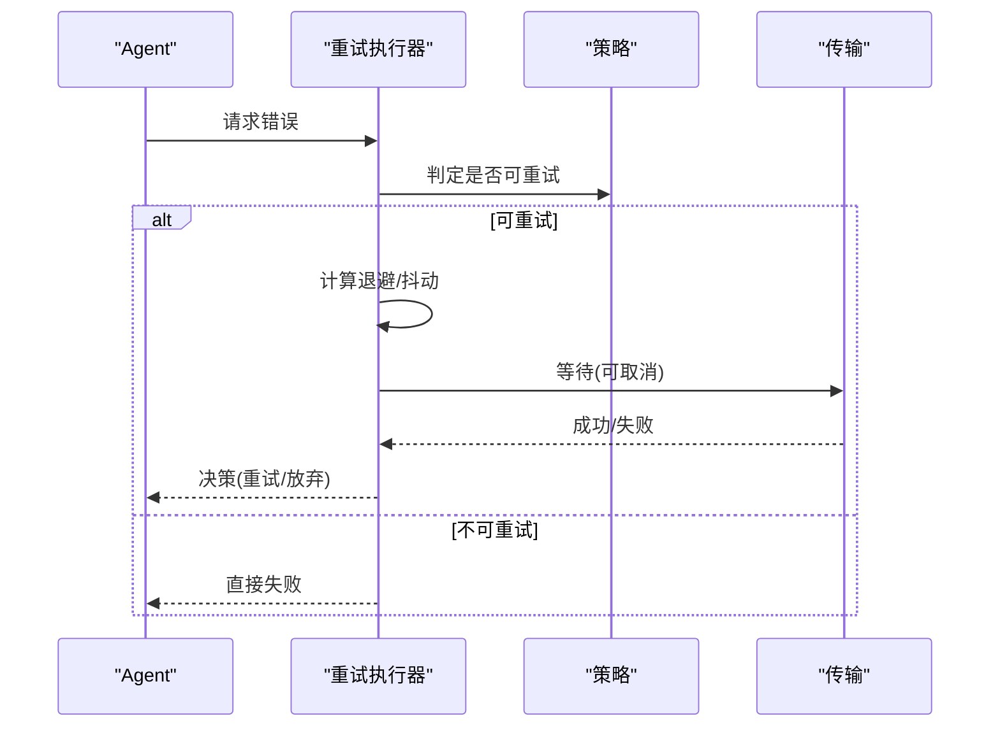
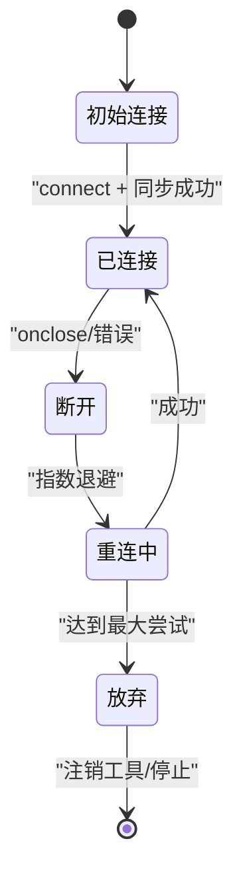
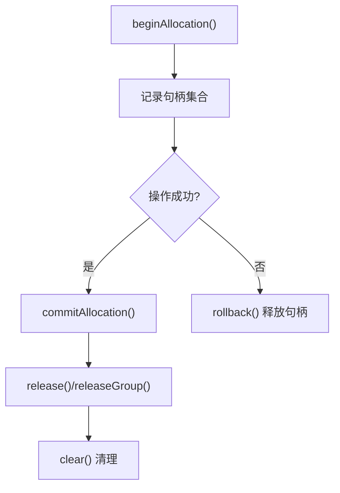
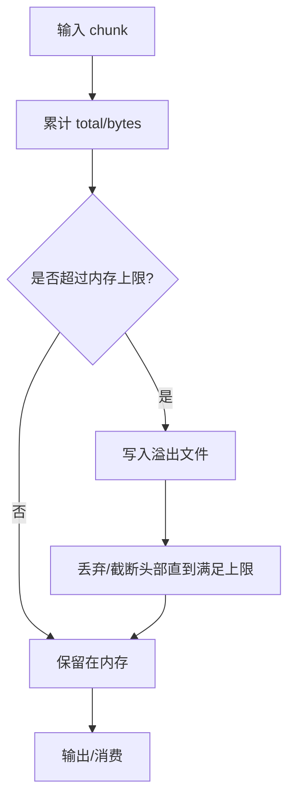
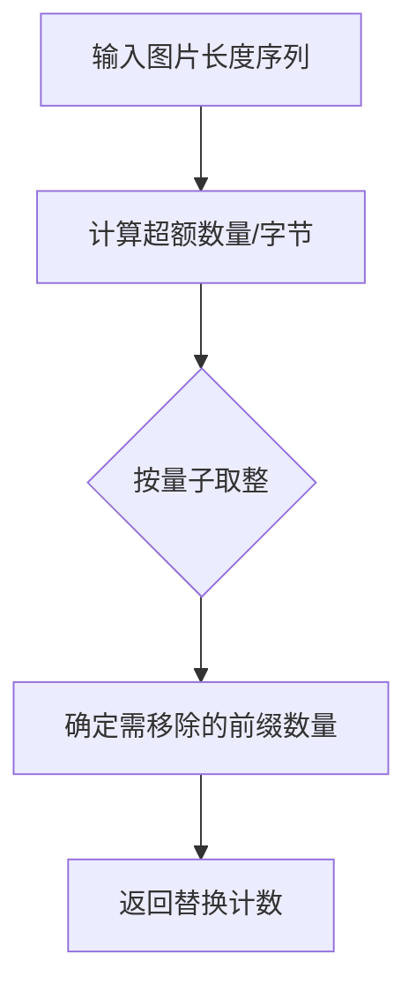
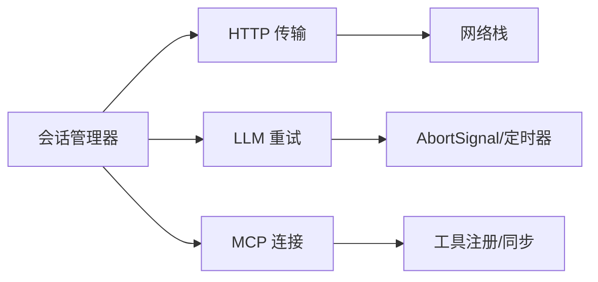

# 性能优化与资源管理

<cite>
**本文引用的文件**
- [packages/api/session-controller/src/client/sessions/manager.ts](file://packages/api/session-controller/src/client/sessions/manager.ts)
- [packages/web/web-fetch-http/src/index.ts](file://packages/web/web-fetch-http/src/index.ts)
- [packages/llm/llm-retry/src/index.ts](file://packages/llm/llm-retry/src/index.ts)
- [packages/mcp/mcp-client/src/connection.ts](file://packages/mcp/mcp-client/src/connection.ts)
- [packages/experimental/inspector/src/client/cdp/objects.ts](file://packages/experimental/inspector/src/client/cdp/objects.ts)
- [packages/subprocess/subprocess-local/src/spawn.ts](file://packages/subprocess/subprocess-local/src/spawn.ts)
- [packages/llm/llm/src/content.ts](file://packages/llm/llm/src/content.ts)
- [packages/session/session-persistence-jsonl/src/zstd-private-decoder.ts](file://packages/session/session-persistence-jsonl/src/zstd-private-decoder.ts)
- [apps/web/tests/complex-history.perf.ts](file://apps/web/tests/complex-history.perf.ts)
- [packages/client/ui-conversation/tests/history-transport.perf.client.ts](file://packages/client/ui-conversation/tests/history-transport.perf.client.ts)
- [vitest.web.perf.config.ts](file://vitest.web.perf.config.ts)
- [.agents/notes/implemented/architecture/2026-07-06-timeout-deadline-library.md](file://.agents/notes/implemented/architecture/2026-07-06-timeout-deadline-library.md)
</cite>

## 目录
1. [简介](#简介)
2. [项目结构](#项目结构)
3. [核心组件](#核心组件)
4. [架构总览](#架构总览)
5. [详细组件分析](#详细组件分析)
6. [依赖关系分析](#依赖关系分析)
7. [性能考量](#性能考量)
8. [故障排查指南](#故障排查指南)
9. [结论](#结论)
10. [附录](#附录)

## 简介
本指南面向DeepSeek Harness SDK的性能优化与资源管理，聚焦以下目标：
- 连接池管理与复用策略（客户端实例的创建、选择、销毁）
- 内存使用优化（大对象处理、垃圾回收调优、内存泄漏预防）
- 异步编程最佳实践（协程/事件循环、并发控制、任务调度）
- 超时设置与重试机制（避免阻塞与资源耗尽）
- 性能监控与调试工具（识别瓶颈、基准测试方法与分析）

## 项目结构
仓库采用多包架构，关键与性能相关的模块分布如下：
- 会话管理与列表视图：packages/api/session-controller
- HTTP 传输限制与超时：packages/web/web-fetch-http
- LLM 请求重试与退避：packages/llm/llm-retry
- MCP 客户端连接与重连：packages/mcp/mcp-client
- 调试器对象生命周期：packages/experimental/inspector
- 子进程流式输出与内存溢出保护：packages/subprocess/subprocess-local
- 内容预算与图片卸载：packages/llm/llm
- 持久化解码优化：packages/session/session-persistence-jsonl
- 性能测试与基准：apps/web/tests, packages/client/ui-conversation/tests, vitest.web.perf.config.ts

**图表来源**
- [packages/api/session-controller/src/client/sessions/manager.ts:92-143](file://packages/api/session-controller/src/client/sessions/manager.ts#L92-L143)
- [packages/web/web-fetch-http/src/index.ts:31-94](file://packages/web/web-fetch-http/src/index.ts#L31-L94)
- [packages/llm/llm-retry/src/index.ts:99-226](file://packages/llm/llm-retry/src/index.ts#L99-L226)
- [packages/mcp/mcp-client/src/connection.ts:123-351](file://packages/mcp/mcp-client/src/connection.ts#L123-L351)
- [packages/experimental/inspector/src/client/cdp/objects.ts:42-163](file://packages/experimental/inspector/src/client/cdp/objects.ts#L42-L163)
- [packages/subprocess/subprocess-local/src/spawn.ts:123-153](file://packages/subprocess/subprocess-local/src/spawn.ts#L123-L153)
- [packages/llm/llm/src/content.ts:232-263](file://packages/llm/llm/src/content.ts#L232-L263)
- [packages/session/session-persistence-jsonl/src/zstd-private-decoder.ts:33-94](file://packages/session/session-persistence-jsonl/src/zstd-private-decoder.ts#L33-L94)
- [apps/web/tests/complex-history.perf.ts:37-104](file://apps/web/tests/complex-history.perf.ts#L37-L104)
- [packages/client/ui-conversation/tests/history-transport.perf.client.ts:240-263](file://packages/client/ui-conversation/tests/history-transport.perf.client.ts#L240-L263)

**章节来源**
- [packages/api/session-controller/src/client/sessions/manager.ts:92-143](file://packages/api/session-controller/src/client/sessions/manager.ts#L92-L143)
- [packages/web/web-fetch-http/src/index.ts:31-94](file://packages/web/web-fetch-http/src/index.ts#L31-L94)
- [packages/llm/llm-retry/src/index.ts:99-226](file://packages/llm/llm-retry/src/index.ts#L99-L226)
- [packages/mcp/mcp-client/src/connection.ts:123-351](file://packages/mcp/mcp-client/src/connection.ts#L123-L351)
- [packages/experimental/inspector/src/client/cdp/objects.ts:42-163](file://packages/experimental/inspector/src/client/cdp/objects.ts#L42-L163)
- [packages/subprocess/subprocess-local/src/spawn.ts:123-153](file://packages/subprocess/subprocess-local/src/spawn.ts#L123-L153)
- [packages/llm/llm/src/content.ts:232-263](file://packages/llm/llm/src/content.ts#L232-L263)
- [packages/session/session-persistence-jsonl/src/zstd-private-decoder.ts:33-94](file://packages/session/session-persistence-jsonl/src/zstd-private-decoder.ts#L33-L94)
- [apps/web/tests/complex-history.perf.ts:37-104](file://apps/web/tests/complex-history.perf.ts#L37-L104)
- [packages/client/ui-conversation/tests/history-transport.perf.client.ts:240-263](file://packages/client/ui-conversation/tests/history-transport.perf.client.ts#L240-L263)

## 核心组件
- 会话管理器（SessionManager）：维护会话实例集合、队列与投影值存储；提供懒加载实例、批量刷新、控制帧合并与有序基线回放；负责实例创建、选择与销毁的生命周期。
- HTTP 传输限制（web-fetch-http）：配置响应大小、字符长度、超时与重定向上限，注册到 web 层作为统一 fetch 提供者。
- LLM 重试（llm-retry）：基于策略的指数退避与抖动，支持“always”模式与可重试错误码；通过事件记录重试过程并跟踪活跃操作。
- MCP 连接（mcp-client）：带稳定窗口的指数退避重连，工具同步串行化，失败后注销工具并停止；提供 ready/dispose 语义。
- 调试器对象管理（CDP objects）：对象句柄分组、分配追踪、释放与清理，防止跨会话泄露。
- 子进程流缓冲（subprocess-local）：内存窗口+溢出转储，保证尾部诊断信息完整且受控。
- 内容预算（llm content）：按数量/字节预算裁剪图片前缀，减少请求体积。
- Zstd 解码（session-persistence-jsonl）：利用私有流接口复用原生上下文，提升多帧解码性能。

**章节来源**
- [packages/api/session-controller/src/client/sessions/manager.ts:92-143](file://packages/api/session-controller/src/client/sessions/manager.ts#L92-L143)
- [packages/web/web-fetch-http/src/index.ts:31-94](file://packages/web/web-fetch-http/src/index.ts#L31-L94)
- [packages/llm/llm-retry/src/index.ts:99-226](file://packages/llm/llm-retry/src/index.ts#L99-L226)
- [packages/mcp/mcp-client/src/connection.ts:123-351](file://packages/mcp/mcp-client/src/connection.ts#L123-L351)
- [packages/experimental/inspector/src/client/cdp/objects.ts:42-163](file://packages/experimental/inspector/src/client/cdp/objects.ts#L42-L163)
- [packages/subprocess/subprocess-local/src/spawn.ts:123-153](file://packages/subprocess/subprocess-local/src/spawn.ts#L123-L153)
- [packages/llm/llm/src/content.ts:232-263](file://packages/llm/llm/src/content.ts#L232-L263)
- [packages/session/session-persistence-jsonl/src/zstd-private-decoder.ts:33-94](file://packages/session/session-persistence-jsonl/src/zstd-private-decoder.ts#L33-L94)

## 架构总览
下图展示从应用侧发起的请求如何经过会话管理器、HTTP 传输、重试策略与外部服务交互，并在异常时进行恢复与资源回收。

**图表来源**
- [packages/api/session-controller/src/client/sessions/manager.ts:285-314](file://packages/api/session-controller/src/client/sessions/manager.ts#L285-L314)
- [packages/web/web-fetch-http/src/index.ts:78-94](file://packages/web/web-fetch-http/src/index.ts#L78-L94)
- [packages/llm/llm-retry/src/index.ts:156-208](file://packages/llm/llm-retry/src/index.ts#L156-L208)

## 详细组件分析

### 会话管理器：连接池与实例生命周期
- 连接池与复用
  - 以 Map<SessionId, Session> 维护常驻实例，get() 懒创建，select() 切换当前会话并注入父代理地址与可用性。
  - 控制帧（baseline/projection/jobs/queue）合并为一致快照，避免重复渲染与状态漂移。
- 创建与销毁
  - createSession() 按需构造，dispose() 清理定时器并等待所有实例 teardown 完成。
  - drop() 移除实例并启动异步销毁流程，确保无悬挂监听与未决 Promise。
- 性能要点
  - 列表快照缓存与延迟重建，减少频繁变更导致的昂贵重算。
  - 投影值存储跨实例共享，冷标题无需打开会话即可显示。

**图表来源**
- [packages/api/session-controller/src/client/sessions/manager.ts:92-143](file://packages/api/session-controller/src/client/sessions/manager.ts#L92-L143)
- [packages/api/session-controller/src/client/sessions/manager.ts:285-314](file://packages/api/session-controller/src/client/sessions/manager.ts#L285-L314)
- [packages/api/session-controller/src/client/sessions/manager.ts:248-277](file://packages/api/session-controller/src/client/sessions/manager.ts#L248-L277)

**章节来源**
- [packages/api/session-controller/src/client/sessions/manager.ts:92-143](file://packages/api/session-controller/src/client/sessions/manager.ts#L92-L143)
- [packages/api/session-controller/src/client/sessions/manager.ts:248-277](file://packages/api/session-controller/src/client/sessions/manager.ts#L248-L277)
- [packages/api/session-controller/src/client/sessions/manager.ts:285-314](file://packages/api/session-controller/src/client/sessions/manager.ts#L285-L314)

### HTTP 传输限制与超时配置
- 配置项
  - maxResponseBytes、maxBodyChars、timeoutMs、maxRedirects、userAgent。
- 校验与默认值
  - 正有限数校验、Node 定时器上限检查、非负整数校验。
- 集成点
  - 通过 ctx.web.registerFetchProvider 注册为统一 fetch 提供者，集中管控网络资源。

**图表来源**
- [packages/web/web-fetch-http/src/index.ts:31-94](file://packages/web/web-fetch-http/src/index.ts#L31-L94)

**章节来源**
- [packages/web/web-fetch-http/src/index.ts:31-94](file://packages/web/web-fetch-http/src/index.ts#L31-L94)

### LLM 重试策略与退避
- 策略模式
  - “normal”模式：基于可重试错误码与最大重试次数；“always”模式：无条件重试下游决策。
  - 指数退避 + 抖动，支持 provider 提供的 Retry-After 优先。
- 可取消性
  - 使用 AbortSignal 组合上游取消与插件生命周期，避免悬挂定时器。
- 观测性
  - 通过 session.append('llm/retry', ...) 记录每次重试与开始时间，便于定位问题。

**图表来源**
- [packages/llm/llm-retry/src/index.ts:99-226](file://packages/llm/llm-retry/src/index.ts#L99-L226)

**章节来源**
- [packages/llm/llm-retry/src/index.ts:99-226](file://packages/llm/llm-retry/src/index.ts#L99-L226)

### MCP 连接与重连管理
- 重连策略
  - 指数退避，初始 delay 倍增至上限；超过稳定性窗口重置尝试计数。
  - 达到最大连续失败次数后注销工具并停止重连，需手动重启。
- 工具同步串行化
  - 通过 Promise 链串行化 syncTools，避免并发导致的双注销或泄漏。
- 生命周期
  - ready 表示首次尝试完成；dispose 关闭客户端、等待关闭信号、清理工具。

**图表来源**
- [packages/mcp/mcp-client/src/connection.ts:123-351](file://packages/mcp/mcp-client/src/connection.ts#L123-L351)

**章节来源**
- [packages/mcp/mcp-client/src/connection.ts:123-351](file://packages/mcp/mcp-client/src/connection.ts#L123-L351)

### 调试器对象生命周期与内存安全
- 对象组与句柄
  - 每个 DevTools 对象组维护句柄集合，支持 releaseGroup 批量释放。
- 分配追踪
  - beginAllocation/commitAllocation/rollback 用于一次操作的句柄归集与回滚。
- 内存泄漏预防
  - get/group/release 严格边界检查，避免跨会话暴露对象；clear 清空全局表。

**图表来源**
- [packages/experimental/inspector/src/client/cdp/objects.ts:42-163](file://packages/experimental/inspector/src/client/cdp/objects.ts#L42-L163)

**章节来源**
- [packages/experimental/inspector/src/client/cdp/objects.ts:42-163](file://packages/experimental/inspector/src/client/cdp/objects.ts#L42-L163)

### 子进程流缓冲与大对象处理
- 内存窗口
  - 维持最近 maxBytes 的 chunks，超出则丢弃头部或截断首块，保证尾部诊断信息完整。
- 溢出转储
  - 启用 spill 时，超阈值即打开文件句柄并将后续数据追加到磁盘，避免内存暴涨。
- 性能影响
  - 对长尾 stderr/stdout 场景尤为有效，降低 OOM 风险并保持诊断价值。

**图表来源**
- [packages/subprocess/subprocess-local/src/spawn.ts:123-153](file://packages/subprocess/subprocess-local/src/spawn.ts#L123-L153)

**章节来源**
- [packages/subprocess/subprocess-local/src/spawn.ts:123-153](file://packages/subprocess/subprocess-local/src/spawn.ts#L123-L153)

### 内容预算与图片卸载
- 预算规则
  - 按最大图片数量与最大字节数双重约束，支持 countQuantum/byteQuantum 粒度。
- 算法特性
  - 仅依据表示长度计算需移除的前缀数量，无需构建实际消息即可决定序列化策略。
- 收益
  - 显著降低请求体大小，提高吞吐并降低网络与解析成本。

**图表来源**
- [packages/llm/llm/src/content.ts:232-263](file://packages/llm/llm/src/content.ts#L232-L263)

**章节来源**
- [packages/llm/llm/src/content.ts:232-263](file://packages/llm/llm/src/content.ts#L232-L263)

### 持久化解码优化
- 私有流适配
  - 探测 Node 私有流形状，若匹配则复用原生上下文，避免每帧重建开销。
- 降级策略
  - 不匹配时关闭私有流并退回公共实现，保证兼容性。
- 性能收益
  - 多帧 zstd 解码复用缓冲区与句柄，降低 CPU 与 GC 压力。

**章节来源**
- [packages/session/session-persistence-jsonl/src/zstd-private-decoder.ts:33-94](file://packages/session/session-persistence-jsonl/src/zstd-private-decoder.ts#L33-L94)

## 依赖关系分析
- 低耦合高内聚
  - 会话管理器依赖 HTTP 传输、重试策略与 MCP 连接，但通过明确接口与事件解耦。
- 外部依赖
  - 网络层依赖 Node 定时器与 AbortSignal；重试与重连均遵循统一的超时/取消模型。
- 潜在环路
  - 通过 Promise 链与事件驱动避免循环依赖；工具同步串行化确保一致性。

**图表来源**
- [packages/api/session-controller/src/client/sessions/manager.ts:92-143](file://packages/api/session-controller/src/client/sessions/manager.ts#L92-L143)
- [packages/web/web-fetch-http/src/index.ts:78-94](file://packages/web/web-fetch-http/src/index.ts#L78-L94)
- [packages/llm/llm-retry/src/index.ts:99-226](file://packages/llm/llm-retry/src/index.ts#L99-L226)
- [packages/mcp/mcp-client/src/connection.ts:123-351](file://packages/mcp/mcp-client/src/connection.ts#L123-L351)

**章节来源**
- [packages/api/session-controller/src/client/sessions/manager.ts:92-143](file://packages/api/session-controller/src/client/sessions/manager.ts#L92-L143)
- [packages/web/web-fetch-http/src/index.ts:78-94](file://packages/web/web-fetch-http/src/index.ts#L78-L94)
- [packages/llm/llm-retry/src/index.ts:99-226](file://packages/llm/llm-retry/src/index.ts#L99-L226)
- [packages/mcp/mcp-client/src/connection.ts:123-351](file://packages/mcp/mcp-client/src/connection.ts#L123-L351)

## 性能考量
- 连接池与复用
  - 使用 SessionManager 的懒加载与会话池，避免频繁创建/销毁带来的开销；通过 select/get 复用实例。
  - 控制帧合并与快照缓存减少 UI 重绘与计算。
- 内存优化
  - 子进程流缓冲限制内存窗口并溢出到磁盘，防止大对象堆积。
  - 调试器对象组与分配追踪确保句柄及时释放，避免跨会话泄露。
  - 图片预算裁剪减少请求体与解析内存占用。
  - 使用 --expose-gc 与强制 GC 采样峰值堆，评估优化效果。
- 异步与并发
  - 重试与重连使用可取消延迟，避免阻塞事件循环。
  - 工具同步串行化，避免并发竞争导致的重复注销或泄漏。
- 超时与重试
  - 统一超时上限与正有限数校验，防止无效配置导致长时间挂起。
  - 指数退避+抖动降低突发流量冲击，结合 provider Retry-After 更智能。
- 监控与调试
  - 通过 llm/retry 事件与日志观察重试路径与耗时。
  - 使用浏览器性能指标（wall/task/script/layout/recalcStyle/devtools/nodes/listeners/heap）评估渲染与内存。
  - 历史传输基准对比原始与打包后的体积与耗时，量化压缩收益。

[本节为通用指导，不直接分析具体文件]

## 故障排查指南
- 常见症状
  - 请求长时间无响应：检查超时配置与 Node 定时器上限；确认 AbortSignal 是否正确传播。
  - 内存持续增长：检查子进程流缓冲是否开启 spill；确认调试器对象组是否释放；观察图片预算是否生效。
  - 重连风暴：检查 MCP 重连策略的 initialDelayMs/maxDelayMs/maxAttempts；确认稳定性窗口是否重置尝试计数。
  - 重试过多：核对 llm-retry 的可重试错误码与最大重试次数；关注 provider Retry-After 是否被忽略。
- 定位手段
  - 查看 llm/retry 事件序列，定位失败代码与退避间隔。
  - 使用浏览器 DevTools 与 perf_hooks 采集 wall/task/script/layout 等指标，定位瓶颈阶段。
  - 运行历史传输基准，比较 raw/packed 的体积与耗时，验证压缩与传输优化。

**章节来源**
- [packages/llm/llm-retry/src/index.ts:99-226](file://packages/llm/llm-retry/src/index.ts#L99-L226)
- [packages/mcp/mcp-client/src/connection.ts:123-351](file://packages/mcp/mcp-client/src/connection.ts#L123-L351)
- [packages/subprocess/subprocess-local/src/spawn.ts:123-153](file://packages/subprocess/subprocess-local/src/spawn.ts#L123-L153)
- [packages/experimental/inspector/src/client/cdp/objects.ts:42-163](file://packages/experimental/inspector/src/client/cdp/objects.ts#L42-L163)
- [packages/llm/llm/src/content.ts:232-263](file://packages/llm/llm/src/content.ts#L232-L263)

## 结论
通过会话池复用、严格的传输限制、可取消的重试与重连、内存受限的流缓冲、内容预算裁剪以及完善的监控与基准测试，DeepSeek Harness SDK 能够在高负载与长会话场景下保持稳定的性能与资源利用率。建议在生产环境中：
- 合理配置超时与大小限制，避免资源耗尽
- 启用图片预算与流式溢出，控制内存峰值
- 使用重试与重连策略，提升鲁棒性
- 持续运行性能基准，量化优化收益并及时回归

[本节为总结，不直接分析具体文件]

## 附录
- 性能测试方法与基准
  - 浏览器性能测试：复杂历史渲染、流式增量、 soak 测试，采集 wall/task/script/layout/recalcStyle/devtools/nodes/listeners/heap 等指标。
  - 历史传输基准：对比原始与打包事件的体积与耗时，测量 gzip/brotli 压缩比与宿主/客户端额外堆峰值。
  - 强制 GC 采样：通过 --expose-gc 与多次 gc() 获取基线与峰值，评估内存优化效果。
- 超时与重试参考
  - 超时库设计：deadline/idleWatchdog/clampTimeout/TimeoutReason 提供一致的超时与空闲守护语义。

**章节来源**
- [apps/web/tests/complex-history.perf.ts:37-104](file://apps/web/tests/complex-history.perf.ts#L37-L104)
- [packages/client/ui-conversation/tests/history-transport.perf.client.ts:240-263](file://packages/client/ui-conversation/tests/history-transport.perf.client.ts#L240-L263)
- [vitest.web.perf.config.ts:1-21](file://vitest.web.perf.config.ts#L1-L21)
- [.agents/notes/implemented/architecture/2026-07-06-timeout-deadline-library.md:21-73](file://.agents/notes/implemented/architecture/2026-07-06-timeout-deadline-library.md#L21-L73)