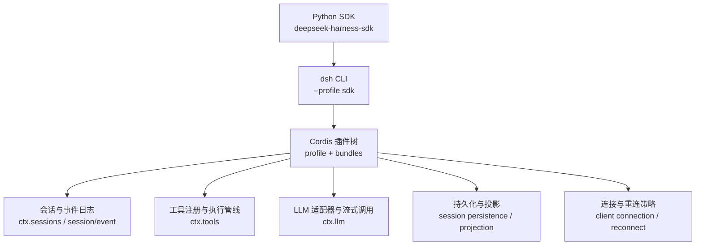
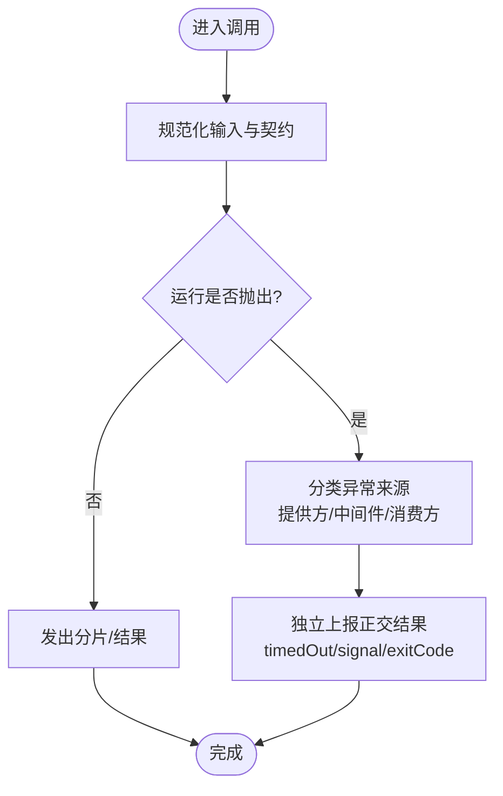
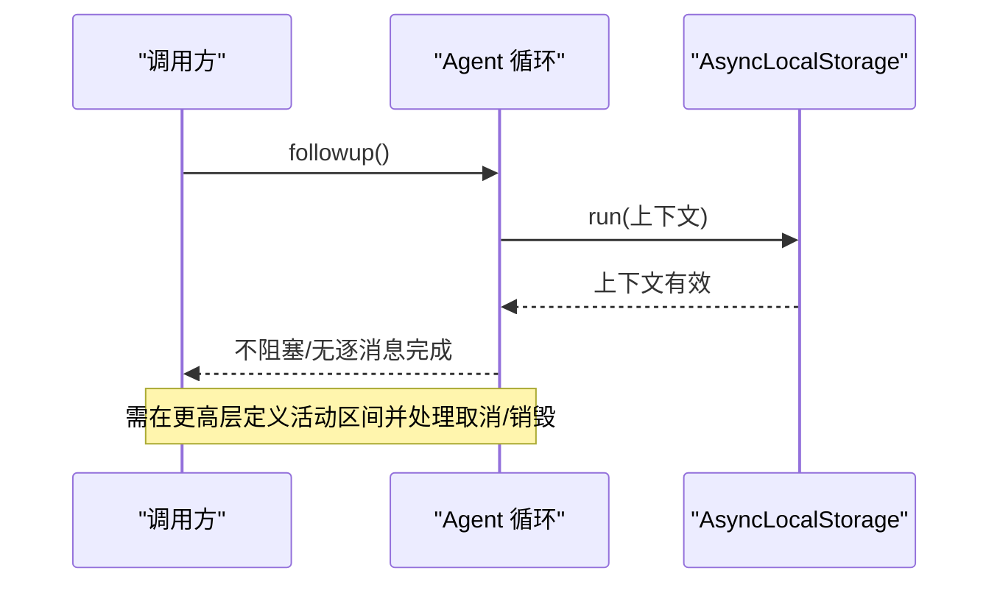
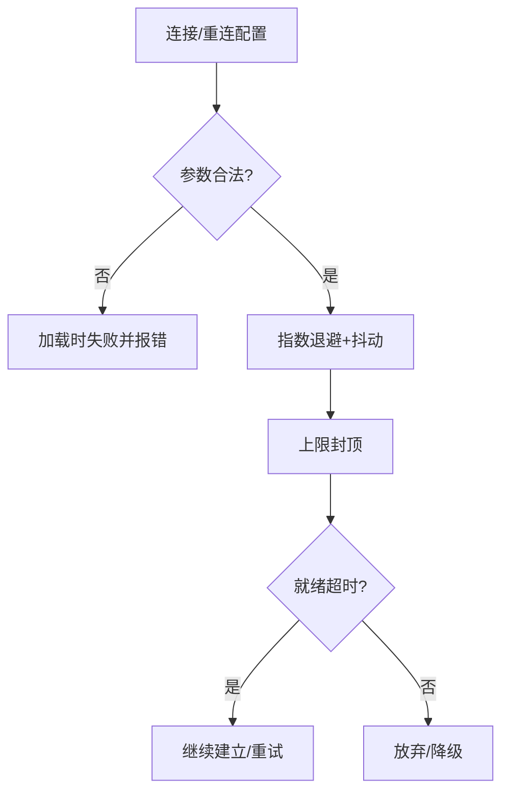
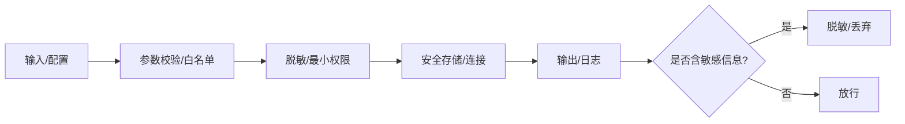
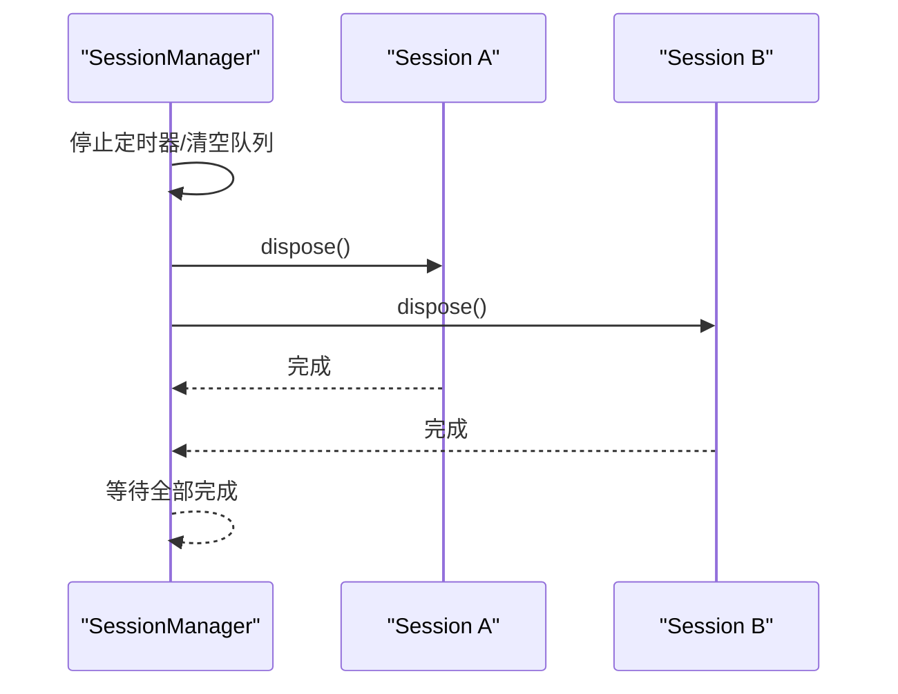
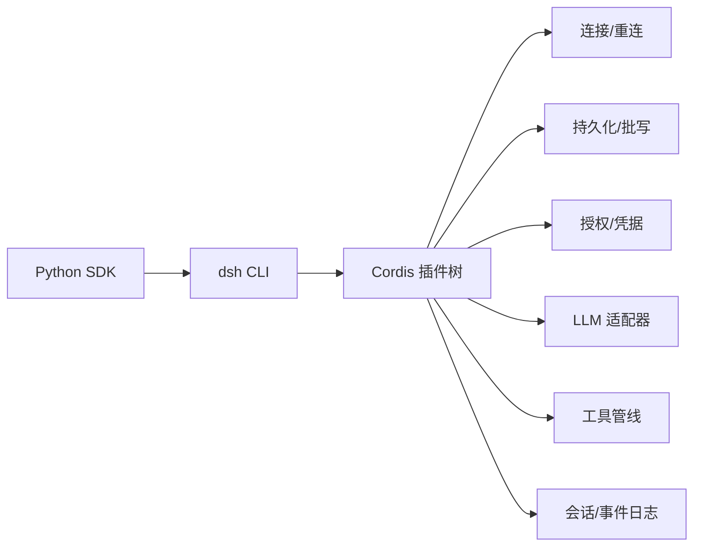

# 最佳实践

<cite>
**本文引用的文件**
- [README.md](file://README.md)
- [architecture.md](file://docs/architecture.md)
- [defensive-patterns.md](file://docs/defensive-patterns.md)
- [testing.md](file://docs/testing.md)
- [connection.ts](file://packages/client/connection/src/client/connection.ts)
- [mcp-client connection.ts](file://packages/mcp/mcp-client/src/connection.ts)
- [session-persistence coordinator.ts](file://packages/session/session-persistence/src/coordinator.ts)
- [session-projection index.ts](file://packages/session/session-projection/src/index.ts)
- [session-controller manager.ts](file://packages/api/session-controller/src/client/sessions/manager.ts)
- [authorization invariant.ts](file://packages/credentials/authorization/src/invariant.ts)
- [credentials types.ts](file://packages/credentials/credentials/src/types.ts)
- [session schema.ts](file://packages/session/session-persistence-sqlite/src/schema.ts)
- [agent-loop index.ts](file://packages/core/agent-loop/src/index.ts)
- [Python SDK README.md](file://python/sdk/README.md)
</cite>

## 目录
1. [简介](#简介)
2. [项目结构](#项目结构)
3. [核心组件](#核心组件)
4. [架构总览](#架构总览)
5. [详细组件分析](#详细组件分析)
6. [依赖关系分析](#依赖关系分析)
7. [性能考虑](#性能考虑)
8. [故障排查指南](#故障排查指南)
9. [结论](#结论)
10. [附录](#附录)

## 简介
本指南面向使用 DeepSeek Harness（dsh）SDK 的开发者，聚焦错误处理与异常捕获、异步与并发、性能优化、安全、资源管理、测试策略以及生产部署与监控。内容基于仓库中的架构文档、防御性模式、测试策略与各子系统实现提炼而成，帮助你在构建稳定、可观测、易维护的 Agent 应用时做出正确决策。

## 项目结构
DeepSeek Harness 采用“一切皆插件”的 Cordis 架构：通过 profile 与 bundle 在启动时组合插件树，运行时以事件和上下文驱动。SDK 既提供 TypeScript 侧的 JSON-RPC 控制面，也提供 Python 子进程 SDK 通过 stdio 驱动同一套运行时。



图表来源
- [architecture.md:15-47](file://docs/architecture.md#L15-L47)
- [Python SDK README.md:11-62](file://python/sdk/README.md#L11-L62)

章节来源
- [README.md:1-64](file://README.md#L1-L64)
- [architecture.md:1-47](file://docs/architecture.md#L1-L47)
- [Python SDK README.md:11-62](file://python/sdk/README.md#L11-L62)

## 核心组件
- 会话与会话日志：追加不可变的事件序列，作为模型可见上下文的唯一事实来源，并支撑回放、遥测与持久化。
- 工具注册与执行管线：按 pre-execute → execute → post-execute 顺序执行，支持拦截与策略。
- LLM 适配器与流：统一消息与流词汇，屏蔽底层差异；上层消费方只看到标准化契约。
- 连接与重连：客户端连接具备退避、上限与超时配置，保障网络抖动下的稳定性。
- 持久化与准备缓存：会话准备阶段有缓存与批写延迟，避免频繁落盘。
- 权限与凭据：统一的凭据记录类型与授权不变量，确保敏感信息不被泄露。

章节来源
- [architecture.md:49-141](file://docs/architecture.md#L49-L141)
- [connection.ts:15-33](file://packages/client/connection/src/client/connection.ts#L15-L33)
- [session-persistence coordinator.ts:608-630](file://packages/session/session-persistence/src/coordinator.ts#L608-L630)
- [credentials types.ts:31-60](file://packages/credentials/credentials/src/types.ts#L31-L60)
- [authorization invariant.ts:1-14](file://packages/credentials/authorization/src/invariant.ts#L1-L14)

## 架构总览
下图展示了从 Python SDK 到 dsh 运行时、再到各子系统的关键交互路径，包括会话生命周期、事件流、工具调用与 LLM 流式响应。

```mermaid
sequenceDiagram
participant Py as "Python SDK"
participant DSH as "dsh CLI (--profile sdk)"
participant Loop as "Agent 循环"
participant Tools as "工具管线"
participant LLM as "LLM 适配器"
participant Store as "会话存储"
Py->>DSH : 初始化(选择 provider/model/token等)
DSH->>Loop : 创建会话/订阅事件
Loop->>Store : 写入 turn/start, step/start
Loop->>LLM : stream(messages)
LLM-->>Loop : chunk* (assistant/chunk)
Loop->>Tools : tool/call -> execute -> result
Tools-->>Loop : tool/result
Loop->>Store : 写入 assistant/message, step/end, turn/end
Loop-->>Py : RunResult(events, notifications)
```

图表来源
- [architecture.md:74-101](file://docs/architecture.md#L74-L101)
- [Python SDK README.md:64-70](file://python/sdk/README.md#L64-L70)

## 详细组件分析

### 错误处理与异常捕获最佳模式
- 正交结果独立上报：将超时、信号、退出码等独立事实分别暴露，避免嵌套分支导致误判成功。
- 公共约定两侧遵守：对多源结果进行规范化后再返回给消费者，使异常来源清晰可辨。
- 回调异常隔离：用户提供的监听器抛错不应拒绝宿主 Promise 或饿死后续监听器，应在调度处 try/catch 并记录。
- Dispose 必须达到静默：清理需等待子任务真正结束，先关闭通知/监听再终止，避免孤儿与噪音。



图表来源
- [defensive-patterns.md:7-25](file://docs/defensive-patterns.md#L7-L25)

章节来源
- [defensive-patterns.md:7-25](file://docs/defensive-patterns.md#L7-L25)

### 异步编程与并发注意事项
- 异步状态不等于同步状态：followup/status/whenIdle 不是单条消息的结果；多个 follow-up、注入工作可能共享运行区间，取消或销毁会丢弃未开始项。
- 明确活动边界：自动化调用应显式定义区间（如从收件箱收到消息到下一次 agent idle），并将输出描述为区间级而非因果归属某条消息。
- 上下文传播：使用 AsyncLocalStorage 在 await 前后保持上下文一致，必要时用快照/恢复机制跨边界传递。



图表来源
- [defensive-patterns.md:15-21](file://docs/defensive-patterns.md#L15-L21)
- [async_hooks.ts:253-292](file://packages/experimental/webworker-runtime/src/node/builtin_modules/implemented/async_hooks.ts#L253-L292)

章节来源
- [defensive-patterns.md:15-21](file://docs/defensive-patterns.md#L15-L21)
- [async_hooks.ts:253-292](file://packages/experimental/webworker-runtime/src/node/builtin_modules/implemented/async_hooks.ts#L253-L292)

### 性能优化建议
- 连接池与重连策略
  - 客户端连接支持指数退避、最大退避上限与就绪超时，避免雪崩与长时间阻塞。
  - MCP 客户端重连策略具备初始延迟、最大延迟、最大尝试次数等参数校验，失败快速收敛。
- 内存与批写
  - 会话准备缓存限制大小，避免无限增长；写路径支持批写延迟合并，降低 I/O 压力。
  - 投影注册引用计数确保多会话共享单元的生命周期正确回收。
- 超时设置
  - 初始化握手与查询均有默认超时；Python SDK 提供 initialize_timeout_seconds 与 request_timeout_seconds 控制。



图表来源
- [connection.ts:15-33](file://packages/client/connection/src/client/connection.ts#L15-L33)
- [mcp-client connection.ts:55-78](file://packages/mcp/mcp-client/src/connection.ts#L55-L78)
- [session-persistence coordinator.ts:608-630](file://packages/session/session-persistence/src/coordinator.ts#L608-L630)
- [session-projection index.ts:146-162](file://packages/session/session-projection/src/index.ts#L146-L162)
- [Python SDK README.md:33-34](file://python/sdk/README.md#L33-L34)

章节来源
- [connection.ts:15-33](file://packages/client/connection/src/client/connection.ts#L15-L33)
- [mcp-client connection.ts:55-78](file://packages/mcp/mcp-client/src/connection.ts#L55-L78)
- [session-persistence coordinator.ts:608-630](file://packages/session/session-persistence/src/coordinator.ts#L608-L630)
- [session-projection index.ts:146-162](file://packages/session/session-projection/src/index.ts#L146-L162)
- [Python SDK README.md:33-34](file://python/sdk/README.md#L33-L34)

### 安全考虑
- 敏感信息保护
  - 凭据记录类型区分 API Key 与环境变量，grant payload 由所有者解释，避免被其他插件读取。
  - SQLite 连接强制关闭 trusted_schema 与 mmap，防止不安全特性被启用。
  - 子进程环境清洗，移除包含 KEY/SECRET/TOKEN/PASSWORD 的环境变量，临时文件使用私有目录与严格权限。
- 权限控制
  - 授权不变量插件声明包所有权，配合服务注入顺序保证安全前置。
  - 浏览器令牌认证设计强调最小权限与重启轮换，避免长期凭证驻留。
- 输入验证
  - 重连策略与持久化选项在构造时严格校验，非法值在加载期失败，尽早暴露问题。



图表来源
- [credentials types.ts:31-60](file://packages/credentials/credentials/src/types.ts#L31-L60)
- [session schema.ts:91-105](file://packages/session/session-persistence-sqlite/src/schema.ts#L91-L105)
- [defensive-patterns.md:27-33](file://docs/defensive-patterns.md#L27-L33)
- [authorization invariant.ts:1-14](file://packages/credentials/authorization/src/invariant.ts#L1-L14)

章节来源
- [credentials types.ts:31-60](file://packages/credentials/credentials/src/types.ts#L31-L60)
- [session schema.ts:91-105](file://packages/session/session-persistence-sqlite/src/schema.ts#L91-L105)
- [defensive-patterns.md:27-33](file://docs/defensive-patterns.md#L27-L33)
- [authorization invariant.ts:1-14](file://packages/credentials/authorization/src/invariant.ts#L1-L14)

### 资源管理与上下文管理器
- 会话控制器在 dispose 时先停止定时器、清空目录，再并行发起所有 Session 的 dispose，并等待全部完成，确保无孤儿。
- 代理工厂在创建前注册去激活钩子，结合 AbortController 聚合 caller 与工厂 teardown 信号，避免资源泄漏。
- Python SDK 使用上下文管理器启动/关闭运行时，确保资源释放与超时可控。



图表来源
- [session-controller manager.ts:248-277](file://packages/api/session-controller/src/client/sessions/manager.ts#L248-L277)
- [agent-loop index.ts:475-488](file://packages/core/agent-loop/src/index.ts#L475-L488)
- [Python SDK README.md:17-34](file://python/sdk/README.md#L17-L34)

章节来源
- [session-controller manager.ts:248-277](file://packages/api/session-controller/src/client/sessions/manager.ts#L248-L277)
- [agent-loop index.ts:475-488](file://packages/core/agent-loop/src/index.ts#L475-L488)
- [Python SDK README.md:17-34](file://python/sdk/README.md#L17-L34)

### 测试策略与单元测试编写指南
- 分层测试
  - 单元测试：覆盖边缘情况、错误路径、事件顺序、并发竞态与永久回归用例。
  - 覆盖率门禁：包源码行级 100% 覆盖率，但覆盖率必要不充分。
  - 真实 API e2e：带密钥测试，自跳过策略保证无密钥 CI 绿色。
  - 预期输出与快照：无密钥场景对比外部世界状态；会话快照用于回放与一致性验证。
- 优先真实实现：仅对昂贵或非确定性边界打桩，下游尽量走真实管线。
- 验证世界而非自报告：e2e 断言外部文件/命令输出，测试拥有自己的资源并在 afterEach 清理。
- 真实入口路径：通过发布产物运行，避免 tsx 掩盖的问题。

章节来源
- [testing.md:7-50](file://docs/testing.md#L7-L50)

### 生产环境部署与监控建议
- 部署
  - 使用 profile 与 bundle 组合，避免直接拼装 Cordis 树；Python SDK 通过子进程启动 dsh，隔离 home 与工作目录。
  - 明确超时：初始化握手与请求均设超时，避免挂起。
  - 重连策略：合理设置 initialDelayMs、maxDelayMs、maxAttempts，避免风暴与无限重试。
- 监控
  - 利用会话事件日志作为单一事实源，导出至 OpenTelemetry 或其他后端，便于追踪与回放。
  - 关注连接健康、重连次数、超时率、工具调用失败率与 token 用量指标。

章节来源
- [architecture.md:15-47](file://docs/architecture.md#L15-L47)
- [Python SDK README.md:11-62](file://python/sdk/README.md#L11-L62)
- [session-telemetry otel.spec.ts:98-119](file://packages/session/session-telemetry-otel/tests/otel.spec.ts#L98-L119)

## 依赖关系分析
- 低耦合高内聚：通过 Cordis 的服务定义、提供者与消费者解耦，能力以 seam 形式扩展。
- 关键依赖链
  - Python SDK → dsh CLI → Cordis 插件树 → 会话/工具/LLM/持久化/连接。
  - 连接模块依赖重连策略；持久化依赖参数校验与批写策略；授权依赖不变量插件。



图表来源
- [architecture.md:15-47](file://docs/architecture.md#L15-L47)
- [connection.ts:15-33](file://packages/client/connection/src/client/connection.ts#L15-L33)
- [session-persistence coordinator.ts:608-630](file://packages/session/session-persistence/src/coordinator.ts#L608-L630)
- [authorization invariant.ts:1-14](file://packages/credentials/authorization/src/invariant.ts#L1-L14)

章节来源
- [architecture.md:15-47](file://docs/architecture.md#L15-L47)
- [connection.ts:15-33](file://packages/client/connection/src/client/connection.ts#L15-L33)
- [session-persistence coordinator.ts:608-630](file://packages/session/session-persistence/src/coordinator.ts#L608-L630)
- [authorization invariant.ts:1-14](file://packages/credentials/authorization/src/invariant.ts#L1-L14)

## 性能考虑
- 连接与重连：指数退避+抖动+上限，减少拥塞；就绪超时避免长尾阻塞。
- 持久化：会话准备缓存与写批延迟降低 I/O；投影引用计数避免过早释放。
- 超时：初始化与请求超时合理配置，避免资源占用过久。
- 资源：dispose 等待完成，避免孤儿；上下文传播减少重复装配成本。

[本节为通用指导，不直接分析具体文件]

## 故障排查指南
- 常见问题定位
  - 连接失败：检查重连策略参数、网络连通性与就绪超时。
  - 会话卡住：确认活动边界是否正确定义，是否存在未完成的异步任务或未释放的资源。
  - 数据不一致：核对会话事件日志是否完整，回放是否与预期一致。
  - 权限/凭据：确认凭据记录格式与安全设置（trusted_schema/mmap）已正确配置。
- 调试建议
  - 使用快照与回放：通过会话快照复现问题，缩小范围。
  - 观察事件流：借助 session/event 与工具管线事件定位失败点。
  - 逐步禁用：暂时关闭重连或批写，验证是否为策略导致的假象。

章节来源
- [mcp-client connection.ts:55-78](file://packages/mcp/mcp-client/src/connection.ts#L55-L78)
- [defensive-patterns.md:15-25](file://docs/defensive-patterns.md#L15-L25)
- [session schema.ts:91-105](file://packages/session/session-persistence-sqlite/src/schema.ts#L91-L105)

## 结论
遵循本指南中的错误处理、异步与并发、性能、安全、资源管理、测试与生产实践，可以显著提升基于 DeepSeek Harness SDK 的应用的稳定性与可维护性。关键在于：明确契约与边界、尽早失败与可观测、最小权限与强约束、以及以事件日志为核心的可回溯性。

## 附录
- 术语速查
  - 会话：一次对话的不可变事件日志。
  - 步骤/回合：一次模型请求及工具调用的集合；零或多步构成一个回合。
  - 能力接缝：可替换的能力抽象，包含服务定义、提供者与消费者。
- 参考路径
  - 架构与流程：[architecture.md](file://docs/architecture.md)
  - 防御性模式：[defensive-patterns.md](file://docs/defensive-patterns.md)
  - 测试策略：[testing.md](file://docs/testing.md)
  - Python SDK 使用：[Python SDK README.md](file://python/sdk/README.md)