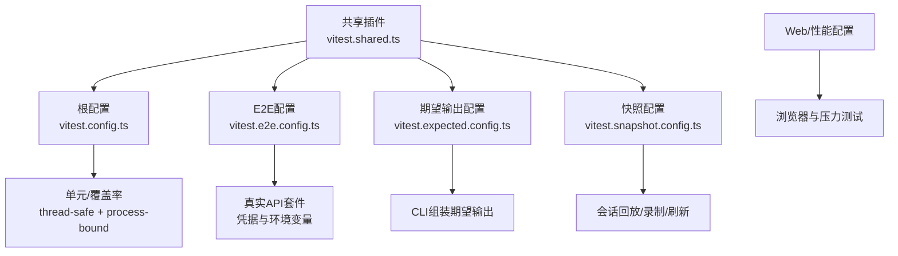
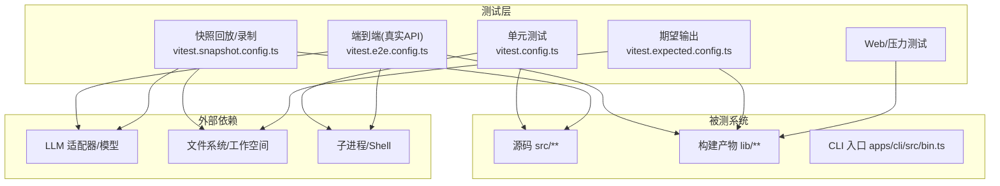
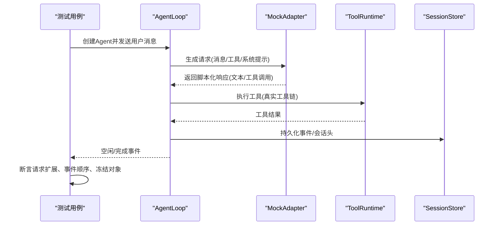
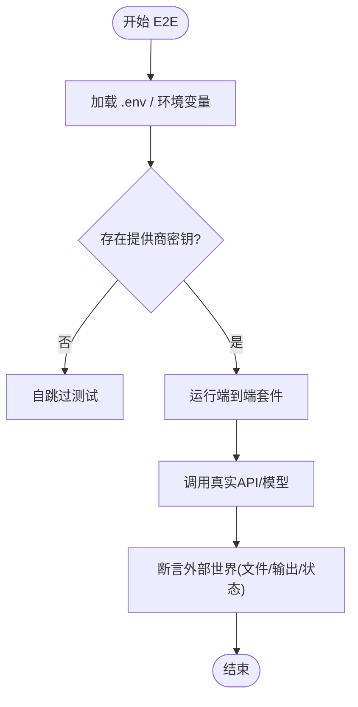
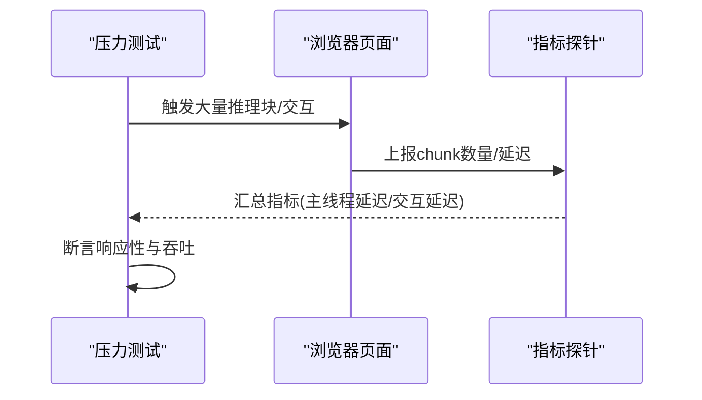
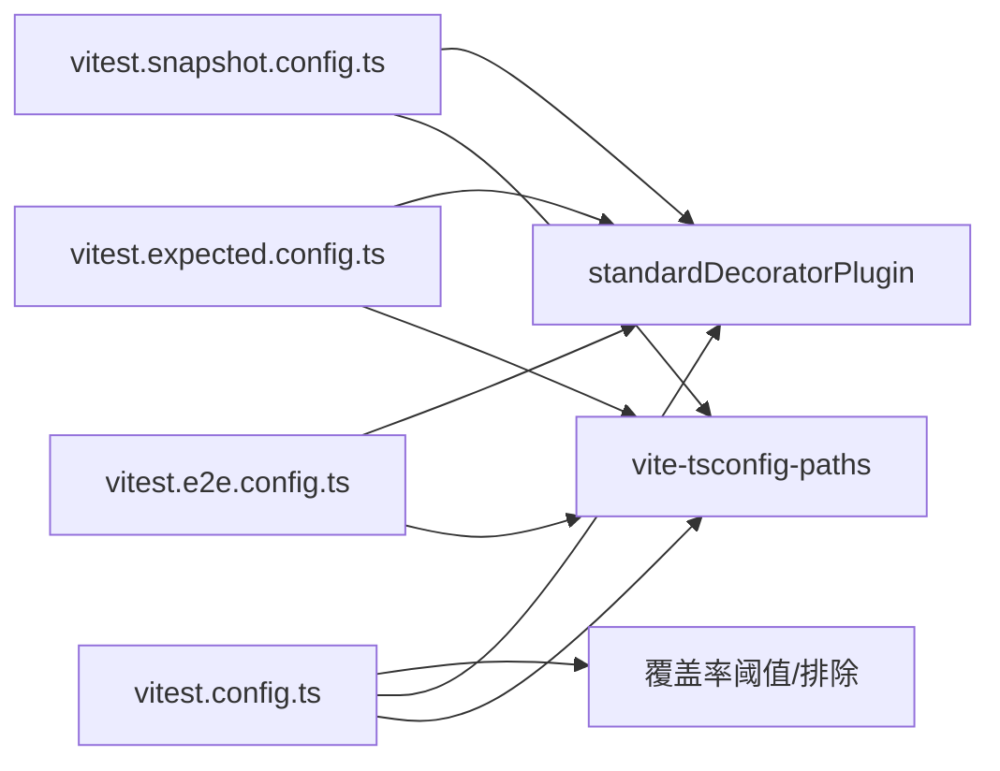

# 测试策略与质量保证

<cite>
**本文引用的文件**
- [docs/testing.md](file://docs/testing.md)
- [vitest.config.ts](file://vitest.config.ts)
- [vitest.e2e.config.ts](file://vitest.e2e.config.ts)
- [vitest.expected.config.ts](file://vitest.expected.config.ts)
- [vitest.snapshot.config.ts](file://vitest.snapshot.config.ts)
- [vitest.shared.ts](file://vitest.shared.ts)
- [package.json](file://package.json)
- [packages/core/agent-loop/tests/request-reconstruction.spec.ts](file://packages/core/agent-loop/tests/request-reconstruction.spec.ts)
- [packages/shell/tool-bash/tests/integration.spec.ts](file://packages/shell/tool-bash/tests/integration.spec.ts)
- [packages/acp/acp/tests/bridge.spec.ts](file://packages/acp/acp/tests/bridge.spec.ts)
- [apps/web/stress-tests/reasoning-chunks.stress.ts](file://apps/web/stress-tests/reasoning-chunks.stress.ts)
</cite>

## 目录
1. [简介](#简介)
2. [项目结构](#项目结构)
3. [核心组件](#核心组件)
4. [架构总览](#架构总览)
5. [详细组件分析](#详细组件分析)
6. [依赖关系分析](#依赖关系分析)
7. [性能考虑](#性能考虑)
8. [故障排查指南](#故障排查指南)
9. [结论](#结论)
10. [附录](#附录)

## 简介
本指南面向DeepSeek Harness SDK的测试与质量保障，覆盖单元测试、集成测试（端到端、API、数据库）、测试环境搭建与配置管理、持续集成与自动化流程（含覆盖率门禁）、性能与压力测试的实施与分析，以及测试驱动开发（TDD）实践与调试技巧。内容基于仓库现有测试策略与配置，确保可操作且与工程一致。

## 项目结构
仓库采用多包工作区组织，测试按分层与用途拆分到多个Vitest配置：
- 单元与覆盖率：根级 vitest.config.ts，统一路径解析、覆盖率阈值与排除规则
- 端到端（真实API）：vitest.e2e.config.ts，支持凭据加载与并发控制
- 期望输出（无会话回放）：vitest.expected.config.ts，聚焦CLI组装后的期望输出
- 快照（会话回放/录制）：vitest.snapshot.config.ts，支持replay/record/refresh模式
- Web浏览器与性能：独立web与stress配置，配合构建产物运行
- 共享工具：vitest.shared.ts提供装饰器预处理与执行参数

**图表来源**
- [vitest.config.ts:149-191](file://vitest.config.ts#L149-L191)
- [vitest.e2e.config.ts:31-62](file://vitest.e2e.config.ts#L31-L62)
- [vitest.expected.config.ts:7-19](file://vitest.expected.config.ts#L7-L19)
- [vitest.snapshot.config.ts:39-67](file://vitest.snapshot.config.ts#L39-L67)
- [vitest.shared.ts:1-43](file://vitest.shared.ts#L1-L43)

**章节来源**
- [vitest.config.ts:149-191](file://vitest.config.ts#L149-L191)
- [vitest.e2e.config.ts:31-62](file://vitest.e2e.config.ts#L31-L62)
- [vitest.expected.config.ts:7-19](file://vitest.expected.config.ts#L7-L19)
- [vitest.snapshot.config.ts:39-67](file://vitest.snapshot.config.ts#L39-L67)
- [vitest.shared.ts:1-43](file://vitest.shared.ts#L1-L43)

## 核心组件
- 测试分层与策略
  - 单元测试：使用Vitest在包内tests目录执行，强调边缘情况、错误路径、事件顺序、并发竞态与契约回归；每个注册项需HMR安全测试（释放贡献fiber并断言清理）。
  - 覆盖率门禁：对packages/*/*/src逐文件100%（语句、分支、函数、行），未覆盖行通常视为死代码；某些平台或外部依赖（如pwsh）通过豁免保持CI绿色。
  - 真实API e2e：带密钥调用真实模型与提供商接口，无密钥时自跳过；覆盖文件写入、多轮对话、工具调用与流式取消等。
  - 期望输出：无需会话回放的组装后CLI/进程期望对比。
  - 快照：以记录会话为输入进行回放，生成持久化结果对比；支持record/refresh模式更新预期。
  - Web浏览器快照：Chromium比对会话驱动与UI输出，CI只读回放，本地记录/刷新并审查差异。
- 关键原则
  - 优先真实实现而非模拟，仅对昂贵或非确定性边界做mock（LLM适配器、网络、时钟）。
  - 验证“世界”而非自报告：e2e从外部重新读取文件或命令输出，断言文件字节一致性。
  - 测试真实入口：通过发布产物（lib/bin.js）运行，暴露tsx掩盖的问题。
  - 子进程启动模式：CI与有构建的测试通道通过共享双模式启动器运行，避免手写--import tsx。
  - 源平面解析：所有Vitest配置指向tsconfig.base.json路径映射，避免加载重复模块单例。

**章节来源**
- [docs/testing.md:7-50](file://docs/testing.md#L7-L50)

## 架构总览
下图展示测试层如何与源码、构建产物、外部服务交互，以及不同配置的职责边界。

**图表来源**
- [vitest.config.ts:149-191](file://vitest.config.ts#L149-L191)
- [vitest.e2e.config.ts:31-62](file://vitest.e2e.config.ts#L31-L62)
- [vitest.expected.config.ts:7-19](file://vitest.expected.config.ts#L7-L19)
- [vitest.snapshot.config.ts:39-67](file://vitest.snapshot.config.ts#L39-L67)
- [package.json:19-67](file://package.json#L19-L67)

## 详细组件分析

### 单元测试编写规范
- 用例设计
  - 覆盖边缘情况、错误路径、事件顺序、并发竞态与契约回归。
  - 每个注册项需包含HMR安全测试：释放贡献fiber并断言清理。
- 模拟对象使用
  - 仅对昂贵或非确定性边界进行mock（如LLM适配器、网络、时钟），下游保持真实。
  - 示例：在Agent Loop测试中通过MockAdapter注入脚本化响应，验证请求重建与消息追加扩展。
- 断言方法
  - 使用Vitest expect进行值比较、异步等待与事件监听断言；结合waitForIdle等待空闲状态。
  - 对不可变对象进行冻结断言，确保请求稳定与不可变性。
- 参考实现位置
  - Agent Loop请求重建与稳定性：[request-reconstruction.spec.ts](file://packages/core/agent-loop/tests/request-reconstruction.spec.ts)
  - Bash工具集成测试（真实工具链+Mock模型）：[integration.spec.ts](file://packages/shell/tool-bash/tests/integration.spec.ts)

**图表来源**
- [packages/core/agent-loop/tests/request-reconstruction.spec.ts:20-60](file://packages/core/agent-loop/tests/request-reconstruction.spec.ts#L20-L60)
- [packages/shell/tool-bash/tests/integration.spec.ts:20-62](file://packages/shell/tool-bash/tests/integration.spec.ts#L20-L62)

**章节来源**
- [docs/testing.md:7-24](file://docs/testing.md#L7-L24)
- [packages/core/agent-loop/tests/request-reconstruction.spec.ts:20-60](file://packages/core/agent-loop/tests/request-reconstruction.spec.ts#L20-L60)
- [packages/shell/tool-bash/tests/integration.spec.ts:20-62](file://packages/shell/tool-bash/tests/integration.spec.ts#L20-L62)

### 集成测试策略（端到端、API、数据库）
- 端到端（真实API）
  - 使用vitest.e2e.config.ts，支持从.env加载凭据，按提供商密钥自跳过；超时与重试更宽松，限制并发以避免配额限制。
  - 覆盖：文件写入、多轮对话、工具调用、流式取消、会话恢复等。
- API测试
  - 通过ACP桥接测试验证协议协商、会话生命周期、能力声明与错误处理。
  - 参考：[bridge.spec.ts](file://packages/acp/acp/tests/bridge.spec.ts)
- 数据库/持久化测试
  - 通过JSONL会话持久化插件验证读写、压缩与恢复；在集成测试中挂载JsonlSessionPersistence并断言事件与状态。
  - 参考：Bash集成测试中的会话根与持久化挂载。

**图表来源**
- [vitest.e2e.config.ts:5-14](file://vitest.e2e.config.ts#L5-L14)
- [vitest.e2e.config.ts:40-62](file://vitest.e2e.config.ts#L40-L62)
- [packages/shell/tool-bash/tests/integration.spec.ts:20-41](file://packages/shell/tool-bash/tests/integration.spec.ts#L20-L41)

**章节来源**
- [vitest.e2e.config.ts:5-14](file://vitest.e2e.config.ts#L5-L14)
- [vitest.e2e.config.ts:40-62](file://vitest.e2e.config.ts#L40-L62)
- [packages/acp/acp/tests/bridge.spec.ts:27-125](file://packages/acp/acp/tests/bridge.spec.ts#L27-L125)
- [packages/shell/tool-bash/tests/integration.spec.ts:20-41](file://packages/shell/tool-bash/tests/integration.spec.ts#L20-L41)

### 测试环境搭建与配置管理
- 环境隔离
  - 每个快照场景使用唯一临时目录与固定夹具集，避免并发写冲突。
  - 平台不支持的测试通过exclude列表自动跳过（Windows/macOS特定行为）。
- 配置管理
  - 通过环境变量控制并发度（DSH_E2E_MAX_WORKERS、DSH_SNAPSHOT_MAX_CONCURRENCY）。
  - 快照模式由DSH_SNAPSHOT控制：replay（默认，只读）、record（录制并更新）、refresh（刷新预期）。
  - 共享执行参数vitestExecArgv禁用Node webstorage以避免jsdom存储被覆盖。
- 参考
  - 快照并发与模式：[vitest.snapshot.config.ts:6-37](file://vitest.snapshot.config.ts#L6-L37)
  - E2E并发与凭据：[vitest.e2e.config.ts:16-29](file://vitest.e2e.config.ts#L16-L29)
  - 共享执行参数：[vitest.shared.ts:5-9](file://vitest.shared.ts#L5-L9)

**章节来源**
- [vitest.snapshot.config.ts:6-37](file://vitest.snapshot.config.ts#L6-L37)
- [vitest.e2e.config.ts:16-29](file://vitest.e2e.config.ts#L16-L29)
- [vitest.shared.ts:5-9](file://vitest.shared.ts#L5-L9)

### 持续集成与自动化测试流程
- 命令与门禁
  - 单元测试：pnpm run test
  - 覆盖率门禁：pnpm run test:coverage（逐文件100%，严格阈值）
  - 端到端：pnpm run test:e2e
  - 期望输出：pnpm run test:expected
  - 快照：pnpm run test:snapshot（replay/record/refresh）
  - Web：pnpm run test:web（构建后运行）
- CI要点
  - 覆盖率报告包含精确未覆盖位置；CI下启用额外报告器。
  - 平台相关测试自动排除；pwsh缺失主机豁免对应文件以保持绿色。
  - 快照CI强制只读回放，禁止写入预期输出。

**章节来源**
- [package.json:19-67](file://package.json#L19-L67)
- [vitest.config.ts:192-362](file://vitest.config.ts#L192-L362)
- [vitest.snapshot.config.ts:54-67](file://vitest.snapshot.config.ts#L54-L67)

### 性能测试与压力测试
- 浏览器压力测试
  - 使用vitest.web-stress.config.ts，针对apps/web/stress-tests下的压力用例，关闭文件并行以提升稳定性。
  - 指标采集：通过页面探针收集chunk计数、主线程延迟、交互延迟等。
- 分析与优化
  - 关注主线程阻塞与交互延迟，定位渲染瓶颈；结合回放与快照验证优化效果。
  - 将压力测试作为显式性能证据，不替代确定性聚焦测试。

**图表来源**
- [vitest.web-stress.config.ts:1-15](file://vitest.web-stress.config.ts#L1-L15)
- [apps/web/stress-tests/reasoning-chunks.stress.ts:105-134](file://apps/web/stress-tests/reasoning-chunks.stress.ts#L105-L134)

**章节来源**
- [vitest.web-stress.config.ts:1-15](file://vitest.web-stress.config.ts#L1-L15)
- [apps/web/stress-tests/reasoning-chunks.stress.ts:105-134](file://apps/web/stress-tests/reasoning-chunks.stress.ts#L105-L134)

### 测试驱动开发（TDD）实践与调试技巧
- TDD实践
  - 先写失败用例，再实现最小代码使其通过；利用MockAdapter快速构造响应，聚焦行为契约。
  - 通过事件监听（如agent/status）等待空闲，避免sleep导致的脆弱性。
- 调试技巧
  - 使用waitForIdle与自定义waitFor轮询条件，提高鲁棒性。
  - 在e2e中对外部世界进行断言（文件/输出），避免“自报告欺骗”。
  - 利用快照回放定位回归，必要时record/refresh并审查差异。

**章节来源**
- [packages/core/agent-loop/tests/request-reconstruction.spec.ts:39-60](file://packages/core/agent-loop/tests/request-reconstruction.spec.ts#L39-L60)
- [packages/shell/tool-bash/tests/integration.spec.ts:49-62](file://packages/shell/tool-bash/tests/integration.spec.ts#L49-L62)
- [docs/testing.md:22-36](file://docs/testing.md#L22-L36)

## 依赖关系分析
- 测试配置依赖
  - 所有配置均引入vite-tsconfig-paths与标准装饰器插件，保证路径解析与装饰器转译一致。
  - 覆盖率配置集中管理include/exclude与阈值，平台与外部依赖豁免清晰。
- 测试与源码耦合
  - 单元测试直接依赖源码（src），通过路径映射避免加载重复模块单例。
  - 构建产物smoke测试通过lib入口验证发布工件的正确性。

**图表来源**
- [vitest.config.ts:149-191](file://vitest.config.ts#L149-L191)
- [vitest.e2e.config.ts:31-62](file://vitest.e2e.config.ts#L31-L62)
- [vitest.expected.config.ts:7-19](file://vitest.expected.config.ts#L7-L19)
- [vitest.snapshot.config.ts:39-67](file://vitest.snapshot.config.ts#L39-L67)

**章节来源**
- [vitest.config.ts:149-191](file://vitest.config.ts#L149-L191)
- [vitest.e2e.config.ts:31-62](file://vitest.e2e.config.ts#L31-L62)
- [vitest.expected.config.ts:7-19](file://vitest.expected.config.ts#L7-L19)
- [vitest.snapshot.config.ts:39-67](file://vitest.snapshot.config.ts#L39-L67)

## 性能考虑
- 并发与资源控制
  - E2E与快照通过环境变量限制并发，避免配额与磁盘竞争。
  - 快照回放在并发下保证每场景独立临时目录，防止写冲突。
- 覆盖率开销
  - 覆盖率门限严格但必要；通过豁免减少无关路径影响，聚焦产品源码。
- 浏览器压力测试
  - 关闭文件并行，降低调度噪声；采集主线程延迟与交互延迟作为优化依据。

**章节来源**
- [vitest.e2e.config.ts:40-62](file://vitest.e2e.config.ts#L40-L62)
- [vitest.snapshot.config.ts:54-67](file://vitest.snapshot.config.ts#L54-L67)
- [vitest.config.ts:192-362](file://vitest.config.ts#L192-L362)
- [vitest.web-stress.config.ts:1-15](file://vitest.web-stress.config.ts#L1-L15)

## 故障排查指南
- 常见失败原因
  - 缺少提供商密钥：E2E自跳过；检查.env或环境变量。
  - 平台不支持：Windows/macOS特定测试被排除；确认运行环境与排除列表。
  - 覆盖率不达标：查看未覆盖位置报告，区分死代码与缺失测试。
- 调试步骤
  - 使用快照回放定位回归；必要时record/refresh并审查差异。
  - 在e2e中对外部世界断言，避免“自报告欺骗”。
  - 通过waitForIdle与自定义waitFor提升稳定性，避免sleep。

**章节来源**
- [vitest.e2e.config.ts:5-14](file://vitest.e2e.config.ts#L5-L14)
- [vitest.config.ts:192-362](file://vitest.config.ts#L192-L362)
- [docs/testing.md:22-36](file://docs/testing.md#L22-L36)

## 结论
本仓库建立了分层清晰、覆盖全面的测试体系：单元测试聚焦契约与边缘路径，端到端验证真实API与工作流，快照与期望输出确保可重现与可审计，覆盖率门禁保障源码质量。通过环境变量与平台适配实现灵活的环境隔离与并发控制，压力测试提供性能信号。遵循“优先真实实现、验证外部世界、测试真实入口”的原则，可有效降低回归风险并提升交付质量。

## 附录
- 常用命令速查
  - 单元测试：pnpm run test
  - 覆盖率：pnpm run test:coverage
  - 端到端：pnpm run test:e2e
  - 期望输出：pnpm run test:expected
  - 快照：pnpm run test:snapshot（replay/record/refresh）
  - Web：pnpm run test:web
- 关键环境变量
  - DSH_E2E_MAX_WORKERS：E2E并发度
  - DSH_SNAPSHOT_MAX_CONCURRENCY：快照并发度
  - DSH_SNAPSHOT：快照模式（replay/record/refresh）

**章节来源**
- [package.json:19-67](file://package.json#L19-L67)
- [vitest.e2e.config.ts:16-29](file://vitest.e2e.config.ts#L16-L29)
- [vitest.snapshot.config.ts:6-37](file://vitest.snapshot.config.ts#L6-L37)