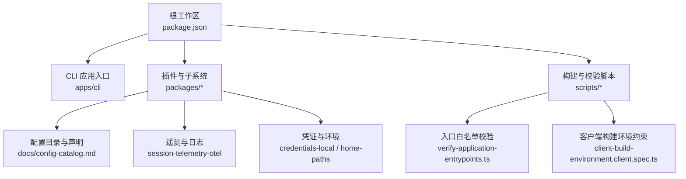
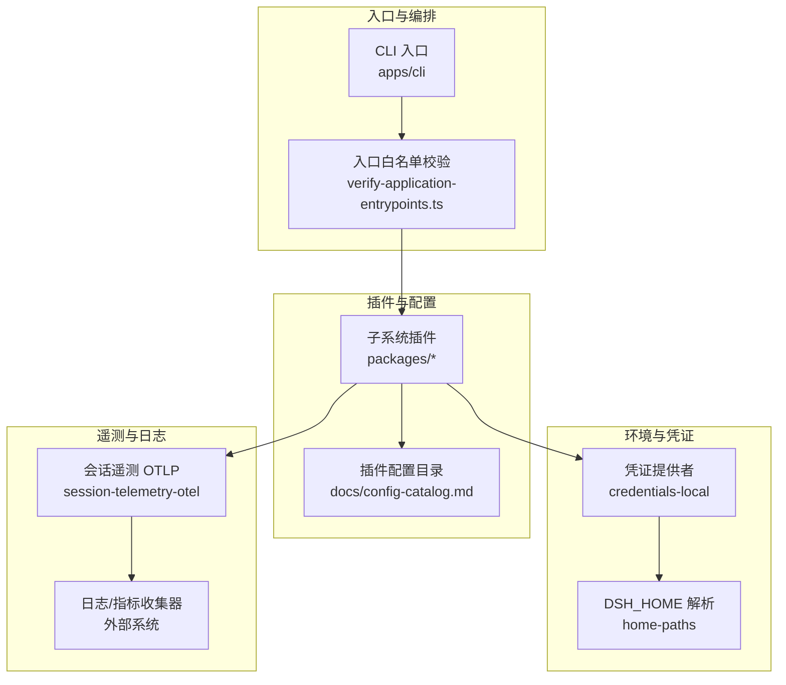
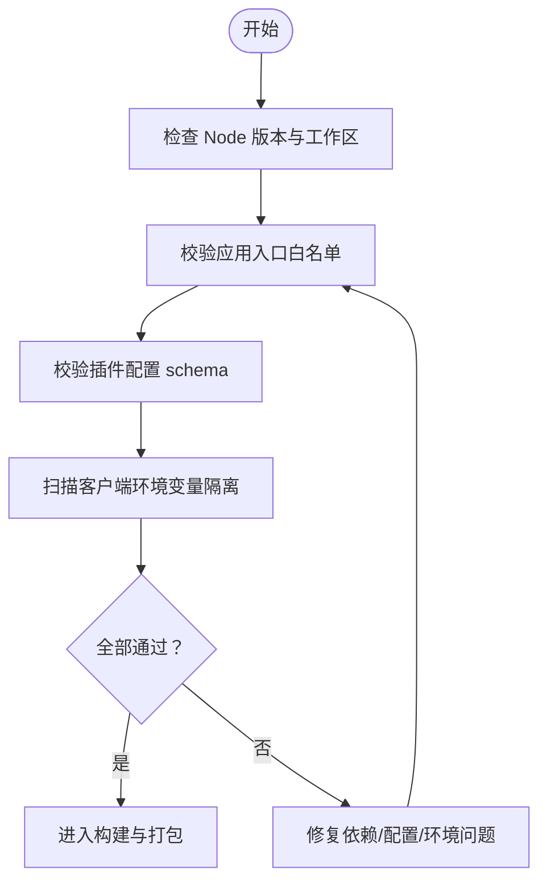
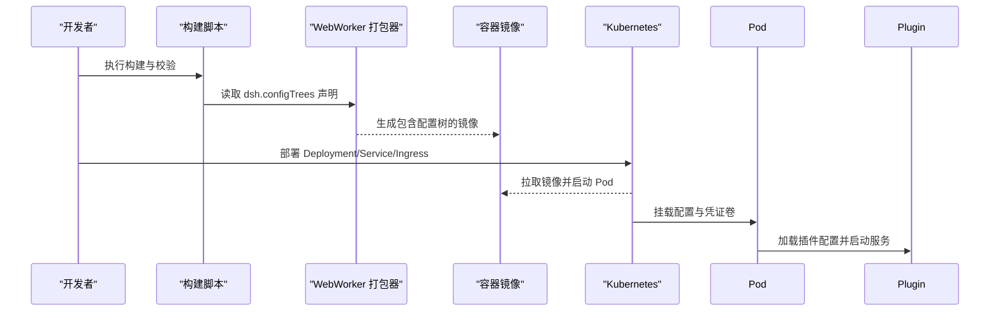
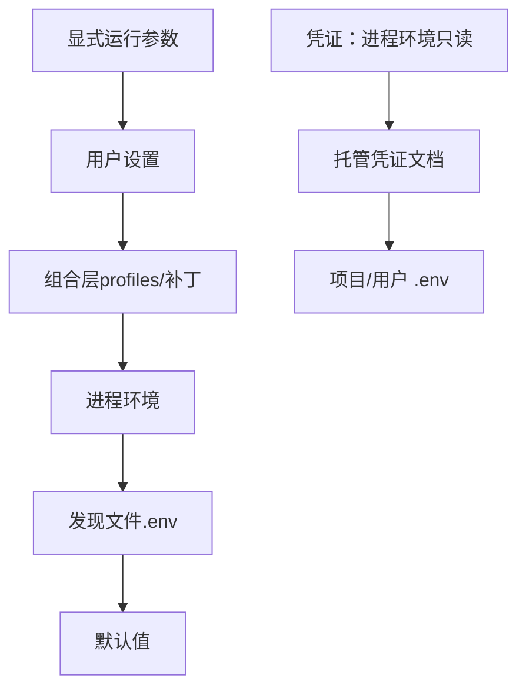
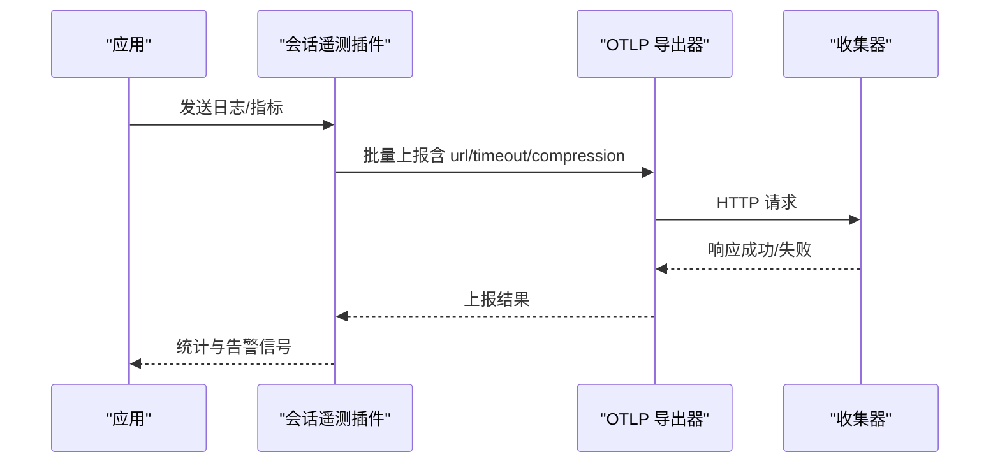
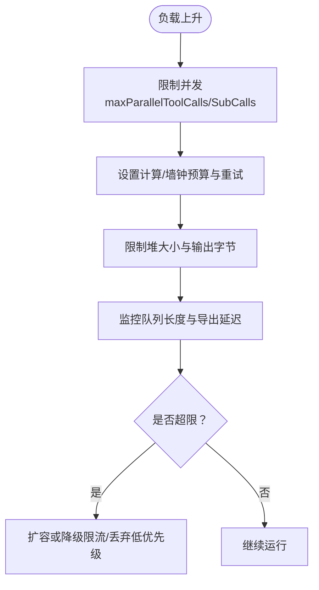
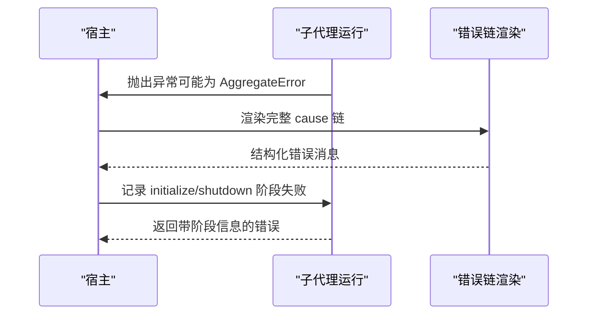
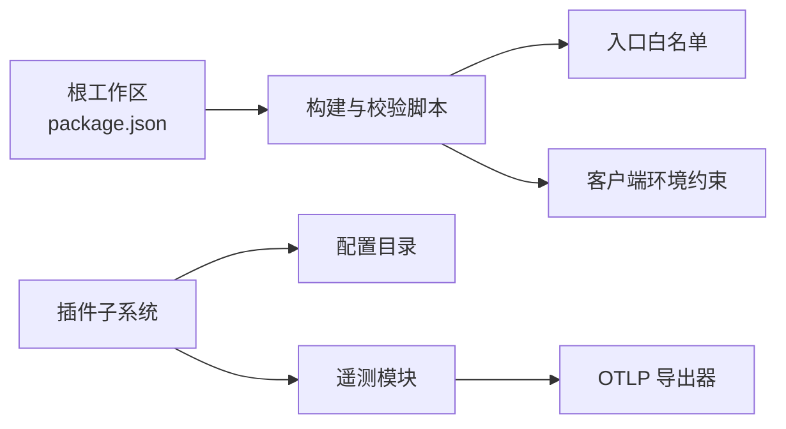

# 生产环境部署与监控

<cite>
**本文引用的文件**
- [package.json](file://package.json)
- [config-catalog.md](file://docs/config-catalog.md)
- [verify-application-entrypoints.ts](file://scripts/verify-application-entrypoints.ts)
- [client-build-environment.client.spec.ts](file://scripts/client-build-environment.client.spec.ts)
- [session-telemetry-otel/index.ts](file://packages/session/session-telemetry-otel/src/index.ts)
- [credentials-local/index.ts](file://packages/credentials/credentials-local/src/index.ts)
- [home-paths.spec.ts](file://packages/util/home-paths/tests/home-paths.spec.ts)
- [architecture note: configuration source ownership](file://.agents/notes/implemented/architecture/2026-08-04-configuration-source-ownership.md)
- [architecture note: credentials yaml and user environment layer](file://.agents/notes/implemented/architecture/2026-08-04-credentials-yaml-and-user-environment-layer.md)
- [error chain diagnostics note](file://.agents/notes/implemented/bug-fix/2026-07-20-error-cause-chain-diagnostics.md)
- [llm error.ts](file://packages/llm/llm/src/error.ts)
- [subagent run.ts](file://packages/subagent/subagent-dsh-sdk/src/run.ts)
- [webworker-packer repository.ts](file://packages/experimental/webworker-packer/src/repository.ts)
</cite>

## 目录
1. [简介](#简介)
2. [项目结构](#项目结构)
3. [核心组件](#核心组件)
4. [架构总览](#架构总览)
5. [详细组件分析](#详细组件分析)
6. [依赖关系分析](#依赖关系分析)
7. [性能考虑](#性能考虑)
8. [故障排除指南](#故障排除指南)
9. [结论](#结论)
10. [附录](#附录)

## 简介
本指南面向在生产环境中部署 DeepSeek Harness SDK 的工程团队，覆盖部署前准备、容器化与编排、配置管理、监控与日志、性能调优与容量规划、高并发应对、故障排除与灾难恢复等主题。内容基于仓库中的构建脚本、插件配置目录、遥测实现、凭证与路径解析、以及错误诊断机制，确保建议可落地且与代码一致。

## 项目结构
- 根工作区通过包管理器与工作区定义组织多语言子项目（Node/TypeScript、Python SDK、原生工具），并提供统一的构建、校验与发布脚本。
- 应用入口由 CLI 提供，并通过严格的白名单策略限制 Node 应用启动方式，保证生产环境的可控性。
- 插件体系以 Cordis 为核心，每个子系统通过配置声明暴露可调参数，形成“配置即部署”的可观测能力。
- 遥测与日志通过 OTLP 导出器接入外部收集系统；凭证与用户环境分层管理，支持热更新与受控覆盖。

**图示来源**
- [package.json:1-196](file://package.json#L1-L196)
- [verify-application-entrypoints.ts:1-30](file://scripts/verify-application-entrypoints.ts#L1-L30)
- [client-build-environment.client.spec.ts:276-290](file://scripts/client-build-environment.client.spec.ts#L276-L290)

**章节来源**
- [package.json:1-196](file://package.json#L1-L196)
- [verify-application-entrypoints.ts:1-30](file://scripts/verify-application-entrypoints.ts#L1-L30)
- [client-build-environment.client.spec.ts:276-290](file://scripts/client-build-environment.client.spec.ts#L276-L290)

## 核心组件
- 构建与发布：根脚本提供构建、类型检查、测试、文档生成与发布流程，统一工程标准。
- 应用入口控制：仅允许通过 dsh 配置文件或指定包装器启动，避免任意 Node 入口进入生产镜像。
- 插件配置目录：集中描述各插件的配置项、依赖服务与默认值，作为部署时的权威参考。
- 遥测与日志：支持 OTLP 导出器与批处理器选项，提供模式开关、超时与关闭时限等生产关键参数。
- 凭证与环境：支持本地凭证文件与用户环境变量分层，具备热重载与受控覆盖能力。
- 路径解析：统一 DSH_HOME 解析与展示，简化跨平台部署路径管理。

**章节来源**
- [package.json:19-155](file://package.json#L19-L155)
- [verify-application-entrypoints.ts:1-30](file://scripts/verify-application-entrypoints.ts#L1-L30)
- [config-catalog.md:1-800](file://docs/config-catalog.md#L1-L800)
- [session-telemetry-otel/index.ts:86-139](file://packages/session/session-telemetry-otel/src/index.ts#L86-L139)
- [credentials-local/index.ts:569-587](file://packages/credentials/credentials-local/src/index.ts#L569-L587)
- [home-paths.spec.ts:1-57](file://packages/util/home-paths/tests/home-paths.spec.ts#L1-L57)

## 架构总览
下图展示了生产部署的关键层次：入口控制、插件配置、凭证与环境、遥测导出、以及外部收集系统。

**图示来源**
- [verify-application-entrypoints.ts:1-30](file://scripts/verify-application-entrypoints.ts#L1-L30)
- [config-catalog.md:1-800](file://docs/config-catalog.md#L1-L800)
- [credentials-local/index.ts:569-587](file://packages/credentials/credentials-local/src/index.ts#L569-L587)
- [home-paths.spec.ts:1-57](file://packages/util/home-paths/tests/home-paths.spec.ts#L1-L57)
- [session-telemetry-otel/index.ts:86-139](file://packages/session/session-telemetry-otel/src/index.ts#L86-L139)

## 详细组件分析

### 部署前准备：依赖检查、配置验证与安全扫描
- 依赖与版本约束：根 package.json 定义了 Node 引擎范围与工作区，确保运行环境与构建工具链一致。
- 入口安全策略：通过入口白名单校验脚本，强制使用 dsh profile 或限定包装器启动，降低任意入口风险。
- 客户端构建环境约束：CI/工作流中禁止将客户端相关环境变量泄露到工作流级环境，防止敏感信息外泄。
- 配置验证：插件配置目录为部署期权威参考，所有字段在加载时经 schema 校验，缺失或非法值会失败并提示。

**图示来源**
- [package.json:8-18](file://package.json#L8-L18)
- [verify-application-entrypoints.ts:1-30](file://scripts/verify-application-entrypoints.ts#L1-L30)
- [client-build-environment.client.spec.ts:276-290](file://scripts/client-build-environment.client.spec.ts#L276-L290)
- [config-catalog.md:1-800](file://docs/config-catalog.md#L1-L800)

**章节来源**
- [package.json:8-18](file://package.json#L8-L18)
- [verify-application-entrypoints.ts:1-30](file://scripts/verify-application-entrypoints.ts#L1-L30)
- [client-build-environment.client.spec.ts:276-290](file://scripts/client-build-environment.client.spec.ts#L276-L290)
- [config-catalog.md:1-800](file://docs/config-catalog.md#L1-L800)

### 容器化部署：Docker 镜像构建、Kubernetes 部署与服务编排
- 镜像构建：利用根脚本进行构建与产物校验，结合 webworker 打包器声明的配置文件树，将部署所需配置注入镜像。
- 配置注入：通过声明式配置树（path/mount/scanRoster）将 YAML 插件行纳入打包清单，确保镜像内配置与源码同步。
- Kubernetes 编排：将插件配置、凭证文件与运行时环境变量挂载至 Pod，使用 Deployment/Service/Ingress 暴露 API 与 Web 界面。
- 健康检查与探针：依据插件配置（如 WebSocket 心跳间隔）设置存活与就绪探针，保障服务可用性。

**图示来源**
- [webworker-packer repository.ts:106-133](file://packages/experimental/webworker-packer/src/repository.ts#L106-L133)
- [config-catalog.md:1-800](file://docs/config-catalog.md#L1-L800)

**章节来源**
- [webworker-packer repository.ts:106-133](file://packages/experimental/webworker-packer/src/repository.ts#L106-L133)
- [config-catalog.md:1-800](file://docs/config-catalog.md#L1-L800)

### 配置管理最佳实践：环境变量、配置中心与动态更新
- 配置优先级：非机密值遵循统一排序（显式运行参数 > 用户设置 > 组合层 > 进程环境 > 发现文件 > 默认值）。
- 凭证优先级：进程环境（只读且最高优先）> 托管凭证文档 > 项目 .env > 用户 .env。
- 动态更新：凭证提供者支持监听文件变更并热发布，减少重启成本。
- 配置中心集成：通过组合层（profile bundles、用户补丁层、--patch 叠加）将外部配置中心注入，保持不可变镜像。

**图示来源**
- [architecture note: configuration source ownership:17-39](file://.agents/notes/implemented/architecture/2026-08-04-configuration-source-ownership.md#L17-L39)
- [architecture note: credentials yaml and user environment layer:28-30](file://.agents/notes/implemented/architecture/2026-08-04-credentials-yaml-and-user-environment-layer.md#L28-L30)
- [credentials-local/index.ts:569-587](file://packages/credentials/credentials-local/src/index.ts#L569-L587)

**章节来源**
- [architecture note: configuration source ownership:17-39](file://.agents/notes/implemented/architecture/2026-08-04-configuration-source-ownership.md#L17-L39)
- [architecture note: credentials yaml and user environment layer:28-30](file://.agents/notes/implemented/architecture/2026-08-04-credentials-yaml-and-user-environment-layer.md#L28-L30)
- [credentials-local/index.ts:569-587](file://packages/credentials/credentials-local/src/index.ts#L569-L587)

### 监控与日志：指标采集、告警配置与故障诊断
- 指标与日志：会话遥测插件支持 OTLP 导出器与批处理器选项，可配置端点、超时、压缩、保活与关闭时限。
- 模式控制：提供禁用/本地/远程等模式，便于不同环境灵活启用遥测。
- 告警建议：基于导出器端点可达性与批处理队列长度设置告警；对关闭超时报警以避免优雅停机失败。
- 故障诊断：错误链渲染保留 cause 链与 AggregateError 成员，便于定位底层传输或网络问题。

**图示来源**
- [session-telemetry-otel/index.ts:86-139](file://packages/session/session-telemetry-otel/src/index.ts#L86-L139)
- [llm error.ts:102-130](file://packages/llm/llm/src/error.ts#L102-L130)

**章节来源**
- [session-telemetry-otel/index.ts:86-139](file://packages/session/session-telemetry-otel/src/index.ts#L86-L139)
- [llm error.ts:102-130](file://packages/llm/llm/src/error.ts#L102-L130)
- [error chain diagnostics note:23-29](file://.agents/notes/implemented/bug-fix/2026-07-20-error-cause-chain-diagnostics.md#L23-L29)

### 性能调优与容量规划：高并发场景应对
- 并发控制：插件配置提供并行调用上限（如工具调用、子调用），避免资源争用与过载。
- 内存与堆限制：代码运行时插件支持最大旧代堆大小与输出字节上限，防止内存泄漏影响稳定性。
- 超时与预算：计算时间预算、墙钟上限与溢出重试策略，保障长时间任务的可控性。
- 容量规划：根据模型上下文窗口与压缩策略估算吞吐，结合批处理队列与导出器超时调整容量。

**图示来源**
- [config-catalog.md:82-112](file://docs/config-catalog.md#L82-L112)
- [config-catalog.md:450-485](file://docs/config-catalog.md#L450-L485)
- [config-catalog.md:487-531](file://docs/config-catalog.md#L487-L531)

**章节来源**
- [config-catalog.md:82-112](file://docs/config-catalog.md#L82-L112)
- [config-catalog.md:450-485](file://docs/config-catalog.md#L450-L485)
- [config-catalog.md:487-531](file://docs/config-catalog.md#L487-L531)

### 故障排除与问题定位
- 错误链渲染：统一渲染 cause 链与 AggregateError 成员，避免掩盖底层失败原因。
- 子代理失败报告：Host 侧错误不会被子观察器替换，确保原始失败可见。
- 初始化/关闭阶段错误：聚合初始化与清理阶段的错误，分别标注阶段以便快速定位。
- 凭证与环境：确认 DSH_HOME 解析与凭证文件路径正确，避免配置未生效。

**图示来源**
- [subagent run.ts:183-217](file://packages/subagent/subagent-dsh-sdk/src/run.ts#L183-L217)
- [llm error.ts:102-130](file://packages/llm/llm/src/error.ts#L102-L130)

**章节来源**
- [subagent run.ts:183-217](file://packages/subagent/subagent-dsh-sdk/src/run.ts#L183-L217)
- [llm error.ts:102-130](file://packages/llm/llm/src/error.ts#L102-L130)
- [error chain diagnostics note:23-29](file://.agents/notes/implemented/bug-fix/2026-07-20-error-cause-chain-diagnostics.md#L23-L29)

### 灾难恢复与业务连续性
- 优雅停机：遥测插件提供关闭超时配置，确保导出器完成数据落盘后再退出。
- 配置回滚：组合层支持补丁叠加与 profile 切换，快速回滚到稳定配置。
- 凭证备份：托管凭证文档与用户 .env 分离，便于备份与恢复。
- 健康检查：基于插件配置（如 WebSocket 心跳）设置探针，自动剔除不健康实例。

**章节来源**
- [session-telemetry-otel/index.ts:86-139](file://packages/session/session-telemetry-otel/src/index.ts#L86-L139)
- [architecture note: configuration source ownership:17-39](file://.agents/notes/implemented/architecture/2026-08-04-configuration-source-ownership.md#L17-L39)
- [credentials-local/index.ts:569-587](file://packages/credentials/credentials-local/src/index.ts#L569-L587)

## 依赖关系分析
- 构建与校验脚本强耦合于根工作区配置，确保入口、客户端环境与插件配置的合规性。
- 插件之间通过服务键依赖声明，配置目录明确列出 Requires 列表，便于编排与最小化部署。
- 遥测模块依赖 OTLP SDK 选项，配置透传以降低侵入性。

**图示来源**
- [package.json:1-196](file://package.json#L1-L196)
- [verify-application-entrypoints.ts:1-30](file://scripts/verify-application-entrypoints.ts#L1-L30)
- [client-build-environment.client.spec.ts:276-290](file://scripts/client-build-environment.client.spec.ts#L276-L290)
- [config-catalog.md:1-800](file://docs/config-catalog.md#L1-L800)
- [session-telemetry-otel/index.ts:86-139](file://packages/session/session-telemetry-otel/src/index.ts#L86-L139)

**章节来源**
- [package.json:1-196](file://package.json#L1-L196)
- [verify-application-entrypoints.ts:1-30](file://scripts/verify-application-entrypoints.ts#L1-L30)
- [client-build-environment.client.spec.ts:276-290](file://scripts/client-build-environment.client.spec.ts#L276-L290)
- [config-catalog.md:1-800](file://docs/config-catalog.md#L1-L800)
- [session-telemetry-otel/index.ts:86-139](file://packages/session/session-telemetry-otel/src/index.ts#L86-L139)

## 性能考虑
- 合理设置并行上限与超时，避免资源耗尽与长尾请求拖垮服务。
- 使用批处理与压缩降低导出开销，关注队列长度与延迟。
- 针对大模型上下文与压缩策略，评估吞吐与存储压力，必要时分片或降级。
- 监控堆大小与输出字节上限，防止内存泄漏导致 OOM。

[本节为通用指导，无需特定文件引用]

## 故障排除指南
- 检查入口白名单是否被绕过，确保仅通过 dsh profile 启动。
- 核对插件配置 schema 校验结果，修复缺失或非法字段。
- 查看遥测导出器端点与超时配置，确认收集器可达。
- 使用错误链渲染定位底层失败，关注 initialize/shutdown 阶段错误。
- 验证 DSH_HOME 与凭证文件路径，确保配置生效。

**章节来源**
- [verify-application-entrypoints.ts:1-30](file://scripts/verify-application-entrypoints.ts#L1-L30)
- [config-catalog.md:1-800](file://docs/config-catalog.md#L1-L800)
- [session-telemetry-otel/index.ts:86-139](file://packages/session/session-telemetry-otel/src/index.ts#L86-L139)
- [subagent run.ts:183-217](file://packages/subagent/subagent-dsh-sdk/src/run.ts#L183-L217)
- [home-paths.spec.ts:1-57](file://packages/util/home-paths/tests/home-paths.spec.ts#L1-L57)

## 结论
通过严格的入口控制、声明式插件配置、分层凭证与环境管理、以及可观测的遥测与日志体系，DeepSeek Harness SDK 在生产环境中可实现高可靠、可观测与易运维的部署。配合合理的性能调优与容量规划，能够支撑高并发场景下的稳定运行，并在故障发生时快速定位与恢复。

[本节为总结，无需特定文件引用]

## 附录
- 常用命令：构建、类型检查、测试、文档生成与发布流程见根脚本。
- 配置参考：插件配置目录为部署期权威参考，按需裁剪与覆盖。
- 安全建议：最小权限原则、密钥外置、网络白名单与审计日志。

[本节为补充信息，无需特定文件引用]