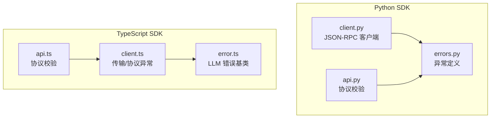
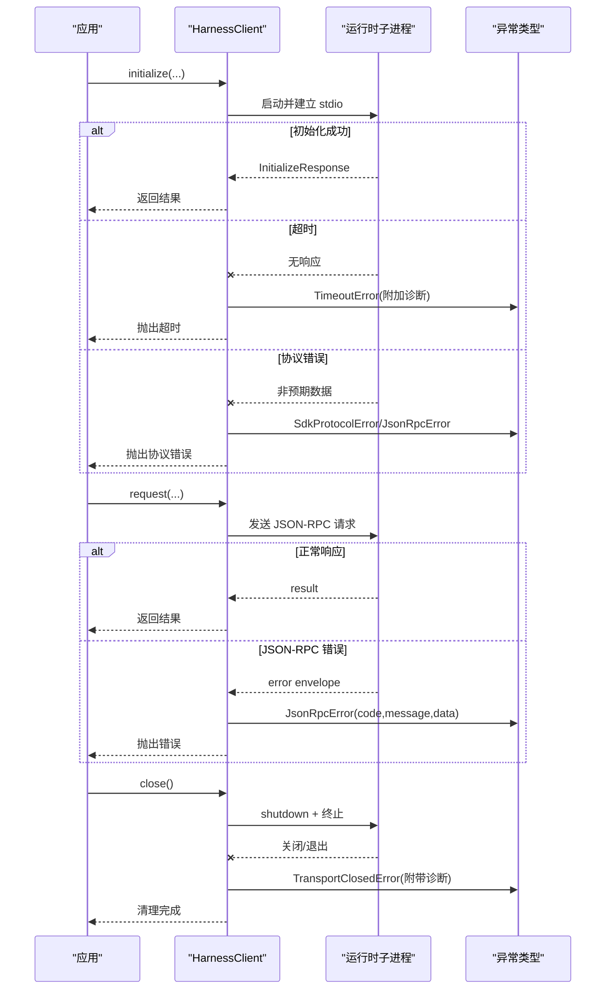
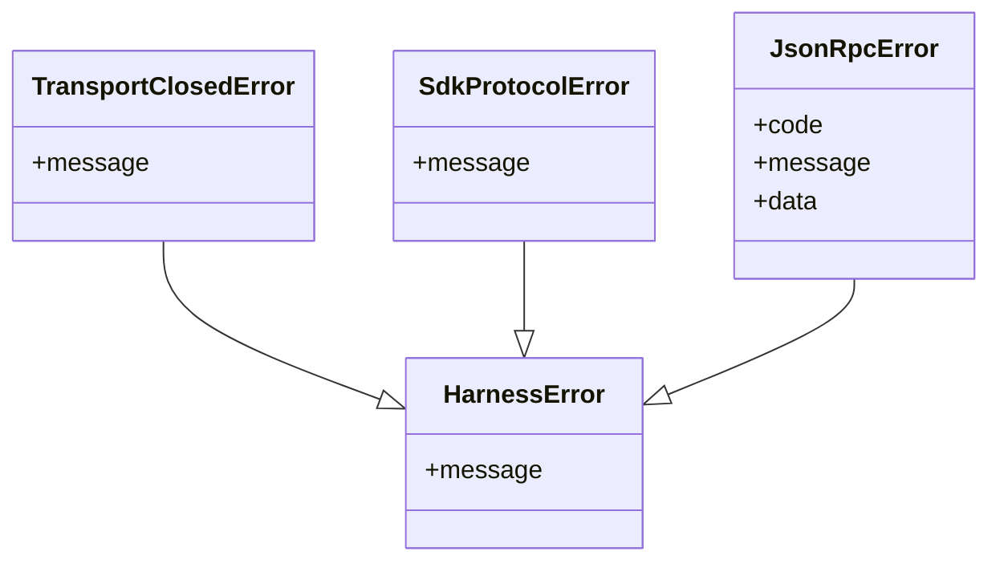
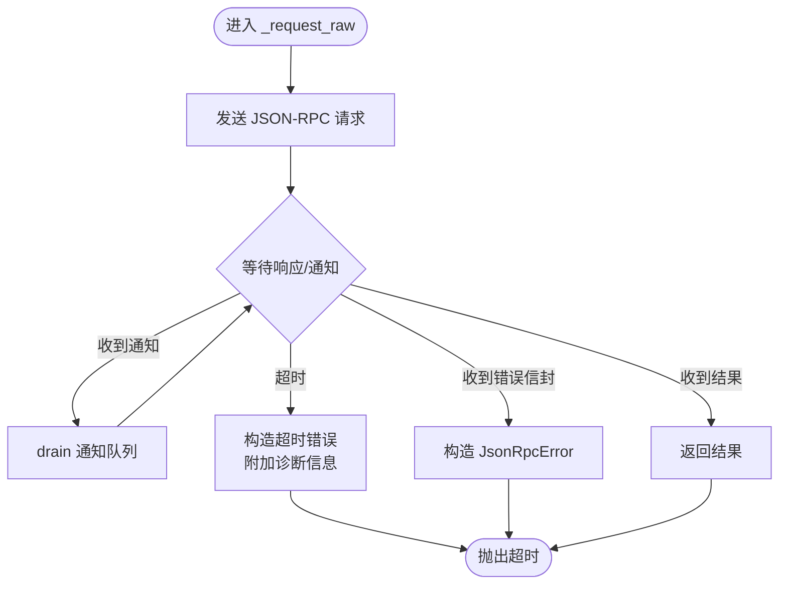
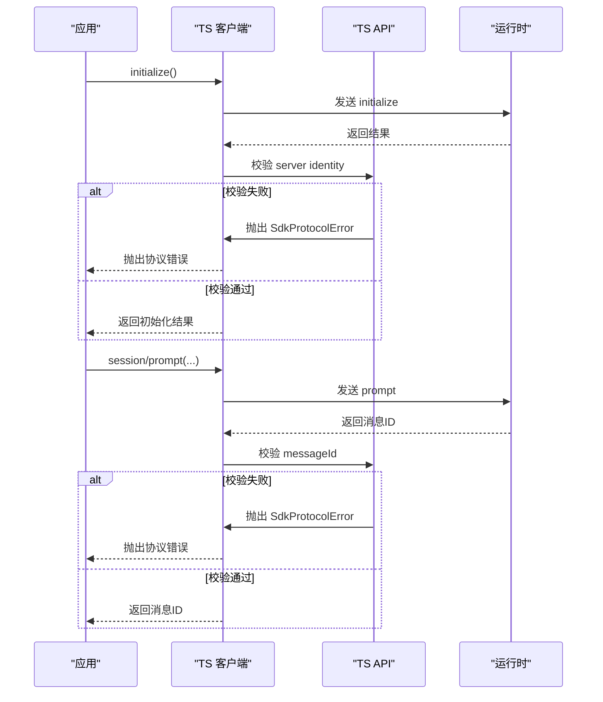
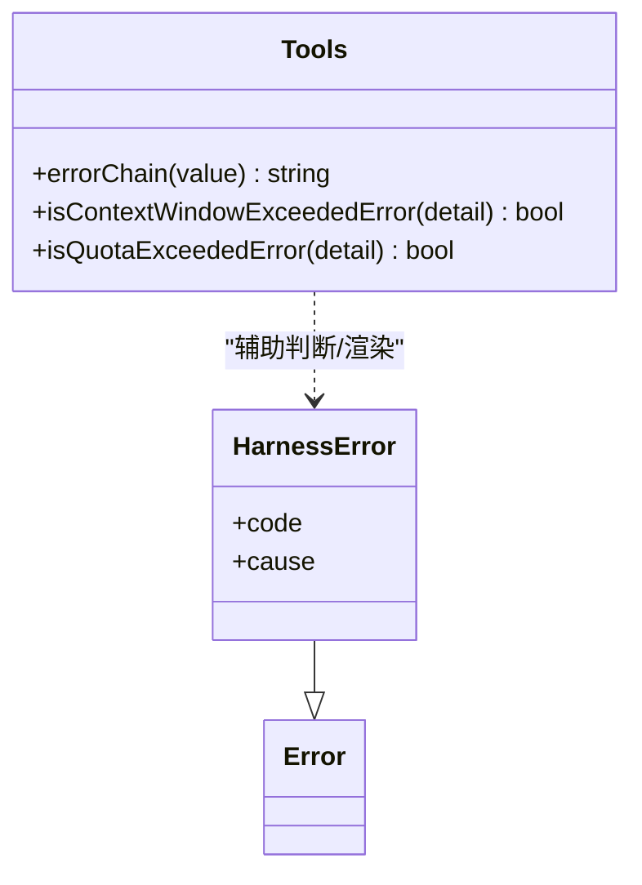
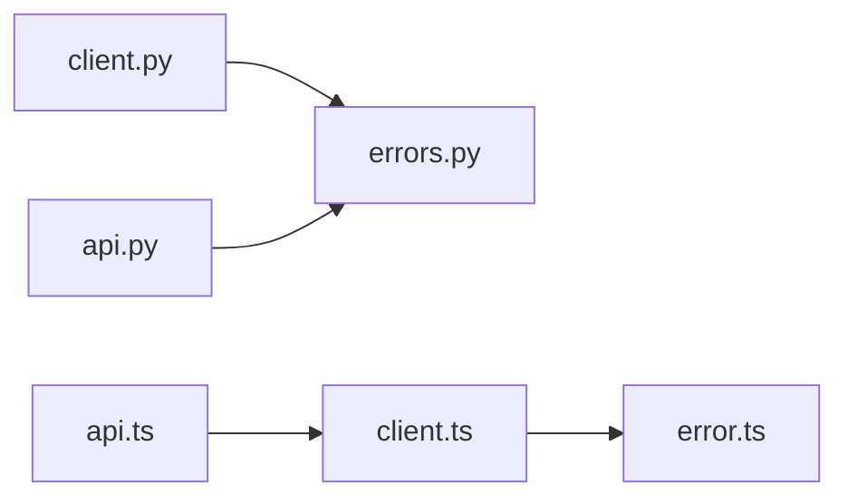

# 错误处理与异常管理

<cite>
**本文引用的文件**
- [errors.py](file://python/sdk/src/deepseek_harness/errors.py)
- [client.py](file://python/sdk/src/deepseek_harness/client.py)
- [api.py](file://python/sdk/src/deepseek_harness/api.py)
- [client.ts](file://packages/sdk/client/src/client.ts)
- [api.ts](file://packages/sdk/client/src/api.ts)
- [error.ts](file://packages/llm/llm/src/error.ts)
</cite>

## 目录
1. [简介](#简介)
2. [项目结构](#项目结构)
3. [核心组件](#核心组件)
4. [架构总览](#架构总览)
5. [详细组件分析](#详细组件分析)
6. [依赖关系分析](#依赖关系分析)
7. [性能考虑](#性能考虑)
8. [故障排查指南](#故障排查指南)
9. [结论](#结论)
10. [附录](#附录)

## 简介
本指南聚焦 DeepSeek Harness SDK 的错误处理与异常管理，覆盖 Python 与 TypeScript 两套实现。文档说明 SDK 中定义的异常层次结构（HarnessError、TransportClosedError、SdkProtocolError、JsonRpcError）的用途与处理方式，给出异常捕获的最佳实践模式（try-catch 使用、异常信息提取与日志记录），并解释不同错误类型的恢复策略（连接重试、超时处理、降级方案）。同时提供具体代码示例路径，展示如何在应用程序中集成自定义错误处理逻辑。

## 项目结构
围绕错误处理的核心文件分布如下：
- Python SDK
  - 异常定义：python/sdk/src/deepseek_harness/errors.py
  - 运行时客户端与 JSON-RPC 交互：python/sdk/src/deepseek_harness/client.py
  - 协议校验与业务层抛错：python/sdk/src/deepseek_harness/api.py
- TypeScript SDK
  - 传输与协议异常：packages/sdk/client/src/client.ts
  - 协议校验与业务层抛错：packages/sdk/client/src/api.ts
  - LLM 层通用错误基类与工具：packages/llm/llm/src/error.ts

图表来源
- [errors.py:4-24](file://python/sdk/src/deepseek_harness/errors.py#L4-L24)
- [client.py:17-18](file://python/sdk/src/deepseek_harness/client.py#L17-L18)
- [api.py:246-246](file://python/sdk/src/deepseek_harness/api.py#L246-L246)
- [client.ts:39-64](file://packages/sdk/client/src/client.ts#L39-L64)
- [api.ts:239-281](file://packages/sdk/client/src/api.ts#L239-L281)
- [error.ts:13-22](file://packages/llm/llm/src/error.ts#L13-L22)

章节来源
- [errors.py:4-24](file://python/sdk/src/deepseek_harness/errors.py#L4-L24)
- [client.py:17-18](file://python/sdk/src/deepseek_harness/client.py#L17-L18)
- [api.py:246-246](file://python/sdk/src/deepseek_harness/api.py#L246-L246)
- [client.ts:39-64](file://packages/sdk/client/src/client.ts#L39-L64)
- [api.ts:239-281](file://packages/sdk/client/src/api.ts#L239-L281)
- [error.ts:13-22](file://packages/llm/llm/src/error.ts#L13-L22)

## 核心组件
- Python 异常层次
  - HarnessError：SDK 与运行时失败的基类
  - TransportClosedError：运行时子进程退出或 stdout 关闭时抛出
  - SdkProtocolError：运行时发送的数据不符合 SDK 协议时抛出
  - JsonRpcError：运行时返回 JSON-RPC 错误响应时抛出，携带 code/message/data
- TypeScript 异常层次
  - HarnessError（LLM 包）：带稳定机器可读 code 的基类，支持 cause 链
  - TransportClosedError：传输关闭/不可用
  - SdkProtocolError：SDK 协议数据不合法
- 客户端与请求流程
  - Python HarnessClient：通过 stdio 发起 JSON-RPC 请求，维护通知订阅、超时控制、诊断信息收集
  - TypeScript client：封装传输层与协议层，统一抛出上述异常

章节来源
- [errors.py:4-24](file://python/sdk/src/deepseek_harness/errors.py#L4-L24)
- [client.ts:39-64](file://packages/sdk/client/src/client.ts#L39-L64)
- [error.ts:13-22](file://packages/llm/llm/src/error.ts#L13-L22)

## 架构总览
下图展示了 Python SDK 在初始化、请求与关闭过程中的异常传播路径，以及诊断信息的注入点。

图表来源
- [client.py:133-170](file://python/sdk/src/deepseek_harness/client.py#L133-L170)
- [client.py:191-330](file://python/sdk/src/deepseek_harness/client.py#L191-L330)
- [client.py:332-343](file://python/sdk/src/deepseek_harness/client.py#L332-L343)
- [client.py:352-369](file://python/sdk/src/deepseek_harness/client.py#L352-L369)
- [client.py:420-456](file://python/sdk/src/deepseek_harness/client.py#L420-L456)

## 详细组件分析

### Python 异常层次与用途
- HarnessError：所有 SDK/运行时异常的基类，便于统一捕获与分类
- TransportClosedError：当运行时子进程退出、stdout 关闭或写入失败时抛出；包含诊断信息（退出码、stderr 尾部）
- SdkProtocolError：当运行时返回的数据不符合 SDK 协议约定时抛出（例如字段缺失、类型不符）
- JsonRpcError：当运行时返回 JSON-RPC error envelope 时抛出，携带 code、message、data，便于上层按错误码路由

图表来源
- [errors.py:4-24](file://python/sdk/src/deepseek_harness/errors.py#L4-L24)

章节来源
- [errors.py:4-24](file://python/sdk/src/deepseek_harness/errors.py#L4-L24)

### Python 客户端错误流与诊断
- 初始化阶段：若超时则关闭客户端并抛出超时错误，附加所选 profile 信息；若为 JSON-RPC 错误且存在诊断信息，会追加到 message 中
- 请求阶段：对每个请求维护等待队列与通知订阅；超时将清理状态并抛出超时错误；收到 JSON-RPC error 时转换为 JsonRpcError
- 传输阶段：写入失败或运行时已关闭时抛出 TransportClosedError，并附带诊断信息
- 关闭阶段：尝试优雅关闭，必要时强制终止；最后向所有等待者广播关闭异常

图表来源
- [client.py:262-330](file://python/sdk/src/deepseek_harness/client.py#L262-L330)
- [client.py:332-343](file://python/sdk/src/deepseek_harness/client.py#L332-L343)
- [client.py:352-369](file://python/sdk/src/deepseek_harness/client.py#L352-L369)
- [client.py:420-456](file://python/sdk/src/deepseek_harness/client.py#L420-L456)

章节来源
- [client.py:133-170](file://python/sdk/src/deepseek_harness/client.py#L133-L170)
- [client.py:191-330](file://python/sdk/src/deepseek_harness/client.py#L191-L330)
- [client.py:332-343](file://python/sdk/src/deepseek_harness/client.py#L332-L343)
- [client.py:352-369](file://python/sdk/src/deepseek_harness/client.py#L352-L369)
- [client.py:420-456](file://python/sdk/src/deepseek_harness/client.py#L420-L456)

### TypeScript 异常与协议校验
- TransportClosedError：表示传输通道不可用或已关闭
- SdkProtocolError：用于校验 initialize、session/prompt 等返回结构是否完整、合法
- 在 api.ts 中对 turn/end、assistant/message 等事件进行严格校验，不合法即抛出 SdkProtocolError

图表来源
- [client.ts:280-307](file://packages/sdk/client/src/client.ts#L280-L307)
- [api.ts:239-281](file://packages/sdk/client/src/api.ts#L239-L281)

章节来源
- [client.ts:39-64](file://packages/sdk/client/src/client.ts#L39-L64)
- [client.ts:280-307](file://packages/sdk/client/src/client.ts#L280-L307)
- [api.ts:239-281](file://packages/sdk/client/src/api.ts#L239-L281)

### LLM 层错误基类与工具
- HarnessError（LLM 包）：提供稳定的 machine-routable code，便于跨层传递与路由
- errorChain：将错误及其 cause 链渲染为人类可读字符串，适合日志与诊断输出
- isContextWindowExceededError / isQuotaExceededError：识别上下文超限与配额耗尽等特定错误语义

图表来源
- [error.ts:13-22](file://packages/llm/llm/src/error.ts#L13-L22)
- [error.ts:80-100](file://packages/llm/llm/src/error.ts#L80-L100)
- [error.ts:114-154](file://packages/llm/llm/src/error.ts#L114-L154)

章节来源
- [error.ts:13-22](file://packages/llm/llm/src/error.ts#L13-L22)
- [error.ts:80-100](file://packages/llm/llm/src/error.ts#L80-L100)
- [error.ts:114-154](file://packages/llm/llm/src/error.ts#L114-L154)

## 依赖关系分析
- Python SDK
  - client.py 依赖 errors.py 中的异常类型，并在多处构造和抛出这些异常
  - api.py 在协议校验失败时抛出 SdkProtocolError
- TypeScript SDK
  - client.ts 定义并抛出 TransportClosedError、SdkProtocolError
  - api.ts 在解析/校验服务端返回时使用 SdkProtocolError
  - LLM error.ts 提供统一的 HarnessError 基类与错误工具函数

图表来源
- [client.py:17-18](file://python/sdk/src/deepseek_harness/client.py#L17-L18)
- [api.py:246-246](file://python/sdk/src/deepseek_harness/api.py#L246-L246)
- [client.ts:39-64](file://packages/sdk/client/src/client.ts#L39-L64)
- [api.ts:239-281](file://packages/sdk/client/src/api.ts#L239-L281)
- [error.ts:13-22](file://packages/llm/llm/src/error.ts#L13-L22)

章节来源
- [client.py:17-18](file://python/sdk/src/deepseek_harness/client.py#L17-L18)
- [api.py:246-246](file://python/sdk/src/deepseek_harness/api.py#L246-L246)
- [client.ts:39-64](file://packages/sdk/client/src/client.ts#L39-L64)
- [api.ts:239-281](file://packages/sdk/client/src/api.ts#L239-L281)
- [error.ts:13-22](file://packages/llm/llm/src/error.ts#L13-L22)

## 性能考虑
- 避免在热路径中频繁创建异常对象；仅在真正错误分支抛出
- 合理设置超时时间，避免长时间阻塞；Python 客户端在请求循环中结合通知 drain 与剩余时间计算，减少空转
- 诊断信息（stderr 尾部、退出码）仅在构建错误时拼接，避免无谓开销
- 通知订阅采用队列与过滤器，降低无关消息的处理成本

[本节为通用指导，不直接分析具体文件]

## 故障排查指南
- 常见错误类型与定位
  - TransportClosedError：检查运行时子进程是否存活、stdin/stdout 是否可用；查看诊断中的退出码与 stderr 尾部
  - JsonRpcError：根据 code/message/data 定位服务端错误原因；必要时结合初始化阶段的诊断信息
  - SdkProtocolError：检查服务端返回结构是否符合 SDK 协议；确认字段是否存在、类型是否正确
  - 超时错误：检查网络/进程调度、资源竞争；适当增大超时或优化服务端响应
- 建议的 try-catch 模式
  - 外层捕获通用异常，内层按异常类型细分处理
  - 对 TransportClosedError 执行重连或降级；对 JsonRpcError 依据 code 路由；对 SdkProtocolError 上报并阻断后续流程
  - 记录异常链与诊断信息，便于问题回溯
- 恢复策略
  - 连接重试：对瞬时性错误（如连接中断）采用指数退避重试
  - 超时处理：区分初始化超时与请求超时，分别调整策略
  - 降级方案：在无法访问远程服务时切换到本地缓存或只读模式

章节来源
- [client.py:133-170](file://python/sdk/src/deepseek_harness/client.py#L133-L170)
- [client.py:191-330](file://python/sdk/src/deepseek_harness/client.py#L191-L330)
- [client.py:332-343](file://python/sdk/src/deepseek_harness/client.py#L332-L343)
- [client.py:352-369](file://python/sdk/src/deepseek_harness/client.py#L352-L369)
- [client.py:420-456](file://python/sdk/src/deepseek_harness/client.py#L420-L456)
- [api.py:246-246](file://python/sdk/src/deepseek_harness/api.py#L246-L246)
- [client.ts:280-307](file://packages/sdk/client/src/client.ts#L280-L307)
- [api.ts:239-281](file://packages/sdk/client/src/api.ts#L239-L281)

## 结论
DeepSeek Harness SDK 通过清晰的异常层次与严格的协议校验，提供了可观测、可路由、可恢复的错误处理能力。Python 与 TypeScript 实现在关键路径上均实现了诊断信息注入与合理的超时控制。应用层应基于异常类型实施差异化处理：对传输层错误进行重连与降级，对协议层错误进行快速失败与上报，对 JSON-RPC 错误按码路由并记录上下文。借助统一的错误基类与工具函数，可在多语言环境中保持一致的错误语义与诊断体验。

[本节为总结性内容，不直接分析具体文件]

## 附录
- 最佳实践清单
  - 始终捕获并记录异常链，保留 cause 信息
  - 对 TransportClosedError 实施重试与降级
  - 对 JsonRpcError 依据 code 进行分类处理
  - 对 SdkProtocolError 立即停止当前流程并上报
  - 合理配置超时与重试参数，避免雪崩
- 参考实现位置
  - Python 异常定义：errors.py
  - Python 客户端错误流：client.py
  - Python 协议校验：api.py
  - TypeScript 传输/协议异常：client.ts
  - TypeScript 协议校验：api.ts
  - LLM 错误基类与工具：error.ts

章节来源
- [errors.py:4-24](file://python/sdk/src/deepseek_harness/errors.py#L4-L24)
- [client.py:133-170](file://python/sdk/src/deepseek_harness/client.py#L133-L170)
- [client.py:191-330](file://python/sdk/src/deepseek_harness/client.py#L191-L330)
- [client.py:332-343](file://python/sdk/src/deepseek_harness/client.py#L332-L343)
- [client.py:352-369](file://python/sdk/src/deepseek_harness/client.py#L352-L369)
- [client.py:420-456](file://python/sdk/src/deepseek_harness/client.py#L420-L456)
- [api.py:246-246](file://python/sdk/src/deepseek_harness/api.py#L246-L246)
- [client.ts:39-64](file://packages/sdk/client/src/client.ts#L39-L64)
- [client.ts:280-307](file://packages/sdk/client/src/client.ts#L280-L307)
- [api.ts:239-281](file://packages/sdk/client/src/api.ts#L239-L281)
- [error.ts:13-22](file://packages/llm/llm/src/error.ts#L13-L22)
- [error.ts:80-100](file://packages/llm/llm/src/error.ts#L80-L100)
- [error.ts:114-154](file://packages/llm/llm/src/error.ts#L114-L154)