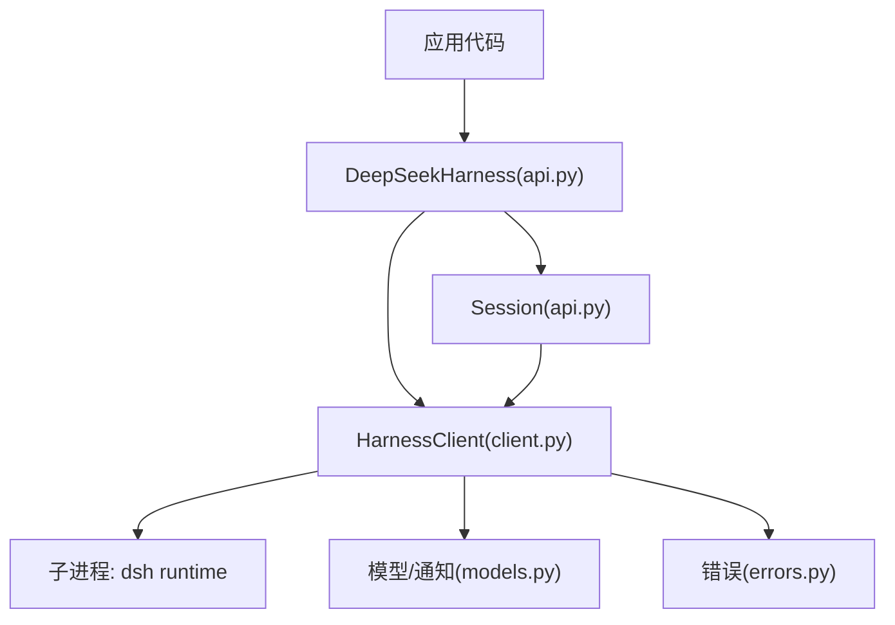
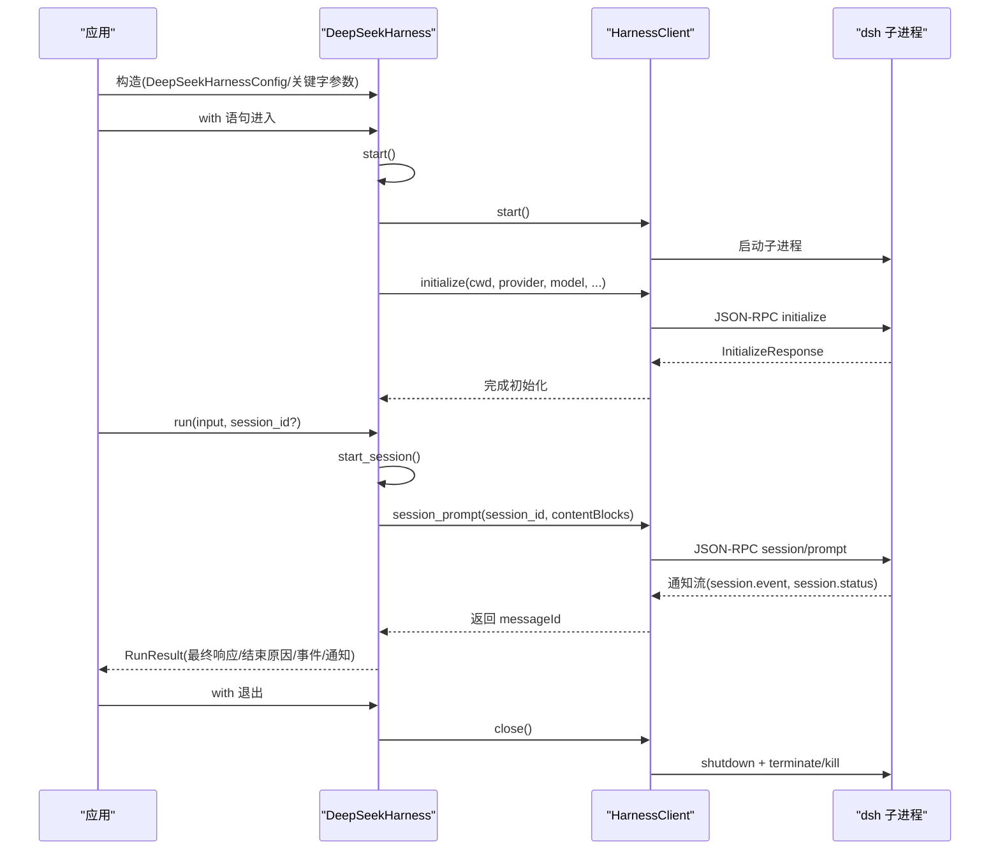
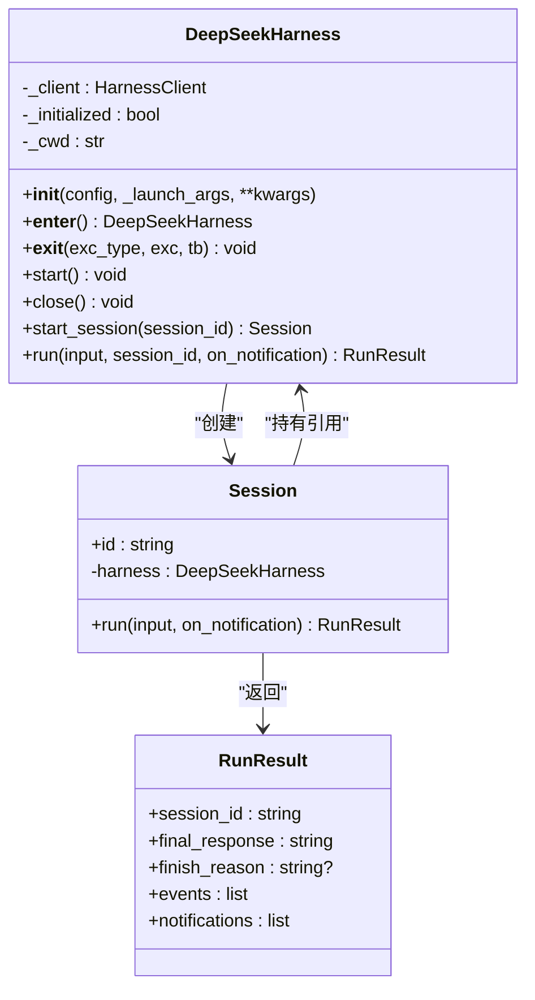
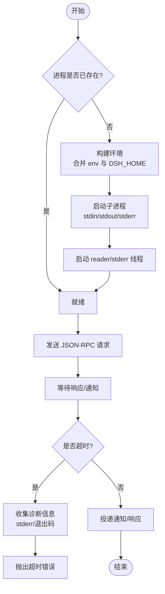
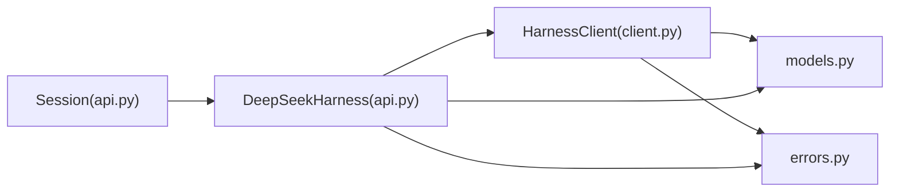

# DeepSeekHarness主类

<cite>
**本文引用的文件**
- [api.py](file://python/sdk/src/deepseek_harness/api.py)
- [client.py](file://python/sdk/src/deepseek_harness/client.py)
- [models.py](file://python/sdk/src/deepseek_harness/models.py)
- [errors.py](file://python/sdk/src/deepseek_harness/errors.py)
- [__init__.py](file://python/sdk/src/deepseek_harness/__init__.py)
- [minimal.py](file://python/sdk/examples/minimal.py)
</cite>

## 目录
1. [简介](#简介)
2. [项目结构](#项目结构)
3. [核心组件](#核心组件)
4. [架构总览](#架构总览)
5. [详细组件分析](#详细组件分析)
6. [依赖关系分析](#依赖关系分析)
7. [性能考量](#性能考量)
8. [故障排查指南](#故障排查指南)
9. [结论](#结论)
10. [附录：使用示例与最佳实践](#附录使用示例与最佳实践)

## 简介
DeepSeekHarness 是 Python SDK 的顶层同步接口，用于启动并管理本地 DeepSeek Harness SDK 运行时进程，提供会话创建、消息发送、通知订阅以及资源清理等能力。它封装了进程生命周期（启动、初始化、关闭）、配置合并与环境注入、以及与运行时的 JSON-RPC 通信细节，使上层应用可以以“上下文管理器”的方式安全地发起一次或多次对话轮次。

## 项目结构
Python SDK 的核心位于 python/sdk/src/deepseek_harness 目录下，关键文件职责如下：
- api.py：暴露 DeepSeekHarness、Session、RunResult、DeepSeekHarnessConfig 等高层 API。
- client.py：实现 HarnessClient，负责子进程启动、JSON-RPC 请求/响应、通知订阅、超时与错误处理。
- models.py：定义通用数据结构（Notification、IncomingRequest、InitializeResponse 等）。
- errors.py：定义异常类型（TransportClosedError、JsonRpcError、SdkProtocolError 等）。
- __init__.py：对外导出公共符号。
- examples/minimal.py：最小可运行示例，展示上下文管理器用法。

图表来源
- [api.py:49-132](file://python/sdk/src/deepseek_harness/api.py#L49-L132)
- [client.py:39-170](file://python/sdk/src/deepseek_harness/client.py#L39-L170)
- [models.py:13-33](file://python/sdk/src/deepseek_harness/models.py#L13-L33)
- [errors.py:4-24](file://python/sdk/src/deepseek_harness/errors.py#L4-L24)

章节来源
- [api.py:1-249](file://python/sdk/src/deepseek_harness/api.py#L1-L249)
- [client.py:1-590](file://python/sdk/src/deepseek_harness/client.py#L1-L590)
- [models.py:1-33](file://python/sdk/src/deepseek_harness/models.py#L1-L33)
- [errors.py:1-24](file://python/sdk/src/deepseek_harness/errors.py#L1-L24)
- [__init__.py:1-20](file://python/sdk/src/deepseek_harness/__init__.py#L1-L20)
- [minimal.py:1-49](file://python/sdk/examples/minimal.py#L1-L49)

## 核心组件
- DeepSeekHarness：高层入口，负责配置管理、进程生命周期（start/close）、会话创建与 run 调用。
- Session：封装单次会话的消息发送与结果收集。
- RunResult：封装最终响应、结束原因、事件与通知列表。
- HarnessClient：底层 JSON-RPC 客户端，管理子进程、读写线程、通知订阅、超时与诊断信息。
- 配置对象：DeepSeekHarnessConfig（用户级）与 HarnessConfig（运行时级）。

章节来源
- [api.py:13-132](file://python/sdk/src/deepseek_harness/api.py#L13-L132)
- [client.py:24-170](file://python/sdk/src/deepseek_harness/client.py#L24-L170)

## 架构总览
DeepSeekHarness 通过组合 HarnessClient 来管理一个独立的 dsh 子进程。构造时合并配置与环境变量；首次使用时惰性启动进程并完成 initialize；每次 run 会创建或复用 Session 并通过 session/prompt 发起请求；结束时通过 close 优雅关闭子进程并回收资源。

图表来源
- [api.py:57-132](file://python/sdk/src/deepseek_harness/api.py#L57-L132)
- [client.py:71-170](file://python/sdk/src/deepseek_harness/client.py#L71-L170)

## 详细组件分析

### DeepSeekHarness 类
- 设计模式
  - 组合模式：内部持有 HarnessClient，将进程通信细节委托给客户端。
  - 上下文管理器模式：实现 __enter__/__exit__，确保 start/close 成对执行，避免资源泄漏。
  - 惰性启动：仅在需要时启动进程与初始化，减少冷启动开销。
- 构造函数参数
  - config：可选的 DeepSeekHarnessConfig 对象。
  - _launch_args：内部调试/测试用，用于覆盖默认启动参数。
  - **kwargs：支持直接传入配置字段（provider/model/reasoning_effort/max_tokens/cwd/runtime_cwd/dsh_bin/profile/patches/dsh_home/env/initialize_timeout_seconds/request_timeout_seconds/shutdown_timeout_seconds/base_url/api_key），与 config 互斥。
  - 环境变量注入：若提供 base_url/api_key，则写入 DEEPSEEK_BASE_URL/DEEPSEEK_API_KEY 到子进程环境。
- 上下文管理器
  - __enter__：调用 start()，保证实例可用后返回 self。
  - __exit__：调用 close()，确保资源释放。
- start() 工作流程
  - 若已初始化则直接返回。
  - 调用 HarnessClient.start() 启动子进程。
  - 调用 HarnessClient.initialize() 传递 cwd/provider/model/reasoning_effort/max_tokens。
  - 标记为已初始化。
- close() 资源清理
  - 委托 HarnessClient.close()，后者会尝试 graceful shutdown，必要时 terminate/kill，并等待线程回收。
- 会话创建与运行
  - start_session(session_id?)：确保已启动，生成或复用 session_id，返回 Session 实例。
  - run(input, session_id?, on_notification?)：内部委托 Session.run，简化单次调用。

图表来源
- [api.py:13-132](file://python/sdk/src/deepseek_harness/api.py#L13-L132)

章节来源
- [api.py:13-132](file://python/sdk/src/deepseek_harness/api.py#L13-L132)

### HarnessClient 类
- 职责
  - 子进程管理：启动、标准输入输出/错误流读取、线程化读循环。
  - JSON-RPC 通信：request/notify/respond/respond_error，带超时控制。
  - 通知系统：全局订阅与会话树订阅，过滤与投递。
  - 错误与诊断：统一包装 TransportClosedError/JsonRpcError，附加 stderr 尾部与退出码。
- 关键流程
  - start()：复制环境、解析默认启动参数、启动子进程、启动 reader/stderr 线程。
  - initialize()：发送 initialize 请求，携带 cwd/provider/model/reasoning_effort/maxTokens；失败时附带诊断信息并关闭。
  - session_prompt()：发送 session/prompt，返回 messageId，支持通知订阅。
  - request()：封装 _request_raw，按 response_model 校验返回值。
  - close()：先尝试 shutdown，再关闭 stdin，必要时 terminate/kill，最后清理线程与状态。
  - 通知订阅：subscribe_notifications()/subscribe_session_notifications()，基于会话父子关系过滤。
  - 诊断：在超时或传输关闭时，附加子进程退出码与 stderr 尾部。

图表来源
- [client.py:71-170](file://python/sdk/src/deepseek_harness/client.py#L71-L170)
- [client.py:191-330](file://python/sdk/src/deepseek_harness/client.py#L191-L330)
- [client.py:437-456](file://python/sdk/src/deepseek_harness/client.py#L437-L456)

章节来源
- [client.py:24-590](file://python/sdk/src/deepseek_harness/client.py#L24-L590)

### 配置管理
- DeepSeekHarnessConfig（用户级）
  - 字段包括 provider、model、reasoning_effort、max_tokens、cwd、runtime_cwd、dsh_bin、profile、patches、dsh_home、env、initialize_timeout_seconds、request_timeout_seconds、shutdown_timeout_seconds、base_url、api_key。
  - 作用：决定运行时行为、工作目录、超时策略、API 凭据与环境注入。
- HarnessConfig（运行时级）
  - 字段包括 dsh_bin、profile、patches、dsh_home、cwd、env、initialize_timeout_seconds、request_timeout_seconds、shutdown_timeout_seconds。
  - 作用：驱动子进程启动参数与环境，包含 dsh 二进制路径、配置文件集、补丁、工作目录与超时。
- 环境变量注入
  - 当 DeepSeekHarnessConfig 提供 base_url/api_key 时，会写入 DEEPSEEK_BASE_URL/DEEPSEEK_API_KEY 到子进程环境，便于远程服务访问。
- 工作目录
  - cwd 用于应用当前目录；runtime_cwd 用于子进程工作目录，未指定时回退到 cwd。

章节来源
- [api.py:13-38](file://python/sdk/src/deepseek_harness/api.py#L13-L38)
- [api.py:57-89](file://python/sdk/src/deepseek_harness/api.py#L57-L89)
- [client.py:24-37](file://python/sdk/src/deepseek_harness/client.py#L24-L37)
- [client.py:458-486](file://python/sdk/src/deepseek_harness/client.py#L458-L486)

### 进程生命周期管理
- 启动时机
  - 惰性启动：首次调用 start()/start_session()/run() 时触发。
- 初始化
  - initialize() 必须成功，否则自动关闭并抛出带诊断的错误。
- 关闭
  - close() 优先尝试 graceful shutdown，随后关闭 stdin，必要时 terminate/kill，并等待线程回收。
- 线程与队列
  - 独立 reader/stderr 线程持续消费子进程输出，维护通知队列与请求队列，保证并发安全。

章节来源
- [client.py:71-132](file://python/sdk/src/deepseek_harness/client.py#L71-L132)
- [client.py:344-431](file://python/sdk/src/deepseek_harness/client.py#L344-L431)

### 会话创建与运行
- 会话创建
  - start_session(session_id?)：自动生成或复用 session_id，返回 Session。
- 消息发送与结果收集
  - Session.run() 将输入标准化为内容块，订阅会话通知，发送 session/prompt，等待收到 inbox receipt 后继续收集直到 session.status=idle。
  - 从事件中提取 final_response 与 finish_reason。
- 通知过滤
  - 基于会话父子关系过滤通知，确保只接收相关会话及其子代理的通知。

章节来源
- [api.py:120-189](file://python/sdk/src/deepseek_harness/api.py#L120-L189)
- [client.py:172-189](file://python/sdk/src/deepseek_harness/client.py#L172-L189)
- [client.py:506-536](file://python/sdk/src/deepseek_harness/client.py#L506-L536)

### 错误处理
- 异常层次
  - HarnessError：基类。
  - TransportClosedError：子进程退出或 stdout 关闭。
  - SdkProtocolError：协议层数据不符合预期（如 turn/end 缺少 reason.kind）。
  - JsonRpcError：运行时返回 JSON-RPC 错误，包含 code/message/data。
- 错误传播
  - 初始化失败：捕获超时/异常，附加诊断信息并关闭。
  - 请求超时：收集 stderr 尾部与退出码，抛出超时错误。
  - 传输关闭：统一包装为 TransportClosedError 并附带诊断。

章节来源
- [errors.py:4-24](file://python/sdk/src/deepseek_harness/errors.py#L4-L24)
- [api.py:231-248](file://python/sdk/src/deepseek_harness/api.py#L231-L248)
- [client.py:151-170](file://python/sdk/src/deepseek_harness/client.py#L151-L170)
- [client.py:301-310](file://python/sdk/src/deepseek_harness/client.py#L301-L310)
- [client.py:433-456](file://python/sdk/src/deepseek_harness/client.py#L433-L456)

## 依赖关系分析
- 模块耦合
  - DeepSeekHarness 依赖 HarnessClient 进行进程与通信管理。
  - Session 依赖 DeepSeekHarness 获取 client 与订阅能力。
  - 所有组件共享 models.py 的数据结构与 errors.py 的异常体系。
- 外部依赖
  - 子进程：dsh 运行时（可通过 deepseek_harness_runtime 解析打包的二进制路径）。
  - 环境变量：DSH_HOME、DEEPSEEK_BASE_URL、DEEPSEEK_API_KEY。
- 潜在循环依赖
  - 无直接循环依赖；Session 仅反向持有 harness 引用用于订阅与发送。

图表来源
- [api.py:49-132](file://python/sdk/src/deepseek_harness/api.py#L49-L132)
- [client.py:39-170](file://python/sdk/src/deepseek_harness/client.py#L39-L170)
- [models.py:13-33](file://python/sdk/src/deepseek_harness/models.py#L13-L33)
- [errors.py:4-24](file://python/sdk/src/deepseek_harness/errors.py#L4-L24)

章节来源
- [api.py:49-132](file://python/sdk/src/deepseek_harness/api.py#L49-L132)
- [client.py:39-170](file://python/sdk/src/deepseek_harness/client.py#L39-L170)

## 性能考量
- 惰性启动：仅在首次使用时启动子进程，降低冷启动成本。
- 线程化 I/O：reader/stderr 线程异步消费子进程输出，避免阻塞主线程。
- 超时控制：initialize/request/shutdown 均支持超时配置，防止长时间挂起。
- 通知批处理：订阅机制支持 drain 批量处理通知，减少回调开销。
- 诊断信息：错误时附带 stderr 尾部与退出码，有助于快速定位问题。

[本节为通用指导，不直接分析具体文件]

## 故障排查指南
- 常见错误
  - 初始化超时：检查 profile、dsh_home、provider/model 是否正确；查看 stderr 尾部与退出码。
  - 传输关闭：确认子进程是否意外退出；检查 stdin/stdout 管道是否正常。
  - 协议错误：turn/end 缺少 reason.kind 将抛出 SdkProtocolError。
- 排查步骤
  - 捕获异常并打印诊断信息（stderr 尾部、退出码）。
  - 验证 DSH_HOME、DEEPSEEK_BASE_URL、DEEPSEEK_API_KEY 环境变量。
  - 使用最小示例复现问题，逐步缩小范围。

章节来源
- [errors.py:4-24](file://python/sdk/src/deepseek_harness/errors.py#L4-L24)
- [client.py:437-456](file://python/sdk/src/deepseek_harness/client.py#L437-L456)
- [api.py:231-248](file://python/sdk/src/deepseek_harness/api.py#L231-L248)

## 结论
DeepSeekHarness 提供了简洁而健壮的 Python SDK 入口，通过上下文管理器与惰性启动机制，屏蔽了复杂的进程管理与 JSON-RPC 通信细节。配合完善的配置管理、通知订阅与错误诊断，开发者可以专注于业务逻辑，同时确保资源安全与稳定性。

[本节为总结性内容，不直接分析具体文件]

## 附录：使用示例与最佳实践
- 基本用法（上下文管理器）
  - 使用 with DeepSeekHarness(...) 确保 start/close 成对执行。
  - 通过 run() 发送文本或结构化内容块，获取最终响应与结束原因。
- 完整示例参考
  - 参见 minimal.py，展示了命令行参数解析、DSH_HOME 设置、上下文管理器与 run 调用。
- 最佳实践
  - 始终使用上下文管理器或显式调用 close()，避免子进程泄漏。
  - 合理设置 initialize/request/shutdown 超时，防止长时间阻塞。
  - 通过 env 注入敏感信息（如 API Key），避免硬编码。
  - 捕获并记录异常，利用诊断信息快速定位问题。

章节来源
- [minimal.py:13-44](file://python/sdk/examples/minimal.py#L13-L44)
- [api.py:57-132](file://python/sdk/src/deepseek_harness/api.py#L57-L132)