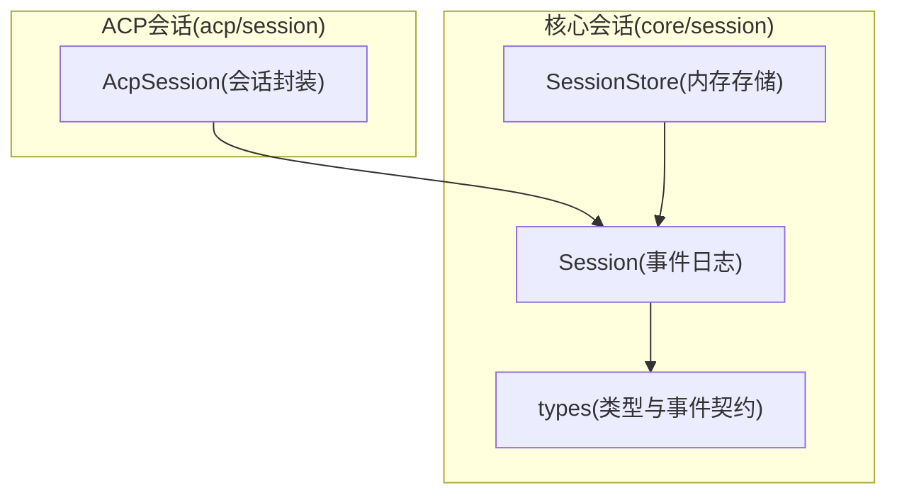
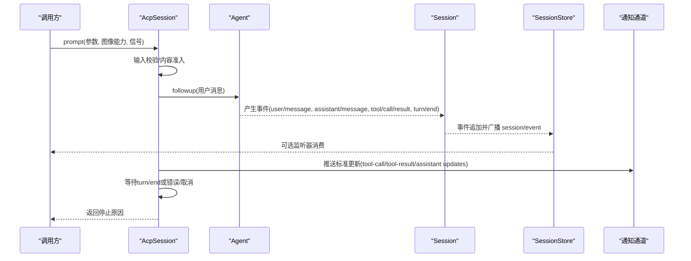
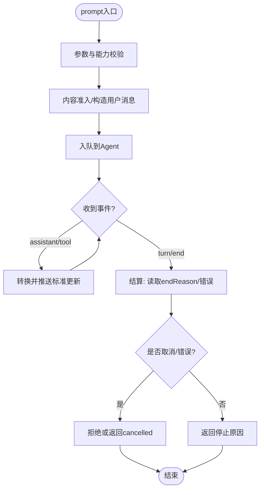
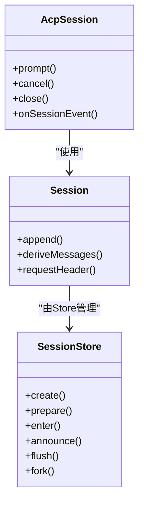

# Session会话类

<cite>
**本文引用的文件**
- [packages/core/session/src/index.ts](file://packages/core/session/src/index.ts)
- [packages/core/session/src/types.ts](file://packages/core/session/src/types.ts)
- [packages/acp/acp/src/session.ts](file://packages/acp/acp/src/session.ts)
</cite>

## 目录
1. [简介](#简介)
2. [项目结构](#项目结构)
3. [核心组件](#核心组件)
4. [架构总览](#架构总览)
5. [详细组件分析](#详细组件分析)
6. [依赖关系分析](#依赖关系分析)
7. [性能考量](#性能考量)
8. [故障排查指南](#故障排查指南)
9. [结论](#结论)
10. [附录：使用示例与最佳实践](#附录使用示例与最佳实践)

## 简介
本文件围绕“Session会话类”进行系统化文档化，聚焦以下目标：
- 解释Session的设计目的、使用场景与状态管理。
- 深入解析ACP会话（AcpSession）的run流程：输入规范化、通知订阅、事件收集与结果构建。
- 说明会话ID的生成与管理策略。
- 详解on_notification回调的工作原理与自定义通知处理。
- 阐述事件循环的实现要点：消息接收、状态检查、完成条件判断。
- 提供完整的使用示例与错误/超时处理的最佳实践。

## 项目结构
本仓库中与会话相关的核心实现位于core/session模块，同时ACP协议层通过AcpSession封装Agent生命周期与标准更新流。关键文件：
- core/session：事件溯源式会话、会话存储、类型定义、表面投影等。
- acp/session：ACP会话封装，负责提示词准入、模型选择、MCP挂载、通知推送与终止原因映射。

**图示来源**
- [packages/core/session/src/index.ts:423-756](file://packages/core/session/src/index.ts#L423-L756)
- [packages/core/session/src/index.ts:790-1157](file://packages/core/session/src/index.ts#L790-L1157)
- [packages/core/session/src/types.ts:21-418](file://packages/core/session/src/types.ts#L21-L418)
- [packages/acp/acp/src/session.ts:98-528](file://packages/acp/acp/src/session.ts#L98-L528)

**章节来源**
- [packages/core/session/src/index.ts:423-756](file://packages/core/session/src/index.ts#L423-L756)
- [packages/core/session/src/index.ts:790-1157](file://packages/core/session/src/index.ts#L790-L1157)
- [packages/core/session/src/types.ts:21-418](file://packages/core/session/src/types.ts#L21-L418)
- [packages/acp/acp/src/session.ts:98-528](file://packages/acp/acp/src/session.ts#L98-L528)

## 核心组件
- Session：事件溯源式会话，维护不可变追加日志、有序表面投影、派生消息历史、请求头折叠等。
- SessionStore：会话内存存储，负责会话创建、进入、公告、分离、持久化冲刷、分叉等。
- AcpSession：ACP协议会话封装，协调Agent生命周期、模型选择、MCP服务挂载、标准更新推送与终止原因映射。
- types：会话ID、事件类型、表面操作、轮次结束原因、请求头等类型契约。

**章节来源**
- [packages/core/session/src/index.ts:423-756](file://packages/core/session/src/index.ts#L423-L756)
- [packages/core/session/src/index.ts:790-1157](file://packages/core/session/src/index.ts#L790-L1157)
- [packages/core/session/src/types.ts:21-418](file://packages/core/session/src/types.ts#L21-L418)
- [packages/acp/acp/src/session.ts:98-528](file://packages/acp/acp/src/session.ts#L98-L528)

## 架构总览
ACP会话作为对外入口，内部委托Session进行事件溯源与消息历史推导；SessionStore提供会话生命周期管理与事件广播。

**图示来源**
- [packages/acp/acp/src/session.ts:246-334](file://packages/acp/acp/src/session.ts#L246-L334)
- [packages/core/session/src/index.ts:602-653](file://packages/core/session/src/index.ts#L602-L653)
- [packages/core/session/src/index.ts:959-994](file://packages/core/session/src/index.ts#L959-L994)

## 详细组件分析

### Session（事件溯源会话）
- 设计目的：以追加日志为唯一事实源，保证可重放、可分叉、可压缩；通过“表面”机制维护有序的LLM可见消息序列。
- 关键能力：
  - append：严格校验数据JSON可序列化、表面元数据合法性，冻结事件并广播session/event。
  - deriveMessages：基于表面节点增量推导消息历史，缓存避免重复计算。
  - requestHeader/requestContext：增量折叠请求头与上下文，支持比较与路由。
  - firstLiveSeq：区分种子历史与进程内新增事件的分界点。
- 复杂度：
  - append：O(1)追加+O(k)表面验证与快照，k为事件数据大小。
  - deriveMessages：首次O(n)，后续增量O(m)（m为新节点数）。
- 错误处理：对非法事件、非JSON值、非法表面操作抛出明确错误；观察者失败被隔离记录，不影响追加。

**章节来源**
- [packages/core/session/src/index.ts:423-756](file://packages/core/session/src/index.ts#L423-L756)
- [packages/core/session/src/index.ts:602-653](file://packages/core/session/src/index.ts#L602-L653)
- [packages/core/session/src/index.ts:668-697](file://packages/core/session/src/index.ts#L668-L697)
- [packages/core/session/src/index.ts:724-745](file://packages/core/session/src/index.ts#L724-L745)

### SessionStore（会话存储）
- 职责：会话准备、进入、公告、分离、冲刷、查找、列表、分叉。
- ID生成：未指定时自增生成“session-<n>”，确保唯一性。
- 事件流：
  - create/prepare+enter+announce：原子地注册会话并触发session/created。
  - flush：并行执行所有持久化监听器，统一失败聚合。
  - fork：从有效边界分叉子会话，校验边界连续性、不在开放轮次内。
- 并发与一致性：通过WeakMap绑定会话与条目，防止重复附加；在announcing/appending期间延迟detach，保证顺序。

**章节来源**
- [packages/core/session/src/index.ts:790-1157](file://packages/core/session/src/index.ts#L790-L1157)

### AcpSession（ACP会话封装）
- 设计目的：将ACP协议的提示词请求、标准更新、终止原因与底层Agent/Session解耦，提供幂等的prompt/cancel/close接口。
- run流程（prompt）：
  - 输入规范化：校验参数、图像能力、模型选择快照。
  - 准入与入队：admitAcpPrompt构造用户消息，followup入队。
  - 事件收集：onSessionEvent将assistant/message、tool/call、tool/result转换为标准更新并通过notify推送。
  - 结果构建：等待turn/end或错误/取消，映射为StopReason返回。
- 通知订阅：通过notify回调发送标准更新，拓扑变化也会异步推送配置选项更新。
- 会话ID：由上层传入或由Store生成，AcpSession不直接负责ID生成。
- 错误与取消：捕获入队失败、输出投递失败、Agent区间错误，统一转为协议安全错误；支持请求级AbortSignal取消。

**图示来源**
- [packages/acp/acp/src/session.ts:246-334](file://packages/acp/acp/src/session.ts#L246-L334)
- [packages/acp/acp/src/session.ts:348-392](file://packages/acp/acp/src/session.ts#L348-L392)
- [packages/acp/acp/src/session.ts:486-526](file://packages/acp/acp/src/session.ts#L486-L526)

**章节来源**
- [packages/acp/acp/src/session.ts:98-528](file://packages/acp/acp/src/session.ts#L98-L528)

### 事件循环与完成条件
- 消息接收：Session.append将事件追加到日志并广播；AcpSession.onSessionEvent消费并转化为标准更新。
- 状态检查：AcpSession跟踪inflight状态、消息是否已入队、turn编号、输出错误、Agent错误。
- 完成条件：
  - 正常：收到turn/end且endReason非error。
  - 取消：请求AbortSignal或显式cancel，返回cancelled。
  - 错误：输出投递失败或Agent区间错误，转为内部错误。
- 幂等与顺序：outputTail串行化更新推送，避免乱序；settleAfterQuiescence确保在空闲与输出队列排空后结算。

**章节来源**
- [packages/core/session/src/index.ts:602-653](file://packages/core/session/src/index.ts#L602-L653)
- [packages/acp/acp/src/session.ts:348-392](file://packages/acp/acp/src/session.ts#L348-L392)
- [packages/acp/acp/src/session.ts:486-526](file://packages/acp/acp/src/session.ts#L486-L526)

### 会话ID的生成与管理策略
- 生成策略：未指定时由SessionStore自增生成“session-<n>”，确保唯一；也可外部传入固定ID。
- 管理策略：
  - prepare：仅构造Session，不进入存储。
  - enter：加入存储并安装发布钩子，返回detach disposer。
  - announce：触发session/created，失败则回滚。
  - detach：移除存储项并触发session/disposed。
- 分叉：fork基于有效边界复制前缀，保持seedLength与parentSession关系。

**章节来源**
- [packages/core/session/src/index.ts:828-887](file://packages/core/session/src/index.ts#L828-L887)
- [packages/core/session/src/index.ts:911-994](file://packages/core/session/src/index.ts#L911-L994)
- [packages/core/session/src/index.ts:1079-1136](file://packages/core/session/src/index.ts#L1079-L1136)

### on_notification回调与自定义通知处理
- 工作原理：AcpSession通过notify将标准更新（工具调用、工具结果、助手消息片段等）推送到上层；拓扑变化会异步推送配置选项更新。
- 自定义处理：上层可在notify中实现UI渲染、遥测上报、审计日志等；需保证幂等与容错（异常被捕获并记录）。
- 顺序保障：outputTail串行化推送，避免并发导致的乱序。

**章节来源**
- [packages/acp/acp/src/session.ts:214-237](file://packages/acp/acp/src/session.ts#L214-L237)
- [packages/acp/acp/src/session.ts:348-392](file://packages/acp/acp/src/session.ts#L348-L392)

## 依赖关系分析
- AcpSession依赖：
  - Agent：负责实际推理与工具执行。
  - Session：用于事件溯源与消息历史推导。
  - AcpModelControl：模型选择与路由控制。
  - MCP服务：通过mountAcpMcpServers挂载。
- Session依赖：
  - SurfaceManager：维护有序表面与投影。
  - SessionStore：会话生命周期与事件广播。
  - types：事件类型与契约。

**图示来源**
- [packages/acp/acp/src/session.ts:98-528](file://packages/acp/acp/src/session.ts#L98-L528)
- [packages/core/session/src/index.ts:423-756](file://packages/core/session/src/index.ts#L423-L756)
- [packages/core/session/src/index.ts:790-1157](file://packages/core/session/src/index.ts#L790-L1157)

**章节来源**
- [packages/acp/acp/src/session.ts:98-528](file://packages/acp/acp/src/session.ts#L98-L528)
- [packages/core/session/src/index.ts:423-756](file://packages/core/session/src/index.ts#L423-L756)
- [packages/core/session/src/index.ts:790-1157](file://packages/core/session/src/index.ts#L790-L1157)

## 性能考量
- 事件追加与观察：append路径无I/O阻塞，观察者失败隔离；适合高频追加。
- 消息历史推导：增量缓存，首次O(n)，后续增量O(m)。
- 通知推送：outputTail串行化，避免竞争；批量更新建议合并。
- 分叉与恢复：fork基于事件切片，避免全量拷贝；恢复时深度冻结减少内存占用。

[本节为通用指导，无需特定文件引用]

## 故障排查指南
- 常见错误：
  - 事件信封非法：检查type/seq/time/data字段与类型。
  - 非JSON可序列化数据：确保data不含BigInt/函数/符号等。
  - 表面操作非法：确认surfaceOp与sourceEventSeqs合法。
  - 分叉边界无效：确保边界为连续seq且不在开放轮次内。
- 定位方法：
  - 查看session/event监听器输出的事件序列。
  - 检查AcpSession的inflight状态与输出错误。
  - 使用Session.deriveMessages获取最终消息历史。

**章节来源**
- [packages/core/session/src/index.ts:213-248](file://packages/core/session/src/index.ts#L213-L248)
- [packages/core/session/src/index.ts:602-653](file://packages/core/session/src/index.ts#L602-L653)
- [packages/core/session/src/index.ts:1079-1136](file://packages/core/session/src/index.ts#L1079-L1136)

## 结论
Session以事件溯源为核心，提供强一致、可重放、可分叉的会话模型；AcpSession在此基础上封装ACP协议交互，标准化输入、通知与结果。通过严格的类型契约与表面机制，系统在保证性能的同时实现了高可靠性与可观测性。

[本节为总结，无需特定文件引用]

## 附录：使用示例与最佳实践
以下为典型使用流程与最佳实践（以伪代码形式描述，具体实现请参考对应源码位置）：

- 创建会话与运行
  - 通过SessionStore.prepare/create准备会话，enter+announce进入存储并发布创建事件。
  - 使用AcpSession.create/resume建立会话，传入cwd、MCP、AgentOptions、fallbackSelection与notify。
  - 调用prompt提交用户消息，等待返回停止原因。
  - 参考路径：
    - [packages/core/session/src/index.ts:828-887](file://packages/core/session/src/index.ts#L828-L887)
    - [packages/acp/acp/src/session.ts:126-172](file://packages/acp/acp/src/session.ts#L126-L172)
    - [packages/acp/acp/src/session.ts:246-334](file://packages/acp/acp/src/session.ts#L246-L334)

- 通知订阅与自定义处理
  - 在notify中实现UI更新、遥测、审计等；确保异常捕获与幂等。
  - 参考路径：
    - [packages/acp/acp/src/session.ts:214-237](file://packages/acp/acp/src/session.ts#L214-L237)
    - [packages/acp/acp/src/session.ts:348-392](file://packages/acp/acp/src/session.ts#L348-L392)

- 错误处理与超时
  - 使用AbortSignal支持请求级取消；AcpSession会传播取消并返回cancelled。
  - 捕获输出投递失败与Agent区间错误，统一转为协议安全错误。
  - 参考路径：
    - [packages/acp/acp/src/session.ts:272-334](file://packages/acp/acp/src/session.ts#L272-L334)
    - [packages/acp/acp/src/session.ts:486-526](file://packages/acp/acp/src/session.ts#L486-L526)

- 会话ID管理
  - 未指定时由Store自动生成“session-<n>”；也可外部传入固定ID。
  - 通过fork基于有效边界创建子会话，保持父子关系与种子边界。
  - 参考路径：
    - [packages/core/session/src/index.ts:828-887](file://packages/core/session/src/index.ts#L828-L887)
    - [packages/core/session/src/index.ts:1079-1136](file://packages/core/session/src/index.ts#L1079-L1136)