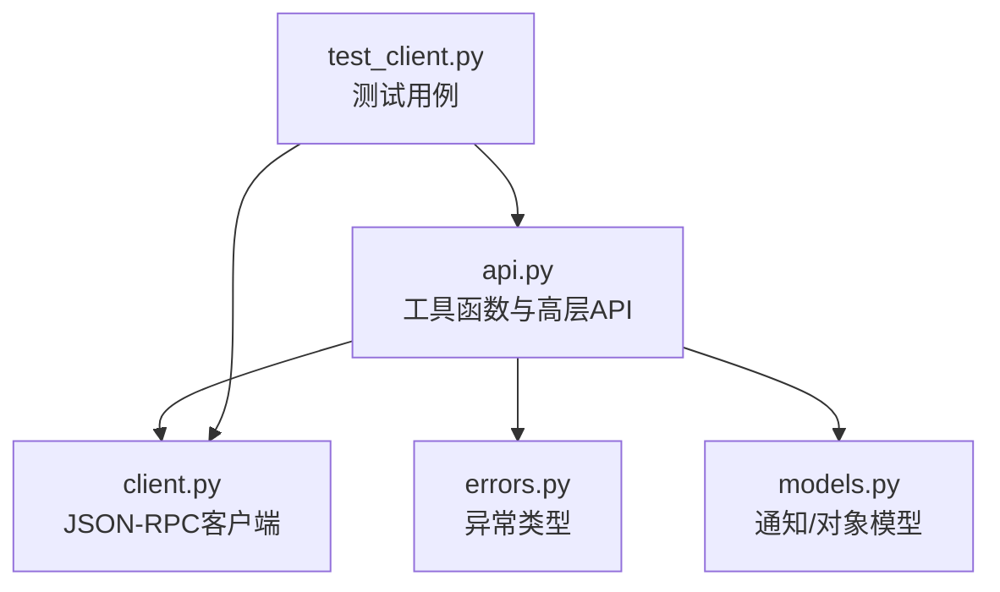
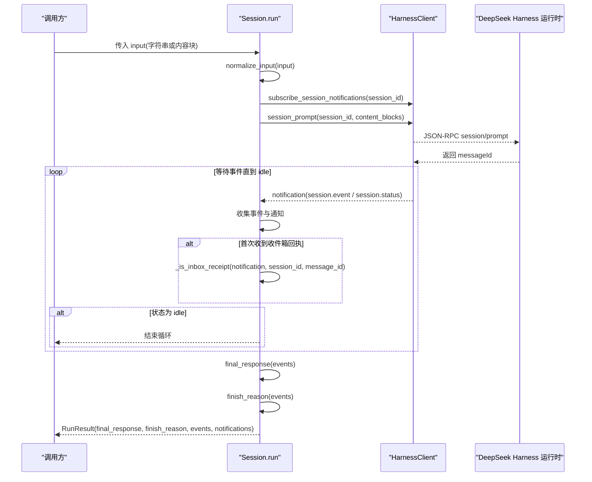
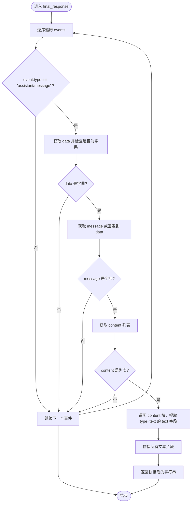
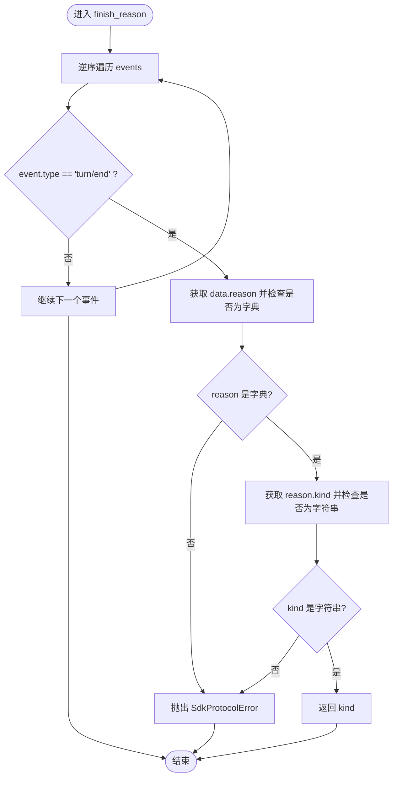
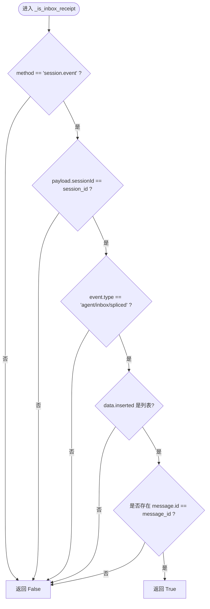
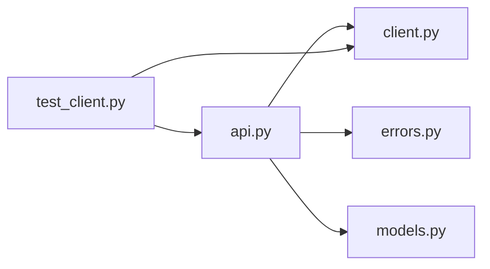

# 工具函数

<cite>
**本文引用的文件**
- [api.py](file://python/sdk/src/deepseek_harness/api.py)
- [client.py](file://python/sdk/src/deepseek_harness/client.py)
- [errors.py](file://python/sdk/src/deepseek_harness/errors.py)
- [models.py](file://python/sdk/src/deepseek_harness/models.py)
- [test_client.py](file://python/sdk/tests/test_client.py)
</cite>

## 目录
1. [简介](#简介)
2. [项目结构](#项目结构)
3. [核心组件](#核心组件)
4. [架构总览](#架构总览)
5. [详细组件分析](#详细组件分析)
6. [依赖关系分析](#依赖关系分析)
7. [性能考量](#性能考量)
8. [故障排查指南](#故障排查指南)
9. [结论](#结论)
10. [附录](#附录)

## 简介
本文件聚焦 Python SDK 中的工具函数，围绕以下四个关键函数进行深度说明：
- normalize_input()：将用户输入统一转换为内容块列表。
- final_response()：从事件流中定位并拼接最终响应文本。
- finish_reason()：解析最后一个 turn/end 事件的完成原因。
- _is_inbox_receipt()：确认消息是否已入收件箱（会话与消息ID双重校验）。

文档同时提供使用示例、边界情况处理建议、错误处理策略与性能优化要点，帮助读者安全高效地使用这些工具函数。

## 项目结构
Python SDK 的核心逻辑集中在以下模块：
- api.py：暴露高层 API 与工具函数（normalize_input、final_response、finish_reason、_is_inbox_receipt）。
- client.py：JSON-RPC 客户端，负责启动运行时、发送请求、订阅与路由通知。
- errors.py：异常类型定义（如 SdkProtocolError、JsonRpcError、TransportClosedError）。
- models.py：通用数据结构（Notification、JsonObject 等）。
- test_client.py：覆盖上述工具函数的行为与边界用例。

图表来源
- [api.py:134-189](file://python/sdk/src/deepseek_harness/api.py#L134-L189)
- [client.py:172-189](file://python/sdk/src/deepseek_harness/client.py#L172-L189)
- [errors.py:4-24](file://python/sdk/src/deepseek_harness/errors.py#L4-L24)
- [models.py:13-17](file://python/sdk/src/deepseek_harness/models.py#L13-L17)

章节来源
- [api.py:134-189](file://python/sdk/src/deepseek_harness/api.py#L134-L189)
- [client.py:172-189](file://python/sdk/src/deepseek_harness/client.py#L172-L189)
- [errors.py:4-24](file://python/sdk/src/deepseek_harness/errors.py#L4-L24)
- [models.py:13-17](file://python/sdk/src/deepseek_harness/models.py#L13-L17)
- [test_client.py:16-125](file://python/sdk/tests/test_client.py#L16-L125)

## 核心组件
- Session.run：编排一次对话轮次，收集事件与通知，调用工具函数生成结果。
- normalize_input：标准化输入为内容块列表。
- final_response：逆向遍历事件，查找 assistant/message 并拼接文本内容。
- finish_reason：逆向遍历事件，定位最后一个 turn/end 并提取 reason.kind。
- _is_inbox_receipt：校验 session.event 是否为 agent/inbox/spliced，且包含当前会话与消息ID。

章节来源
- [api.py:134-189](file://python/sdk/src/deepseek_harness/api.py#L134-L189)
- [api.py:192-208](file://python/sdk/src/deepseek_harness/api.py#L192-L208)
- [api.py:211-228](file://python/sdk/src/deepseek_harness/api.py#L211-L228)
- [api.py:231-248](file://python/sdk/src/deepseek_harness/api.py#L231-L248)

## 架构总览
下图展示了一次 run 的端到端流程：Session.run 调用工具函数，结合客户端订阅的事件流，产出 RunResult。

图表来源
- [api.py:134-189](file://python/sdk/src/deepseek_harness/api.py#L134-L189)
- [client.py:172-189](file://python/sdk/src/deepseek_harness/client.py#L172-L189)

## 详细组件分析

### normalize_input()
- 功能：将输入统一为内容块列表。若输入为字符串，则包装为单条文本内容块；若已是列表，则直接返回。
- 复杂度：O(1)。
- 边界情况：
  - 空字符串：返回包含空文本的内容块列表。
  - 非字符串且非列表：由调用方保证类型（在 Session.run 中作为 list[JsonObject] 传递）。
- 使用示例：
  - 字符串输入："你好" → [{"type": "text", "text": "你好"}]
  - 内容块输入：直接透传。
- 参考路径
  - [api.py:205-208](file://python/sdk/src/deepseek_harness/api.py#L205-L208)

章节来源
- [api.py:205-208](file://python/sdk/src/deepseek_harness/api.py#L205-L208)

### final_response()
- 功能：从事件列表中逆向查找最近的 assistant/message 事件，提取其 message.content 中所有 type=text 的内容块，按顺序拼接成最终响应文本。
- 算法步骤：
  1) 逆序遍历 events。
  2) 筛选 event.type == "assistant/message"。
  3) 获取 data.message（若不存在则回退到 data），确保其为字典。
  4) 读取 content 列表，过滤出 type=text 的块，提取 text 字段并拼接。
  5) 若未找到任何匹配事件，返回空字符串。
- 复杂度：O(N)，N 为事件数量。
- 边界情况：
  - 无 assistant/message 事件：返回空字符串。
  - content 为空或非列表：跳过该事件。
  - 文本内容为 None：视为空串。
- 使用示例：
  - 事件流包含多条 assistant/message：取最近的一条，拼接其中所有文本块。
  - 事件流不包含 assistant/message：返回空字符串。
- 参考路径
  - [api.py:211-228](file://python/sdk/src/deepseek_harness/api.py#L211-L228)

图表来源
- [api.py:211-228](file://python/sdk/src/deepseek_harness/api.py#L211-L228)

章节来源
- [api.py:211-228](file://python/sdk/src/deepseek_harness/api.py#L211-L228)

### finish_reason()
- 功能：返回最后一个 turn/end 事件的完成原因 kind。
- 算法步骤：
  1) 逆序遍历 events。
  2) 筛选 event.type == "turn/end"。
  3) 获取 data.reason.kind，要求为字符串。
  4) 若缺失或类型不符，抛出 SdkProtocolError。
  5) 若未找到 turn/end 事件，返回 None。
- 复杂度：O(N)。
- 边界情况：
  - 无 turn/end 事件：返回 None。
  - reason 缺失或 kind 非字符串：抛出协议错误。
- 使用示例：
  - 事件流末尾为 turn/end(reason.kind="completed")：返回 "completed"。
  - 事件流末尾为 turn/end(reason.kind="max-tokens")：返回 "max-tokens"。
  - 事件流缺少 turn/end：返回 None。
- 参考路径
  - [api.py:231-248](file://python/sdk/src/deepseek_harness/api.py#L231-L248)
  - [errors.py:12-14](file://python/sdk/src/deepseek_harness/errors.py#L12-L14)

图表来源
- [api.py:231-248](file://python/sdk/src/deepseek_harness/api.py#L231-L248)
- [errors.py:12-14](file://python/sdk/src/deepseek_harness/errors.py#L12-L14)

章节来源
- [api.py:231-248](file://python/sdk/src/deepseek_harness/api.py#L231-L248)
- [errors.py:12-14](file://python/sdk/src/deepseek_harness/errors.py#L12-L14)

### _is_inbox_receipt()
- 功能：判断一条通知是否为“收件箱回执”，即确认本次 prompt 的消息已被插入收件箱。
- 校验规则：
  1) notification.method 必须为 "session.event"。
  2) payload.sessionId 必须等于当前 session_id。
  3) payload.event.type 必须为 "agent/inbox/spliced"。
  4) payload.event.data.inserted 必须为列表，且至少包含一个 id 等于 message_id 的消息。
- 复杂度：O(M)，M 为 inserted 列表长度。
- 边界情况：
  - sessionId 不匹配：返回 False。
  - event 类型不是 spliced：返回 False。
  - inserted 缺失或为空：返回 False。
  - 未找到匹配的 message_id：返回 False。
- 使用示例：
  - 回执包含 {"id": "message-1"} 且传入 message_id 为 "message-1"：返回 True。
  - 其他情况：返回 False。
- 参考路径
  - [api.py:192-202](file://python/sdk/src/deepseek_harness/api.py#L192-L202)

图表来源
- [api.py:192-202](file://python/sdk/src/deepseek_harness/api.py#L192-L202)

章节来源
- [api.py:192-202](file://python/sdk/src/deepseek_harness/api.py#L192-L202)

## 依赖关系分析
- api.py 依赖：
  - client.py：用于启动运行时、发送 session/prompt、订阅通知。
  - errors.py：用于抛出协议错误。
  - models.py：用于 Notification、JsonObject 类型。
- 测试覆盖：
  - test_client.py 验证了 final_response 与 finish_reason 的行为，包括多轮事件、缺失 reason.kind 的错误路径。

图表来源
- [api.py:134-189](file://python/sdk/src/deepseek_harness/api.py#L134-L189)
- [client.py:172-189](file://python/sdk/src/deepseek_harness/client.py#L172-L189)
- [errors.py:4-24](file://python/sdk/src/deepseek_harness/errors.py#L4-L24)
- [models.py:13-17](file://python/sdk/src/deepseek_harness/models.py#L13-L17)
- [test_client.py:16-125](file://python/sdk/tests/test_client.py#L16-L125)

章节来源
- [api.py:134-189](file://python/sdk/src/deepseek_harness/api.py#L134-L189)
- [client.py:172-189](file://python/sdk/src/deepseek_harness/client.py#L172-L189)
- [errors.py:4-24](file://python/sdk/src/deepseek_harness/errors.py#L4-L24)
- [models.py:13-17](file://python/sdk/src/deepseek_harness/models.py#L13-L17)
- [test_client.py:16-125](file://python/sdk/tests/test_client.py#L16-L125)

## 性能考量
- 事件遍历：
  - final_response 与 finish_reason 均采用逆序遍历，时间复杂度 O(N)。对于长会话，建议在上层对事件进行分页或限制范围，避免全量扫描。
- 内存占用：
  - 事件列表可能较大，建议在应用层按需保留必要事件，或在持久化后仅加载近期事件进行分析。
- 通知处理：
  - 使用订阅机制时，注意及时 drain 通知队列，避免阻塞主循环。
- 超时与关闭：
  - 合理设置 initialize_timeout_seconds 与 request_timeout_seconds，防止长时间阻塞。
  - close() 会尝试优雅关闭并强制终止，确保资源释放。

## 故障排查指南
- 常见错误：
  - SdkProtocolError：当 turn/end 事件缺少有效的 reason.kind 时抛出。检查运行时是否正确发出 turn/end 事件。
  - JsonRpcError：运行时返回 JSON-RPC 错误。查看错误码与消息，必要时附加诊断信息。
  - TransportClosedError：运行时进程退出或 stdout 关闭。检查进程状态与 stderr 输出。
- 调试建议：
  - 打印或记录 events 与 notifications，确认事件顺序与结构。
  - 使用测试脚本模拟运行时，验证工具函数在不同事件组合下的行为。
- 参考路径
  - [errors.py:4-24](file://python/sdk/src/deepseek_harness/errors.py#L4-L24)
  - [test_client.py:167-199](file://python/sdk/tests/test_client.py#L167-L199)

章节来源
- [errors.py:4-24](file://python/sdk/src/deepseek_harness/errors.py#L4-L24)
- [test_client.py:167-199](file://python/sdk/tests/test_client.py#L167-L199)

## 结论
本文档深入解析了 Python SDK 中的四个关键工具函数，明确了它们的输入输出、处理逻辑与边界条件。通过流程图与序列图展示了数据流转与控制流，并结合测试用例验证了行为一致性。在实际使用中，建议关注事件规模与性能优化，妥善处理异常与超时，以确保稳定高效的运行体验。

## 附录
- 使用示例（基于测试）：
  - 字符串输入转内容块：调用 Session.run("say hello")，内部通过 normalize_input 转为文本块。
  - 最终响应提取：事件流中包含 assistant/message，final_response 拼接文本块得到响应。
  - 完成原因解析：事件流末尾为 turn/end(reason.kind="max-tokens")，finish_reason 返回对应值。
  - 收件箱回执校验：首次收到 agent/inbox/spliced 且包含 message_id，_is_inbox_receipt 返回 True。
- 参考路径
  - [test_client.py:16-125](file://python/sdk/tests/test_client.py#L16-L125)
  - [api.py:134-189](file://python/sdk/src/deepseek_harness/api.py#L134-L189)